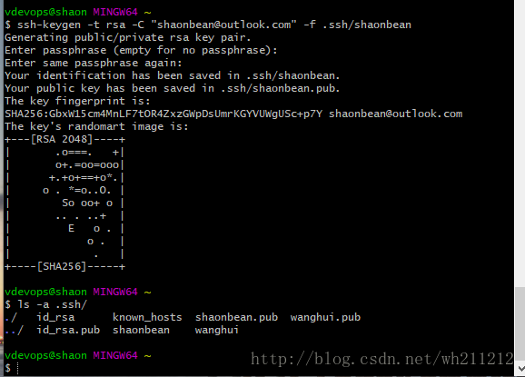
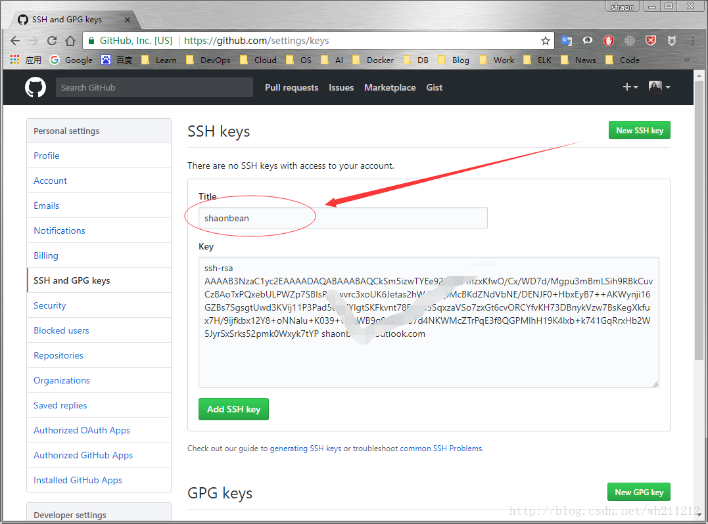
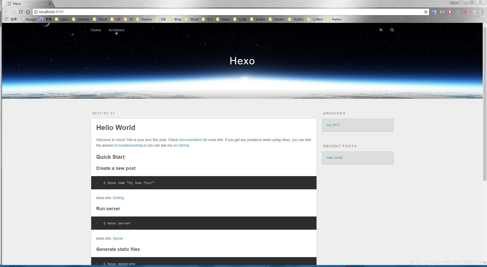
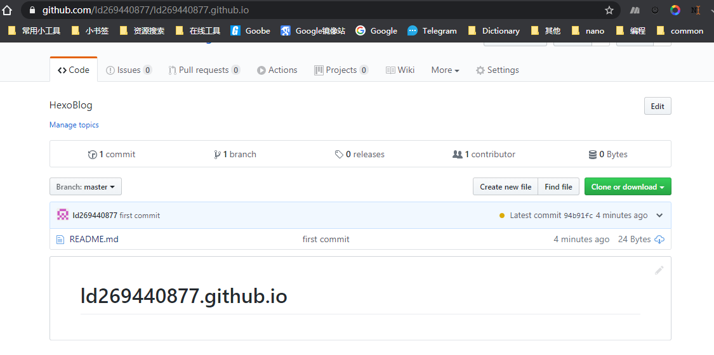
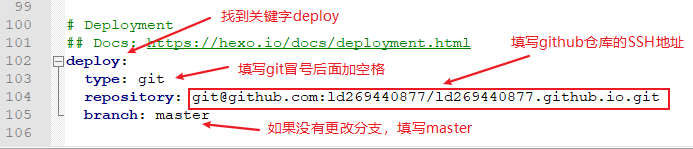

> 喜欢写Blog的人，会经历三个阶段
>> 第一阶段，刚接触Blog，觉得很新鲜，试着选择一个免费空间来写。
>>> 第二阶段，发现免费空间限制太多，就自己购买域名和空间，搭建独立博客。
>>>> 第三阶段，觉得独立博客的管理太麻烦，最好在保留控制权的前提下，让别人来管，自己只负责写文章。  

# win10+hexo+github搭建个人博客
> 参考：
> 1. https://hexo.io/，博客用于记录自己的学习工作历程
> 2. [win10+hexo+github搭建个人博客](http://www.suoniao.com/article/13253)
> 3. [Win10 搭建Hexo博客完全教程 - erchowyo的专栏](https://blog.csdn.net/erchowyo/article/details/54407601)
> 4. [windows环境下使用hexo搭建blog平台 | 叶落阁](https://yelog.org/2017/03/17/windows-hexo/)
> 5. [Themes | Hexo](https://hexo.io/themes/#clean)
## Hexo简介
Hexo的作者是[tommy351](https://github.com/hexojs/hexo)，Hexo是一个简单、快速、强大的博客发布工具，支持Markdown格式。hexo的主题列表 Hexo Themes。

## 安装git 和 node.js
> win10+Node.js+git+github
>- Node.js下载地址：https://nodejs.org/en/download/
>- Git下载地址：https://git-scm.com/
>- Github 地址：https://github.com
安装node.js 和 git 步骤省略，按默认傻瓜式安装即可
### 安装git
1).下载：从官网下载windows版本的git,地址在下方。
https://git-scm.com/download/win
2).安装：双击安装，一直点击下一步即可

### 安装node.js
1).下载：从官网下载windows版本的node.js安装包（.msi后缀），地址下方
https://nodejs.org/zh-cn/download/
2).安装：双击安装，一直点击下一步即可

## github的注册与配置
> 参考workspace/ubuntu1804_configure.md at master · ld269440877/workspace
https://github.com/ld269440877/workspace/blob/master/ubuntu1804_configure/ubuntu1804_configure.md
> Anaconda+vscode
>- git配置
>- Git使用
>- GitHub使用
1. 注册github账号并创建一个以 <font color=red>github昵称</font>.github.io 命名的仓库
ld269440877/ld269440877.github.io
https://github.com/ld269440877/<font color=red>ld269440877</font>.github.io

> 根据图中，注册一个github账号，昵称自定义，然后创建一个新项目，名字为：github昵称.github.io
参考教程的github昵称是shaonbean，我的github昵称是ld269440877  
2. 项目创建完成之后，本地生成ssh 私钥和公钥，用于连接github认证，使用上面下载的git，打开git bash


```bash
ssh-keygen -t rsa -C "github注册邮箱（自定义）" -f .ssh/shaonbean
# -f 输出以昵称命名的公钥和私钥，方便记忆
```
3. 公钥生成之后加到github上，方便后面的使用，用户本地和github进行ssh通信
公钥在.ssh文件夹下的id_rsa.pub文件中


4. git bash将本地文件与github远程仓库建立关联
```bash
Administrator@DESKTOP-BQFQLO2 MINGW64 /c/Users
$ git clone git@github.com:ld269440877/ld269440877.github.io.git

Administrator@DESKTOP-BQFQLO2 MINGW64 /c/Users
$ cd ld269440877.github.io/

Administrator@DESKTOP-BQFQLO2 MINGW64 /c/Users/ld269440877.github.io (master)
$ pwd
/c/Users/ld269440877.github.io

Administrator@DESKTOP-BQFQLO2 MINGW64 /c/Users/ld269440877.github.io (master)
$ mkdir HexoBlog

Administrator@DESKTOP-BQFQLO2 MINGW64 /c/Users/ld269440877.github.io (master)
$ cd HexoBlog/

Administrator@DESKTOP-BQFQLO2 MINGW64 /c/Users/ld269440877.github.io (master)
$ ls
```
> 注意：初始化blog前文件夹HexoBlog必须是空的

## 安装配置hexo
> 注：hexo安装前提需安装node.js 和git
hexo官网：https://hexo.io/
hexo官方文档：https://hexo.io/docs/  
### 安装Node
到Node.js官网下载相应平台的最新版本，安装即可，不需要配置环境变量
### 安装Hexo
- 打开Git Bash工具（前提确保Node.js已经安装），在打开的命令窗内输入下面的命令进行安装
```bash
Administrator@DESKTOP-BQFQLO2 MINGW64 /c/Users/ld269440877.github.io (master)
$ cd HexoBlog/

Administrator@DESKTOP-BQFQLO2 MINGW64 /c/Users/ld269440877.github.io (master)
$ npm install hexo-cli -g
```
- 安装过后，输入 hexo -v，出现下面信息，则表示安装成功
```bash
Administrator@DESKTOP-BQFQLO2 MINGW64 /c/Users/ld269440877.github.io (master)
$ hexo -v
hexo-cli: 3.1.0
os: Windows_NT 10.0.18363 win32 x64
node: 12.14.0
v8: 7.7.299.13-node.16
uv: 1.33.1
zlib: 1.2.11
brotli: 1.0.7
ares: 1.15.0
modules: 72
nghttp2: 1.39.2
napi: 5
llhttp: 1.1.4
http_parser: 2.8.0
openssl: 1.1.1d
cldr: 35.1
icu: 64.2
tz: 2019c
unicode: 12.1
```

### 部署Hexo初始化博客
```bash
Administrator@DESKTOP-BQFQLO2 MINGW64 /c/Users/ld269440877.github.io/HexoBlog (master)
$ pwd
/c/Users/ld269440877.github.io/HexoBlog
```
- 这里以HexoBlog为博客目录，执行下面命令
```bash
Administrator@DESKTOP-BQFQLO2 MINGW64 /c/Users/ld269440877.github.io/HexoBlog (master)
$ hexo init
INFO  Cloning hexo-starter https://github.com/hexojs/hexo-starter.git
Cloning into 'C:\Users\ld269440877.github.io\HexoBlog'...
remote: Enumerating objects: 30, done.

Administrator@DESKTOP-BQFQLO2 MINGW64 /c/Users/ld269440877.github.io/HexoBlog (master)
$ ls
_config.yml    package.json       scaffolds/  themes/
node_modules/  package-lock.json  source/

Administrator@DESKTOP-BQFQLO2 MINGW64 /c/Users/ld269440877.github.io/HexoBlog (master)
$ hexo server
INFO  Start processing
INFO  Hexo is running at http://localhost:4000 . Press Ctrl+C to stop.
```

- 测试本地建站是否成功，输入：
在浏览器输入 <127.0.0.1:4000> 或者 <http://localhost:4000/>就可以访问到刚刚创建好的blog了。

- 初始化博客以后，能看到下图：


### 配置git 管理/ld269440877.github.io仓库下的HexoBlog (master)
```bash
Administrator@DESKTOP-BQFQLO2 MINGW64 /c/Users/ld269440877.github.io/HexoBlog (master)
$ echo "# ld269440877.github.io" >> README.md

Administrator@DESKTOP-BQFQLO2 MINGW64 /c/Users/ld269440877.github.io/HexoBlog (master)
$ git init
Initialized empty Git repository in C:/Users/HexoBlog/.git/

Administrator@DESKTOP-BQFQLO2 MINGW64 /c/Users/ld269440877.github.io/HexoBlog (master)
$ git add .
warning: LF will be replaced by CRLF in HexoBlog/package.json.
The file will have its original line endings in your working directory.


Administrator@DESKTOP-BQFQLO2 MINGW64 /c/Users/ld269440877.github.io/HexoBlog (master)
$ git commit -m "HexoBlog is fist committed "
[master dd5489e] HexoBlog is fist committed
 93 files changed, 9441 insertions(+)
 create mode 100644 HexoBlog/.gitignore
 create mode 100644 HexoBlog/_config.yml
...

Administrator@DESKTOP-BQFQLO2 MINGW64 /c/Users/ld269440877.github.io/HexoBlog (master)
$ git remote add origin git@github.com:ld269440877/ld269440877.github.io.git

Administrator@DESKTOP-BQFQLO2 MINGW64 /c/Users/ld269440877.github.io/HexoBlog (master)
$ git push -u origin master
Counting objects: 3, done.
Writing objects: 100% (3/3), 234 bytes | 234.00 KiB/s, done.
Total 3 (delta 0), reused 0 (delta 0)
To github.com:ld269440877/ld269440877.github.io.git
 * [new branch]      master -> master
Branch 'master' set up to track remote branch 'master' from 'origin'.

Administrator@DESKTOP-BQFQLO2 MINGW64 /c/Users/ld269440877.github.io/HexoBlog (master)
$ ls
_config.yml  node_modules/  package-lock.json  source/
db.json      package.json   scaffolds/         themes/

Administrator@DESKTOP-BQFQLO2 MINGW64 /c/Users/ld269440877.github.io/HexoBlog (master)
$ pwd
/c/Users/ld269440877.github.io/HexoBlog
```

### 换皮肤
在[官网](https://hexo.io/themes/) 可以查看各种各样的皮肤，挑选自己喜欢的皮肤
这里以 3-hexo 这款皮肤为例（这款皮肤是笔者写的，效果可查看 <yelog.org>）
1）进入皮肤的 github 官网，如[3-hexo](https://github.com/yelog/hexo-theme-3-hexo)的网址
找到 clone or download ,复制它的url：https://github.com/yelog/hexo-theme-3-hexo.git

2）进入 /c/Users/ld269440877.github.io/HexoBlog 目录，打开 git bash 命令框，执行以下命令将皮肤下载到themes目录下
`$ git clone https://github.com/yelog/hexo-theme-3-hexo.git themes/3-hexo`
3) 修改 HexoBlog/_config.yml 中的 theme: landscape 为 theme: 3-hexo
> 如果使用 3-hexo 主题的话，还需要注意两点
①因为主题使用了自己的高亮效果，还需要修改 highlight enable: true 的 true 改为 highlight enable: false。
②由于主题启用了文章字数统计功能，需要安装一个插件，在 HexoBlog 目录下，打开 git bash 命令框，执行 `npm i --save hexo-wordcount` 即可
4) 重新渲染，启动服务器
```bash
Administrator@DESKTOP-BQFQLO2 MINGW64 /c/Users/ld269440877.github.io/HexoBlog (master)
$ hexo clean && hexo g && hexo s

```

5) 打开浏览器查看效果，换肤成功
```bash
Administrator@DESKTOP-BQFQLO2 MINGW64 /c/Users/ld269440877.github.io/HexoBlog (master)
$ hexo server
INFO  Start processing
INFO  Hexo is running at http://localhost:4000 . Press Ctrl+C to stop.
```
6) 修改博客的连接和样式，编辑HexoBlog/themes/3-hexo (master)下的_config.yml
```bash
Administrator@DESKTOP-BQFQLO2 MINGW64 /c/Users/ld269440877.github.io/HexoBlog/themes/3-hexo (master)
$ pwd
/c/Users/ld269440877.github.io/HexoBlog/themes/3-hexo

Administrator@DESKTOP-BQFQLO2 MINGW64 /c/Users/ld269440877.github.io/HexoBlog/themes/3-hexo (master)
$ ls
'_config - 副本.yml'   _config.yml   layout/   README.md   source/
```
## 如何写文章
文章在 myblog/source/_posts/ 下，以markdown格式写成，笔者推荐使用atom作为写作工具。
可以通过 hexo new 文章名 来创建一篇文章，当然也可以直接在 _posts 目录下直接新建.md文件。
```bash
Administrator@DESKTOP-BQFQLO2 MINGW64 /c/Users/ld269440877.github.io/HexoBlog/source/_posts (master)
$ pwd
/c/Users/ld269440877.github.io/HexoBlog/source/_posts
```
执行命令 仍是在 myblog 目录下，打开 git bash 命令框。以下是常用命令，其他可以查阅官网。
```bash
# 创建一个标题为“git教程”的文章
$ hexo new "git教程"

# 清除所有渲染的页面
$ hexo clean

# 将markdown渲染成页面
$ hexo g

# 启动hexo
$ hexo s
```
## 发布到Githup
(1) 复制SSH类型地址。
登录Github打开自己的项目 username.github.io、打开之后，点击SSH，选择SSH类型地址，并复制地址：git@github.com:ld269440877/ld269440877.github.io.git
(2) 找到并打开站点配置文件文件。
打开你一开始创建的Hexo文件夹（如C:\Users\ld269440877.github.io\HexoBlog），用编辑器打开刚文件夹下的_config.yml文件
(3) 修改配置文件。
在配置文件里作如下修改，保存。

(4) 执行发布相关的命令。
依次执行如下命令：
```bash
$ hexo clean (清除缓存)

$ hexo generate(hexo g生成，每次修改本地文件后，需要才能保存)

$ hexo server($ hexo s启动服务预览)
# 注：(1) 执行第三条命令hexo s启动服务预览后，可刷新浏览器：localhost:4000 查看。
$ hexo deploy($ hexo d部署)
'''
执行第四条命令hexo d部署时，若出现如下错误：ERROR Deployer not found: git
，则执行命令行：$ npm install hexo-deployer-git --save；
'''
#若发布成功了，则gitbash显示：INFO Deploy done: git
"""
若还是不能解决，则先删除Hexo文件下的.deploy_git文件夹(如果没有这个文件夹，就忽略它)，
然后执行：$ git config --global core.autocrlf false，然后重新执行上面四条命令即可。
"""
```
> 每次文件有修改，都要相应执行这四条命令
>- $ `hexo clean` (清除缓存)
>- $ `hexo generate`(hexo g生成，每次修改本地文件后，需要才能保存)  
>- $ `hexo server` ($ hexo s启动服务预览)  
>- $ `hexo deploy`($ hexo d部署)  

(5) 测试网站。
 https://username .github.io/就是你的专属博客网址了。
打开网址https://username.githup.io/进行验证是否成功，我的是https://ld269440877.github.io/

(6）修改博客头像和微信支付宝付款二维码图片


- HexoBlog的img路径：
    - C:\Users\ld269440877.github.io\img  #hexo 根目录
    - C:\Users\ld269440877.github.io\HexoBlog\public\img
```bash
# 每次文件有修改，都要相应执行这四条命令
hexo clean && hexo g && hexo s
# 浏览器中查看网页博客
http://localhost:4000
```


