大学英语的特点：
<table><tr><td bgcolor=yellow>题文同序，平均分布</td></tr></table>

[TOC]
Pronunciation
The basic principle underlying the suggested pronunciations is “If you pronounce it like this, most people will understand you.” The pronunciations are therefore broadly based on the two most widely taught accents of English, GenAm or General American for American English, and RP or Received Pronunciation for British English.
For the majority of words, a single pronunciation is given, as most differences between American and British pronunciation are systematic. Where more than one pronunciation is common and the difference is not accounted for in the notes below, alternative pronunciations are given.
The pronunciations are the result of a program of monitoring spoken English and consulting leading reference works. The transcription system has developed from original work by Dr David Brazil for the Collins COBUILD English Language Dictionary. The symbols used in the dictionary are adapted from those of the International Phonetic Alphabet (IPA), as standardized in the English Pronouncing Dictionary by Daniel Jones (14th Edition, revised by AC Gimson and SM Ramsaran 1988).

# Guide to Pronunciation Symbols
Vowel |Sounds
-|-
ɑ |Calm, ah
ɑr |heart, far
æ |act, mass
aɪ |dive, cry
aɪə |fire, tyre
aʊ |out, down
aʊ |flour, sour
ɛ |met, lend, pen
eɪ |say, weight
ɛr |fair, care
ɪ |fit, win
i |feed, me
ɪr |near, beard
ɒ |lot, spot
oʊ |note, coat
ɔ |claw, maul
ɔr |more, cord
ɔɪ |boy, joint
ʊ |could, stood
u |you, use
ʊr |lure, pure
ɜr |turn, third
ʌ |fund, must
ə |first vowel in about
ər |first vowel in forgotten
i |second vowel in very
æ |second vowel in actual

Consonant |Sounds
-|-
b |bed, rub
d |done, red
f |fit, if
g |good, dog
h |hat, horse
y |yellow, you
k |king, pick
l |lip, bill
əl |handle, panel
m |mat, ram
n |not, tin
ən |hidden, written
p |pay, lip
r |run, read
s |soon, bus
t |talk, bet
v |van, love
w |win, wool
w |loch, you
z |zoo, buzz
ʃ |ship, wish
ʒ |measure, leisure
ŋ |sing, working
tʃ |cheap, witch
θ |thin, myth
ð |then, bathe
dʒ |joy, bridge

# 听力
听准keywords
## 英美发音的区别
[发音区别17讲：英美音无缝切换不是梦！_沪江英语学习网](https://www.hjenglish.com/new/p747328/)
[英语音标|英美发音有哪些主要区别？该如何练习？-奇速英语](http://www.qisuabc.com/news/detail/2421)

## 英语连读规则
[英语发音连读规则_在线英语听力室](http://www.tingroom.com/listen/yyky2/277438.html)
[英语发音|这绝对是你看过的最全的英语发音规则——连读 - 哔哩哔哩](https://www.bilibili.com/read/cv263809/)
[英语连读规则（完整版）+常见的连读短语及句子 - 知乎](https://zhuanlan.zhihu.com/p/32385787)
[史上最全的英语连读规则一网打尽 | CS巴别塔(1)](https://csbabel.wordpress.com/2009/09/02/english-liaison-rules/)
[英语发音连读规则（打印版）](http://www.tingroom.com/print_277438.html)

## 如何进行模仿练习
[快速攻克英语口语考试的技巧_在线英语听力室](http://www.tingroom.com/listen/yyky2/277437.html)
- 模仿的原则：考生必须主动、有意识、有目的地去模仿。模仿时要放开嗓子，口形到位，清清楚楚、一板一眼，并及时纠正说不好的单词、短语等。纯正、优美的语音、语调不是短期模仿就能达到的，需要考生长期坚持锻炼，一般来说，至少需要半年时间。
- 模仿的标准：模仿到什么程度才算好呢？简单地说就是要“像”，考生的语音、语调等都很接近模仿对象。如能更进一步，在语音、语调等方面都达到逼真的效果，则更为成功。
- 模仿的方法：
    - 第一步，语音模仿。刚开始模仿时，速度不要过快，并注意口形正确，以便把音发到位。打好基础后再加快速度，用正常语速反复多练几遍，直到自如表达意思。对于读不准或较陌生的单词，要反复多听几遍，逐一进行单独模仿。
    - 第二步，词组模仿。有了第一步的基础，这一步就容易多了。考生的重点要放在熟练程度和流利程度上，特别要多练习连读、同化等语音技巧。
    - 第三步，段落及篇章模仿。听英语文章录音或英语新闻，并跟着模仿，重点在于提高口腔肌肉的反应速度，使肌肉和大脑更加协调，从而提高语言的流利程度。

模仿练习时要注意克服害羞心理。害羞心理一方面源于性格，内向的人讲话时易小声小气，这对学习英语语音语调很不利。另一方面是源于自卑心理，总以为自己英语水平太差，不敢开口，尤其是与水平较高者对话时。克服这种心理障碍，是学好口语的前提。

## 如何进行复述练习
- 复述的原则：复述练习一定要循序渐进，从一两句开始，听完后用英语表述说出来。刚开始时，因语言表达能力、技巧等方面原因，往往复述接近于背诵。但基础逐渐好起来后，就会慢慢放开，此时要注意用活语言，如改变句子结构，精减内容，甚至仅复述大意或内容概要。考生在选择复述内容时，尽量选一些内容生动的小短文或小故事，有明确的情节，生词量不要太大。有了基础后，再适当扩大题材范围。
- 复述的方法：学英语离不开记忆，复述练习就是一种记忆单词、句子的形式。但这种记忆不能靠死记硬背，而需掌握一定的记忆方法。复述有两种常见的练习方法：一种是阅读后复述，另一种是听磁带后复述。后一种方法更为有效，在锻炼听力、口语表达能力的同时，还可帮助考生提高注意力，进行有效记忆，克服听完就忘的毛病。

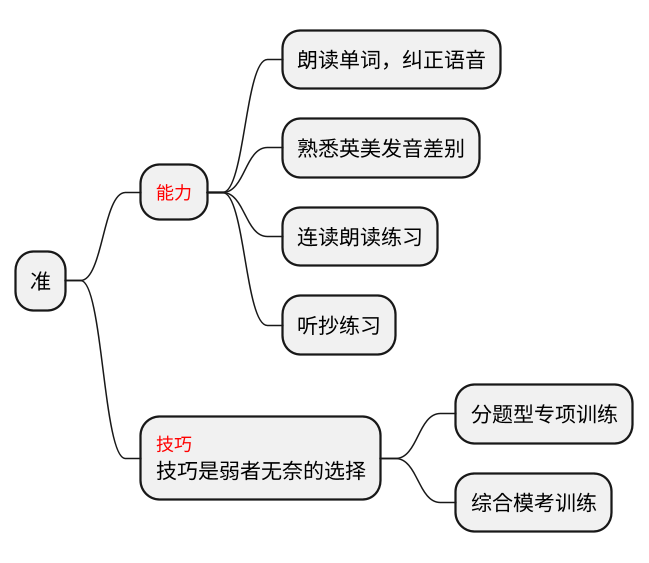

# 阅读
## 仔细阅读之解题流程
- 第一步：关键词、问答顺序匹配
- 第二步：回文定位
- 第三步：解题（基于文章）

### 仔细阅读之解题策略
#### 区域解题内涵
- 跳读文章找区域
根据问题题干中的关键词（最好多个精确定位）快速在文章中找到对应区域（标注）
- 细节题：依次而下是原则（宏观题：主旨为独立题型）
- 区域之间无交集
- 前本后句是核心（关键词所在句为本句，本>后>前）
> 读题
>- 关键词定位
>- 区域明确（本句后句解题法）
>- 区域宽泛（出题原则解题法）

> 出题原则解题法
>- 原则一：特殊标点
：-- “”
>- 原则二：转折（强对比）
but、however、still、yet、instead、unfortunately、on the contrary、by contrast、in contrast to
>- 原则三：列举
>   - on the one hand ... on the other hand...
for one thing ... for anther thing ...
>   - first ... second ... third...
>   - 从句排比
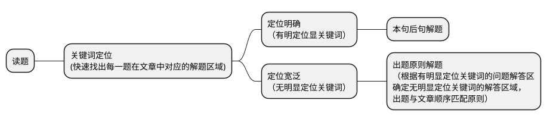
### 仔细阅读题型
#### 微观题型
- 细节推理题
细节：
考察该文章中有关事件发生的具体细节的题目，如：
时间、地点、人物、事件、方式等
what/when/who/where/why/how
推理：
which statement is true according to the passage?
infer conclude
- 词汇指代题（句子理解题）
could best be replaced
means
is nearest/closest to
词本无意，意由境生
- 词汇指代题-解题方法
    - 1. 冒号：解释说明
    - 2. 分号：并列
    - 3. 括号：
    a. 解释说明
    b. 补充说明
    - 4. 引号：
    a. 引用
    b. 反讽
    - 5. 破折号：补充说明
词根词缀
big-large-huge-giant-titan
pluto-plus-plenty-plutocrat
### 宏观题型
- 主旨大意题

- 观点态度题
## 选词填空

选词填空傻瓜表基本用法：
- 常规情况下从前不从后，若从前无法得出答案，再从后
- 情况一：A空B，若AB已构成傻瓜表里的搭配，则空1由B来确定词性
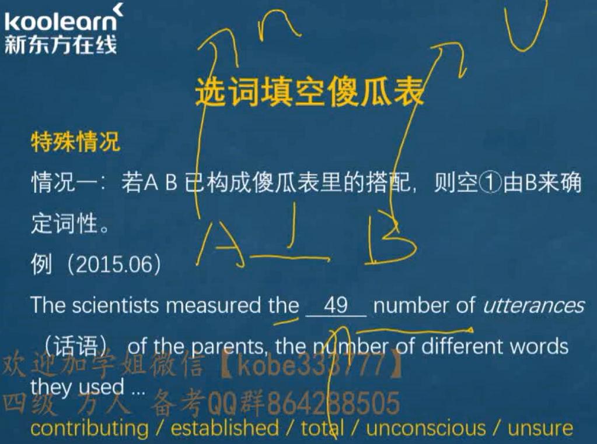
- 情况二：句子，空B，则空填V-ing形式，常表伴随
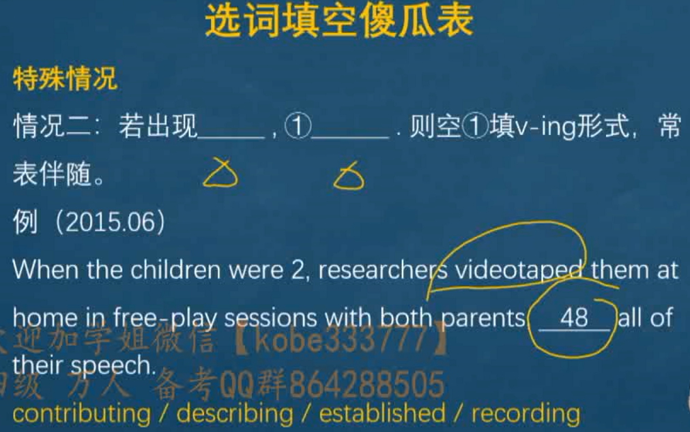
- 情况三：A，插入语，空B若出现插入语，则跳过插入语，由空前最近的词来确定词性词义
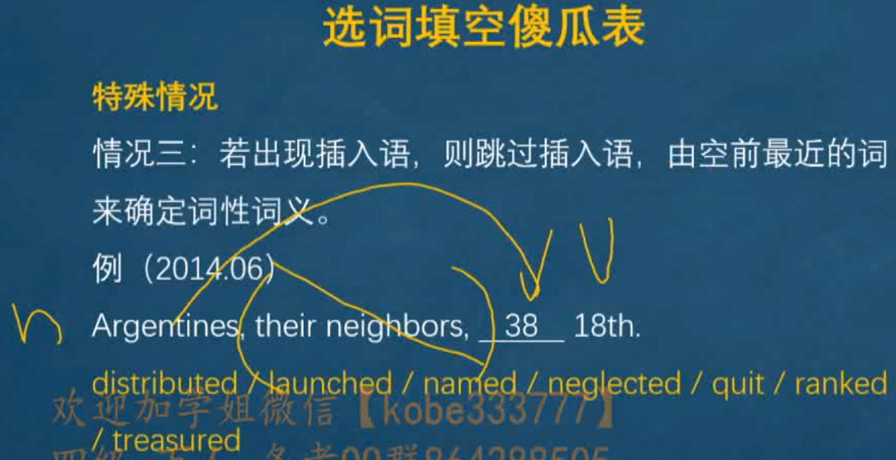
- 情况四：严格按照傻瓜表排序，依次向后选择
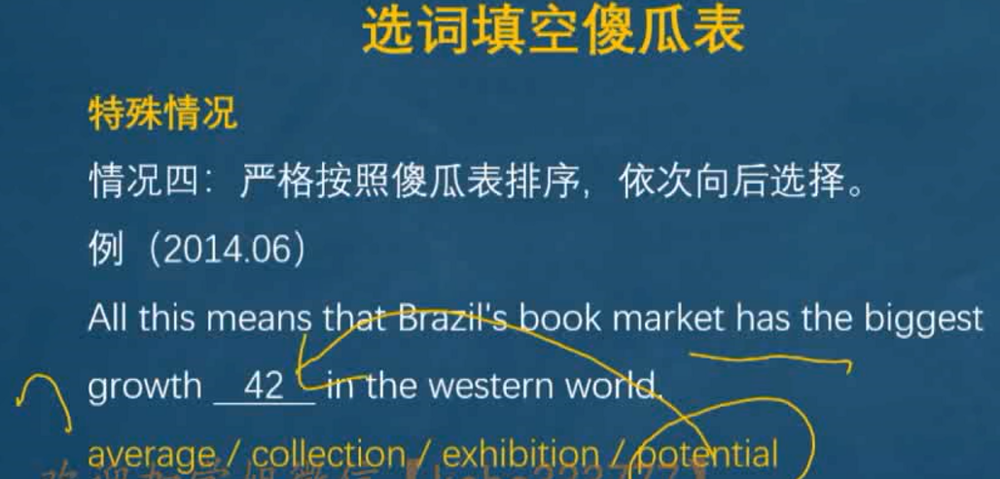
- 情况五：部分题目考察词组搭配
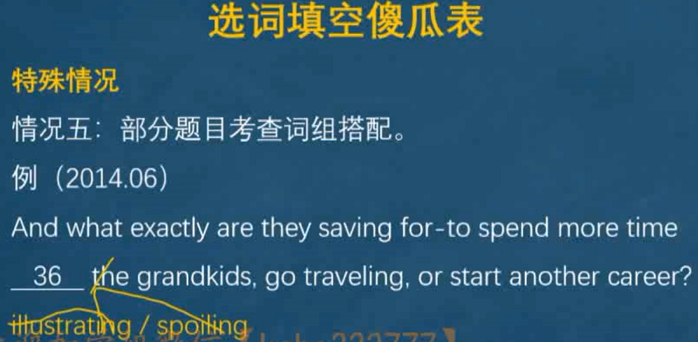
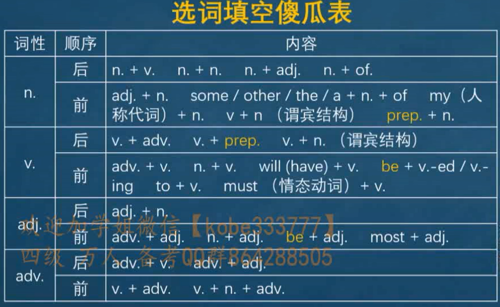

### 解题思路
- 第一步：通读首句，抓中心
- 第二步：详读选项，词分类
    - 常见名词后缀：
    -sion，-tion：starvation, attraction, profession
    -ity: quality, diversity

    - 常见动词后缀：
    -ate: estimate, generate
    -en: widen, worsen
    - 常见形容词后缀：
    -able:stable, affordable
    -tive, -sive: destructive, excessive, sensitive
    -ous: unconscious, enormous
    - 常见副词后缀：
    -ly: deliberately, completely, remarkably

- 第三步：瞻前顾后，灵活选

    - 依托语法（判断词性）

> 名词
>- 做句子主语、宾语成分的空
>- 空前有形容词或冠词或所有格、空后无名词的
    >   - 单数可数名词前一定要加冠词
    >   - 复数名词和不可数名词前一般不加冠词
>- 与其他名词并列的空
>- 介词后的空
> 技巧
>- 可数 or 不可数
>- 单数 or 复数

> 动词
>- 做句子谓语成分的空
注意进行时、将来时、完成时、情态动词
>- 不定式后的空，需要动词原形
>- 定语、状语、独立主格结构。需要动词分词
>- 与其他动词并列的词
技巧
>- 判断形式（原形、三单、ed、ing
>- 固定搭配（V+prep）

> 形容词
>- 做名词定语成分的空（名词前设空）
>- 作表语且修饰主语的空（系动词后面）
>- 与其它形容词并列的空

> 副词
>- 修饰形容词、动词的空
>- 修饰整句的空
>- 与其它副词并列

    - 尊重文意（判断词义）
    - 把握逻辑（辅助做题）
- 第四步：复核审查，定结果

## 长篇阅读
### 命题规律
1. 文后10个句子，要求确定来源段落
2. 可能是原文信息重现、改写或归纳
3. 问答并不符合顺序原则
4. 可能两句来自同一段落
5. 可能有段落无对应句

### 解题思路
- 不求甚解：重点是看到，尽量看懂

- 先题后文：带句子信息看文章

- 主次分明：以词带句、重点爪词

- 有取有舍：优先确定来源明显的句子

### 解题步骤
- 第一步：看大标题
    - 熟悉文章主题、辅助扫读与定位
- 第二步：选定位词动宾是最佳匹配方案
    - 带着定位词看文章，帮助寻找来源
    - 定位词类型
        - 显性定位词
        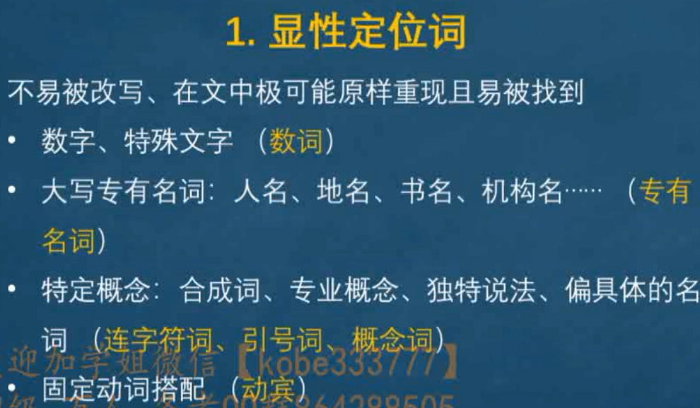
        - 隐性定位词
        极端词、最高级、比较级、程度特别深的用词
        - 低效定位词

- 第三步：读文解题
边读文章关键词动宾、定位词顺序边解题
段落“三部分阅读”
  - 首读段首一句、末一句
  - 再度段中转折后句
  - 最后其余信息以词扫读
  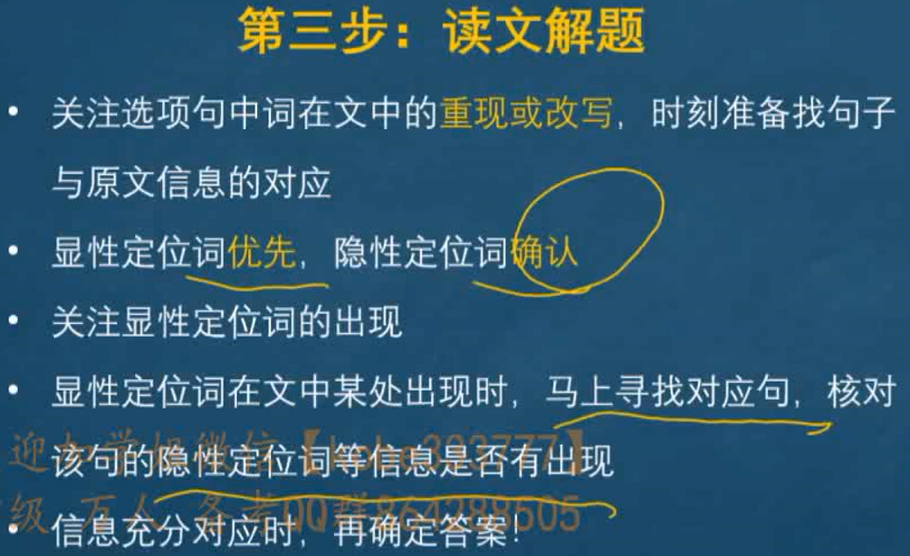
- 第四步：查漏补缺
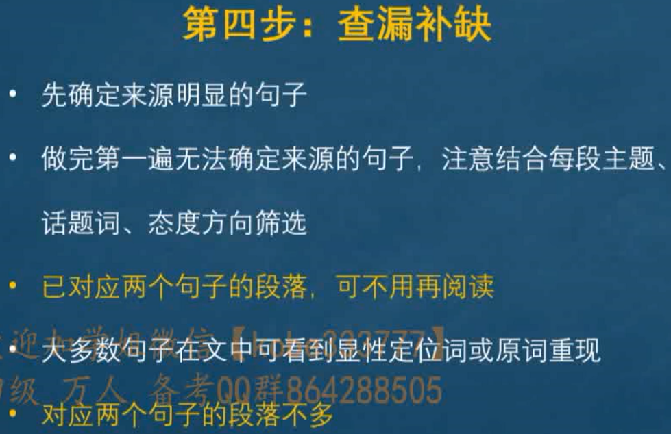
### 解题原则
1. 关键词非首次出现原则
关键词第一次出现的位置不一定是匹配的位置，需结合原文与题干内容对比
2. 多关键词原则
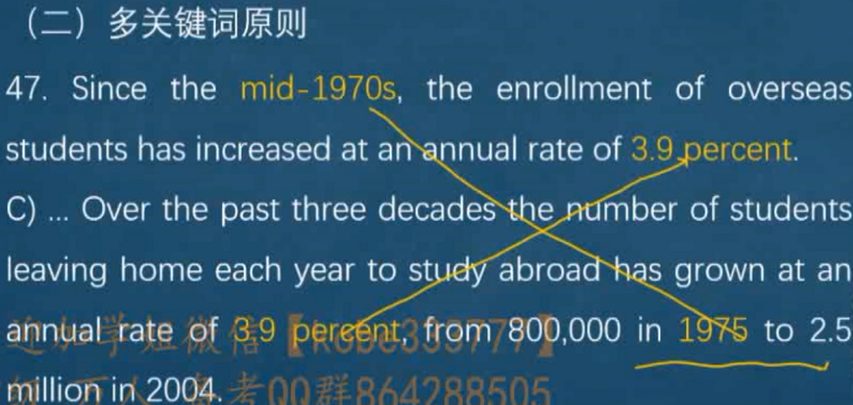
3. 匹配原则
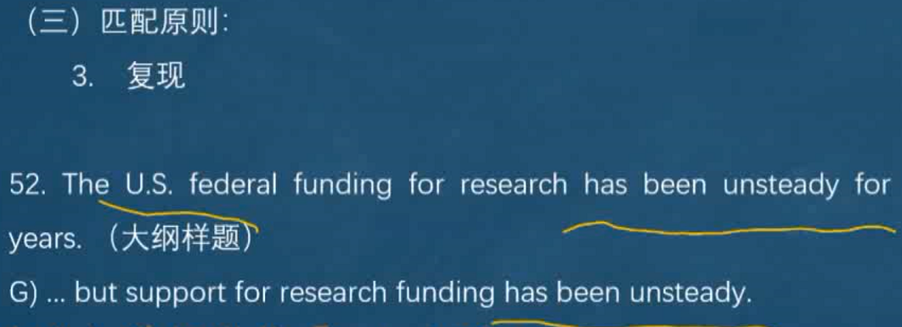
# 词汇

- 背重要的-有针对性地反复识记（根据艾宾浩斯曲线）
- 方法
    - 联想
    - 词根词缀词源
    - 读句子，读真题
compulsory courses 必修课
electives 选修课 elective courses
choose coursework/courses 选择课程
充分重视
pay due attention to n.
put great emphasis on n.
attach great importance to n.
attach utmost significance to n.
同义替换（词汇、句型）
It pays to be honest. 诚实是有回报/值得的。
academic qualification 学位证书
The importance of learning basic skills 学习基本技能的重要性
acquire获得
practical skills 实践技能
theoretical knowledge 理论知识
A course that has impressed you a lifetime mission在大学你印象最深的一门课
impression
impressive令人印象深刻的
impressionism 印象主义
Learning is a daily experience and a lifetime mission 学习是每日经历和终身任务
lifelong education 终身教育
The importance of reading ability and how to develop it
The challenges of studying abroad
study overseas 海外留学
overseas Chinese 海外华人
The two-day weekend 双休日
weekday 工作日
Getting to know the wrold outside the campus了解校园之外的世界
ivory tower象牙塔
How I finance my college 如何负担我的大学教育
financial crisis金融危机
economic crisis经济危机

cannot afford/support ones' education上不起学
college/school 大学
institute学院
graduate school 研究生院
law school 法学院
business school 商学院
A letter to the university president about the canteen service on campus
A campaign speech 竞选演讲
A poster to recruit volunteers招募志愿者海报
recruitment 招生、招募
enrollment 录取
volunteering 志愿者活动
Welcome to our club 欢迎来到我们俱乐部
Recreational activities 娱乐活动
students' recreational center 学生活动中心
after-class activities 课外活动
extracurricular activities课外活动
A campus activity that has benefited you most 你受益最多的校园活动

find a job, hunt for a job 找工作
seek employment 求职、就业
My ideal job
job satisfaction工作满意度
job market 工作市场
working pressure/experience 工作压力/经历
vocational training 职业培训
career objective/planning 职业目标/规划
benefits，strengths，merits优点
disadvantages, shortcomings, weaknesses, drawbacks缺点
interview 面试
interviewer 面试官
interviewee 面试者
How to succeed in a job interview?在工作面试中如何获得成功
To find a job somewhere or to start a business of your own 找工作或创业
start/run one's own business 创业
To work in a state-owned business or in a joint venture 在国企还是外企工作
To take a job in a company or to go to a graduate school 就业或者考研
persue master's degree 追求硕士学位
The challenges of living in a big city生活在大城市的挑战
The challenges of starting a career after graduation 毕业后开始事业的挑战
An essay in honor of a teacher on occasion of teacher's day 在教师节写一篇纪念老师的文章
Students selecting their lectures 学生选择他们的老师
professor 教授
lecture 讲师
Write a letter to express your thanks to one of your school teachers upon entering college 关于考上大学写一封信表达你对学校老师的感谢
How to best handle the relationship between teachers and students怎样处理好师生关系
interpersonal relations人际关系
develop interpersonal relationship 开发人际关系
manage interpersonal relationship 管理人际关系

A letter to a schoolmate 给校友的一封信
classmate 同学
roommate 室友
An letter in reply of a friend's inquiry 答复朋友询问的一封信
A classmate of yours who has influenced you mosn in college 在大学对你影响最大的同学
Write a letter to express your thanks to one of your friends who helped you most when you were in dificulty 感谢在你困难时对你帮助最大的朋友
in distress 处于困境

Reading selectively or extensively? 选择性还是广泛地读书？
The importance of reading literature 文学阅读的重要性
text message 短信
Write an advertisement on your campus website to sell some of the course books you used at college 在你大学网站上写一个广告卖一些你使用过的书

A brief introduction of a tourist attraction 景点介绍
scenic spots, places of interests景点
visitor， tourist 游客
historical sites 历史遗迹
the Palace Museum 故宫
the Forbidden city 紫禁城
the Great Wall 长城
the Summer Palace颐和园
Should the university campus be open to tourists?
Free admission to Museums 博物馆的免费进入
tour 观光游
travel 旅游
outing 郊游
trip 短途旅游
journey 陆上长途跋涉
Journey to the West 西游记 
voyage 海上旅行

tourism， the travel business，the tourist industry 旅游业

promote tourism发展旅游业
promote economy发展经济
What is the most interesting place in China?
What is the most interesting place in your hometown?
What is the most interesting place in your campus?
library, canteen, dormitory

What happened if there were no power
Make our cities greener 绿化城市
Global shortage of fresh water 全球淡水短缺
Limiting the use of disposable plastic bags 限制使用一次性塑料袋
Creating a green campus 建设绿色校园
environmental protection环境保护
protect the environment 保护环境

Women in the modern world
Do "lucky number" really bring good luck?
The tape recorder be
My favorite program 我喜欢的节目
On the spring festival gala 春节联欢晚会
the dragon boat festival 端午节

An early morning walk
Changes in people's diet
Positive and negative aspects of sports 运动的积极和消极方面
go on a diet 节食
lose weight 减肥

physical health 生理健康
mental fitness 心理健康
- 保持健康的三个方面
    - do physical exercises 适当锻炼
    - well-balanced diet 均衡饮食
    - keep optimistic 保持乐观

Student use of computers
Online shopping
The increasing use of mobile phone in people's life

electronic commerce, e-commerce电子商务
people in increasing/growing/mounting/expanding/numbers 越来越多的人
smart/cell phone 手机
the Internet 互联网（专有名词首字母大写）

The impact of internet on learning
Why am I going to school if my phone already knows everything
the information Era 信息时代
the information technology信息技术

Harmfulness of fake commodities 假货的危害
genuine commodities 真货
honesty诚信
dishonest behaviors欺诈行为
professional ethics 职业道德
public morality 社会公德
On excessive packaging
How to best handle the relationship between doctors and patients

How should parents help children to be independent?
Parents' role in children's growth
seek independence 寻求独立
doting care 溺爱

heacy traffic,traffic jam/congestion交通堵塞
limit the use of private cars 限制使用私家车

Is failure a bad thing?
获得成功
achieve/find/reach/obtain success
become successful

Can money buy happiness?
Practice makes perfect 熟能生巧
It pays to be honest

Nothing succeeds without a strong will
The importance of doing small things before undertaking something big
Never go out there to see what happens, go out there to make something happen.
participation 参与
Listening is more important than talking
modesty谦虚
# 翻译

- 了解句句子的构成
    - 词汇是语言的素材，语法是语言的规律
    - 句子=单词+语法
- 语法：
    - 如何描述一件事？
    - 如何描述多件事？
---
- 出题形式
《关于大学英语四、六级考试题型调整的说明》
原单句汉译英调整为段落汉译英。翻译内容涉及中国的历史、文化、经济、社会发展等。四级长度为140-160个汉字；六级长度为180-200个汉字。——全国大学英语四、六级考试委员会
- 四六级翻译评分标准

分数档|标准特征|符合定义
-|-|-
12-14| 译文准确表达了原文的意思。用词贴切，行文流畅，基本上无语言错误，仅有个别小错。|雅
9-11 |译文基本上表达了原文的意思。文字通顺、连贯，无重大语言错误。|达
6-8 |译文勉强表达了原文的意思。用词欠准确，语言错误相当多，其中有些是严重语言错误。|信
……| ……| - |

## 四级翻译整体课程框架
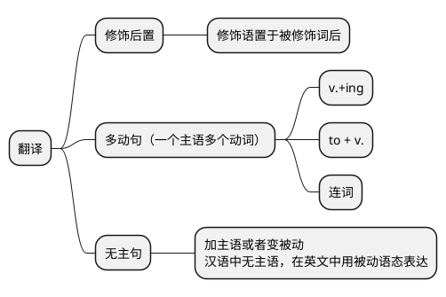
>- 修饰后置
>   - n. + v. + 后缀
n. + v. + er
Motherfucker
Kingslayer弑君者
Birdwatcher观鸟者
>   - n. + v. + ing
papercutting剪纸
liondancing舞狮
>剪纸是中国民间艺术的一种独特形式。
papercutting is a kind of special form of Chinese
folk art.

>- 多动句
他们熟练配合，模仿狮子的各种动作。
They cooperate perfectly to imitate all kinds of actions of lions.
They do together perfectly, copying various moves of lions.

>- 无主句
如今，世界上许多其他地方也能看到红灯笼。
Nowadays, red lanterns can be seen in many other parts of the world.
# 写作
## 基础能力
- 话题词汇
- 写作句法
- 经典句型
## 能力提升
- 论说文
- 应用文
## 高分攻略
- 背诵：十大必背范文
[四级十大必备范文](四级十大必备范文.pdf)
    - 滚瓜烂熟！ 脱口而出多益善滚瓜烂熟！ 脱口而出多益善
    - 四大背诵方法
        - 搞清逻辑脉络
        - 背熟中文译文
        - 多听英文录音
        - 进行中英互译
- 默写：仔细对比原文，改正写作错误
- 仿写
## 写作句法
### 五大句型
1. 主谓：I succeed.
2. 主谓宾：The metaphorical portrayal has subtly revealed the duality of the relationship between man and computer.这幅画比喻性的图画巧妙地揭示了人与电脑之间的双重关系。
mobile phone 手机
the Internet 互联网
digital product 数码产品
3. 主系表：There is no denying that the computer is currently one of the most efficient tools either to entertain oneself or to meet the work's needs.不可否认，电脑目前是用于娱乐自我或满足工作需要的最高效媒介之一。
4. 主谓双宾：Jack gives Mary an english dictionary.主谓+直接宾语+间接宾语
5. Money makes people selfish.主谓+宾语+宾语补足语
- 句子写作原则：长短结合，短句为主
- 四级作文写10句话，六短（10词）四长（20词），三段343，奇短偶长
### 长句写法
#### 并列句
- 写作六大并列连词
    - and; or; not only...,but also...
    - but; while; whereas; yet
He is the talk of our classmates, and I know the image of him has already stayed in my heart. 我们同学总会谈起他。我知道他的形象已经留在我心中。
More than 600 years have passed, yet the city is still in fine shape. 六百多年过去了，而这座城市如今仍保存完好。
#### 从句
- 从句一：定语从句：形容词从句
    - 人， 主语who, 宾语whom, whose
    - 物，that, which
    - 时间，when
    - 地点，where
As is symbolically illustrated in the cartoon, a person is always staying in front of a computer no matter whether he is working, studying or playing. 如图象征性所示，一个人无论工作、在家或娱乐，总是坐在一台电脑前面。
I should admit that English is the course that has impressed me most in college. 我应该承认英语是在大学里令我印象最深的一门课。
In my campus life, I have met a good many classmates who are really worth recalling.
a great many;a large number of + 可数名词
a great deal of + 不可数名词 time, money, energy
- 从句二：状语从句：副词性从句

时间状语从句：Even when he is sleeping, the image of surfing online is also indispensable in his sweet dreams.甚至当他睡觉时，在他甜美的梦中，网上冲浪的画面也是必不可少的。
get online 网上冲浪
sweet dreams 晚安
条件状语从句：Once they are indulged in the fictitious world, people feel reluctant to approach others and to concentrate on real life. 一旦沉迷于这种虚幻世界，人们不愿意接近他人以及关注现实生活。
be addicted to a game of power 沉溺于
over indulgence 过度沉迷
fiction小说
virtual life 虚拟世界
digital product数码产品
online shopping
make friends online 网上交友
play online games 网游
idol worship 偶像崇拜
Once the young people begin to seek independence and accept challenges from the real world, they are found **too** spoiled **to** be strong enough in the face of difficulties.一旦年轻人开始寻求独立并接受来自现实世界的挑战，人们发现他们已经被惯坏了，在困难面前无法足够坚强。
self-dependence 自我独立
information Era
information technology

<ruby>下<rp>(</rp><rt>上</rt><rp>)</rp></ruby>
原因状语从句： As nearly all information on the Internet and over half the world's technical and scientific periodicals（期刊） are in English, a good command of English（良好的掌握英语） will facilitate my work. 由于几乎所有互联网上的信息和超过半数世界科技期刊都是英语的，良好掌握英语将方便我的工作。
As he treats us like friends, we all liked to visit his dormitory for social activities as well as for academic advice. 由于他对待我们像朋友，我们都喜欢去他宿舍进行社交活动以及寻求学习建议。
academic qualification 学历证书
acdamic performance学习成绩
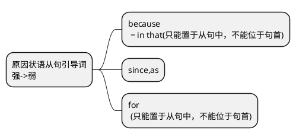
让步状语从句：While quite a number of students think they are forced to take the English course -- merely for College English Test, I study it for the purposes other than the examination itself. 尽管相当多学生认为它们只是为了大学英语考试二被迫选择英语课，但我学习是为了考试之外的目的。
College English Test 4, CET4
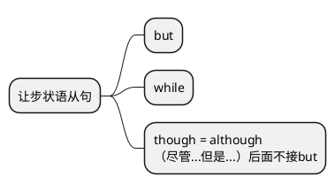
从句三：名词性从句
a. 宾语从句
A good many people admit **that** they are too much addicted to computers to maintain face-to-face contact with their friends and colleagues. 很多人承认它们太沉迷于电脑而不愿与朋友和同事保持面对面接触。
maintain wholesome and regular lifestyle 保持健康且有规律的生活方式
A skilled and talented teacher can add so much richness to **what** is being learned from books. 而一位经验丰富且有才华的教师能交给你许多书本知识以外的东西。
b. 主语从句
It is subtly revealed in the portrayal that a young boy is talking with his mother in their house. 如图微妙所示，一个小孩正在家中和他的母亲谈话。
What frequently brings back memories of him is his special qualities. 是他那些特殊品质让我常常回想起他。
c. 表语从句
Obviously,  the implication of the portrayal is that the daughter is lack of independence due to her mother's doting care. 显而易见，这幅漫画的含义就是由于母亲的溺爱，女儿缺乏独立。
Apparently 显而易见地
meaning 表明
owing to ;because of 因为
spoil; dote溺爱v.
d. 同位语从句
I cling to the idea that the practical value of English is a strong motivator. 我认为英语的实用价值是一个强烈的动力。
the fact/reason/idea/opinion/belief/news/report/conclusion/truth + that ...
#### 非谓语动词
- 动名词
Participating in volunteer works could boost my development of interpersonal relationship. 参加志愿者活动能够帮助我开发人际关系。
volunteering 志愿者活动
develop/manage interpersonal relations开发/经营人际关系
- 不定式
1. 做主语
It is necessary for us to use computer in a reasonable way and restrain from overindulgence. 我们很有必要以一种合理的方式使用电脑，避免过度沉迷。
pursue fashions unreasonably 毫无理性地追求时尚
Accordingly, it is vital for us to derive positive implications from the thought-provoking drawing. 总之，我们很有必要从这幅发人深思的图画中得出积极的含义。
chart
saying
hence， thus，therefore， consequently
2. 做状语
The computer is invented to connect you and me, and to bring conveniences to our life rather than set a barrier to keep people beyond reach. 人们发明电脑是为了连接你和我，为我们的生活带来方便，而非设置障碍使人彼此疏远。
cause inconveniences 导致不便
instead of + n.; rather than + v. 而不是
We can frequently use it to enlighten the youth to be more independent in life. 我们可以经常利用它来启发年轻人在生活中更加独立。
Parents should be sensible enough to give their children more freedom to deal with trouble and problems. 父母应该充满理智给孩子们更多自由来处理困难和问题。
a student to crack CET-4 一个要考英语四级的学生
- 分词
1. 现在分词
I remember that wo always anticipated talking with him with great eagerness because his lectures are humorously delivered, never failing to provoke chuckles or loud laughs. 我现在还记得我们总渴望和他聊天，因为他演讲幽默，总能使我们咯咯一笑，或是哄堂大笑。
2. 过去分词
A good teacher adds considerably to the materials contained in the mobile phones. 一位好老师可提供手机所含资料之外的许多东西。
- 独立主格结构（分词短语的逻辑主语与主句的主语不一致）
The eyes sparkling with delight, the daughter tells her mother, "Good news mom! I was accepted to the college of your choice." 眼中兴奋地闪着光芒，女儿告诉母亲：“妈妈，好消息！我被您选择的那所大学录取了！"
Time permitting, I will go to Mount Qingcheng tomorrow. 时间允许的话，我明天取青城山。
### 三大段
一、 引出话题（+图画/表描述、谚语说明、个人观点）
二、 阐释话题（原因后果、对立观点、举例论证）
三、 个人评论+ 建议措施+ 憧憬未来
#### 首段
（一）话题引起
1. 人们逐步认识到
There is a growing national awareness of 主题词
growing/increasing/mounting/upword
national/global/local
awareness/consciousness
There is a growing national awareness of the problem of disposable plastic bags among the public.
2. 现在有一种...的趋势。
There is a growing tendency nowadays that 句子
tendency/trend
nowadays/now/in contemporary society/in modern society
There is a growing tendency nowadays that more and more people are buying goods online.
There is a growing tendency nowadays that people in mounting numbers are purchasing products on the internet.
3. ...引起了们热烈的讨论。
There has been a heated discussion about 短语
heated/wide/great/deep/profound
discussion/talk/debate/concern
There has been a heated discussion about the impact of the internet on learning.
impact/effect/influence
the impact of A on B
4. 进来，... 的问题引起了公众的广泛的关注。
Recently, the problem of 名词或名词性短语 has aroused wide concern among the public.
recently/in recent years
concern/discussion
aroused/provoked
Recently, the problem of "excessive packaging" has aroused wide concern among the public.
5. 所有人都注意到这样一个事实，...在中国已经成了一个普遍现象。
Nobody could have failed to notice the fact that ... has become a popular phenomenon in China.
Nobody could have failed to notice the fact that the relationship between doctors and patients has become a popular phenomenon in China.
#### 中间段

