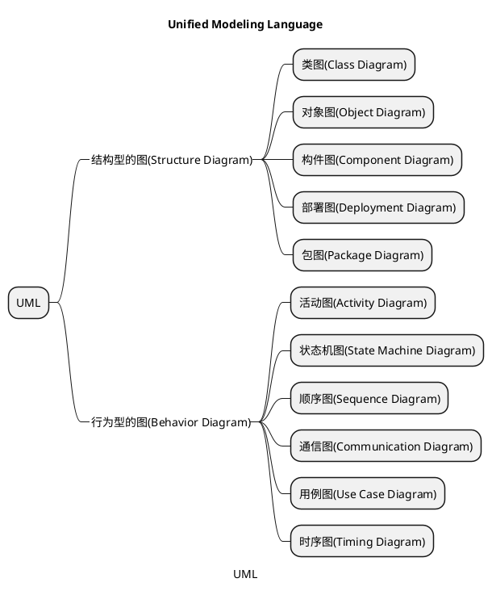
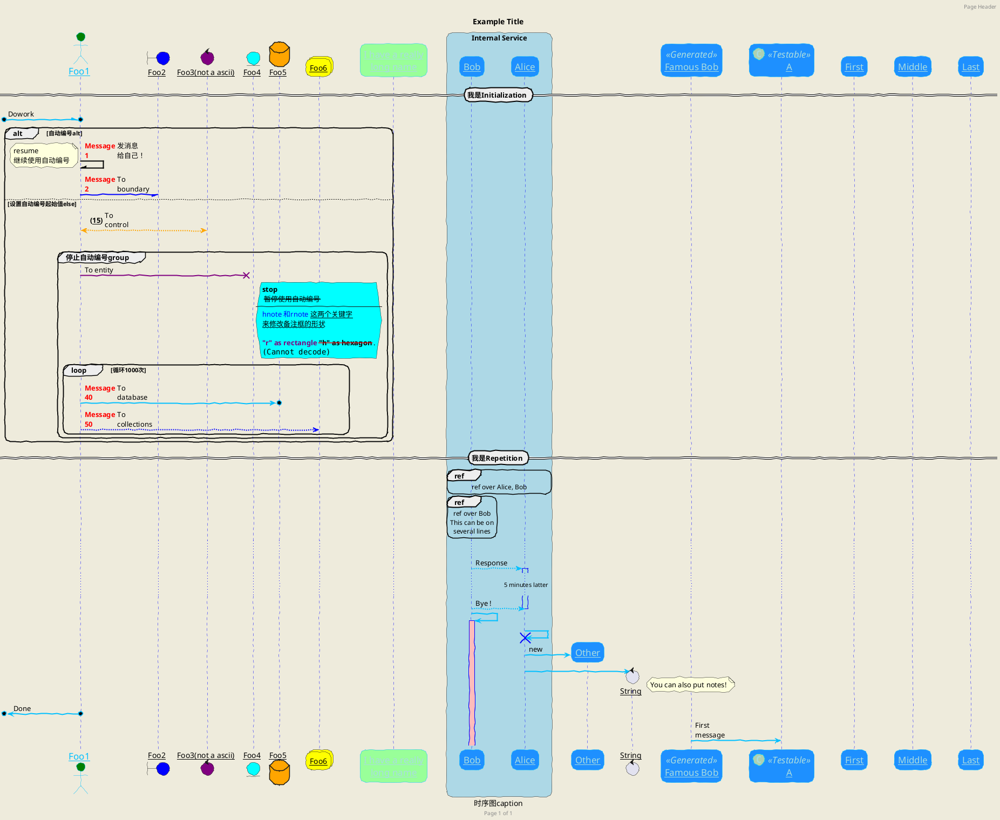
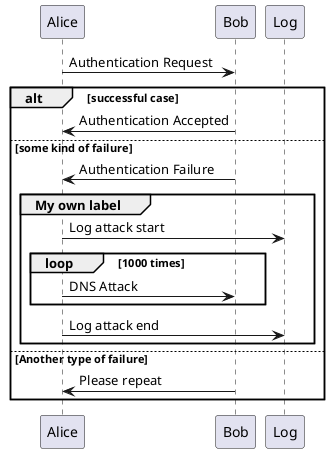

# UML mindmap
 {class= ' line-numbers' code_block=true}

# 时序图

## 声明参与者

- 关键字participant 用于改变参与者的先后顺序。
你也可以使用其它关键字来声明参与者
    - actor
    - boundary
    - control
    - entity
    - database

- 关键字as 用于重命名参与者
你可以使用RGB 值或者颜色名修改actor 或参与者的背景颜色

- 您可以使用关键字order 自定义顺序来打印参与者。

## 在参与者中使用非字母符号
你可以使用引号定义参与者，还可以用关键字as 给参与者定义别名。
## 给自己发消息
参与者可以给自己发信息，
消息文字可以用\n 来换行。
## 修改箭头样式
修改箭头样式的方式有以下几种:
- 表示一条丢失的消息：末尾加x
- 让箭头只有上半部分或者下半部分：将< 和> 替换成\ 或者/
- 细箭头：将箭头标记写两次(如>> 或//)
- 虚线箭头：用-- 替代-
- 箭头末尾加圈：->o
- 双向箭头：<->
## 修改箭头颜色
你可以用以下记号修改箭头的颜色：
Bob -[#red]> Alice : hello
Alice -[#0000FF]->Bob : ok
## 对消息序列编号
- 关键字autonumber 用于自动对消息编号。
- 语句autonumber start 用于指定编号的初始值，而autonumber start increment 可以同时指定编号
的初始值和每次增加的值。
- 你可以在双引号内指定编号的格式。格式是由Java 的DecimalFormat 类实现的：(0 表示数字；# 也表示数字，但默认为0)。也可以用HTML 标签来制定格式。
- 你还可以用语句autonumber stop 和autonumber resume increment format 来表示暂停或继续使用自
动编号。
- 你还可以用语句autonumber stop 和autonumber resume increment format 来表示暂停或继续使用自
动编号。
## Page Title, Header and Footer
The title keyword is used to add a title to the page
Pages can display headers and footers using header and footer.
- 你可以在标题中使用creole 格式。
- 关键字title 和end title 定义多行标题。
- 在标题描述中使用\n 表示换行。
## 分割示意图
关键字newpage 用于把一张图分割成多张。
在newpage 之后添加文字，作为新的示意图的标题。
这样就能很方便地在Word 中将长图分几页打印。
## 组合消息
我们可以通过以下关键词将组合消息：
- alt/else
- opt
- loop
- par
- break
- critical
- group, 后面紧跟着消息内容
可以在标头(header) 添加需要显示的文字(group 除外)。
关键词end 用来结束分组。
注意，分组可以嵌套使用。
## 给消息添加注释
- 我们可以通过在消息后面添加note left 或者note right 关键词来给消息添加注释。
- 可以使用note left of，note right of 或note over 在节点(participant) 的相对位置放置注释。
- 还可以通过修改背景色来高亮显示注释。
- 你也可以通过使用end note 来添加多行注释。
## 改变备注框的形状
你可以使用hnote 和rnote 这两个关键字来修改备注框的形状。

## Creole 和HTML
可以使用creole 格式。

## 分隔符
你可以通过使用== 关键词来将你的图表分割多个步骤。
## 引用
你可以在图中通过使用ref over 关键词来实现引用
## 延迟
你可以使用... 来表示延迟，并且还可以给延迟添加注释。
## 扩大空间
你可以使用||| 来增加空间。
还可以使用数字指定增加的像素的数量。
## 生命线的激活与撤销
- 关键字activate 和deactivate 用来表示参与者的生命活动。
- 一旦参与者被激活，它的生命线就会显示出来。
- activate 和deactivate 适用于以上情形。
- destroy 表示一个参与者的生命线的终结。
- 还可以使用嵌套的生命线，并且运行给生命线添加颜色。
## Return
A new command return for generating a return message with optional text label. The point returned to is the point that cause the most recently activated life-line. The syntax is simply return label where label, if provided, can be any string acceptable on conventional messages.
## 创建参与者
你可以把关键字create 放在第一次接收到消息之前，以强调本次消息实际上是在创建新的对象。

## 进入和发出消息
如果只想关注部分图示，你可以使用进入和发出箭头。
使用方括号[和] 表示图示的左、右两侧。
## 构造类型和圈点
可以使用<< 和>> 给参与者添加构造类型。
在构造类型中，你可以使用(X,color) 格式的语法添加一个圆圈圈起来的字符。

## 包裹参与者
可以使用box 和end box 画一个盒子将参与者包裹起来。
还可以在box 关键字之后添加标题或者背景颜色。
## 移除脚注
使用hide footbox 关键字移除脚注。

## 外观参数(skinparam)
用skinparam 改变字体和颜色。
可以在如下场景中使用：
-  在图示的定义中，
-  在引入的文件中，
-  在命令行或者ANT 任务提供的配置文件中。
## 填充区设置
可以设定填充区的参数配置

