# UML mindmap
 {class= ' line-numbers' code_block=true}


# 时序图

## 声明参与者

- 关键字participant 用于改变参与者的先后顺序。
你也可以使用其它关键字来声明参与者
    - actor
    - boundary
    - control
    - entity
    - database

- 关键字as 用于重命名参与者
你可以使用RGB 值或者颜色名修改actor 或参与者的背景颜色

- 您可以使用关键字order 自定义顺序来打印参与者。

## 在参与者中使用非字母符号
你可以使用引号定义参与者，还可以用关键字as 给参与者定义别名。
## 给自己发消息
参与者可以给自己发信息，
消息文字可以用\n 来换行。
## 修改箭头样式
修改箭头样式的方式有以下几种:
- 表示一条丢失的消息：末尾加x
- 让箭头只有上半部分或者下半部分：将< 和> 替换成\ 或者/
- 细箭头：将箭头标记写两次(如>> 或//)
- 虚线箭头：用-- 替代-
- 箭头末尾加圈：->o
- 双向箭头：<->
## 修改箭头颜色
你可以用以下记号修改箭头的颜色：
Bob -[#red]> Alice : hello
Alice -[#0000FF]->Bob : ok
## 对消息序列编号
- 关键字autonumber 用于自动对消息编号。
- 语句autonumber start 用于指定编号的初始值，而autonumber start increment 可以同时指定编号
的初始值和每次增加的值。
- 你可以在双引号内指定编号的格式。格式是由Java 的DecimalFormat 类实现的：(0 表示数字；# 也表示数字，但默认为0)。也可以用HTML 标签来制定格式。
- 你还可以用语句autonumber stop 和autonumber resume increment format 来表示暂停或继续使用自
动编号。
- 你还可以用语句autonumber stop 和autonumber resume increment format 来表示暂停或继续使用自
动编号。
## Page Title, Header and Footer
The title keyword is used to add a title to the page
Pages can display headers and footers using header and footer.
- 你可以在标题中使用creole 格式。
- 关键字title 和end title 定义多行标题。
- 在标题描述中使用\n 表示换行。
## 分割示意图
关键字newpage 用于把一张图分割成多张。
在newpage 之后添加文字，作为新的示意图的标题。
这样就能很方便地在Word 中将长图分几页打印。
## 组合消息
我们可以通过以下关键词将组合消息：
- alt/else
- opt
- loop
- par
- break
- critical
- group, 后面紧跟着消息内容
可以在标头(header) 添加需要显示的文字(group 除外)。
关键词end 用来结束分组。
注意，分组可以嵌套使用。
## 给消息添加注释
- 我们可以通过在消息后面添加note left 或者note right 关键词来给消息添加注释。
- 可以使用note left of，note right of 或note over 在节点(participant) 的相对位置放置注释。
- 还可以通过修改背景色来高亮显示注释。
- 你也可以通过使用end note 来添加多行注释。
## 改变备注框的形状
你可以使用hnote 和rnote 这两个关键字来修改备注框的形状。

## Creole 和HTML
可以使用creole 格式。

## 分隔符
你可以通过使用== 关键词来将你的图表分割多个步骤。
## 引用
你可以在图中通过使用ref over 关键词来实现引用
## 延迟
你可以使用... 来表示延迟，并且还可以给延迟添加注释。
## 扩大空间
你可以使用||| 来增加空间。
还可以使用数字指定增加的像素的数量。
## 生命线的激活与撤销
- 关键字activate 和deactivate 用来表示参与者的生命活动。
- 一旦参与者被激活，它的生命线就会显示出来。
- activate 和deactivate 适用于以上情形。
- destroy 表示一个参与者的生命线的终结。
- 还可以使用嵌套的生命线，并且运行给生命线添加颜色。
## Return
A new command return for generating a return message with optional text label. The point returned to is the point that cause the most recently activated life-line. The syntax is simply return label where label, if provided, can be any string acceptable on conventional messages.
## 创建参与者
你可以把关键字create 放在第一次接收到消息之前，以强调本次消息实际上是在创建新的对象。

## 进入和发出消息
如果只想关注部分图示，你可以使用进入和发出箭头。
使用方括号[和] 表示图示的左、右两侧。
## 构造类型和圈点
可以使用<< 和>> 给参与者添加构造类型。
在构造类型中，你可以使用(X,color) 格式的语法添加一个圆圈圈起来的字符。

## 包裹参与者
可以使用box 和end box 画一个盒子将参与者包裹起来。
还可以在box 关键字之后添加标题或者背景颜色。
## 移除脚注
使用hide footbox 关键字移除脚注。

## 外观参数(skinparam)
用skinparam 改变字体和颜色。
可以在如下场景中使用：
-  在图示的定义中，
-  在引入的文件中，
-  在命令行或者ANT 任务提供的配置文件中。
## 填充区设置
可以设定填充区的参数配置


# 用例图

Let's have few examples :
Note that you can disable the shadowing using the skinparam shadowing false command.

## 用例

- 用例用圆括号括起来。
- 也可以用关键字usecase 来定义用例。
- 还可以用关键字as 定义一个别名，这个别名可以在以后定义关系的时候使用。

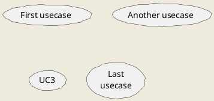
## 角色
- 角色用两个冒号包裹起来。
- 也可以用actor 关键字来定义角色。
- 还可以用关键字as 来定义一个别名，这个别名可以在以后定义关系的时候使用。
- 后面我们会看到角色的定义是可选的。
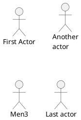
## 用例描述
- 如果想定义跨越多行的用例描述，可以用双引号将其裹起来。
- 还可以使用这些分隔符：-- .. == __。并且还可以在分隔符中间放置标题。
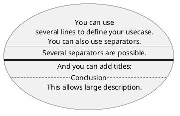
## 基础示例
- 用箭头--> 连接角色和用例。
- 横杠-越多，箭头越长。通过在箭头定义的后面加一个冒号及文字的方式来添加标签。
- 在这个例子中，User 并没有定义，而是直接拿来当做一个角色使用。
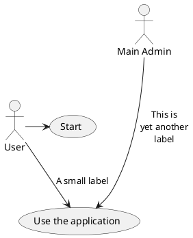
## 继承
如果一个角色或者用例继承于另一个，那么可以用<|--符号表示。
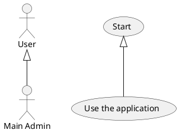
## 使用注释
- 可以用note left of , note right of , note top of , note bottom of 等关键字给一个对象添加注释。
- 注释还可以通过note 关键字来定义，然后用.. 连接其他对象。
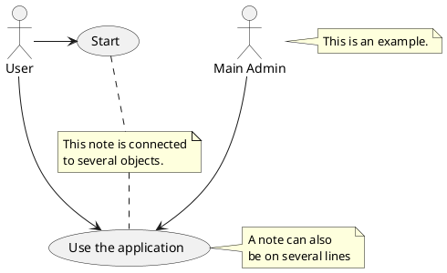
## 构造类型
用<< 和>> 来定义角色或者用例的构造类型。
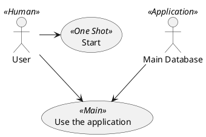
## 改变箭头方向
- 默认连接是竖直方向的，用--表示，可以用一个横杠或点来表示水平连接。
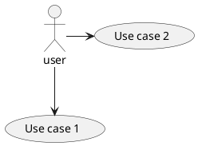
- 也可以通过翻转箭头来改变方向。
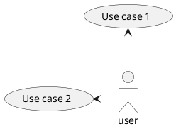
- 还可以通过给箭头添加left, right, up 或down 等关键字来改变方向。
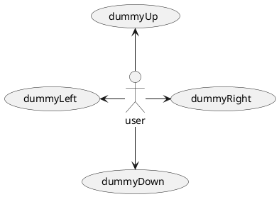
- 这些方向关键字也可以只是用首字母或者前两个字母的缩写来代替。但是请注意，这样的缩写不要乱用，Graphviz 不喜欢这样。
## 分割图示
用newpage 关键字将图示分解为多个页面。
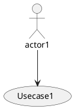
## 从左向右方向
- 默认从上往下构建图示。
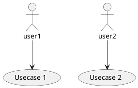
- 你可以用left to right direction 命令改变图示方向。
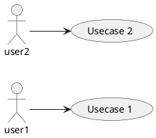
## 显示参数
用skinparam 改变字体和颜色。
可以在如下场景中使用：
• 在图示的定义中，
• 在引入的文件中，
• 在命令行或者ANT 任务提供的配置文件中。
你也可以给构造的角色和用例指定特殊颜色和字体。
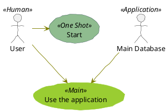
## 一个完整的例子
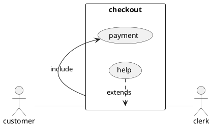

# 类图

## 类之间的关系
类之间的关系通过下面的符号定义:

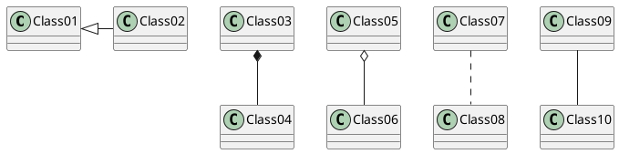
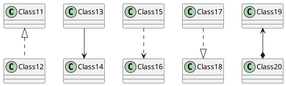
```plantuml
@startuml
Class21 #-- Class22
Class23 x-- Class24
Class25 }-- Class26
Class27 +-- Class28
Class29 ^-- Class30
@enduml
```
## 关系上的标识
- 在关系之间使用标签来说明时, 使用: 后接标签文字。
- 对元素的说明，你可以在每一边使用"" 来说明.
```plantuml
@startuml
Class01 "1" *-- "many" Class02 : contains
Class03 o-- Class04 : aggregation
Class05 --> "1" Class06
@enduml
```
- 在标签的开始或结束位置添加< 或> 以表明是哪个对象作用到哪个对象上。
```plantuml
@startuml
class Car
Driver - Car : drives >
Car *- Wheel : have 4 >
Car -- Person : < owns
@enduml
```
## 添加方法
- 为了声明字段(对象属性）或者方法，你可以使用后接字段名或方法名。
- 系统检查是否有括号来判断是方法还是字段。
```plantuml
@startuml
Object <|-- ArrayList
Object : equals()
ArrayList : Object[] elementData
ArrayList : size()
@enduml
```
- 也可以使用{} 把字段或者方法括起来
> 注意，这种语法对于类型/名字的顺序是非常灵活的。

```plantuml
@startuml
class Dummy {
String data
void methods()
}
class Flight {
flightNumber : Integer
departureTime : Date
}
@enduml
```
- 你可以（显式地）使用{field} 和{method} 修饰符来覆盖解析器的对于字段和方法的默认行为
> `<blockquote>`You can use {field} and {method} modifiers to override default behaviour of the parser about fields and
methods. `</blockquote>`
```plantuml 
@startuml
class Dummy {
{field} A field (despite parentheses)
{method} Some method
}
@enduml
```
## 定义可访问性
- 一旦你定义了域或者方法，你可以定义相应条目的可访问性质。

```plantuml
@startuml
scale 5
class Dummy {
-field1
#field2
~method1()
+method2()
}
@enduml
```
- 你可以采用以下命令停用这些特性skinparam classAttributeIconSize 0 ：
```plantuml
@startuml
skinparam classAttributeIconSize 0
class Dummy {
-field1
#field2
~method1()
+method2()
}
@enduml
```
## 抽象与静态
- 通过修饰符{static} 或者{abstract}，可以定义静态或者抽象的方法或者属性。
- 这些修饰符可以写在行的开始或者结束。也可以使用{classifier} 这个修饰符来代替{static}.
```plantuml
@startuml
class Dummy {
{static} String id
{abstract} void methods()
}
@enduml
```
## 高级类体
- PlantUML 默认自动将方法和属性重新分组，你可以自己定义分隔符来重排方法和属性，下面的分隔符都是可用的：-- .. == __.
还可以在分隔符中添加标题：
```plantuml
@startuml
class Foo1 {
You can use
several lines
..
as you want
and group
==
things together.
__
You can have as many groups
as you want
--
End of class
}
class User {
.. Simple Getter ..
+ getName()
+ getAddress()
.. Some setter ..
+ setName()
__ private data __
int age
-- encrypted --
String password
}
@enduml
```
## 备注和模板
- 模板通过类关键字("<<" 和">>") 来定义
- 你可以使用note left of , note right of , note top of , note bottom of 这些关键字来添加备注。
- 你还可以在类的声明末尾使用note left, note right,note top, note bottom 来添加备注。
- 此外，单独用note 这个关键字也是可以的，使用.. 符号可以作出一条连接它与其它对象的虚线。
```plantuml
@startuml
class Object << general >>
Object <|--- ArrayList
note top of Object : In java, every class\nextends this one.
note "This is a floating note" as N1
note "This note is connected\nto several objects." as N2
Object .. N2
N2 .. ArrayList
class Foo
note left: On last defined class
@enduml
```
## 更多注释
可以在注释中使用部分html 标签：
- `<b>`
- `<u>`
- `<i>`
- `<s>, <del>, <strike>`
- `<font color="#AAAAAA"> or <font color="colorName">`
- `<color:#AAAAAA> or <color:colorName>`
- `<size:nn> to change font size`
- ` or : the file must be accessible by the filesystem`
你也可以在注释中展示多行。
你也可以在定义的class 之后直接使用note left, note right, note top, note bottom 来定义注释。
```plantuml
@startuml
class Foo
note left: On last defined class
note top of Object
In java, <size:18>every</size> <u>class</u>
<b>extends</b>
<i>this</i> one.
end note
note as N1
This note is <u>also</u>
<b><color:royalBlue>on several</color>
<s>words</s> lines
And this is hosted by 
end note
@enduml
```
## 链接的注释
- 在定义链接之后，你可以用note on link 给链接添加注释
- 如果想要改变注释相对于标签的位置，你也可以用note left on link，note right on link，note bottom on link。（对应位置分别在label 的左边，右边，下边）
```plantuml
@startuml
class Dummy
Dummy --> Foo : A link
note on link #red: note that is red
Dummy --> Foo2 : Another link
note right on link #blue
this is my note on right link
and in blue
end note
@enduml
```
## 抽象类和接口
- 用关键字abstract 或abstract class 来定义抽象类。抽象类用斜体显示。
- 也可以使用interface, annotation 和enum 关键字。
```plantuml
@startuml
abstract class AbstractList
abstract AbstractCollection
interface List
interface Collection
List <|-- AbstractList
Collection <|-- AbstractCollection
Collection <|- List
AbstractCollection <|- AbstractList
AbstractList <|-- ArrayList
class ArrayList {
Object[] elementData
size()
}
enum TimeUnit {
DAYS
HOURS
MINUTES
}
annotation SuppressWarnings
@enduml
```
## 使用非字母字符
如果你想在类（或者枚举）的显示中使用非字母符号，你可以：
- 在类的定义中使用as 关键字
- 在类名旁边加上""
```plantuml
@startuml
class "This is my class" as class1
class class2 as "It works this way too"
class2 *-- "foo/dummy" : use
@enduml
```
## 隐藏属性、函数等
通过使用命令“hide/show”，你可以用参数表示类的显示方式。
基础命令是: hide empty members. 这个命令会隐藏空白的方法和属性。
除empty members 外，你可以用:
- empty fields 或者empty attributes 空属性,
- empty methods 空函数，
- fields 或attributes 隐藏字段或属性，即使是被定义了
- methods 隐藏方法，即使是被定义了
- members 隐藏字段和方法，即使是被定义了
- circle 类名前带圈的，
- stereotype 原型。
同样可以使用hide 或show 关键词，对以下内容进行设置：
- class 所有类，
- interface 所有接口，
- enum 所有枚举，
- `<<foo1>>` 实现foo1 的类，
- 一个既定的类名。
你可以使用show/hide 命令来定义相关规则和例外。
```plantuml
@startuml
class Dummy1 {
+myMethods()
}
class Dummy2 {
+hiddenMethod()
}
class Dummy3 <<Serializable>> {
String name
}
hide members
hide <<Serializable>> circle
show Dummy1 methods
show <<Serializable>> fields
@enduml
```
## 隐藏类
你也可以使用show/hide 命令来隐藏类
如果你定义了一个大的!included 文件，且想在文件包含之后隐藏部分类，该功能会很有帮助。
```plantuml
@startuml
class Foo1
class Foo2
Foo2 *-- Foo1
hide Foo2
@enduml
```
## 泛型（generics）
你可以用< 和> 来定义类的泛型。
```plantuml
@startuml
class Foo<? extends Element> {
int size()
}
Foo *- Element
@enduml
```
It is possible to disable this drawing using skinparam genericDisplay old command
## 指定标记（Spot）
通常标记字符(C, I, E or A) 用于标记类(classes), 接口（interface）, 枚举（enum）和抽象类（abstract classes）.
但是当你想定义原型时，可以增加对应的单个字符及颜色，来定义自己的标记（spot），就像下面一样：
```plantuml
@startuml
class System << (S,#FF7700) Singleton >>
class Date << (D,orchid) >>
@enduml
```
## 包
你可以通过关键词package 声明包，同时可选的来声明对应的背景色（通过使用html 色彩代码或名称）。
注意：包可以被定义为嵌套。
```plantuml
@startuml
package "Classic Collections" #DDDDDD {
Object <|-- ArrayList
}
package net.sourceforge.plantuml {
    Object <|-- Demo1
Demo1 *- Demo2
}
@enduml
```
## 包样式
包可以定义不同的样式。
你可以通过以下的命令来设置默认样式: skinparam packageStyle, 或者对包使用对应的模板:
```plantuml
@startuml
scale 750 width
package foo1 <<Node>> #orange{
class Class1
}
package foo2 <<Rectangle>> #lightblue{
class Class2
}
package foo3 <<Folder>> {
class Class3
}
package foo4 <<Frame>> {
class Class4
}
package foo5 <<Cloud>> {
class Class5
}
package foo6 <<Database>> {
class Class6
}
@enduml
```
你也可以参考下面的示例来定义包之间的连线:
```plantuml
@startuml
skinparam packageStyle rectangle
package foo1.foo2 {
}
package foo1.foo2.foo3 {
class Object
}
foo1.foo2 +-- foo1.foo2.foo3
@enduml
```
## 命名空间（Namespaces）
在使用包（package）时（区别于命名空间），类名是类的唯一标识。也就意味着，在不同的包（package）
中的类，不能使用相同的类名。
<blockquote> In packages, the name of a class is the unique identifier of this class. It means that you cannot have
two classes with the very same name in different packages. </blockquote>
在那种情况下（译注：同名、不同全限定名类），你应该使用命名空间来取而代之。<blockquote> In that
case, you should use namespaces instead of packages. </blockquote>
你可以从其他命名空间，使用全限定名来引用类，默认命名空间（译注：无名的命名空间）下的类，以一
个“." 开头（的类名）来引用（译注：示例中的BaseClass).
`<blockquote>` You can refer to classes from other namespaces by fully qualify them. Classes from the default
namespace are qualified with a starting dot. `</blockquote>`
注意：你不用显示地创建命名空间：一个使用全限定名的类会自动被放置到对应的命名空间。`<blockquote>`
Note that you don't have to explicitly create namespace : a fully qualified class is automatically put in the rightnamespace. `</blockquote>`
```plantuml
@startuml
class BaseClass
namespace net.dummy #DDDDDD {
.BaseClass <|-- Person
Meeting o-- Person
.BaseClass <|- Meeting
}
namespace net.foo {
net.dummy.Person <|- Person
.BaseClass <|-- Person
net.dummy.Meeting o-- Person
}
BaseClass <|-- net.unused.Person
@enduml
```
## 自动创建命名空间
使用命令set namespaceSeparator ??? 你可以自定义命名空间分隔符（为“.”以外的字符）.
```plantuml
@startuml
set namespaceSeparator ::
class X1::X2::foo {
some info
}
@enduml
```
禁止自动创建包则可以使用set namespaceSeparator none.
```plantuml
@startuml
set namespaceSeparator none
class X1.X2.foo {
some info
}
@enduml
```
## 棒棒糖接口
需要定义棒棒糖样式的接口时可以遵循以下语法:
- bar ()- foo
- bar ()-- foo
- foo -() bar
```plantuml
@startuml
class foo
bar ()- foo
foo --() car
@enduml
```
## 改变箭头方向
类之间默认采用两个破折号-- 显示出垂直方向的线. 要得到水平方向的可以像这样使用单破折号(或者点):
```plantuml
@startuml
Room o- Student
Room *-- Chair
@enduml
```
你也可以通过改变倒置链接来改变方向
```plantuml
@startuml
Student -o Room
Chair --* Room
@enduml
```
也可通过在箭头内部使用关键字，例如left, right, up 或者down，来改变方向
```plantuml
@startuml
foo -left-> dummyLeft
foo -right-> dummyRight
foo -up-> dummyUp
foo -down-> dummyDown
@enduml
```
## “关系”类
你可以在定义了两个类之间的关系后定义一个关系类association class 例如:
```plantuml
@startuml
class Student {
Name
}

Student "0..*" - "1..*" Course

class Enrollment {
drop()
cancel()
}

(Student, Course) .. Enrollment
@enduml
```
也可以用另一种方式:
```plantuml
@startuml
class Student {
Name
}
Student "0..*" -- "1..*" Course
(Student, Course) . Enrollment
class Enrollment {
drop()
cancel()
}
@enduml
```
## 皮肤参数
用skinparam 改变字体和颜色。
可以在如下场景中使用：
- 在图示的定义中，
- 在引入的文件中，
- 在命令行或者ANT 任务提供的配置文件中。
```plantuml
@startuml
skinparam class {
BackgroundColor PaleGreen
ArrowColor SeaGreen
BorderColor Red
}
skinparam stereotypeCBackgroundColor Yellow
skinparam BackgroundColor grey
Class01 "1" *-- "many" Class02 : contains
Class03 o-- Class04 : aggregation
@enduml
```
## Skinned Stereotypes
You can define specific color and fonts for stereotyped classes.
```plantuml
@startuml
skinparam class {
BackgroundColor PaleGreen
ArrowColor SeaGreen
BorderColor SpringGreen
BackgroundColor<<Foo>> Wheat
BorderColor<<Foo>> Tomato
}
skinparam stereotypeCBackgroundColor YellowGreen
skinparam stereotypeCBackgroundColor<< Foo >> DimGray
Class01 <<Foo>>
Class03 <<Foo>>
Class01 "1" *-- "many" Class02 : contains
Class03 o-- Class04 : aggregation
@enduml
```
## Color gradient
It's possible to declare individual color for classes or note using the # notation.
You can use either standard color name or RGB code.
You can also use color gradient in background, with the following syntax: two colors names separated either by:
- |,
- /,
- \,
- or -
depending the direction of the gradient.
For example, you could have:
```plantuml
@startuml
skinparam backgroundcolor AntiqueWhite/Gold
skinparam classBackgroundColor Wheat|CornflowerBlue
class Foo #red-green
note left of Foo #blue\9932CC
this is my
note on this class
end note
package example #GreenYellow/LightGoldenRodYellow {
class Dummy
}
@enduml
```
## 辅助布局
有时候，默认布局并不完美...
你可以使用together 关键词将某些类进行分组：布局引擎会尝试将它们捆绑在一起（如同在一个包(package) 内)
你也可以使用建立隐藏链接的方式来强制布局
```plantuml
@startuml
class Bar1
class Bar2
together {
class Together1
class Together2
class Together3
}
Together1 - Together2
Together2 - Together3
Together2 -[hidden]--> Bar1
Bar1 -[hidden]> Bar2
@enduml
```
## 拆分大文件
有些情况下，会有一些很大的图片文件。
可以用page (hpages)x(vpages) 这个命令把生成的图片文件拆分成若干个文件。
hpages 用来表示水平方向页面数，and vpages 用来表示垂直方面页面数。
你也可以使用特定的皮肤设定来给分页添加边框（见例子）
```plantuml
@startuml
' Split into 4 pages
page 2x2
skinparam pageMargin 10
skinparam pageExternalColor gray
skinparam pageBorderColor black
class BaseClass
namespace net.dummy #DDDDDD {
.BaseClass <|-- Person
Meeting o-- Person
.BaseClass <|- Meeting
}
namespace net.foo {
net.dummy.Person <|- Person
.BaseClass <|-- Person
net.dummy.Meeting o-- Person
}
BaseClass <|-- net.unused.Person
@enduml
```

# 活动图
## 简单活动
- 使用(*) 作为活动图的开始点和结束点。
- 有时，你可能想用(*top) 强制开始点位于图示的顶端。
- 使用`-->` 绘制箭头。
```plantuml
@startuml
(*) -> "First Activity" as FA
FA --> (*)
@enduml
```
## 箭头上的标签
- 默认情况下，箭头开始于最接近的活动。
- 可以用[和] 放在箭头定义的后面来添加标签。
```plantuml
@startuml
(*) .-> "First Activity"
->[You can put also labels] "Second Activity"
--> (*)
@enduml
```
## 改变箭头方向
你可以使用-> 定义水平方向箭头，还可以使用下列语法强制指定箭头的方向：
- -down-> (default arrow)
- -right-> or ->
- -left->
- -up->
```plantuml
@startuml
(*) -up-> "First Activity"
-right-> "Second Activity"
--> "Third Activity"
-left-> (*)
@enduml
```
## 分支
你可以使用关键字if/then/else 创建分支。
```plantuml
@startuml
(*) --> "Initialization"
if "Some Test" then
-->[true] "Some Activity"
--> "Another activity"
-right-> (*)
else
->[false] "Something else"
-->[Ending process] (*)
endif
@enduml
```
不过，有时你可能需要重复定义同一个活动：
```plantuml
@startuml
(*) --> "check input"
If "input is verbose" then
--> [Yes] "turn on verbosity"
--> "run command"
else
--> "run command"
Endif
-->(*)
@enduml
```
## 更多分支
默认情况下，一个分支连接上一个最新的活动，但是也可以使用if 关键字进行连接。
还可以嵌套定义分支。
```plantuml
@startuml
(*) --> if "Some Test" then
-->[true] "activity 1"
if "" then
-> "activity 3" as a3
else
if "Other test" then
-left-> "activity 5"
else
--> "activity 6"
endif
endif
else
->[false] "activity 2"
endif
a3 --> if "last test" then
--> "activity 7"
else
-> "activity 8"
endif
@enduml
```
## 同步
你可以使用=== code === 来显示同步条。
```plantuml
@startuml
(*) --> ===B1===
--> "Parallel Activity 1"
--> ===B2===
===B1=== --> "Parallel Activity 2"
--> ===B2===
--> (*)
@enduml
```
## 长的活动描述
定义活动时可以用\n 来定义跨越多行的描述。
还可以用as 关键字给活动起一个短的别名。这个别名可以在接下来的图示定义中使用。
```plantuml
@startuml
(*) -left-> "this <size:20>activity</size>
is <b>very</b> <color:red>long2</color>
and defined on several lines
that contains many <i>text</i>" as A1
-up-> "Another activity\n on several lines"
A1 --> "Short activity "
@enduml
```
## 注释
你可以在活动定义之后用note left, note right, note top or note bottom, 命令给活动添加注释。
如果想给开始点添加注释，只需把注释的定义放在活动图最开始的地方即可。
也可以用关键字endnote 定义多行注释。
```plantuml
@startuml
(*) --> "Some Activity"
note right: This activity has to be defined
"Some Activity" --> (*)
note left
This note is on
several lines
end note
@enduml
```
## 分区
用关键字partition 定义分区，还可以设置背景色(用颜色名或者颜色值)。
定义活动的时候，它自动被放置到最新的分区中。
用} 结束分区的定义。
```plantuml
@startuml
partition Conductor {
(*) --> "Climbs on Platform"
--> === S1 ===
--> Bows
}
partition Audience #LightSkyBlue {
=== S1 === --> Applauds
}
partition Conductor {
Bows --> === S2 ===
--> WavesArmes
Applauds --> === S2 ===
}
partition Orchestra #CCCCEE {
WavesArmes --> Introduction
--> "Play music"
}
@enduml
```
## 显示参数
用skinparam 命令修改字体和颜色。
如下场景可用：
• 在图示定义中
• 在引入的文件中
• 在命令行或ANT 任务提供的配置文件中。
还可以为构造类型指定特殊颜色和字体。
```plantuml
@startuml
skinparam backgroundColor #AAFFFF
skinparam activity {
StartColor red
BarColor SaddleBrown
EndColor Silver
BackgroundColor orange
BackgroundColor<< Begin >> Olive
BorderColor blue
FontName Impact
}
(*) --> "Climbs on Platform" << Begin >>
--> === S1 ===
--> Bows
--> === S2 ===
--> WavesArmes
--> (*)
@enduml
```
## 八边形活动
可用用skinparam activityShape octagon 命令将活动的外形改为八边形。
```plantuml
@startuml
'Default is skinparam activityShape roundBox
skinparam activityShape octagon
(*) --> "First Activity"
--> "Second Activity"
--> (*)
@enduml
```
## 一个完整的例子
```plantuml
@startuml
title Servlet Container
(*) --> "ClickServlet.handleRequest()"
--> "new Page"
if "Page.onSecurityCheck" then
->[true] "Page.onInit()"
if "isForward?" then
->[no] "Process controls"
if "continue processing?" then
-->[yes] ===RENDERING===
else
-->[no] ===REDIRECT_CHECK===
endif
else
-->[yes] ===RENDERING===
endif
if "is Post?" then
-->[yes] "Page.onPost()"
--> "Page.onRender()" as render
--> ===REDIRECT_CHECK===
else
-->[no] "Page.onGet()"
--> render
endif
else
-->[false] ===REDIRECT_CHECK===
endif
if "Do redirect?" then
->[yes] "redirect request"
--> ==BEFORE_DESTROY===
else
if "Do Forward?" then
-left->[yes] "Forward request"
--> ==BEFORE_DESTROY===
else
-right->[no] "Render page template"
--> ==BEFORE_DESTROY===
endif
endif
--> "Page.onDestroy()"
-->(*)
@enduml
```
# 活动图(新语法)
当前活动图(activity diagram) 的语法有诸多限制和缺点，比如代码难以维护。所以从V7947 开始提出一种全新的、更好的语法格式和软件实现供用户使用(beta 版)。就像序列图一样，<font color=red>新的软件实现的另一个优点是它不再依赖于Graphviz</font>。新的语法将会替换旧的语法。然而考虑到兼容性，旧的语法仍被能够使用以确保向前兼容。但是我们鼓励用户使用新的语法格式。
## 简单活动图
- 活动标签(activity label) 以冒号开始，以分号结束。
- 文本格式支持creole wiki 语法。
- 活动默认安装它们定义的顺序就行连接。
```plantuml
@startuml
:Hello world;
:This is on defined on
several **lines**;
@enduml
```
## 开始/结束
你可以使用关键字start 和stop 表示图示的开始和结束。
```plantuml
@startuml
start
:Hello world;
:This is on defined on
several **lines**;
stop
@enduml
```
也可以使用end 关键字。
```plantuml
@startuml
start
:Hello world;
:This is on defined on
several **lines**;
end
@enduml
```
## 条件语句
在图示中可以使用关键字if，then 和else 设置分支测试。标注文字则放在括号中。
```plantuml
@startuml
start
if (Graphviz installed?) then (yes)
:process all\ndiagrams;
else (no)
:process only
__sequence__ and __activity__ diagrams;
endif
stop
@enduml
```
也可以使用关键字elseif 设置多个分支测试。
```plantuml
@startuml
start
if (condition A) then (yes)
:Text 1;
elseif (condition B) then (yes)
:Text 2;
stop
elseif (condition C) then (yes)
:Text 3;
elseif (condition D) then (yes)
:Text 4;
else (nothing)
:Text else;
endif
stop
@enduml
@enduml
```
## 重复循环
你可以使用关键字repeat 和repeatwhile 进行重复循环。
```plantuml
@startuml
start
repeat
:read data;
:generate diagrams;
repeat while (more data?)
stop
@enduml
```
## while 循环
可以使用关键字while 和end while 进行while 循环。
```plantuml
@startuml
start
while (data available?)
:read data;
:generate diagrams;
endwhile
stop
@enduml
```
还可以在关键字endwhile 后添加标注，还有一种方式是使用关键字is。
```plantuml
@startuml
while (check filesize ?) is (not empty)
:read file;
endwhile (empty)
:close file;
@enduml
```
## 并行处理
你可以使用关键字fork，fork again 和end fork 表示并行处理。
```plantuml
@startuml
start
if (multiprocessor?) then (yes)
fork
:Treatment 1;
fork again
:Treatment 2;
end fork
else (monoproc)
:Treatment 1;
:Treatment 2;
endif
@enduml
```
## 注释
文本格式支持creole wiki 语法。
A note can be floating, using floating keyword.
```plantuml
@startuml
start
:foo1;
floating note left #red: This is a note
:foo2;
note right
This note is on several
//lines// and can
contain <b>HTML</b>
====
* Calling the method ""foo()"" is prohibited
end note
stop
@enduml
```
## 颜色
你可以为活动(activity) 指定一种颜色。
```plantuml
@startuml

start
:starting progress;
#HotPink:reading configuration files
These files should edited at this point!;
#AAAAAA:ending of the process;
@enduml
```
## 箭头
使用-> 标记，你可以给箭头添加文字或者修改箭头颜色。
同时，你也可以选择点状(dotted)，条状(dashed)，加粗或者是隐式箭头
```plantuml
@startuml
:foo1;
-> You can put text on arrows;
if (test) then
-[#blue]->
:foo2;
-[#green,dashed]-> The text can
also be on several lines
and **very** long...;
:foo3;
else
-[#black,dotted]->
:foo4;
endif
-[#gray,bold]->
:foo5;
@enduml
```
## 连接器(Connector)
你可以使用括号定义连接器。
```plantuml
@startuml
start
:Some activity;
(A)
detach
(A)
:Other activity;
@enduml
```
## 组合(grouping)
通过定义分区(partition)，你可以把多个活动组合(group) 在一起。
```plantuml
@startuml
start
partition Initialization {
-[#blue,dashed]->
:read config file;
-[#orange,bold]->
:init internal variable;
-[#green,dotted]->
}
partition Running {
:wait for user interaction;
:print information;
}
stop
@enduml
```
## 泳道(Swimlanes)
你可以使用管道符| 来定义泳道。
还可以改变泳道的颜色。
```plantuml
@startuml
|Swimlane1|
start
:foo1;
|#AntiqueWhite|Swimlane2|
:foo2;
:foo3;
|Swimlane1|
:foo4;
|Swimlane2|
:foo5;
stop
@enduml
```
## 分离(detach)
可以使用关键字detach 移除箭头。
```plantuml
@startuml
:start;
fork
:foo1;
:foo2;
fork again
:foo3;
detach
endfork
if (foo4) then
:foo5;
detach
endif
:foo6;
detach
:foo7;
stop
@enduml
```
## 特殊领域语言(SDL)
通过修改活动标签最后的分号分隔符(;)，可以为活动设置不同的形状。
• |
• <
• >
• /
• ]
• }
```plantuml
@startuml
:Ready;
:next(o)|
:Receiving;
split
:nak(i)<
:ack(o)>
split again
:ack(i)<
:next(o)
on several line|
:i := i + 1]
:ack(o)>
split again
:err(i)<
:nak(o)>
split again
:foo/
split again
:i > 5}
stop
end split
:finish;
@enduml
```
## 一个完整的例子
```plantuml
@startuml
start
:ClickServlet.handleRequest();
:new page;
if (Page.onSecurityCheck) then (true)
:Page.onInit();
if (isForward?) then (no)
:Process controls;
if (continue processing?) then (no)
stop
endif
if (isPost?) then (yes)
:Page.onPost();
else (no)
:Page.onGet();
endif
:Page.onRender();
endif
else (false)
endif
if (do redirect?) then (yes)
:redirect process;
else
if (do forward?) then (yes)
:Forward request;
else (no)
:Render page template;
endif
endif
stop
@enduml
```
# 组件图
我们来看几个例子:
## 组件
- 组件必须用中括号括起来。
- 还可以使用关键字component 定义一个组件。并且可以用关键字as 给组件定义一个别名。这个别名可以在稍后定义关系的时候使用。
```plantuml
@startuml
[First component]
[Another component] as Comp2
component Comp3
component [Last\ncomponent] as Comp4
@enduml
```
## 接口
- 接口可以使用() 来定义(因为这个看起来像个圆)。
- 还可以使用关键字interface 关键字来定义接口。并且还可以使用关键字as 定义一个别名。这个别名可以在稍后定义关系的时候使用。
- 我们稍后可以看到，接口的定义是可选的。
```plantuml
@startuml
() "First Interface"
() "Another interface" as Interf2
interface Interf3
interface "Last\ninterface" as Interf4
@enduml
```
## 基础的示例
元素之间可以使用虚线(..)、直线(--)、箭头(-->) 进行连接。
```plantuml
@startuml
DataAccess - [First Component]
[First Component] ..> HTTP : use
@enduml
```
## 使用注释
你可以使用note left of , note right of , note top of , note bottom of 等关键字定义相对于对象
位置的注释。
也可以使用关键字note 单独定义注释，然后使用虚线(..) 将其连接到其他对象。
```plantuml
@startuml
interface "Data Access" as DA
DA - [First Component]
[First Component] ..> HTTP : use
note left of HTTP #blue: Web Service only
note right of [First Component]
A note can also
be on several lines
end note
@enduml
```
## 组合组件
你可以使用多个关键字将组件和接口组合在一起。
- package
- node
- folder
- frame
- cloud
- database
```plantuml
@startuml
package "Some Group" {
HTTP - [First Component]
[Another Component]
}
node "Other Groups" {
FTP - [Second Component]
[First Component] --> FTP
}
cloud "cloud group"{
[Example 1]
}
database "MySql" {
folder "This is my folder" {
[Folder 3]
}
frame "Foo" {
[Frame 4]
}
}
[Another Component] --> [Example 1]
[Example 1] --> [Folder 3]
[Folder 3] --> [Frame 4]
@enduml
```
## 改变箭头方向
默认情况下，对象之间用--连接，并且连接是竖直的。不过可以使用一个横线或者点设置水平方向的连接，就像这样：
```plantuml
@startuml
[Component] --> Interface1
[Component] -> Interface2
@enduml
```
也可以使用反向连接：
```plantuml
@startuml
Interface1 <-- [Component]
Interface2 <- [Component]
@enduml
```
还可以使用关键字left, right, up or down 改变箭头方向。
```plantuml
@startuml
[Component] -left-> left
[Component] -right-> right
[Component] -up-> up
[Component] -down-> down
@enduml
```
允许使用方向单词的首字母或者前两个字母表示方向(例如-d-, -do-, -down-都是等价的)。
请不要乱用这些功能：Graphviz(PlantUML 的后端引擎) 不喜欢这个样子。

## 使用UML2 标记符
命令skinparam componentStyle uml2 可以切换到UML2 标记符。
```plantuml
@startuml
skinparam componentStyle uml2
interface "Data Access" as DA
DA - [First Component]
[First Component] ..> HTTP : use
@enduml
```
## 长描述
可以用方括号"[ ]" 在连线上添加描述。
```plantuml
@startuml
component comp1 [
This component
has a long comment
on several lines
]
@enduml
```
## 不同的颜色表示
你可以在声明一个组件时加上颜色的声明。
```plantuml
@startuml
component [Web Server] #Yellow
@enduml
```
## 在定型组件中使用精灵图
你可以在定型组件中使用精灵图（sprite）。
```plantuml
@startuml
sprite $businessProcess [16x16/16] {
FFFFFFFFFFFFFFFF
FFFFFFFFFFFFFFFF
FFFFFFFFFFFFFFFF
FFFFFFFFFFFFFFFF
FFFFFFFFFF0FFFFF
FFFFFFFFFF00FFFF
FF00000000000FFF
FF000000000000FF
FF00000000000FFF
FFFFFFFFFF00FFFF
FFFFFFFFFF0FFFFF
FFFFFFFFFFFFFFFF
FFFFFFFFFFFFFFFF
FFFFFFFFFFFFFFFF
FFFFFFFFFFFFFFFF
FFFFFFFFFFFFFFFF
}
rectangle " End to End\nbusiness process" <<$businessProcess>> {
rectangle "inner process 1" <<$businessProcess>> as src
rectangle "inner process 2" <<$businessProcess>> as tgt
src -> tgt
}
@enduml
```
## 显示参数
用skinparam 改变字体和颜色。
可以在如下场景中使用：
• 在图示的定义中，
• 在引入的文件中，
• 在命令行或者ANT 任务提供的配置文件中。
可以为构造类型和接口定义特殊的颜色和字体。
```plantuml
@startuml
skinparam interface {
backgroundColor RosyBrown
borderColor orange
}
skinparam component {
FontSize 13
BackgroundColor<<Apache>> Red
BorderColor<<Apache>> #FF6655
FontName Courier
BorderColor black
BackgroundColor gold
ArrowFontName Impact
ArrowColor #FF6655
ArrowFontColor #777777
}
() "Data Access" as DA
DA - [First Component]
[First Component] ..> () HTTP : use
HTTP - [Web Server] << Apache >>
@enduml
```

```plantuml
 @startuml
[AA] <<static lib>>
[BB] <<shared lib>>
[CC] <<static lib>>
node node1
node node2 <<shared node>>
database Production
skinparam component {
backgroundColor<<static lib>> DarkKhaki
backgroundColor<<shared lib>> Green
}
skinparam node {
borderColor Green
backgroundColor Yellow
backgroundColor<<shared node>> Magenta
}
skinparam databaseBackgroundColor Aqua
@enduml
```
## 状态图
## 简单状态
使用([*]) 开始和结束状态图。
使用--> 添加箭头。
```plantuml
@startuml
[*] --> State1
State1 --> [*]
State1 : this is a string
State1 : this is another string
State1 -> State2
State2 --> [*]
@enduml
```
## Change state rendering
You can use hide empty description to render state as simple box.
```plantuml
@startuml
hide empty description
[*] --> State1
State1 --> [*]
State1 : this is a string
State1 : this is another string
State1 -> State2
State2 --> [*]
@enduml
```
## 合成状态
一个状态也可能是合成的，必须使用关键字state 和花括号来定义合成状态。
```plantuml
@startuml
scale 350 width
[*] --> NotShooting
state NotShooting {
[*] --> Idle
Idle --> Configuring : EvConfig
Configuring --> Idle : EvConfig
}
state Configuring {
[*] --> NewValueSelection
NewValueSelection --> NewValuePreview : EvNewValue
NewValuePreview --> NewValueSelection : EvNewValueRejected
NewValuePreview --> NewValueSelection : EvNewValueSaved

state NewValuePreview {
State1 -> State2
}
}
@enduml
```
## 长名字
也可以使用关键字state 定义长名字状态。
```plantuml
@startuml
scale 600 width
[*] -> State1
State1 --> State2 : Succeeded
State1 --> [*] : Aborted
State2 --> State3 : Succeeded
State2 --> [*] : Aborted
state State3 {
state "Accumulate Enough Data\nLong State Name" as long1
long1 : Just a test
[*] --> long1
long1 --> long1 : New Data
long1 --> ProcessData : Enough Data
}
State3 --> State3 : Failed
State3 --> [*] : Succeeded / Save Result
State3 --> [*] : Aborted
@enduml
```
## 并发状态
用-- or || 作为分隔符来合成并发状态。
```plantuml
@startuml
[*] --> Active
state Active {
[*] -> NumLockOff
NumLockOff --> NumLockOn : EvNumLockPressed
NumLockOn --> NumLockOff : EvNumLockPressed
--
[*] -> CapsLockOff
CapsLockOff --> CapsLockOn : EvCapsLockPressed
CapsLockOn --> CapsLockOff : EvCapsLockPressed
--
[*] -> ScrollLockOff
ScrollLockOff --> ScrollLockOn : EvCapsLockPressed
ScrollLockOn --> ScrollLockOff : EvCapsLockPressed
}
@enduml
```
## 箭头方向
使用-> 定义水平箭头，也可以使用下列格式强制设置箭头方向：
- -down-> (default arrow)
- -right-> or ->
- -left->
- -up->
```plantuml
@startuml
[*] -up-> First
First -right-> Second
Second --> Third
Third -left-> Last
@enduml
```
可以用首字母缩写或者开始的两个字母定义方向(如, -d-，-down-和-do-是完全等价的)。
请不要滥用这些功能，Graphviz 不喜欢这样。
## 注释
- 可以用note left of, note right of, note top of, note bottom of 关键字来定义注释。
- 还可以定义多行注释。
```plantuml
@startuml
[*] --> Active
Active --> Inactive
note left of Active : this is a short\nnote
note right of Inactive
A note can also
be defined on
several lines
end note
@enduml
```
以及浮动注释。
```plantuml
@startuml
state foo
note "This is a floating note" as N1
@enduml
```
更多注释
可以在合成状态中放置注释。
```plantuml
@startuml
[*] --> NotShooting
state "Not Shooting State" as NotShooting {
state "Idle mode" as Idle
state "Configuring mode" as Configuring
[*] --> Idle
Idle --> Configuring : EvConfig
Configuring --> Idle : EvConfig
}
note right of NotShooting : This is a note on a composite state
@enduml
```
## 显示参数
用skinparam 改变字体和颜色。
可以在如下场景中使用：
• 在图示的定义中，
• 在引入的文件中，
• 在命令行或者ANT 任务提供的配置文件中。
还可以为状态的构造类型指定特殊的字体和颜色。
```plantuml
@startuml
skinparam backgroundColor LightYellow
skinparam state {
StartColor MediumBlue
EndColor Red
BackgroundColor Peru
BackgroundColor<<Warning>> Olive
BorderColor Gray
FontName Impact
}
[*] --> NotShooting
state "Not Shooting State" as NotShooting {
state "Idle mode" as Idle <<Warning>>
state "Configuring mode" as Configuring
[*] --> Idle
Idle --> Configuring : EvConfig
Configuring --> Idle : EvConfig
}
NotShooting --> [*]
@enduml
```
# 对象图
## 对象的定义
使用关键字object 定义实例。
```plantuml
@startuml
object firstObject
object "My Second Object" as o2
@enduml
```
## 对象之间的关系
对象之间的关系用如下符号定义：


也可以用.. 来代替-- 以使用点线。
知道了这些规则，就可以画下面的图：
可以用冒号给关系添加标签，标签内容紧跟在冒号之后。
用双引号在关系的两边添加基数。
```plantuml
@startuml
object Object01
object Object02
object Object03
object Object04
object Object05
object Object06
object Object07
object Object08
Object01 <|-- Object02
Object03 *-- Object04
Object05 o-- "4" Object06
Object07 .. Object08 : some labels
@enduml
```
## 添加属性
用冒号加属性名的形式声明属性。
```plantuml
@startuml
object user
user : name = "Dummy"
user : id = 123
@enduml
```
也可以用大括号批量声明属性。
```plantuml
@startuml
object user {
name = "Dummy"
id = 123
}
@enduml
```
## 类图中的通用特性
- 可见性
- 定义注释
- 使用包
- 美化输出内容

# 通用命令
## 注释
- 所有以单引号' 开头的语句，被认为是一个注释.
- 多行注释，以/' 和'/ 作为注释的开始和结束
## 页眉和页脚
你可以使用header 和footer 命令在生成的图中增加页眉和页脚。
你可以选择指定center, left 或right 关键字使页眉或页脚实现居中、左对齐和右对齐。
像标题一样，页眉或页脚内容可以在多行中定义，而且同样可以在页眉或页脚中输入一些HTML 代码。
```plantuml
@startuml
Alice -> Bob: Authentication Request
header
<font color=red>Warning:</font>
Do not use in production.
endheader
center footer Generated for demonstration
@enduml
```
## 缩放
You can use the scale command to zoom the generated image.
You can use either a number or a fraction to define the scale factor. You can also specify either width or height (in
pixel). And you can also give both width and height : the image is scaled to fit inside the specified dimension.
• scale 1.5
• scale 2/3
• scale 200 width
• scale 200 height
• scale 200*100
• scale max 300*200
• scale max 1024 width
• scale max 800 height
```plantuml
@startuml
scale 380*190
Bob->Alice : hello
@enduml
```
## 标题
使用title 关键字添加标题。你可以在标题描述中使用\n 添加新行。
Some skinparam settings are available to put borders on the title.
```plantuml
@startuml
skinparam titleBorderRoundCorner 15
skinparam titleBorderThickness 2
skinparam titleBorderColor red
skinparam titleBackgroundColor Aqua-CadetBlue
title Simple communication\nexample
Alice -> Bob: Authentication Request
Bob --> Alice: Authentication Response
@enduml
```
You can use creole formatting in the title.
You can also define title on several lines using title and end title keywords.
```plantuml
@startuml
title
<u>Simple</u> communication example
on <i>several</i> lines and using <back:cadetblue>creole tags</back>
end title
Alice -> Bob: Authentication Request
Bob -> Alice: Authentication Response
@enduml
```
## 图片标题
使用caption 关键字在图像下放置一个标题.
```plantuml
@startuml
caption figure 1
Alice -> Bob: Hello
@enduml
```
## 图例说明
legend 和end legend 作为关键词，用于配置一个图例(legend). 支持可选地使用left,right,center 为
这个图例指定对齐方式.
```plantuml
@startuml
Alice -> Bob : Hello
legend right
Short
legend
endlegend
@enduml
```
```plantuml
@startuml
Alice -> Bob : Hello
legend left
Short
legend
endlegend
@enduml
```
# Creole
A light Creole engine has been integrated into PlantUML to have a standardized way of defining text style.
All diagrams are now supporting this syntax.
Note that ascending compatibility with HTML syntax is preserved
## Emphasized text
```plantuml
@startuml
Alice -> Bob : hello --there--
... Some ~~long delay~~ ...
Bob -> Alice : ok
note left
This is **bold**
This is //italics//
This is ""monospaced""
This is --stroked--
This is __underlined__
This is ~~waved~~
end note
@enduml
```
## List
```plantuml
@startuml
object demo {
* Bullet list
* Second item
}
note left
* Bullet list
* Second item
** Sub item
# Numbered list
# Second item
## Sub item
end note
legend
# Numbered list
# Second item
## Sub item
## Another sub item
# Third item
end legend
@enduml
```
## Escape character
You can use the tilde ~ to escape special creole characters.
```plantuml
@startuml
object demo {
This is not ~___underscored__.
This is not ~""monospaced"".
}
@enduml
```
## Horizontal lines
```plantuml
@startuml
database DB1 as "
You can have horizontal line
----
Or double line
====
Or strong line
____
Or dotted line
..My title..
Enjoy!
"
note right
This is working also in notes
You can also add title in all these lines
==Title==
--Another title--
end note
@enduml
```
## Headings
```plantuml
@startuml
usecase UC1 as "
= Extra-large heading
Some text
== Large heading
Other text
=== Medium heading
Information
....
==== Small heading"
@enduml
```
## Legacy HTML
Some HTML tags are also working:
- `<b>` for bold text
- `<u> or <u:#AAAAAA> or <u:colorName>` for underline
- `<i>` for italic
- `<s> or <s:#AAAAAA> or <s:colorName>` for strike text
- `<w> or <w:#AAAAAA> or <w:colorName>` for wave underline text
- `<color:#AAAAAA> or <color:colorName>`
- `<back:#AAAAAA> or <back:colorName>` for background color
- `<size:nn>` to change font size
- `` : the file must be accessible by the filesystem
- `` : the URL must be available from the Internet
```plantuml
@startuml
:* You can change <color:red>text color</color>
* You can change <back:cadetblue>background color</back>
* You can change <size:18>size</size>
* You use <u>legacy</u> <b>HTML <i>tag</i></b>
* You use <u:red>color</u> <s:green>in HTML</s> <w:#0000FF>tag</w>
----
* Use image : 
;
@enduml
```
## Table
It is possible to build table.
```plantuml
@startuml
skinparam titleFontSize 14
title
Example of simple table
|= |= table |= header |
| a | table | row |
| b | table | row |
end title
[*] --> State1
@enduml
```
You can specify background colors for cells and lines.
```plantuml
@startuml
start
:Here is the result
|= |= table |= header |
| a | table | row |
|<#FF8080> red |<#80FF80> green |<#8080FF> blue |
<#yellow>| b | table | row |;
@enduml
```
## Tree
You can use |_ characters to build a tree.
```plantuml
@startuml
skinparam titleFontSize 14
title
Example of Tree
    |_ First line
|_ **Bom(Model)**
|_ prop1
|_ prop2
|_ prop3
|_ Last line
end title
[*] --> State1
@enduml
```
## Special characters
It's possible to use any unicode characters with &# syntax or <U+XXXX>
```plantuml
@startuml
usecase foo as "this is &#8734; long"
usecase bar as "this is also <U+221E> long"
@enduml
```
## OpenIconic
OpenIconic is an very nice open source icon set. Those icons have been integrated into the creole parser, so you
can use them out-of-the-box.
You can use the following syntax: <&ICON_NAME>.
```plantuml
@startuml
title: <size:20><&heart>Use of OpenIconic<&heart></size>
class Wifi
note left
Click on <&wifi>
end note
@enduml
```
The complete list is available on OpenIconic Website, or you can use the following special diagram:
```plantuml
@startuml
listopeniconic
@enduml
```
# Skinparam 命令
你可以使用skinparam 命令来改变绘图的颜色和字体。
<blockquote> 原文: You can change colors and font of the drawing using the skinparam command. </blockquote>
示例:
skinparam backgroundColor transparent
## 使用
你可以（以以下方式）使用本命令：
• 在图(diagram) 的定义中，和其他命令类似
• 在一个包含文件中
• 在一个配置文件中，提供给命令行或者ANT 任务使用。
<blockquote> You can use this command : * In the diagram definition, like any other commands, * In an included
file, * In a configuration file, provided in the command line or the ANT task. </blockquote>
## 内嵌
为了避免重复(xxxx 的部分），允许内嵌（相关的）定义。
因此，如下的定义：
<blockquote> To avoid repetition, it is possible to nest definition. So the following definition : </blockquote>
skinparam xxxxParam1 value1
skinparam xxxxParam2 value2
skinparam xxxxParam3 value3
skinparam xxxxParam4 value4
严格等价于: <blockquote> is strictly equivalent to: </blockquote>
skinparam xxxx {
Param1 value1
Param2 value2
Param3 value3
Param4 value4
}
## 黑白(Black and White)
你可以强制使用黑白输出格式，通过skinparam monochrome true 命令。<blockquote> You can force the
use of a black&white output using skinparam monochrome true command. </blockquote>
```plantuml
@startuml
skinparam monochrome true
actor User
participant "First Class" as A
participant "Second Class" as B
participant "Last Class" as C
User -> A: DoWork
activate A
A -> B: Create Request
activate B
B -> C: DoWork
activate C
C --> B: WorkDone
destroy C
B --> A: Request Created
deactivate B
A --> User: Done
deactivate A
@enduml
```
## 颜色翻转(Reverse colors)
可以通过skinparam monochrome reverse 命令，强制使用黑和白的输出，在黑色背景的环境下，尤其
适用。
<blockquote> You can force the use of a black&white output using skinparam monochrome reverse command.
This can be useful for black background environment. </blockquote>
```plantuml
@startuml
skinparam monochrome reverse
actor User
participant "First Class" as A
participant "Second Class" as B
participant "Last Class" as C
User -> A: DoWork
activate A
A -> B: Create Request
activate B
B -> C: DoWork
activate C
C --> B: WorkDone
destroy C
B --> A: Request Created
deactivate B
A --> User: Done
deactivate A
@enduml
```

## 颜色(Colors)

- 你可以使用标准颜色名称或者RGB 码
`<blockquote>` You can use either standard color name or RGB code. `</blockquote>`
- transparent 只能用于图片背景
`<blockquote>` transparent can only be used for background of the image. `</blockquote>`


## 字体颜色、名称、大小(Font color, name and size)

- 可以通过使用xxxFontColor, xxxFontSize , xxxFontName 三个参数，来修改绘图中的字体(颜色、大小、名称）。
`<blockquote>` You can change the font for the drawing using xxxFontColor, xxxFontSize and xxxFontName
parameters. `</blockquote>`
示例:
skinparam classFontColor red
skinparam classFontSize 10
skinparam classFontName Aapex
- 也可以使用skinparam defaultFontName 命令, 来修改默认的字体。
`<blockquote>` You can also change the default font for all fonts using skinparam defaultFontName. `</blockquote>`
Example:
skinparam defaultFontName Aapex
- 请注意：字体名称高度依赖于操作系统，因此不要过度使用它，当你考虑到可移植性时。Helvetica and Courier 应该是全平台可用。
`<blockquote>` Please note the fontname is highly system dependent, so do not over use it, if you look for portability.
Helvetica and Courier should be available on all system. `</blockquote>`
- 还有更多的参数可用，你可以通过下面的命令打印它们：
java -jar plantuml.jar -language
`<blockquote>` A lot of parameters are available. You can list them using the following command: java -jar plantuml.
jar -language `</blockquote>`

## 文本对齐(Text Alignment)

通过left, right or center, 可以设置文本对齐.
也可以sequenceMessageAlign 指令赋值为direction 或reverseDirection 以便让文本对齐与箭头方
向一致。
`<blockquote>` Text alignment can be set up to left, right or center. You can also use direction or reverseDirection
values for sequenceMessageAlign which align text depending on arrow direction. `</blockquote>`
Param name Default value Comment
- sequenceMessageAlign left 用于时序图中的消息(message)
- sequenceReferenceAlign center 在时序图中用于ref over

```plantuml
@startuml
skinparam sequenceMessageAlign center
Alice -> Bob : Hi
Alice -> Bob : This is very long
@enduml
```

## Examples

```plantuml
@startuml
skinparam backgroundColor #EEEBDC
skinparam handwritten true
skinparam sequence {
ArrowColor DeepSkyBlue
ActorBorderColor DeepSkyBlue
LifeLineBorderColor blue
LifeLineBackgroundColor #A9DCDF
ParticipantBorderColor DeepSkyBlue
ParticipantBackgroundColor DodgerBlue
ParticipantFontName Impact
ParticipantFontSize 17
ParticipantFontColor #A9DCDF
ActorBackgroundColor aqua
ActorFontColor DeepSkyBlue
ActorFontSize 17
ActorFontName Aapex
}
actor User
participant "First Class" as A
participant "Second Class" as B
participant "Last Class" as C
User -> A: DoWork
activate A
A -> B: Create Request
activate B
B -> C: DoWork
activate C
C --> B: WorkDone
destroy C
B --> A: Request Created
deactivate B
A --> User: Done
deactivate A
@enduml
```

---

```plantuml
@startuml
skinparam handwritten true
skinparam actor {
BorderColor black
FontName Courier
BackgroundColor<< Human >> Gold
}
skinparam usecase {
BackgroundColor DarkSeaGreen
BorderColor DarkSlateGray
BackgroundColor<< Main >> YellowGreen
BorderColor<< Main >> YellowGreen
ArrowColor Olive
}
User << Human >>
:Main Database: as MySql << Application >>
(Start) << One Shot >>
(Use the application) as (Use) << Main >>
User -> (Start)
User --> (Use)
MySql --> (Use)
@enduml
```

---

```plantuml
@startuml
skinparam roundcorner 20
skinparam class {
BackgroundColor PaleGreen
ArrowColor SeaGreen
BorderColor SpringGreen
}
skinparam stereotypeCBackgroundColor YellowGreen
Class01 "1" *-- "many" Class02 : contains
Class03 o-- Class04 : aggregation
@enduml
```

---

```plantuml
@startuml
skinparam interface {
backgroundColor RosyBrown
borderColor orange
}
skinparam component {
FontSize 13
BackgroundColor<<Apache>> Red
BorderColor<<Apache>> #FF6655
FontName Courier
BorderColor black
BackgroundColor gold
ArrowFontName Impact
ArrowColor #FF6655
ArrowFontColor #777777
}
() "Data Access" as DA
DA - [First Component]
[First Component] ..> () HTTP : use
HTTP - [Web Server] << Apache >>
@enduml
```

---

```plantuml
@startuml
[AA] <<static lib>>
[BB] <<shared lib>>
[CC] <<static lib>>
node node1
node node2 <<shared node>>
database Production
skinparam component {
backgroundColor<<static lib>> DarkKhaki
backgroundColor<<shared lib>> Green
}
skinparam node {
borderColor Green
backgroundColor Yellow
backgroundColor<<shared node>> Magenta
}
skinparam databaseBackgroundColor Aqua
@enduml
```

## 所有skinparam 的参数列表(List of all skinparam parameters)

`<blockquote>` 本文档并不总能保持最新，你可以使用下面命令查看完成的参数列表`</blockquote>`
`<blockquote>` Since the documentation is not always up to date, you can have the complete list of parameters using
this command: `</blockquote>`
java -jar plantuml.jar -language
或者可以使用命令，产生一幅有所有skinparam 参数的图: `<blockquote>` Or you can generate a "diagram"
with a list of all the skinparam parameters using: `</blockquote>`

```plantuml
@startuml
help skinparams
@enduml
```

结果如下: `<blockquote>` That will give you the following result: `</blockquote>`

# Preprocessing

Some minor preprocessing capabilities are included in PlantUML, and available for all diagrams.
Those functionalities are very similar to the C language preprocessor, except that the special character # has been
changed to the exclamation mark !.

## Migration notes

The actual preprocessor is an update from some legacy preprocessor.
Even if some legacy features are still supported with the actual preprocessor, you should not use them any more
(they might be removed in some long term future).
• You should not use !define and !definelong anymore. Use !function and variable definition instead.
!define should be replaced by return function and !definelong should be replaced by void function.
• !include now allows multiple inclusions : you don't have to use !include_many anymore
• !include now accepts a URL, so you don't need !includeurl
• Some features (like %date%) have been replaced by builtin functions (for example %date())
• When calling a legacy !definelong macro with no arguments, you do have to use parenthesis. You have to use my_own_definelong() because my_own_definelong without parenthesis is not recognized by the new preprocessor.
Please contact us if you have any issues.

## Variable definition

Although this is not mandatory, we highly suggest that variable names start with a $. There are two types of data:
• Integer number
• String - these must be surrounded by single quote or double quote.
Variables created outside function are global, that is you can access them from everywhere (including from functions).
You can emphasize this by using the optional global keyword when defining a variable.

```plantuml
@startuml
!$ab = "foo1"
!$cd = "foo2"
!$x = 100
!$y = 200
!$xy = $x + $y
!global $ef = $ab + $cd
Alice -> Bob : $ab
Alice -> Bob : $cd
Alice -> Bob : $ef $xy
@enduml
```

## Conditions

- You can use expression in condition.
- else is also implemented

```plantuml
@startuml
!$a = 10
!$ijk = "foo"
Alice -> Bob : A
!if ($ijk == "foo") && ($a+10>=4)
Alice -> Bob : yes
!else
Alice -> Bob : This should not appear
!endif
Alice -> Bob : B
@enduml
```

## Void function

- Function names must start with a $
- Argument names must start with a $
- Void functions can call other void functions
Example:

```plantuml
@startuml
!function msg($source, $destination)
$source --> $destination
!endfunction
!function init_class($name)
class $name {
$addCommonMethod()
}
!endfunction
!function $addCommonMethod()
    toString()
    hashCode()
!endfunction
init_class("foo1")
init_class("foo2")
msg("foo1", "foo2")
@enduml
```

Variables defined in functions are local. It means that the variable is destroyed when the function ends.

## Return function

A return function does not output any text. It just define a function that you can call:
- directly in variable definition or in diagram text
- from other return function
- from other void function
- Function name should start by a $
- Argument names should start by a $

```plantuml
@startuml
!function $double($a)
!return $a + $a
!endfunction
Alice -> Bob : The double of 3 is $double(3)
@enduml
```

## It is possible to shorten simple function definition in one line

```plantuml
@startuml
!function $double($a) return $a + $a
Alice -> Bob : The double of 3 is $double(3)
Alice -> Bob : $double("This work also for strings.")
@enduml
```

As in void function, variable are local by default (they are destroyed when the function is exited). However, you
can access to global variables from function. However, you can use the local keyword to create a local variable
if ever a global variable exists with the same name.

```plantuml
@startuml
!function $dummy()
!local $ijk = "local"
Alice -> Bob : $ijk
!endfunction
!global $ijk = "foo"
Alice -> Bob : $ijk
$dummy()
Alice -> Bob : $ijk
@enduml
```

## Default argument value

In both return and void functions, you can define default values for arguments.

```plantuml
@startuml
!function $inc($value, $step=1)
!return $value + $step
!endfunction
Alice -> Bob : Just one more $inc(3)
Alice -> Bob : Add two to three : $inc(3, 2)
@enduml
```

Only arguments at the end of the parameter list can have default values.

```plantuml
@startuml
!function defaulttest($x, $y="DefaultY", $z="DefaultZ")
note over Alice
x = $x
y = $y
z = $z
end note
!endfunction
defaulttest(1, 2, 3)
defaulttest(1, 2)
defaulttest(1)
@enduml
```

## Unquoted function

By default, you have to put quotes when you call a function. It is possible to use the unquoted keyword to indicate
that a function does not require quotes for its arguments.

```plantuml
@startuml
!unquoted function id($text1, $text2="FOO") return $text1 + $text2
alice -> bob : id(aa)
alice -> bob : id(ab,cd)
@enduml
```

## Including files or URL

Use the !include directive to include file in your diagram. Using URL, you can also include file from Internet/Intranet.
Imagine you have the very same class that appears in many diagrams. Instead of duplicating the description of this class, you can define a file that contains the description.

```plantuml
@startuml
!include List.iuml
List <|.. ArrayList
@enduml
```

File List.iuml
interface List
List : int size()
List : void clear()
The file List.iuml can be included in many diagrams, and any modification in this file will change all diagrams
that include it.
You can also put several @startuml/@enduml text block in an included file and then specify which block you
want to include adding !0 where 0 is the block number. The !0 notation denotes the first diagram.
For example, if you use !include foo.txt!1, the second @startuml/@enduml block within foo.txt will be
included.
You can also put an id to some @startuml/@enduml text block in an included file using @startuml(id=MY_OWN_ID)
syntax and then include the block adding !MY_OWN_ID when including the file, so using something like !include
foo.txt!MY_OWN_ID.
By default, a file can only be included once. You can use !include_many instead of !include if you want to
include some file several times. Note that there is also a !include_once directive that raises an error if a file is
included several times.

## Including Subpart

You can also use !startsub NAME and !endsub to indicate sections of text to include from other files using !includesub.
For example:
file1.puml:

```plantuml
@startuml
A -> A : stuff1
!startsub BASIC
B -> B : stuff2
!endsub
C -> C : stuff3
!startsub BASIC
D -> D : stuff4
!endsub
@enduml
```

file1.puml would be rendered exactly as if it were:
```plantuml
@startuml
A -> A : stuff1
B -> B : stuff2
C -> C : stuff3
D -> D : stuff4
@enduml
```

However, this would also allow you to have another file2.puml like this:
file2.puml

```plantuml
@startuml
title this contains only B and D
!includesub file1.puml!BASIC
@enduml
```

This file would be rendered exactly as if:

```plantuml
@startuml
title this contains only B and D
B -> B : stuff2
D -> D : stuff4
@enduml
```

## Builtin functions

Some functions are defined by default. Their name starts by %

Name| Description| Example |Return|
|-|-|-|-|
%strlen| Calculate the length of a String |%strlen("foo") |3 in the example
%substr| Extract a substring. Takes 2 or 3 arguments| %substr("abcdef", 3, 2) |"de" in the example|
%strpos| Search a substring in a string |%strpos("abcdef", "ef") |4 (position of ef)
%intval| Convert a String to Int |%intval("42")| 42
%file_exists| Check if a file exists on the local filesystem |%file_exists("c:/foo/dummy.txt") |true if the file exists
%function_exists| Check if a function exists |%function_exists("$some_function") |true if the function has been defined
%variable_exists| Check if a variable exists |%variable_exists("$my_variable") |true if the variable has been defined exists
%set_variable_value| Set a global variable |%set_variable_value("$my_variable", "some_value") |An empty string
%get_variable_value| Retrieve some variable value| %get_variable_value("$my_variable") |the value of the variable
%getenv| Retrieve environment variable value |%getenv("OS") |The value of OS variable
%dirpath| Retrieve current dirpath |%dirpath() |Current path
%filename| Retrieve current filename |%filename() |Current filename
%date| Retrieve current date. You can provide an optional format for the date| %date("yyyy.MM.dd at HH:mm") |Current date
%true| Return always true |%true() |true
%false| Return always false |%false() |false
%not| Return the logical negation of an expression |%not(2+2==4) |false in that example

## Memory dump

You can use !memory_dump to dump the full content of the memory when generating the diagram. An optional string can be put after !memory_dump. This has no impact at all on the diagram itself. This could be useful for debug purpose.

```plantuml
@startuml
!function $inc($string)
!$val = %intval($string)
!log value is $val
!dump_memory
!return $val+1
!endfunction
Alice -> Bob : 4 $inc("3")
!unused = "foo"
!dump_memory EOF
@enduml
```

## Argument concatenation

It is possible to append text to a macro argument using the ## syntax.
```plantuml
@startuml
!unquoted function COMP_TEXTGENCOMP(name)
[name] << Comp >>
interface Ifc << IfcType >> AS name##Ifc
name##Ifc - [name]
!endfunction
COMP_TEXTGENCOMP(dummy)
@enduml
```

## Dynamic function invocation

You can dynamically invoke a void function using the special %invoke_void_func() void function. This function takes as first argument the name of the actual void function to be called. The following argument are copied to the called function.
For example, you can have:
```plantuml
@startuml
!function $go()
Bob -> Alice : hello
!endfunction
!$wrapper = "$go"
%invoke_void_func($wrapper)
@enduml
```

For return functions, you can use the corresponding special function %call_user_func() :
```plantuml
@startuml
!function bold($text)
!return "<b>"+ $text +"</b>"
!endfunction
Alice -> Bob : %call_user_func("bold", "Hello") there
@enduml
```


