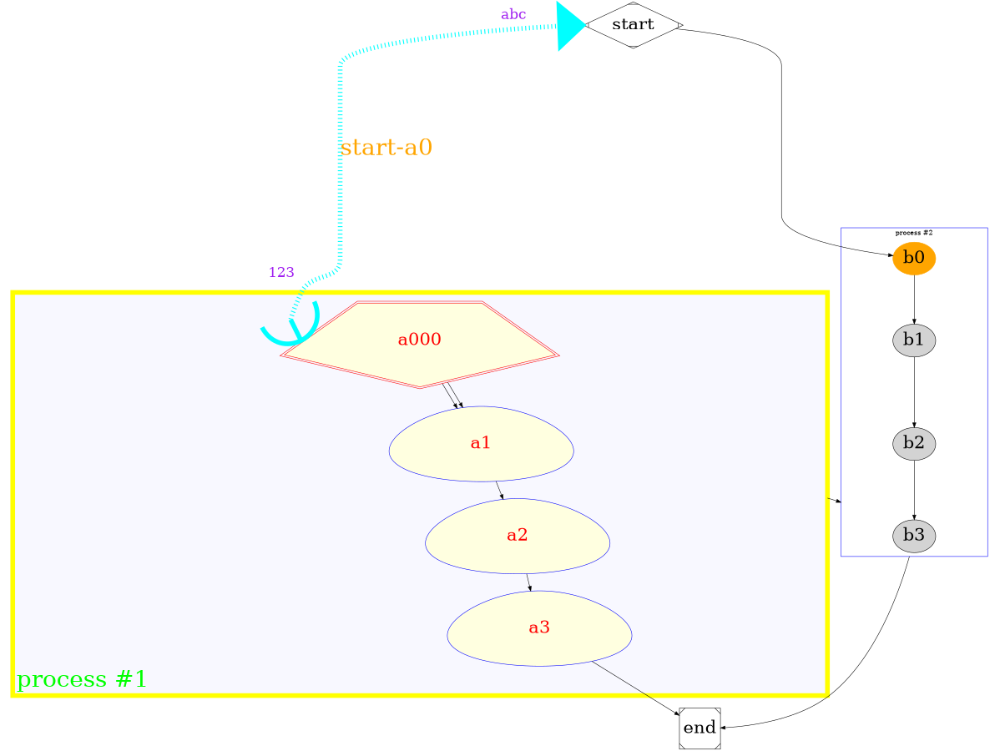
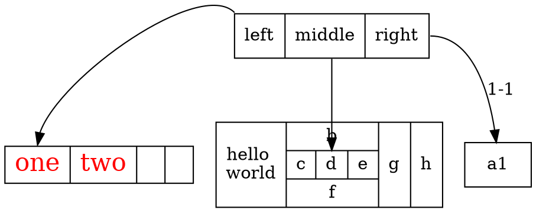

<!-- dot 思维导图 -->
<!-- dot  组件-->
<!-- dot 完整例子 -->
- dot
  - 思维导图
  - 组件
  - 完整例子
```plantuml

@startmindmap #orgmode语法
scale 1.5
caption Caption:Dot
title Title:Dot mindmap
* <&flag>Graphvizdot\n<s>graphviz is a tool, and dot is a language.</s>
left
** <&graph>graph-subgraph
** digraph
right
' kexuan
** Graph/Digraph声明图，名字可选
** Node修饰节点
** Edge修饰连线

header
Header: Dot mindmap
endheader

center footer Footer: Dot mindmap

legend right
    Legend:
    Dot
endlegend

@endmindmap
```







