/**
* @module hive
* @Version :  
* @Author: Dillon
* @Contact: aa269440877@outlook.com
* @WebSite    :   https://github.com/ld269440877/
* @description: 
* @since: 2019-10-27 20:08:23
**/


hive元数据在derby中，只能在hive的安装目录下启动hive
hive的元数据在mysql中，可以在任意位置启动hive

mysql和hive都实现了SQL标准

hive处理一条sql语句：sql   解析和转换 任务

[idea DataGrip 使用图解教程 - Bingo - CSDN博客](https://blog.csdn.net/kl28978113/article/details/80136981)

[数据库管理工具DataGrip使用总结(一) - 掘金](https://juejin.im/post/5c9643faf265da611c5574f5)

伪分布式和完全分布式的区别？
伪分布式：用一个虚拟机，安装并启动hadoop集群。所有的服务都在这一个虚拟机上运行。
完全分布式通常是3个节点以上。hadoop除了运行hive，zookeeper（通常要求节点数为奇数），hbase，spark，kylin

hive的文件存储在hadoop file system上
load把已有数据加载非分区表中
向表中插入数据insert into
分区表：每一分区就对应一个文件夹 将本地文件使用hadoop命令-put传到hive的分区表，手动修复分区表，才可以识别出来


内部表通常都是一些中间表，有中间文件才有中间表。不能直接产生结果就需要中间表过度，我们需要最终的结果
删除中间表，就会删除源数据

hive可以切换计算引擎 mr tez spark、、、计算方式不同单计算结果不会变

# 第3节
```bash{class="line-numbers"}
# 在hadoop的家目录下新建一个目录datas：
mkdir datas
# 通过xftp将数据源文件传到datas中
hadoop fs -mkdir /datas
hadoop fs -chmod g+w /datas
```

- hadoop命令将本地data下的文件上传到hadoop文件系统
`hadoop fs -put /home/hadoop/datas/* /datas`

```mysql { class= ' line-numbers'}
# 创建kaikeba库
create database if not exists kaikeba;

# 使用kaikeba库
use kaikeba;

# 创建user_info表
create table if not exists user_info (
user_id  string,
user_name  string,
sex  string,
age  int,
city  string,
firstactivetime  string,
level  int,
extra1  string,
extra2  map<string,string>)
row format delimited fields terminated by '\t'
collection items terminated by ','
map keys terminated by ':'
lines terminated by '\n'
stored as textfile;

# 加载本地数据源到hive的user_info表
load data inpath '/datas/user_info/user_info.txt' overwrite into table user_info;

# 创建user_trade表
create table if not exists user_trade (
user_name  string,
piece  int,
price  double,
pay_amount  double,
goods_category  string,
pay_time  bigint)  
partitioned by (dt string)
row format delimited fields terminated by '\t';

# 执行如下命令以设置动态分区：
set hive.exec.dynamic.partition=true;
set hive.exec.dynamic.partition.mode=nonstrict;
set hive.exec.max.dynamic.partitions=10000;
set hive.exec.max.dynamic.partitions.pernode=10000;

# 将数据源文件上传到HDFS上 hadoop命令
"hdfs dfs -put /home/hadoop/datas/user_trade/* /user/hive/warehouse/kaikeba.db/user_trade"

# 修复分区表 user_trade：
msck repair table user_trade;

# 查询：
select * from user_trade limit 6;

# 设置严格模式：
set hive.mapred.mode=strict;
select * from user_trade limit 6;  # 没有根据字段筛选，会报错
select * from user_trade where dt='2017-01-12';
# 取消严格模式：
set hive.mapred.mode=nonstrict;

# 创建trade_2017表
create table if not exists trade_2017 (
user_name string, 
amount double, 
trade_time string)
row format delimited fields terminated by '\t';

load data inpath '/datas/trade_2017/000000_0' overwrite into table trade_2017;

# 创建trade_2018表
create table if not exists trade_2018 (
user_name string, 
amount double, 
trade_time string)
row format delimited fields terminated by '\t';

load data inpath '/datas/trade_2018/000000_0' overwrite into table trade_2018;

# 创建trade_2019表
create table if not exists trade_2019 (
user_name string, 
amount double, 
trade_time string)
row format delimited fields terminated by '\t';

load data inpath '/datas/trade_2019/000000_0' overwrite into table trade_2019;


# 创建user_list_1表
create table if not exists user_list_1(
user_id string, 
user_name string)
row format delimited fields terminated by '\t'
collection items terminated by ','
map keys terminated by ':';

load data inpath '/datas/user_list_1/list1' overwrite into table user_list_1;

# 创建user_list_2表
create table if not exists user_list_2(
user_id string, 
user_name string)
row format delimited fields terminated by '\t'
collection items terminated by ','
map keys terminated by ':';

load data inpath '/datas/user_list_2/list2' overwrite into table user_list_2;

# 创建user_list_3表
create table if not exists user_list_3(
user_id string, 
user_name string)
row format delimited fields terminated by '\t'
collection items terminated by ','
map keys terminated by ':';

load data inpath '/datas/user_list_3/list3' overwrite into table user_list_3;

# 创建user_fefund表
create table if not exists user_refund(
user_name string, 
refund_piece int, 
refund_amount double, 
refund_time string)
partitioned by ( 
dt string)
row format delimited fields terminated by '\t';

# 执行如下命令以设置动态分区：
set hive.exec.dynamic.partition=true;
set hive.exec.dynamic.partition.mode=nonstrict;    
set hive.exec.max.dynamic.partitions=10000;
set hive.exec.max.dynamic.partitions.pernode=10000;

#将数据源文件上传到HDFS上
"hdfs dfs -put /home/hadoop/datas/user_refund/* /user/hive/warehouse/kaikeba.db/user_refund"

#修复分区表user_refund：
msck repair table user_refund;

#创建user_trade_bak表
create table user_trade_bak(
user_name string, 
piece int, 
price double, 
pay_amount double, 
goods_category string, 
pay_time timestamp)
partitioned by( 
dt string)
row format delimited fields terminated by '\t';

#执行如下命令以设置动态分区：
set hive.exec.dynamic.partition=true;
set hive.exec.dynamic.partition.mode=nonstrict;    
set hive.exec.max.dynamic.partitions=10000;
set hive.exec.max.dynamic.partitions.pernode=10000;

#将数据源文件上传到HDFS上
"hdfs dfs -put /home/hadoop/datas/user_trade_bak/* /user/hive/warehouse/kaikeba.db/user_trade_bak"

# 修复分区表：
msck repair table user_trade_bak;

# 创建user_goods_category表
create table user_goods_category(
user_name string, 
category_detail string)
row format delimited fields terminated by '\t';

load data inpath '/datas/user_goods_category/000000_0' overwrite into table user_goods_category;

'''
id  name
1	zhangsan
2	lisi
3   wangwu
4   zhaoliu
'''
```
```bash {class= ' line-numbers'}
- .hiverc文件  /opt/module/apache-hive-3.1.1-bin
#在命令行中显示当前数据库名
set hive.cli.print.current.db=true; 
#查询出来的结果显示列的名称
set hive.cli.print.header=true;
#设置hive执行的严格模式
set hive.mapred.mode=strict;
```
- 我和李老师的hive可以在任何目录下启动，但是大家的只能在hive的安装目录下启动。
原因就是：你们的hive元数据是存在derby中，我和李老师的hive元数据是存在mysql中。

mysql和hive都是实现了sql标准

- hive处理一条sql语句
sql->解析和转换->任务

- 执行引擎：
hive可以是mapreduce，tez，spark

- 分区表：分成了不同的文件夹  日志文件 rizhi
2019.10.27
2019.10.28

- 严格模式：(限制3种查询)
1. 分区表在查询时必须写分区条件
2. 笛卡尔积不能查询 （进行表关联的时候不写关联条件）
3. 使用order by进行排序的时候，必须加limit语句。

- hadoop和hive
hadoop的存储系统hdfs有100g，hive20g
HDFS的/目录和本地文件系统的/是不一样。

user文件 分析部门（user_fenxi），测试部门(user_ceshi)，用户画像部门(user_huaxiang)
元数据信息是存在derby或mysql中的

```mysql { class= ' line-numbers'}
第4节 test
# 动态分区功能示例：
create table pz_business_search (
interface_name     string comment'接口名称',
interface_param_in string comment'接口入参',
interface_type string comment'接口类型',
invoke_time        string comment'调用时间'
)
ROW FORMAT DELIMITED 
 FIELDS TERMINATED BY ','---数据列分隔符 
STORED AS TEXTFILE;

# 其基本数据如下：
interface1  param1  1 2018-12-19
interface2  param2  1 2018-12-19
interface3  param3  1 2018-12-19
interface4  param4  1 2018-12-19
interface1  param1  1 2018-12-20
interface2  param2  1 2018-12-20
interface3  param3  1 2018-12-20
interface4  param4  1 2018-12-20

create table pz_business_search_partition (
interface_name     string comment'接口名称',
interface_param_in string comment'接口入参'
)
partitioned by (interface_type string, invoke_time string)
ROW FORMAT DELIMITED 
 FIELDS TERMINATED BY ','---数据列分隔符 
STORED AS TEXTFILE;

# 实现动态分区：
insert overwrite table pz_business_search_partition partition (interface_type='1',invoke_time)
select interface_name,interface_param_in,invoke_time from pz_business_search;
```

# HiveSQL基础
第5节

## HiveSQL基础技能1

### HIVE简介

- HIVE是基于hadoop的数据仓库
HiveSQL与传统SQL的对⽐：

查询语⾔|HQL| SQL
|:-:|:-:|:-|
数据存储位置|HDFS| 块设备或者本地⽂件
数据格式|⽤户定义|系统决定(不同的数据库有不同的存储引擎)
数据更新|不⽀持|⽀持
索引|⽆|有
执⾏|MapReduce| Executor
执⾏|延迟|⾼低
可扩展性|⾼|低
数据规模|⼤|⼩
PS：块设备是i/o设备中的⼀类，是将信息存储在固定⼤⼩的块中，每个块都有⾃⼰的地址，还可以在设备的任意位置读取⼀定⻓度的数据，例如硬盘,U盘，SD卡等。

- MapReduce简介

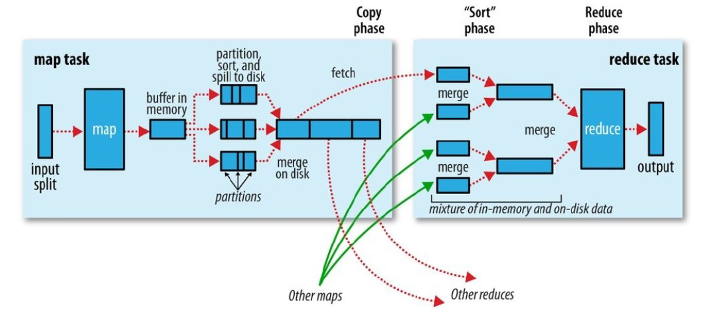

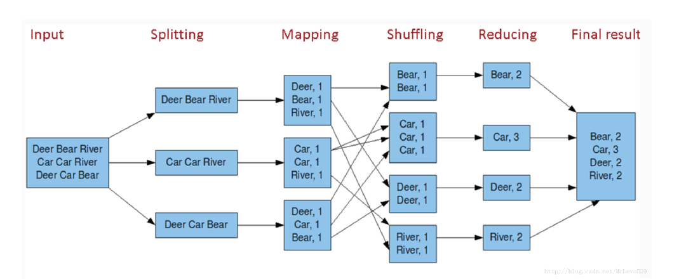

### 基础语法
#### SELECT …A… FROM …B… WHERE …C…
```mysql { class= ' line-numbers'}
SELECT …A… FROM …B… WHERE …C…
A：列名
B：表名
C：筛选条件
```

user_info| 列名举例
|:-:|:-|
user_id |10001,10002(唯⼀的)
user_name |Amy, Dennis(唯⼀的)
sex| [male, female]
age| [13,70]
city| beijing, shanghai
firstactivetime |2019-04-19 15:40:00
level| [1,10]
extra1 |string类型：{"systemtype":"ios","education":"master","marriage_status":"1","phonebrand":"iphone X"}
extra2 |map<string,string>类型：{"systemtype":"ios","education":"master","marriage_status":"1","phonebrand":"iphone X"}

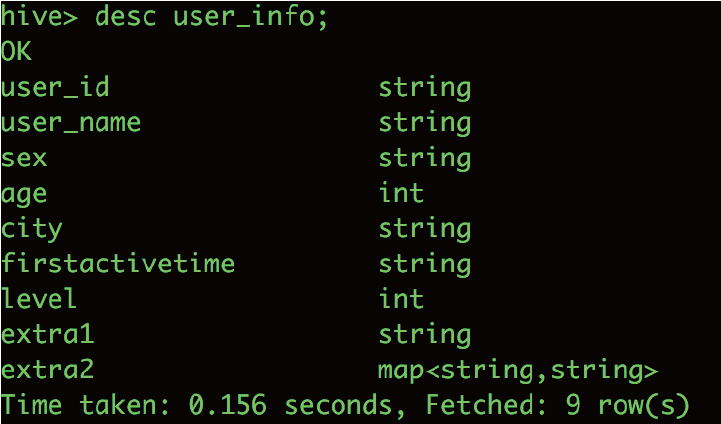

```mysql { class= ' line-numbers'}
--选出城市在北京，性别为⼥的10个⽤户名--
SELECT user_name
FROM user_info
WHERE city='beijing' and sex='female'
limit 10;
```
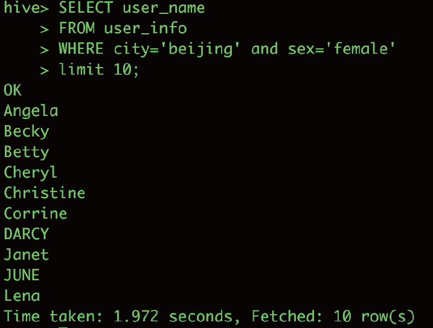

user_trade列名|举例
|:-:|:-|
user_name |Amy, Dennis
piece| 购买数量
price |价格
pay_amount |⽀付⾦额
goods_category| food, clothes, book, computer, electronics, shoes
pay_time| 1323308943，时间戳
dt |partition，‘yyyy-mm-dd’
注意：如果该表是⼀个分区表，则WHERE条件中必须对分区字段进⾏限制。
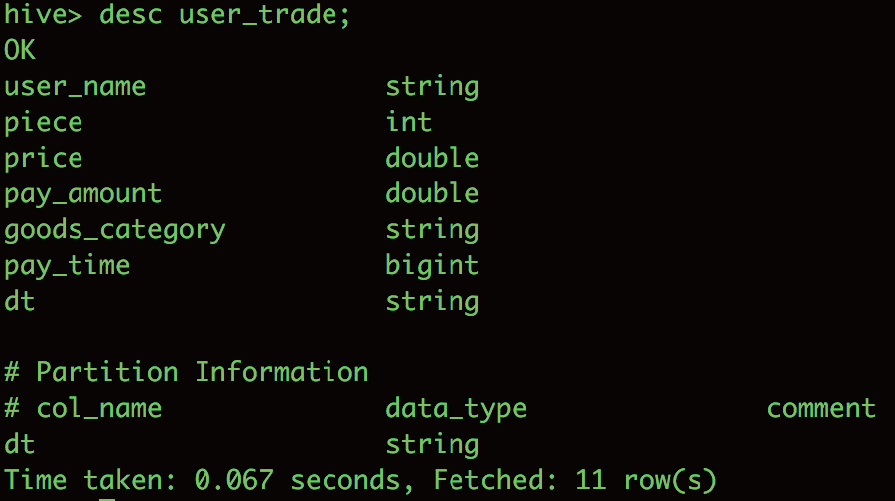
```mysql { class= ' line-numbers'}
--选出在2019年4⽉9⽇，购买的商品品类是food的⽤户名、购买数量、⽀付⾦额--
SELECT user_name,
piece,
pay_amount
FROM user_trade
WHERE dt='2019-04-09' and goods_category='food' ;
```
<font color="red">未对分区进⾏限制的报错：</font>
```mysql { class= ' line-numbers'}
SELECT user_name,
piece,
pay_amount
FROM user_trade
WHERE goods_category='food' ;
# No partition predicate for Alias "user_trade" Table "user_trade"
# 注意！分区表必须限制分区字段！
```
#### GROUP BY

```mysql { class= ' line-numbers'}
--2019年⼀⽉到四⽉，每个品类有多少⼈购买，累计⾦额是多少--
SELECT goods_category,
count(distinct user_name) as user_num,
sum(pay_amount) as total_amount
FROM user_trade
WHERE dt between '2019-01-01' and '2019-04-30'
GROUP BY goods_category;
```
GROUP BY 的作⽤：分类汇总
常⽤聚合函数：
1. count()：计数 count(distinct ……) 去重计数
2. sum()：求和
3. avg()：平均值
4. max()：最⼤值
5. min()：最⼩值

#### GROUP BY …… HAVING
```mysql { class= ' line-numbers'}
--2019年4⽉，⽀付⾦额超过5万元的⽤户--
SELECT user_name,
sum(pay_amount) as total_amount
FROM user_trade
WHERE dt between '2019-04-01' and '2019-04-30'
GROUP BY user_name
HAVING sum(pay_amount)>50000;
```
HAVING：对GROUP BY的对象进⾏筛选,仅返回符合HAVING条件的结果

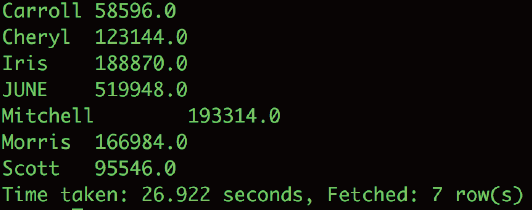

#### ORDER BY
```mysql { class= ' line-numbers'}
--2019年4⽉，⽀付⾦额最多的TOP5⽤户--
SELECT user_name,
sum(pay_amount) as total_amount
FROM user_trade
WHERE dt between '2019-04-01' and '2019-04-30'
GROUP BY user_name
ORDER BY total_amount DESC limit 5;
```
ASC：升序(默认)
DESC：降序
对多个字段进⾏排序：ORDER BY A ASC , B DESC
ORDER BY A DESC , B DESC
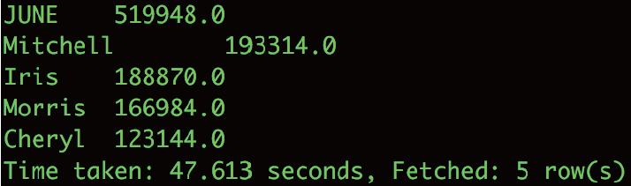
为什么ORDER BY 后⾯不直接写sum(pay_amount)⽽是⽤total_amount？
```mysql { class= ' line-numbers'}
SELECT user_name,
sum(pay_amount) as total_amount
FROM user_trade
WHERE dt between '2019-04-01' and '2019-04-30'
GROUP BY user_name
ORDER BY sum(pay_amount) DESC limit 5; ##错误写法##
```
不可以写：ORDER BY sum(pay_amount) DESC
——原因：执⾏顺序！！！ORDER BY的执⾏顺序在SELECT之后，所以需使⽤重新定义的列名进⾏排
序。

#### 执⾏顺序 

FROM → WHERE → GROUP BY → HAVING → SELECT → ORDER BY
 
### 常⽤函数
#### 时间戳转化为⽇期
```mysql { class= ' line-numbers'}
SELECT pay_time,
from_unixtime(pay_time,'yyyy-MM-dd hh:mm:ss')
FROM user_trade
WHERE dt='2019-04-09';
```

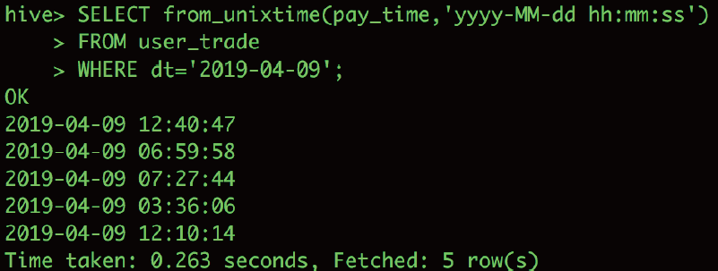

from_unixtime(bigint unixtime, string format)
format：
1. yyyy-MM-dd hh:mm:ss
2. yyyy-MM-dd hh
3. yyyy-MM-dd hh:mm
4. yyyyMMdd

拓展：把⽇期转化为时间戳——unix_timestamp
课后练习：unix_timestamp(string date)
#### 计算⽇期间隔
```mysql { class= ' line-numbers'}
--⽤户的⾸次激活时间，与2019年5⽉1⽇的⽇期间隔--
SELECT user_name,
datediff('2019-05-01',to_date(firstactivetime))
FROM user_info
limit 10;
```

datediff(string enddate, string startdate)：结束⽇期减去开始⽇期的天数

拓展：⽇期增加函数、减少函数——date_add、date_sub
date_add(string startdate, int days)
date_sub (string startdate, int days)
#### 条件函数
- case when
统计以下四个年龄段20岁以下、20-30岁、30-40岁、40岁以上的⽤户数：
```mysql { class= ' line-numbers'}
--统计以下四个年龄段20岁以下、20-30岁、30-40岁、40岁以上的⽤户数--
SELECT case when age<20 then '20岁以下'
when age>=20 and age<30 then '20-30岁'
when age>=30 and age<40 then '30-40岁'
else '40岁以上' end as age_type,
count(distinct user_id) user_num
FROM user_info
GROUP BY case when age<20 then '20岁以下'
when age>=20 and age<30 then '20-30岁'
when age>=30 and age<40 then '30-40岁'
else '40岁以上' end;
```
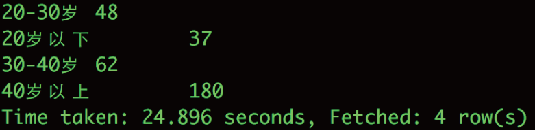
- if
统计每个性别⽤户等级⾼低的分布情况：
```mysql { class= ' line-numbers'}
--统计每个性别⽤户等级⾼低的分布情况(level⼤于5为⾼级)--
SELECT sex,
if(level>5,'⾼','低') as level_type,
count(distinct user_id) user_num
FROM user_info
GROUP BY sex,
if(level>5,'⾼','低');
```
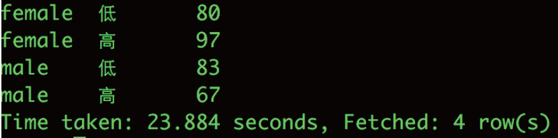
#### 字符串函数
每个⽉新激活的⽤户数：
```mysql { class= ' line-numbers'}
--每个⽉新激活的⽤户数--
SELECT substr(firstactivetime,1,7) as month,
count(distinct user_id) user_num
FROM user_info
GROUP BY substr(firstactivetime,1,7);
```
substr(string A, int start, int len)
备注：如果不指定截取⻓度，则从起始位⼀直截取到最后。
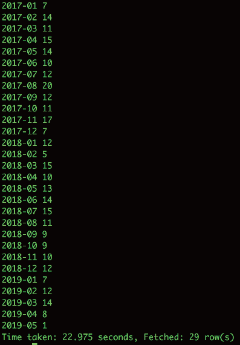

不同⼿机品牌的⽤户数：
extra1(string)：
{"systemtype":"ios","education":"master","marriage_status":"1","phonebrand":"iphone X"}
extra2(map<string,string>)：
{"systemtype":"ios","education":"master","marriage_status":"1","phonebrand":"iphone X"}
```mysql { class= ' line-numbers'}
--不同⼿机品牌的⽤户数--
##第⼀种情况
SELECT get_json_object(extra1, '$.phonebrand') as phone_brand,
count(distinct user_id) user_num
FROM user_info
GROUP BY get_json_object(extra1, '$.phonebrand');
##第⼆种情况
SELECT extra2['phonebrand'] as phone_brand,
count(distinct user_id) user_num
FROM user_info
GROUP BY extra2['phonebrand'];
```
get_json_object(string json_string, string path)
param1：需要解析的json字段
param2：⽤.key取出想要获取的value
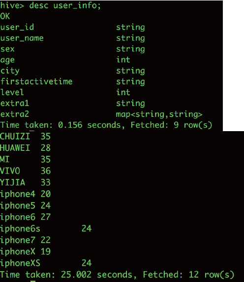
#### 聚合统计函数
ELLA⽤户的2018年的平均⽀付⾦额，以及2018年最⼤的⽀付⽇期与最⼩的⽀付⽇期的间隔：

```mysql{ class= ' line-numbers'}
--ELLA⽤户的2018年的平均⽀付⾦额，以及2018年最⼤的⽀付⽇期与最⼩的⽀付⽇期的间隔--
SELECT avg(pay_amount) as avg_amount,
datediff(max(from_unixtime(pay_time,'yyyy-MMdd')),
min(from_unixtime(pay_time,'yyyy-MM-dd')))
FROM user_trade
WHERE year(dt)='2018'
and user_name='ELLA';
```
max(from_unixtime(pay_time,'yyyy-MM-dd'))= from_unixtime(max(pay_time),'yyyy-MM-dd'))
datediff(max(pay_time),min(pay_time))
<font color="red">注意：不许嵌套组合avg(count(*))</font>
### 重点练习
- 2018年购买的商品品类在两个以上的⽤户数
```mysql { class= ' line-numbers'}
--2018年购买的商品品类在两个以上的⽤户数--
SELECT count(a.user_name)
FROM
(SELECT user_name,
count(distinct goods_category) as category_num
FROM user_trade
WHERE year(dt)='2018'
GROUP BY user_name HAVING count(distinct goods_category)>2)a;
```
三步⾛：
第⼀步：先求出每个⼈购买的商品品类数
第⼆步：筛选出购买商品品类数⼤于2的⽤户
第三步：统计符合条件的⽤户有多少个
- ⽤户激活时间在2018年，年龄段在20-30岁和30-40岁的婚姻状况分布
审题——拆解
第⼀步：先选出激活时间在2018年的⽤户，并把他们所在的年龄段计算好，并提取出婚姻状况
第⼆步：取出年龄段在20-30岁和30-40岁的⽤户，把他们的婚姻状况转义成可理解的说明
第三步：聚合计算，针对年龄段、婚姻状况的聚合
```mysql { class= ' line-numbers'}
--⽤户激活时间在2018年，年龄段在20-30岁和30-40岁的婚姻状况分布--
SELECT a.age_type,
if(a.marriage_status=1,'已婚','未婚'),
count(distinct a.user_id)
FROM
(SELECT case when age<20 then '20岁以下'
when age>=20 and age<30 then '20-30岁'
when age>=30 and age<40 then '30-40岁'
else '40岁以上' end as age_type,
get_json_object(extra1, '$.marriage_status') as marriage_status,
user_id
FROM user_info
WHERE to_date(firstactivetime) between '2018-01-01' and '2018-12-31')a
WHERE a.age_type in ('20-30岁','30-40岁')
GROUP BY a.age_type,
if(a.marriage_status=1,'已婚','未婚');
```

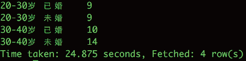

### 常⻅错误及处理办法
#### 标点符号错误
使⽤全⻆符号：
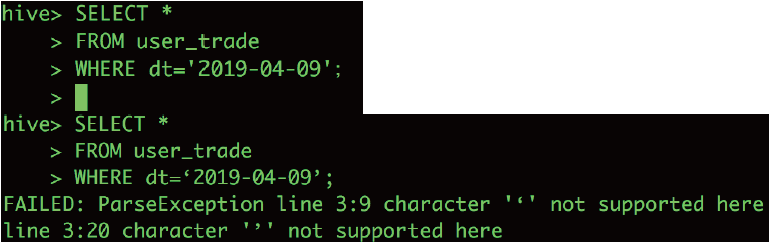
#### 没有对⼦查询的表进⾏重命名
错误实例：
```mysql { class= ' line-numbers'}
SELECT count(user_name)
FROM
(SELECT user_name,
count(distinct goods_category) as category_num
FROM user_trade
WHERE year(date)='2019'
GROUP BY user_name HAVING count(distinct goods_category)>2);
```
#### 使⽤错误的字段名
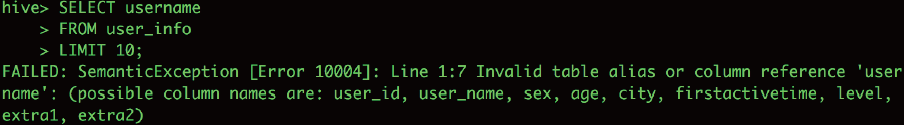
#### 丢了逗号分隔符
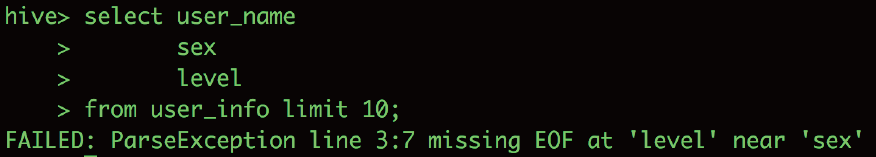
### 总结
1. 利⽤GROUP BY做聚合计算
2. 利⽤ORDER BY做排序
3. 牢记SQL执⾏顺序
4. 常⽤函数组合使⽤
5. 避免常⻅错误
### 作业
作业1：激活天数距今超过300天的男⼥分布情况(使⽤user_info)
作业2：不同性别、教育程度的分布情况(使⽤user_info)
作业3：2019年1⽉1⽇到2019年4⽉30⽇，每个时段的不同品类购买⾦额分布(使⽤user_trade)