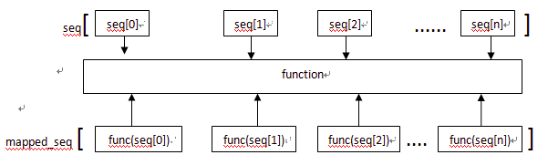

<!--
Created: Wed Sep 18 2019 18:50:22 GMT+0800 (中国标准时间)
Modified: Wed Sep 18 2019 18:55:31 GMT+0800 (中国标准时间)
-->

/**
* @module python3_notebook
* @Version :

* @Author: Dillon
* @Contact: aa269440877@outlook.com
* @WebSite    :   https://github.com/ld269440877/
* @description: [new_global_snippets.code-snippets---VS Code 配置与插件推荐 2019 年版 - 掘金](https://juejin.im/post/5c73dcd05188256fd62d4d27)

[Code Chunk](https://www.bookstack.cn/read/mpe/zh-cn-code-chunk.md)
[code-snippets](https://raw.githubusercontent.com/ld269440877/images/master/Py3Notebook/File-Preferences-User Snippets-markdown_global_snappets.code-snippets)

* @since: 2019-09-18 10:57:05

**/

# Basics of python

<font size="8" color="orange">文档规则：1. 描述 2. 参数 3. 返回值 4. 实例 5. 参考链接</font>
==Content [^1]==

[^1]: [Code Chunk](https://www.bookstack.cn/read/mpe/zh-cn-code-chunk.md)


## 查看帮助文档:

- help(abs)
    - abs.\_\_text_signature\_\_
    - abs.\_\_doc\_\_
    - type(abs)

## 查看属性

- dir(abs)
    - abs.\_\_dict\_\_


# 面向过程编程

[Python3教程 - 廖雪峰的官方网站](https://www.liaoxuefeng.com/wiki/1016959663602400)
[《Python进阶》](https://docs.pythontab.com/interpy/)

[超实用的 30 段 Python 案例](https://mp.weixin.qq.com/s/b4N8rf4qXLhhSp2ij8n-cQ)


面向过程编程OPP：Procedure Oriented Programming，是一种以事物为中心的编程思想。主要关注“怎么做”，即完成任务的具体细节。用函数把这些步骤实现，在一步一步的具体步骤中再按顺序调用函数。


面向对象编程OOP：Object Oriented Programming，是一种以对象为基础的编程思想。主要关注“谁来做”，即完成任务的对象。把要解决的问题分解成各个对象，建立对象的目的不是为了完成一个步骤，而是为了描叙某个对象在整个解决问题的步骤中的属性和行为。


面向切面编程AOP：Aspect Oriented Programming，基于OOP延伸出来的编程思想。主要实现的目的是针对业务处理过程中的切面进行提取，它所面对的是处理过程中的某个步骤或阶段，以获得逻辑过程中各部分之间低耦合性的隔离效果。

> 每种编程思想都有各自的优点，它们适用在不同的情况下：面向过程性能很高，面向对象比较易于管理和维护，面向切面使软件变得更灵活。
>
> 新的编程范式，并不一定完全各方面都优于旧的编程范式，它们只是在某一特定领域或特殊场景下有着独到的优势。
>
> 编程范式只有适合不适合项目特性，没有绝对的好坏。

## 优缺点比较

### 面向过程

优点：

流程化使得编程任务明确，在开发之前基本考虑了实现方式和最终结果，具体步骤清楚，便于节点分析。

效率高，面向过程强调代码的短小精悍，善于结合数据结构来开发高效率的程序。

缺点：

需要深入的思考，耗费精力，代码重用性低，扩展能力差，后期维护难度比较大。

### 面向对象

优点:

结构清晰，程序是模块化和结构化，更加符合人类的思维方式；

易扩展，代码重用率高，可继承，可覆盖，可以设计出低耦合的系统；

易维护，系统低耦合的特点有利于减少程序的后期维护工作量。

缺点：

开销大，当要修改对象内部时，对象的属性不允许外部直接存取，所以要增加许多没有其他意义、只负责读或写的行为。这会为编程工作增加负担，增加运行开销，并且使程序显得臃肿。

性能低，由于面向更高的逻辑抽象层，使得面向对象在实现的时候，不得不做出性能上面的牺牲，计算时间和空间存储大小都开销很大。


```python {cmd = true matplotlib=true code_block=true class= 'line-numbers'  id='utf-8' continue:true output='markdown' } #hide  代码隐藏
import io
import sys
#改变标准输出的默认编码
sys.stdout=io. TextIOWrapper(sys.stdout.buffer, encoding='utf8')
```

## 注释

单⾏注释
:   以 # 开始

```python
# 定义字符串变量name
name = "李四"
```

多⾏注释
:   可以使⽤三个双引号或者三个单引号

``` python
'''
我是多⾏注释 Multi-line comment
我是多⾏注释
我是多⾏注释
'''
```

## 变量的定义

> There are only two hard things in Computer Science: cache invalidation and naming things.
-- Phil Karlton [ColorLf](https://unbug.github.io/codelf/)

变量
:   通俗理解就是存储程序数据的容器。

变量定义的格式
:   变量名 = 数据 (变量名尽量有含义，⽅便理解 )

1. 案例 & 注释

```python {cmd = true matplotlib=true code_block=true class= ' line-numbers'  continue='utf-8' output='markdown'} ##hide  代码隐藏
# 定义了⼀个变量名字叫做score，存储的数据是100
score = 100
print(score)

# 提示： 在python⾥面不需要指定数据的类型，会根据数据⾃动推导出数据类型
# 通过type查看变量的类型
score_type = type(score)
print(score_type)-->int

```

总结： 常⽤的数据类型 int, str, float, bool, list, tuple, dict, set

出于性能的考虑，Python 内部会将==- 5 到 256 的整型数据在一开始就缓存到内存中==😳，这样当我们要使用 - 5 到 256 之间的数值时，Python 不会创建一个内存地址来存放这些数，而是直接从缓存中获取，从而导致 a 变量与 b 变量为 1 时，其内存地址是相同的，而当我们赋值一个大于 256 或小于 - 5 的数时，Python 才会为这个新数创建一个新的内存🤔，上面的代码中使用了 2 次 257，则会创建 2 个用于存放 257 的内存地址😮

- 在 Python 中，方法名称前后有双下滑线的都可以称为==魔术方法==

```python
a = 1
b = 1
# 判断变量的值是否相同,'==' 其实调用了变量的 __eq__()方法
a == b -->True
# 比较对象的内存地址,如果两个对象完全相同，它们就会具有同一个内存地址🤥
id(a)==id(b) -->True
a is b -->True

a = 257
b = 257
# 判断变量的值是否相同,'==' 其实调用了变量的 __eq__()方法
a == b -->True
# 比较对象的内存地址,如果两个对象完全相同，它们就会具有同一个内存地址🤥
id(a)==id(b) -->False
a is b -->False
```

在实际项目中，我们通常不关心变量的内存地址，所以` '=='` 更常被使用，但值得一提的是，'is' 操作符会比` '==' `的速度要更快👹，这是因为使用 ` '=='`时，Python 还需要查找当前程序中有没有对 `__eq__`进行重写的逻辑。

## <font color='lightgreen' >浅拷贝与深拷贝</font>

- 对象(容器变量)存储地址
    - 元素(数据)存储地址

    | 操作   | 对象   | 对象中的元素 | 备注                                                         |
    | ------ | ------ | ------------ | ------------------------------------------------------------ |
    | 源对象 | id = 0 | id = 0a,0b   | 0是对象id<br>a,b是对象中的元素的id                           |
    | 赋值   | id = 0 | id = 0a,0b   | 对象id不变<br>数据id不变(==每一个数据==)                     |
    | 浅拷贝 | id = 1 | id = 1a,1b   | 对象id改变<br>数据id不变                                     |
    | 深拷贝 | id = 1 | id = 1D,1,B  | 对象id改变<br>数据id改变(==指向不可变元素除外,元组,字符串等==) |

    <font color='green' size=5 >如果原对象中的元素本身是不可变的，那么使用深\浅拷贝都无所谓</font>

🤖浅拷贝：Python 会分配一块<font color='orange'>新的内存用于创建新的拷贝对象</font>，但拷贝对象中的元素依旧是原对象 (被拷贝对象) 中元素，即<font color='red'>拷贝对象与原对象的内存地址不同</font>，但<font color='orange'>两者中的元素具有相同的内存地址</font>

- 浅拷贝,对象的内存地址不同,两对象中的元素对应的地址相同		

🤖深拷贝：Python 会分配一块<font color='red'>新的内存用于创建新的拷贝对象</font>，拷贝对象中的元素是通过递归的方式将原对象中的元素一一复制过来的 (不可变元素除外)，即<font color='red'>对象与对象中的元素都是不同的内存地址，两者完全独立分离</font>

- 深拷贝,对象的内存地址不同,两对象中的对应元素的地址也不同

### 浅拷贝

```python
import copy
lst1 = [1,2]
 # 赋值运算符'='创建lst2, lst2 与 lst1 是完全相同的，即两个变量和都指向了相同的内存地址,并且变量中的每个元素也都指向了相同的内存地址😮
lst2 = lst1 
#  lst3 是 lst1 通过 list () 方法创建的，其实 lst3 就是 lst1 的浅拷贝😵
lst3 = list(lst1) # 
id(lst1)==id(lst2),id(lst1)==id(lst3)-->(True, False)

# 操作对象,浅拷贝,两个对象指向不同的存储地址
lst1 += (5,6)
print(lst1,lst2,lst3,sep='\n')
'''
[[1, 2, 3], [3, 4], 5, 6]
[[1, 2, 3], [3, 4], 5, 6]
[[1, 2, 3], [3, 4]]
'''
print(id(lst1)==id(lst2),id(lst1)==id(lst3))-->True False

# 操作对象中的元素,浅拷贝,对象中的对元素指向相同的存储地址
lst1[0].append(3)
print(lst1,lst2,lst3,sep='\n')
'''
[[1, 2, 3, 3], [3, 4]]
[[1, 2, 3, 3], [3, 4]]
[[1, 2, 3, 3], [3, 4]]
'''
print(id(lst1)==id(lst2),id(lst1)==id(lst3))
'True False'

```

|            | 对象中的元素  | 对象的id                             | 备注                            |
| ---------- | ------------- | ------------------------------------ | ------------------------------- |
| 对象0–lst0 | [[1,2],[3,4]] | 140317859991056                      | 原始对象                        |
| 对象1–lst1 | lst0          | id(lst0)==0id(lst1)                  | 赋值操作-指向源对象地址         |
| 对象2–lst2 | list(lst0)    | id(lst0) != id(lst1) 140317859929376 | 可变对象的浅拷贝–指向新对象地址 |

|             | 第一个元素的id         | 第二个元素的id         | 备注                            |
| ----------- | ---------------------- | ---------------------- | ------------------------------- |
| 对象0的元素 | [1, 2]–140317860128720 | [3, 4]–140317860356656 | 原始对象中的数据                |
| 对象1的元素 | [1, 2]–140317860128720 | [3, 4]–140317860356656 | 赋值操作-指向源数据地址         |
| 对象2的元素 | [1, 2]–140317860128720 | [3, 4]–140317860356656 | 可变对象的浅拷贝–指向源对象地址 |

- 对于像列表这样的可变序列浅拷贝方法:
    - list () 方法实现浅拷贝
    - 切片操作 ':' 实现浅拷贝
    - copy.copy () 方法实现浅拷贝，copy.copy () 方法可以创建任意数据类型的浅拷贝😧

### 深拷贝


```python
import copy
tpl = 93,4
lst1 = [[1,2],tpl]
 # 深拷贝.(指向不变的对象和元素除外)两个变量都指向了不相同的内存地址,变量中的元素也都指向了不同的地址😮
lst2 = copy.deepcopy(lst1 )
# lst1和lst2内存地址不同
id(lst1)==id(lst2)-->False
# lst1和lst2,第一个元素的内存地址也不同，但第二个元素(元组,地址指向不变)内存地址相同
print(lst1[0],lst1[1])
>>> [1, 2] (3, 4)
print(id(lst1[0]),id(lst1[1]))
>>>140317860905360 140317887361104

print(lst2[0],lst2[1])
>>>[1, 2] (3, 4)
print(id(lst2[0]),id(lst2[1]))
>>>140317859553360 140317887361104
```


---

This is [an example][id] reference-style link.

Then, anywhere in the document, you define  [an example][id] your link label on a line by itself like this:

[id]: http://example.com/  "Optional Title Here"

---

## 变量的命名规则

变量名
:   是由字⺟、数字、下划线组成,注意是只有这三种，但是不能以数字开头。

驼峰命名法
:   ⼩驼峰和大驼峰
⼩驼峰: 第⼀个单词⾸字⺟要⼩写，其它单词⾸字⺟都大写
大驼峰:每个单词⾸字⺟都大写

下划线命名
:   单词都使⽤⼩写字⺟，单词之间使⽤下划线进⾏分割, ⽐如: my_name

```python {cmd = true matplotlib=true code_block=true class= ' line-numbers'  continue='utf-8' output='markdown'} ##hide  代码隐藏
my_name = '李四' # 下划线命名法 -> 推荐使⽤
myName = '王五' # ⼩驼峰
MyName = '赵六' # 大驼峰
```

## 关键字

关键字
:   在python⾥⾯具有特殊功能的标识符（理解成变量名、函数名）， 关键字不能作为变量名使
用。

```python {cmd = true matplotlib=true code_block=true class= ' line-numbers'  continue='utf-8' output='markdown'} ###hide  代码隐藏
#查看python内置关键字
import keyword
print(keyword.kwlist)
```

## 常⽤的数据类型转换

| 函数                    | 说明                                               |
| ----------------------- | -------------------------------------------------- |
| int(x [, base ])        | 将x转换为⼀个整数                                   |
| float(x )               | 将x转换为⼀个浮点数                                 |
| complex(real [, imag ]) | 创建⼀个复数，real为实部，imag为虚部                |
| str(x)                 | 将对象 x 转换为字符串                              |
| repr(x)                | 将对象 x 转换为表达式字符串                        |
| ==eval(str)==          | ⽤来计算在字符串中的有效Python表达式, 并返回⼀个对象 |
| tuple(s)               | 将序列 s 转换为⼀个元组                             |
| list(s )                | 将序列 s 转换为⼀个列表                             |
| ==chr(x )==             | 将⼀个<font color='orange'>整数</font>转换为⼀个Unicode字符 character |
| ord(x )                 | 将⼀个<font color='red'>字符</font>转换为它的ASCII整数值 |
| hex(x )                 | 将⼀个<font color='orange'>整数</font>转换为⼀个⼗六进制字符串, <br/> Return the integer ordinal of a one-character string. #参数是长度为1的字符，返回它对应的整数 |
| oct(x )                 | 将⼀个<font color='orange'>整数</font>转换为⼀个⼋进制字符串 |
| bin(x )                 | 将⼀个<font color='orange'>整数</font>转换为⼀个⼆进制字符串 |

```python {cmd = true matplotlib=true code_block=true class= ' line-numbers'  continue='utf-8' output='markdown'} ##hide  代码隐藏
# If x is not a number or if base is given, then x must be a string, bytes, or bytearray instance representing an integer literal(一个整数) in the given base.
print(int('0b100', base=0))-->4
print(int('2',base=10))-->2
print('”1+2“=',eval('1+2'))-->3
```

## 输⼊和输出

[(To print)](###print)

```python {cmd = true matplotlib=true code_block=true class= ' line-numbers'  continue='utf-8' output='markdown'} ##hide  代码隐藏
name =  input("提示符")
print("输出")
```

## 格式化输出

####  \%

```python {cmd = true matplotlib=true code_block=true class= ' line-numbers'  continue='utf-8' output='markdown'} ##hide  代码隐藏
score = 100
print("python考试分数:%d" % score)
```

## format详解1

[Python3 format() 函数详解 将字符串按照规则格式化 - 张恺阳博客](https://www.zky.name/article/35.html)

```python
Docstring:
S.format(*args, **kwargs) -> str
#使用args和kwargs的替换值返回S的格式化版本。
Return a formatted version of S, using substitutions(替换) from args and kwargs.
#用大括号标识替换
The substitutions are identified by braces ('{' and '}').
Type:      method_descriptor
#描述
format()函数的主要作用是按照指定的规则对字符串进行格式化，可以替换固定位置的内容，也可以对字符串填充对齐、数字的格式处理等等。虽然看上去它只是一个简单的数据替换以及数据格式化，但是它真的不简单，它拥有非常多的功能，有负责的内容替换的，有负责数据转换的，还有负责数据格式化的，每个功能都有很多选项，接下来逐一讲解。
它是Python的内置函数，在python文件中直接可以使用。
# 语法
str.format(**args)
# 替换规则
字符串中包含由大括号{}包围的"替换字段"，其中大括号中填写文本替换以及格式化规则，如果不填写规则（使用{}），则视为文本格式并且不对文本进行任何格式化，直接替换。文本也是比较常用的一种形式。
完整的格式如下：
{[field_name][!conversion][:format_spec]}
# 实例
'.format(视为元组)'
{[空大括号/位置,数字,字符串索引/变量名/字典的键/对象.对象属性][!r/!s/!a][:]}
#字典键名
date = {
    'day': 'Monday',
    'month': 'February'
}
"{date[day]!r:#^12}, {date[month]}".format(date = date)
>>> "##'Monday'##, February"
```


### field_name - 替换命名方式

>  可以使用默认值、对象名称、对象属性名称、对象索引等的方式来指定需要替换内容。它是可选的，不填写按顺序替换内容。

| 命名方式                | 含义                                                         | 示例:{}.format(<font color='orange'>‘元组’</font>)           |
| ----------------------- | ------------------------------------------------------------ | ------------------------------------------------------------ |
| 不填写                  | 不填写的情况下将按照顺序替换内容，在提供替换值时需要注意先后顺序，下面几种方式不受顺序控制。 | {}<br>'{}'.format('first',)                                  |
| arg_name                | 直接使用对象的值                                             | {name}<br>'your name is {name} , age is {age}'.format(name='jack',age=87) |
| arg_name.attribute_name | 获取对象的指定属性的值                                       | {name.first}<br>p = Person('Tom',18)<br/>'name = {p.name} age = {p.age}'.format(p=p) |
| arg_name[element_index] | 获取对象的指定索引，可以是数字索引，也可以是字符串索引       | {name[0]} 或 {name['first']}</br>'{0[1]}  {0[2]} {1[2]} {1[0]}'.format(s1,s2)<br>"{date[day]!r:#^12}, {date[month]}".format(date = date) |

### !conversion - 转换规则

> 替换后可以对替换的值使用转换函数进行直接转换，目前允许使用的转换函数有：str()，repr()，ascii()，在使用时需要书写它们对应的缩写，并以感叹号(!)开始。它是可选的，不填写就不转换。

| 选项 | 含义                          | 示例 |
| ---- | ----------------------------- | ---- |
| 'r'  | 调用`repr()`函数对值进行转换  | {!r} |
| 's'  | 调用`str()`函数对值进行转换   | {!s} |
| 'a'  | 调用`ascii()`函数对值进行转换 | {!a} |

### :format_spec - 格式化规则

> 在值被替换以及转换（如果设置的话）后还可以对值进行格式化，接下来将介绍各种格式化规则的用法。它是可选的，不填写就不格式化值。
> 需要说明一下：在下面的示例中会出现[format_spec]以及[!conversion]，它们分别代表了文中提到的替换命名以及转换规则，由于它们是可选的，所有使用方括号括起来了，写在示例中只是为了体现他们的书写顺序，并不是一定存在。
> 格式化完整的参数如下：
>
> ```python
> [[fill]align][sign][#][0][width][grouping_option][.precision][type]
> 
> ```

- fill - 字符

> 任何字符，只能是一个字符。fill是可选的，但是如果设置了fill，就必须和align搭配使用。

- align - 对齐方式

| 选项 | 含义                                                         | 示例     |
| :--- | :----------------------------------------------------------- | :------- |
| '<'  | 强制字符串在可用空间内左对齐（这是大多数对象的默认值）。     | {:<}     |
| '>'  | 强制字符串在可用空间内右对齐（这是数字的默认值）。           | {:>}     |
| '='  | 强制在符号（如果有）与数字之间填充若干指定字符，被允许的符号只有'+'、'-'、' ' ，此方式只能应用在值为数字的情况时。 | {:[x]=+} |
| '^'  | 强制字符串在可用空间内居中。                                 | {:^}     |

> 需要注意的是，如果没有设置填充宽度（width），宽度始终与填充它的数据大小相同，那么对齐选项就没有意义了。
> 另外，如果宽度设置的过小，比大部分数据的宽度都小。那么对齐的效果可能未必很好。
> 所以宽度最好设置的大于或等于数据的最大宽度，效果最佳。

- sign - 符号

| 选项  | 含义                               |
| :---- | :--------------------------------- |
| '+'   | 用于表示正数和负数                 |
| '-'   | 用于表示仅用于负数（这是默认行为） |
| space | 用于表示正数为空格，负数为减号     |

- \# 数字的格式

> '#'选项仅对integer，float，complex和Decimal类型有效。
> 对于二进制、八进制、十六进制的整数，会在数字的增加前缀"0b"、'0o'、'0x'。
> 对于浮点数、复数和十进制组成的小数（Decimal），转换后的结果始终都包含小数点字符。

- 0  数字的对齐

> 这是一个特殊的对齐方式，当没有明确给出对齐方式时，则在width选项前面加'0'字符可以为**数字类型**是字符0进行填充。这相当于填充字符'0'，对齐类型为'='。

- width 最小填充宽度

> width是定义最小数据宽度的十进制整数。如果未指定，则数据宽度将由内容长度确定。

- grouping_option 千位分隔符

| 选项 | 含义                                                     | 示例 |
| ---- | -------------------------------------------------------- | ---- |
| ','  | 使用逗号(,)对数字进行千位分割，每3位数字使用一次分隔符   | {:,} |
| '_'  | 使用下划线(_)对数字进行千位分割，每3位数字使用一次分隔符 | {:_} |

- .precision 字符精度

> 表示在使用'f'和'F'格式化的浮点数的小数点后应显示多少位数。
> 表示在使用'g'和'G'格式化的浮点数的小数点前后（整数位+小数位）应显示多少位数。
> 对于非数字类型，限制其显示的字符最大长度。

- type 数据类型

> 类型确定了应该如何呈现数据，不同的数据需要使用不同的类型。

**用于表示字符串类型：**

| 类型           | 含义                                         |
| :------------- | :------------------------------------------- |
| 's'            | 字符串格式，这是字符串的默认类型，可以省略。 |
| None（不设置） | 和's'类型一样                                |

**用于表示整数类型：**

| 类型 | 含义                                                         |
| :--- | :----------------------------------------------------------- |
| 'b'  | 将整数转换为二进制格式                                       |
| 'c'  | 将整数转换为相应的unicode字符                                |
| 'd'  | 将整数转换为十进制格式                                       |
| 'o'  | 将整数转换为八进制格式                                       |
| 'x'  | 将整数转换为十六进制格式，以小写字母表示9以上的数字。        |
| 'X'  | 将整数转换为十六进制格式，以大写字母表示9以上的数字。        |
| 'n'  | 在一般情况下与'd'类型相同，但是在不同的语言环境可能显示不同，它会适当的插入数字分隔符。在中文语言环境是没有分隔符的。可以使用`locale`模块进行切换。 |
| None | 和'd'类型一样                                                |

**用于浮点和小数值类型：**

| 类型 | 含义                                                         |
| :--- | :----------------------------------------------------------- |
| 'e'  | 将数字转换为以科学计数法表示的指数，默认精度为6。            |
| 'E'  | 和'e'类型相同，只是它使用大写'E'作为分隔符。                 |
| 'f'  | 将固定保留小数点后6位，如果原数字小数点后位数超过6位且第7位大于5，则第6位+1，但第7位等于5时，则要看是否存在第8位且大于0，如大于0，第6位也+1，如果原数字小数点后不足6位的，则以0补充。如果指定了精度则按上述规则推算即可。 |
| 'F'  | 与'f'类型相同，只是它会将nan转换为NAN，将inf转换为INF。      |
| 'g'  | 一般格式，在未设置精度的情况下，它保留6位数（整数+小数），根据实际情况选择以固定位数或者科学计数法格式化结果，结果后面如果存在多余的0将会被舍去。<br/>有以下几种规则：<br/>如果整数位已经等于精度，则舍掉所有小数，并且以小数的第一位四舍五入进整数；<br/>如果整数位大于精度，则以exp指数的形式格式化，以精度位的下一位作为判断依据四舍五入<br>如果整数位不足精度位数，则使用小数位补充，不存在小数位或者整数位+小数位不足精度，则显示完整数字；<br/>如果整数位不足精度位数，且小数位大于剩余精度，则截取小数位剩余精度，以后一位小数为判断是否舍去还是进一，如后一位小数大于5，则进一，如后一小数小于5，则舍去，如后一位小数等于5且后二位小数大于0，则进一。 |
| 'G'  | 与'g'类似一样，只是exp指数的'e'则会变为大写的'E'，并且inf和nan也会变位INF和NAN。 |
| 'n'  | 在一般情况下与'g'类型相同，但是在不同的语言环境可能显示不同，它会适当的插入数字分隔符。在中文语言环境是没有分隔符的。可以使用`locale`模块进行切换。 |
| '%'  | 在未指定精度的情况下，将数字乘以100，以'f'类型进行格式化，并在末尾加上百分号'%'。 |
| None | 与'g'类型相似，只是在固定位数设置时，最少要有一位小数，否则会报错。 |

### 实例

#### 通过位置

```python {cmd = true matplotlib=true code_block=true class= ' line-numbers'  continue='utf-8'}}
'a1 = {} a2= {}  a3= {}'.format('first','second','third')  #{}不带参数
'a1 = first a2= second  a3= third'

'a1 = {1} a2= {0}  a3= {2}'.format('first','second','third') #{}带位置参数的
'a1 = second a2= first  a3= third'
```

> 注意如果{}要带参数，可以将format看成一个函数输入的值是函数的参数，这些输入的值可以看成一个元组，{0} == tuple[0] 同样他们也不能越界

#### 通过下标索引

```python {cmd = true matplotlib=true code_block=true class= &#39; line-numbers&#39;  continue=&#39;utf-8&#39; output=&#39;markdown&#39;} ##hide  代码隐藏
s1 = [1,'23','tom']
s2 = ['s2.1','s2.2','s2.3']
'{0[1]}  {0[2]} {1[2]} {1[0]}'.format(s1,s2)

'23  tom s2.3 s2.1'
```


#### 通过关键字参数–字典键名

```python
#关键字参数
print('your name is {name} , age is {age}'.format(name='jack',age=87))
'your name is jack , age is 87'
print('your name is {name} , age is {age}'.format(age=87,name='jack') )#同样和位置无关
'your name is jack , age is 87'

#字典键名
date = {
    'day': 'Monday',
    'month': 'February'
}
"{date[day]}, {date[month]}".format(date = date)
>>>'Monday, February'
```

#### 通过对象属性

```python {cmd = true matplotlib=true code_block=true class= ' line-numbers'  continue='utf-8' output='markdown'} ##hide  代码隐藏

class Person:
   # __init__初始化方法（python内部提供的方法，不可以修改名字）
    def __init__(self,name,age):
    #         默认属性
        self.name = name
        self.age = age
#         print('__init__')

p = Person('Tom',18)

print('name = {p.name} age = {p.age}'.format(p=p))
>>>'name = Tom age = 18'
```

#### 转换函数 !conversion:

```python
# !conversion:
print('{!s}'.format(10) )##使用str()函数转换值，返回str对象。
'10'
print('{!a}'.format('1000') )##使用ascii()函数转换值。
"'1000'"
print('{!r}'.format('1000') )##使用repr()函数转换值。
"'1000'"
```

#### 格式化规则-对齐与填充

```python {cmd = true matplotlib=true code_block=true class= ' line-numbers'  continue='utf-8' output='markdown'} ##hide  代码隐藏
print('输出右对齐定长为10位  [{:$>10}]'.format('12') )#修改填充，填充只能是一个ASCII字符
'输出右对齐定长为10位  [$$$$$$$$12]'
print('输出居中对齐定长为10位，填充x  [{:x^10}]'.format('12') )#修改填充，填充只能是一个ASCII字符
'输出居中对齐定长为10位，填充x  [xxxx12xxxx]'

#带符号使用0填充
>>> '{:0=+5}'.format(1)
'+0001'
>>> '{:0=+5}'.format(-1)
'-0001'

#属性0和width合用，相同于按照width宽度使用0填充。
>>> "{:07}".format(1)
'0000001'
```
#### 浮点小数输出

```python {cmd = true matplotlib=true code_block=true class= ' line-numbers'  continue='utf-8' output='markdown'} ##hide  代码隐藏
#设置精度，整数+小数位,不包括点。
>>> "{:.5}".format(12.3456789)
'12.346'
print('{:.2f}'.format(1233442.23453) )#通常都是配合 f 使用,其中.2表示长度为2的精度，f表示float类型
'1233442.23'

#千位分割
print('{:,}'.format(9987733498273.0432) )#使用逗号金额分割符
'9,987,733,498,273.043'
>>> "{:_}".format(123456789)
'123_456_789'

#百分比 - 固定小数点留2位，将数字乘以100，以'f'类型进行格式化，并在末尾加上百分号'%'。
>>> "{:.2%}".format(123.456789)
'12345.68%'
```
#### 进制

```python {cmd = true matplotlib=true code_block=true class= ' line-numbers'  continue='utf-8' output='markdown'} ##hide  代码隐藏
# :format_spec
#二进制
>>> "{:b}".format(30)
'11110'
#使用科学计数法
>>> "{:e}".format(123456)
'1.234560e+05'
```
## if语句

1. Definition
计算机之所以能做很多⾃动化的任务，因为它可以⾃己做条件判断。

2. Demonstration
```python {cmd = true matplotlib=true code_block=true class= ' line-numbers'  continue='utf-8' output='markdown'} ##hide  代码隐藏

age = 20

if age >= 6:
    print('teenager')
elif age >= 18:
    print('adult')
else:
    print('kid')

```

## 运算符

1. 算数运算符

| 运算符 |  描述  |                            实例                             |
| :----: | :----: | :---------------------------------------------------------: |
|   +    |   加   |               两个对象相加 a + b 输出结果 30                |
|   \-   |   减   |       得到负数或是⼀个数减去另⼀个数 a - b 输出结果 -10       |
|   \*   |   乘   | 两个数相乘或是返回⼀个被重复若⼲次的字符串 a * b 输出结果 200 |
|   /    |   除   |                      b / a 输出结果 2                       |
|   //   | 取整除 |  返回商的整数部分 9//2 输出结果 4 , 9.0//2.0 输出结果 4.0   |
|   \%   |  取余  |               返回除法的余数 b % a 输出结果 0               |
|  \*\*  |  指数  |      a**b 为10的20次⽅， 输出结果 100000000000000000000      |

混合运算时，优先级顺序为： ** ⾼于 * / % // ⾼于 + - ，为了避免歧义，建议使⽤ () 来
处理运算符优先级。并且，不同类型的数字在进行混合运算时，整数将会转换成浮点数进行运算。
2. 赋值运算符


| 运算符 |    描述    |                                 实例                                 |
| :----: | :--------: | :------------------------------------------------------------------: |
|   =    | 赋值运算符 | 把 = 号右边的结果赋给左边的变量，如 num = 1 + 2 \* 3，结果num的值为7 |

```python
# 单个变量赋值
num = 10
# 多个变量赋值
num1, num2, f1, str1 = 100, 200, 3.14, "hello"
```
## 复合赋值运算符


| 运算符 |       描述       |           实例            |
| :----: | :--------------: | :-----------------------: |
|   +=   |  加法赋值运算符  |  c += a 等效于 c = c + a  |
|   -=   |  减法赋值运算符  |  c -= a 等效于 c = c - a  |
|  $*=$  |  乘法赋值运算符  | c *= a 等效于 c = $c * a$ |
|   /=   |  除法赋值运算符  |  c /= a 等效于 c = c / a  |
|   %=   |  取模赋值运算符  |  c %= a 等效于 c = c % a  |
| $**$=  |   幂赋值运算符   | c** = a 等效于 c = $c^a$  |
|  //=   | 取整除赋值运算符 | c //= a 等效于 c = c // a |

## 循环

1. while 循环
```python {cmd = true matplotlib=true code_block=true class= ' line-numbers'  continue='utf-8' output='markdown'} ##hide  代码隐藏
i = 0
while i <3:
    print('hello world')
    i=i + 1
```
```python {cmd = true matplotlib=true code_block=true class= ' line-numbers'  continue='utf-8' output='markdown'} ##hide  代码隐藏
# 9X9乘法表
'''
1 * 1 = 1
1 * 2 = 2 2 * 2 =4
1 * 3 = 3 2 * 3 = 6 3 * 3 = 9
'''

i = 1
while i<=9: # 行数
    j = 1
    while j<=i: # 列数
        print('%d * %d = %d' % (j,i,j*i),end='')
        j += 1
    print('')

    i += 1
```

2. for循环
```python {cmd = true matplotlib=true code_block=true class= ' line-numbers'  continue='utf-8' output='markdown'} ##hide  代码隐藏
names = ['Michael', 'Bob', 'Tracy']
for name in names:
    print(name)
```

```python {cmd = true matplotlib=true code_block=true class= ' line-numbers'  continue='utf-8' output='markdown'} ##hide  代码隐藏

for i in range(2):
    print(i)

#效果等同于 while 循环的：

i = 0
while i < 2:
    print(i)
    i += 1
```
3. break
```python {cmd = true matplotlib=true code_block=true class= ' line-numbers'  continue='utf-8' output='markdown'} ##hide  代码隐藏
n = 1
while n <= 100:
    if n > 3: # 当n = 11时，条件满⾜足，执⾏break语句
        break #  break语句会结束当前循环
    print(n)
    n = n + 1
print('END')
```

# Container

[(Back to 面向过程编程)](#面向过程编程)

## 字符串（str）

1. Definition

字符串
:   单引号,双引号,包括三引号包围的字符组

```python
name = 'abcdef'
print(name[1:-1]) # 取 下标为1开始 到 最后第2个 之间的字符
```

2. Demonstration

```python {cmd = true matplotlib=true code_block=true class= ' line-numbers'  continue='utf-8' output='markdown'} ##hide  代码隐藏
str = 'hello'#定义字符串变量
str = "helo"#定义字符串变量
str = """hello
hello"""#定义多⾏字符串变量
```
### 下标和切⽚

- 下标索引 `name = 'zhangsan' print(name[2])`
- 切⽚

切⽚
:   指对操作的对象截取其中⼀部分的操作。字符串、列表、元组都⽀支持切⽚操作。
- 切⽚的语法: [起始:结束:步长]

### 字符串的常⻅操作

```python {cmd = true matplotlib=true code_block=true class= ' line-numbers'  continue='utf-8' output='markdown'} ##hide  代码隐藏
print([e for e in dir(str) if not e.startswith('_')])
```
-  find 检测 str 是否包含在  mystr 中，如果是返回开始的索引值，否则返回-1
`mystr.find(str, start=0, end=len(mystr))`
```python {cmd = true matplotlib=true code_block=true class= ' line-numbers'  continue='utf-8' output='markdown'} ##hide  代码隐藏

mystr = 'hello world kkb'
mystr.find("kkb")
# 运⾏结果为:12
mystr = 'hello world kkb'
mystr.find("kkb",0,10)#在mstr字符串0-10下标范围查询
# 运⾏结果:-1
```

- index 跟find() 方法⼀样，只不过如果str 不在 mystr中会报⼀个异常.
`mystr.index(str, start=0, end=len(mystr))`
```python {cmd = true matplotlib=true code_block=true class= ' line-numbers'  continue='utf-8' output='none'} ##hide  代码隐藏
mystr = 'hello world kkb'
mystr.index("ab")
# 运⾏结果:控制台会直接报错(Vale Error:substring not found)

```
- count 返回 str 在start和end之间 在 mystr⾥面出现的次数
`mystr.count(str, start=0, end=len(mystr))`
```python {cmd = true matplotlib=true code_block=true class= ' line-numbers'  continue='utf-8' output='markdown'} ##hide  代码隐藏
mystr = 'hello world kkb and kkb'
mystr.count('kkb')
# 运⾏结果:2
```
- replace 把 mystr 中的 str1 替换成 str2 ,如果 count 指定，则替换不超过 count 次.
`mystr.replace(str1, str2, mystr.count(str1))`

- split 以 str 为分隔符切⽚mystr ，如果 maxsplit 有指定值，则仅分隔 maxsplit 个⼦字符串
`mystr.split(str=" ", 2)`
- capitalize 把字符串的第⼀个字符大写
`mystr.capitalize()`
- title
```python {cmd = true matplotlib=true code_block=true class= ' line-numbers'  continue='utf-8' output='markdown'} ##hide  代码隐藏
a = "hello kkb"
a.title()
# 运⾏结果
'Hello Kkb'
```
- startswith 检查字符串是否是以 hello 开头, 是则返回 True ，否则返回 False
`mystr.startswith('hello')`
- endswith 检查字符串是否以obj 结束，如果是返回True ,否则返回 False .
`mystr.endswith(obj)`
- lower 转换 mystr 中所有大写字符为⼩写
`mystr.lower()`
- upper 转换 mystr 中的⼩写字⺟为大写
`mystr.upper()`
- ljust 返回⼀个原字符串左对齐,并使用空格填充⾄长度 width 的新字符串
`mystr.ljust(width)`
- rjust 返回⼀个原字符串右对齐,并使用空格填充⾄长度 width 的新字符串
`mystr.rjust(width)`
- center 返回⼀个原字符串居中,并使⽤空格填充⾄长度 width 的新字符串
`mystr.center(width)`


- lstrip 删除 mystr 左边的空⽩字符
`mystr.lstrip()`

- rstrip 删除 mystr 字符串末尾的空⽩白字符
`mystr.rstrip()`

- strip 删除mystr 字符串两端的空⽩白字符

```python {cmd = true matplotlib=true code_block=true class= ' line-numbers'  continue='utf-8' output='markdown'} ##hide  代码隐藏
a = "\n\t kkb \t\n"
a.strip()
# 运⾏结果:
'kkb'

```
- rfind 类似于 find() 函数，不过是从右边开始查找.
`mystr.rfind(str, start=0,end=len(mystr) )`
- rindex 类似于 index() ，不过是从右边开始.
`mystr.rindex( str, start=0,end=len(mystr))`
- partition 把mystr 以str 分割成三部分, str 前， str 和str 后
`mystr.partition(str)`
```python {cmd = true matplotlib=true code_block=true class= ' line-numbers'  continue='utf-8' output='markdown'} ##hide  代码隐藏
str = '123-abc-ABC-@#$'
print(str.partition('-'))
>>> ('123', '-', 'abc-ABC-@#$')
```
- rpartition 类似于 partition()函数,不过是从右边开始.
  `mystr.rpartition(str)`

- splitlines 按照⾏分隔，返回⼀个包含各⾏作为元素的列表

  ```python
  Signature: str.splitlines(keepends=False)
  Docstring:
  Return a list of the lines in the string, breaking at line boundaries.
  
  Line breaks are not included in the resulting list unless keepends is given and
  true.
  Type:      builtin_function_or_method
      
  str = '123\nabc\nABC\n@#$'
  str.splitlines(),str.splitlines(keepends=True)
  >>>(['123', 'abc', 'ABC', '@#$'], ['123\n', 'abc\n', 'ABC\n', '@#$'])
  ```

- join mystr 中每个元素后⾯插⼊str ,构造出一个新的字符串
`mystr.join(str)`
```python {cmd = true matplotlib=true code_block=true class= ' line-numbers'  continue='utf-8' output='markdown'} ##hide  代码隐藏
'''
Signature: str.join(iterable, /)
Docstring:
Concatenate any number of strings.

The string whose method is called is inserted in between each given string.
The result is returned as a new string.

Example: '.'.join(['ab', 'pq', 'rs']) -> 'ab.pq.rs'
Type:      builtin_function_or_method
'''
print('.'.join(['ab', 'pq', 'rs']) )
#  -> 'ab.pq.rs'
```
## 列表（list）

列表
:   Python内置的一种数据类型是列表： list 。list 是一种有序的集合，可以随时添加和删除其中的元素，写在方括号之间、⽤逗号分隔开的数值列表。列表内的项目不必全是相同的类型。
`list1 = ['spam', 'eggs', 100, 1234]`

```python {cmd = true matplotlib=true code_block=true class= ' line-numbers'  continue='utf-8' output='markdown'} ##hide  代码隐藏
# 列表生成式:传统的循环
my_list = []
for i in range(1,6):
    my_list.append(i)
    
# 列表推导
my_list = [value for value in range(1,6)]
print(my_list)
>>>['a','b']

my_list = [value+'kkb' for value in ['a','b']]
print(my_list)
>>>['akkb','bkkb']
```

### 列表的常见操作

- 列表的长度
```python {cmd = true matplotlib=true code_block=true class= ' line-numbers'  continue='utf-8' output='markdown'} ##hide  代码隐藏
#⽤len()函数可以获得list元素的个数：
namesList = ['xiaoWang','xiaoZhang','xiaoHua']
len(namesList)-->3
```

- 列表的访问 用索引来访问list 中每一个位置的元素，记得索引是从0开始的：
`namesList = ['xiaoWang','xiaoZhang','xiaoHua']
print(namesList[0])`
> 注意：当索引超出了范围时，Python会报⼀个IndexError 错误，所以，要确保索引不要越界，记得最后⼀个元素的索引是len(classmates) - 1 。
如果要取最后⼀个元素，除了计算索引位置外，还可以⽤-1做索引，直接获取最后一个元素：
`namesList = ['xiaoWang','xiaoZhang','xiaoHua']
print(namesList[-1])
结果：
xiaoHua`

- 列表的切⽚

切片
:   根据下标的范围获取⼀部分数据，比如: 列表，字符串可以使⽤切片。
> 切⽚的使用格式
数据[起始下标:结束下标:步⻓]
提示： 起始下标默认0， 结束下标是不包含， 步⻓默认是1

- 添加元素( append , extend , insert )

通过append 可以向列表添加元素
```python {cmd = true matplotlib=true code_block=true class= ' line-numbers'  continue='utf-8' output='markdown'} ##hide  代码隐藏
Signature: A.append(object, /)
# 将对象整体追加到列表的末尾    
Docstring: Append object to the end of the list.
Type:      builtin_function_or_method
#定义变量A，默认有3个元素
A = ['xiaoWang','xiaoZhang','xiaoHua']
A.append('#')-->['xiaoWang', 'xiaoZhang', 'xiaoHua', '#']
# 返回None
B = A.append(['a','b','c'])
print(B)-->None
print(A)-->['xiaoWang', 'xiaoZhang', 'xiaoHua','#', ['a', 'b', 'c']]
```
通过extend 可以将另⼀个集合中的元素逐⼀添加到列表中
```python {cmd = true matplotlib=true code_block=true class= ' line-numbers'  continue='utf-8' output='markdown'} ##hide  代码隐藏
Signature: A.extend(iterable, /)
# 扩展列表,通过追加可迭代对象的元素
Docstring: Extend list by appending elements from the iterable.
Type:      builtin_function_or_method
    
A = ['xiaoWang','xiaoZhang','xiaoHua']
A.extend('#')
B = A.extend(['a','b','c'])
print(B)--> None
print(A)-->['xiaoWang', 'xiaoZhang', 'xiaoHua', '#', 'a', 'b', 'c']
```

- insert 在指定的索引位置前插入对象

```python
Signature: a.insert(index, object, /)
Docstring: Insert object before index.
Type:      builtin_function_or_method

# insert(index, object)` 在指定位置`index`前插⼊元素`object
a = [0, 1, 2]
a.insert(1, '#')
print(a)-->[0, '#', 1, 2]

a = [0, 1, 2]
a.insert(1, ('a','b','c'))
print(a)--->[0, ('a', 'b', 'c'), 1, 2]
```


- 修改元素
修改元素的时候，要通过下标来确定要修改的是哪个元素，然后才能进⾏修改
```python {cmd = true matplotlib=true code_block=true class= ' line-numbers'  continue='utf-8' output='markdown'} ##hide  代码隐藏

#定义变量A，默认有3个元素
A = ['xiaoWang','xiaoZhang','xiaoHua']
#修改元素
A[1] = 'xiaoLu'
print(A)-->['xiaoWang', 'xiaoLu', 'xiaoHua']
```
- 查找元素

所谓的查找，就是看看指定的元素是否存在。
> python中查找的常用方法为：
> in （存在）,如果存在那么结果为true ，否则为false
> not in （不存在），如果不存在那么结果为true ，否则false
> ```python {cmd = true matplotlib=true code_block=true class= ' line-numbers'  continue='utf-8' output='markdown'} ##hide  代码隐藏
> #待查找的列表
> nameList = ['xiaoWang','xiaoZhang','xiaoHua']
> #获取⽤户要查找的名字
> print('xiaoWang' in nameList)-->True
> 
> ```
- findName = input('请输⼊要查找的姓名:')

```python
findName = 'xiaoWang'
#查找是否存在
if findName in nameList:
    print('在字典中找到了相同的名字')
else:
    print('没有找到')
```


```python {class= &#39; line-numbers&#39; }
Signature: a.index(value, start=0, stop=9223372036854775807, /)
Docstring:
Return first index of value.

Raises ValueError if the value is not present.
Type:      builtin_function_or_method
# index 和count 与字符串中的用法相同

a = ['a', 'b', 'c', 'a', 'b']
'注意是左闭右开区间'
print(a.index('a', 1, 3)) -->ValueError: 'a' is not in list
print(a.index('a', 1, 4))-->3
print(a.count('b'))-->2
```

- 删除元素
列表元素的常⽤删除方法有：
    - del：根据下标进行删除
    - pop：删除最后一个元素
    - remove：根据元素的值进行删除

a. del

```python {cmd = true matplotlib=true code_block=true class= ' line-numbers'  continue='utf-8' output='markdown'} ##hide  代码隐藏
list1 = ['a','b','c','d','e','f']
del list1[2]
print(list1)-->['a', 'b', 'd', 'e', 'f']
```
b. pop
```python {cmd = true matplotlib=true code_block=true class= ' line-numbers'  continue='utf-8' output='markdown'} ##hide  代码隐藏
Signature: list2.pop(index=-1, /)
Docstring:
Remove and return item at index (default last).
# 返回pop the value of index
Raises IndexError if list is empty or index is out of range.
Type:      builtin_function_or_method
    
list2 = ['a','b','c','d','e','f']
list2_pop = list2.pop()
print(list2_pop)-->'f'
print(list2)-->['a', 'b', 'c', 'd', 'e']
```

c. remove

```python
Signature: list2.remove(value, /)
Docstring:
Remove first occurrence of value.
# 返回None
Raises ValueError if the value is not present.
Type:      builtin_function_or_method
list2 = ['a','b','c','d','e','f']
list2_remove = list2.remove('a')
print(list2_remove)-->None
print(list2)-->['b', 'c', 'd', 'e', 'f']
```


- 排序
sort ⽅法是将list 按特定顺序重新排列，默认为由⼩到⼤，参数reverse=True 可改为倒序，由⼤到⼩。
```python {cmd = true matplotlib=true code_block=true class= ' line-numbers'  continue='utf-8' output='markdown'} ##hide  代码隐藏
a = [1, 4, 2, 3]
print(a)-->[1, 4, 2, 3]
Signature: a.reverse()
# 按索引反序
Docstring: Reverse *IN PLACE*.
Type:      builtin_function_or_method
a.reverse()
print(a)-->[3, 2, 4, 1]
Signature: a.sort(*, key=None, reverse=False)
# 按值升序排序    
Docstring: Stable sort *IN PLACE*.
Type:      builtin_function_or_method
a.sort()
print(a)-->[1, 2, 3, 4]
a.sort(reverse=True)
print(a)-->[4, 3, 2, 1]
```
3. 列表的遍历

a. 使⽤for循环

```python {cmd = true matplotlib=true code_block=true class= ' line-numbers'  continue='utf-8' output='markdown'} ##hide  代码隐藏
namesList = ['xiaoWang','xiaoZhang','xiaoHua']
for name in namesList:
    print(name)
```
b. 使用while循环
```python {cmd = true matplotlib=true code_block=true class= ' line-numbers'  continue='utf-8' output='markdown'} ##hide  代码隐藏
namesList = ['xiaoWang','xiaoZhang','xiaoHua']
length = len(namesList)
i = 0
while i<length:
    print(namesList[i])
    i+=1
```

## 元组（tuple）

另⼀种有序列表叫元组： tuple 。tuple 和list 非常类似，但是tuple 一旦初始化就不能修改
`classmates = ('Michael', 'Bob', 'Tracy')`
> classmates 这个tuple 不能变了，它也没有append() ， insert( )这样的⽅法。其他获取元素的⽅法和list是一样的，你可以正常地使用classmates[0] ， classmates[-1] ，但不能赋值成另外的元素。
1. Definition
- 如果要定义⼀个空的tuple ，可以写成() ：
`t = ()`
- 定义⼀个只有1个元素的tuple,只有1个元素的tuple定义时必须加⼀个逗号，来消除歧义-(表达式)：
`t = (1,)`
> 最后来看⼀个“可变的”tuple：
> ```python {cmd = true matplotlib=true code_block=true class= ' line-numbers'  continue='utf-8' output='markdown'} ##hide  代码隐藏
> t = ('a', 'b', ['A', 'B'])
> t[2][0] = 'X'
> t[2][1] = 'Y'
> print(t)
> '('a', 'b', ['X', 'Y'])'
> ```
- ==元组中的元素应该指向不可变的类型==class-字符串,常量,而不是可变类型列表等

## 字典（dict）

1. Definition
字典是另⼀种可变容器模型，且可存储任意类型对象。
字典的每个键值(key=>value)对⽤冒号(:)分割，每个对之间⽤逗号(,)分割，整个字典包括在花括号{}中
2. Demonstration
`d = {'Michael': 95, 'Bob': 75, 'Tracy': 85} d['Michael']`


3. Description
由于⼀个key 只能对应⼀个value ，所以，多次对⼀个key 放⼊value ，后面的值会把前面的值冲
掉：

```python
d['Jack'] = 90
d['Jack']
90
d['Jack'] = 88
d['Jack']
88

# 如果key不存在，dict就会报错：
```


### 字典的常⻅操作

- 修改元素
字典的每个元素中的数据是可以修改的，只要通过key 找到，即可修改

```python
# new_id = input('请输⼊新的学号:')
new_id = '102'
info['id'] = int(new_id)
print('修改之后的id为: %d' % info['id'])
```

- 添加元素
访问不存在的元素: 报错
如果在使⽤ 变量名['键'] = 数据 时，这个“键”在字典中，不存在，那么就会新增这个元素。
```python {cmd = true matplotlib=true code_block=true class= ' line-numbers'  continue='utf-8' output='markdown'} ##hide  代码隐藏
info = {'name':'kkb', 'sex':'f', 'address':'中国北北京'}

# newId = input('请输⼊新的学号：')
newId = 102
info['id'] = newId
print('添加之后的id为:%d' % info['id'])

```
- 删除元素
  对字典进行删除操作，有一下⼏种：

- del  

- clear()

  del  删除指定的元素
```python {cmd = true matplotlib=true code_block=true class= ' line-numbers'  continue='utf-8' output='markdown'} ##hide  代码隐藏
info = {'name':'kkb', 'sex':'f', 'address':'中国北北京'}
print('删除前,%s' % info['name'])
del info['name']
print('删除后,%s' % info)
```
del 删除整个字典

```python {cmd = true matplotlib=true code_block=true class= ' line-numbers'  continue='utf-8' output='markdown'} ##hide  代码隐藏
info = {'name':'monitor', 'sex':'f', 'address':'China'}
print('删除前,%s' % info)
del info
# print('删除后,%s' % info)
```
clear清空整个字典
```python {cmd = true matplotlib=true code_block=true class= ' line-numbers'  continue='utf-8' output='markdown'} ##hide  代码隐藏
info = {'name':'monitor', 'sex':'f', 'address':'China'}
print('清空前,%s' % info)
info.clear()
print('清空后,%s' % info)
```
- len()
测量字典中，(Item)键值对的个数
```python {cmd = true matplotlib=true code_block=true class= ' line-numbers'  continue='utf-8' output='markdown'} ##hide  代码隐藏
d1 = {'name':'abc','age':'18', 'class':'cnh'}
print(len(d1))
# 结果：
# 3
```
- keys
返回⼀个包含字典所有key的列表
```python {cmd = true matplotlib=true code_block=true class= ' line-numbers'  continue='utf-8' output='markdown'} ##hide  代码隐藏
d1 = {'name':'abc','age':'18', 'class':'cnh'}
print(d1.keys())->dict_keys(['name', 'age', 'class'])
print(list(d1.keys()))--> ['name', 'age', 'class']
```
- values
返回⼀个包含字典所有value的列表
```python {cmd = true matplotlib=true code_block=true class= ' line-numbers'  continue='utf-8' output='markdown'} ##hide  代码隐藏
d1 = {'name':'abc','age':'18', 'class':'cnh'}
print(d1.values())--> dict_values(['abc', '18', 'cnh'])
print(list(d1.values()))--> ['abc', '18', 'cnh']
```
- items
返回⼀个包含所有（键，值）元祖的列表
```python {cmd = true matplotlib=true code_block=true class= ' line-numbers'  continue='utf-8' output='markdown'} ##hide  代码隐藏
d1 = {'name':'abc','age':'18', 'class':'cnh'}
print(d1.items())-->dict_items([('name', 'abc'), ('age', '18'), ('class', 'cnh')])
print(list(d1.items()))->[('name', 'abc'), ('age', '18'), ('class', 'cnh')]
d1.items()[0]-->TypeError: 'dict_items' object is not subscriptable(下标\订阅)
```
- 集合（set）
1. Definition
集合（set）是⼀个⽆序的不重复元素序列。
可以使⽤大括号 { } 或者 set() 函数创建集合，注意：创建一个空集合必须用 set() ⽽不是 { }，因为 { }是⽤来创建⼀个空字典。
2. Demonstration
```python {cmd = true matplotlib=true code_block=true class= ' line-numbers'  continue='utf-8' output='markdown'} ##hide  代码隐藏
my_set = {1, 4, 'abc', 'hello'}
# 不支持下标赋值和取值
my_set[0] = 3-->TypeError: 'set' object does not support item assignment(分配\赋值)
value = my_set[0]-->TypeError: 'set' object is not subscriptable (下标/订阅)
```
```python {cmd = true matplotlib=true code_block=true class= ' line-numbers'  continue='utf-8' output='markdown'} ##hide  代码隐藏
#通过遍历获取数据
my_set = {1, 5, 7}
for value in my_set:
    print(value)-->1,5,7
for index,value in enumerate(my_set):
    print(index,value)

```
```python {cmd = true matplotlib=true code_block=true class= ' line-numbers'  continue='utf-8' output='markdown'} ##hide  代码隐藏
# 定义空的集合的时候不能直接使⽤{}
my_set = set()
my_set.add(1)
my_set.add(1)
print(my_set, type(my_set))
# 集合可以对容器类型数据去重
my_list = [1, 1, 3, 5, 3]
# 把列表转成集合，会把数据去重
my_set = set(my_list)
print(my_set)
# 列表，元组， 集合 三者之间可以相互转换
my_tuple = (5, 3)
print(my_tuple, type(my_tuple))
```

# 关键字

```python
import keyword
kw = keyword.kwlist
i = 0 
for e in kw:
    print('{: <10}'.format(e),end='')
    i +=1
    if i % 6 == 0 :
        print()
```

| False  | None     | True  | and    | as       | assert |
| ------ | -------- | ----- | ------ | -------- | ------ |
| async  | await    | break | class  | continue | def    |
| del    | elif     | else  | except | finally  | for    |
| from   | global   | if    | import | in       | is     |
| lambda | nonlocal | not   | or     | pass     | raise  |
| return | try      | while | with   | yield    |        |


# 函数

[(Back to 面向过程编程)](#面向过程编程)

函数
:   需要某块代码多次，但是为了提高编写的效率以及代码的重⽤，所以把具有独⽴功能的代码块组织为⼀个⼩模块

## 函数定义和调⽤

### 定义函数

```python {class='line-numbers'}
def 函数名():
    代码
```
### 调用函数

函数名() 即可完成调⽤
定义完函数后，函数是不会⾃动执⾏的，需要调⽤它才可以
`printInfo()`

**注意**:

- 每次调⽤函数时，函数都会==从头==开始执行，当这个函数中的代码执完毕后，意味着调⽤结束了
- 当然了如果函数中执行到了return也会==结束==函数
## 函数的文档说明

```python {cmd = true matplotlib=true code_block=true class= ' line-numbers'  continue='utf-8' output='markdown'} ##hide  代码隐藏
def test(a,b):
    '''⽤来完成对2个数求和'''
    print("%d"%(a+b))
help(test)
# 还可以用test.__doc__ 直接查看文档说明
print(test.__doc__)
```
## 函数的参数

### 位置参数

```python {cmd = true matplotlib=true code_block=true class= ' line-numbers'  continue='utf-8' output='markdown'} ##hide  代码隐藏
def power(x, n):
    '''
    位置参数:x,n
    power(x, n) 函数，可以计算任意x的n次⽅：
    '''
    s = 1
    while n > 0:
        n = n - 1
        s = s * x
    return s
```
### 默认参数

```python {cmd = true matplotlib=true code_block=true class= ' line-numbers'  continue='utf-8' output='markdown'} ##hide  代码隐藏
def power(x, n=2):
'''
power(x, n) 函数，可以计算任意x的n次⽅：
位置参数:x
默认参数：n=2
'''
    s = 1
    while n > 0:
        n = n - 1
        s = s * x
    return s

```
默认参数可以简化函数的调用。
设置默认参数时，有⼏点要注意：

- 必选参数在前，默认参数在后，否则Python的解释器器会报错；
- 当函数有多个参数时，把<font color='orange'>变化大的参数放前面</font>，变化小的参数放后面。变小的参数就可以作为默认参数。

**注意**：默认参数有个最⼤的坑，演示如下：

先定义⼀个函数，传⼊⼀个list，添加⼀个END 再返回：
```python {cmd = true matplotlib=true code_block=true class= ' line-numbers'  continue='utf-8' output='markdown'} ##hide  代码隐藏
def add_end(L=[]):
    L.append('END')
    return L

# 当你正常调⽤时，结果似乎不错：
add_end([1, 2, 3])
# [1, 2, 3, 'END']
add_end(['x', 'y', 'z'])
# ['x', 'y', 'z', 'END']

# 当你使⽤默认参数调⽤时，一开始结果也是对的：
add_end()
# ['END']
'''
但是，默认参数再次调⽤add_end() 时，结果就不对了：
'''
add_end()
# ['END', 'END']
add_end()  # 再运行一次add_end函数的定义(初始化),就不会出现这个问题
# ['END', 'END', 'END']
```
很多初学者很疑惑，默认参数是[] ，但是函数似乎每次都“记住了”上次添加了'END' 后的list。
> 原因解释如下：
Python<font color='orange'>函数在定义的时候，默认参数L 的值就被计算出来了</font>，即[] ，因为默认参数L 也是一个变量，它指向对象[] ，每次调⽤该函数，如果改变了L 的内容，则下次调⽤时，默认参数的内容就变了，不再是函数定义时的[] 了。
**定义默认参数要牢记一点**：默认参数必须指向不变对象！

要修改上⾯的例子，我们可以用None 这个不变对象来实现：
```python {cmd = true matplotlib=true code_block=true class= ' line-numbers'  continue='utf-8' output='markdown'} ##hide  代码隐藏
def add_end(L=None):
    if L is None:
        L = []
    L.append('END')
    return L
```
> 为什么要设计str 、None 这样的不变对象呢？因为不变对象一旦创建，对象内部的数据就不能修改，这样就减少了由于修改数据导致的错误。此外，由于对象不变，多任务环境下同时读取对象不需要加锁，同时读一点问题都没有。我们在编写程序时，如果可以设计一个不变对象，那就尽量设计成不变对象。
### 可变参数

可变参数就是传⼊的参数个数是可变的，可以是1个、2个到任意个，还可以是0个。
```python {cmd = true matplotlib=true code_block=true class= ' line-numbers'  continue='utf-8' output='markdown'} ##hide  代码隐藏
def calc(*numbers):
    sum = 0
    for n in numbers:
        sum = sum + n * n
    return sum
# >>> calc(1, 2)
# 5
# >>> calc()
# 0

>>> nums = [1, 2, 3]
'''
*nums 表示把nums 这个list的所有元素作为可变参数传进去。
'''
>>> calc(*nums)
14
```
### 命名关键字参数

对于关键字参数，函数的调⽤者可以传⼊任意不受限制的关键字参数。⾄于到底传⼊了哪些，就需要在函数内部通过kw 检查。

仍以person() 函数为例，我们希望检查是否有city 和job 参数：
```python {cmd = true matplotlib=true code_block=true class= ' line-numbers'  continue='utf-8' output='markdown'} ##hide  代码隐藏
def person(name, age, **kw):
    if 'city' in kw:
    # 有city参数
        pass
    if 'job' in kw:
    # 有job参数
        pass
    print('name:', name, 'age:', age, 'other:', kw)

person('Jack', 24, city='Beijing', addr='Chaoyang', zipcode=123456)
>>name: Jack age: 24 other: {'city': 'Beijing', 'addr': 'Chaoyang', 'zipcode': 123456}
```
```python
def person(name, age, **kw):
    print(kw)-->{'city': 'Beijing', 'addr': 'Chaoyang', 'zipcode': 123456}
    if 'city' in kw:
    # 有city参数
#         del kw['city']
        kw.pop('city')

    print('name:', name, 'age:', age, 'other:', kw)
	>>name: Jack age: 24 other: {'addr': 'Chaoyang', 'zipcode': 123456}

person('Jack', 24, city='Beijing', addr='Chaoyang', zipcode=123456)

```


### 命名关键字参数

如果要限制关键字参数的名字，就可以⽤命名关键字参数，例如，只接收city 和job 作为关键字参数。
这种⽅式定义的函数如下：

```python {cmd = true matplotlib=true code_block=true class= ' line-numbers'  continue='utf-8' output='markdown'} ##hide  代码隐藏
def person(name, age, *, city, job):
'''命名关键字参数--限制关键字参数的名字--必须传⼊参数名'''
    print(name, age, city, job)
person('Dillon',18,city='Beijing',job='python')
>>>Dillon 18 Beijing python
```
- 和关键字参数**kw 不同，命名关键字参数需要⼀个特殊分隔符* ， * 后⾯的参数被视为命名关键字参数。调⽤⽅式如下：
`person('Jack', 24, city='Beijing', job='Engineer')
Jack 24 Beijing Engineer`
- 如果函数定义中已经有了一个可变参数，后面跟着的命名关键字参数就不再需要⼀个特殊分隔符* 了：
```python {cmd = true matplotlib=true code_block=true class= ' line-numbers'  continue='utf-8' output='markdown'} ##hide  代码隐藏
def person(name, age, *args, city, job):
    print(name, age, args, city, job)
person('name','age',['lst_arg1','lst_arg2'],'str_arg3',('tpl_args',),city='Shanghai',job='Webi')
>>>name age (['lst_arg1', 'lst_arg2'], 'str_arg3', ('tpl_args',)) Shanghai Webi
```
- 命名关键字参数可以有缺省值，从⽽简化调⽤：
```python {cmd = true matplotlib=true code_block=true class= ' line-numbers'  continue='utf-8' output='markdown'} ##hide  代码隐藏
def person(name, age, *, city='Beijing', job):
'''由于命名关键字参数city 具有默认值，调⽤时，可不传⼊city 参数：'''
    print(name, age, city, job)
person('Dillon',18,job='Java')
>>>Dillon 18 Beijing Java
```
- 使⽤命名关键字参数时，要特别注意，如果没有可变参数，就必须加⼀个\* 作为特殊分隔符。如果缺少\* ，Python解释器器将⽆法识别位置参数和命名关键字参数：
```python {cmd = true matplotlib=true code_block=true class= ' line-numbers'  continue='utf-8' output='markdown'} ##hide  代码隐藏
def person(name, age, city, job):
# 缺少 *，city和job被视为位置参数
    pass
```
### 参数组合

参数定义的顺序必须是：必选参数、默认参数、可变参数、命名关键字参数和关键字参数。

<font color='orange'>在函数调⽤的时</font>，Python解释器⾃动按照参数位置和参数名把对应的参数传进去。

```python {cmd = true matplotlib=true code_block=true class= ' line-numbers'  continue='utf-8' output='markdown'} ##hide  代码隐藏
def f1(a, b, c=0, *args, **kw):
    print('a =', a, 'b =', b, 'c =', c, 'args =', args, 'kw =', kw)
def f2(a, b, c=0, *, d, **kw):
    print('a =', a, 'b =', b, 'c =', c, 'd =', d, 'kw =', kw)

# 最神奇的是通过⼀个tuple 和dict ，你也可以调⽤上述函数：
'''
可变参数和关键字参数的组合可以调用:
	位置参数、默认参数、可变参数、命名关键字参数、关键字参数的任意适当的组合
'''
args = (1, 2, 3, 4)
kw = {'d': 99, 'x': '#'}
f1(*args, **kw)
```
## 函数返回值

- “返回值”，就是程序中函数完成⼀件事情后，最后给调⽤者的结果
- 带有返回值的函数
想要在函数中把结果返回给调⽤者，需要在函数中使⽤return
```python {cmd = true matplotlib=true code_block=true class= ' line-numbers'  continue='utf-8' output='markdown'} ##hide  代码隐藏
def add2num(a, b):
    return a+b
```
- 保存函数的返回值
```python {cmd = true matplotlib=true code_block=true class= ' line-numbers'  continue='utf-8' output='markdown'} ##hide  代码隐藏
#定义函数
def add2num(a, b):
    return a+b
#调⽤函数，顺便保存函数的返回值
result = add2num(100,98)
#因为result已经保存了add2num的返回值，所以接下来就可以使用了
print(result)
# 结果:
# 198

```
- 在python中我们怎样返回多个值？

多个return?
> ⼀个函数中可以有多个return 语句，但是只要有一个return 语句被执行到，那么这个函数就会结束了
> ```python {cmd = true matplotlib=true code_block=true class= ' line-numbers'  continue='utf-8' output='markdown'} ##hide  代码隐藏
>  def create_nums(num):
>      print("---1---")
>      if num == 100:
>          print("---2---")
>          return num+1 # 函数中下⾯的代码不会被执⾏，因为return除了能够将数据返回之外，还有一个隐藏的功能：结束函数
>      else:
>          print("---3---")
>          return num+2
>      print("---4---")
>  result1 = create_nums(100)
>  print(result1) # 打印101
>  result2 = create_nums(200)
>  print(result2) # 打印202
> ```
```python {class= &#39; line-numbers&#39;}
#⼀个函数返回多个数据的⽅式
def divid(a, b):
    shang = a//b
    yushu = a%b
    return shang, yushu #默认是元组
result = divid(5, 2)
print(result) # 输出(2, 1)
```

### return 后面可以是元组，列表、字典等，只要是能够存储多个数据的类型，就可以一次性返回多个数据

```python {cmd = true matplotlib=true code_block=true class= ' line-numbers'  continue='utf-8' output='markdown'} ##hide  代码隐藏
def function():
# return [1, 2, 3]
# return (1, 2, 3)
    return {"num1": 1, "num2": 2, "num3": 3}

print(function())
```

# Python内置函数

```python
import sys
sys.getdefaultencoding() # 'utf-8'
```


## abs

```python
#描述
abs() 函数返回数字的绝对值。

# 语法
以下是 abs() 方法的语法:
abs( x )
a = -10
a.__abs__()-->10
# 参数
x -- 数值表达式，可以是整数，浮点数，复数。

# 返回值
函数返回 x（数字）的绝对值，如果参数是一个复数，则返回它的大小。
```

## all

```python
Signature: all(iterable, /)
Docstring:
Return True if bool(x) is True for all values x in the iterable.
'''
全True返回True
all函数的主要用途是判断参数的所有元素是否不为0、空('')、False则返回True，其中任一不符均返回False
'''
# 语法 
all(i)
# 参数
i - 元组（tuple）或列表（list）（常用参数类型就是这两类，因为字符串无论是否为空都会返回True的
type(('',)),type((''))-->(tuple, str)
all(('',)),all('')-->(False, True)
# 返回值
如果元组或列表中所有元素不为0、空('')、False返回True，否则返回False；
注意：空元组、空列表、空字符串返回值为True，这里要特别注意。
print(all(('a', 'b', 'c', 'd')))     #元组tuple，元素都不为空或0。 True
print(all(('a', 'b', '', 'd')))      #元组tuple，存在一个为空的元素。False
print(all(('a', 'b', False, 'd')))   #元组tuple，存在一个为False的元素。False
print(all((0, 1, 2, 3)))             #元组tuple，存在一个为0的元素。False

print(all([]))-->True        #空列表list
print(all(()))-->True         #空元组tuple
print(all(['']))-->False       #列表list，仅有一个空参数。
print(all(('')))-->True       #空字符串。
print(all((0,'')))-->False    #元组tuple，有两个空参数。
```

## any

```python
Signature: any(iterable, /)
Docstring:
Return True if bool(x) is True for any x in the iterable.
'''
任何一个True返回True
any() 函数用于判断给定的可迭代参数 iterable 是否全部为空对象，
如果都为空、0、false，则返回 False，如果不都为空、0、false，则返回 True。
'''
If the iterable is empty, return False.
Type:      builtin_function_or_method
```

## ascii

```python
Signature: ascii(obj, /)
Docstring:
Return an ASCII-only representation of an object.

As repr(), return a string containing a printable representation of an
object, but escape the non-ASCII characters in the string returned by
repr() using \\x, \\u or \\U escapes. This generates a string similar
to that returned by repr() in Python 2.

Type:      builtin_function_or_method

# 描述
ascii() 函数类似 repr() 函数, 返回一个表示对象的字符串, 但是对于字符串中的非 ASCII 字符则返回通过 repr() 函数使用 \x, \u 或 \U 编码的字符。 生成字符串类似 Python2 版本中 repr() 函数的返回值。

# 语法
以下是 ascii() 方法的语法:
ascii(object)

# 参数
object -- 对象。

# 返回值
返回字符串。
ascii(2),type(ascii(2))-->('2', str)
# 实例
以下展示了使用 ascii() 方法的实例：
ascii('CodingDict')-->"'CodingDict'"
ascii('你好')-->"'\\u4f60\\u597d'"

str('你好'),type(str('你好')),len(str('你好')),'字符数'-->('你好', str, 2, '字符数')
repr('你好'),type(repr('你好')),len(repr('你好')),'字符数'-->("'你好'", str, 4, '字符数')
```

## bin, oct,  hex 将==十进制数==分别转换为2/8/16进制

Binary, Octal, Hexadecimal

Decimal-十进制的 / 十进位的 / 小数的

```python
Signature: bin(number, /)
Docstring:
Return the binary representation of an integer.

>>> bin(2796202)
'0b1010101010101010101010'
Type:      builtin_function_or_method

# 描述
bin() 返回一个整数 int 或者长整数 long int 的二进制表示。

# 语法
以下是 bin() 方法的语法:

bin(x)
# 参数
x -- int 或者 long int 数字
返回值
字符串。

# 实例
以下展示了使用 bin 函数的实例：
bin(2)-->'0b10'
>>>bin(10)
'0b1010'
>>> bin(20)
'0b10100'
```

## bool

```python
Init signature: bool(self, /, *args, **kwargs)
Docstring:     
bool(x) -> bool

Returns True when the argument x is true, False otherwise.
The builtins True and False are the only two instances of the class bool.
The class bool is a subclass of the class int, and cannot be subclassed.
Type:           type
    
# 描述
bool() 函数用于将给定参数转换为布尔类型，如果没有参数，返回 False。
bool 是 int 的子类。
# 语法
class bool([x])
# 参数
x -- 要进行转换的参数。
# 返回值
返回 Ture 或 False。

# 实例
>>>bool()
False
```

## bytes

<font color='red'>python3</font>对文本和二进制数据做了区分。

- ==文本是Unicode编码，str类型==，用于==显示==。

- <font color='orange'>二进制类型是bytes类型</font>，用于<font color='orange'>存储和传输</font>。

bytes是byte的序列，而 str 是 unicode 的序列

byte–[bait]-字节

bytes-[baits]-字节数

**bit** -[bit]-比特-计算机存储的最小信息单位-0\1

N-COUNT In computing, a **bit** is the smallest unit of information that is held in a computer's memory. It is either 1 or 0. Several bits form a byte. 比特 (计算机存储的最小信息单位)

Eight bits equal to one byte

```python
# str类型：
>>> s = u'你好'
 >>> s
 '你好'
 >>> type(s)
 <class 'str'>
# bytes类型：
>>> b = b'abc'
 >>> b
 b'abc'
 >>> type(b)
 <class 'bytes'>
```


```python
Init signature: bytes(self, /, *args, **kwargs)
Docstring:    
    #将一个字符串转换成字节类型
bytes(iterable_of_ints) -> bytes
# bytes() argument 3 must be str
bytes(string, encoding[, errors]) -> bytes
bytes('你好',encoding='utf-8',errors='ignore')-->b'\xe4\xbd\xa0\xe5\xa5\xbd'
errors = 'ignore' or 'strict'
bytes(bytes_or_buffer) -> immutable copy of bytes_or_buffer
bytes(int) -> bytes object of size given by the parameter initialized with null bytes
bytes() -> empty bytes object
构造一个不可变的字节数组:
Construct an immutable array of bytes from:
  - an iterable yielding integers in range(256)
  - a text string encoded using the specified encoding
  - any object implementing the buffer API.
  - an integer
Type:           type

# 描述
无encoding参数时:
    source参数是0-256之间的任意数字
bytes 函数返回一个新的 bytes 对象，该对象是一个 0 <= x < 256 区间内的整数不可变序列。它是 bytearray 的不可变版本。
有encoding参数时:
    source参数是字符串
# 语法
以下是 bytes 的语法:

class bytes([source[, encoding[, errors]]])
# 参数
如果 source 为整数，则返回一个长度为 source 的初始化数组；
如果 source 为字符串，则按照指定的 encoding 将字符串转换为字节序列；
如果 source 为可迭代类型，则元素必须为[0 ,255] 中的整数；
bytes(0)-->b''-----list(bytes(0))-->[]
bytes(3)-->b'\x00\x00\x00'---list(bytes(3))-->[0, 0, 0]
bytes(256)-->...---list(bytes(256))-->[0]*256

# 实例
>>> s = 'python'
>>> x = bytes(s, encoding='utf-8')
>>> x
b'python'
>>> a = '王'
>>> s = bytes(a, encoding='utf-8')
>>> s
b'\xe7\x8e\x8b'
```

## bytearray

```python
Init signature: bytearray(self, /, *args, **kwargs)
Docstring:     
bytearray(iterable_of_ints) -> bytearray
bytearray(string, encoding[, errors]) -> bytearray
bytearray(bytes_or_buffer) -> mutable copy of bytes_or_buffer
bytearray(int) -> bytes array of size given by the parameter initialized with null bytes
bytearray() -> empty bytes array

Construct a mutable bytearray object from:
  - an iterable yielding integers in range(256)
  - a text string encoded using the specified encoding
  - a bytes or a buffer object
  - any object implementing the buffer API.
  - an integer
Type:           type
    
# 描述
bytearray() 方法返回一个新字节数组。这个数组里的元素是可变的，并且每个元素的值范围: 0 <= x < 256。

# 语法
bytearray()方法语法：

class bytearray([source[, encoding[, errors]]])
# 参数
如果 source 为整数，则返回一个长度为 source 的初始化数组；
如果 source 为字符串，则按照指定的 encoding 将字符串转换为字节序列；
如果 source 为可迭代类型，则元素必须为[0 ,255] 中的整数；

# 实例
bytearray(13)-->bytearray(b'\x00\x00\x00\x00\x00\x00\x00\x00\x00\x00\x00\x00\x00')
bytearray('13',encoding='utf-8',errors='ignore')-->bytearray(b'13')
bytearray(b'')-->bytearray(b'')
```

## callable

```python
Signature: callable(obj, /)
Docstring:
Return whether the object is callable (i.e., some kind of function).

Note that classes are callable, as are instances of classes with a __call__() method.
Type:      builtin_function_or_method

# 描述
callable() 函数用于检查一个对象是否是可调用的。如果返回True，object仍然可能调用失败；但如果返回False，调用对象ojbect绝对不会成功。

对于函数, 方法, lambda 函式, 类, 以及实现了 call 方法的类实例, 它都返回 True。

# 语法
callable()方法语法：

callable(object)
# 参数
object -- 对象
# 返回值
可调用返回 True，否则返回 False。

# 实例
以下实例展示了 callable() 的使用方法：

callable(0)-->False
callable(abs)-->True
'__call__' in dir(abs)-->True
```

## chr,ord

- chr查看<font color='orange'>十进制数(ordinal(在Ascii表中的序数))</font>对应的==ASCII字符(character)== 
- ord 查看某个ASCII(表中字符character)对应的十进制数(表中的序数ordinal)


```python
Signature: chr(i, /)
Docstring: Return a Unicode string of one character with ordinal(在Ascii表中的序数) i; 0 <= i <= 0x10ffff.
Type:      builtin_function_or_method
'chr函数，将数值转换为对应的ASCII字符'   
chr(65)-->'A'
'ord函数,将ASCII字符转换为对应的数值'
ord('A')-->65
```

## classmethod

<font color='red'>Convert a function to be a class method.<br/>用来指定一个方法为类的方法，==由类直接调用执行==，只有一个cls参数,执行类的方法时，自动将调用该方法的类赋值给cls.没有此参数指定的类的方法为实例方法。  </font>

```python
Init signature: classmethod(self, /, *args, **kwargs)
Docstring:     
classmethod(function) -> method

Convert a function to be a class method.

A class method receives the class as implicit first argument,
just like an instance method receives the instance.
To declare a class method, use this idiom:

  class C:
      @classmethod
      def f(cls, arg1, arg2, ...):
          ...

It can be called either on the class (e.g. C.f()) or on an instance
(e.g. C().f()).  The instance is ignored except for its class.
If a class method is called for a derived class, the derived class
object is passed as the implied first argument.

Class methods are different than C++ or Java static methods.
If you want those, see the staticmethod builtin.
Type:           type
# 用来指定一个方法为类的方法，由类直接调用执行，只有一个cls参数,执行类的方法时，自动将调用该方法的类赋值给cls.没有此参数指定的类的方法为实例方法。  
# 描述
classmethod 修饰符对应的函数不需要实例化，不需要 self 参数，但第一个参数需要是表示自身类的 cls 参数，可以来调用类的属性，类的方法，实例化对象等。

# 语法
classmethod 语法：
classmethod

# 参数
无。
# 返回值
返回函数的类方法。

# 实例
class Province:
    country = "中国"
      
    def __init__(self, name):
        self.name = name
      
    @classmethod
    def show(cls):  # 类方法，由类调用，最少要有一个参数cls，调用的时候这个参数不用传值，自动将类名赋值给cls
        print(cls)
      
# 调用方法
Province.show()--><class '__main__.Province'>

```

## compile

```python
Signature: compile(source, filename, mode, flags=0, dont_inherit=False, optimize=-1)
Docstring:
Compile source into a code object that can be executed by exec() or eval().

The source code may represent a Python module, statement or expression.

The filename will be used for run-time error messages.

The mode must be 'exec' to compile a module, 'single' to compile a
single (interactive) statement, or 'eval' to compile an expression.

The flags argument, if present, controls which future statements influence
the compilation of the code.#代码的编译

The dont_inherit argument, if true, stops the compilation inheriting
the effects of any future statements in effect in the code calling
compile; if absent or false these statements do influence the compilation,
in addition to any features explicitly specified. # 明确指定
Type:      builtin_function_or_method
```

```python
# 描述
compile() 函数将一个字符串编译为字节代码。
compile()函数的主要作用是将字符串代码或者代码文件解析转化为可执行代码或AST对象，根据代码的内容和类型分别由exec()、eval()两个函数进行执行。
# 语法
以下是 compile() 方法的语法:
compile(source, filename, mode[, flags[, dont_inherit]])

# 参数
source -- 字符串或者AST（Abstract Syntax Trees）对象。。
filename -- 代码文件名称，如果不是从文件读取代码则传递一些可辨认的值（通常使用''）。当传入了 source 参数时，filename 参数传入空字符即可。
mode -- 指定编译代码的种类。当source包含一些列语句（AST例如for循环语句）应当使用exec模式，当source为单个表达式组成应当使用eval模式，当source由单个交互式语句组成（例如input）则应当使用single模式。
flags -- 变量作用域，局部命名空间，如果被提供...
# 返回值
代码执行的结果
# 实例
§ 实例1 - exec模式
l = "for i in ['aaaaa', 'bbbbb', 'ccccc', 'ddddd', 'eeeee']: print(i)"
c = compile(l, '', 'exec')
exec(c)
§ 实例2 - eval模式
s = "print(30 + 5 - 10)"
c = compile(s, '', 'eval')
eval(c)-->25
§ 实例3 - single模式
p = 'input("请输入你的生日：")' # 2019-10-03
c = compile(p, '', 'single')
exec(c)-->'2019-10-03'
```

## complex

```python
Init signature: complex(real=0, imag=0)
Docstring:     
Create a complex number from a real part and an optional imaginary part.

This is equivalent to (real + imag*1j) where imag defaults to 0.
Type:           type
   
# 描述
complex() 函数用于创建一个值为 real + imag * j 的复数或者转化一个数字字符串为复数。如果第一个参数为字符串，则不需要指定第二个参数。。

# 语法
complex 语法：

class complex([real[, imag]])
# 参数说明：
默认参数:
real -- int, long, float或字符串；
imag -- int, long, float；
# 返回值
返回一个复数。

# 实例
以下实例展示了 complex 的使用方法：
complex('123')-->(123+0j)
complex(1, 2)-->(1 + 2j)

```

## hasattr、getattr、setattr、delattr

```python
class People:
    '''
    类:People
    类属性:country
    类方法:@classmethod <br/> show(cls)
    实例属性:name
    实例方法:people_info()
    '''
    country='China'
    
    def __init__(self,name):
        self.name=name
        
    @classmethod # 类方法
    def show(cls):  # 类方法，由类调用，最少要有一个参数cls，调用的时候这个参数不用传值，自动将类名赋值给cls
        print(cls)
            
    def people_info(self):  # 实例方法
        print('%s is xxx' %(self.name))
        
obj=People('aaa') #实例化

People.__dict__
'''
{
'__module__': '__main__', 
'__doc__': '\n    类:People\n    类属性:country\n    类方法:show(cls)\n    实例属性:name\n    实例方法:people_info()\n    ',
'country': 'China', 
'__init__': <function People.__init__ at 0x7fe1125e3170>, 
'show': <classmethod object at 0x7fe1125e5e90>, 
'people_info': <function People.people_info at 0x7fe1125e3290>, 
'__dict__': <attribute '__dict__' of 'People' objects>, 
'__weakref__': <attribute '__weakref__' of 'People' objects>
}
'''
```

```python
Signature: hasattr(obj, name, /)
Docstring:
Return whether the object has an attribute with the given name.

This is done by calling getattr(obj, name) and catching AttributeError.
Type:      builtin_function_or_method

# 描述
hasattr()函数用于判断对象是否包含对应的属性
# 语法：
hasattr(object,name)
# 参数：
object--对象
name--字符串，属性名
# 返回值：
如果对象有该属性返回True，否则返回False

# 实例
print(hasattr(People,'country'))-->返回值：True
print('country' in People.__dict__)-->返回值：True
print(hasattr(obj,'people_info'))-->返回值：True
```

```python
Docstring:
getattr(object, name[, default]) -> value

Get a named attribute from an object; getattr(x, 'y') is equivalent to x.y.
When a default argument is given, it is returned when the attribute doesn't
exist; without it, an exception(异常) is raised in that case.
Type:      builtin_function_or_method
    
# 描述：
getattr()函数用于返回一个对象属性值
# 语法：
getattr(object,name,default)
# 参数：
object--对象
name--字符串，对象属性
default--默认返回值，如果不提供该参数，在没有对于属性时，将触发AttributeError。
# 返回值：
返回对象属性值
# 实例
obj_attr=getattr(People,'country')
print(obj_attr)-->China

obj_attr = getattr(People,'countryaaaaaa')
print(obj_attr)-->AttributeError

obj_attr=getattr(People,'countryaaaaaa',None)
print(obj_attr)-->None
```

```python
Signature: setattr(obj, name, value, /)
Docstring:
Sets the named attribute on the given object to the specified value.

setattr(x, 'y', v) is equivalent to 'x.y = v'
Type:      builtin_function_or_method

# 描述：
setattr函数，用于设置属性值，'该属性必须存在'-->貌似不需要属性必须存在
# 语法：
setattr(object,name,value)
# 参数：
object--对象
name--字符串，对象属性
value--属性值
# 返回值：
无
# 实例
obj=People('Dillon')
obj.name-->'Dillon'
setattr(obj,'cvx',111) #设置实例obj的cvx属性,等同于People.x=111
print(obj.cvx)-->111

```

```python
Signature: delattr(obj, name, /)
Docstring:
Deletes the named attribute from the given object.

delattr(x, 'y') is equivalent to 'del x.y'
Type:      builtin_function_or_method
    
# 描述：
delattr函数用于删除属性
delattr(x,'foobar)相当于del x.foobar
# 语法：
delattr(object,name)
# 参数：
object--对象
name--必须是对象的属性
# 返回值：
无
# 实例
delattr(People,'country') #等同于del People.country
```

## dict

- dict()函数的主要作用是创建一个新的字典类型，而字典类型也是目前为止唯一的标准映射类型，映射类型是可变对象，字典的键名几乎可以是任意值，字典类型还可以使用大括号({})来创建，使用大括号来创建字典时多个键值对使用逗号分隔(x:y,x:y)，键名和键值使用引号分隔（k:v）。

```python
Init signature: dict(self, /, *args, **kwargs)
Docstring:     
dict() -> new empty dictionary
dict(mapping) -> new dictionary initialized from a mapping object's (key, value) pairs
{key:value}

dict(iterable) -> new dictionary initialized as if via:
    d = {}
    for k, v in iterable:
        d[k] = v
dict(**kwargs) -> new dictionary initialized with the name=value pairs
    in the keyword argument list.  For example:  dict(one=1, two=2)
Type:           type
    
# 创建字典语法
{}
dict()
dict(**kwarg)
dict(mapping, **kwarg)
dict(iterable, **kwarg)
# 参数
kwarg - 关键字参数形式，例如：x=1,y=2。
mapping - 映射类型{key:value}
iterable - 可迭代对象，例如：列表和元组。对于迭代对象是有一定的要求的，它的每个值都必须是一个序列，且序列必须长度必须是2。比较常见的就是[(a,1),(b,2)]，最终将被转化为{a:1,b:2}。
# 返回值
返回一个新的字典（映射）类型
# 实例
以下例子输出结果均为：{'January': '一月', 'February': '二月', 'March': '三月'}，字典顺序不同，不影响对比。
# 空字典
blank_dict = {}
blank_dict = dict()
blank_dict-->{}
#kwarg参数形式
>>> one = dict(January='一月', February='二月', March='三月')

#大括号语法
>>> two = {'January': '一月', 'February': '二月', 'March': '三月'}

#zip聚合迭代器
>>> three = dict(zip(['January', 'February', 'March'], ['一月', '二月', '三月']))
zip(['January', 'February', 'March'], ['一月', '二月', '三月'])
>>> <zip at 0x7fe1125ed0a0>
list(zip(['January', 'February', 'March'], ['一月', '二月', '三月']))
>>> [('January', '一月'), ('February', '二月'), ('March', '三月')]
#可迭代对象
>>> four = dict([('February', '二月'), ('January', '一月'), ('March', '三月')])

#字典（映射）对象
>>> five = dict({'March': '三月', 'January': '一月', 'February': '二月'})

#four和five与前3个结果顺序并不一样，但是并不影响它们对比。
>>> one == two == three == four == five
True
```

## dir

- dir()是Python提供的一个API函数，dir()函数会自动寻找一个对象的所有属性(包括从父类中继承的属性)。

dir()是一个函数，返回的是list；

\_\_dict\_\_是一个字典，键为属性名，值为属性值；

dir()用来寻找一个对象的所有属性，包括\_\_dict\_\_中的属性，\_\_dict\_\_是dir()的子集；

并不是所有对象都拥有\_\_dict\_\_属性。许多内建类型就没有\_\_dict\_\_属性，如list，此时就需要用dir()来列出对象的所有属性。

==实例的\_\_dict\_\_==仅存储与该实例相关的实例属性，正是因为实例的\_\_dict\_\_属性，每个实例的实例属性才会互不影响。

==类的\_\_dict\_\_==存储所有<font color='orange'>实例共享的变量和函数</font>(类属性，方法等)，类的\_\_dict\_\_并<font color='orange'>不包含其父类的属性</font>。

```python
dir(dir)>>>the attributes of the given object, and of attributes reachable from it.
print(dir.__doc__)
>>> Docstring:
dir([object]) -> list of strings
#  不带参数时返回当前范围内的变量，方法和定义的类型列表，带参数时返回参数的属性，方法列表
If called without an argument, return the names in the current scope.
Else, return an alphabetized list of names comprising (some of) the attributes
of the given object, and of attributes reachable from it.

If the object supplies a method named __dir__, it will be used; otherwise
the default dir() logic is used and returns:
  for a module object: the module's attributes.
  for a class object:  its attributes, and recursively the attributes
    of its bases.
  for any other object: its attributes, its class's attributes, and
    recursively the attributes of its class's base classes.
type(dir)
>>>Type:      builtin_function_or_method
    
```

## divmod

```python
Signature: divmod(x, y, /)
Docstring: Return the tuple (x//y, x%y).  Invariant: div*y + mod == x.
# 分别取商和余数
divmod(5,2)     >>> (2, 1)

Type:      builtin_function_or_method

# 描述
divmod(a,b)方法返回的是a//b（除法取整）以及a对b的余数
返回结果类型为tuple
# 参数：
a,b可以为数字（包括复数）
#版本：
在python2.3版本之前不允许处理复数
# 实例
divmod(10,2) -->(5,0)
```

## enumerate

```python
dir(enumerate)
print(enumerate.__text_signature__)>>(iterable, start=0)
Init signature: enumerate(iterable, start=0)
print(enumerate.__doc__)    
>>>Docstring:     
Return an enumerate object.

  iterable
    an object supporting iteration

The enumerate object yields pairs containing a count (from start, which
defaults to zero) and a value yielded by the iterable argument.

enumerate is useful for obtaining an indexed list:
    (0, seq[0]), (1, seq[1]), (2, seq[2]), ...
type(enumerate)>>> <class 'type'>
Type:           type

# 描述
enumerate() 函数用于将一个可遍历的数据对象(如列表、元组或字符串)组合为一个索引序列，同时列出数据和数据下标，一般用在 for 循环当中。
# 语法
以下是 enumerate() 方法的语法:
enumerate(sequence, [start=0])
# 参数
sequence -- 一个序列、迭代器或其他支持迭代对象。
start -- 下标起始位置。
# 返回值
返回 enumerate(枚举) 对象。
# 实例
以下展示了使用 enumerate() 方法的实例：
enumerate() 返回一个可以枚举的对象，该对象的next()方法将返回一个元组
>> seasons = ['Spring', 'Summer', 'Fall', 'Winter']
>>> enumerate(seasons)--> <enumerate at 0x7fe112660730>
>>> list(enumerate(seasons))
[(0, 'Spring'), (1, 'Summer'), (2, 'Fall'), (3, 'Winter')]
>>> list(enumerate(seasons, start=1))
[(1, 'Spring'), (2, 'Summer'), (3, 'Fall'), (4, 'Winter')]

# Equivalent to:
def enumerate(sequence, start=0):
    n = start
    for elem in sequence:
        yield n, elem
        n += 1
        
e = enumerate([1,2,3],1)
next(e)        
```

## exit

```python
Signature:   exit(keep_kernel=False)
Type:        ZMQExitAutocall
String form: <IPython.core.autocall.ZMQExitAutocall object at 0x7f13cb2e4b50>
File:        ~/anaconda3/lib/python3.7/site-packages/IPython/core/autocall.py
Docstring:  
Exit IPython. Autocallable, so it needn't be explicitly called.

Parameters
----------
keep_kernel : bool
  If True, leave the kernel alive. Otherwise, tell the kernel to exit too
  (default).
# exit（） 退出整个程序，很好理解
```

## filter,map,reduce

在编程语言中，高阶函数指的是接受函数作为输入或输出的函数。


```python
Init signature: filter(self, /, *args, **kwargs)
Docstring:     
filter(function or None, iterable) --> filter object
# 返回一个迭代器，该迭代器产生针对其function（item）的那些可迭代项是True的项。
Return an iterator yielding those items of iterable for which function(item)
is true. 

[ item for item in iterables if function(item)]

list(filter(lambda x:x>=3,[1,0,3,-1]))>>[3]

If function is None, return the items that are true.
list(filter(None,[1,0,3,None]))>>[1,3]
Type:           type

#filter()　　过滤器，构造一个序列，等价于[ item for item in iterables if function(item)]，在函数中设定过滤条件，逐一循环迭代器中的元素，将返回值为True时的元素留下，形成一个filter类型数据。

# 描述
First，filter()调用传入的function函数；（注：布尔函数，返回值True/False）
Second，用传入的function函数方法，将sequence中的每个元素逐一筛选；
Third，依据返回值True/False来决定输出的结果。
# 语法
'iterable' 一个可迭代对象
filter(function, iterable)
参数function(布尔函数)：返回值为True或False的函数，可以为None。
参数iterable：序列或可迭代对象。

def bigerthan5(x):
    return x > 5
print([bigerthan5(e) for e in  [3, 4, 5, 6, 7, 8]])
>>>[False, False, False, True, True, True]
print(filter(bigerthan5, [3, 4, 5, 6, 7, 8]))
>>><filter object at 0x7f05f180ff10>
print(list(filter(bigerthan5, [3, 4, 5, 6, 7, 8])))
>>> [6, 7, 8]
```



```python
Init signature: map(self, /, *args, **kwargs)
Docstring: 
    '*iterables' 一个或多个可迭代对象
map(func, *iterables) --> map object

Make an iterator that computes the function using arguments from
each of the iterables.  Stops when the shortest iterable is exhausted.
Type:           type
    
# map函数返回的是一个map对象，也是一个可迭代对象，可以利用for循环迭代查看元素，也可以尝试list()将其转为列表对象操作
'''
map()函数不改变原有的 iterable，而是返回一个新的 iterable。
利用map()函数，可以把一个 iterable 转换为另一个 iterable，只需要传入转换函数。
'''
'''
函数func函数会作用于seq中的每个元素，得到func(seq[n])组成的列表
map也接受多个可迭代对象作为参数传递，若可迭代对象元素数量不一致则传递至元素数量最小的为止
'''
for i in map(lambda x,y: x+y ,[1,2,3,4],[5,6]):
    print(i) # 6,8
```

```python
Docstring:
    #reduce(归纳,减少)
reduce(function, sequence[, initial]) -> value
# 从左到右对一个序列的项累计地应用有两个参数的函数，以此合并序列到一个单一值。
Apply a function of two arguments cumulatively(累积地) to the items of a sequence,
from left to right, so as to reduce the sequence to a single value.
For example, reduce(lambda x, y: x+y, [1, 2, 3, 4, 5]) calculates
((((1+2)+3)+4)+5).  
# 如果提供了 initial 参数，计算时它将被放在序列的所有项前面，如果序列是空的，它也就是计算的默认结果
If initial is present, it is placed before the items of the sequence in the calculation, and serves as a default when the sequence is empty.
Type:      builtin_function_or_method
# 描述
reduce的工作过程是 ：
在迭代sequence(tuple ，list ，dictionary， string等可迭代对象)的过程中，
First,把 前两个元素传给 函数f(x,y)，函数f(x,y)加工后，
Second,把得到的结果和第三个元素作为两个参数传给函数参数， 函数加工后得到的结果又和第四个元素作为两个参数传给函数参数，依次类推。 

如果传入了 initial 值， 那么首先传的就不是 sequence 的第一个和第二个元素，而是 initial值和 第一个元素。经过这样的累计计算之后合并序列到一个单一返回值
# 参数
function: 有两个参数的函数， 必需参数
sequence: tuple ，list ，dictionary， string等可迭代物，必需参数
initial: 初始值， 可选参数
# 实例
>>> from functools import reduce
>>> reduce(lambda x, y: x * 10 + y, [1 , 2, 3, 4, 5])
12345
```

```python
from functools import reduce
import math

def format_name(s):
    return s.upper()

def is_odd(x):
    return x % 2 == 1

def sqr_integer(x):
    r = math.floor(math.sqrt(x))
    return x == r*r

def f(x, y):
    return x + y
# map 把函数 f 依次作用在 list 的每个元素上，得到一个 iterator  并返回。
print(list(map(format_name, ['adam', 'LISA', 'barT'])))
>>>['ADAM', 'LISA', 'BART']

# reduce()传入的函数 f 必须接收两个参数，reduce()对list的每个元素反复调用函数f，并返回最终结果值。reduce()还可以接收第3个可选参数，作为计算的初始值。
print(reduce(f, [1, 3, 5, 7, 9], 100))
>>>125
# filter()根据判断结果自动过滤掉不符合条件的元素，返回由符合条件元素组成的iterator。
print(list(filter(is_odd, [1, 4, 6, 7, 9, 12, 17])))
>>>[1, 7, 9, 17]
print(list(filter(sqr_integer,range(100))))
>>>[0, 1, 4, 9, 16, 25, 36, 49, 64, 81]
```


## format

[(格式化输出-format)](###格式化输出)

## frozenset

```python
Init signature: frozenset(self, /, *args, **kwargs)
Docstring:     
frozenset() -> empty frozenset object
frozenset(iterable) -> frozenset object

Build an immutable unordered collection of unique elements.
Type:           type
# 描述
frozenset() 创建一个不可修改的集合
'''
frozenset([iterable])
set和frozenset最本质的区别是前者是可变的，后者是不可变的。当集合对象会被改变时（例如删除，添加元素），只能使用set，
一般来说使用frozenset的地方都可以使用set
'''

>>> frozenset([1,2,3])
frozenset({1, 2, 3})

```

## globals


```python
Signature: globals()
Docstring:
Return the dictionary containing the current scope's global variables.

NOTE: Updates to this dictionary *will* affect name lookups in the current
global scope and vice-versa(反之亦然).
Type:      builtin_function_or_method
    
# 描述
globals()函数的主要作用是获取当前模块的全局变量，它不受位置的影响，无论在是否在类或者方法中，它都将返回调用它时当前模块的全局变量。
# 语法
globals()
# 参数
无
# 返回值
当前模块的全局变量
# 实例
globals()
```

## locals

```python
Signature: locals()
Docstring:
Return a dictionary containing the current scope's local variables.
注意：是否更新此词典将影响在本地范围中的名称查找，反之亦然，取决于*实现*向后兼容性保证涵盖的范围。
NOTE: Whether or not updates to this dictionary will affect name lookups in
the local scope and vice-versa is *implementation dependent* and not
covered by any backwards compatibility guarantees.
Type:      builtin_function_or_method
# 描述
打印当前可用的局部变量的字典
# 语法
locals()
# 参数
无
# 返回值
当前模块的局部变量
# 实例
locals()
```


## hash

```python
Signature: hash(obj, /)
Docstring:
Return the hash value for the given object.
# 两个对象的值相等一定有相同的哈希值,反之不然.
Two objects that compare equal must also have the same hash value, but the
reverse(反向) is not necessarily true.
Type:      builtin_function_or_method
    
# 描述
哈希值hash(object)注意：可哈希的即不可变数据类型，不可哈希即可变数据类型
如果对象object为哈希表类型，返回对象object的哈希值。哈希值为整数，在字典查找中，哈希值用于快速比较字典的键。

hash()函数的主要作用是将对象转换为哈希值，哈希值一定是整数，两个相等的数值哈希值一定相等（即使他们类型不同，例如：整数1和浮点数1.0）。
# 语法
hash(object)
# 参数
object - 对象（一般为字符串或者数字），如果使用列表或者字典需要先使用str()函数将其转换为字符串才行。
# 返回值
返回对象的哈希值
# 实例
'数字'
>>> hash(1)
1
>>> hash(1.0)
1
hash(1)==hash(1.0)-->True
hash('1')-->-1918312441404905019
'字符串'
>>> hash('abc')
-496887673294978129
'列表\元组\字典'
lst = ['a', 'b', 'c']
tpl = tuple(lst)
dct = dict(zip(lst,[1,2,3]))
hash(str(lst)),hash(str(tpl)),hash(str(dct))
>>> (3896798091269125312, 998642969085872639, -9149720621246464755)
```

## help

- help() 返回对象的帮助文档

调用内建的帮助系统，如果不包含参数，交互式帮助系统将在控制台启动。如果参数为字串，则可以是模块，类，方法等名称，并且帮助页面将会在控制台打印。help的参数也可以为任意对象


## id

```python
Signature: id(obj, /)
Docstring:
Return the identity(标识) of an object.

This is guaranteed to be unique among simultaneously(同时) existing objects.
(CPython uses the object's memory address.)
Type:      builtin_function_or_method
 
# 描述
id()函数的主要作用是获取对象在内存中的地址编号，它是一个整数。
# 语法
id(object)
# 参数
object - 任意对象（字符串、数字、列表、元组、字典、类等等）。
# 返回值
一个整数，指定对象在内存中的地址编号。
# 实例
'类'
class main:
    a = 1
    b = 2
    c = 3

id(main)
94358654605840
```

## [ “==” 数据和 “is标识”](https://www.kawabangga.com/posts/1673)

Python中比较两个对象是否相等，一共有两种方法，简单来说，它们的区别如下：

1. `is`是比较两个引用是否指向了同一个对象（引用比较）。<font color='orange'>容器/地址标识</font>
    - `is`比较的是两者是否是同一个对象，所以比较的是内存地址（id是否相同）。
    - 每个变量都有标识、类型和值。对象一旦创建，它的标识绝不会变；
2. `==`是比较两个对象是否相等。<font color='orange'>数据/值</font>
    - `==`是值比较。不可变对象，例如int，str，它会直接进行值比较。
    - 对于Python已知的对象，会调用他们的`__eq__`函数来比较。（其实已知的对象应该也是通过内置的`__eq__`函数来比较的）。
    - 对于自定义的对象，如果实现了`__eq__`函数，就会使用它比较，如果没有实现，效果和`==`是一样的。

## 对象缓存机制

 Python会对比较小的对象缓存，下次用到比较小的对象时，会去缓存区查找，如果找到，不会再开辟新的内存，而是继续把小对象的地址赋给新的值

```python
>>> c = 1
>>> d = 1
# 使用缓存区.对于字符串，你可以通过使用intern函数强制使用缓存区。
>>> print(c is d)  #  Python会对比较小的对象缓存，下次用到比较小的对象时，会去缓存区查找,把小对象的地址赋给新的值
True
# 通过计算得到的赋值，不会使用缓存区
'id比较'
1000 is 10**3 --> False
'值比较'
1000 == 10**3 --> True
#这一段总结引用自《Fluent Python》，我觉得写的非常好：
# a.__eq__(b)继承自object的__eq__方法比较两个对象的id，结果与is一样。
is运算符比==快，因为它不能被重载，所以Python不必寻找并调用特殊方法，而是直接比较两个证书id。
而a == b 则是一个语法糖，等同于a.__eq__(b)。继承自object的__eq__方法比较两个对象的id，结果与is一样。但是多数内置类型使用更有意义的方法覆盖了__eq__方法，会考虑对象属性的值。相等性测试可能涉及大量处理工作，例如，比较大型集合或嵌套层级深的结构时。
```

## input

```python
Signature: input(prompt=None, /)-->str
Docstring:
Read a string from standard input.  The trailing newline is stripped.
#提示字符串（如果给出）将打印到标准输出中，而不会出现在读取输入之前尾随换行符。
The prompt string, if given, is printed to standard output without a
trailing newline before reading input.
#如果用户点击EOF（* nix：Ctrl-D，Windows：Ctrl-Z + Return），则引发EOFError。
#在* nix系统上，使用readline（如果可用）。
If the user hits EOF (*nix: Ctrl-D, Windows: Ctrl-Z+Return), raise EOFError.
On *nix systems, readline is used if available.
Type:      builtin_function_or_method
```


## isinstance

```python
Signature: isinstance(obj, class_or_tuple, /)
Docstring:
Return whether an object is an instance of a class or of a subclass thereof.
# 检查对象是否是类的对象，返回True或False
>>> isinstance('a',str)
True
# 元组, ,是多次检查的目标
A tuple, as in ``isinstance(x, (A, B, ...))``, may be given as the target to
check against. This is equivalent to ``isinstance(x, A) or isinstance(x, B)
or ...`` etc.
Type:      builtin_function_or_method
    
a, b, c, d = 20, 5.5, True, 4+3j
>>>isinstance(a,int),isinstance(a,(float,bool,complex))

class A:
    pass
 
class B(A):
    pass

A()--> <__main__.A at 0x7ff0e13fc8d0>
type(A()) --> __main__.A
A  --> __main__.A
isinstance(A(), A)  # returns True

type(A()) == A      # returns True
isinstance(B(), A)    # returns True
type(B()) == A        # returns False

# isinstance与type区别就是:
共同点：两者都可以判断对象类型
不同点：
isinstance()会认为子类是一种父类类型。
type()不会认为子类是一种父类类型。

# 在实际的开发过程中，要比较两个对象是否相等，并不是通过内存地址来判断的，而是通过这两个对象的部分属性值，或者全部属性值来对比判断的。
查看各自的内存地址:id(A)--> 94358655737984
查看各自的对象属性:print(A.__dict__)
>>>
{
 '__module__': '__main__',
 '__dict__': <attribute '__dict__' of 'A' objects>,
 '__weakref__': <attribute '__weakref__' of 'A' objects>, 
 '__doc__': None
}
```

## type

```python
Init signature: type(self, /, *args, **kwargs)
Docstring:     
type(object_or_name, bases, dict)
type(object) -> the object's type
type(name, bases, dict) -> a new type
Type:           type
 # 描述
type(object)函数用于获取特定对象的数据类型。
type(name, bases, dict)函数用于创建一个新的数据类型，它是类定义的动态形式。
# 参数
object：任意一个对象，可以是变量，函数，类。
name：要创建的新类（class）的名称。
bases：参数是一个元组（tuple），它的元素是新类的基类，它表示创建的新类继承自这些类。
dict：参数是一个字典，字典元素的键值对表示，新类的 属性名：属性值。
# 返回值
函数返回当前参数变量的数据类型，形式为 <class 'int'>
函数返回创建的新类（数据类型）。__main__.name
注意：从 Python 3.6 开始，使用 type(name, bases, dict) 形式创建的新数据类型，如果没有覆盖 type.__new__ 属性，那么新数据类型的对象无法使用 type(object) 形式获取对象的数据类型。 
# 实例
'type(object) -> the object's type'
type([])-->list
print(type([]))--> <class 'list'>
'type(name, bases, dict) -> a new type'
New_class = type('New_class', (object,), dict(a=1))
New_class,type(New_class),New_class.__dict__
>>>
(__main__.New_class,
 type,
 mappingproxy(映射代理)({'a': 1,
               '__module__': '__main__',
               '__dict__': <attribute '__dict__' of 'New_class' objects>,
               '__weakref__': <attribute '__weakref__' of 'New_class' objects>,
               '__doc__': None}))
```


## issubclass

```python
Signature: issubclass(cls, class_or_tuple, /)
Docstring:
Return whether 'cls' is a derived from another class or is the same class.

A tuple, as in ``issubclass(x, (A, B, ...))``, may be given as the target to
check against. This is equivalent to ``issubclass(x, A) or issubclass(x, B)
or ...`` etc.
Type:      builtin_function_or_method
    
# 描述
 检查一个类是否是另一个类的子类。返回True或False issubclass(sub, super)
issubclass(str,object)--> True

```


## iter

[高级特性 - Python 之旅 - 极客学院Wiki](http://wiki.jikexueyuan.com/project/explore-python/Advanced-Features/README.html)

```python
help(iter)
Help on built-in function iter in module builtins:

iter(...)
    iter(iterable) -> iterator
    iter(callable, sentinel) -> iterator
    
    Get an iterator from an object.  
    # iterable必须提供自己的迭代器，或者是一个序列。
    In the first form, the argument must supply its own iterator, or be a sequence.
    # Callable一直被调用，直到它返回Sentinel为止。
    In the second form, the callable is called until it returns the sentinel.
'''
Iterable和Iterator，不要试图比较二者有什么不同，因为二者根本就是不同的概念
。二者字面意思都非常明确：
Iterable就是一个可迭代的对象，对其调用iter(Iterable)将会得到一个迭代器；
而Iterator就是一个迭代器，对其调用next(Iterator)将会得到下一个元素。
'''
# range(3) 是 Iterable,任何实现了'__iter__'方法并返回迭代器的对象 和 所有的序列实现了'__getitem__'方法,有其中之一便可迭代
isinstance(range(3),Iterable),isinstance(range(3),Iterator)-->(True, False)
('__iter__' and '__next__' )in dir(range(3)) --> False
'__iter__' in dir(range(3)) --> True

# iter(range(3))是Iterator,有'__iter__'和'__next__' 方法
isinstance(iter(range(3)),Iterable),isinstance(iter(range(3)),Iterator)-->(True, True)
('__iter__' and '__next__' )in dir(iter(range(3)))--> True
```


- 迭代

:	<font color='orange'>上一次输出的结果为下一次输入的初始值</font>，==重复==的过程称为<font color='red'>迭代</font>,每次重复即一次迭代，并且每次迭代的结果是下一次迭代的初始值

注：<font color='red'>循环不是迭代</font>

```python
while True: #只满足重复，因而不是迭代
	print('====>')
```

- 迭代器

1.为什么要有迭代器？

对于没有索引的数据类型，必须提供一种<font color='red'>不依赖索引的迭代方式。</font>

2.迭代器定义：

**迭代器**：==可迭代对象==执行\_\_iter\_\_方法，得到的结果就是迭代器，==迭代器对象==有\_\_next\_\_方法

迭代器是一个<font  color='red'>带状态的对象</font>，他能在你调用next()方法的时候返回容器中的下一个值，任何实现了\_\_iter\_\_和\_\_next\_\_()方法的对象都是迭代器，<font color='orange'>\_\_iter\_\_返回迭代器自身</font>，<font color='red'>\_\_next\_\_返回容器中的下一个值</font>，如果容器中没有更多元素了，则抛出StopIteration异常

[理解Python的Iterable和Iterator | 卡瓦邦噶！](https://www.kawabangga.com/posts/2772)

[Python迭代器，生成器详解 - 掘金](https://juejin.im/post/5ad4a25df265da2391489819)


迭代器分为3部分：

​	**可迭代对象**： python中的任意对象，只要它定义了可以==返回一个迭代器\_\_iter\_\_方法==，或者==支持下标索引的\_\_getitem\_\_方法==，那它就是一个可迭代对象。简单来说可迭代对象就是可以提供迭代器的任意对象。

​	**迭代器**： python中的任意对象有\_\_next\_\_方法就是一个迭代器。

​	**迭代**： 简单来说就是从某个地方取出一个元素的过程，像使用循环遍历一个列表这个过程就叫迭代。


## **iterable & iterator**


```python
help(Iterable)	

Help on class Iterable in module collections.abc:

class Iterable(builtins.object)
 |  Methods defined here:
 |  
 |  __iter__(self)
 |  
 |  ----------------------------------------------------------------------
 |  Class methods defined here:
 |  
 |  __subclasshook__(C) from abc.ABCMeta
 |      Abstract classes can override this to customize issubclass().
 |      
 |      This is invoked(调用) early on by abc.ABCMeta.__subclasscheck__().
 |      It should return True, False or NotImplemented. 
		#如果返回NotImplemented，则使用常规算法。
 |		If it returns NotImplemented, the normal algorithm is used.
 |      Otherwise, it overrides the normal algorithm (and the outcome is cached).
 |      
 |  
 |  ----------------------------------------------------------------------
 |  Data and other attributes defined here:
 |  
 |  __abstractmethods__ = frozenset({'__iter__'})
    
```


```python
help(Iterator)

Help on class Iterator in module collections.abc:

class Iterator(Iterable)
 |  Method resolution order:
 |      Iterator
 |      Iterable
 |      builtins.object
 |  
 |  Methods defined here:
 |  
 |  __iter__(self)
 |  
 |  __next__(self)
 |      Return the next item from the iterator. When exhausted, raise StopIteration
 |  
 |  ----------------------------------------------------------------------
 |  Class methods defined here:
 |  
 |  __subclasshook__(C) from abc.ABCMeta
 |      Abstract classes can override this to customize issubclass().
 |      
 |      This is invoked early on by abc.ABCMeta.__subclasscheck__().
 |      It should return True, False or NotImplemented.  If it returns
 |      NotImplemented, the normal algorithm is used.  Otherwise, it
 |      overrides the normal algorithm (and the outcome is cached).
 |  
 |  ----------------------------------------------------------------------
 |  Data and other attributes defined here:
 |  
 |  __abstractmethods__ = frozenset({'__next__'})

Iterator是有状态的，只能遍历一次，是“消费型”的，不可以“二次消费”。Iterable是没有状态的（这里不太严谨，这句话暂且不提是Iterator的Iterable），每一次对Iterable调用iter()都会得到一个新的迭代器。

```


## generator & yield

[Glossary — Python 3.7.5rc1 documentation](https://docs.python.org/3/glossary.html#term-generator)

生成器

:	只能迭代一次的迭代器

生成器也是一种迭代器。但生成器只能迭代一次，因为值是在迭代过程生成，而所有的值没有保存在内存。

大多数时候生成器都是通过函数来实现的。使用生成器“生成”一个值可以通过for循环，或者将它们传递给可以进行迭代的函数和结构。 

Generator可用于产生数据流， generator并不立刻产生返回值，而是等到被需要的时候才会产生返回值，相当于一个主动拉取的过程(pull)

注：这个过程并不是return<font color='red'>返回一个值</font>，而是<font color='orange'>“生成”一个值</font>，且所有值不保存在内存里面

generator function产生的generator与普通的function有什么区别呢?[python yield generator 详解 - 博客园](https://www.cnblogs.com/xybaby/p/6322376.html)

　　（1）function每次都是从第一行开始运行，而generator从上一次yield开始的地方运行

　　（2）function调用一次返回一个（一组）值，而generator可以多次返回

　　（3）function可以被无数次重复调用，而一个generator实例在yield最后一个值 或者return之后就不能继续调用了

```python
# 生成器:一个返回生成器迭代器的函数。它看起来像一个普通函数，不同之处在于它包含yield表达式，用于产生可在for循环中使用的一系列值，或者可以使用next（）函数一次检索一个值。
generator: A function which returns a generator iterator. It looks like a normal function except that it contains yield expressions for producing a series of values usable in a for-loop or that can be retrieved one at a time with the next() function.
'generator'
generator iterator: An object created by a generator funcion.
# 函数中没有return语句，函数的返回值是一个生成器，我们可以使用生成器生成数值
def  gen_fun():
    for i in range(10):
        yield(i)
'generator'
generator expression: An expression that returns an iterator.
(elem for elem in [1, 2, 3])    

'''
生成器,就是带有yield的函数,而generator iterator则是generator function的返回值,即一个generator对象,
而形如(elem for elem in [1, 2, 3])的表达式,称为generator expression,实际使用与generator无异.
你完全可以像使用iterator一样使用generator,当然除了定义.
定义一个iterator,你需要分别实现__iter__()方法和__next__()方法,
但generator只需要一个小小的yield

generator确实在遇到yield之后暂停了,确切点说,是先返回了yield表达式的值,再暂停的.当再次调用next()时,从先前暂停的地方开始执行,直到遇到下一个yield.
这与上文介绍的对iterator调用next()方法,执行原理一般无二.
'''  

# 生成器对象使用__next__方法--生成数值==迭代完抛出StopIteration异常
next(f)
# 生成器通过for循环--生成数值==一次性生成大量数值占用内存资源
[ e for e in f]-->[0, 1, 2, 3, 4, 5, 6, 7, 8, 9]
# 列表生成表达式--生成数值
list(f)-->[0, 1, 2, 3, 4, 5, 6, 7, 8, 9]
```

```python
# 加深对generator的next()与send(value)的理解.
>>> def echo(value=None):
...   while 1:
...     value = (yield value)
...     print("The value is", value)
...     if value:
...       value += 1
...
>>> g = echo(1)
>>> next(g)  # 第一次调用next()方法,执行到yield value表达式,保存上下文环境暂停返回1.
1  # yield vale 语句的返回值
>>> g.send(2)#第二次调用send(value)方法(赋值 & next),从value = yield开始,打印,再次遇到yield value暂停返回.
The value is 2
3   # yield vale 语句的返回值
>>> g.send(5)
The value is 5
6    # yield vale 语句的返回值
>>> next(g)
The value is None  # 此处没有print打印yield value语句的返回值所以没有下一行的None
>>> print(next(g))
The value is None
None
'''
yield作为一个暂停恢复的点,代码从yield处恢复,又在下一个yield处暂停.可见,在一次next()(非首次)或send(value)调用过程中,实际上存在2个yield,一个作为恢复点的yield与一个作为暂停点的yield.
'''
```


```python
注意事项:
# Yield是不能嵌套的！
def visit(data):
    for elem in data:
        if isinstance(elem, tuple) or isinstance(elem, list):
            visit(elem) # here value retuened is generator
        else:
            yield elem
            
if __name__ == '__main__':
    for e in visit([1, 2, (3, 4), 5]):
        print(e,end='')-->125
'''
函数visit(data)嵌套函数visit(elem)
上面的代码访问嵌套序列里面的每一个元素，我们期望的输出是1 2 3 4 5，而实际输出是1  2  5 。为什么呢，如注释所示，visit是一个generator function，所以第4行返回的是generator object，而代码也没这个generator实例迭代。那么改改代码，对这个临时的generator 进行迭代就行了。
'''
-------------------------------------------------------------  
def visit(data):
    for elem in data:
        if isinstance(elem, tuple) or isinstance(elem, list):
            for e in visit(elem):
                yield e
        else:
            yield elem
if __name__ == '__main__':
    for e in visit([1, 2, (3, 4), 5]):
        print(e,end='')-->12345
------------------------------------------------------------- 
'或者在python3.3中 可以使用yield from，这个语法是在pep380加入的'
def visit(data):
    for elem in data:
        if isinstance(elem, tuple) or isinstance(elem, list):
            yield from visit(elem)
        else:
            yield elem
if __name__ == '__main__':
    for e in visit([1, 2, (3, 4), 5]):
        print(e,end='') -->12345
# generator function中使用return
	generator function中的return是不能带任何返回值的
def gen_with_return(range_num):
     if range_num < 0:
        return
     else:
        for i in range(range_num):
             yield i
                
if __name__ == '__main__':
    print(list(gen_with_return(-1)))-->[]
    print(list(gen_with_return(2)))-->[0, 1]
```

## len

```python
Signature: len(obj, /)
# 返回容器中项目的数量。
Docstring: Return the number of items in a container.
Type:      builtin_function_or_method
# 描述
返回容器中项目的数量
# 语法：len(obj)
# 参数：
obj：要计算的字符串、列表、字典、元组等
# 返回值：字符串、列表、字典、元组等元素的长度
# 实例
d = {'num':123,'name':"doiido"}
len(d)-->2
```

## list

```python
Init signature: list(iterable=(), /)
Docstring:  
    # 可变类型
Built-in mutable sequence.

If no argument is given, the constructor creates a new empty list.
The argument must be an iterable if specified.
Type:           type
```

## max

```python
Docstring:
max(iterable, *[, default=obj, key=func]) -> value
max(arg1, arg2, *args, *[, key=func]) -> value

With a single iterable argument, return its biggest item. 
 max(1,2,4)>>> 4
The default keyword-only argument specifies an object to return if the provided iterable is empty.
print(max('',default=None))>>> None

With two or more arguments, return the largest argument.
Type:      builtin_function_or_method
    
# 初级技巧
tmp = max(1,2,4)
print(tmp)-->4
#可迭代对象
a = [1, 2, 3, 4, 5, 6]
tmp = max(a)
print(tmp)-->6

# 中级技巧：key属性的使用
当key参数不为空时，就以key的函数对象为判断的标准。
如果我们想找出一组数中绝对值最大的数，就可以配合lamda先进行处理，再找出最大值

a = [-9, -8, 1, 3, -4, 6]
tmp = max(a, key=lambda x: abs(x))
print(tmp)-->-9

# 高级技巧：找出字典中值最大的那组数据
如果有一组商品，其名称和价格都存在一个字典中，可以用下面的方法快速找到价格最贵的那组商品：

prices = {
    'A':123,
    'B':123,
    'C':12,
    'E':44,
}
'''
在对字典进行数据操作的时候，默认只会处理key，而不是value
先使用zip把字典的keys和values翻转过来，再用max取出值最大的那组数据
'''
max_prices = max(zip(prices.values(), prices.keys()))
print(max_prices) # (450.1, 'B')

zip(prices.values(), prices.keys())--><zip at 0x7fda7a7b4370>
list(zip(prices.values(), prices.keys()))
>>> [(123, 'A'), (123, 'B'), (12, 'C'), (44, 'E')]# 先对比第一个组中的第一个,相等再比第二个
next(zip(prices.values(), prices.keys()))-->(123, 'A')

'当字典中的value相同的时候，才会比较key：'
prices = {
    'A': 123,
    'B': 123,
}

max_prices = max(zip(prices.values(), prices.keys()))
print(max_prices) # (123, 'B') B>A

min_prices = min(zip(prices.values(), prices.keys()))
print(min_prices) # (12, 'C')
```

## memoryview

```python
Init signature: memoryview(object)
Docstring:      Create a new memoryview object which references the given object.
Type:           type
class memoryview(obj)
# 描述
1. 函数功能返回内存查看对象，实际上是内存查看对象(Momory view)的构造函数。
2. 所谓内存查看对象，是指对支持缓冲区协议的数据进行包装，在不需要复制对象基础上允许Python代码访问。
3. Python内置对象中支持缓冲区协议的对象有bytes和bytearray。
memoryview objects allow Python code to access the internal data of an object that supports the buffer protocol without copying.
Create a memoryview that references obj. obj must support the buffer protocol. Built-in objects that support the buffer protocol include bytes and bytearray.
# 示例
>>> v = memoryview(b'abcefg')
>>> v[1]
98
>>> v[-1]
103
>>> v[1:4]
<memory at 0x7f3ddc9f4350>
>>> bytes(v[1:4])
b'bce'
```

## next

```python
Docstring:
next(iterator[, default])

Return the next item from the iterator. 
If default is given and the iterator is exhausted, it is returned instead of raising StopIteration.

e = iter(range(3))
next(e)>>>0,1,2,StopIteration: 

e = iter(range(3))
next(e,'stop')-->0,1,2,'stop'

Type:      builtin_function_or_method
```

## object

[一篇文章搞懂Python中的面向对象编程](http://yangcongchufang.com/%E9%AB%98%E7%BA%A7python%E7%BC%96%E7%A8%8B%E5%9F%BA%E7%A1%80/python-object-class.html)

```python
Init signature: object()
Docstring:      The most base type
Type:           type
```

## open

```python
help(open)
Signature: open(file, mode='r', buffering=-1, encoding=None, errors=None, newline=None, closefd=True, opener=None)
Docstring:
Open file and return a stream.  Raise OSError upon failure.
# file文件位置，需要加引号
file is either a text or byte string giving the name (and the path
if the file isn't in the current working directory) of the file to
be opened or an integer file descriptor of the file to be
wrapped. (If a file descriptor is given, it is closed when the
returned I/O object is closed, unless closefd is set to False.)
# mode文件打开模式
mode is an optional string that specifies the mode in which the file
is opened. It defaults to 'r' which means open for reading in text
mode.  Other common values are 'w' for writing (truncating the file if
it already exists), 'x' for creating and writing to a new file, and
'a' for appending (which on some Unix systems, means that all writes
append to the end of the file regardless of the current seek position).
In text mode, if encoding is not specified the encoding used is platform
dependent: locale.getpreferredencoding(False) is called to get the
current locale encoding. (For reading and writing raw bytes use binary
mode and leave encoding unspecified.) The available modes are:

========= ===============================================================
Character Meaning
--------- ---------------------------------------------------------------
'r'       open for reading (default)
          # 打开进行写入，先截断文件                                            
'w'       open for writing, truncating the file first
'x'       create a new file and open it for writing
'a'       open for writing, appending to the end of the file if it exists
'b'       binary mode
't'       text mode (default)
          # 打开磁盘文件以进行更新（读取和写入）  
'+'       open a disk file for updating (reading and writing)
'U'       universal newline mode (deprecated) # 通用换行模式（不建议使用）
========= ===============================================================

The default mode is 'rt' (open for reading text). For binary random
access, the mode 'w+b' opens and truncates the file to 0 bytes, while
'r+b' opens the file without truncation. The 'x' mode implies 'w' and
raises an `FileExistsError` if the file already exists.

Python distinguishes between files opened in binary and text modes,
even when the underlying operating system doesn't. Files opened in
binary mode (appending 'b' to the mode argument) return contents as
bytes objects without any decoding. In text mode (the default, or when
't' is appended to the mode argument), the contents of the file are
returned as strings, the bytes having been first decoded using a
platform-dependent encoding or using the specified encoding if given.

'U' mode is deprecated and will raise an exception in future versions
of Python.  It has no effect in Python 3.  Use newline to control
universal newlines mode.
# buffering的可取值有0，1，>1三个，0代表buffer关闭（只适用于二进制模式），1代表line buffer（只适用于文本模式），>1表示初始化的buffer大小；
buffering is an optional integer used to set the buffering policy.
Pass 0 to switch buffering off (only allowed in binary mode), 1 to select
line buffering (only usable in text mode), and an integer > 1 to indicate
the size of a fixed-size chunk buffer.  When no buffering argument is
given, the default buffering policy works as follows:

* Binary files are buffered in fixed-size chunks; the size of the buffer
  is chosen using a heuristic trying to determine the underlying device's
  "block size" and falling back on `io.DEFAULT_BUFFER_SIZE`.
  On many systems, the buffer will typically be 4096 or 8192 bytes long.

* "Interactive" text files (files for which isatty() returns True)
  use line buffering.  Other text files use the policy described above
  for binary files.
# encoding表示的是返回的数据采用何种编码，一般采用utf8或者gbk；
encoding is the name of the encoding used to decode or encode the
file. This should only be used in text mode. The default encoding is
platform dependent, but any encoding supported by Python can be
passed.  See the codecs module for the list of supported encodings.
# errors的取值一般有strict，ignore，当取strict的时候，字符编码出现问题的时候，会报错，当取ignore的时候，编码出现问题，程序会忽略而过，继续执行下面的程序。
errors is an optional string that specifies how encoding errors are to
be handled---this argument should not be used in binary mode. Pass
'strict' to raise a ValueError exception if there is an encoding error
(the default of None has the same effect), or pass 'ignore' to ignore
errors. (Note that ignoring encoding errors can lead to data loss.)
See the documentation for codecs.register or run 'help(codecs.Codec)'
for a list of the permitted encoding error strings.
# newline可以取的值有None, \n,  \r, '', '\r\n'，用于区分换行符，但是这个参数只对文本模式有效；
newline controls how universal newlines works (it only applies to text
mode). It can be None, '', '\n', '\r', and '\r\n'.  It works as
follows:

* On input, if newline is None, universal newlines mode is
  enabled. Lines in the input can end in '\n', '\r', or '\r\n', and
  these are translated into '\n' before being returned to the
  caller. If it is '', universal newline mode is enabled, but line
  endings are returned to the caller untranslated. If it has any of
  the other legal values, input lines are only terminated by the given
  string, and the line ending is returned to the caller untranslated.

* On output, if newline is None, any '\n' characters written are
  translated to the system default line separator, os.linesep. If
  newline is '' or '\n', no translation takes place. If newline is any
  of the other legal values, any '\n' characters written are translated
  to the given string.
# closefd的取值，是与传入的文件参数有关，默认情况下为True，传入的file参数为文件的文件名，取值为False的时候，file只能是文件描述符，什么是文件描述符，就是一个非负整数，在Unix内核的系统中，打开一个文件，便会返回一个文件描述符。
If closefd is False, the underlying file descriptor will be kept open
when the file is closed. This does not work when a file name is given
and must be True in that case.

A custom opener can be used by passing a callable as *opener*. The
underlying file descriptor for the file object is then obtained by
calling *opener* with (*file*, *flags*). *opener* must return an open
file descriptor (passing os.open as *opener* results in functionality
similar to passing None).
# open()返回值
open() returns a file object whose type depends on the mode, and
through which the standard file operations such as reading and writing
are performed. When open() is used to open a file in a text mode ('w',
'r', 'wt', 'rt', etc.), it returns a TextIOWrapper. When used to open
a file in a binary mode, the returned class varies: in read binary
mode, it returns a BufferedReader; in write binary and append binary
modes, it returns a BufferedWriter, and in read/write mode, it returns
a BufferedRandom.

It is also possible to use a string or bytearray as a file for both
reading and writing. For strings StringIO can be used like a file
opened in a text mode, and for bytes a BytesIO can be used like a file
opened in a binary mode.
Type:      builtin_function_or_method
```

```python
# 在 Python 中，读文件主要分为三个步骤：
    打开文件
    读取内容
    关闭文件
'如果打开和读取文件时出现错误，文件就没有被关闭。为了确保在任何情况下，文件都能被关闭，我们加了 try...finally。'
try:
    f = open('/path/to/file', 'r')    # 打开文件
    data = f.read()                   # 读取文件内容
finally:
    if f:  # f True 文件打开状态
        f.close()                     # 确保文件被关闭
# File 对象方法
file.read([size]) size未指定则返回整个文件,如果文件大小>2倍内存则有问题.
f.read()读到文件尾时返回””(空字串)
file.readline() 返回一行
file.readlines([size]) 返回包含size行的列表,size 未指定则返回全部行
for line in f: print line #通过迭代器访问
f.write(“hello\n”) #如果要写入字符串以外的数据,先将他转换为字符串.
f.tell() 返回一个整数,表示当前文件指针的位置(就是到文件头的比特数).
f.seek(偏移量,[起始位置]) 用来移动文件指针.
偏移量:单位:比特,可正可负
起始位置:0-文件头,默认值;1-当前位置;2-文件尾
f.close() 关闭文件
# file() 与 open()
两者都能够打开文件，对文件进行操作，也具有相似的用法和参数。但是，这两种文件打开方式却有着本质的区别：
	file 为文件类，用 file() 来打开文件，相当于这是在构造文件类
	用 open() 打开文件，是用 python 的内建函数来操作 # 推荐
```

## pow

```python
Signature: pow(x, y, z=None, /)
Docstring:
Equivalent to x**y (with two arguments) or x**y % z (with three arguments)
# 某些类型（例如int）在以下情况下可以使用更有效的算法：使用三个参数形式调用。
Some types, such as ints, are able to use a more efficient algorithm when
invoked using the three argument form.
Type:      builtin_function_or_method
# 实例
两个参数 x ** 求幂
pow(2,3)-->8
三个参数 x ** y % z 用z对求幂后的值取余数
pow(3,2,2)-->1
pow(3,2,3)-->0
```

## property

```python
Init signature: property(fget=None, fset=None, fdel=None, doc=None)
Docstring:     
Property attribute.

  fget
    function to be used for getting an attribute value
  fset
    function to be used for setting an attribute value
  fdel
    function to be used for del'ing an attribute
  doc # doc是一个字符串(like a comment)
    docstring
    
# 一般写法
Typical use is to define a managed attribute x:
class Ball(object):
    def __init__(self, radius):
        if radius <= 0:
            raise ValueError('必須是正數')
        self.__radius = radius
    
    def getRadius(self):
        return self.__radius   # return
        
    def setRadius(self, radius):
        self.__radius = radius # = 赋值
        
    def delRadius(self):
        del self.__radius  # del
        
    radius = property(getRadius, setRadius, delRadius, 'radius 特性說明')
'执行'    
ball = Ball(1.23)
print (ball.radius)
ball.radius = 2.31
print (ball.radius)   

# 装饰器写法
Decorators make defining new properties or modifying existing ones easy:

class Ball(object):
    def __init__(self, radius):
        if radius <= 0:
            raise ValueError('必須是正數')
        self.__radius = radius
    
    @property
    def radius(self):
        return self.__radius
        
    @radius.setter
    def radius(self, radius):
        self.__radius = radius
    
    @radius.deleter
    def radius(self):
        del self.__radius
'执行'    
ball = Ball(1.23)
print (ball.radius)
ball.radius = 2.31
print (ball.radius) 

Type:           type
```

## range

```python
Init signature: range(self, /, *args, **kwargs)
Docstring:     
range(stop) -> range object
range(start, stop[, step]) -> range object

Return an object that produces a sequence of integers from start (inclusive)
to stop (exclusive) by step.  range(i, j) produces i, i+1, i+2, ..., j-1.
start defaults to 0, and stop is omitted!  range(4) produces 0, 1, 2, 3.
These are exactly the valid indices for a list of 4 elements.
When step is given, it specifies the increment (or decrement).
Type:           type
# 实例
'range(stop) -> range object'
range(5)-->range(0, 5)
'__iter__' in dir(range(5))-->True # iterable
('__iter__' and '__next__') in dir(range(5))-->False
iter(range(5))--> <range_iterator at 0x7fda7a73c3c0> # iterator
('__iter__' and '__next__') in dir(iter(range(5)))-->True
'range(start, stop[, step]) -> range object'
range(10,20,-3)-->range(10, 20, -3)  # iterable
list(range(10,20,-3))-->[]
```

## sorted values

```python
Signature: sorted(iterable, /, *, key=None, reverse=False)
Docstring:
Return a new list containing all items from the iterable in ascending order.

A custom key function can be supplied to customize the sort order, and the
reverse flag can be set to request the result in descending order.
Type:      builtin_function_or_method
# 描述
默认:从一个可迭代对象升序返回一个新的列表
# 参数
位置参数:iterable
默认参数:ket=None,reverse=False
# 实例
sorted([10,-5,0,20])-->[-5, 0, 10, 20]
sorted([10,-5,0,20],reverse=True)-->[20, 10, 0, -5]

sorted([10,-5,0,20],key=abs)-->[0, -5, 10, 20]
sorted([10,-5,0,20],key=abs,reverse=True)-->[20, 10, -5, 0]
```


## reversed  indexes

```python
Init signature: reversed(sequence, /)
Docstring:      Return a reverse iterator over the values of the given sequence.
Type:           type
# 实例
reversed(range(5))--><range_iterator at 0x7fda7a68a1b0>
list(reversed(range(5)))-->[4, 3, 2, 1, 0]

lst = [9,8,0,10]
list(reversed(lst))
>>>[10, 0, 8, 9]
```

## round

```python
Signature: round(number, ndigits=None)
Docstring:
# 将数字四舍五入到给定的精度（以十进制数字表示）。
Round a number to a given precision in decimal digits.
# 如果省略ndigits，则返回值为整数；否则为None。 
The return value is an integer if ndigits is omitted or None.  
# 除此以外返回值与数字具有相同的类型。 ndigits可能为负。
Otherwise the return value has the same type as the number.  ndigits may be negative.
Type:      builtin_function_or_method
# 实例
round(2.5555)-->3 # ndigits=None,返回值为整数
round(2.555,1)-->2.6
round(2.555,2)-->2.56 # ndigits<=2时,number>=5,进1
round(2.5555,3)-->2.555 # ndigits>=3时,number>=6,进1
round(2.675,1)-->2.7
round(2.6755,3)-->2.675
round(2.5555,-8)-->0 # ndigits=0时,返回0或0.0,取决于number类型

# 除非对精确度没什么要求，否则尽量避开用round()函数。近似计算我们还有其他的选择：

使用math模块中的一些函数，比如math.ceiling（天花板除法）。
from math import ceil,floor
ceil(2.1)-->3
floor(2.1)-->2
python自带整除，python2中是/，3中是//，还有divmod函数。
5/2,5//2,5%2,divmod(5,2)
(2.5, 2, 1,  (2, 1))
字符串格式化可以做截断使用，例如 "%.2f" % value（保留两位小数并变成字符串……如果还想用浮点数请披上float()的外衣）。
当然，对浮点数精度要求如果很高的话，请用decimal模块。
from decimal import *
getcontext().prec = 6
Decimal(1)/Decimal(7)
# 结果为Decimal('0.142857')，六个有效数字
```

## set

```python
Init signature: set(self, /, *args, **kwargs)
Docstring:     
set() -> new empty set object
set(iterable) -> new set object

Build an unordered collection of unique elements.
Type:           type
# 实例
set()-->set()
set(range(5))-->{0, 1, 2, 3, 4}
```

## slice

```python
Init signature: slice(self, /, *args, **kwargs)
Docstring:     
slice(stop)
slice(start, stop[, step])

Create a slice object.  This is used for extended slicing (e.g. a[0:10:2]).
Type:           type
# 实例
slice(4)-->slice(None, 4, None)# slice(stop) stop-1=3个元素
slice(10,20,3)-->slice(10, 20, 3)
'__iter__' in dir(slice)-->Fals #not Iterable
lst = [1,2,3,4,5,6]
slice(1,3,lst)-->slice(1, 3, [1, 2, 3, 4, 5, 6])
```

## super

[Python super用法及其內部實現 - 台部落](https://www.twblogs.net/a/5b7c8c462b71770a43db8243)

<font color='orange'>在類的繼承中，如果重定義某個方法</font>，該方法會==覆蓋父類的同名方法==，但有時，我們希望能==同時實現父類的功能==，這時，我們就需要調用父類的方法了，可通過使用 `super` 來實現

```python
Init signature: super(self, /, *args, **kwargs)
Docstring:     
#  调用父类的方法
super() -> same as super(__class__, <first argument>)
super(type) -> unbound super object #未绑定的超级对象
# super(Dog, self).greet() 子类Dog的方法greet()中,實現父類被覆盖的同名greet方法的功能
# Dog是self的子类
super(type, obj) -> bound super object; requires isinstance(obj, type)

super(type, type2) -> bound super object; requires issubclass(type2, type)
# 调用协作超类方法的典型用法
Typical use to call a cooperative superclass method:
class C(B):
    def meth(self, arg):
        super().meth(arg)
# 这也适用于类方法
This works for class methods too:
class C(B):
    @classmethod
    def cmeth(cls, arg):
        super().cmeth(arg)
Type:           type
```

```python
# Animal 是父類，Dog 是子類，我們在 Dog 類重定義了 greet 方法，爲了能同時實現父類的功能，我們又調用了父類的方法
class Animal(object): # Animal 是父類
    def __init__(self, name):
        self.name = name
    def greet(self): # 定义父類 Animal的greet方法
        print ('Hello, I am %s.' % self.name)

class Dog(Animal): # Dog 是子類
    '子类Dog覆蓋父類Animal的同名方法greet'
    def greet(self): # 在Dog 類重定義了 greet 方法
        'Python3 可使用 super().greet()'
        super(Dog, self).greet()  #  super實現父類被覆盖的同名greet方法的功能
        print ('WangWang...')
>>> dog = Dog('dog') # 创建Dog类的实例对象dog
>>> dog.greet() # 实例dog调用greet方法
Hello, I am dog. # 父类Animal的greet方法
WangWang.. # 子类Dog的greet方法
```

```python
# super 的一個最常見用法可以說是在子類中調用父類的初始化方法了
class Base(object):
    def __init__(self, a, b):
        self.a = a
        self.b = b

class A(Base):
    def __init__(self, a, b, c):
        super(A, self).__init__(a, b)  # Python3 可使用 super().__init__(a, b)
        self.c = c
        
```

### 深入 super()

```python
'''super 獲得的類剛好是父類，但在其他情況就不一定了，super 其實和父類沒有實質性的關聯。
讓我們看一個稍微複雜的例子，涉及到多重繼承'''
class Base(object):
    def __init__(self):
        print ("enter Base")
        print ("leave Base")

class A(Base):
    def __init__(self):  # 重写'MRO(方法解析顺序表中)的下一个类'__init__方法
        print ("enter A")
        super(A, self).__init__() # 调用'MRO(方法解析顺序表中)的下一个类'__init__方法
        print ("leave A")

class B(Base):
    def __init__(self): # 重写'MRO(方法解析顺序表中)的下一个类'__init__方法
        print ("enter B")
        super(B, self).__init__()  # 调用'MRO(方法解析顺序表中)的下一个类'__init__方法
        print ("leave B")

class C(A, B):
    def __init__(self):  # 重写'MRO(方法解析顺序表中)的下一个类'__init__方法
        print ("enter C")
        super(C, self).__init__() # 调用'MRO(方法解析顺序表中)的下一个类'__init__方法
        print ("leave C")
# Base 是父類，A, B 繼承自 Base, C 繼承自 A, B，它們的繼承關係是一個典型的『菱形繼承』
      Base
      /  \
     /    \
    A      B
     \    /
      \  /
       C
>>> c = C()
enter C
enter A
enter B
enter Base
leave Base
leave B
leave A
leave C
'''
首先看類 C 的 __init__ 方法：
super(C, self).__init__()
這裏的 self 是當前 C 的實例，self.class.mro() 結果是：
[__main__.C, __main__.A, __main__.B, __main__.Base, object]
可以看到，C 的下一個類是 A，於是，跳到了 A 的 __init__，這時會打印出 enter A，並執行下面一行代碼：
super(A, self).__init__()
注意，這裏的 self 也是當前 C 的實例，MRO 列表跟上面是一樣的，搜索 A 在 MRO 中的下一個類，發現是 B，於是，跳到了 B 的 __init__，這時會打印出 enter B，而不是 enter Base。
'''
# 整個過程還是比較清晰的，關鍵是要理解 super 的工作方式，而不是想當然地認爲 super 調用了父類的方法。
# 小結
    事實上，super 和父類沒有實質性的關聯。
    super(cls, inst) 獲得的是 cls 在 inst 的 MRO 列表中的下一個類。
```


**super 和父類沒有實質性的關聯**，現在讓我們搞清 `super` 是怎麼運作的。

#### MRO 列表

對於你定義的每一個類，Python 會計算出一個**方法解析順序（Method Resolution Order, MRO）列表**，**它代表了類繼承的順序**

```python
>>> C.mro()   # or C.__mro__ or C().__class__.mro()
[__main__.C, __main__.A, __main__.B, __main__.Base, object]

```

MRO 列表的順序是通過一個 C3 線性化算法([The Python 2.3 Method Resolution Order | Python.org](https://www.python.org/download/releases/2.3/mro/))來實現的，這裏我們就不去深究這個算法了，感興趣的讀者可以自己去了解一下，總的來說，一個類的 MRO 列表就是合併所有父類的 MRO 列表，並遵循以下三條原則：

- 子類永遠在父類前面
- 如果有多個父類，會根據它們在列表中的順序被檢查
- 如果對下一個類存在兩個合法的選擇，選擇第一個父類

#### super 原理

`super` 的工作原理如下：

```python
def super(cls, inst):
    mro = inst.__class__.mro()   # inst的方法解析顺序
    return mro[mro.index(cls) + 1]
```

其中，cls 代表類，inst 代表實例(instance)，上面的代碼做了兩件事：

- 獲取 inst 的 MRO 列表
- 查找 cls 在當前 MRO 列表中的 index, 並返回它的下一個類，即 mro[index + 1]

當你使用 `super(cls, inst)` 時，Python 會在 inst 的 MRO 列表上搜索 cls 的下一個類。

## tuple

```python
Init signature: tuple(iterable=(), /)
Docstring:     
Built-in immutable sequence.

If no argument is given, the constructor returns an empty tuple.
If iterable is specified the tuple is initialized from iterable's items.

If the argument is a tuple, the return value is the same object.
Type:           type
```

## vars like locals

```python
Docstring:
vars([object]) -> dictionary
# 本函数是实现返回对象object的属性和属性值的字典对象。如果默认不输入参数，就打印当前调用位置的属性和属性值，相当于locals()的功能。如果有参数输入，就只打印这个参数相应的属性和属性值
Without arguments, equivalent to locals().
# vars() argument must have __dict__ attribute
With an argument, equivalent to object.__dict__.
Type:      builtin_function_or_method
    
# 实例
class Animal(object):
    pass
>>> vars(Animal)
mappingproxy({'__module__': '__main__',
              '__dict__': <attribute '__dict__' of 'Animal' objects>,
              '__weakref__': <attribute '__weakref__' of 'Animal' objects>,
              '__doc__': None})
```

## zip

```python
Init signature: zip(self, /, *args, **kwargs)
Docstring:     
# 将对象逐一配对
zip(iter1 [,iter2 [...]]) --> zip object

Return a zip object whose .__next__() method returns a tuple where
the i-th element comes from the i-th iterable argument.  The .__next__()
method continues until the shortest iterable in the argument sequence
is exhausted and then it raises StopIteration.
Type:           type
# 若传入参数的长度不等，则返回list的长度和参数中长度最短的对象相同。利用*号操作符，可以将list unzip（解压）
lst = ['a','b','c']
tp = (1,2,3,4,5,6)
zipped = zip(lst,tp)
list(zipped)-->[('a', 1), ('b', 2), ('c', 3)]  # 迭代器Iterator
# Iterator是有状态的，只能遍历一次，是“消费型”的，不可以“二次消费”
list(zip(*zipped))-->[]

lst = ['a','b','c']
tp = (1,2,3,4,5,6)
zipped = zip(lst,tp)
list(zip(*zipped))-->[('a', 'b', 'c'), (1, 2, 3)]
```

## \_\_import\_\_

```python
Docstring:
__import__(name, globals=None, locals=None, fromlist=(), level=0) -> module

Import a module. Because this function is meant for use by the Python
interpreter and not for general use, it is better to use importlib.import_module() to programmatically import a module.

The globals argument is only used to determine the context;
they are not modified.  The locals argument is unused.  The fromlist
should be a list of names to emulate ``from name import ...'', or an
empty list to emulate ``import name''.
When importing a module from a package, note that __import__('A.B', ...)
returns package A when fromlist is empty, but its submodule B when
fromlist is not empty.  The level argument is used to determine whether to
perform absolute or relative imports: 0 is absolute, while a positive number
is the number of parent directories to search relative to the current module.
Type:      builtin_function_or_method
# 描述

1. 函数功能用于动态的导入模块--函数 __import__ 动态加载 module，主要用于反射或者延迟加载模块。
2. __import__('module')相当于import module
# 语法
__import__ (name[, globals[, locals[, fromlist[, level]]]])
# 参数
name (required): 被加载 module 的名称--name为字符串类型
globals (optional): 包含全局变量的字典，该选项很少使用，采用默认值 global()
locals (optional): 包含局部变量的字典，内部标准实现未用到该变量，采用默认值 local()
fromlist (Optional): 被导入的 submodule 名称
level (Optional): 导入路径选项，默认为 -1，表示同时支持 absolute import 和 relative import
# 返回值
import作用:
导入/引入一个python标准模块，其中包括.py文件、带有__init__.py文件的目录；

__import__作用:
同import语句同样的功能，但__import__是一个函数，并且只接收字符串作为参数，所以它的作用就可想而知了。其实import语句就是调用这个函数进行导入工作的，import sys <==>sys = __import__('sys')。

operationSystem = __import__('os',fromlist=True)
operationSystem.getcwd()-->
'/home/leung/workspace/Data_Analysis/python3_notebook'
# __import__用法：
' 可通过字符串的形式导入模块'
单层导入
	__import__('模块名')
__import__('os')--><module 'os' from '/home/leung/anaconda3/lib/python3.7/os.py'>
os.getcwd()>>> '/home/leung/workspace/Data_Analysis/python3_notebook'
多层导入
	__import__('list.text.commons',fromlist=True)#如果不加上fromlist=True,只会导入list目录
'fromlist=False'
__import__('os.path')--><module 'os' from '/home/leung/anaconda3/lib/python3.7/os.py'>
'fromlist=True'
__import__('os.path',fromlist=True)-->
<module 'posixpath' from '/home/leung/anaconda3/lib/python3.7/posixpath.py'>

'通过字符串的形式执行模块的功能'

```

[python __import__和 import-乌西塔](https://w.im/index.php/2018/12/19/python-__import__/)


## print

```python
#Docstring:
print(value, ..., sep=' ', end='\n', file=sys.stdout, flush=False)
'''
Prints the values to a stream, or to sys.stdout by default.
Optional keyword arguments:
file:  a file-like object (stream); defaults to the current sys.stdout.
sep:   string inserted between values, default a space.
end:   string appended after the last value, default a newline.
flush: whether to forcibly flush the stream.
Type:      builtin_function_or_method
'''
```

## float

```python
Init signature: float(x=0, /)
Docstring:      Convert a string or number to a floating point number, if possible.
Type:           type
```


## int

```python
Init signature: int(self, /, *args, **kwargs)
Docstring:     
int([x]) -> integer
int(x, base=10) -> integer

Convert a number or string to an integer, or return 0 if no arguments
are given. 
# int('123') --> 123
# int(123) --> 123
# int() --> 0

If x is a number, return x.__int__().  For floating point
numbers, this truncates(截断) towards zero.# 向0截断
# int(3.9) --> 3  # 向0截断
# int(-3.9) --> -3 # 向0截断

If x is not a number or if base is given, then x must be a string,
bytes, or bytearray instance representing(代表) an integer literal(整数) in the
given base. 
# int(string, bytes, or bytearray, base=0 or 2-36) -> integer
# int('11',base=2)-->3 # 如果关键字参数base被指定,x必须是string(字符串),字节(bytes),字节组(bytesarray)的实例
# int(b'11',base=10)-->11
# int(b'11',base=2)-->3
The literal can be preceded(先于) by '+' or '-' and be surrounded
by whitespace. 
# int(b'    +11    ',base=2)-->3
# int(b' -11',base=2)-->-3

The base defaults to 10.  Valid bases are 0 and 2-36.
#int(x, base=10) -> integer.int(x, base=0 or 2-36) -> integer
Base 0 means 'to interpret the base from the string' as an integer literal.
#int('123',base=0)-->123

>>> int('0b100', base=0)
4
Type:           type
```

## str

```python
Init signature: str(self, /, *args, **kwargs)
Docstring:     
str(object='') -> str
# str(123)-->'123'
str(bytes_or_buffer[, encoding[, errors]]) -> str
# type(str(b'1.2',encoding='utf-8',errors='strict')) -->str
errors = 'ignore' or 'strict'
# str(b'1.2',encoding='utf-8',errors='strict')-->'1.2'
# str(b'1.2')-->"b'1.2'"
# repr(b'1.2')-->"b'1.2'"

Create a new string object from the given object. 
# 根据给定的(字符串或其他类型)对象创建新的字符串对象
If encoding or errors is specified, then the object must expose a data buffer
that will be decoded using the given encoding and error handler.
Otherwise, returns the result of object.__str__() (if defined) or repr(object).
encoding defaults to sys.getdefaultencoding().
errors defaults to 'strict'.
Type:           type

```

## repr

```python
Signature: repr(obj, /)
Docstring:
Return the canonical string representation of the object.
# 返回对象的规范字符串表现形式
# type(repr(123))-->str
# repr(123)-->'123'

For many object types, including most builtins, eval(repr(obj)) == obj.
# eval(repr(123)) == 123 -->True
# eval(repr(123)) == 123 -->True
Type:      builtin_function_or_method
```

## eval

[python3中eval函数用法简介 - 陌上行走的博客 - CSDN博客](https://blog.csdn.net/qq_29883591/article/details/53443062)

```python
Signature: eval(source, globals=None, locals=None, /)
Docstring:
Evaluate the given source in the context of globals and locals.
'eval函数用法'
1. 在前两个参数省略的情况下，eval在当前的作用域执行：
# 对于eval，它会将第一个expression字符串参数的引号去掉，然后对引号中的式子进行解析和计算。
a=10;
print(eval("a+1"))-->11

2. 在globals指定的情况下：
# eval中提供了globals参数，这时候eval的作用域就是g指定的这个字典了，也就是外面的a=10被屏蔽掉了
a=10;
g={'a':4}
print(eval("a+1",g))-->5

3. 在 locals指定的情况下 ：
# 当locals和globals起冲突时，locals是起决定作用
a=10
b=20
c=30
gb ={'a':6,'b':8}
lc ={'b':100,'c':10}
print(eval('a+b+c',gb,lc))-->116

# 使用的场合
'eval的使用,确保第一个参数expression满足表达式的要求，它是可以被解析然后计算'

s="abck"
print(eval(s))-->NameError: name 'abck' is not defined
'''
字符串s并不满足表达式的要求。
当eval剥去了"abck"的外面的引号的时候，它会对它进行解析，然后满足要求后进行计算，然后它解析到的是abcd，请注意，程序报出的错误是NameError，也就是说，
1. 当它解析到这个表达式是不可以计算，
2. 它就会查找它是不是一个变量的名字，如果是一个变量的名字，那么它会输出这个变量的内容，否则就会产生这种报错。
'''

# expression的要求
## 字符串
s='"sas"'
print(eval(s))-->sas
'''
eval首先去除单引号，eval在执行时,只会去除同种类型的引号，对于单引号和双引号它是加以区分的。
eval去除单引号后得到了“sas”，这个时候程序解析到它是一个字符串，不可以计算，就输出了它。
为什么上个例子中s="abck"会不行呢，这里面我们就可以看出区别了，一个是有引号括起来的，一个是没有的，引号括起来代表字符串，虽然不可以求值，但是是有意义的，可以进行输出，而没引号的便无法判断“身份”了，只能当做变量名进行解析，而abck并不是一个变量名，所以就报错了。
'''

## 列表
'eval去除引号后会检查到它是不可计算的，但它是一个列表，便输出了里面的内容。'
s='["a","b","c"]'
print(eval(s))-->['a', 'b', 'c']

a=10
b=20
c=30
s='[a,b,c]'
print(eval(s))-->[10, 20, 30]
'''
eval检查到列表的‘[’‘]’符号时，会对里面的元素进行解析，这里a、b、c显然不是具体的数据，便去查找它们是否是变量名，然后确认是变量名后，用它们的内容替换掉它。
'''

## 内建模块__buitins__
s='abs(10)'
print(eval(s))-->10
'''
当eval剥去s的引号后，得到abs(10)，然后它会对进行解析，它会使用globals的内建模块__builtins__进行解析，在这个内建模块中是有abs这个函数的，所以对abs(10)进行了计算。
'''

# 查看__builtins__模块中
print(dir(__builtins__))

The source may be a string representing a Python expression or a code object as returned by compile().
The globals must be a dictionary and locals can be any mapping, defaulting to the current globals and locals.
If only globals is given, locals defaults to it.
Type:      builtin_function_or_method

'''
Complete &boolean eval
全部布尔型求值(&B)
'''
# 输出__builtins__模块中所有的builtin_function_or_method
for i,e in enumerate(dir(__builtins__),1):
    print('{:<25}'.format(e),end='')
    if i % 4 ==0:
        print()
```


## exec

<font color='red'>exec 是一个语法声明，不是一个函数.也就是说和if,for一样.</font> 更不会像函数一样, 没有返回值

[python的exec、eval详解 - mojidong blog](https://www.mojidong.com/post/2013-05-10-python-exec-eval/)
[Python之浅谈exec()函数 - - SegmentFault 思否](https://segmentfault.com/a/1190000014581721)

[Python3 exec 函数 - Python3详细 | 编程字典](http://codingdict.com/article/20427)

```python
Signature: exec(source, globals=None, locals=None, /)
Docstring:
Execute the given source in the context of globals and locals.
'exec_stmt ::=  "exec" or_expr ["in" expression ["," expression]]'
# 描述
'''
exec 执行储存在字符串或文件中的 Python 语句，相比于 eval，exec可以执行更复杂的 Python 代码。
注意：exec 是一个语法声明，不是一个函数.也就是说和if,for一样.
'''

# 语法
exec(object[, globals[, locals]])

# 参数
object：必选参数，表示需要被指定的Python代码。它必须是字符串或code对象。
	如果object是一个字符串，该字符串会先被解析为一组Python语句，然后在执行（除非发生语法错误）。
	如果object是一个code对象，那么它只是被简单的执行。
globals：可选参数，表示全局命名空间（存放全局变量），如果被提供，则必须是一个字典对象。
locals：可选参数，表示当前局部命名空间（存放局部变量），如果被提供，可以是任何映射对象。如果该参数被忽略，那么它将会取与globals相同的值。

# 返回值
执行字符串或complie方法编译过的字符串，没有返回值
exec 返回值永远为 None。
=================================================================================
# 实例
## 实例1
'单行语句字符串'
exec("print ('CodingDict.com')")-->CodingDict.com
'多行语句字符串'
exec ("""
for i in range(5):
     print ("iter time: %d" % i)
""")--->

'''
iter time: 0
iter time: 1
iter time: 2
iter time: 3
iter time: 4
'''
## 实例2 
x = 10
gl = {'x': 1, 'y': 2}
lc = {'y': 3, 'z': 4}
expr = """
z = 30
sum = x + y + z
print(sum)
"""
def func():
    y = 20
    exec(expr)
    exec(expr, {'x': 1, 'y': 2})
    exec(expr, gl, lc)

func()
'''
60
33
34
'''
-----------------------------------------
'''
eg.txt,它储存了我们想要的Python代码，如下：
def fact(n):
    if n==1:
        return 1
    else:
        return n*fact(n-1)
t = fact(6)
print(t)
'''
with open('E://eg.txt', 'r') as f:
    s = f.read()

exec(s)-->720
=============================================================

The source may be a string representing one or more Python statements or a code object as returned by compile().
The globals must be a dictionary and locals can be any mapping(映射), defaulting to the current globals and locals.
If only globals is given, locals defaults to it.
Type:      builtin_function_or_method
```

# 递归函数

在函数内部，可以调⽤其他函数。如果⼀个函数在内部调⽤⾃身本身，这个函数就是递归函数。
```python {cmd = true matplotlib=true code_block=true class= ' line-numbers'  continue='utf-8' output='markdown'} ##hide  代码隐藏
def fact(n):
'''fact(n) 可以表示为n x fact(n-1) ，只有n=1时需要特殊处理。'''
    if n==1:
     return 1
    return n * fact(n - 1)
print(fact(3))
```

> - 递归函数的优点是定义简单，逻辑清晰。理论上，所有的递归函数都可以-写成循环的⽅式，但循环的逻辑不如递归清晰。
> - 使⽤递归函数需要注意防⽌栈溢出。
如果我们计算fact(5) ，可以根据函数定义看到计算过程如下：

```python
===> fact(5)
===> 5 * fact(4)
===> 5 * (4 * fact(3))
===> 5 * (4 * (3 * fact(2)))
===> 5 * (4 * (3 * (2 * fact(1))))
===> 5 * (4 * (3 * (2 * 1)))
===> 5 * (4 * (3 * 2))
===> 5 * (4 * 6)
===> 5 * 24
===> 120
```

## 小结

- 使⽤递归函数的优点是逻辑简单清晰，缺点是过深的调⽤会导致栈溢出。
针对尾递归优化的语⾔可以通过尾递归防⽌栈溢出。
- 尾递归事实上和循环是等价的，没有循环语句的编程语⾔只能通过尾递归实现循环。
- Python标准的解释器没有针对尾递归做优化，任何递归函数都存在栈溢出的问题。

# 局部变量

局部变量
:   在函数内部定义的变量

作⽤范围
:   作⽤范围是这个函数内部，即只能在这个函数中使用，在函数的外部是不能使用的。因为其作⽤范围只是在⾃己的函数内部，所以不同的函数可以定义相同名字的局部变量
- 局部变量的作用，为了临时保存数据需要在函数中定义变量来进行存储。
- 当函数调用时，局部变量被创建，当函数调用完成后这个变量就不能够使用了
```python {cmd = true matplotlib=true code_block=true class= ' line-numbers'  continue='utf-8' output='markdown'} ##hide  代码隐藏
def show():
# 局部变量
    score = 100
    print("分数:", score)
show()   # show() is called
# print(score)  #score is a local variable, not called outside the show()
```
# 全局变量

全局变量
:   一个变量，既能在一个函数中使用，也能在其他的函数中使用
```python {cmd = true matplotlib=true code_block=true class= ' line-numbers'  continue='utf-8' output='markdown'} ##hide  代码隐藏
# 定义全局变量
a = 100
def test1():
    print(a) # 虽然没有定义变量a但是依然可以获取其数据
def test2():
    print(a) # 虽然没有定义变量a但是依然可以获取其数据
# 调⽤函数
test1()
test2()

```
## 总结

- 在函数外边定义的变量叫做全局变量
- 全局变量能够在所有的函数中进⾏访问
a. 全局变量和局部变量名字相同问题
```python {cmd = true matplotlib=true code_block=true class= ' line-numbers'  continue='utf-8' output='markdown'} ##hide  代码隐藏
# 定义全局变量
a = 100
def test1():
    # 定义局部变量
    a = 300
    print('---test1---%d'%a)  #300
    #修改
    a = 200
    print('修改后的%d'%a)   #200
def test2():
    print('a = %d'%a)   #100
test1()
test2()
```


当函数内出现局部变量和全局变量相同名字时，函数内部中的 ==变量名=数据== 此时理解为==定义了一个局部变量，⽽不是修改全局变量的值==

b. 修改全局变量
```python {cmd = true matplotlib=true code_block=true class= ' line-numbers'  continue='utf-8' output='markdown'} ##hide  代码隐藏
# 定义全局变量
a = 100
def test1():
    # 定义局部变量
    global a
    print('修改之前：%d'%a)    #100
    #修改
    a = 200
    print('修改后的%d'%a)   #200
def test2():
    print('a = %d'%a)  #200
test1()
test2()


```

```python {cmd = true matplotlib=true code_block=true class= ' line-numbers'  continue='utf-8' output='markdown'} ##hide  代码隐藏
# 循环遍历后,变量value保留了可迭代对象中的最后一个对象
for value in range(0,5):
    # value =0
    # value =1.... value=4
    print(value)

print(value+3) # 4+ 3=7

```
```python {cmd = true matplotlib=true code_block=true class= ' line-numbers'  continue='utf-8' output='markdown'} ##hide  代码隐藏
# 函数
i = 1
def show():
#     i = 1
' check i ---> = i + 1'
	# 局部变量变量i,未建先用-->表达式从左至右检查变量
    i = i + 1  #UnboundLocalError: local variable 'i' referenced before assignment
#     a = i + 1
show()

```
# 随机创建一个电话号

```python {cmd = true matplotlib=true code_block=true class= ' line-numbers'  continue='utf-8' output='markdown'} ##hide  代码隐藏
'''
电信号段:133/153/180/181/189/177；
联通号段:130/131/132/155/156/185/186/145/176；
移动号段：134/135/136/137/138/139/150/151/152/157/158/159/182/183/184/187/188/147/178


前三位 +  后八位随机八位数字（0-9）
第一位 ： 1
第二位：3,4,5,7,8
第三位：是由第二位决定 145 147 154
[012356789]
'''
import random

def create_phone():
    # 第二位产生
    second = [3,4,5,7,8][random.randint(0,4)]  # 4 [5,7]

    {'name':'zs'}['name']
    # 第三位  ## second的值是third字典的键key
    third = {
        3:random.randint(0,9),
        4:[5,7][random.randint(0,1)],
        5:[i for i in range(10) if i!=4][random.randint(0,8)],
        7:[6,7,8][random.randint(0,2)],
        8:random.randint(0,9)
    }[second]

    # 后八位0-9
    suffix = ''
    for x in range(8):    # 8次
        suffix = suffix + str(random.randint(0,9))   # 每次以字符串形式拼接一个数字

    return "1{}{}{}".format(second,third,suffix)


for index in range(0,10):   # 10次
    phone = create_phone()  #每次生成一个随机的11位数手机号
    print(phone)
```
---

