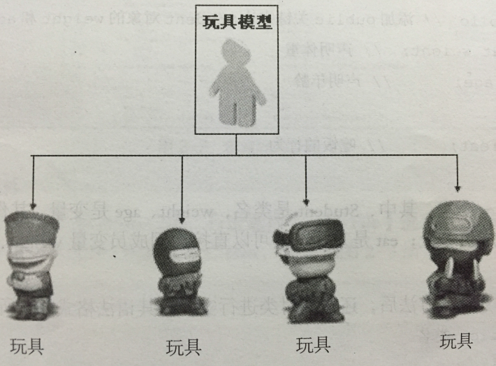

<!--
Created: Wed Sep 18 2019 18:50:22 GMT+0800 (中国标准时间)
Modified: Wed Sep 18 2019 18:55:31 GMT+0800 (中国标准时间)
-->
/**

* @module python3_notebook
* @Version :  
* @Author: Dillon
* @Contact: aa269440877@outlook.com
* @WebSite    :   https://github.com/ld269440877/
* @description: [new_global_snippets.code-snippets---VS Code 配置与插件推荐 2019 年版 - 掘金](https://juejin.im/post/5c73dcd05188256fd62d4d27)

[Code Chunk](https://www.bookstack.cn/read/mpe/zh-cn-code-chunk.md)
[code-snippets](File-Preferences-User Snippets-markdown_global_snappets.code-snippets)

* @since: 2019-09-18 10:57:05

**/
# Basics of python 

<font size="16" color="orange">文档规则：1. 定义 2. 案例 3. 注释 4. 总结 5. 参考链接</font>
==Content [^1]==
[^1]: [Code Chunk](https://www.bookstack.cn/read/mpe/zh-cn-code-chunk.md)


# 面向过程编程

```python {cmd = true matplotlib=true code_block=true class= ' line-numbers'  id='utf-8' continue:true output='markdown' } #hide  代码隐藏 
import io
import sys
#改变标准输出的默认编码
sys.stdout=io. TextIOWrapper(sys.stdout.buffer, encoding='utf8')

``` 

### 注释

单⾏行行注释
:   以 # 开始
```python
# 定义字符串串变量量name
name = "李李四"
```

多⾏行行注释
:   可以使⽤用三个双引号或者三个单引号""" """ ''' '''

``` python
'''
我是多⾏行行注释
我是多⾏行行注释
我是多⾏行行注释
'''
```

### 变量的定义

变量[^2]
:   通俗理理解就是存储程序数据的容器器。

变量量定义的格式
:   变量量名 = 数据 (变量量名尽量量有含义，⽅方便便理理解 )

2. 案例 & 注释

```python {cmd = true matplotlib=true code_block=true class= ' line-numbers'  continue='utf-8' output='markdown'} ##hide  代码隐藏
# 定义了了⼀一个变量量名字叫做score，存储的数据是100

score = 100 
print(score)
# 提示： 在python⾥里里⾯面不不需要指定数据的类型，会根据数据⾃自动推导出数据类型

# 通过type查看变量量的类型
score_type = type(score)
print(score_type)

``` 

4. 总结

总结： 常⽤用的数据类型 int, str, float, bool, list, tuple, dict, set

5. 参考

[^2]:[数据类型和变量 - 廖雪峰的官方网站](https://www.liaoxuefeng.com/wiki/1016959663602400/1017063826246112)

### 变量量的命名规则

1. Definition

变量量名
:   是由字⺟母、数字、下划线组成,注意是只有这三种，但是不不能以数字开头。

驼峰命名法
:   ⼩小驼峰和⼤大驼峰 
⼩小驼峰: 第⼀一个单词⾸首字⺟母要⼩小写，其它单词⾸首字⺟母都⼤大写 
⼤大驼峰:每个单词⾸首字⺟母都⼤大写

下划线命名
:   单词都使⽤用⼩小写字⺟母，单词之间使⽤用下划线进⾏行行分割, ⽐比如: my_name

2. Demonstration

```python {cmd = true matplotlib=true code_block=true class= ' line-numbers'  continue='utf-8' output='markdown'} ##hide  代码隐藏
my_name = '李李四' # 下划线命名法 -> 推荐使⽤用
myName = '王五' # ⼩小驼峰
MyName = '赵六' # ⼤大驼峰

```

3. Description

4. Conclusion

5. Reference

### 关键字

1. Definition

关键字
:   在python⾥⾯具有特殊功能的标识符（理理解成变量量名、函数名）， 关键字不能作为变量量名使
⽤用。

2. Demonstration

```python {cmd = true matplotlib=true code_block=true class= ' line-numbers'  continue='utf-8' output='markdown'} ###hide  代码隐藏
#查看python内置关键字
import keyword
print(keyword.kwlist) 

```

3. Description

4. Conclusion

5. Reference

### 常⽤用的数据类型转换

| 函数                    | 说明                                                    |
| ----------------------- | ------------------------------------------------------- |
| int(x [, base ])        | 将x转换为⼀一个整数                                      |
| float(x )               | 将x转换为⼀一个浮点数                                    |
| complex(real [, imag ]) | 创建⼀一个复数，real为实部，imag为虚部                   |
| str(x )                 | 将对象 x 转换为字符串串                                  |
| repr(x )                | 将对象 x 转换为表达式字符串串                            |
| eval(str )              | ⽤用来计算在字符串串中的有效Python表达式, 并返回⼀一个对象 |
| tuple(s )               | 将序列列 s 转换为⼀一个元组                               |
| list(s )                | 将序列列 s 转换为⼀一个列列表                              |
| chr(x )                 | 将⼀一个整数转换为⼀一个Unicode字符                       |
| ord(x )                 | 将⼀一个字符转换为它的ASCII整数值                        |
| hex(x )                 | 将⼀一个整数转换为⼀一个⼗十六进制字符串串                  |
| oct(x )                 | 将⼀一个整数转换为⼀一个⼋八进制字符串串                    |
| bin(x )                 | 将⼀一个整数转换为⼀一个⼆二进制字符串串                    |
```python {cmd = true matplotlib=true code_block=true class= ' line-numbers'  continue='utf-8' output='markdown'} ##hide  代码隐藏
# If x is not a number or if base is given, then x must be a string, bytes, or bytearray instance representing an integer literal in the given base.
print(int('0b100', base=0))
print(int('2',base=10))

print('”1+2“=',eval('1+2'))
```
### 输⼊入和输出
```python {cmd = true matplotlib=true code_block=true class= ' line-numbers'  continue='utf-8' output='markdown'} ##hide  代码隐藏
name =  input("提示符")
print("输出")

```
### 格式化输出
a. \%
```python {cmd = true matplotlib=true code_block=true class= ' line-numbers'  continue='utf-8' output='markdown'} ##hide  代码隐藏
score = 100
print("python考试分数:%d" % score)

```
b. format详解
1. 通过位置
```python
'a1 = {} a2= {}  a3= {}'.format('first','second','third')  #{}不带参数
>>'a1 = first a2= second  a3= third'
'a1 = {1} a2= {0}  a3= {2}'.format('first','second','third') #{}带位置参数的
>>'a1 = second a2= first  a3= third'

```
> 注意如果{}要带参数，可以将format看成一个函数输入的值是函数的参数，这些输入的值可以看成一个元组，{0} == tuple[0] 同样他们也不能越界

2. 通过关键字参数

```python
print('your name is {name} , age is {age}'.format(name='jack',age=87))
'your name is jack , age is 87'
print('your name is {name} , age is {age}'.format(age=87,name='jack') )#同样和位置无关
'your name is jack , age is 87'
```
3. 通过对象属性
```python {cmd = true matplotlib=true code_block=true class= ' line-numbers'  continue='utf-8' output='markdown'} ##hide  代码隐藏

class Person:
   # 初始化方法（python内部提供的方法，不可以修改名字）
    def __init__(self,name,age):
    #         默认属性
        self.name = name
        self.age = age
#         print('__init__')

p = Person('Tom',18)

print('name = {p.name} age = {p.age}'.format(p=p))
'name = Tom age = 18'

```
4. 通过下标
```python {cmd = true matplotlib=true code_block=true class= ' line-numbers'  continue='utf-8' output='markdown'} ##hide  代码隐藏
s1 = [1,'23','tom']
s2 = ['s2.1','s2.2','s2.3']
'{0[1]}  {0[2]} {1[2]} {1[0]}'.format(s1,s2)

'23  tom s2.3 s2.1'
```
5. 格式化输出(重点)

格式限定符
:    语法是{}中带:号
 {:对齐方式  填充}

 填充与对齐
 :  填充常跟对齐一起使用
 ^、<、>分别是居中、左对齐、右对齐，后面带宽度
 :号后面带填充的字符，只能是一个字符，不指定的话默认是用空格填充

5.1 对齐与填充
```python {cmd = true matplotlib=true code_block=true class= ' line-numbers'  continue='utf-8' output='markdown'} ##hide  代码隐藏
print('输出右对齐定长为10位  [{:$>10}]'.format('12') )#修改填充，填充只能是一个ASCII字符
'输出右对齐定长为10位  [$$$$$$$$12]'
print('输出居中对齐定长为10位，填充x  [{:x^10}]'.format('12') )#修改填充，填充只能是一个ASCII字符
'输出居中对齐定长为10位，填充x  [xxxx12xxxx]'
```
5.2 浮点小数输出
```python {cmd = true matplotlib=true code_block=true class= ' line-numbers'  continue='utf-8' output='markdown'} ##hide  代码隐藏
print('{:.2f}'.format(1233442.23453) )#通常都是配合 f 使用,其中.2表示长度为2的精度，f表示float类型
'1233442.23'
print('{:,}'.format(9987733498273.0432) )#使用逗号金额分割符
'9,987,733,498,273.043'

```
5.3 进制及其他显示
|   A   |            B             |
| :---: | :----------------------: |
|   b   |          二进制          |
|   d   |          十进制          |
|   o   |          八进制          |
|   x   |         十六进制         |
|  !s   | 将对象格式化转换成字符串 |
|  !a   | 将对象格式化转换成ASCII  |
|  !r   |  将对象格式化转换成repr  |
```python {cmd = true matplotlib=true code_block=true class= ' line-numbers'  continue='utf-8' output='markdown'} ##hide  代码隐藏
print('{!s}'.format(10) )#将对象格式化转换成字符串
'10'
print('{!a}'.format('1000') )#将对象格式化转换成ASCII
"'1000'"
print('{!r}'.format('1000') )#将对象格式化转换成repr
"'1000'"


```
### if语句句

1. Definition
计算机之所以能做很多⾃自动化的任务，因为它可以⾃自⼰己做条件判断。

2. Demonstration
```python {cmd = true matplotlib=true code_block=true class= ' line-numbers'  continue='utf-8' output='markdown'} ##hide  代码隐藏

age = 20

if age >= 6:
    print('teenager')
elif age >= 18:
    print('adult')
else:
    print('kid')

```


3. Description


4. Conclusion


5. Reference

### 运算符

1. 算数运算符

| 运算符 |  描述  |                               实例                               |
| :----: | :----: | :--------------------------------------------------------------: |
|   +    |   加   |                  两个对象相加 a + b 输出结果 30                  |
|   \-   |   减   |       得到负数或是⼀一个数减去另⼀一个数 a - b 输出结果 -10        |
|   \*   |   乘   | 两个数相乘或是返回⼀一个被重复若⼲干次的字符串串 a * b 输出结果 200 |
|   /    |   除   |                         b / a 输出结果 2                         |
|   //   | 取整除 |     返回商的整数部分 9//2 输出结果 4 , 9.0//2.0 输出结果 4.0     |
|   \%   |  取余  |                 返回除法的余数 b % a 输出结果 0                  |
|  \*\*  |  指数  |       a**b 为10的20次⽅方， 输出结果 100000000000000000000        |

混合运算时，优先级顺序为： ** ⾼于 * / % // ⾼于 + - ，为了避免歧义，建议使⽤用 () 来
处理理运算符优先级。并且，不同类型的数字在进行混合运算时，整数将会转换成浮点数进行运算。
2. 赋值运算符


| 运算符 |    描述    |                                 实例                                  |
| :----: | :--------: | :-------------------------------------------------------------------: |
|   =    | 赋值运算符 | 把 = 号右边的结果赋给左边的变量量，如 num = 1 + 2 \* 3，结果num的值为7 |

```python
# 单个变量量赋值
num = 10
# 多个变量量赋值
num1, num2, f1, str1 = 100, 200, 3.14, "hello"
```
### 复合赋值运算符


| 运算符 |       描述       |           实例            |
| :----: | :--------------: | :-----------------------: |
|   +=   |  加法赋值运算符  |  c += a 等效于 c = c + a  |
|   -=   |  减法赋值运算符  |  c -= a 等效于 c = c - a  |
|   $*=$   |  乘法赋值运算符  |  c *= a 等效于 c = $c * a$  |
|   /=   |  除法赋值运算符  |  c /= a 等效于 c = c / a  |
|   %=   |  取模赋值运算符  |  c %= a 等效于 c = c % a  |
| $**$=  |   幂赋值运算符   |  c** = a 等效于 c = $c^a$   |
|  //=   | 取整除赋值运算符 | c //= a 等效于 c = c // a |

### 循环
1. while 循环
```python {cmd = true matplotlib=true code_block=true class= ' line-numbers'  continue='utf-8' output='markdown'} ##hide  代码隐藏
i = 0
while i <3:
    print('hello world')
    i=i + 1
```
```python {cmd = true matplotlib=true code_block=true class= ' line-numbers'  continue='utf-8' output='markdown'} ##hide  代码隐藏
# 9X9乘法表
'''
1 * 1 = 1   
1 * 2 = 2 2 * 2 =4
1 * 3 = 3 2 * 3 = 6 3 * 3 = 9
'''

i = 1
while i<=9: # 行数
    j = 1
    while j<=i: # 列数
        print('%d * %d = %d' % (j,i,j*i),end='')
        j += 1
    print('')
        
    i += 1


```

2. for循环
```python {cmd = true matplotlib=true code_block=true class= ' line-numbers'  continue='utf-8' output='markdown'} ##hide  代码隐藏
names = ['Michael', 'Bob', 'Tracy']
for name in names:
    print(name)
```

```python {cmd = true matplotlib=true code_block=true class= ' line-numbers'  continue='utf-8' output='markdown'} ##hide  代码隐藏

for i in range(2):
    print(i)

#效果等同于 while 循环的：

i = 0
while i < 2:
    print(i)
    i += 1
```
3. break
```python {cmd = true matplotlib=true code_block=true class= ' line-numbers'  continue='utf-8' output='markdown'} ##hide  代码隐藏
n = 1
while n <= 100:
    if n > 3: # 当n = 11时，条件满⾜足，执⾏行行break语句句
        break #  break语句句会结束当前循环
    print(n)
    n = n + 1
print('END')
```

## Container

### 字符串（str）
1. Definition

字符串
:   单引号,双引号,包括三引号包围的字符组
```
name = 'abcdef'
print(name[1:-1]) # 取 下标为1开始 到 最后第2个 之间的字符
```
2. Demonstration
```python {cmd = true matplotlib=true code_block=true class= ' line-numbers'  continue='utf-8' output='markdown'} ##hide  代码隐藏
str = 'hello'#定义字符串串变量量
str = "helo"#定义字符串串变量量
str = """hello
hello"""#定义多⾏行行字符串串变量量
```
#### 下标和切⽚片
- 下标索引 `name = 'zhangsan' print(name[2])`
- 切⽚

切⽚
:   指对操作的对象截取其中⼀一部分的操作。字符串串、列列表、元组都⽀支持切⽚片操作。
- 切⽚的语法: [起始:结束:步长]

#### 字符串的常⻅操作
```python {cmd = true matplotlib=true code_block=true class= ' line-numbers'  continue='utf-8' output='markdown'} ##hide  代码隐藏
print([e for e in dir(str) if not e.startswith('_')])
```
-  find 检测 str 是否包含在  mystr 中，如果是返回开始的索引值，否则返回-1
`mystr.find(str, start=0, end=len(mystr))`
```python {cmd = true matplotlib=true code_block=true class= ' line-numbers'  continue='utf-8' output='markdown'} ##hide  代码隐藏

mystr = 'hello world kkb'
mystr.find("kkb")
# 运⾏结果为:12
mystr = 'hello world kkb'
mystr.find("kkb",0,10)#在mstr字符串串0-10下标范围查询
# 运⾏行结果:-1
```

- index 跟find() 方法⼀一样，只不过如果str 不在 mystr中会报⼀个异常.
`mystr.index(str, start=0, end=len(mystr))`
```python {cmd = true matplotlib=true code_block=true class= ' line-numbers'  continue='utf-8' output='none'} ##hide  代码隐藏
mystr = 'hello world kkb'
mystr.index("ab")
# 运⾏行行结果:控制台会直接报错(Vale Error:substring not found)

```
- count 返回 str 在start和end之间 在 mystr⾥里里⾯面出现的次数
`mystr.count(str, start=0, end=len(mystr))`
```python {cmd = true matplotlib=true code_block=true class= ' line-numbers'  continue='utf-8' output='markdown'} ##hide  代码隐藏
mystr = 'hello world kkb and kkb'
mystr.count('kkb')
# 运⾏行行结果:2
```
- replace 把 mystr 中的 str1 替换成 str2 ,如果 count 指定，则替换不不超过 count 次.
`mystr.replace(str1, str2, mystr.count(str1))`

- split 以 str 为分隔符切⽚mystr ，如果 maxsplit 有指定值，则仅分隔 maxsplit 个⼦字符串
`mystr.split(str=" ", 2)`
- capitalize 把字符串串的第⼀一个字符⼤大写
`mystr.capitalize()`
- title 
```python {cmd = true matplotlib=true code_block=true class= ' line-numbers'  continue='utf-8' output='markdown'} ##hide  代码隐藏
a = "hello kkb"
a.title()
# 运⾏行行结果
'Hello Kkb'
```
- startswith 检查字符串串是否是以 hello 开头, 是则返回 True ，否则返回 False
`mystr.startswith(hello)`
- endswith 检查字符串串是否以obj 结束，如果是返回True ,否则返回 False .
`mystr.endswith(obj)`
- lower 转换 mystr 中所有⼤大写字符为⼩小写
`mystr.lower()`
- upper 转换 mystr 中的⼩小写字⺟母为⼤大写
`mystr.upper()`
- ljust 返回⼀个原字符串左对齐,并使用空格填充⾄长度 width 的新字符串
`mystr.ljust(width)`
- rjust 返回⼀个原字符串右对齐,并使用空格填充⾄长度 width 的新字符串
`mystr.rjust(width)`
- center 返回⼀一个原字符串居中,并使⽤空格填充⾄长度 width 的新字符串
`mystr.center(width)`
- lstrip 删除 mystr 左边的空⽩字符
`mystr.lstrip()`
- rstrip 删除 mystr 字符串串末尾的空⽩白字符
`mystr.rstrip()`
- strip 删除mystr 字符串串两端的空⽩白字符
```python {cmd = true matplotlib=true code_block=true class= ' line-numbers'  continue='utf-8' output='markdown'} ##hide  代码隐藏
a = "\n\t kkb \t\n"
a.strip()
# 运⾏行行结果:
'kkb'
```
- rfind 类似于 find() 函数，不过是从右边开始查找.
`mystr.rfind(str, start=0,end=len(mystr) )`
- rindex 类似于 index() ，不不过是从右边开始.
`mystr.rindex( str, start=0,end=len(mystr))`
- partition 把mystr 以str 分割成三部分, str 前， str 和str 后
`mystr.partition(str)`
```python {cmd = true matplotlib=true code_block=true class= ' line-numbers'  continue='utf-8' output='markdown'} ##hide  代码隐藏
str = '123-abc-ABC-@#$'
print(str.partition('-'))
```
- rpartition 类似于 partition()函数,不不过是从右边开始.
`mystr.rpartition(str)`
- splitlines 按照⾏行行分隔，返回⼀一个包含各⾏行行作为元素的列列表
`mystr.splitlines()`
- join mystr 中每个元素后⾯插⼊入str ,构造出一个新的字符串
`mystr.join(str)`
```python {cmd = true matplotlib=true code_block=true class= ' line-numbers'  continue='utf-8' output='markdown'} ##hide  代码隐藏
'''
Signature: str.join(iterable, /)
Docstring:
Concatenate any number of strings.

The string whose method is called is inserted in between each given string.
The result is returned as a new string.

Example: '.'.join(['ab', 'pq', 'rs']) -> 'ab.pq.rs'
Type:      builtin_function_or_method
'''
print('.'.join(['ab', 'pq', 'rs']) )
#  -> 'ab.pq.rs'
```
### 列表（list）

列表
:   Python内置的一种数据类型是列表： list 。list 是一种有序的集合，可以随时添加和删除其中的元素，写在方括号之间、⽤逗号分隔开的数值列表。列表内的项目不必全是相同的类型。
`list1 = ['spam', 'eggs', 100, 1234]`

```python {cmd = true matplotlib=true code_block=true class= ' line-numbers'  continue='utf-8' output='markdown'} ##hide  代码隐藏

# 列表生成式:快速的生成一个我想要的列表
# my_list = []
# for i in range(1,6):
#     my_list.append(i)

# my_list = [value for value in range(1,6)]
# print(my_list)

# ['a','b']
# ['akkb','bkkb']
my_list = [value+'kkb' for value in ['a','b']]
print(my_list)

```


#### 列表的常见操作
- 列表的长度
```python {cmd = true matplotlib=true code_block=true class= ' line-numbers'  continue='utf-8' output='markdown'} ##hide  代码隐藏
#⽤用len()函数可以获得list元素的个数：
namesList = ['xiaoWang','xiaoZhang','xiaoHua']
len(namesList)
```
- 列表的访问 用索引来访问list 中每一个位置的元素，记得索引是从0开始的：
`namesList = ['xiaoWang','xiaoZhang','xiaoHua']
print(namesList[0])`
> 注意：当索引超出了范围时，Python会报⼀个IndexError 错误，所以，要确保索引不要越界，记得最后⼀个元素的索引是len(classmates) - 1 。
如果要取最后⼀个元素，除了了计算索引位置外，还可以⽤用-1做索引，直接获取最后一个元素：
`namesList = ['xiaoWang','xiaoZhang','xiaoHua']
print(namesList[-1])    
结果：
xiaoHua`

- 列表的切⽚

切片
:   根据下标的范围获取⼀部分数据，比如: 列列表，字符串可以使⽤切片。
> 切⽚片的使用格式
数据[起始下标:结束下标:步⻓长]
提示： 起始下标默认0， 结束下标是不不包含， 步⻓长默认是1

- 添加元素( append , extend , insert ) 

通过append 可以向列列表添加元素
```python {cmd = true matplotlib=true code_block=true class= ' line-numbers'  continue='utf-8' output='markdown'} ##hide  代码隐藏
#定义变量量A，默认有3个元素
A = ['xiaoWang','xiaoZhang','xiaoHua']

print("-----添加之前，列列表A的数据-----")
for tempName in A:
    print(tempName)

#提示、并添加元素
# temp = input('请输⼊要添加的学⽣生姓名:')
temp = 'Dillon'
A.append(temp)

print("-----添加之后，列列表A的数据-----")
for tempName in A:
    print(tempName)
```
通过extend 可以将另⼀一个集合中的元素逐⼀一添加到列列表中
```python {cmd = true matplotlib=true code_block=true class= ' line-numbers'  continue='utf-8' output='markdown'} ##hide  代码隐藏
a = [1, 2]
b = [3, 4]
print(a.append(b))  # a.append(b)没有返回值   None
print(a)
# [1, 2, [3, 4]]

a = [1, 2]
b = [3, 4]
print(a.extend(b))
print(a)
# [1, 2, 3, 4]

# insert(index, object)` 在指定位置`index`前插⼊入元素`object
a = [0, 1, 2]
a.insert(1, 3)
print(a)
# [0, 3, 1, 2]
```

- 修改元素
修改元素的时候，要通过下标来确定要修改的是哪个元素，然后才能进⾏行行修改
```python {cmd = true matplotlib=true code_block=true class= ' line-numbers'  continue='utf-8' output='markdown'} ##hide  代码隐藏

#定义变量量A，默认有3个元素
A = ['xiaoWang','xiaoZhang','xiaoHua']

print("-----修改之前，列表A的数据-----")

for tempName in A:
    print(tempName)

#修改元素
A[1] = 'xiaoLu'

print("-----修改之后，列表A的数据-----")

for tempName in A:
    print(tempName)
```
- 查找元素

所谓的查找，就是看看指定的元素是否存在。
> python中查找的常用方法为：
in （存在）,如果存在那么结果为true ，否则为false
not in （不存在），如果不存在那么结果为true ，否则false
```python {cmd = true matplotlib=true code_block=true class= ' line-numbers'  continue='utf-8' output='markdown'} ##hide  代码隐藏
#待查找的列列表
nameList = ['xiaoWang','xiaoZhang','xiaoHua']
#获取⽤用户要查找的名字
# findName = input('请输⼊入要查找的姓名:')
findName = 'xiaoWang'
#查找是否存在
if findName in nameList:
    print('在字典中找到了了相同的名字')
else:
    print('没有找到')

```
- index 和count 与字符串中的用法相同
```python {cmd = true matplotlib=true code_block=true class= ' line-numbers'  continue='utf-8' output='markdown'} ##hide  代码隐藏
a = ['a', 'b', 'c', 'a', 'b']
# print(a.index('a', 1, 3)) # 注意是左闭右开区间

print(a.index('a', 1, 4))

print(a.count('b'))
```

- 删除元素
列表元素的常⽤删除方法有：
    - del：根据下标进行删除
    - pop：删除最后一个元素
    - remove：根据元素的值进行删除
a. del
```python {cmd = true matplotlib=true code_block=true class= ' line-numbers'  continue='utf-8' output='markdown'} ##hide  代码隐藏
list1 = ['a','b','c','d','e','f']
print('------删除之前------')
for tempName in list1:
    print(tempName,end='')
# print()
del list1[2]
print('------删除之后------')
for tempName in list1:
    print(tempName,end='')
```
b. pop
```python {cmd = true matplotlib=true code_block=true class= ' line-numbers'  continue='utf-8' output='markdown'} ##hide  代码隐藏
list2 = ['a','b','c','d','e','f']
print('------删除之前------')
for tempName in list2:
    print(tempName,end='')
list2.pop()
print('------删除之后------')
for tempName in list2:
    print(tempName,end='')
```

- 排序
sort ⽅法是将list 按特定顺序重新排列，默认为由⼩到⼤，参数reverse=True 可改为倒序，由⼤到⼩。
```python {cmd = true matplotlib=true code_block=true class= ' line-numbers'  continue='utf-8' output='markdown'} ##hide  代码隐藏
a = [1, 4, 2, 3]
print(a)
a.reverse()
print(a)
a.sort()
print(a)
a.sort(reverse=True)
print(a)
```
3. 列表的遍历
a. 使⽤用for循环
```python {cmd = true matplotlib=true code_block=true class= ' line-numbers'  continue='utf-8' output='markdown'} ##hide  代码隐藏
namesList = ['xiaoWang','xiaoZhang','xiaoHua']
for name in namesList:
    print(name)
```
b. 使用while循环
```python {cmd = true matplotlib=true code_block=true class= ' line-numbers'  continue='utf-8' output='markdown'} ##hide  代码隐藏
namesList = ['xiaoWang','xiaoZhang','xiaoHua']
length = len(namesList)
i = 0
while i<length:
    print(namesList[i])
    i+=1
```

### 元组（tuple）
另⼀种有序列表叫元组： tuple 。tuple 和list 非常类似，但是tuple 一旦初始化就不能修改
`classmates = ('Michael', 'Bob', 'Tracy')`
> classmates 这个tuple 不能变了了，它也没有append() ， insert( )这样的⽅方法。其他获取元素的⽅法和list是一样的，你可以正常地使用classmates[0] ， classmates[-1] ，但不能赋值成另外的元素。
1. Definition
- 如果要定义⼀一个空的tuple ，可以写成() ：
`t = ()`
- 定义⼀一个只有1个元素的tuple,只有1个元素的tuple定义时必须加⼀一个逗号，来消除歧义：
`t = (1,)`
> 最后来看⼀一个“可变的”tuple：
```python {cmd = true matplotlib=true code_block=true class= ' line-numbers'  continue='utf-8' output='markdown'} ##hide  代码隐藏
t = ('a', 'b', ['A', 'B'])
t[2][0] = 'X'
t[2][1] = 'Y'
print(t)
# ('a', 'b', ['X', 'Y'])
```

2. Demonstration


3. Description


4. Conclusion


5. Reference

### 字典（dict）

1. Definition
字典是另⼀一种可变容器器模型，且可存储任意类型对象。
字典的每个键值(key=>value)对⽤用冒号(:)分割，每个对之间⽤用逗号(,)分割，整个字典包括在花括号{}中
2. Demonstration
`d = {'Michael': 95, 'Bob': 75, 'Tracy': 85} d['Michael']`


3. Description
由于⼀一个key 只能对应⼀一个value ，所以，多次对⼀一个key 放⼊入value ，后⾯面的值会把前⾯面的值冲
掉：
```
d['Jack'] = 90
d['Jack']
90
d['Jack'] = 88
d['Jack']
88
```
如果key不存在，dict就会报错：
4. Conclusion


5. Reference


#### 字典的常⻅操作
- 修改元素
字典的每个元素中的数据是可以修改的，只要通过key 找到，即可修改

```python {cmd = true matplotlib=true code_block=true class= ' line-numbers'  continue='utf-8' output='markdown'} ##hide  代码隐藏
info = {'name':'kkb', 'id':100, 'sex':'f', 'address':'中国北北'}
# new_id = input('请输⼊新的学号:')
new_id = '102'
info['id'] = int(new_id)
print('修改之后的id为: %d' % info['id'])
```
- 添加元素
访问不不存在的元素: 报错
如果在使⽤用 变量量名['键'] = 数据 时，这个“键”在字典中，不不存在，那么就会新增这个元素。
```python {cmd = true matplotlib=true code_block=true class= ' line-numbers'  continue='utf-8' output='markdown'} ##hide  代码隐藏
info = {'name':'kkb', 'sex':'f', 'address':'中国北北京'}

# newId = input('请输⼊入新的学号：')
newId = 102
info['id'] = newId
print('添加之后的id为:%d' % info['id'])

```
- 删除元素
对字典进行删除操作，有一下⼏种：
- del
- clear()
del 删除指定的元素
```python {cmd = true matplotlib=true code_block=true class= ' line-numbers'  continue='utf-8' output='markdown'} ##hide  代码隐藏
info = {'name':'kkb', 'sex':'f', 'address':'中国北北京'}
print('删除前,%s' % info['name'])
del info['name']
print('删除后,%s' % info)


```
del 删除整个字典

```python {cmd = true matplotlib=true code_block=true class= ' line-numbers'  continue='utf-8' output='markdown'} ##hide  代码隐藏
info = {'name':'monitor', 'sex':'f', 'address':'China'}
print('删除前,%s' % info)
del info
# print('删除后,%s' % info)
```
clear清空整个字典
```python {cmd = true matplotlib=true code_block=true class= ' line-numbers'  continue='utf-8' output='markdown'} ##hide  代码隐藏
info = {'name':'monitor', 'sex':'f', 'address':'China'}
print('清空前,%s' % info)
info.clear()
print('清空后,%s' % info)
```
- len()
测量量字典中，键值对的个数
```python {cmd = true matplotlib=true code_block=true class= ' line-numbers'  continue='utf-8' output='markdown'} ##hide  代码隐藏
d1 = {'name':'abc','age':'18', 'class':'cnh'}
print(len(d1))
# 结果：
# 3
```
- keys
返回⼀个包含字典所有key的列表
```python {cmd = true matplotlib=true code_block=true class= ' line-numbers'  continue='utf-8' output='markdown'} ##hide  代码隐藏
d1 = {'name':'abc','age':'18', 'class':'cnh'}
print(list(d1.keys()))
# 结果：
# ['name', 'age', 'class']
```
- values
返回⼀一个包含字典所有value的列列表
```python {cmd = true matplotlib=true code_block=true class= ' line-numbers'  continue='utf-8' output='markdown'} ##hide  代码隐藏
d1 = {'name':'abc','age':'18', 'class':'cnh'}
print(list(d1.values()))
# 结果：
# ['abc', '18', 'cnh']
```
- items
返回⼀个包含所有（键，值）元祖的列表
```python {cmd = true matplotlib=true code_block=true class= ' line-numbers'  continue='utf-8' output='markdown'} ##hide  代码隐藏
d1 = {'name':'abc','age':'18', 'class':'cnh'}
print(list(d1.items()))
# 结果：
# [('name', 'abc'), ('age', '18'), ('class', 'cnh')]
```
- 集合（set）
1. Definition
集合（set）是⼀一个⽆无序的不不重复元素序列列。
可以使⽤大括号 { } 或者 set() 函数创建集合，注意：创建一个空集合必须用 set() ⽽不是 { }，因为 { }是⽤来创建⼀个空字典。
2. Demonstration
```python {cmd = true matplotlib=true code_block=true class= ' line-numbers'  continue='utf-8' output='markdown'} ##hide  代码隐藏
my_set = {1, 4, 'abc', 'hello'}
# 不支持下标赋值和取值
# my_set[0] = 3
# value = my_set[0]
# print(value)
```
```python {cmd = true matplotlib=true code_block=true class= ' line-numbers'  continue='utf-8' output='markdown'} ##hide  代码隐藏
#通过遍历获取数据
my_set = {1, 5, 7}
for value in my_set:
    print(value)
for index,value in enumerate(my_set):
    print(index,value)

```
```python {cmd = true matplotlib=true code_block=true class= ' line-numbers'  continue='utf-8' output='markdown'} ##hide  代码隐藏
# 定义空的集合的时候不不能直接使⽤用{}
my_set = set()
my_set.add(1)
my_set.add(1)
print(my_set, type(my_set))
# 集合可以对容器器类型数据去重
my_list = [1, 1, 3, 5, 3]
# 把列列表转成集合，会把数据去重
my_set = set(my_list)
print(my_set)
# 列列表，元组， 集合 三者之间可以相互转换
my_tuple = (5, 3)
print(my_tuple, type(my_tuple))
```
3. Description


4. Conclusion


5. Reference

## 函数

1. Definition

函数
:   需要某块代码多次，但是为了了提高编写的效率以及代码的重⽤用，所以把具有独⽴功能的代码块组织为⼀个⼩模块

### 函数定义和调⽤
#### 定义函数
```
def 函数名():
    代码
```
#### 调用函数
函数名() 即可完成调⽤用
定义完函数后，函数是不不会⾃自动执⾏行行的，需要调⽤用它才可以
`printInfo()`
#### 注意:
- 每次调⽤函数时，函数都会从头开始执行，当这个函数中的代码执完毕后，意味着调⽤结束了
- 当然了如果函数中执行到了return也会结束函数
### 函数的文档说明
```python {cmd = true matplotlib=true code_block=true class= ' line-numbers'  continue='utf-8' output='markdown'} ##hide  代码隐藏
def test(a,b):
    '''⽤来完成对2个数求和'''
    print("%d"%(a+b))
help(test)
# 还可以用test.__doc__ 直接查看文档说明
print(test.__doc__)
```
### 函数的参数
#### 位置参数
```python {cmd = true matplotlib=true code_block=true class= ' line-numbers'  continue='utf-8' output='markdown'} ##hide  代码隐藏
def power(x, n):
    '''power(x, n) 函数，可以计算任意xd的n次⽅：'''
    s = 1
    while n > 0:
        n = n - 1
        s = s * x
    return s
```
#### 默认参数
```python {cmd = true matplotlib=true code_block=true class= ' line-numbers'  continue='utf-8' output='markdown'} ##hide  代码隐藏
def power(x, n=2):
'''
power(x, n) 函数，可以计算任意xd的n次⽅：
默认参数：n=2
'''
    s = 1
    while n > 0:
        n = n - 1
        s = s * x
    return s

```
默认参数可以简化函数的调用。
设置默认参数时，有⼏点要注意：
- 必选参数在前，默认参数在后，否则Python的解释器器会报错；
- 当函数有多个参数时，把变化大的参数放前面，变化小的参数放后面。变小的参数就可以作为默认参数。

##### 注意：默认参数有个最⼤大的坑，演示如下：
先定义⼀一个函数，传⼊入⼀一个list，添加⼀一个END 再返回：
```python {cmd = true matplotlib=true code_block=true class= ' line-numbers'  continue='utf-8' output='markdown'} ##hide  代码隐藏
def add_end(L=[]):
    L.append('END')
    return L

# 当你正常调⽤用时，结果似乎不不错：
add_end([1, 2, 3])
# [1, 2, 3, 'END']
add_end(['x', 'y', 'z'])
# ['x', 'y', 'z', 'END']


# 当你使⽤用默认参数调⽤用时，一开始结果也是对的：
add_end()
# ['END']
'''
但是，默认参数再次调⽤用add_end() 时，结果就不不对了了：
'''
add_end()
# ['END', 'END']
add_end()
# ['END', 'END', 'END']
```
很多初学者很疑惑，默认参数是[] ，但是函数似乎每次都“记住了了”上次添加了了'END' 后的list。
> 原因解释如下：
Python函数在定义的时候，默认参数L 的值就被计算出来了，即[] ，因为默认参数L 也是一个变量，它指向对象[] ，每次调⽤用该函数，如果改变了L 的内容，则下次调⽤用时，默认参数的内容就变了，不再是函数定义时的[] 了。
##### 定义默认参数要牢记一点：默认参数必须指向不变对象！

要修改上⾯的例子，我们可以用None 这个不变对象来实现：
```python {cmd = true matplotlib=true code_block=true class= ' line-numbers'  continue='utf-8' output='markdown'} ##hide  代码隐藏
def add_end(L=None):
    if L is None:
        L = []
    L.append('END')
    return L
```
> 为什么要设计str 、None 这样的不变对象呢？因为不变对象一旦创建，对象内部的数据就不能修改，这样就减少了了由于修改数据导致的错误。此外，由于对象不变，多任务环境下同时读取对象不需要加锁，同时读一点问题都没有。我们在编写程序时，如果可以设计一个不不变对象，那就尽量量设计成不变对象。
#### 可变参数
可变参数就是传⼊入的参数个数是可变的，可以是1个、2个到任意个，还可以是0个。
```python {cmd = true matplotlib=true code_block=true class= ' line-numbers'  continue='utf-8' output='markdown'} ##hide  代码隐藏
def calc(*numbers):
    sum = 0
    for n in numbers:
        sum = sum + n * n
    return sum
# >>> calc(1, 2)
# 5
# >>> calc()
# 0

>>> nums = [1, 2, 3]
'''
*nums 表示把nums 这个list的所有元素作为可变参数传进去。
'''
>>> calc(*nums)
14
```
#### 命名关键字参数
对于关键字参数，函数的调⽤用者可以传⼊入任意不不受限制的关键字参数。⾄至于到底传⼊入了了哪些，就需要在函数内部通过kw 检查。

仍以person() 函数为例例，我们希望检查是否有city 和job 参数：
```python {cmd = true matplotlib=true code_block=true class= ' line-numbers'  continue='utf-8' output='markdown'} ##hide  代码隐藏
def person(name, age, **kw):
    if 'city' in kw:
    # 有city参数
        pass
    if 'job' in kw:
    # 有job参数
        pass
    print('name:', name, 'age:', age, 'other:', kw)

person('Jack', 24, city='Beijing', addr='Chaoyang', zipcode=123456)
```
#### 命名关键字参数
如果要限制关键字参数的名字，就可以⽤用命名关键字参数，例例如，只接收city 和job 作为关键字参数。
这种⽅方式定义的函数如下：
```python {cmd = true matplotlib=true code_block=true class= ' line-numbers'  continue='utf-8' output='markdown'} ##hide  代码隐藏

def person(name, age, *, city, job):
'''命名关键字参数--限制关键字参数的名字--必须传⼊参数名'''
    print(name, age, city, job)

```
- 和关键字参数**kw 不不同，命名关键字参数需要⼀一个特殊分隔符* ， * 后⾯面的参数被视为命名关键字参数。调⽤用⽅方式如下：
`person('Jack', 24, city='Beijing', job='Engineer')
Jack 24 Beijing Engineer`
- 如果函数定义中已经有了一个可变参数，后面跟着的命名关键字参数就不再需要⼀一个特殊分隔符* 了：
```python {cmd = true matplotlib=true code_block=true class= ' line-numbers'  continue='utf-8' output='markdown'} ##hide  代码隐藏
def person(name, age, *args, city, job):
    print(name, age, args, city, job)

```
- 命名关键字参数可以有缺省值，从⽽而简化调⽤用：
```python {cmd = true matplotlib=true code_block=true class= ' line-numbers'  continue='utf-8' output='markdown'} ##hide  代码隐藏
def person(name, age, *, city='Beijing', job):
'''由于命名关键字参数city 具有默认值，调⽤用时，可不不传⼊入city 参数：'''
    print(name, age, city, job)
```
- 使⽤用命名关键字参数时，要特别注意，如果没有可变参数，就必须加⼀个\* 作为特殊分隔符。如果缺少\* ，Python解释器器将⽆无法识别位置参数和命名关键字参数：
```python {cmd = true matplotlib=true code_block=true class= ' line-numbers'  continue='utf-8' output='markdown'} ##hide  代码隐藏
def person(name, age, city, job):
# 缺少 *，city和job被视为位置参数
    ass
```
#### 参数组合
参数定义的顺序必须是：必选参数、默认参数、可变参数、命名关键字参数和关键字参数。

在函数调⽤的时候，Python解释器⾃动按照参数位置和参数名把对应的参数传进去。
```python {cmd = true matplotlib=true code_block=true class= ' line-numbers'  continue='utf-8' output='markdown'} ##hide  代码隐藏
def f1(a, b, c=0, *args, **kw):
    print('a =', a, 'b =', b, 'c =', c, 'args =', args, 'kw =', kw)
def f2(a, b, c=0, *, d, **kw):
    print('a =', a, 'b =', b, 'c =', c, 'd =', d, 'kw =', kw)

# 最神奇的是通过⼀一个tuple 和dict ，你也可以调⽤用上述函数：
args = (1, 2, 3, 4)
kw = {'d': 99, 'x': '#'}
f1(*args, **kw)

```
### 函数返回值 
- “返回值”，就是程序中函数完成⼀一件事情后，最后给调⽤用者的结果
- 带有返回值的函数
想要在函数中把结果返回给调⽤用者，需要在函数中使⽤用return
```python {cmd = true matplotlib=true code_block=true class= ' line-numbers'  continue='utf-8' output='markdown'} ##hide  代码隐藏
def add2num(a, b):
    return a+b
```
- 保存函数的返回值
```python {cmd = true matplotlib=true code_block=true class= ' line-numbers'  continue='utf-8' output='markdown'} ##hide  代码隐藏
#定义函数
def add2num(a, b):
    return a+b
#调⽤函数，顺便保存函数的返回值
result = add2num(100,98)
#因为result已经保存了add2num的返回值，所以接下来就可以使用了了
print(result)
# 结果:
# 198

```
- 在python中我们怎样返回多个值？

多个return?
> ⼀一个函数中可以有多个return 语句，但是只要有一个return 语句被执行到，那么这个函数就会结束了
```python {cmd = true matplotlib=true code_block=true class= ' line-numbers'  continue='utf-8' output='markdown'} ##hide  代码隐藏
def create_nums(num):
    print("---1---")
    if num == 100:
        print("---2---")
        return num+1 # 函数中下⾯面的代码不不会被执⾏行行，因为return除了了能够将数据返回之外，还有一个隐藏的功能：结束函数
    else:
        print("---3---")
        return num+2
    print("---4---")
result1 = create_nums(100)
print(result1) # 打印101
result2 = create_nums(200)
print(result2) # 打印202

```
- ⼀个函数返回多个数据的⽅式
```python {cmd = true matplotlib=true code_block=true class= ' line-numbers'  continue='utf-8' output='markdown'} ##hide  代码隐藏
def divid(a, b):
    shang = a//b
    yushu = a%b
    return shang, yushu #默认是元组
result = divid(5, 2)
print(result) # 输出(2, 1)
```
##### return 后面可以是元组，列表、字典等，只要是能够存储多个数据的类型，就可以一次性返回多个数据

```python {cmd = true matplotlib=true code_block=true class= ' line-numbers'  continue='utf-8' output='markdown'} ##hide  代码隐藏
def function():
# return [1, 2, 3]
# return (1, 2, 3)
    return {"num1": 1, "num2": 2, "num3": 3}

print(function())
```
## 递归函数
在函数内部，可以调⽤用其他函数。如果⼀一个函数在内部调⽤用⾃自身本身，这个函数就是递归函数。
```python {cmd = true matplotlib=true code_block=true class= ' line-numbers'  continue='utf-8' output='markdown'} ##hide  代码隐藏
def fact(n):
'''fact(n) 可以表示为n x fact(n-1) ，只有n=1时需要特殊处理。'''
    if n==1:
     return 1
    return n * fact(n - 1)
print(fact(3))
```
> - 递归函数的优点是定义简单，逻辑清晰。理理论上，所有的递归函数都可以-写成循环的⽅方式，但循环的逻辑不不如递归清晰。
> - 使⽤用递归函数需要注意防⽌止栈溢出。
如果我们计算fact(5) ，可以根据函数定义看到计算过程如下：
===> fact(5)
===> 5 * fact(4)
===> 5 * (4 * fact(3))
===> 5 * (4 * (3 * fact(2)))
===> 5 * (4 * (3 * (2 * fact(1))))
===> 5 * (4 * (3 * (2 * 1)))
===> 5 * (4 * (3 * 2))
===> 5 * (4 * 6)
===> 5 * 24
===> 120
### 小结
- 使⽤用递归函数的优点是逻辑简单清晰，缺点是过深的调⽤用会导致栈溢出。
针对尾递归优化的语⾔言可以通过尾递归防⽌止栈溢出。
- 尾递归事实上和循环是等价的，没有循环语句句的编程语⾔言只能通过尾递归实现循环。
- Python标准的解释器器没有针对尾递归做优化，任何递归函数都存在栈溢出的问题。
## 局部变量
局部变量
:   在函数内部定义的变量

作⽤范围
:   作⽤范围是这个函数内部，即只能在这个函数中使用，在函数的外部是不能使用的。因为其作⽤范围只是在⾃己的函数内部，所以不同的函数可以定义相同名字的局部变量
- 局部变量的作用，为了临时保存数据需要在函数中定义变量来进行存储。
- 当函数调用时，局部变量被创建，当函数调用完成后这个变量就不能够使用了
```python {cmd = true matplotlib=true code_block=true class= ' line-numbers'  continue='utf-8' output='markdown'} ##hide  代码隐藏
def show():
# 局部变量量
    score = 100
    print("分数:", score)
show()   # show() is called
# print(score)  #score is a local variable, not called outside the show()
```
## 全局变量
全局变量
:   一个变量，既能在一个函数中使用，也能在其他的函数中使用
```python {cmd = true matplotlib=true code_block=true class= ' line-numbers'  continue='utf-8' output='markdown'} ##hide  代码隐藏
# 定义全局变量
a = 100
def test1():
    print(a) # 虽然没有定义变量a但是依然可以获取其数据
def test2():
    print(a) # 虽然没有定义变量a但是依然可以获取其数据
# 调⽤函数
test1()
test2()

```
## 总结
- 在函数外边定义的变量叫做全局变量
- 全局变量能够在所有的函数中进⾏访问
a. 全局变量和局部变量名字相同问题
```python {cmd = true matplotlib=true code_block=true class= ' line-numbers'  continue='utf-8' output='markdown'} ##hide  代码隐藏
# 定义全局变量量
a = 100
def test1():
    # 定义局部变量量
    a = 300
    print('---test1---%d'%a)  #300
    #修改
    a = 200
    print('修改后的%d'%a)   #200
def test2():
    print('a = %d'%a)   #100
test1()
test2()
```
### 总结
当函数内出现局部变量和全局变量相同名字时，函数内部中的 ==变量名=数据== 此时理解为==定义了一个局部变量，⽽不是修改全局变量的值==

b. 修改全局变量
```python {cmd = true matplotlib=true code_block=true class= ' line-numbers'  continue='utf-8' output='markdown'} ##hide  代码隐藏
# 定义全局变量量
a = 100
def test1():
    # 定义局部变量
    global a
    print('修改之前：%d'%a)    #100
    #修改
    a = 200
    print('修改后的%d'%a)   #200
def test2():
    print('a = %d'%a)  #200
test1()
test2()


```

```python {cmd = true matplotlib=true code_block=true class= ' line-numbers'  continue='utf-8' output='markdown'} ##hide  代码隐藏

for value in range(0,5): 
    # value =0
    # value =1.... value=4
    print(value)
    
print(value+3) # 4+ 3=7

```
```python {cmd = true matplotlib=true code_block=true class= ' line-numbers'  continue='utf-8' output='markdown'} ##hide  代码隐藏
# 函数
i = 1
def show():
#     i = 1
' check i ---> = i + 1'
    i = i + 1  #UnboundLocalError: local variable 'i' referenced before assignment
#     a = i + 1
show()

```
## 随机创建一个电话号
```python {cmd = true matplotlib=true code_block=true class= ' line-numbers'  continue='utf-8' output='markdown'} ##hide  代码隐藏
'''
电信号段:133/153/180/181/189/177；
联通号段:130/131/132/155/156/185/186/145/176；
移动号段：134/135/136/137/138/139/150/151/152/157/158/159/182/183/184/187/188/147/178


前三位 +  后八位随机八位数字（0-9）
第一位 ： 1
第二位：3,4,5,7,8
第三位：是由第二位决定 145 147 154
[012356789]
'''
import random

def create_phone():
    # 第二位产生
    second = [3,4,5,7,8][random.randint(0,4)]  # 4 [5,7]
    
    {'name':'zs'}['name']
    # 第三位
    third = {
        3:random.randint(0,9),
        4:[5,7][random.randint(0,1)],
        5:[i for i in range(10) if i!=4][random.randint(0,8)],
        7:[6,7,8][random.randint(0,2)],
        8:random.randint(0,9)
    }[second]
    
    # 后八位0-9
    suffix = '' 
    for x in range(8):    # 8次
        suffix = suffix + str(random.randint(0,9))   # 每次以字符串形式拼接一个数字

    return "1{}{}{}".format(second,third,suffix)


for index in range(0,10):   # 10次
    phone = create_phone()  #每次生成一个随机的11位数手机号
    print(phone)
```
---

---

# ⾯向对象编程

面向对象编程——Object Oriented Programming，简称OOP
：  一种程序设计思想。OOP把对象作为程序的基本单元，一个对象包含了数据和操作数据的函数。

⾯向对象的设计思想是抽象出Class，根据Class创建Instance 。

> <font color = 'orange'>⾯向过程的程序设计 </font> 把计算机程序视为一系列的==命令集合==，即==一组函数的顺序执⾏==。为了简化程序设计，⾯向过程把函数继续切分为子函数，即把大块函数通过切割成小块函数来降低系统的复杂度。

> <font color='orange'>⾯向对象的程序设计</font>把计算机程序视为==⼀组对象的集合==，而每个对象都可以接收其他对象发过来的消息，并处理这些消息，计算机程序的执行就是==一系列消息在各个对象之间传递==。

- 在Python中，所有数据类型都可以视为对象，当然也可以⾃定义对象。⾃定义的对象数据类型就是面向对象中的类（Class）的概念。

---
我们以⼀个例子来说明⾯向过程和面向对象在程序流程上的不同之处。
> 假设我们要处理学生的成绩表，为了表示一个学⽣的成绩，⾯向过程的程序可以⽤一个dict 表示：
```python {cmd = true matplotlib=true code_block=true class= ' line-numbers'  continue='utf-8' id = 'std' output='markdown'} ##hide  代码隐藏
std1 = { 'name': 'Curry', 'score': 98 }
std2 = { 'name': 'James', 'score': 81 }

```
>而处理学⽣成绩可以通过函数实现，⽐如打印学⽣的成绩：
```python {cmd = true matplotlib=true code_block=true class= ' line-numbers'  continue='std' output='markdown'} ##hide  代码隐藏
std1 = { 'name': 'Curry', 'score': 98 }
def print_score(std):
    print('%s: %s' % (std['name'], std['score']))
print_score(std1)
```

> 如果采⽤⾯向对象的程序设计思想，我们⾸先思考的不是程序的执行流程，而是Student 这种数据类型应该被视为⼀个对象，这个对象拥有name 和score 这两个属性（Property）。如果要打印一个学生的成绩，⾸先必须创建出这个学生对应的对象，然后，给对象发一个print_score 消息，让对象⾃己把⾃己的数据打印出来。
```python {cmd = true matplotlib=true code_block=true class= ' line-numbers'  continue='utf-8' output='markdown'} ##hide  代码隐藏

class Student(object):
    def __init__(self, name, score):
        self.name = name
        self.score = score
    def print_score(self):
        print('%s: %s' % (self.name, self.score))
'''
给对象发消息实际上就是调⽤用对象对应的关联函数，我们称之为对象的方法（Method）。面向对象的
程序写出来就像这样：
'''
bart = Student('Bart Simpson', 59)
lisa = Student('Lisa Simpson', 87)
bart.print_score()
lisa.print_score()

```

## 类和对象
⾯面向对象编程的2个⾮非常重要的概念：类和对象

对象是面向对象编程的核心，在使用对象的过程中，为了将具有共同特征和行为的一组对象抽象定义，提出了另外⼀个新的概念——类

### 类
具有相似内部状态和运动规律律的实体的集合(或统称为抽象)。 具有相同属性
和⾏为事物的统称,类是抽象的,在使用的时候通常会找到这个类的一个具体的存在,使用这个具体的存在。一个类可以找到多个对象
### 对象
某一个具体事物的存在 ,在现实世界中可以是看得见摸得着的。 可以是直接使用的
### 类和对象之间的关系
@import  "类和对象之间的关系.png" {title="类和对象之间的关系"}


![类和对象之间的关系][scenery]

[scenery]:类和对象之间的关系.png  "类和对象之间的关系"

## 总结：类就是创建对象的模板

### 定义类和创建对象

#### 定义类的格式为:
```python {cmd = true matplotlib=true code_block=true class= ' line-numbers'  continue='utf-8' output='markdown'} ##hide  代码隐藏

class 类名:
'''方法列表'''
# class Hero: # 经典类（旧式类）定义形式
# class Hero():

class Hero(object): # 新式类定义形式
    def info(self):
       print("hero")
```
> 说明：
- 定义类时有2种形式：新式类和经典类，上⾯面代码中的Hero为新式类，前两行注释部分则为经典类；
- object 是Python 里所有类的最顶级父类；
- 类名 的命名规则按照"⼤驼峰命名法"；
- info 是⼀个实例⽅法，第一个参数一般是self ，表示实例对象本身，当然了可以将self换为其它的名字，其作用是⼀个变量 ,这个变量指向了实例对象.
- python中，可以根据已经定义的类去创建出一个或多个对象。
#### 创建对象的格式为:
```python {cmd = true matplotlib=true code_block=true class= ' line-numbers'  continue='utf-8' output='markdown'} ##hide  代码隐藏
'''
对象名1 = 类名()
对象名2 = 类名()
对象名3 = 类名()
'''
class Hero(object): # 新式类定义形式
    """info 是一个实例方法，类对象可以调用实例方法，实例方法的第一个参数⼀定是self"""
    def info(self):
        """当对象调⽤用实例例⽅方法时，Python会⾃自动将对象本身的引⽤用做为参数，传递到实例例⽅方法的第⼀一个参数self⾥里里"""
        print(self)
        print("self各不同，对象是出处。")
# Hero这个类 实例例化了了⼀一个对象
hero = Hero()
# 对象调⽤用实例例⽅方法info()，执⾏行行info()⾥里里的代码
# . 表示选择属性或者⽅方法
hero.info()
print(hero) # 打印对象，则默认打印对象在内存的地址，结果等同于info里的print(self)

```
#### 对象的创建流程(理解就行)
```python {cmd = true matplotlib=true code_block=true class= ' line-numbers'  continue='utf-8' output='markdown'} ##hide  代码隐藏

class Dog(object):
    # 初始化
    def __init__(self):
        
        print('__init__')
    
    
    # 创建的方法
    def __new__(cls):
        print('__new__')
        
        return object.__new__(cls)
print(Dog())

# __new__
# __init__
# <main.Dog object at 0x0000022A37464828>
```


### 对象的属性和⽅法
#### 添加和获取对象的属性
```python {cmd = true matplotlib=true code_block=true class= ' line-numbers'  continue='utf-8' output='markdown'} ##hide  代码隐藏

class Hero(object):
    """定义了了⼀个英雄类，可以移动和攻击"""
    def move(self):
        """实例方法"""
        print("正在前往事发地点...")

# 实例化了⼀个英雄对象
hero = Hero()


# 给对象添加属性，以及对应的属性值 
hero.name = "德玛⻄西亚" # 姓名 
hero.hp = 2600 # ⽣命值

# 通过.成员选择运算符，获取对象的属性值
print("英雄 %s 的⽣命值 :%d" % (hero.name, hero.hp))

# 通过.成员选择运算符，获取对象的实例方法 move()
hero.move()

print(hero)
```
#### 通过self获取对象属性
```python {cmd = true matplotlib=true code_block=true class= ' line-numbers'  continue='utf-8' output='markdown'} ##hide  代码隐藏

class Hero(object):
    """定义了一个英雄类，可以移动和攻击"""
    def move(self):
        """实例例方法"""
        print("正在前往事发地点...")
    def info(self):
        """在类的实例⽅法中，通过self获取该对象的属性"""
        print("英雄 %s 的⽣命值 :%d" % (self.name, self.hp))
# 实例化了⼀个英雄对象
hero = Hero()
# 给对象添加属性，以及对应的属性值
hero.name = "德玛西亚" # 姓名
hero.hp = 2600 # ⽣命值
# 通过.成员选择运算符，获取对象的实例方法
hero.info() # 只需要调⽤用实例方法info()，即可获取英雄的属性
hero.move()

```
#### init魔法方法
##### init方法
```python {cmd = true matplotlib=true code_block=true class= ' line-numbers'  continue='utf-8' output='markdown'} ##hide  代码隐藏

class Hero(object):
    """定义了了⼀一个英雄类，可以移动和攻击"""
# Python 的类里提供的，两个下划线开始，两个下划线结束的⽅法，就是魔法方法，__init__()就是一个魔法方法，通常⽤来做属性初始化 或 赋值 操作。
# 如果类⾯面没有写__init__⽅方法，Python会自动创建，但是不执行任何操作，
# 如果为了了能够在完成⾃己想要的功能，可以⾃己定义__init__方法，
# 所以⼀个类里⽆无论⾃己是否编写__init__方法 ⼀定有__init__方法。
    def __init__(self):
        """ 方法，⽤用来做变量量初始化 或 赋值 操作，在类实例例化对象的时候，会被⾃自动调⽤用"""
        self.name = "hero" # 姓名
        self.hp = 2600 # ⽣生命值
    def move(self):
        """实例例⽅方法"""
        print("正在前往事发地点...")
    def info(self):
        """在类的实例⽅法中，通过self获取该对象的属性"""
        print("英雄 %s 的⽣命值 :%d" % (self.name, self.hp))
# 实例例化了了⼀一个英雄对象，并⾃自动调⽤用__init__()⽅法
hero = Hero()
# 通过.成员选择运算符，获取对象的实例方法
hero.info() # 只需要调⽤用实例例⽅方法info()，即可获取英雄的属性
hero.move()

```
##### 总结：
- \_\_init\_\_() 方法，在创建⼀个对象时默认被调用，不需要手动调用
- \_\_init\_\_(self) 中的self参数，不需要开发者传递，python解释器会自动把当前的对象引⽤传递过去。

##### 有参数的init()⽅方法
```python {cmd = true matplotlib=true code_block=true class= ' line-numbers'  continue='utf-8' output='markdown'} ##hide  代码隐藏

class Hero(object):
    """定义了了⼀一个英雄类，可以移动和攻击"""
    def __init__(self, name, hp):
        """ __init__() ⽅方法，⽤用来做变量量初始化 或 赋值 操作"""
        # 英雄名
        self.name = name
        # ⽣生命值：
        self.hp = hp
    def move(self):
        """实例例⽅方法"""
        print("%s 正在前往事发地点..." % self.name)
    def info(self):
        print("英雄 %s 的⽣生命值 :%d" % (self.name, self.hp))
# 实例化英雄对象时，参数会传递到对象的__init__()方法⾥
blind = Hero("瞎哥",2600,)
gailun = Hero("盖伦",4200)
print(gailun)
print(blind)
# 不同对象的属性值的单独保存
print('blind.name id:',id(blind.name))
print('gailun.name id:',id(gailun.name))
# 同一个类的不同对象，实例⽅法共享
print('blind.move() id',id(blind.move()))
print('gailun.move() id',id(gailun.move()))

```
##### 注意：
- 通过一个类，可以创建多个对象，就好比 通过⼀个模具创建多个实体一样
\_\_init\_\_(self) 中，默认有1个参数名字为self，如果在创建对象时传递了2个实参，那么__init__(self) 中c除了self作为第一个形参外还需要2个形参，例如\_\_init\_\_(self,x,y)
- 在类内部获取 属性 和 实例方法，通过self获取；
- 在类外部获取 属性 和 实例⽅法，通过对象名获取。
- 如果一个类有多个对象，每个对象的属性是各自保存的，都有各自独立的地址；
- 但是实例方法是所有对象共享的，只占⽤一份内存空间。类会通过self来判断是哪个对象调⽤了实例方法。

### 继承
- 在程序中，继承描述的是多个类之间的所属关系。
- 如果⼀个类A里⾯的属性和⽅法可以复用，则可以通过继承的方式，传递到类B里。
- 那么类A就是基类，也叫做父类；类B就是派生类，也叫做子类。
```python {cmd = true matplotlib=true code_block=true class= ' line-numbers'  continue='utf-8' output='markdown'} ##hide  代码隐藏

# 父类
class A(object):
    def __init__(self):
        self.num = 10
    def print_num(self):
        print(self.num + 10)
    # 子类
class B(A):
    pass
b = B()
print(b.num)
b.print_num()

```
#### 单继承
单继承
:   子类只继承一个父类。

```python {cmd = true matplotlib=true code_block=true class= ' line-numbers'  continue='utf-8' output='markdown'} ##hide  代码隐藏

# 定义一个Person类
class Person(object):
    def __init__(self):
        # 属性
        self.name = "女娲"
        # 实例方法
    def make_person(self):
        print(" <%s> 造了一个人..." % self.name)
    # 定义Teacher类，继承了 Person，则Teacher是子类，Person是父类。
class Teacher(Person):
    # ⼦类可以继承⽗类所有的属性和方法，哪怕子类没有⾃己的属性和方法，也可以使⽤用⽗类的属性和⽅方法。
    pass
panda = Teacher() # 创建子类实例对象
print(panda.name) # ⼦类对象可以直接使⽤用父类的属性
panda.make_person() # ⼦类对象可以直接使用父类的方法

```
#### 总结：
虽然⼦类没有定义\_\_init\_\_ 方法初始化属性，也没有定义实例方法，但是父类有。所以只要创建类的对象，就默认执行了那个继承过来的\_\_init\_\_ 方法子类在继承的时候，在定义类时，⼩括号()中为父类的名字父类的属性、方法，会被继承给子类

#### 多继承
多继承
:   子类继承多个父类
```python {cmd = true matplotlib=true code_block=true class= ' line-numbers'  continue='utf-8' output='markdown'} ##hide  代码隐藏

class Women(object):
    def __init__(self):
        self.name = "女娲" # 实例变量，属性
    def make_person(self): # 实例方法，方法
        print(" <%s> 造了⼀个人..." % self.name)
    def move(self):
         print("移动..")
class Man(object):
    def __init__(self):
        self.name = "亚当"
    def make_person(self):
        print("<%s> 造了⼀个人..." % self.name)
    def run(self):
        print("跑..")
class Person(Women, Man): # 多继承，继承了了多个⽗父类
    pass

ls = Person()
print(ls.name)
ls.make_person()

# ⼦子类的魔法属性__mro__决定了了属性和⽅方法的查找顺序
print(Person.__mro__)
```
#### 结论：
- 多继承可以继承多个父类，也继承了所有父类的属性和方法
- 注意：如果多个父类中有同名的 属性和⽅方法，则默认使用第一个父类的属性和方法（根据类的魔法属性mro 的顺序来查找）
- 多个父类中，不重名的属性和方法，不会有任何影响。

### 重写父类方法
- 重写：⼦类继承父类，父类的方法满⾜不了子类的需要可以对父类的方法进行重写
- 重写的特点: 
    1. 继承关系， 
    2. ⽅法名相同

```python {cmd = true matplotlib=true code_block=true class= ' line-numbers'  continue='utf-8' output='markdown'} ##hide  代码隐藏

class Person(object):
    def run(self):
        print("跑起来了了")
class Student(Person):
    def __init__(self, name, age):
        self.name = name
        self.age = age
# # 因为⽗父类的⽅方法满⾜足不不了了⼦子类的需要，对其进⾏行行重写
    def run(self):
        print("%s跑起来了" % self.name)

stu = Student("王五", 10)
# 调⽤用⽅方法的时候先从本类去找，如果本来没有再去⽗父类去找，会遵循mro的特点
stu.run()

```
### 属性方法
- 类属性和实例属性
类属性就是类对象所拥有的属性，它被所有类对象的实例对象所共有，在内存中只存在一个副本，这个和C++中类的静态成员变量有点类似。
对于公有的类属性，在类外可以通过类对象和实例对象访问

```python {cmd = true matplotlib=true code_block=true class= ' line-numbers'  continue='utf-8' output='markdown'} ##hide  代码隐藏

class People(object):
    name = 'Tom' # 公有的类属性
    __age = 12 # 私有的类属性
p = People()
print(p.name) # 正确
print(People.name) # 正确
print(p.__age) # 错误，不能在类外通过实例对象访问私有的类属性
print(People.__age) # 错误，不能在类外通过类对象访问私有的类属性

```

```python {cmd = true matplotlib=true code_block=true class= ' line-numbers'  continue='utf-8' output='markdown'} ##hide  代码隐藏

class Person(object):
    def __init__(self):
        # 实例属性（公开的）
        self.name = 'zs'
        #私有属性（只能在类的内部使用，）
        self.__age=0
    
    # 设置私有属性值的方法
    def set_age(self,new_age):
        if new_age>0 and new_age<=100:
            
            self.__age = new_age
        else:
            self.__age = 0
    # 获取私有属性值的方法
    def get_age(self):
        
        return self.__age
    
    def show(self):
        print('Person')
        self.__test()
    
    # 私有方法
    def __test(self):
        pass

p = Person()

p.set_age(100)

print(p.get_age())

```


2. 实例属性(对象属性)
```python {cmd = true matplotlib=true code_block=true class= ' line-numbers'  continue='utf-8' output='markdown'} ##hide  代码隐藏

class People(object):
    address = '⼭山东' # 类属性
    def __init__(self):
        self.name = 'xiaowang' # 实例属性
        self.age = 20 # 实例属性
p = People()
p.age = 12 # 实例属性
print(p.address) # 正确  在类外通过实例对象访问 类属性
print(p.name) # 正确     在类外通过实例对象访问 实例属性
print(p.age) # 正确
print(People.address) # 正确   在类外通过类对象访问 类属性
print(People.name) # 错误     不能在类外通过类对象访问 实例属性
print(People.age) # 错误
```

```python {cmd = true matplotlib=true code_block=true class= ' line-numbers'  continue='utf-8' output='markdown'} ##hide  代码隐藏

#通过实例(对象)去修改类属性  
class People(object):
    country = 'china' #类属性
print(People.country)
p = People()
print(p.country)
'''
添加实例p的country属性，而不是修改类Person的country属性
'''
p.country = 'japan'

print('p.country:',p.country) # 实例属性会屏蔽掉同名的类属性
print('People.country:',People.country)
del p.country # 删除实例属性
print(p.country)

```
#### 总结
- 如果需要在类外修改类属性，必须通过类对象去引⽤然后进行修改。
- 如果通过实例对象去引用，会产⽣一个同名的实例属性，这种方式修改的是实例属性，不会影响到类属性，并且之后如果通过实例对象去引用该名称的属性，实例属性会强制屏蔽掉类属性，即引用的是实例属性，除⾮删除了该实例属性。

```python {cmd = true matplotlib=true code_block=true class= ' line-numbers'  continue='utf-8' output='markdown'} ##hide  代码隐藏

class Tool(object):
    # 类属性，计数
    num = 0
    def __init__(self,name):
        self.name = name
        Tool.num += 1
        
t1 = Tool('水桶')
t2 = Tool('垃圾桶')
t2 = Tool('锅')

print(Tool.num)

```

### 静态⽅法和类方法
#### 类⽅法

类⽅法
:   是类对象所拥有的方法，需要⽤用修饰器@classmethod来标识其为类方法，对于类⽅法，第一个参数必是类对象，一般以cls作为第一个参数（当然可以⽤其他名称的变量作为其第一个参数，但是大部分人都习惯以'cls'作为第一个参数的名字，就最好用'cls'了），能够通过实例对象和类对象去访问。
```python {cmd = true matplotlib=true code_block=true class= ' line-numbers'  continue='utf-8' output='markdown'} ##hide  代码隐藏

class People(object):
    country = 'china'
    #类⽅方法，⽤用classmethod来进⾏行行修饰
    @classmethod
    def get_country(cls):
        return cls.country


p = People()
print(p.get_country()) #可以t通过实例对象引⽤
print(People.get_country()) #可以通过类对象引用


```
- 类⽅法还有⼀个用途就是可以对类属性进⾏修改：
```python {cmd = true matplotlib=true code_block=true class= ' line-numbers'  continue='utf-8' output='markdown'} ##hide  代码隐藏

class People(object):
    country = 'china'
    #类⽅方法，⽤用classmethod来进⾏行行修饰
    @classmethod
    def get_country(cls):
        return cls.country
    @classmethod
    def set_country(cls,country):
        cls.country = country
p = People()
print(p.get_country()) #可以通过实例对象访问
print(People.get_country()) #可以通过类访问
#结果显示在用类⽅法对类属性修改之后，通过类对象和实例对象访问都发⽣生了改变
p.set_country('japan')
print(p.get_country())
print(People.get_country())

```
#### 静态⽅法
需要通过修饰器@staticmethod 来进⾏行修饰，静态方法不需要多定义参数，可以通过对象和类来访问。
```python {cmd = true matplotlib=true code_block=true class= ' line-numbers'  continue='utf-8' output='markdown'} ##hide  代码隐藏

class People(object):
    country = 'china'
    #静态⽅法
    @staticmethod
    def get_country():
        return People.country
p = People()
# 通过对象访问静态方法
p.get_country()
# 通过类访问静态⽅法
print(People.get_country())
```
#### 总结
从类⽅法和实例方法以及静态方法的定义形式就可以看出来，
- 类⽅法的第⼀个参数是类对象cls，那么通过cls引⽤的必定是类对象的属性和方法； 
- 实例方法的第⼀个参数是实例对象self，那么通过self引用的可能是类属性、也有可能是实例属性（这个需要具体分析），不过在存在相同名称的类属性和实例属性的情况下，实例属性优先级更高。 
- 静态⽅法中不需要额外定义参数，因此在静态方法中引用类属性的话，必须通过类实例对象来引⽤
### 多态

> - 多态, 不同的 子类对象调⽤ 相同的 父类方法，产生 不同的 执行结果，可以增加代码的外部 调⽤灵活度
> - 多态以 继承 和 重写 父类方法 为前提
> - 多态是调用⽅法的技巧，不会影响到类的内部设计
```python {cmd = true matplotlib=true code_block=true class= ' line-numbers'  continue='utf-8' output='markdown'} ##hide  代码隐藏

class Animal(object):
    def run(self):
     print('Animal is running...')
class Dog(object):
    def run(self):
        print('Dog is running...')
class Cat(object):
    def run(self):
        print('Cat is running...')
# 定义一个方法（参数必须传一个animal类型的对象）
def run_twice(animal):
        animal.run()
        animal.run()
dog = Dog()
cat = Cat()

run_twice(dog)
run_twice(cat)
```

```python {cmd = true matplotlib=true code_block=true class= ' line-numbers'  continue='utf-8' output='markdown'} ##hide  代码隐藏

# 多态
# 继承和重写前提

class Animal(object):
    def run(self):
        print('Animal is running...')
        
class Dog(Animal):

    def run(self):
        print('Dog is running...')

class Cat(Animal):

    def run(self):
        print('Cat is running...')


        
# 定义一个方法（参数必须传一个animal类型的对象）
def func(Animalbianliang):
    bianliang.run()


dog = Dog()

cat = Cat()
cat.run()
dog.run()


func(dog)
func(cat)


```


# 捕获异常
- ⼀旦出错，还要⼀级一级上报，直到某个函数可以处理理该错误
- 所以⾼级语⾔通常都内置了一套try...except...finally... 的错误处理理机制
```python {cmd = true matplotlib=true code_block=true class= ' line-numbers'  continue='utf-8' output='markdown'} ##hide  代码隐藏
'''
当我们认为某些代码可能会出错时，就可以⽤用try 来运行这段代码，如果执⾏行行出错，则后续代码不不会继续执⾏行行，⽽而是直接跳转⾄至错误处理理代码，即except 语句句块，执⾏行行完except 后，如果有finally 语句块，则执⾏行行finally 语句句块，⾄至此，执行完毕。
'''
try:
    print('try...')
    r = 10 / 0
    print('result:', r)
except ZeroDivisionError as e:
    print('except:', e)
finally:
    print('finally...')
print('END')
'''
由于没有错误发⽣生，所以except 语句块不会被执行，但是finally 如果有，则⼀会被执行（可以没有finally 语句）。

从输出可以看到，当错误发生时，后续语句print('result:', r) 不会被执行， except 由于捕获到ZeroDivisionError ，因此被执行。最后， finally 语句被执⾏行。然后，程序继续按照流程往下走。
'''
```

```python {cmd = true matplotlib=true code_block=true class= ' line-numbers'  continue='utf-8' output='markdown'} ##hide  代码隐藏
# 可以有多个except 来捕获不不同类型的错误：
try:
    print('try...')
    r = 10 / int('a')
    print('result:', r)
except ValueError as e:
    print('ValueError:', e)
except ZeroDivisionError as e:
    print('ZeroDivisionError:', e)
finally:
    print('finally...')
print('END')

```

```python {cmd = true matplotlib=true code_block=true class= ' line-numbers'  continue='utf-8' output='markdown'} ##hide  代码隐藏

try:
    print('try...')
    r = 10 / int('2')
    print('result:', r)
except ValueError as e:
    print('ValueError:', e)
except ZeroDivisionError as e:
    print('ZeroDivisionError:', e)
# 如果没有错误发⽣生，可以在except 语句句块后⾯面加一个else ，当没有错误发⽣生时，会⾃动执行else 语句：
else:
    print('no error!')
finally:
    print('finally...')
print('END')

```
## Python的错误其实也是class 
所有的错误类型都继承⾃自BaseException ，所以在使⽤用except 时需要注意的是，它不不但捕获该类型的错误，还把其⼦子类也“⼀一⽹网打尽”。
比如：
```python {cmd = true matplotlib=true code_block=true class= ' line-numbers'  continue='utf-8' output='markdown'} ##hide  代码隐藏

try:
    foo()
except ValueError as e:
    print('ValueError')
except UnicodeError as e:
    print('UnicodeError')

# 第⼆个except 永远也捕获不不到UnicodeError ，因为UnicodeError 是ValueError 的⼦子类，如果有，也被第一个except 给捕获了了。
```
- Python所有的错误都是从BaseException 类派⽣生的，[常⻅见的错误类型和继承关系看这⾥里里](https://docs.python.org/3/library/exceptions.html#exception-hierarchy)
- 使⽤用try...except 捕获错误还有⼀一个巨⼤大的好处，就是可以跨越多层调⽤用，⽐比如函数main() 调用foo() ， foo() 调用bar() ，结果bar() 出错了，这时，只要main() 捕获到了了，就可以处理：
```python {cmd = true matplotlib=true code_block=true class= ' line-numbers'  continue='utf-8' output='markdown'} ##hide  代码隐藏

def foo(s):
    return 10 / int(s)
def bar(s):
    return foo(s) * 2
def main():
    try:
        bar('0')
    except Exception as e:
        print('Error:', e)
    finally:
         print('finally...')
'''
也就是说，不不需要在每个可能出错的地⽅方去捕获错误，只要在合适的层次去捕获错误就可以了了。
'''
```

