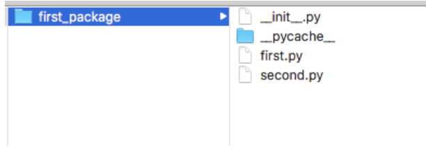
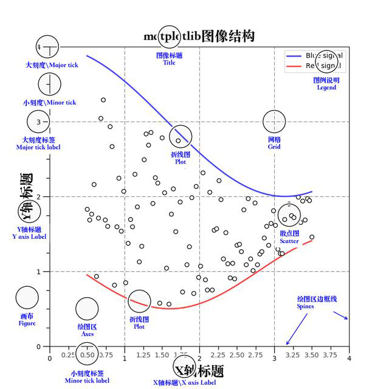
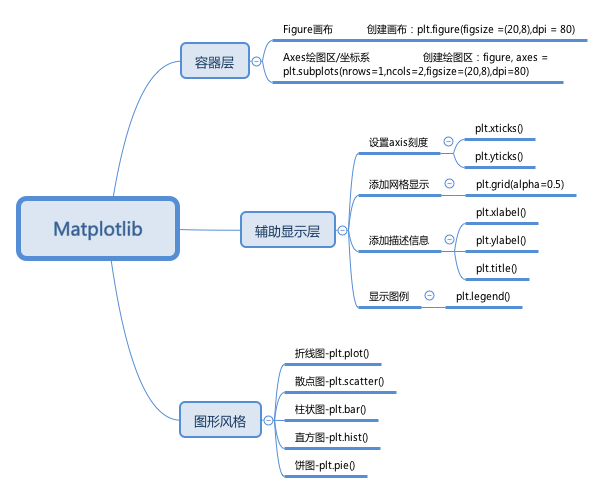
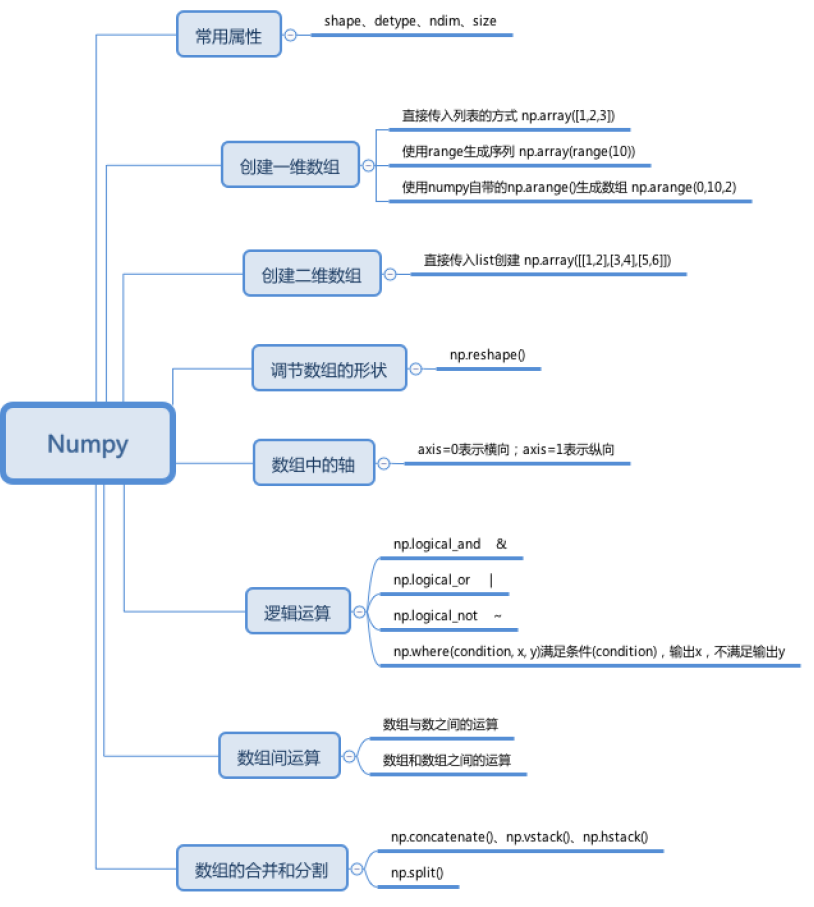
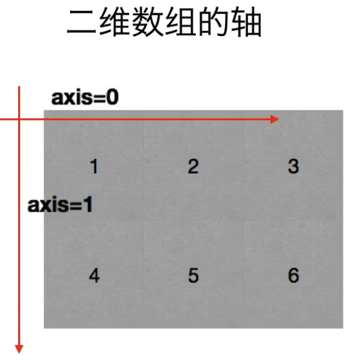
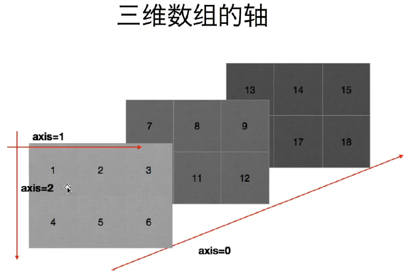

<!--
Created: Wed Sep 18 2019 18:50:22 GMT+0800 (中国标准时间)
Modified: Wed Sep 18 2019 18:55:31 GMT+0800 (中国标准时间)
-->

/**
* @module python3_notebook
* @Version :

* @Author: Dillon
* @Contact: aa269440877@outlook.com
* @WebSite    :   https://github.com/ld269440877/
* @description: [new_global_snippets.code-snippets---VS Code 配置与插件推荐 2019 年版 - 掘金](https://juejin.im/post/5c73dcd05188256fd62d4d27)

[Code Chunk](https://www.bookstack.cn/read/mpe/zh-cn-code-chunk.md)
[code-snippets](File-Preferences-User Snippets-markdown_global_snappets.code-snippets)

* @since: 2019-09-18 10:57:05

**/

# Basics of python

<font size="16" color="orange">文档规则：1. 定义 2. 案例 3. 注释 4. 总结 5. 参考链接</font>
==Content [^1]==

[^1]: [Code Chunk](https://www.bookstack.cn/read/mpe/zh-cn-code-chunk.md)

# 面向过程编程

```python {cmd = true matplotlib=true code_block=true class= 'line-numbers'  id='utf-8' continue:true output='markdown' } #hide  代码隐藏
import io
import sys
#改变标准输出的默认编码
sys.stdout=io. TextIOWrapper(sys.stdout.buffer, encoding='utf8')
```

### 注释

单⾏注释
:   以 # 开始

```python
# 定义字符串变量name
name = "李四"
```

多⾏注释
:   可以使⽤三个双引号或者三个单引号""" """ ''' '''

``` python
'''
我是多⾏注释 Multi-line comment
我是多⾏注释
我是多⾏注释
'''
```

### 变量的定义

> There are only two hard things in Computer Science: cache invalidation and naming things.
-- Phil Karlton [ColorLf](https://unbug.github.io/codelf/)

变量[^2]
:   通俗理解就是存储程序数据的容器。

变量定义的格式
:   变量名 = 数据 (变量名尽量有含义，⽅便理解 )

1. 案例 & 注释

```python {cmd = true matplotlib=true code_block=true class= ' line-numbers'  continue='utf-8' output='markdown'} ##hide  代码隐藏
# 定义了⼀个变量名字叫做score，存储的数据是100
score = 100
print(score)

# 提示： 在python⾥面不需要指定数据的类型，会根据数据⾃动推导出数据类型
# 通过type查看变量的类型
score_type = type(score)
print(score_type)
```

总结： 常⽤的数据类型 int, str, float, bool, list, tuple, dict, set

This is [an example][id] reference-style link.

Then, anywhere in the document, you define  [an example][id] your link label on a line by itself like this:

[id]: http://example.com/  "Optional Title Here"


[^2]:[数据类型和变量 - 廖雪峰的官方网站](https://www.liaoxuefeng.com/wiki/1016959663602400/1017063826246112)

### 变量的命名规则

- Definition

变量名
:   是由字⺟、数字、下划线组成,注意是只有这三种，但是不能以数字开头。

驼峰命名法
:   ⼩驼峰和大驼峰
⼩驼峰: 第⼀个单词⾸首字⺟要⼩写，其它单词⾸首字⺟都大写
大驼峰:每个单词⾸首字⺟都大写

下划线命名
:   单词都使⽤⼩写字⺟，单词之间使⽤下划线进⾏分割, ⽐如: my_name

- Demonstration

```python {cmd = true matplotlib=true code_block=true class= ' line-numbers'  continue='utf-8' output='markdown'} ##hide  代码隐藏
my_name = '李四' # 下划线命名法 -> 推荐使⽤
myName = '王五' # ⼩驼峰
MyName = '赵六' # 大驼峰
```

- Description
- Conclusion
- Reference

### 关键字

- Definition

关键字
:   在python⾥⾯具有特殊功能的标识符（理解成变量名、函数名）， 关键字不能作为变量名使
用。

- Demonstration

```python {cmd = true matplotlib=true code_block=true class= ' line-numbers'  continue='utf-8' output='markdown'} ###hide  代码隐藏
#查看python内置关键字
import keyword
print(keyword.kwlist)
```

- Description
- Conclusion
- Reference

### 常⽤的数据类型转换

| 函数                    | 说明                                               |
| ----------------------- | -------------------------------------------------- |
| int(x [, base ])        | 将x转换为⼀个整数                                   |
| float(x )               | 将x转换为⼀个浮点数                                 |
| complex(real [, imag ]) | 创建⼀个复数，real为实部，imag为虚部                |
| str(x)                 | 将对象 x 转换为字符串                              |
| repr(x)                | 将对象 x 转换为表达式字符串                        |
| ==eval(str)==          | ⽤来计算在字符串中的有效Python表达式, 并返回⼀个对象 |
| tuple(s)               | 将序列 s 转换为⼀个元组                             |
| list(s )                | 将序列 s 转换为⼀个列表                             |
| ==chr(x )==             | 将⼀个整数转换为⼀个Unicode字符                    |
| ord(x )                 | 将⼀个字符转换为它的ASCII整数值                     |
| hex(x )                 | 将⼀个整数转换为⼀个⼗六进制字符串                    |
| oct(x )                 | 将⼀个整数转换为⼀个⼋进制字符串                      |
| bin(x )                 | 将⼀个整数转换为⼀个⼆进制字符串                      |

```python {cmd = true matplotlib=true code_block=true class= ' line-numbers'  continue='utf-8' output='markdown'} ##hide  代码隐藏
# If x is not a number or if base is given, then x must be a string, bytes, or bytearray instance representing an integer literal in the given base.
print(int('0b100', base=0))
print(int('2',base=10))
print('”1+2“=',eval('1+2'))
```

### 输⼊和输出

[(To print)](###print)

```python {cmd = true matplotlib=true code_block=true class= ' line-numbers'  continue='utf-8' output='markdown'} ##hide  代码隐藏
name =  input("提示符")
print("输出")
```

### 格式化输出

a. \%

```python {cmd = true matplotlib=true code_block=true class= ' line-numbers'  continue='utf-8' output='markdown'} ##hide  代码隐藏

score = 100
print("python考试分数:%d" % score)
```

b. format详解

- 通过位置

```python {cmd = true matplotlib=true code_block=true class= ' line-numbers'  continue='utf-8'}}

'a1 = {} a2= {}  a3= {}'.format('first','second','third')  #{}不带参数
'a1 = first a2= second  a3= third'

'a1 = {1} a2= {0}  a3= {2}'.format('first','second','third') #{}带位置参数的
'a1 = second a2= first  a3= third'

```

> 注意如果{}要带参数，可以将format看成一个函数输入的值是函数的参数，这些输入的值可以看成一个元组，{0} == tuple[0] 同样他们也不能越界

- 通过关键字参数

```python
print('your name is {name} , age is {age}'.format(name='jack',age=87))
'your name is jack , age is 87'
print('your name is {name} , age is {age}'.format(age=87,name='jack') )#同样和位置无关
'your name is jack , age is 87'
```

- 通过对象属性

```python {cmd = true matplotlib=true code_block=true class= ' line-numbers'  continue='utf-8' output='markdown'} ##hide  代码隐藏

class Person:
   # __init__初始化方法（python内部提供的方法，不可以修改名字）
    def __init__(self,name,age):
    #         默认属性
        self.name = name
        self.age = age
#         print('__init__')

p = Person('Tom',18)

print('name = {p.name} age = {p.age}'.format(p=p))
'name = Tom age = 18'

```

- 通过下标

```python {cmd = true matplotlib=true code_block=true class= ' line-numbers'  continue='utf-8' output='markdown'} ##hide  代码隐藏
s1 = [1,'23','tom']
s2 = ['s2.1','s2.2','s2.3']
'{0[1]}  {0[2]} {1[2]} {1[0]}'.format(s1,s2)

'23  tom s2.3 s2.1'
```

- 格式化输出(重点)

格式限定符
:    语法是{}中带:号
 {:对齐方式  填充}

 填充与对齐
 :  填充常跟对齐一起使用
 ^、<、>分别是居中、左对齐、右对齐，后面带宽度
 :号后面带填充的字符，只能是一个字符，不指定的话默认是用空格填充

5.1 对齐与填充
```python {cmd = true matplotlib=true code_block=true class= ' line-numbers'  continue='utf-8' output='markdown'} ##hide  代码隐藏
print('输出右对齐定长为10位  [{:$>10}]'.format('12') )#修改填充，填充只能是一个ASCII字符
'输出右对齐定长为10位  [$$$$$$$$12]'
print('输出居中对齐定长为10位，填充x  [{:x^10}]'.format('12') )#修改填充，填充只能是一个ASCII字符
'输出居中对齐定长为10位，填充x  [xxxx12xxxx]'
```
5.2 浮点小数输出

```python {cmd = true matplotlib=true code_block=true class= ' line-numbers'  continue='utf-8' output='markdown'} ##hide  代码隐藏
print('{:.2f}'.format(1233442.23453) )#通常都是配合 f 使用,其中.2表示长度为2的精度，f表示float类型
'1233442.23'
print('{:,}'.format(9987733498273.0432) )#使用逗号金额分割符
'9,987,733,498,273.043'

```
5.3 进制及其他显示
|  A   | B                        |
| :--: | :----------------------- |
|  b   | 二进制                   |
|  d   | 十进制                   |
|  o   | 八进制                   |
|  x   | 十六进制                 |
|  !s  | 将对象格式化转换成字符串 |
|  !a  | 将对象格式化转换成ASCII  |
|  !r  | 将对象格式化转换成repr   |
```python {cmd = true matplotlib=true code_block=true class= ' line-numbers'  continue='utf-8' output='markdown'} ##hide  代码隐藏
print('{!s}'.format(10) )#将对象格式化转换成字符串
'10'
print('{!a}'.format('1000') )#将对象格式化转换成ASCII
"'1000'"
print('{!r}'.format('1000') )#将对象格式化转换成repr
"'1000'"
```
### if语句

1. Definition
计算机之所以能做很多⾃动化的任务，因为它可以⾃⼰己做条件判断。

2. Demonstration
```python {cmd = true matplotlib=true code_block=true class= ' line-numbers'  continue='utf-8' output='markdown'} ##hide  代码隐藏

age = 20

if age >= 6:
    print('teenager')
elif age >= 18:
    print('adult')
else:
    print('kid')

```


3. Description


4. Conclusion


5. Reference

### 运算符

1. 算数运算符

| 运算符 |  描述  |                            实例                             |
| :----: | :----: | :---------------------------------------------------------: |
|   +    |   加   |               两个对象相加 a + b 输出结果 30                |
|   \-   |   减   |       得到负数或是⼀个数减去另⼀个数 a - b 输出结果 -10       |
|   \*   |   乘   | 两个数相乘或是返回⼀个被重复若⼲次的字符串 a * b 输出结果 200 |
|   /    |   除   |                      b / a 输出结果 2                       |
|   //   | 取整除 |  返回商的整数部分 9//2 输出结果 4 , 9.0//2.0 输出结果 4.0   |
|   \%   |  取余  |               返回除法的余数 b % a 输出结果 0               |
|  \*\*  |  指数  |      a**b 为10的20次⽅， 输出结果 100000000000000000000      |

混合运算时，优先级顺序为： ** ⾼于 * / % // ⾼于 + - ，为了避免歧义，建议使⽤ () 来
处理运算符优先级。并且，不同类型的数字在进行混合运算时，整数将会转换成浮点数进行运算。
2. 赋值运算符


| 运算符 |    描述    |                                 实例                                 |
| :----: | :--------: | :------------------------------------------------------------------: |
|   =    | 赋值运算符 | 把 = 号右边的结果赋给左边的变量，如 num = 1 + 2 \* 3，结果num的值为7 |

```python
# 单个变量赋值
num = 10
# 多个变量赋值
num1, num2, f1, str1 = 100, 200, 3.14, "hello"
```
### 复合赋值运算符


| 运算符 |       描述       |           实例            |
| :----: | :--------------: | :-----------------------: |
|   +=   |  加法赋值运算符  |  c += a 等效于 c = c + a  |
|   -=   |  减法赋值运算符  |  c -= a 等效于 c = c - a  |
|  $*=$  |  乘法赋值运算符  | c *= a 等效于 c = $c * a$ |
|   /=   |  除法赋值运算符  |  c /= a 等效于 c = c / a  |
|   %=   |  取模赋值运算符  |  c %= a 等效于 c = c % a  |
| $**$=  |   幂赋值运算符   | c** = a 等效于 c = $c^a$  |
|  //=   | 取整除赋值运算符 | c //= a 等效于 c = c // a |

### 循环

1. while 循环
```python {cmd = true matplotlib=true code_block=true class= ' line-numbers'  continue='utf-8' output='markdown'} ##hide  代码隐藏
i = 0
while i <3:
    print('hello world')
    i=i + 1
```
```python {cmd = true matplotlib=true code_block=true class= ' line-numbers'  continue='utf-8' output='markdown'} ##hide  代码隐藏
# 9X9乘法表
'''
1 * 1 = 1
1 * 2 = 2 2 * 2 =4
1 * 3 = 3 2 * 3 = 6 3 * 3 = 9
'''

i = 1
while i<=9: # 行数
    j = 1
    while j<=i: # 列数
        print('%d * %d = %d' % (j,i,j*i),end='')
        j += 1
    print('')

    i += 1
```

2. for循环
```python {cmd = true matplotlib=true code_block=true class= ' line-numbers'  continue='utf-8' output='markdown'} ##hide  代码隐藏
names = ['Michael', 'Bob', 'Tracy']
for name in names:
    print(name)
```

```python {cmd = true matplotlib=true code_block=true class= ' line-numbers'  continue='utf-8' output='markdown'} ##hide  代码隐藏

for i in range(2):
    print(i)

#效果等同于 while 循环的：

i = 0
while i < 2:
    print(i)
    i += 1
```
3. break
```python {cmd = true matplotlib=true code_block=true class= ' line-numbers'  continue='utf-8' output='markdown'} ##hide  代码隐藏
n = 1
while n <= 100:
    if n > 3: # 当n = 11时，条件满⾜足，执⾏break语句
        break #  break语句会结束当前循环
    print(n)
    n = n + 1
print('END')
```

## Container

[(Back to 面向过程编程)](#面向过程编程)

### 字符串（str）

1. Definition

字符串
:   单引号,双引号,包括三引号包围的字符组

```
name = 'abcdef'
print(name[1:-1]) # 取 下标为1开始 到 最后第2个 之间的字符
```
2. Demonstration
```python {cmd = true matplotlib=true code_block=true class= ' line-numbers'  continue='utf-8' output='markdown'} ##hide  代码隐藏
str = 'hello'#定义字符串变量
str = "helo"#定义字符串变量
str = """hello
hello"""#定义多⾏字符串变量
```
#### 下标和切⽚片

- 下标索引 `name = 'zhangsan' print(name[2])`
- 切⽚

切⽚
:   指对操作的对象截取其中⼀部分的操作。字符串、列表、元组都⽀支持切⽚片操作。
- 切⽚的语法: [起始:结束:步长]

#### 字符串的常⻅操作
```python {cmd = true matplotlib=true code_block=true class= ' line-numbers'  continue='utf-8' output='markdown'} ##hide  代码隐藏
print([e for e in dir(str) if not e.startswith('_')])
```
-  find 检测 str 是否包含在  mystr 中，如果是返回开始的索引值，否则返回-1
`mystr.find(str, start=0, end=len(mystr))`
```python {cmd = true matplotlib=true code_block=true class= ' line-numbers'  continue='utf-8' output='markdown'} ##hide  代码隐藏

mystr = 'hello world kkb'
mystr.find("kkb")
# 运⾏结果为:12
mystr = 'hello world kkb'
mystr.find("kkb",0,10)#在mstr字符串0-10下标范围查询
# 运⾏结果:-1
```

- index 跟find() 方法⼀样，只不过如果str 不在 mystr中会报⼀个异常.
`mystr.index(str, start=0, end=len(mystr))`
```python {cmd = true matplotlib=true code_block=true class= ' line-numbers'  continue='utf-8' output='none'} ##hide  代码隐藏
mystr = 'hello world kkb'
mystr.index("ab")
# 运⾏结果:控制台会直接报错(Vale Error:substring not found)

```
- count 返回 str 在start和end之间 在 mystr⾥面出现的次数
`mystr.count(str, start=0, end=len(mystr))`
```python {cmd = true matplotlib=true code_block=true class= ' line-numbers'  continue='utf-8' output='markdown'} ##hide  代码隐藏
mystr = 'hello world kkb and kkb'
mystr.count('kkb')
# 运⾏结果:2
```
- replace 把 mystr 中的 str1 替换成 str2 ,如果 count 指定，则替换不超过 count 次.
`mystr.replace(str1, str2, mystr.count(str1))`

- split 以 str 为分隔符切⽚mystr ，如果 maxsplit 有指定值，则仅分隔 maxsplit 个⼦字符串
`mystr.split(str=" ", 2)`
- capitalize 把字符串的第⼀个字符大写
`mystr.capitalize()`
- title
```python {cmd = true matplotlib=true code_block=true class= ' line-numbers'  continue='utf-8' output='markdown'} ##hide  代码隐藏
a = "hello kkb"
a.title()
# 运⾏结果
'Hello Kkb'
```
- startswith 检查字符串是否是以 hello 开头, 是则返回 True ，否则返回 False
`mystr.startswith(hello)`
- endswith 检查字符串是否以obj 结束，如果是返回True ,否则返回 False .
`mystr.endswith(obj)`
- lower 转换 mystr 中所有大写字符为⼩写
`mystr.lower()`
- upper 转换 mystr 中的⼩写字⺟为大写
`mystr.upper()`
- ljust 返回⼀个原字符串左对齐,并使用空格填充⾄长度 width 的新字符串
`mystr.ljust(width)`
- rjust 返回⼀个原字符串右对齐,并使用空格填充⾄长度 width 的新字符串
`mystr.rjust(width)`
- center 返回⼀个原字符串居中,并使⽤空格填充⾄长度 width 的新字符串
`mystr.center(width)`


- lstrip 删除 mystr 左边的空⽩字符
`mystr.lstrip()`

- rstrip 删除 mystr 字符串末尾的空⽩白字符
`mystr.rstrip()`

- strip 删除mystr 字符串两端的空⽩白字符

```python {cmd = true matplotlib=true code_block=true class= ' line-numbers'  continue='utf-8' output='markdown'} ##hide  代码隐藏
a = "\n\t kkb \t\n"
a.strip()
# 运⾏结果:
'kkb'

```
- rfind 类似于 find() 函数，不过是从右边开始查找.
`mystr.rfind(str, start=0,end=len(mystr) )`
- rindex 类似于 index() ，不过是从右边开始.
`mystr.rindex( str, start=0,end=len(mystr))`
- partition 把mystr 以str 分割成三部分, str 前， str 和str 后
`mystr.partition(str)`
```python {cmd = true matplotlib=true code_block=true class= ' line-numbers'  continue='utf-8' output='markdown'} ##hide  代码隐藏
str = '123-abc-ABC-@#$'
print(str.partition('-'))

```
- rpartition 类似于 partition()函数,不过是从右边开始.
`mystr.rpartition(str)`
- splitlines 按照⾏分隔，返回⼀个包含各⾏作为元素的列表
`mystr.splitlines()`
- join mystr 中每个元素后⾯插⼊str ,构造出一个新的字符串
`mystr.join(str)`
```python {cmd = true matplotlib=true code_block=true class= ' line-numbers'  continue='utf-8' output='markdown'} ##hide  代码隐藏
'''
Signature: str.join(iterable, /)
Docstring:
Concatenate any number of strings.

The string whose method is called is inserted in between each given string.
The result is returned as a new string.

Example: '.'.join(['ab', 'pq', 'rs']) -> 'ab.pq.rs'
Type:      builtin_function_or_method
'''
print('.'.join(['ab', 'pq', 'rs']) )
#  -> 'ab.pq.rs'
```
### 列表（list）

列表
:   Python内置的一种数据类型是列表： list 。list 是一种有序的集合，可以随时添加和删除其中的元素，写在方括号之间、⽤逗号分隔开的数值列表。列表内的项目不必全是相同的类型。
`list1 = ['spam', 'eggs', 100, 1234]`

```python {cmd = true matplotlib=true code_block=true class= ' line-numbers'  continue='utf-8' output='markdown'} ##hide  代码隐藏

# 列表生成式:快速的生成一个我想要的列表
# my_list = []
# for i in range(1,6):
#     my_list.append(i)

# my_list = [value for value in range(1,6)]
# print(my_list)

# ['a','b']
# ['akkb','bkkb']
my_list = [value+'kkb' for value in ['a','b']]
print(my_list)

```

#### 列表的常见操作

- 列表的长度
```python {cmd = true matplotlib=true code_block=true class= ' line-numbers'  continue='utf-8' output='markdown'} ##hide  代码隐藏
#⽤len()函数可以获得list元素的个数：
namesList = ['xiaoWang','xiaoZhang','xiaoHua']
len(namesList)
```

- 列表的访问 用索引来访问list 中每一个位置的元素，记得索引是从0开始的：
`namesList = ['xiaoWang','xiaoZhang','xiaoHua']
print(namesList[0])`
> 注意：当索引超出了范围时，Python会报⼀个IndexError 错误，所以，要确保索引不要越界，记得最后⼀个元素的索引是len(classmates) - 1 。
如果要取最后⼀个元素，除了计算索引位置外，还可以⽤-1做索引，直接获取最后一个元素：
`namesList = ['xiaoWang','xiaoZhang','xiaoHua']
print(namesList[-1])
结果：
xiaoHua`

- 列表的切⽚

切片
:   根据下标的范围获取⼀部分数据，比如: 列表，字符串可以使⽤切片。
> 切⽚片的使用格式
数据[起始下标:结束下标:步⻓长]
提示： 起始下标默认0， 结束下标是不包含， 步⻓长默认是1

- 添加元素( append , extend , insert )

通过append 可以向列表添加元素
```python {cmd = true matplotlib=true code_block=true class= ' line-numbers'  continue='utf-8' output='markdown'} ##hide  代码隐藏
#定义变量A，默认有3个元素
A = ['xiaoWang','xiaoZhang','xiaoHua']

print("-----添加之前，列表A的数据-----")
for tempName in A:
    print(tempName)

#提示、并添加元素
# temp = input('请输⼊要添加的学⽣姓名:')
temp = 'Dillon'
A.append(temp)

print("-----添加之后，列表A的数据-----")
for tempName in A:
    print(tempName)
```
通过extend 可以将另⼀个集合中的元素逐⼀添加到列表中
```python {cmd = true matplotlib=true code_block=true class= ' line-numbers'  continue='utf-8' output='markdown'} ##hide  代码隐藏
a = [1, 2]
b = [3, 4]
print(a.append(b))  # a.append(b)没有返回值   None
print(a)
# [1, 2, [3, 4]]

a = [1, 2]
b = [3, 4]
print(a.extend(b))
print(a)
# [1, 2, 3, 4]

# insert(index, object)` 在指定位置`index`前插⼊元素`object
a = [0, 1, 2]
a.insert(1, 3)
print(a)
# [0, 3, 1, 2]
```

- 修改元素
修改元素的时候，要通过下标来确定要修改的是哪个元素，然后才能进⾏修改
```python {cmd = true matplotlib=true code_block=true class= ' line-numbers'  continue='utf-8' output='markdown'} ##hide  代码隐藏

#定义变量A，默认有3个元素
A = ['xiaoWang','xiaoZhang','xiaoHua']

print("-----修改之前，列表A的数据-----")

for tempName in A:
    print(tempName)

#修改元素
A[1] = 'xiaoLu'

print("-----修改之后，列表A的数据-----")

for tempName in A:
    print(tempName)
```
- 查找元素

所谓的查找，就是看看指定的元素是否存在。
> python中查找的常用方法为：
> in （存在）,如果存在那么结果为true ，否则为false
> not in （不存在），如果不存在那么结果为true ，否则false
> ```python {cmd = true matplotlib=true code_block=true class= ' line-numbers'  continue='utf-8' output='markdown'} ##hide  代码隐藏
> #待查找的列表
> nameList = ['xiaoWang','xiaoZhang','xiaoHua']
> #获取⽤户要查找的名字
> ```
- findName = input('请输⼊要查找的姓名:')

```python
findName = 'xiaoWang'
#查找是否存在
if findName in nameList:
    print('在字典中找到了相同的名字')
else:
    print('没有找到')
```


```python
- index 和count 与字符串中的用法相同
​```python {cmd = true matplotlib=true code_block=true class= ' line-numbers'  continue='utf-8' output='markdown'} ##hide  代码隐藏
a = ['a', 'b', 'c', 'a', 'b']
# print(a.index('a', 1, 3)) # 注意是左闭右开区间

print(a.index('a', 1, 4))

print(a.count('b'))
```

- 删除元素
列表元素的常⽤删除方法有：
    - del：根据下标进行删除
    - pop：删除最后一个元素
    - remove：根据元素的值进行删除
a. del
```python {cmd = true matplotlib=true code_block=true class= ' line-numbers'  continue='utf-8' output='markdown'} ##hide  代码隐藏
list1 = ['a','b','c','d','e','f']
print('------删除之前------')
for tempName in list1:
    print(tempName,end='')
# print()
del list1[2]
print('------删除之后------')
for tempName in list1:
    print(tempName,end='')
```
b. pop
```python {cmd = true matplotlib=true code_block=true class= ' line-numbers'  continue='utf-8' output='markdown'} ##hide  代码隐藏
list2 = ['a','b','c','d','e','f']
print('------删除之前------')
for tempName in list2:
    print(tempName,end='')
list2.pop()
print('------删除之后------')
for tempName in list2:
    print(tempName,end='')
```

- 排序
sort ⽅法是将list 按特定顺序重新排列，默认为由⼩到⼤，参数reverse=True 可改为倒序，由⼤到⼩。
```python {cmd = true matplotlib=true code_block=true class= ' line-numbers'  continue='utf-8' output='markdown'} ##hide  代码隐藏
a = [1, 4, 2, 3]
print(a)
a.reverse()
print(a)
a.sort()
print(a)
a.sort(reverse=True)
print(a)
```
3. 列表的遍历
a. 使⽤for循环
```python {cmd = true matplotlib=true code_block=true class= ' line-numbers'  continue='utf-8' output='markdown'} ##hide  代码隐藏
namesList = ['xiaoWang','xiaoZhang','xiaoHua']
for name in namesList:
    print(name)
```
b. 使用while循环
```python {cmd = true matplotlib=true code_block=true class= ' line-numbers'  continue='utf-8' output='markdown'} ##hide  代码隐藏
namesList = ['xiaoWang','xiaoZhang','xiaoHua']
length = len(namesList)
i = 0
while i<length:
    print(namesList[i])
    i+=1
```

### 元组（tuple）

另⼀种有序列表叫元组： tuple 。tuple 和list 非常类似，但是tuple 一旦初始化就不能修改
`classmates = ('Michael', 'Bob', 'Tracy')`
> classmates 这个tuple 不能变了，它也没有append() ， insert( )这样的⽅法。其他获取元素的⽅法和list是一样的，你可以正常地使用classmates[0] ， classmates[-1] ，但不能赋值成另外的元素。
1. Definition
- 如果要定义⼀个空的tuple ，可以写成() ：
`t = ()`
- 定义⼀个只有1个元素的tuple,只有1个元素的tuple定义时必须加⼀个逗号，来消除歧义：
`t = (1,)`
> 最后来看⼀个“可变的”tuple：
> ```python {cmd = true matplotlib=true code_block=true class= ' line-numbers'  continue='utf-8' output='markdown'} ##hide  代码隐藏
> t = ('a', 'b', ['A', 'B'])
> t[2][0] = 'X'
> t[2][1] = 'Y'
> print(t)
> '('a', 'b', ['X', 'Y'])'
> ```
- 元组中的元素应该指向不可变的类型class-字符串,常量-,而不是可变类型列表等

### 字典（dict）

1. Definition
字典是另⼀种可变容器模型，且可存储任意类型对象。
字典的每个键值(key=>value)对⽤冒号(:)分割，每个对之间⽤逗号(,)分割，整个字典包括在花括号{}中
2. Demonstration
`d = {'Michael': 95, 'Bob': 75, 'Tracy': 85} d['Michael']`


3. Description
由于⼀个key 只能对应⼀个value ，所以，多次对⼀个key 放⼊value ，后面的值会把前面的值冲
掉：

d['Jack'] = 90
d['Jack']
90
d['Jack'] = 88
d['Jack']
88

```
如果key不存在，dict就会报错：
4. Conclusion


5. Reference


#### 字典的常⻅操作
- 修改元素
字典的每个元素中的数据是可以修改的，只要通过key 找到，即可修改

​```python {cmd = true matplotlib=true code_block=true class= ' line-numbers'  continue='utf-8' output='markdown'} ##hide  代码隐藏
info = {'name':'kkb', 'id':100, 'sex':'f', 'address':'中国北北'}
# new_id = input('请输⼊新的学号:')
new_id = '102'
info['id'] = int(new_id)
print('修改之后的id为: %d' % info['id'])
```
- 添加元素
访问不存在的元素: 报错
如果在使⽤ 变量名['键'] = 数据 时，这个“键”在字典中，不存在，那么就会新增这个元素。
```python {cmd = true matplotlib=true code_block=true class= ' line-numbers'  continue='utf-8' output='markdown'} ##hide  代码隐藏
info = {'name':'kkb', 'sex':'f', 'address':'中国北北京'}

# newId = input('请输⼊新的学号：')
newId = 102
info['id'] = newId
print('添加之后的id为:%d' % info['id'])

```
- 删除元素
对字典进行删除操作，有一下⼏种：
- del
- clear()
del 删除指定的元素
```python {cmd = true matplotlib=true code_block=true class= ' line-numbers'  continue='utf-8' output='markdown'} ##hide  代码隐藏
info = {'name':'kkb', 'sex':'f', 'address':'中国北北京'}
print('删除前,%s' % info['name'])
del info['name']
print('删除后,%s' % info)


```
del 删除整个字典

```python {cmd = true matplotlib=true code_block=true class= ' line-numbers'  continue='utf-8' output='markdown'} ##hide  代码隐藏
info = {'name':'monitor', 'sex':'f', 'address':'China'}
print('删除前,%s' % info)
del info
# print('删除后,%s' % info)
```
clear清空整个字典
```python {cmd = true matplotlib=true code_block=true class= ' line-numbers'  continue='utf-8' output='markdown'} ##hide  代码隐藏
info = {'name':'monitor', 'sex':'f', 'address':'China'}
print('清空前,%s' % info)
info.clear()
print('清空后,%s' % info)
```
- len()
测量字典中，键值对的个数
```python {cmd = true matplotlib=true code_block=true class= ' line-numbers'  continue='utf-8' output='markdown'} ##hide  代码隐藏
d1 = {'name':'abc','age':'18', 'class':'cnh'}
print(len(d1))
# 结果：
# 3
```
- keys
返回⼀个包含字典所有key的列表
```python {cmd = true matplotlib=true code_block=true class= ' line-numbers'  continue='utf-8' output='markdown'} ##hide  代码隐藏
d1 = {'name':'abc','age':'18', 'class':'cnh'}
print(list(d1.keys()))
# 结果：
# ['name', 'age', 'class']
```
- values
返回⼀个包含字典所有value的列表
```python {cmd = true matplotlib=true code_block=true class= ' line-numbers'  continue='utf-8' output='markdown'} ##hide  代码隐藏
d1 = {'name':'abc','age':'18', 'class':'cnh'}
print(list(d1.values()))
# 结果：
# ['abc', '18', 'cnh']
```
- items
返回⼀个包含所有（键，值）元祖的列表
```python {cmd = true matplotlib=true code_block=true class= ' line-numbers'  continue='utf-8' output='markdown'} ##hide  代码隐藏
d1 = {'name':'abc','age':'18', 'class':'cnh'}
print(list(d1.items()))
# 结果：
# [('name', 'abc'), ('age', '18'), ('class', 'cnh')]
```
- 集合（set）
1. Definition
集合（set）是⼀个⽆序的不重复元素序列。
可以使⽤大括号 { } 或者 set() 函数创建集合，注意：创建一个空集合必须用 set() ⽽不是 { }，因为 { }是⽤来创建⼀个空字典。
2. Demonstration
```python {cmd = true matplotlib=true code_block=true class= ' line-numbers'  continue='utf-8' output='markdown'} ##hide  代码隐藏
my_set = {1, 4, 'abc', 'hello'}
# 不支持下标赋值和取值
# my_set[0] = 3
# value = my_set[0]
# print(value)
```
```python {cmd = true matplotlib=true code_block=true class= ' line-numbers'  continue='utf-8' output='markdown'} ##hide  代码隐藏
#通过遍历获取数据
my_set = {1, 5, 7}
for value in my_set:
    print(value)
for index,value in enumerate(my_set):
    print(index,value)

```
```python {cmd = true matplotlib=true code_block=true class= ' line-numbers'  continue='utf-8' output='markdown'} ##hide  代码隐藏
# 定义空的集合的时候不能直接使⽤{}
my_set = set()
my_set.add(1)
my_set.add(1)
print(my_set, type(my_set))
# 集合可以对容器类型数据去重
my_list = [1, 1, 3, 5, 3]
# 把列表转成集合，会把数据去重
my_set = set(my_list)
print(my_set)
# 列表，元组， 集合 三者之间可以相互转换
my_tuple = (5, 3)
print(my_tuple, type(my_tuple))
```
3. Description


4. Conclusion


5. Reference

## 函数

[(Back to 面向过程编程)](#面向过程编程)

1. Definition

函数
:   需要某块代码多次，但是为了提高编写的效率以及代码的重⽤，所以把具有独⽴功能的代码块组织为⼀个⼩模块

## Python内置函数

```python
import sys
sys.getdefaultencoding() # 'utf-8'
```


### print

```python
#Docstring:
print(value, ..., sep=' ', end='\n', file=sys.stdout, flush=False)
'''
Prints the values to a stream, or to sys.stdout by default.
Optional keyword arguments:
file:  a file-like object (stream); defaults to the current sys.stdout.
sep:   string inserted between values, default a space.
end:   string appended after the last value, default a newline.
flush: whether to forcibly flush the stream.
Type:      builtin_function_or_method
'''
```

### int

```python
Init signature: int(self, /, *args, **kwargs)
Docstring:     
int([x]) -> integer
int(x, base=10) -> integer

Convert a number or string to an integer, or return 0 if no arguments
are given. 
# int('123') --> 123
# int(123) --> 123
# int() --> 0

If x is a number, return x.__int__().  For floating point
numbers, this truncates(截断) towards zero.# 向0截断
# int(3.9) --> 3  # 向0截断
# int(-3.9) --> -3 # 向0截断

If x is not a number or if base is given, then x must be a string,
bytes, or bytearray instance representing(代表) an integer literal(整数) in the
given base. 
# int(string, bytes, or bytearray, base=0 or 2-36) -> integer
# int('11',base=2)-->3 # 如果关键字参数base被指定,x必须是string(字符串),字节(bytes),字节组(bytesarray)的实例
# int(b'11',base=10)-->11
# int(b'11',base=2)-->3
The literal can be preceded(先于) by '+' or '-' and be surrounded
by whitespace. 
# int(b'    +11    ',base=2)-->3
# int(b' -11',base=2)-->-3

The base defaults to 10.  Valid bases are 0 and 2-36.
#int(x, base=10) -> integer.int(x, base=0 or 2-36) -> integer
Base 0 means 'to interpret the base from the string' as an integer literal.
#int('123',base=0)-->123

>>> int('0b100', base=0)
4
Type:           type
```

### str

```python
Init signature: str(self, /, *args, **kwargs)
Docstring:     
str(object='') -> str
# str(123)-->'123'
str(bytes_or_buffer[, encoding[, errors]]) -> str
# type(str(b'1.2',encoding='utf-8',errors='strict')) -->str
# str(b'1.2',encoding='utf-8',errors='strict')-->'1.2'
# str(b'1.2')-->"b'1.2'"
# repr(b'1.2')-->"b'1.2'"

Create a new string object from the given object. 
# 根据给定的(字符串或其他类型)对象创建新的字符串对象
If encoding or errors is specified, then the object must expose a data buffer
that will be decoded using the given encoding and error handler.
Otherwise, returns the result of object.__str__() (if defined) or repr(object).
encoding defaults to sys.getdefaultencoding().
errors defaults to 'strict'.
Type:           type

```

### repr

```python
Signature: repr(obj, /)
Docstring:
Return the canonical string representation of the object.
# 返回对象的规范字符串表现形式
# type(repr(123))-->str
# repr(123)-->'123'

For many object types, including most builtins, eval(repr(obj)) == obj.
# eval(repr(123)) == 123 -->True
# eval(repr(123)) == 123 -->True
Type:      builtin_function_or_method
```

### eval

[python3中eval函数用法简介 - 陌上行走的博客 - CSDN博客](https://blog.csdn.net/qq_29883591/article/details/53443062)

```python
Signature: eval(source, globals=None, locals=None, /)
Docstring:
Evaluate the given source in the context of globals and locals.
'eval函数用法'
1. 在前两个参数省略的情况下，eval在当前的作用域执行：
# 对于eval，它会将第一个expression字符串参数的引号去掉，然后对引号中的式子进行解析和计算。
a=10;
print(eval("a+1"))-->11

2. 在globals指定的情况下：
# eval中提供了globals参数，这时候eval的作用域就是g指定的这个字典了，也就是外面的a=10被屏蔽掉了
a=10;
g={'a':4}
print(eval("a+1",g))-->5

3. 在 locals指定的情况下 ：
# 当locals和globals起冲突时，locals是起决定作用
a=10
b=20
c=30
gb ={'a':6,'b':8}
lc ={'b':100,'c':10}
print(eval('a+b+c',gb,lc))-->116

# 使用的场合
'eval的使用,确保第一个参数expression满足表达式的要求，它是可以被解析然后计算'

s="abck"
print(eval(s))-->NameError: name 'abck' is not defined
'''
字符串s并不满足表达式的要求。
当eval剥去了"abck"的外面的引号的时候，它会对它进行解析，然后满足要求后进行计算，然后它解析到的是abcd，请注意，程序报出的错误是NameError，也就是说，
1. 当它解析到这个表达式是不可以计算，
2. 它就会查找它是不是一个变量的名字，如果是一个变量的名字，那么它会输出这个变量的内容，否则就会产生这种报错。
'''

# expression的要求
## 字符串
s='"sas"'
print(eval(s))-->sas
'''
eval首先去除单引号，eval在执行时,只会去除同种类型的引号，对于单引号和双引号它是加以区分的。
eval去除单引号后得到了“sas”，这个时候程序解析到它是一个字符串，不可以计算，就输出了它。
为什么上个例子中s="abck"会不行呢，这里面我们就可以看出区别了，一个是有引号括起来的，一个是没有的，引号括起来代表字符串，虽然不可以求值，但是是有意义的，可以进行输出，而没引号的便无法判断“身份”了，只能当做变量名进行解析，而abck并不是一个变量名，所以就报错了。
'''
## 列表
'eval去除引号后会检查到它是不可计算的，但它是一个列表，便输出了里面的内容。'
s='["a","b","c"]'
print(eval(s))-->['a', 'b', 'c']

a=10
b=20
c=30
s='[a,b,c]'
print(eval(s))-->[10, 20, 30]
'''
eval检查到列表的‘[’‘]’符号时，会对里面的元素进行解析，这里a、b、c显然不是具体的数据，便去查找它们是否是变量名，然后确认是变量名后，用它们的内容替换掉它。
'''

## 内建模块__buitins__
s='abs(10)'
print(eval(s))-->10
'''
当eval剥去s的引号后，得到abs(10)，然后它会对进行解析，它会使用globals的内建模块__builtins__进行解析，在这个内建模块中是有abs这个函数的，所以对abs(10)进行了计算。
'''

# 查看__builtins__模块中
print(dir(__builtins__))

The source may be a string representing a Python expression or a code object as returned by compile().
The globals must be a dictionary and locals can be any mapping, defaulting to the current globals and locals.
If only globals is given, locals defaults to it.
Type:      builtin_function_or_method
    
'''
Complete &boolean eval
全部布尔型求值(&B)
'''
```

### exec

[python的exec、eval详解 - mojidong blog](https://www.mojidong.com/post/2013-05-10-python-exec-eval/)
[Python之浅谈exec()函数 - - SegmentFault 思否](https://segmentfault.com/a/1190000014581721)

```python
Signature: exec(source, globals=None, locals=None, /)
Docstring:
Execute the given source in the context of globals and locals.

The source may be a string representing one or more Python statements
or a code object as returned by compile().
The globals must be a dictionary and locals can be any mapping,
defaulting to the current globals and locals.
If only globals is given, locals defaults to it.
Type:      builtin_function_or_method
```


### 函数定义和调⽤

#### 定义函数

```
def 函数名():
    代码
```
#### 调用函数

函数名() 即可完成调⽤
定义完函数后，函数是不会⾃动执⾏的，需要调⽤它才可以
`printInfo()`
#### 注意:
- 每次调⽤函数时，函数都会从头开始执行，当这个函数中的代码执完毕后，意味着调⽤结束了
- 当然了如果函数中执行到了return也会结束函数
### 函数的文档说明
```python {cmd = true matplotlib=true code_block=true class= ' line-numbers'  continue='utf-8' output='markdown'} ##hide  代码隐藏
def test(a,b):
    '''⽤来完成对2个数求和'''
    print("%d"%(a+b))
help(test)
# 还可以用test.__doc__ 直接查看文档说明
print(test.__doc__)
```
### 函数的参数
#### 位置参数
```python {cmd = true matplotlib=true code_block=true class= ' line-numbers'  continue='utf-8' output='markdown'} ##hide  代码隐藏
def power(x, n):
    '''power(x, n) 函数，可以计算任意xd的n次⽅：'''
    s = 1
    while n > 0:
        n = n - 1
        s = s * x
    return s
```
#### 默认参数

```python {cmd = true matplotlib=true code_block=true class= ' line-numbers'  continue='utf-8' output='markdown'} ##hide  代码隐藏
def power(x, n=2):
'''
power(x, n) 函数，可以计算任意xd的n次⽅：
默认参数：n=2
'''
    s = 1
    while n > 0:
        n = n - 1
        s = s * x
    return s

```
默认参数可以简化函数的调用。
设置默认参数时，有⼏点要注意：

<!-- This is some comments -->

- 必选参数在前，默认参数在后，否则Python的解释器会报错；
- 当函数有多个参数时，把变化大的参数放前面，变化小的参数放后面。变小的参数就可以作为默认参数。

##### 注意：默认参数有个最大的坑，演示如下：

先定义⼀个函数，传⼊⼀个list，添加⼀个END 再返回：
```python {cmd = true matplotlib=true code_block=true class= ' line-numbers'  continue='utf-8' output='markdown'} ##hide  代码隐藏
def add_end(L=[]):
    L.append('END')
    return L

# 当你正常调⽤时，结果似乎不错：
add_end([1, 2, 3])
# [1, 2, 3, 'END']
add_end(['x', 'y', 'z'])
# ['x', 'y', 'z', 'END']


# 当你使⽤默认参数调⽤时，一开始结果也是对的：
add_end()
# ['END']
'''
但是，默认参数再次调⽤add_end() 时，结果就不对了：
'''
add_end()
# ['END', 'END']
add_end()
# ['END', 'END', 'END']
```
很多初学者很疑惑，默认参数是[] ，但是函数似乎每次都“记住了”上次添加了'END' 后的list。
> 原因解释如下：
Python函数在定义的时候，默认参数L 的值就被计算出来了，即[] ，因为默认参数L 也是一个变量，它指向对象[] ，每次调⽤该函数，如果改变了L 的内容，则下次调⽤时，默认参数的内容就变了，不再是函数定义时的[] 了。
##### 定义默认参数要牢记一点：默认参数必须指向不变对象！

要修改上⾯的例子，我们可以用None 这个不变对象来实现：
```python {cmd = true matplotlib=true code_block=true class= ' line-numbers'  continue='utf-8' output='markdown'} ##hide  代码隐藏
def add_end(L=None):
    if L is None:
        L = []
    L.append('END')
    return L
```
> 为什么要设计str 、None 这样的不变对象呢？因为不变对象一旦创建，对象内部的数据就不能修改，这样就减少了由于修改数据导致的错误。此外，由于对象不变，多任务环境下同时读取对象不需要加锁，同时读一点问题都没有。我们在编写程序时，如果可以设计一个不变对象，那就尽量设计成不变对象。
#### 可变参数

可变参数就是传⼊的参数个数是可变的，可以是1个、2个到任意个，还可以是0个。
```python {cmd = true matplotlib=true code_block=true class= ' line-numbers'  continue='utf-8' output='markdown'} ##hide  代码隐藏
def calc(*numbers):
    sum = 0
    for n in numbers:
        sum = sum + n * n
    return sum
# >>> calc(1, 2)
# 5
# >>> calc()
# 0

>>> nums = [1, 2, 3]
'''
*nums 表示把nums 这个list的所有元素作为可变参数传进去。
'''
>>> calc(*nums)
14
```
#### 命名关键字参数
对于关键字参数，函数的调⽤者可以传⼊任意不受限制的关键字参数。⾄于到底传⼊了哪些，就需要在函数内部通过kw 检查。

仍以person() 函数为例，我们希望检查是否有city 和job 参数：
```python {cmd = true matplotlib=true code_block=true class= ' line-numbers'  continue='utf-8' output='markdown'} ##hide  代码隐藏
def person(name, age, **kw):
    if 'city' in kw:
    # 有city参数
        pass
    if 'job' in kw:
    # 有job参数
        pass
    print('name:', name, 'age:', age, 'other:', kw)

person('Jack', 24, city='Beijing', addr='Chaoyang', zipcode=123456)
```
#### 命名关键字参数
如果要限制关键字参数的名字，就可以⽤命名关键字参数，例如，只接收city 和job 作为关键字参数。
这种⽅式定义的函数如下：
```python {cmd = true matplotlib=true code_block=true class= ' line-numbers'  continue='utf-8' output='markdown'} ##hide  代码隐藏

def person(name, age, *, city, job):
'''命名关键字参数--限制关键字参数的名字--必须传⼊参数名'''
    print(name, age, city, job)

```
- 和关键字参数**kw 不同，命名关键字参数需要⼀个特殊分隔符* ， * 后面的参数被视为命名关键字参数。调⽤⽅式如下：
`person('Jack', 24, city='Beijing', job='Engineer')
Jack 24 Beijing Engineer`
- 如果函数定义中已经有了一个可变参数，后面跟着的命名关键字参数就不再需要⼀个特殊分隔符* 了：
```python {cmd = true matplotlib=true code_block=true class= ' line-numbers'  continue='utf-8' output='markdown'} ##hide  代码隐藏
def person(name, age, *args, city, job):
    print(name, age, args, city, job)

```
- 命名关键字参数可以有缺省值，从⽽简化调⽤：
```python {cmd = true matplotlib=true code_block=true class= ' line-numbers'  continue='utf-8' output='markdown'} ##hide  代码隐藏
def person(name, age, *, city='Beijing', job):
'''由于命名关键字参数city 具有默认值，调⽤时，可不传⼊city 参数：'''
    print(name, age, city, job)
```
- 使⽤命名关键字参数时，要特别注意，如果没有可变参数，就必须加⼀个\* 作为特殊分隔符。如果缺少\* ，Python解释器将⽆法识别位置参数和命名关键字参数：
```python {cmd = true matplotlib=true code_block=true class= ' line-numbers'  continue='utf-8' output='markdown'} ##hide  代码隐藏
def person(name, age, city, job):
# 缺少 *，city和job被视为位置参数
    ass
```
#### 参数组合
参数定义的顺序必须是：必选参数、默认参数、可变参数、命名关键字参数和关键字参数。

在函数调⽤的时候，Python解释器⾃动按照参数位置和参数名把对应的参数传进去。
```python {cmd = true matplotlib=true code_block=true class= ' line-numbers'  continue='utf-8' output='markdown'} ##hide  代码隐藏
def f1(a, b, c=0, *args, **kw):
    print('a =', a, 'b =', b, 'c =', c, 'args =', args, 'kw =', kw)
def f2(a, b, c=0, *, d, **kw):
    print('a =', a, 'b =', b, 'c =', c, 'd =', d, 'kw =', kw)

# 最神奇的是通过⼀个tuple 和dict ，你也可以调⽤上述函数：
args = (1, 2, 3, 4)
kw = {'d': 99, 'x': '#'}
f1(*args, **kw)

```
### 函数返回值
- “返回值”，就是程序中函数完成⼀件事情后，最后给调⽤者的结果
- 带有返回值的函数
想要在函数中把结果返回给调⽤者，需要在函数中使⽤return
```python {cmd = true matplotlib=true code_block=true class= ' line-numbers'  continue='utf-8' output='markdown'} ##hide  代码隐藏
def add2num(a, b):
    return a+b
```
- 保存函数的返回值
```python {cmd = true matplotlib=true code_block=true class= ' line-numbers'  continue='utf-8' output='markdown'} ##hide  代码隐藏
#定义函数
def add2num(a, b):
    return a+b
#调⽤函数，顺便保存函数的返回值
result = add2num(100,98)
#因为result已经保存了add2num的返回值，所以接下来就可以使用了
print(result)
# 结果:
# 198

```
- 在python中我们怎样返回多个值？

多个return?
> ⼀个函数中可以有多个return 语句，但是只要有一个return 语句被执行到，那么这个函数就会结束了
> ```python {cmd = true matplotlib=true code_block=true class= ' line-numbers'  continue='utf-8' output='markdown'} ##hide  代码隐藏
> def create_nums(num):
>     print("---1---")
>     if num == 100:
>         print("---2---")
>         return num+1 # 函数中下面的代码不会被执⾏，因为return除了能够将数据返回之外，还有一个隐藏的功能：结束函数
>     else:
>         print("---3---")
>         return num+2
>     print("---4---")
> result1 = create_nums(100)
> print(result1) # 打印101
> result2 = create_nums(200)
> print(result2) # 打印202
> ```

```
- ⼀个函数返回多个数据的⽅式
​```python {cmd = true matplotlib=true code_block=true class= ' line-numbers'  continue='utf-8' output='markdown'} ##hide  代码隐藏
def divid(a, b):
    shang = a//b
    yushu = a%b
    return shang, yushu #默认是元组
result = divid(5, 2)
print(result) # 输出(2, 1)
```
##### return 后面可以是元组，列表、字典等，只要是能够存储多个数据的类型，就可以一次性返回多个数据

```python {cmd = true matplotlib=true code_block=true class= ' line-numbers'  continue='utf-8' output='markdown'} ##hide  代码隐藏
def function():
# return [1, 2, 3]
# return (1, 2, 3)
    return {"num1": 1, "num2": 2, "num3": 3}

print(function())
```
## 递归函数
在函数内部，可以调⽤其他函数。如果⼀个函数在内部调⽤⾃身本身，这个函数就是递归函数。
```python {cmd = true matplotlib=true code_block=true class= ' line-numbers'  continue='utf-8' output='markdown'} ##hide  代码隐藏
def fact(n):
'''fact(n) 可以表示为n x fact(n-1) ，只有n=1时需要特殊处理。'''
    if n==1:
     return 1
    return n * fact(n - 1)
print(fact(3))
```
> - 递归函数的优点是定义简单，逻辑清晰。理论上，所有的递归函数都可以-写成循环的⽅式，但循环的逻辑不如递归清晰。
> - 使⽤递归函数需要注意防⽌止栈溢出。
如果我们计算fact(5) ，可以根据函数定义看到计算过程如下：
===> fact(5)
===> 5 * fact(4)
===> 5 * (4 * fact(3))
===> 5 * (4 * (3 * fact(2)))
===> 5 * (4 * (3 * (2 * fact(1))))
===> 5 * (4 * (3 * (2 * 1)))
===> 5 * (4 * (3 * 2))
===> 5 * (4 * 6)
===> 5 * 24
===> 120
### 小结
- 使⽤递归函数的优点是逻辑简单清晰，缺点是过深的调⽤会导致栈溢出。
针对尾递归优化的语⾔言可以通过尾递归防⽌止栈溢出。
- 尾递归事实上和循环是等价的，没有循环语句的编程语⾔言只能通过尾递归实现循环。
- Python标准的解释器没有针对尾递归做优化，任何递归函数都存在栈溢出的问题。
## 局部变量
局部变量
:   在函数内部定义的变量

作⽤范围
:   作⽤范围是这个函数内部，即只能在这个函数中使用，在函数的外部是不能使用的。因为其作⽤范围只是在⾃己的函数内部，所以不同的函数可以定义相同名字的局部变量
- 局部变量的作用，为了临时保存数据需要在函数中定义变量来进行存储。
- 当函数调用时，局部变量被创建，当函数调用完成后这个变量就不能够使用了
```python {cmd = true matplotlib=true code_block=true class= ' line-numbers'  continue='utf-8' output='markdown'} ##hide  代码隐藏
def show():
# 局部变量
    score = 100
    print("分数:", score)
show()   # show() is called
# print(score)  #score is a local variable, not called outside the show()
```
## 全局变量
全局变量
:   一个变量，既能在一个函数中使用，也能在其他的函数中使用
```python {cmd = true matplotlib=true code_block=true class= ' line-numbers'  continue='utf-8' output='markdown'} ##hide  代码隐藏
# 定义全局变量
a = 100
def test1():
    print(a) # 虽然没有定义变量a但是依然可以获取其数据
def test2():
    print(a) # 虽然没有定义变量a但是依然可以获取其数据
# 调⽤函数
test1()
test2()

```
## 总结
- 在函数外边定义的变量叫做全局变量
- 全局变量能够在所有的函数中进⾏访问
a. 全局变量和局部变量名字相同问题
```python {cmd = true matplotlib=true code_block=true class= ' line-numbers'  continue='utf-8' output='markdown'} ##hide  代码隐藏
# 定义全局变量
a = 100
def test1():
    # 定义局部变量
    a = 300
    print('---test1---%d'%a)  #300
    #修改
    a = 200
    print('修改后的%d'%a)   #200
def test2():
    print('a = %d'%a)   #100
test1()
test2()
```
### 总结
当函数内出现局部变量和全局变量相同名字时，函数内部中的 ==变量名=数据== 此时理解为==定义了一个局部变量，⽽不是修改全局变量的值==

b. 修改全局变量
```python {cmd = true matplotlib=true code_block=true class= ' line-numbers'  continue='utf-8' output='markdown'} ##hide  代码隐藏
# 定义全局变量
a = 100
def test1():
    # 定义局部变量
    global a
    print('修改之前：%d'%a)    #100
    #修改
    a = 200
    print('修改后的%d'%a)   #200
def test2():
    print('a = %d'%a)  #200
test1()
test2()


```

```python {cmd = true matplotlib=true code_block=true class= ' line-numbers'  continue='utf-8' output='markdown'} ##hide  代码隐藏

for value in range(0,5):
    # value =0
    # value =1.... value=4
    print(value)

print(value+3) # 4+ 3=7

```
```python {cmd = true matplotlib=true code_block=true class= ' line-numbers'  continue='utf-8' output='markdown'} ##hide  代码隐藏
# 函数
i = 1
def show():
#     i = 1
' check i ---> = i + 1'
    i = i + 1  #UnboundLocalError: local variable 'i' referenced before assignment
#     a = i + 1
show()

```
## 随机创建一个电话号
```python {cmd = true matplotlib=true code_block=true class= ' line-numbers'  continue='utf-8' output='markdown'} ##hide  代码隐藏
'''
电信号段:133/153/180/181/189/177；
联通号段:130/131/132/155/156/185/186/145/176；
移动号段：134/135/136/137/138/139/150/151/152/157/158/159/182/183/184/187/188/147/178


前三位 +  后八位随机八位数字（0-9）
第一位 ： 1
第二位：3,4,5,7,8
第三位：是由第二位决定 145 147 154
[012356789]
'''
import random

def create_phone():
    # 第二位产生
    second = [3,4,5,7,8][random.randint(0,4)]  # 4 [5,7]

    {'name':'zs'}['name']
    # 第三位
    third = {
        3:random.randint(0,9),
        4:[5,7][random.randint(0,1)],
        5:[i for i in range(10) if i!=4][random.randint(0,8)],
        7:[6,7,8][random.randint(0,2)],
        8:random.randint(0,9)
    }[second]

    # 后八位0-9
    suffix = ''
    for x in range(8):    # 8次
        suffix = suffix + str(random.randint(0,9))   # 每次以字符串形式拼接一个数字

    return "1{}{}{}".format(second,third,suffix)


for index in range(0,10):   # 10次
    phone = create_phone()  #每次生成一个随机的11位数手机号
    print(phone)
```
---

---

# ⾯向对象编程

[(Back to 面向过程编程)](#面向过程编程)

面向对象编程——Object Oriented Programming，简称OOP
：  一种程序设计思想。OOP把对象作为程序的基本单元，一个对象包含了数据和操作数据的函数。

⾯向对象的设计思想是抽象出Class，根据Class创建Instance 。

> <font color = 'orange'>⾯向过程的程序设计 </font> 把计算机程序视为一系列的==命令集合==，即==一组函数的顺序执⾏==。为了简化程序设计，⾯向过程把函数继续切分为子函数，即把大块函数通过切割成小块函数来降低系统的复杂度。

> <font color='orange'>⾯向对象的程序设计</font>把计算机程序视为==⼀组对象的集合==，而每个对象都可以接收其他对象发过来的消息，并处理这些消息，计算机程序的执行就是==一系列消息在各个对象之间传递==。

- 在Python中，所有数据类型都可以视为对象，当然也可以⾃定义对象。⾃定义的对象数据类型就是面向对象中的类（Class）的概念。

---
我们以⼀个例子来说明⾯向过程和面向对象在程序流程上的不同之处。
> 假设我们要处理学生的成绩表，为了表示一个学⽣的成绩，⾯向过程的程序可以⽤一个dict 表示：
> ```python {cmd = true matplotlib=true code_block=true class= ' line-numbers'  continue='utf-8' id = 'std' output='markdown'} ##hide  代码隐藏
> std1 = { 'name': 'Curry', 'score': 98 }
> std2 = { 'name': 'James', 'score': 81 }
> ```

```
>而处理学⽣成绩可以通过函数实现，⽐如打印学⽣的成绩：
​```python {cmd = true matplotlib=true code_block=true class= ' line-numbers'  continue='std' output='markdown'} ##hide  代码隐藏
std1 = { 'name': 'Curry', 'score': 98 }
def print_score(std):
    print('%s: %s' % (std['name'], std['score']))
print_score(std1)
```

> 如果采⽤⾯向对象的程序设计思想，我们⾸先思考的不是程序的执行流程，而是Student 这种数据类型应该被视为⼀个对象，这个对象拥有name 和score 这两个属性（Property）。如果要打印一个学生的成绩，⾸先必须创建出这个学生对应的对象，然后，给对象发一个print_score 消息，让对象⾃己把⾃己的数据打印出来。
>
> ```python {cmd = true matplotlib=true code_block=true class= ' line-numbers'  continue='utf-8' output='markdown'} ##hide  代码隐藏
> 
> ```

class Student(object):
    def __init__(self, name, score):
        self.name = name
        self.score = score
    def print_score(self):
        print('%s: %s' % (self.name, self.score))
'''
给对象发消息实际上就是调⽤对象对应的关联函数，我们称之为对象的方法（Method）。面向对象的
程序写出来就像这样：
'''
bart = Student('Bart Simpson', 59)
lisa = Student('Lisa Simpson', 87)
bart.print_score()
lisa.print_score()

```

## 类和对象
面向对象编程的2个⾮常重要的概念：类和对象

对象是面向对象编程的核心，在使用对象的过程中，为了将具有共同特征和行为的一组对象抽象定义，提出了另外⼀个新的概念——类

### 类
具有相似内部状态和运动规律律的实体的集合(或统称为抽象)。 具有相同属性
和⾏为事物的统称,类是抽象的,在使用的时候通常会找到这个类的一个具体的存在,使用这个具体的存在。一个类可以找到多个对象
### 对象
某一个具体事物的存在 ,在现实世界中可以是看得见摸得着的。 可以是直接使用的
### 类和对象之间的关系
@import  "类和对象之间的关系.png" {title="类和对象之间的关系"}


![类和对象之间的关系][scenery]

[scenery]:类和对象之间的关系.png  "类和对象之间的关系"

## 总结：类就是创建对象的模板

### 定义类和创建对象

#### 定义类的格式为:
​```python {cmd = true matplotlib=true code_block=true class= ' line-numbers'  continue='utf-8' output='markdown'} ##hide  代码隐藏

class 类名:
'''方法列表'''
# class Hero: # 经典类（旧式类）定义形式
# class Hero():

class Hero(object): # 新式类定义形式
    def info(self):
       print("hero")
```
> 说明：
- 定义类时有2种形式：新式类和经典类，上面代码中的Hero为新式类，前两行注释部分则为经典类；
- object 是Python 里所有类的最顶级父类；
- 类名 的命名规则按照"⼤驼峰命名法"；
- info 是⼀个实例⽅法，第一个参数一般是self ，表示实例对象本身，当然了可以将self换为其它的名字，其作用是⼀个变量 ,这个变量指向了实例对象.
- python中，可以根据已经定义的类去创建出一个或多个对象。
#### 创建对象的格式为:
```python {cmd = true matplotlib=true code_block=true class= ' line-numbers'  continue='utf-8' output='markdown'} ##hide  代码隐藏
'''
对象名1 = 类名()
对象名2 = 类名()
对象名3 = 类名()
'''
class Hero(object): # 新式类定义形式
    """info 是一个实例方法，类对象可以调用实例方法，实例方法的第一个参数⼀定是self"""
    def info(self):
        """当对象调⽤实例⽅法时，Python会⾃动将对象本身的引⽤做为参数，传递到实例⽅法的第⼀个参数self⾥"""
        print(self)
        print("self各不同，对象是出处。")
# Hero这个类 实例化了⼀个对象
hero = Hero()
# 对象调⽤实例⽅法info()，执⾏info()⾥的代码
# . 表示选择属性或者⽅法
hero.info()
print(hero) # 打印对象，则默认打印对象在内存的地址，结果等同于info里的print(self)

```
#### 对象的创建流程(理解就行)
```python {cmd = true matplotlib=true code_block=true class= ' line-numbers'  continue='utf-8' output='markdown'} ##hide  代码隐藏

class Dog(object):
    # 初始化
    def __init__(self):

        print('__init__')


    # 创建的方法
    def __new__(cls):
        print('__new__')

        return object.__new__(cls)
print(Dog())

# __new__
# __init__
# <main.Dog object at 0x0000022A37464828>
```


### 对象的属性和⽅法
#### 添加和获取对象的属性
```python {cmd = true matplotlib=true code_block=true class= ' line-numbers'  continue='utf-8' output='markdown'} ##hide  代码隐藏

class Hero(object):
    """定义了⼀个英雄类，可以移动和攻击"""
    def move(self):
        """实例方法"""
        print("正在前往事发地点...")

# 实例化了⼀个英雄对象
hero = Hero()


# 给对象添加属性，以及对应的属性值
hero.name = "德玛⻄亚" # 姓名
hero.hp = 2600 # ⽣命值

# 通过.成员选择运算符，获取对象的属性值
print("英雄 %s 的⽣命值 :%d" % (hero.name, hero.hp))

# 通过.成员选择运算符，获取对象的实例方法 move()
hero.move()

print(hero)
```
#### 通过self获取对象属性
```python {cmd = true matplotlib=true code_block=true class= ' line-numbers'  continue='utf-8' output='markdown'} ##hide  代码隐藏

class Hero(object):
    """定义了一个英雄类，可以移动和攻击"""
    def move(self):
        """实例方法"""
        print("正在前往事发地点...")
    def info(self):
        """在类的实例⽅法中，通过self获取该对象的属性"""
        print("英雄 %s 的⽣命值 :%d" % (self.name, self.hp))
# 实例化了⼀个英雄对象
hero = Hero()
# 给对象添加属性，以及对应的属性值
hero.name = "德玛西亚" # 姓名
hero.hp = 2600 # ⽣命值
# 通过.成员选择运算符，获取对象的实例方法
hero.info() # 只需要调⽤实例方法info()，即可获取英雄的属性
hero.move()

```
#### init魔法方法
##### init方法
```python {cmd = true matplotlib=true code_block=true class= ' line-numbers'  continue='utf-8' output='markdown'} ##hide  代码隐藏

class Hero(object):
    """定义了⼀个英雄类，可以移动和攻击"""
# Python 的类里提供的，两个下划线开始，两个下划线结束的⽅法，就是魔法方法，__init__()就是一个魔法方法，通常⽤来做属性初始化 或 赋值 操作。
# 如果类面没有写__init__⽅法，Python会自动创建，但是不执行任何操作，
# 如果为了能够在完成⾃己想要的功能，可以⾃己定义__init__方法，
# 所以⼀个类里⽆论⾃己是否编写__init__方法 ⼀定有__init__方法。
    def __init__(self):
        """ 方法，⽤来做变量初始化 或 赋值 操作，在类实例化对象的时候，会被⾃动调⽤"""
        self.name = "hero" # 姓名
        self.hp = 2600 # ⽣命值
    def move(self):
        """实例⽅法"""
        print("正在前往事发地点...")
    def info(self):
        """在类的实例⽅法中，通过self获取该对象的属性"""
        print("英雄 %s 的⽣命值 :%d" % (self.name, self.hp))
# 实例化了⼀个英雄对象，并⾃动调⽤__init__()⽅法
hero = Hero()
# 通过.成员选择运算符，获取对象的实例方法
hero.info() # 只需要调⽤实例⽅法info()，即可获取英雄的属性
hero.move()

```
##### 总结：
- \_\_init\_\_() 方法，在创建⼀个对象时默认被调用，不需要手动调用
- \_\_init\_\_(self) 中的self参数，不需要开发者传递，python解释器会自动把当前的对象引⽤传递过去。

##### 有参数的init()⽅法
```python {cmd = true matplotlib=true code_block=true class= ' line-numbers'  continue='utf-8' output='markdown'} ##hide  代码隐藏

class Hero(object):
    """定义了⼀个英雄类，可以移动和攻击"""
    def __init__(self, name, hp):
        """ __init__() ⽅法，⽤来做变量初始化 或 赋值 操作"""
        # 英雄名
        self.name = name
        # ⽣命值：
        self.hp = hp
    def move(self):
        """实例⽅法"""
        print("%s 正在前往事发地点..." % self.name)
    def info(self):
        print("英雄 %s 的⽣命值 :%d" % (self.name, self.hp))
# 实例化英雄对象时，参数会传递到对象的__init__()方法⾥
blind = Hero("瞎哥",2600,)
gailun = Hero("盖伦",4200)
print(gailun)
print(blind)
# 不同对象的属性值的单独保存
print('blind.name id:',id(blind.name))
print('gailun.name id:',id(gailun.name))
# 同一个类的不同对象，实例⽅法共享
print('blind.move() id',id(blind.move()))
print('gailun.move() id',id(gailun.move()))

```
##### 注意：
- 通过一个类，可以创建多个对象，就好比 通过⼀个模具创建多个实体一样
\_\_init\_\_(self) 中，默认有1个参数名字为self，如果在创建对象时传递了2个实参，那么__init__(self) 中c除了self作为第一个形参外还需要2个形参，例如\_\_init\_\_(self,x,y)
- 在类内部获取 属性 和 实例方法，通过self获取；
- 在类外部获取 属性 和 实例⽅法，通过对象名获取。
- 如果一个类有多个对象，每个对象的属性是各自保存的，都有各自独立的地址；
- 但是实例方法是所有对象共享的，只占⽤一份内存空间。类会通过self来判断是哪个对象调⽤了实例方法。

### 继承
- 在程序中，继承描述的是多个类之间的所属关系。
- 如果⼀个类A里⾯的属性和⽅法可以复用，则可以通过继承的方式，传递到类B里。
- 那么类A就是基类，也叫做父类；类B就是派生类，也叫做子类。
```python {cmd = true matplotlib=true code_block=true class= ' line-numbers'  continue='utf-8' output='markdown'} ##hide  代码隐藏

# 父类
class A(object):
    def __init__(self):
        self.num = 10
    def print_num(self):
        print(self.num + 10)
    # 子类
class B(A):
    pass
b = B()
print(b.num)
b.print_num()

```
#### 单继承
单继承
:   子类只继承一个父类。

```python {cmd = true matplotlib=true code_block=true class= ' line-numbers'  continue='utf-8' output='markdown'} ##hide  代码隐藏

# 定义一个Person类
class Person(object):
    def __init__(self):
        # 属性
        self.name = "女娲"
        # 实例方法
    def make_person(self):
        print(" <%s> 造了一个人..." % self.name)
    # 定义Teacher类，继承了 Person，则Teacher是子类，Person是父类。
class Teacher(Person):
    # ⼦类可以继承⽗类所有的属性和方法，哪怕子类没有⾃己的属性和方法，也可以使⽤⽗类的属性和⽅法。
    pass
panda = Teacher() # 创建子类实例对象
print(panda.name) # ⼦类对象可以直接使⽤父类的属性
panda.make_person() # ⼦类对象可以直接使用父类的方法

```
#### 总结：
虽然⼦类没有定义\_\_init\_\_ 方法初始化属性，也没有定义实例方法，但是父类有。所以只要创建类的对象，就默认执行了那个继承过来的\_\_init\_\_ 方法子类在继承的时候，在定义类时，⼩括号()中为父类的名字父类的属性、方法，会被继承给子类

#### 多继承
多继承
:   子类继承多个父类
```python {cmd = true matplotlib=true code_block=true class= ' line-numbers'  continue='utf-8' output='markdown'} ##hide  代码隐藏

class Women(object):
    def __init__(self):
        self.name = "女娲" # 实例变量，属性
    def make_person(self): # 实例方法，方法
        print(" <%s> 造了⼀个人..." % self.name)
    def move(self):
         print("移动..")
class Man(object):
    def __init__(self):
        self.name = "亚当"
    def make_person(self):
        print("<%s> 造了⼀个人..." % self.name)
    def run(self):
        print("跑..")
class Person(Women, Man): # 多继承，继承了多个⽗类
    pass

ls = Person()
print(ls.name)
ls.make_person()

# ⼦类的魔法属性__mro__决定了属性和⽅法的查找顺序
print(Person.__mro__)
```
#### 结论：
- 多继承可以继承多个父类，也继承了所有父类的属性和方法
- 注意：如果多个父类中有同名的 属性和⽅法，则默认使用第一个父类的属性和方法（根据类的魔法属性mro 的顺序来查找）
- 多个父类中，不重名的属性和方法，不会有任何影响。

### 重写父类方法
- 重写：⼦类继承父类，父类的方法满⾜不了子类的需要可以对父类的方法进行重写
- 重写的特点:
    1. 继承关系，
    2. ⽅法名相同

```python {cmd = true matplotlib=true code_block=true class= ' line-numbers'  continue='utf-8' output='markdown'} ##hide  代码隐藏

class Person(object):
    def run(self):
        print("跑起来了")
class Student(Person):
    def __init__(self, name, age):
        self.name = name
        self.age = age
# # 因为⽗类的⽅法满⾜足不了⼦类的需要，对其进⾏重写
    def run(self):
        print("%s跑起来了" % self.name)

stu = Student("王五", 10)
# 调⽤⽅法的时候先从本类去找，如果本来没有再去⽗类去找，会遵循mro的特点
stu.run()

```
### 属性方法
- 类属性和实例属性
类属性就是类对象所拥有的属性，它被所有类对象的实例对象所共有，在内存中只存在一个副本，这个和C++中类的静态成员变量有点类似。
对于公有的类属性，在类外可以通过类对象和实例对象访问

```python {cmd = true matplotlib=true code_block=true class= ' line-numbers'  continue='utf-8' output='markdown'} ##hide  代码隐藏

class People(object):
    name = 'Tom' # 公有的类属性
    __age = 12 # 私有的类属性
p = People()
print(p.name) # 正确
print(People.name) # 正确
print(p.__age) # 错误，不能在类外通过实例对象访问私有的类属性
print(People.__age) # 错误，不能在类外通过类对象访问私有的类属性

```

```python {cmd = true matplotlib=true code_block=true class= ' line-numbers'  continue='utf-8' output='markdown'} ##hide  代码隐藏

class Person(object):
    def __init__(self):
        # 实例属性（公开的）
        self.name = 'zs'
        #私有属性（只能在类的内部使用，）
        self.__age=0

    # 设置私有属性值的方法
    def set_age(self,new_age):
        if new_age>0 and new_age<=100:

            self.__age = new_age
        else:
            self.__age = 0
    # 获取私有属性值的方法
    def get_age(self):

        return self.__age

    def show(self):
        print('Person')
        self.__test()

    # 私有方法
    def __test(self):
        pass

p = Person()

p.set_age(100)

print(p.get_age())

```


2. 实例属性(对象属性)
```python {cmd = true matplotlib=true code_block=true class= ' line-numbers'  continue='utf-8' output='markdown'} ##hide  代码隐藏

class People(object):
    address = '⼭山东' # 类属性
    def __init__(self):
        self.name = 'xiaowang' # 实例属性
        self.age = 20 # 实例属性
p = People()
p.age = 12 # 实例属性
print(p.address) # 正确  在类外通过实例对象访问 类属性
print(p.name) # 正确     在类外通过实例对象访问 实例属性
print(p.age) # 正确
print(People.address) # 正确   在类外通过类对象访问 类属性
print(People.name) # 错误     不能在类外通过类对象访问 实例属性
print(People.age) # 错误
```

```python {cmd = true matplotlib=true code_block=true class= ' line-numbers'  continue='utf-8' output='markdown'} ##hide  代码隐藏

#通过实例(对象)去修改类属性
class People(object):
    country = 'china' #类属性
print(People.country)
p = People()
print(p.country)
'''
添加实例p的country属性，而不是修改类Person的country属性
'''
p.country = 'japan'

print('p.country:',p.country) # 实例属性会屏蔽掉同名的类属性
print('People.country:',People.country)
del p.country # 删除实例属性
print(p.country)

```
#### 总结
- 如果需要在类外修改类属性，必须通过类对象去引⽤然后进行修改。
- 如果通过实例对象去引用，会产⽣一个同名的实例属性，这种方式修改的是实例属性，不会影响到类属性，并且之后如果通过实例对象去引用该名称的属性，实例属性会强制屏蔽掉类属性，即引用的是实例属性，除⾮删除了该实例属性。

```python {cmd = true matplotlib=true code_block=true class= ' line-numbers'  continue='utf-8' output='markdown'} ##hide  代码隐藏

class Tool(object):
    # 类属性，计数
    num = 0
    def __init__(self,name):
        self.name = name
        Tool.num += 1

t1 = Tool('水桶')
t2 = Tool('垃圾桶')
t2 = Tool('锅')

print(Tool.num)

```

### 静态⽅法和类方法
#### 类⽅法

类⽅法
:   是类对象所拥有的方法，需要⽤修饰器@classmethod来标识其为类方法，对于类⽅法，第一个参数必是类对象，一般以cls作为第一个参数（当然可以⽤其他名称的变量作为其第一个参数，但是大部分人都习惯以'cls'作为第一个参数的名字，就最好用'cls'了），能够通过实例对象和类对象去访问。
```python {cmd = true matplotlib=true code_block=true class= ' line-numbers'  continue='utf-8' output='markdown'} ##hide  代码隐藏

class People(object):
    country = 'china'
    #类⽅法，⽤classmethod来进⾏修饰
    @classmethod
    def get_country(cls):
        return cls.country


p = People()
print(p.get_country()) #可以t通过实例对象引⽤
print(People.get_country()) #可以通过类对象引用


```
- 类⽅法还有⼀个用途就是可以对类属性进⾏修改：
```python {cmd = true matplotlib=true code_block=true class= ' line-numbers'  continue='utf-8' output='markdown'} ##hide  代码隐藏

class People(object):
    country = 'china'
    #类⽅法，⽤classmethod来进⾏修饰
    @classmethod
    def get_country(cls):
        return cls.country
    @classmethod
    def set_country(cls,country):
        cls.country = country
p = People()
print(p.get_country()) #可以通过实例对象访问
print(People.get_country()) #可以通过类访问
#结果显示在用类⽅法对类属性修改之后，通过类对象和实例对象访问都发⽣了改变
p.set_country('japan')
print(p.get_country())
print(People.get_country())

```
#### 静态⽅法
需要通过修饰器@staticmethod 来进⾏修饰，静态方法不需要多定义参数，可以通过对象和类来访问。
```python {cmd = true matplotlib=true code_block=true class= ' line-numbers'  continue='utf-8' output='markdown'} ##hide  代码隐藏

class People(object):
    country = 'china'
    #静态⽅法
    @staticmethod
    def get_country():
        return People.country
p = People()
# 通过对象访问静态方法
p.get_country()
# 通过类访问静态⽅法
print(People.get_country())
```
#### 总结
从类⽅法和实例方法以及静态方法的定义形式就可以看出来，
- 类⽅法的第⼀个参数是类对象cls，那么通过cls引⽤的必定是类对象的属性和方法；
- 实例方法的第⼀个参数是实例对象self，那么通过self引用的可能是类属性、也有可能是实例属性（这个需要具体分析），不过在存在相同名称的类属性和实例属性的情况下，实例属性优先级更高。
- 静态⽅法中不需要额外定义参数，因此在静态方法中引用类属性的话，必须通过类实例对象来引⽤
### 多态

> - 多态, 不同的 子类对象调⽤ 相同的 父类方法，产生 不同的 执行结果，可以增加代码的外部 调⽤灵活度
> - 多态以 继承 和 重写 父类方法 为前提
> - 多态是调用⽅法的技巧，不会影响到类的内部设计
> ```python {cmd = true matplotlib=true code_block=true class= ' line-numbers'  continue='utf-8' output='markdown'} ##hide  代码隐藏
> 
> ```

class Animal(object):
    def run(self):
     print('Animal is running...')
class Dog(object):
    def run(self):
        print('Dog is running...')
class Cat(object):
    def run(self):
        print('Cat is running...')
# 定义一个方法（参数必须传一个animal类型的对象）
def run_twice(animal):
        animal.run()
        animal.run()
dog = Dog()
cat = Cat()

run_twice(dog)
run_twice(cat)
```

​```python {cmd = true matplotlib=true code_block=true class= ' line-numbers'  continue='utf-8' output='markdown'} ##hide  代码隐藏

# 多态
# 继承和重写前提

class Animal(object):
    def run(self):
        print('Animal is running...')

class Dog(Animal):

    def run(self):
        print('Dog is running...')

class Cat(Animal):

    def run(self):
        print('Cat is running...')


# 定义一个方法（参数必须传一个animal类型的对象）
def func(Animalbianliang):
    bianliang.run()


dog = Dog()

cat = Cat()
cat.run()
dog.run()


func(dog)
func(cat)


```

# 捕获异常

[(Back to 面向过程编程)](#面向过程编程)

[(Back to 面向对象编程)](#⾯向对象编程)

- ⼀旦出错，还要⼀级一级上报，直到某个函数可以处理该错误
- 所以⾼级语⾔通常都内置了一套try...except...finally... 的错误处理机制
```python {cmd = true matplotlib=true code_block=true class= ' line-numbers'  continue='utf-8' output='markdown'} ##hide  代码隐藏
'''
当我们认为某些代码可能会出错时，就可以⽤try 来运行这段代码，如果执⾏出错，则后续代码不会继续执⾏，⽽是直接跳转⾄错误处理代码，即except 语句块，执⾏完except 后，如果有finally 语句块，则执⾏finally 语句块，⾄此，执行完毕。
'''
try:
    print('try...')
    r = 10 / 0
    print('result:', r)
except ZeroDivisionError as e:
    print('except:', e)
finally:
    print('finally...')
print('END')
'''
由于没有错误发⽣，所以except 语句块不会被执行，但是finally 如果有，则⼀会被执行（可以没有finally 语句）。

从输出可以看到，当错误发生时，后续语句print('result:', r) 不会被执行， except 由于捕获到ZeroDivisionError ，因此被执行。最后， finally 语句被执⾏。然后，程序继续按照流程往下走。
'''
```

```python {cmd = true matplotlib=true code_block=true class= ' line-numbers'  continue='utf-8' output='markdown'} ##hide  代码隐藏
# 可以有多个except 来捕获不同类型的错误：
try:
    print('try...')
    r = 10 / int('a')
    print('result:', r)
except ValueError as e:
    print('ValueError:', e)
except ZeroDivisionError as e:
    print('ZeroDivisionError:', e)
finally:
    print('finally...')
print('END')

```

```python {cmd = true matplotlib=true code_block=true class= ' line-numbers'  continue='utf-8' output='markdown'} ##hide  代码隐藏

try:
    print('try...')
    r = 10 / int('2')
    print('result:', r)
except ValueError as e:
    print('ValueError:', e)
except ZeroDivisionError as e:
    print('ZeroDivisionError:', e)
# 如果没有错误发⽣，可以在except 语句块后面加一个else ，当没有错误发⽣时，会⾃动执行else 语句：
else:
    print('no error!')
finally:
    print('finally...')
print('END')

```
## Python的错误其实也是class
所有的错误类型都继承⾃BaseException ，所以在使⽤except 时需要注意的是，它不但捕获该类型的错误，还把其⼦类也“⼀⽹打尽”。
比如：
```python {cmd = true matplotlib=true code_block=true class= ' line-numbers'  continue='utf-8' output='markdown'} ##hide  代码隐藏

try:
    foo()
except ValueError as e:
    print('ValueError')
except UnicodeError as e:
    print('UnicodeError')

# 第⼆个except 永远也捕获不到UnicodeError ，因为UnicodeError 是ValueError 的⼦类，如果有，也被第一个except 给捕获了。
```
- Python所有的错误都是从BaseException 类派⽣的，[常⻅见的错误类型和继承关系看这⾥](https://docs.python.org/3/library/exceptions.html#exception-hierarchy)
- 使⽤try...except 捕获错误还有⼀个巨大的好处，就是可以跨越多层调⽤，⽐如函数main() 调用foo() ， foo() 调用bar() ，结果bar() 出错了，这时，只要main() 捕获到了，就可以处理：
```python {cmd = true matplotlib=true code_block=true class= ' line-numbers'  continue='utf-8' output='markdown'} ##hide  代码隐藏

def foo(s):
    return 10 / int(s)
def bar(s):
    return foo(s) * 2
def main():
    try:
        bar('0')
    except Exception as e:
        print('Error:', e)
    finally:
         print('finally...')
'''
也就是说，不需要在每个可能出错的地⽅去捕获错误，只要在合适的层次去捕获错误就可以了。
'''
```

```python {cmd = true matplotlib=true code_block=true class= ' line-numbers'  id='utf-8' continue:true output='markdown' } ##hide  代码隐藏
import io
import sys
#改变标准输出的默认编码
sys.stdout=io.TextIOWrapper(sys.stdout.buffer,encoding='utf8')
```

# 模块

[(Back to 面向过程编程)](#面向过程编程)

[(Back to 面向对象编程)](#⾯向对象编程)

模块
:   通俗理解⼀个.py⽂件就是⼀个模块，模块是管理功能代码的。

内置模块
:   就是python⾃⼰己内部⾃带的不需要我们去下载的模块， ⽐如：time, random等。
>  模块是一个.py文件
> 包是一个装有多个.py文件的文件夹

## 自定义模块的使⽤
- 注意：⾃定义模块名字和变量名的定义很类似，都是由字⺟、数字、下划线组成，但是不能以数字开头，否则⽆法导⼊该模块。


```
# 模块 .py文件
import random
import time

# import requests
# pip install requests
help('modules')# 查看所安装的模块
```

```
# 自定义需要两步： 修改成 .py文件， first_module.py文件与当前导入的文件放在同一个目录下
import first_module

# 使用模块中的是方法
# print(first_module.g_num)
# first_module.show()
print(__name__)# __main__
```


### 创建名为first_module的⾃定义模块
```python {cmd = true matplotlib=true code_block=true class= ' line-numbers'  continue='utf-8' output='markdown'} ##hide  代码隐藏

__all__ = ["g_num", "show"]
# 指定__all__表示 from 模块名 import * 只能使⽤指定的功能代码，⽽不是所有的功能代码
# 定义全局变量
g_num = 10
# 定义函数
def show():
    print("我是⼀个函数")
    # 定义类
class Student(object):
    def __init__(self, name, age):
        self.name = name
        self.age = age
    def show_msg(self):
        print(self.name, self.age)
# 解决导⼊的模块中⽅法没有调⽤就会执行
if __name__ == '__main__':
    show()

'''
注意：使⽤ __name__ 查看模块名，执⾏哪个⽂件，哪个⽂件中的__name__ 输出 __main__ , 其他导
⼊模块中的__name__ 结果就是模块名字。
'''

```

### 使⽤⾃定义的模块
```python {cmd = true matplotlib=true code_block=true class= ' line-numbers'  continue='utf-8' output='markdown'} ##hide  代码隐藏

# 导⼊模块
import first_module
# 使⽤模块中的功能代码
print(first_module.g_num)
first_module.show()
stu = first_module.Student("李四", 20)
stu.show_msg()

```

模块导⼊的注意点：
1. ⾃定义的模块名不要和系统的模块名重名，
2. 导⼊的功能代码不要在当前模块定义否则使⽤不了导⼊模块的功能代码

### 包的介绍
包
:   通俗理解包就是⼀个⽂件夹，只不过⽂件夹⾥面有⼀个init.py⽂件
包是管理模块的， 模块是管理功能代码的。

 包-模块-代码：



```
# 模块的导入
# 1. import 直接导入
import first_module
first_module.show()

# 给模块起别名
import first_module as first
first.show()


# 2.从first_module这个模块中导入名字叫做show的方法
from first_module import show

# 给模块中的方法起别名（避免多个模块中有一样的名字）
from second_module import show as second_show
# show()

# 导入一个模块的多个方法
from first_module import show,Student

# 导入一个模块的多个方法
from first_module import *
```


```python {cmd = true matplotlib=true code_block=true class= ' line-numbers'  continue='utf-8' output='markdown'} ##hide  代码隐藏

# -----import导⼊包⾥面的模块----
import first_package.first
#-----import导⼊包⾥面的模块设置别名----
import first_package.first as one
#----from导⼊包名 import 模块名----
from first_package import second
#--- from 包名.模块名 import 功能代码----
from first_package.first import show # 需要保证当前模块没有导⼊模块的功能代码
# --- from 包名 import *, 默认不会导⼊包⾥面的所有模块，需要在init⽂件⾥面使⽤__all__
'''
__all__ = ["g_num", "show"]
 '''
去指定导⼊的模块
from first_package import *
```
### \_\_init\_\_ ⽂件写法
```python {cmd = true matplotlib=true code_block=true class= ' line-numbers'  continue='utf-8' output='markdown'} ##hide  代码隐藏

# 如果外界使⽤from 包名 import * 不会导⼊包⾥面的所有模块，需要使⽤__all__指定
__all__ = ["first", "second"]
# 从当前包导⼊对应的模块
from . import first
from . import second

```

# ⽂件基础操作
## ⽂件简介
⽂件包括 ⽂本文件和⼆进制文件（声⾳音，图像，视频) 从存储⽅式来说，⽂件在磁盘上的存储方式都是二进制形式，所以，文本⽂件其实也应该算二进制文件。先从他们的区别来说，虽然都是二进制⽂件，但是二进制代表的意思不一样。打个比方，⼀个人，我们可以叫他的大名，以叫他的小名，但其实都是代表这个人。
二进制读写是将内存里面的数据直接读写⼊文本中，
⽽⽂本，则是将数据先转换成了字符串，再写⼊到文本中。
## 读⽂件
- 要以读⽂件的模式打开⼀个⽂件对象，使⽤Python内置的open() 函数，传⼊⽂件名和标示符：
```python
#  打开文件
f = open('/Users/michael/test.txt', 'r')
#  读取
f.read()
'Hello, world!'
#  关闭
f.close()


````
如果⽂件不存在， open() 函数就会抛出⼀个IOError 的错误
由于⽂件读写时都有可能产⽣IOError ，一旦出错，后面的f.close() 就不会调⽤。所以，为了保证无论是否出错都能正确地关闭文件，我们可以使⽤try ... finally 来实现：

```python {cmd = true matplotlib=true code_block=true class= ' line-numbers'  continue='utf-8' output='markdown'} ##hide  代码隐藏

try:
    f = open('/path/to/file', 'r')
    print(f.read())
finally:
    if f:
         f.close()
```
```python {cmd = true matplotlib=true code_block=true class= ' line-numbers'  continue='utf-8' output='markdown'} ##hide  代码隐藏

with open('/path/to/file', 'r') as f:
    print(f.read())

```

## 文件的打开方式

```
# f=open(‘1.txt’)
# # 读取或者写入
# f.close()

'''
r : 只读，文件如果不存在就会报错
w : 只写，会将原来的数据清空，在写入，如果文件不存在，会创建一个新的文件
a : 追加写入

rb: 以二进制形式读取文件
wb：以二进制形式写入文件
ab ：以二进制形式追加写入文件

r+:可读可写的操作，覆盖的形势写入  ABC DE DEC
'''
```
```python {cmd = true matplotlib=true code_block=true class= ' line-numbers'  continue='utf-8' output='markdown'} ##hide  代码隐藏

# w模式 hello  GBK   utf-8
# windows : GBK
# mac linux  : utf-8

file = open('1.txt','w',encoding='utf-8')
print(file.encoding)
# # 写入数据
file.write('a')
file.write('b')  #打开文件后，多次file.write()写入，是追加

file.close()

#  the content of 1.txt
# ab
```
```python {cmd = true matplotlib=true code_block=true class= ' line-numbers'  continue='utf-8' output='markdown'} ##hide  代码隐藏

file = open('1.txt','w',encoding='utf-8')
# print(file.encoding)
# # 写入数据
file.write('abc')
file.write('哈哈')
file.close()

```
```python {cmd = true matplotlib=true code_block=true class= ' line-numbers'  continue='utf-8' output='markdown'} ##hide  代码隐藏

# r
file = open('1.txt','r',encoding='utf-8')

# 不能写入数据  --'r'模式
# file.write('abc')

# 读取数据
content = file.read()
print(content)

file.close()


```

```python {cmd = true matplotlib=true code_block=true class= ' line-numbers'  continue='utf-8' output='markdown'} ##hide  代码隐藏

# rb二进制形式读取数据
# 只要出现b,就不需要是encoding='utf-8'
file = open('1.txt','rb')

content = file.read()
print(content) # b'fafda'

# 将二进制数据进行utf-8解码操作
result = content.decode('utf-8')
print(result)

# 编码-->二进制
print(result.encode('utf-8'))

file.close()
# \xe5\x93\x88  哈

# b’abc\xe5\x93\x88\xe5\x93\x88’
# abc哈哈
# b’abc\xe5\x93\x88\xe5\x93\x88’
```
```python {cmd = true matplotlib=true code_block=true class= ' line-numbers'  continue='utf-8' output='markdown'} ##hide  代码隐藏

# 文件的不同读取方式
file = open('1.txt','r',encoding='utf-8')
# 英文只占一个字节，中文占三个字节
print(file.read(4))# 如果是r这种方式， 并不是以字节的个数为量值，是字符数
file.close()


```

```python {cmd = true matplotlib=true code_block=true class= ' line-numbers'  continue='utf-8' output='markdown'} ##hide  代码隐藏

file = open('1.txt','rb')

print(file.read(4))# 如果是rb这种方式，是以字节的个数为量值

file.close()

```


|                   模式                   |                                                                          描述                                                                          |
| :--------------------------------------: | :----------------------------------------------------------------------------------------------------------------------------------------------------: |
|                    r                     |                                               以只读⽅式打开⽂件。⽂件的指针将会放在⽂件的开头。这是默认模式                                               |
|                    rb                    |                                                以⼆进制格式打开⼀个⽂件⽤于只读。⽂件指针将会放在⽂件的开头。                                                |
|                    r+                    |                                                     打开⼀个⽂件⽤于读写。⽂件指针将会放在⽂件的开头。                                                      |
|                   rb+                    |                                                以⼆进制格式打开⼀个⽂件⽤于读写。⽂件指针将会放在⽂件的开头。                                                |
|                    w                     |                                        打开⼀个⽂件只⽤于写⼊。如果该⽂件已存在则打开⽂件，并从开头开始编辑，即原有内                                        |
| 容会被删除。如果该⽂件不存在，创建新⽂件。 |
|                    wb                    |              以⼆进制格式打开⼀个⽂件只⽤于写⼊。如果该⽂件已存在则打开⽂件，并从开头开始编辑，即原有内容会被删除。如果该⽂件不存在，创建新⽂件。               |
|                    w+                    |                    打开⼀个⽂件⽤于读写。如果该⽂件已存在则打开⽂件，并从开头开始编辑，即原有内容会被删除。如果该⽂件不存在，创建新⽂件。                     |
|                   wb+                    |               以⼆进制格式打开⼀个⽂件⽤于读写。如果该⽂件已存在则打开⽂件，并从开头开始编辑，即原有内容会被删除。如果该⽂件不存在，创建新⽂件。               |
|                    a                     |      打开⼀个⽂件⽤于追加。如果该⽂件已存在，⽂件指针将会放在⽂件的结尾。也就是说，新的内容将会被写⼊到已有内容之后。如果该⽂件不存在，创建新⽂件进⾏写⼊。       |
|                    ab                    | 以⼆进制格式打开⼀个⽂件⽤于追加。如果该⽂件已存在，⽂件指针将会放在⽂件的结尾。也就是说，新的内容将会被写⼊到已有内容之后。如果该⽂件不存在，创建新⽂件进行写⼊。 |
|                    a+                    |                打开⼀个⽂件⽤于读写。如果该⽂件已存在，⽂件指针将会放在⽂件的结尾。⽂件打开时会是追加模式。如果该⽂件不存在，创建新⽂件⽤于读写。                |
|                   ab+                    |                      以⼆进制格式打开⼀个⽂件⽤于追加。如果该⽂件已存在，⽂件指针将会放在⽂件的结尾。如果该⽂件不存在，创建新⽂件⽤于读写。                      |

## 字符编码
要读取⾮UTF-8编码的⽂本⽂件，需要给open() 函数传⼊encoding 参数，例如，读取GBK编码的⽂件：
```
>>> f = open('/Users/michael/gbk.txt', 'r', encoding='gbk')
>>> f.read()
'测试'
```
遇到有些编码不规范的⽂件，你可能会遇到UnicodeDecodeError ，因为在⽂本⽂件中可能夹杂了⼀些⾮法编码的字符。遇到这种情况， open() 函数还接收⼀个errors 参数，表示如果遇到编码错误后如何处理。最简单的⽅式是直接忽略：
```
>>> f = open('/Users/michael/gbk.txt', 'r', encoding='gbk',errors='ignore')
```
## 写⽂件
写⽂件和读⽂件是⼀样的，唯⼀区别是调⽤open() 函数时，传⼊标识符'w' 或者'wb' 表示写⽂本⽂件或写⼆进制⽂件：

```
>>> f = open('/Users/michael/test.txt', 'w')
>>> f.write('Hello, world!')
>>> f.close()
```

```
with open('/Users/michael/test.txt', 'w') as f:
    f.write('Hello, world!')
```
---
---
## Demonstration
```python {cmd = true matplotlib=true code_block=true class= ' line-numbers'  continue='utf-8' output='markdown'} ##hide  代码隐藏

# <html>
#     <div></div>
#     <div></div>
#     <div></div>

# </html>
# http://www.baidu.com/img/bd_logo1.png?where=super

import requests
# pip install requests
url = 'http://www.baidu.com/img/bd_logo1.png?where=super'
headers = {
    'User-Agent': 'Mozilla/5.0 (Macintosh; Intel Mac OS X 10_13_6) AppleWebKit/537.36 (KHTML, like Gecko) Chrome/75.0.3770.142 Safari/537.36'
}
# 发送网络请求(get,post),模仿了浏览器的请求
response = requests.get(url=url,headers=headers)
# print(response.content)# 是以二进制的形势返回的内容，获取response中的内容使用content
# print(response.text) # 是以文本形势返回来的

# 保存内容
# file = open('./baidu.png','wb')
# file.write(response.content)
# file.close()

with open('./baidu.png','wb') as file:
    file.write(response.content)


```
```
# [statues：200，
#     code:{
#         'name':'zs'
#     }
# ]
# json

# 138  \d\d\d
# import re # python中的正则模块

# - BeautifulSoup
# - PyQuery
# 如果使用这两个模块，需要了解 css 选择器

//*[@id="s_lg_img_new"]
```

```python {cmd = true matplotlib=true code_block=true class= ' line-numbers'  continue='utf-8' output='markdown'} ##hide  代码隐藏

from lxml import etree
import requests
base_url = 'https://www.mzitu.com/jiepai/'
headers = {
    'User-Agent': 'Mozilla/5.0 (Macintosh; Intel Mac OS X 10_13_6) AppleWebKit/537.36 (KHTML, like Gecko) Chrome/75.0.3770.142 Safari/537.36'
}
response = requests.get(url=base_url,headers=headers)
# print(response.text)
# 使用Xpath进行解析数据
html = etree.HTML(response.text)
ul_list = html.xpath('//*[@id="comments"]/ul/li')
# print(ul_list)

num = 0
for li in ul_list:
    num += 1
    img_url = li.xpath('./div/p/img/@data-original')[0]
    print(img_url)

    # 发送请求下载图片
    img_response = requests.get(url=img_url,headers=headers)
    with open('./results/{}.jpg'.format(num),'wb') as f:
        f.write(img_response.content)

# C:   /User/mac/destop

```

# matplotlib

[(Back to 面向过程编程)](#面向过程编程)

[(Back to 面向对象编程)](#⾯向对象编程)

[Matplotlib: Python plotting — Matplotlib 3.1.1 documentation](https://matplotlib.org/)
什么是Matplotlib
:   Matplotlib是⼀个Python 2D绘图库，它可以在各种平台上以各种硬拷⻉格式和交互式环境⽣成出具有出版品质的图形。
Matplotlib试图让简单的事情变得更简单，让⽆法实现的事情变得可能实现。 只需⼏代码即可⽣成绘图，直⽅图，功率谱，条形图，错误图，散点图等。

## 常⻅见图形种类及意义
折线图
:   以折线的上升或下降来表示统计数量的增减变化的统计图

特点
:   能够显示数据的变化趋势，反映事物的变化情况。(变化)

## Matplotlib画图的简单实现

```python {cmd = true matplotlib=true code_block=true class= ' line-numbers'  continue='utf-8' output='markdown'} ##hide  代码隐藏

# 导⼊模块
import matplotlib.pyplot as plt
# 在jupyter中执⾏的时候显示图⽚片
# %matplotlib inline
# 传⼊x和y, 通过plot画图
plt.plot([1, 0, 9], [4, 5, 6])
# 在执⾏程序的时候展示图形
plt.show()


```
## 对Matplotlib图像结构的认识




## 折线图的绘制
```python {cmd = true matplotlib=true code_block=true class= ' line-numbers'  continue='utf-8' output='markdown'} ##hide  代码隐藏

# 导入
import matplotlib.pyplot as plt
# from matplotlib import pyplot as plt

x = range(1,8) # x轴的位置
y = [17, 17, 18, 15, 11, 11, 13]
# 传入x和y, 通过plot画折线图
plt.plot(x,y)
plt.show()
```
### 折线的颜⾊色和形状设置
```python {cmd = true matplotlib=true code_block=true class= ' line-numbers'  continue='utf-8' output='markdown'} ####hide  代码隐藏

from matplotlib import pyplot as plt
x = range(1,8) ## x轴的位置
y = [17, 17, 18, 15, 11, 11, 13]
## 传⼊x和y, 通过plot画折线图
plt.plot(x, y, color='red',alpha=0.5,linestyle='--',linewidth=3)
plt.show()
'''基础属性设置
color='red' : 折线的颜⾊色
alpha=0.5 : 折线的透明度(0-1)
linestyle='--' : 折线的样式
linewidth=3 : 折线的宽度
'''
'''线的样式
- 实线(solid)
-- 短线(dashed)
-. 短点相间线(dashdot)
： 虚点线(dotted)
'''


```
### 折点样式
```python {cmd = true matplotlib=true code_block=true class= ' line-numbers'  continue='utf-8' output='markdown'} ####hide  代码隐藏

from matplotlib import pyplot as plt
x = range(1,8) ## x轴的位置
y = [17, 17, 18, 15, 11, 11, 13]
## 传⼊x和y, 通过plot画折线图
plt.plot(x, y, marker='*')
plt.show()


```

```python {cmd = true matplotlib=true code_block=true class= ' line-numbers'  continue='utf-8' output='markdown'} ##hide  代码隐藏

# 折线图
from matplotlib import pyplot as plt

# 1.x y x轴的位置
x = range(1,8)
y = [17, 17, 18, 15, 11, 11, 13]


# 2. 传入x和y, 通过plot画折线图
plt.plot(x,y,color= 'red',alpha = 0.5,linestyle='--',linewidth=3,marker='o',
         markersize='20',markeredgecolor='green',markeredgewidth=5)
# alpha 透明度  0-1
# 3. 显示
plt.show()

```
### 设置的图⽚片的⼤小和保存

```python {cmd = true matplotlib=true code_block=true class= ' line-numbers'  continue='utf-8' output='markdown'} ##hide  代码隐藏

from matplotlib import pyplot as plt
import random
x = range(2,26,2) # x轴的位置
y = [random.randint(15, 30) for i in x]
# 设置图⽚片的大⼩
'''
figsize:指定figure的宽和⾼，单位为英⼨；
dpi参数指定绘图对象的分辨率，即每英⼨多少个像素，缺省值为80 1英⼨等于2.5cm,A4纸是
21*30cm的纸张
'''
# 根据画布对象
plt.figure(figsize=(20,8),dpi=80)
plt.plot(x,y) # 传⼊x和y, 通过plot画图
plt.show()
# 保存(注意： 要放在绘制的下面,并且plt.show()会释放figure资源，如果在显示图像之后保存图⽚片将只能保存空图⽚片。)
plt.savefig('./t1.png')
# 图⽚片的格式也可以保存为svg这种⽮矢量图格式，这种⽮矢量图放在⽹⻚页中放大后不会有锯⻮齿
# plt.savefig('./t1.svg')
```

### 绘制x轴和y轴的刻度
```python {cmd = true matplotlib=true code_block=true class= ' line-numbers'  continue='utf-8' output='markdown'} ##hide  代码隐藏

# 绘制xy刻度
from matplotlib import pyplot as plt
import random
x = range(2,26,2) # x轴的位置
y = [random.randint(15, 30) for i in x]

plt.figure(figsize=(20,8),dpi=80)

# 设置x轴的刻度的疏密程度
# plt.xticks(x)
# plt.xticks(range(1,25))
# 设置y轴的刻度
# plt.yticks(y)
# plt.yticks(range(min(y),max(y)+1))

# 构造了x轴的刻度标签

x_ticks_label = ["{}:00".format(i) for i in x]
# plt.xticks(x刻度的列表,x_ticks_label标签的列表,rotation=45)
plt.xticks(x,x_ticks_label,rotation=45)

# 设置一下y轴
y_ticks_label = ["{}°C".format(i) for i in range(min(y),max(y)+1)]
plt.yticks(range(min(y),max(y)+1),y_ticks_label)


plt.plot(x,y)
plt.show()


```
### 设置显示中⽂
#### 标题、标签设置中文
- matplotlib只显示英⽂,⽆法显示中⽂，需要修改matplotlib的默认字体
- 通过matplotlib下的font_manager可以解决
```python {cmd = true matplotlib=true code_block=true class= ' line-numbers'  continue='utf-8' output='markdown'} ##hide  代码隐藏

# 标题、标签设置中文
from matplotlib import pyplot as plt
import matplotlib
import random
x = range(0,120)
y = [random.randint(10,30) for i in range(120)]

plt.figure(figsize=(20,8),dpi=80)
plt.plot(x,y)

from matplotlib import font_manager
# 加载系统字体
'查看Linux、Mac下⽀支持的字体'
# 终端执⾏： fc-list
# 查看⽀支持的中⽂（冒号前面有空格) fc-list :lang=zh
'查看Windows下的字体：“C:\Windows\Fonts” '
# 可以⾃⼰己下载字体⽂件（xxx.ttf），然后双击安装即可
# my_font = font_manager.FontProperties(fname='/System/Library/Fonts/PingFang.ttc',size=18)
# my_font = font_manager.FontProperties(fname='C:\Windows\Fonts\SIMYOU.TTF',size=18)
my_font = font_manager.FontProperties(fname='C:\Windows\Fonts\msyh.ttc',size=18)

# my_font1 = font_manager.FontProperties(fname='/System/Library/Fonts/PingFang.ttc',size=20)
# 设置图片标题
plt.title('每分钟跳动次数',color='orange',fontproperties=my_font)

# X轴的标题
plt.xlabel('时间',fontproperties=my_font,rotation=45)
# Y轴的标题
plt.ylabel('次数',fontproperties=my_font)
plt.show()


```
#### 图例设置中文
```python {cmd = true matplotlib=true code_block=true class= ' line-numbers'  continue='utf-8' output='markdown'} ##hide  代码隐藏


from matplotlib import font_manager

y1 = [1,0,1,1,2,4,3,4,4,5,6,5,4,3,3,1,1,1,1,1]
y2 = [1,0,3,1,2,2,3,4,3,2,1,2,1,1,1,1,1,1,1,1]

x = range(11,31)
# 设置图形
plt.figure(figsize=(20,8),dpi=80)
# my_font = font_manager.FontProperties(fname='/System/Library/Fonts/PingFang.ttc',size=18)
my_font = font_manager.FontProperties(fname='C:\Windows\Fonts\msyh.ttc',size=18)
# 设置x轴刻度
xtick_labels = ['{}岁'.format(i) for i in x]
plt.xticks(x,xtick_labels,fontproperties=my_font,rotation=45)


plt.plot(x,y1,color = 'red',label='自己')
plt.plot(x,y2,color = 'blue',label='朋友')

# 绘制网格
plt.grid(alpha=0.3)

# 绘制图例
# 设置位置loc : upper left、 lower left、 center left、 upper center
plt.legend(prop=my_font,loc='upper left')

plt.show()
# 设置x轴刻度
# xtick_labels = ['{}岁'.format(i) for i in x]
# my_font = font_manager.FontProperties(fname='/System/Library/Fonts/PingFang.ttc',size=18)

# plt.xticks(x,xtick_labels,fontproperties=my_font,rotation=45)

# 绘制网格（网格也是可以设置线的样式)
#alpha=0.4 设置透明度
# plt.grid(alpha=0.4)

# 添加图例(注意：只有在这里需要添加prop参数是显示中文，其他的都用fontproperties)
# 设置位置loc : upper left、 lower left、 center left、 upper center
# plt.legend(prop=my_font,loc='upper right')

#展示
# plt.show()
```

### ⼀图多线


```python {cmd = true matplotlib=true code_block=true class= ' line-numbers'  continue='utf-8' output='markdown'} ##hide  代码隐藏

# 假设大家在30岁的时候，根据⾃⼰己的实际情况，统计出来你和你同事各⾃从11岁到30岁每年年交的男/⼥女女朋友的数量如列表y1和y2，请在⼀个图中绘制出该数据的折线图，从⽽分析每年年交朋友的数量⾛走势。
from matplotlib import font_manager
y1 = [1,0,1,1,2,4,3,4,4,5,6,5,4,3,3,1,1,1,1,1]
y2 = [1,0,3,1,2,2,3,4,3,2,1,2,1,1,1,1,1,1,1,1]
x = range(11,31)
# 设置图形
plt.figure(figsize=(20,8),dpi=80)
plt.plot(x,y1,color='red',label='⾃⼰己')
plt.plot(x,y2,color='blue',label='同事')
# 设置x轴刻度
xtick_labels = ['{}岁'.format(i) for i in x]
my_font =font_manager.FontProperties(fname='C:\Windows\Fonts\msyh.ttc',size=18)
plt.xticks(x,xtick_labels,fontproperties=my_font,rotation=45)
# 绘制⽹格（⽹格也是可以设置线的样式)
#alpha=0.4 设置透明度
plt.show()
```

### 拓拓展⼀（⼀图多个坐标系⼦图）

```python {cmd = true matplotlib=true code_block=true class= ' line-numbers'  continue='utf-8' output='markdown'} ##hide  代码隐藏

# add_subplot⽅法----给figure新增⼦图
import numpy as np
import matplotlib.pyplot as plt
x = np.arange(1, 100)
#新建figure对象
fig=plt.figure(figsize=(20,10),dpi=80)
#新建⼦图1
ax1=fig.add_subplot(2,2,1)
ax1.plot(x, x)
#新建⼦图2
ax2=fig.add_subplot(2,2,2)
ax2.plot(x, x ** 2)
ax2.grid(color='r', linestyle='--', linewidth=1,alpha=0.3)
#新建⼦图3
ax3=fig.add_subplot(2,2,3)
ax3.plot(x, np.log(x))
plt.show()


```
### 拓拓展⼆（设置坐标轴范围）

```python {cmd = true matplotlib=true code_block=true class= ' line-numbers'  continue='utf-8' output='markdown'} ##hide  代码隐藏


import matplotlib.pyplot as plt
import numpy as np
x= np.arange(-10,11,1)
y = x**2
plt.plot(x,y)
# 可以调x轴的左右两边
# plt.xlim([-5,5])
# 只调⼀边
# plt.xlim(xmin=-4)
# plt.xlim(xmax=4)
plt.ylim(ymin=0)
plt.xlim(xmin=0)
plt.show()

```

### 拓拓展三（改变坐标轴的默认显示⽅式）

```python {cmd = true matplotlib=true code_block=true class= ' line-numbers'  continue='utf-8' output='markdown'} ##hide  代码隐藏

import matplotlib.pyplot as plt
import numpy as np
y = range(0,14,2) # x轴的位置
x = [-3,-2,-1,0,1,2,3]
# plt.figure(figsize=(20,8),dpi=80)
# 获得当前图表的图像
ax = plt.gca()
# 设置图型的包围线
ax.spines['right'].set_color('none')
ax.spines['top'].set_color('none')
ax.spines['bottom'].set_color('blue')
ax.spines['left'].set_color('red')
# 设置底边的移动范围，移动到y轴的0位置,'data':移动轴的位置到交叉轴的指定坐标
ax.spines['bottom'].set_position(('data', 0))
ax.spines['left'].set_position(('data', 0))
plt.plot(x,y)
plt.show()


```

## 绘制散点图

```python {cmd = true matplotlib=true code_block=true class= ' line-numbers'  continue='utf-8' output='markdown'} ##hide  代码隐藏

'''题⼲
3⽉月份每天最⾼⽓温
a =
[11,17,16,11,12,11,12,6,6,7,8,9,12,15,14,17,18,21,16,17,20,14,15,15,15,19,21,2
2,22,22,23]
'''
from matplotlib import pyplot as plt
from matplotlib import font_manager

y = [11,17,16,11,12,11,12,6,6,7,8,9,12,15,14,17,18,21,16,17,20,14,15,15,15,19,21,22,22,22,23]
x = range(1,32)

# 设置图形大⼩
plt.figure(figsize=(20,8),dpi=80)
# 使⽤scatter绘制散点图
plt.scatter(x,y,label= '3月份')
# plt.plot()
# 调整x轴的刻度
my_font =font_manager.FontProperties(fname='C:\Windows\Fonts\msyh.ttc',size=10)
x_ticks_labels = ['3月{}日'.format(i) for i in x]
plt.xticks(x[::3],x_ticks_labels[::3],fontproperties=my_font,rotation=45)
plt.xlabel('⽇期',fontproperties=my_font)
plt.ylabel('温度',fontproperties=my_font)
# 图例
plt.legend(prop=my_font)
plt.show()

```

## 绘制条形图

```python {cmd = true matplotlib=true code_block=true class= ' line-numbers'  continue='utf-8' output='markdown'} ##hide  代码隐藏
'''http://58921.com/alltime
假设你获取到了2019年年内地电影票房前20的电影（列表a)和电影票房数据（列表b)，请展示该数据
a = ['流浪地球','疯狂的外星⼈人','⻜飞驰⼈人⽣','大⻩黄蜂','熊出没·原始时代','新喜剧之王']
b = ['38.13','19.85','14.89','11.36','6.47','5.93']
'''

from matplotlib import pyplot as plt
from matplotlib import font_manager
a = ['流浪地球','疯狂的外星⼈人','⻜飞驰⼈人⽣','大⻩黄蜂','熊出没·原始时代','新喜剧之王']
b = ['38.13','19.85','14.89','11.36','6.47','5.93']
# b =[38.13,19.85,14.89,11.36,6.47,5.93]
my_font =font_manager.FontProperties(fname='C:\Windows\Fonts\msyh.ttc',size=10)
plt.figure(figsize=(20,8),dpi=80)
# 绘制条形图
rects = plt.bar(range(len(a)),[float(i) for i in b],width=0.3,color=['r','g','b','r','g','b'])
plt.xticks(range(len(a)),a,fontproperties=my_font)
plt.yticks(range(0,41,5),range(0,41,5))
# 在条形图上加标注(⽔水平居中)
for rect in rects:
    height = rect.get_height()
    plt.text(rect.get_x() + rect.get_width() / 2, height+0.3,
    str(height),ha="center")

plt.show()

```
## 横向条形图


```python {cmd = true matplotlib=true code_block=true class= ' line-numbers'  continue='utf-8' output='markdown'} ##hide  代码隐藏
'''http://58921.com/alltime
假设你获取到了2019年年内地电影票房前20的电影（列表a)和电影票房数据（列表b)，请展示该数据
a = ['流浪地球','疯狂的外星⼈人','⻜飞驰⼈人⽣','大⻩黄蜂','熊出没·原始时代','新喜剧之王']
b = ['38.13','19.85','14.89','11.36','6.47','5.93']
'''
# 横向柱状图
from matplotlib import pyplot as plt
from matplotlib import font_manager
a = ['流浪地球','疯狂的外星⼈人','⻜飞驰⼈人⽣','大⻩黄蜂','熊出没·原始时代','新喜剧之王']
b = ['38.13','19.85','14.89','11.36','6.47','5.93']
# b =[38.13,19.85,14.89,11.36,6.47,5.93]
my_font =font_manager.FontProperties(fname='C:\Windows\Fonts\msyh.ttc',size=10)
plt.figure(figsize=(20,8),dpi=80)
# 绘制条形图的⽅法
'''
height=0.3 条形的宽度
'''
# 绘制横向的条形图
# plt.bar(y,x)
rects = plt.barh(range(len(a)),b,height=0.3,color='r')
plt.yticks(range(len(a)),a,fontproperties=my_font,rotation=45)
# 在条形图上加标注(竖直居中)
for rect in rects:
# print(rect.get_x())
    width = rect.get_width()
    plt.text(width+0.1, rect.get_y()+0.3/2, str(width),va="center")
plt.show()

```

## 并列和罗列条形图

```python {cmd = true matplotlib=true code_block=true class= ' line-numbers'  continue='utf-8' output='markdown'} ##hide  代码隐藏

import matplotlib.pyplot as plt
import numpy as np
index = np.arange(4)
BJ = [50,55,53,60]
Sh = [44,66,55,41]
# 并列
# plt.bar(x坐标列表，y坐标列表，条形宽度)
plt.bar(index,BJ,width=0.3)
plt.bar(index+0.3,Sh,width=0.3,color='green')
plt.xticks(index+0.3/2,index)
# 罗列
# plt.bar(x坐标列表，y坐标列表，条形底部值，条形宽度)
plt.bar(index,Sh,bottom=BJ,width=0.3,color='green')
plt.show()


```

## 直⽅图

```python {cmd = true matplotlib=true code_block=true class= ' line-numbers'  continue='utf-8' output='markdown'} ##hide  代码隐藏

'''
现有250部电影的时⻓长，希望统计出这些电影时⻓长的分布状态(⽐如时⻓长为100分钟到120分钟电影的数量，
出现的频率)等信息，你应该如何呈现这些数据？
'''
from matplotlib import pyplot as plt
from matplotlib import font_manager
# 1）准备数据
time = [131, 98, 125, 131, 124, 139, 131, 117, 128, 108, 135, 138, 131, 102,
107, 114,
119, 128, 121, 142, 127, 130, 124, 101, 110, 116, 117, 110, 128, 128,
115, 99,
136, 126, 134, 95, 138, 117, 111,78, 132, 124, 113, 150, 110, 117,
86, 95, 144,
105, 126, 130,126, 130, 126, 116, 123, 106, 112, 138, 123, 86, 101,
99, 136,123,
117, 119, 105, 137, 123, 128, 125, 104, 109, 134, 125, 127,105, 120,
107, 129, 116,
108, 132, 103, 136, 118, 102, 120, 114,105, 115, 132, 145, 119, 121,
112, 139, 125,
138, 109, 132, 134,156, 106, 117, 127, 144, 139, 139, 119, 140, 83,
110, 102,123,
107, 143, 115, 136, 118, 139, 123, 112, 118, 125, 109, 119, 133,112,
114, 122, 109,
106, 123, 116, 131, 127, 115, 118, 112, 135,115, 146, 137, 116, 103,
144, 83, 123,
111, 110, 111, 100, 154,136, 100, 118, 119, 133, 134, 106, 129, 126,
110, 111, 109,
141,120, 117, 106, 149, 122, 122, 110, 118, 127, 121, 114, 125,
126,114, 140, 103,
130, 141, 117, 106, 114, 121, 114, 133, 137, 92,121, 112, 146, 97,
137, 105, 98,
117, 112, 81, 97, 139, 113,134, 106, 144, 110, 137, 137, 111, 104,
117, 100, 111,
101, 110,105, 129, 137, 112, 120, 113, 133, 112, 83, 94, 146, 133,
101,131, 116,
111, 84, 137, 115, 122, 106, 144, 109, 123, 116, 111,111, 133, 150]
my_font = font_manager.FontProperties(fname='C:\Windows\Fonts\msyh.ttc',size=10)
# 2）创建画布
plt.figure(figsize=(20, 8), dpi=100)
# 3）绘制直⽅图
# 设置组距
distance = 2
# 计算组数
group_num = int((max(time) - min(time)) / distance)
# 绘制直⽅图
plt.hist(time, bins=group_num)
# 修改x轴刻度显示
plt.xticks(range(min(time), max(time))[::2])
# 添加⽹格显示
plt.grid(linestyle="--", alpha=0.5)
# 添加x, y轴描述信息
plt.xlabel("电影时长⼤小",fontproperties=my_font)
plt.ylabel("电影的数据量",fontproperties=my_font)
# 4）显示图像
plt.show()

```

## 饼状图

```python {cmd = true matplotlib=true code_block=true class= ' line-numbers'  continue='utf-8' output='markdown'} ##hide  代码隐藏

import matplotlib.pyplot as plt
import matplotlib
from matplotlib import font_manager
my_font = font_manager.FontProperties(fname='C:\Windows\Fonts\msyh.ttc',size=10)
label_list = ["第一部分", "第二部分", "第三部分"] # 各部分标签
size = [55, 35, 10] # 各部分大⼩
color = ["red", "green", "blue"] # 各部分颜⾊色
explode = [0, 0.05, 0] # 各部分突出值
"""
绘制饼图
explode：设置各部分突出
label:设置各部分标签
labeldistance:设置标签⽂本距圆⼼心位置，1.1表示1.1倍半径
autopct：设置圆⾥面⽂本
shadow：设置是否有阴影
startangle：起始⻆角度，默认从0开始逆时针转
pctdistance：设置圆内⽂本距圆⼼心距离


返回值:
patches : matplotlib.patches.Wedge列表(扇形实例)
l_text：label matplotlib.text.Text列表(标签实例)
p_text：label matplotlib.text.Text列表(百分⽐标签实例)
"""
plt.figure(figsize=(20, 8), dpi=100)
patches, l_text, p_text = plt.pie(size,
    explode=explode,
    colors=color,
    labels=label_list,
    labeldistance=1.1,
    autopct="%1.1f%%",
    shadow=False,
    startangle=90,
    pctdistance=0.6)

# l_text：label matplotlib.text.Text列表(标签实例)
for t in l_text:
    # print(dir(t))
    t.set_fontproperties(my_font)
# p_text：label matplotlib.text.Text列表(百分⽐标签实例)
for i,t in enumerate(p_text):
    t.set_size(30)
    if i ==1:
        t.set_color('orange')
# patches : matplotlib.patches.Wedge列表(扇形实例)
for i in patches:
    i.set_color('pink')
    break
plt.legend(prop=my_font)
plt.show()


```

---


```python {cmd = true matplotlib=true code_block=true class= ' line-numbers'  id='utf-8' continue:true output='text' } ##hide  代码隐藏
import io
import sys
#改变标准输出的默认编码
sys.stdout=io.TextIOWrapper(sys.stdout.buffer,encoding='utf8')

import numpy as np
import pandas as pd
import random
import matplotlib.pyplot as plt
import matplotlib.font_manager

```


# NumPy
[(Back to 面向过程编程)](#面向过程编程)

[(Back to 面向对象编程)](#⾯向对象编程)

[NumPy中文官网](https://www.numpy.org.cn/)
NumPy（Numerical Python）是一个开源的Python科学计算库，用于快速处理任意维度的数组。
NumPy支持常见的数组和矩阵操作。对于同样的数值计算任务，使用Numpy比直接使用Python要简洁
的多。
NumPy使用ndarray对象来处理多维数组，该对象是一个快速而灵活的大数据容器。

## NumPy的优势
- 对于同样的数值计算任务，使用NumPy要比直接编写Python代码便捷得多；
- NumPy中的数组的存储效率和输入输出性能均远远优于Python中等价的基本数据结构，且其能够
提升的性能是与数组中的元素成比例的；
- NumPy的大部分代码都是用C语言写的，其底层算法在设计时就有着优异的性能，这使得NumPy
比纯Python代码高效得多
### ndarray与Python原生list运算效率对比




```python {cmd = true matplotlib=true code_block=true class= ' line-numbers'  continue='utf-8' output='markdown'} ##hide  代码隐藏

import random
import time
import numpy as np
a = []
for i in range(100000000):
    a.append(random.random())
t1 = time.time()
sum1=sum(a)
t2=time.time()

b=np.array(a)
t4=time.time()
sum3=np.sum(b)
t5=time.time()
print(t2-t1, t5-t4)

```
## NumPy 的Ndarray 对象
NumPy 最重要的一个特点是其 <font color="orange" >N 维</font>数组对象 ndarray，它是一系列同类型数据的集合，以 0 下标为开始进行集合中元素的索引。ndarray 对象是用于<font color="orange" >存放同类型元素</font>的多维数组。
- 看<font color="orange" size=10>[</font>
```python {cmd = true matplotlib=true code_block=true class= ' line-numbers'  continue='utf-8' output='markdown'} ##hide  代码隐藏
import numpy as np
print('一维数组')
print(np.array([1,2,3,4,5],dtype='int8'))
'''
 [1 2 3]
 '''
print('二维数组')
print(np.array([[1,2,3],[4,5,6]],dtype=int))
'''
[[1 2 3]
 [4 5 6]]
'''
print('三维数组')
c = np.array([[[1, 2, 3],[1, 2, 3],[1, 2, 3]],[[1, 2, 3],[1, 2, 3],[1, 2, 3]],[[1, 2, 3],[1, 2, 3],[1, 2, 3]]])
print(c)
'''
[[[1 2 3]
  [1 2 3]
  [1 2 3]]

 [[1 2 3]
  [1 2 3]
  [1 2 3]]

 [[1 2 3]
  [1 2 3]
  [1 2 3]]]
'''
```


### 创建一维数组
```python {cmd = true matplotlib=true code_block=true class= ' line-numbers'  continue='utf-8' output='markdown'} ##hide  代码隐藏
import numpy as np
list1 = [1,2,3,4]
oneArray = np.array(list1)
print(type(oneArray))
print(oneArray)
# 创建数组的多种形式
print('创建数组的多种形式')
# 1. 直接传入列表的方式
t1 = np.array([1,2,3])
print(t1)
print(type(t1))
'''
[1 2 3]
<class 'numpy.ndarray'>
'''
# 2. 传入range生成序列
t2 = np.array(range(10))
print(t2)
print(type(t2))
'''
[0 1 2 3 4 5 6 7 8 9]
<class 'numpy.ndarray'>
'''
# 3. 使用numpy自带的np.arange()生成数组
t3 = np.arange(0,10,2)
print(t3)
print(type(t3))
'''
[0 2 4 6 8]
<class 'numpy.ndarray'>
'''

```
### 创建二维数组

```python {cmd = true matplotlib=true code_block=true class= ' line-numbers'  continue='utf-8' output='markdown'} ##hide  代码隐藏

import numpy as np
list2 = [[1,2],[3,4],[5,6]]
twoArray = np.array(list2)
print(twoArray)
'''
[[1 2]
[3 4]
[5 6]]
'''

```

### 常用属性

```python {cmd = true matplotlib=true code_block=true class= ' line-numbers'  continue='utf-8' output='markdown'} ##hide  代码隐藏
import numpy as np
list2 = [[1,2],[3,4],[5,6]]
twoArray = np.array(list2,dtype='int8')
# 获取数组的维度( 注意： 与函数的参数很像)
print(twoArray.ndim)
'''2'''
# 形状（行，列）
print(twoArray.shape)
'''(3, 2)'''
# 有多少个元素
print(twoArray.size)
'''6'''
# 元素类型：'int8'
print(twoArray.dtype.name)
# 每个元素所占用的字节数目:1
print(twoArray.itemsize)


```

### 调整数组的形状

```python {cmd = true matplotlib=true code_block=true class= ' line-numbers'  continue='utf-8' output='text'} ##hide  代码隐藏

four = np.array([[1,2,3],[4,5,6]])
# 修改的是原有的
four.shape = (3,2)
print(four)
'''
[[1 2]
 [3 4]
 [5 6]]
'''
# 返回一个新的数组
four = four.reshape(3,2)
print(four)
'''
[[1 2]
 [3 4]
 [5 6]]
'''
# 将多维变成一维数组
five = four.reshape((6,),order='F')
print(five)
'''
[1 3 5 2 4 6]
'''
# 默认情况下‘C’以行为主的顺序展开，‘F’（Fortran风格）意味着以列的顺序展开
six = four.flatten(order='F')
print(six)
'''
[1 3 5 2 4 6]
'''
# 拓展：数组的形状
t = np.arange(24)
print(t)
print(t.shape)
'''
[ 0  1  2  3  4  5  6  7  8  9 10 11 12 13 14 15 16 17 18 19 20 21 22 23]
(24,)
'''
# 转换成二维
t1 = t.reshape((4,6))
print(t1)
print(t1.shape)
'''
[[ 0  1  2  3  4  5]
 [ 6  7  8  9 10 11]
 [12 13 14 15 16 17]
 [18 19 20 21 22 23]]
(4, 6)
'''
# 转成三维
t2 = t.reshape((2,3,4))
print(t2)
print(t2.shape)

'''
[[[ 0  1  2  3]
  [ 4  5  6  7]
  [ 8  9 10 11]]

 [[12 13 14 15]
  [16 17 18 19]
  [20 21 22 23]]]
  '''
```
### 将数组转成list
```python {cmd = true matplotlib=true code_block=true class= ' line-numbers'  continue='utf-8' output='markdown'} ##hide  代码隐藏

# 将数组转成list
a= np.array([9, 12, 88, 14, 25])
list_a = a.tolist()
print(list_a)
print(type(list_a))

```
### NumPy的数据类型

```python {cmd = true matplotlib=true code_block=true class= ' line-numbers'  continue='utf-8' output='markdown'} ##hide  代码隐藏

f = np.array([1,2,3,4,5], dtype = np.int16)
# 返回数组中每个元素的字节单位长度
print(f.itemsize)
# 获取数据类型
print(f.dtype)
# 调整数据类型
f1 = f.astype(np.int64)
print(f1.dtype)
# 拓展随机生成小数
# 使用python语法，保留两位
print(round(random.random(),2))
arr = np.array([random.random() for i in range(10)])
# 取小数点后两位
print(np.round(arr,2))

```
- dtype是numpy.dtype类型，先看看对于数组来说都有哪些类型:
| 名称          | 描述                                              | 简写  |
| :------------ | :------------------------------------------------ | :---: |
| np.bool       | 用一个字节存储的布尔类型（True或False）           |  'b'  |
| np.int8       | 一个字节大小，-128 至 127 （一个字节）            |  'i'  |
| np.int16      | 整数，-32768 至 32767 （2个字节）                 | 'i2'  |
| np.int32      | 整数，-2 31 至 2 32 -1 （4个字节）                | 'i4'  |
| np.int64      | 整数，-2 63 至 2 63 - 1 （8个字节）               | 'i8'  |
| np.uint8      | 无符号整数，0 至 255                              |  'u'  |
| np.uint16     | 无符号整数，0 至 65535                            | 'u2'  |
| np.uint32     | 无符号整数，0 至 2 ** 32 - 1                      | 'u4'  |
| np.uint64     | 无符号整数，0 至 2 ** 64 - 1                      | 'u8'  |
| np.float16    | 半精度浮点数：16位，正负号1位，指数5位，精度10位  | 'f2'  |
| np.float32    | 单精度浮点数：32位，正负号1位，指数8位，精度23位  | 'f4'  |
| np.float64    | 双精度浮点数：64位，正负号1位，指数11位，精度52位 | 'f8'  |
| np.complex64  | 复数，分别用两个32位浮点数表示实部和虚部          | 'c8'  |
| np.complex128 | 复数，分别用两个64位浮点数表示实部和虚部          | 'c16' |
| np.object_    | python对象                                        |  'O'  |
| np.string_    | 字符串                                            |  'S'  |
| np.unicode_   | unicode类型                                       |  'U'  |

## 数组的计算

### 数组和数的计算
- 由于numpy的广播机机制在运算过程中，加减乘除的值被广播到所有的元素上面。
```python {cmd = true matplotlib=true code_block=true class= ' line-numbers'  continue='utf-8' output='markdown'} ##hide  代码隐藏

t1 = np.arange(24).reshape((6,4))
print(t1+2)
print(t1*2)
print(t1/2)

```

- 数组与数组之间的操作
1. 同种形状的数组(对应位置进行计算操作)
```python {cmd = true matplotlib=true code_block=true class= ' line-numbers'  continue='utf-8' output='markdown'} ##hide  代码隐藏

t1 = np.arange(24).reshape((6,4))
t2 = np.arange(100,124).reshape((6,4))
print(t1+t2)
print(t1*t2)


```

2. 行数或者列数相同的一维数组和多维数组可以进行计算：
a. 行形状相同（会与每一行数组的对应位相操作)
```python {cmd = true matplotlib=true code_block=true class= ' line-numbers'  continue='utf-8' output='markdown'} ##hide  代码隐藏

t1 = np.arange(24).reshape((4,6))
t2 = np.arange(0,6)
print(t1-t2)


```
b. 列形状相同（会与每一个相同维度的数组的对应位相操作)
```python {cmd = true matplotlib=true code_block=true class= ' line-numbers'  continue='utf-8' output='markdown'} ##hide  代码隐藏

t1 = np.arange(24).reshape((4,6))
t2 = np.arange(4).reshape((4,1))
print(t1-t2)

```

## 数组中的轴
1. 什么是轴： 在numpy中可以理解为方向，使用0，1，2数字表示，对于一个一维数组，只有一个0
轴，
对于2维数组（shape（2，2))有0轴和1轴，
对于3维数组（shape（2，2，3））有0，1，2轴
2. 为什么要学习轴：有了轴的概念后，我们计算会更加方便，比如计算一个2维数组的平均值，必须指定是计算哪个方向上面的数字的平均值。



```python {cmd = true matplotlib=true code_block=true class= ' line-numbers'  continue='utf-8' output='markdown'} ##hide  代码隐藏

import numpy as np
a = np.array([[1,2,3],[4,5,6]])
print(np.sum(a,axis=0)) # [5 7 9]
print(np.sum(a,axis = 1)) # [ 6 15]
print(np.sum(a))# 计算所有的值的和

#三维的数据
a = np.arange(27).reshape((3,3,3))
print(a)
'''
[[[ 0 1 2]
[ 3 4 5]
[ 6 7 8]]
[[ 9 10 11]
[12 13 14]
[15 16 17]]
[[18 19 20]
[21 22 23]
[24 25 26]]]
'''
b = np.sum(a, axis=0)
print(b)
'''
[[27 30 33]
[36 39 42]
[45 48 51]]
'''
c = np.sum(a, axis=1)
print(c)
'''
[[ 9 12 15]
[36 39 42]
[63 66 69]]
'''
c = np.sum(a, axis=2)
print(c)
'''
[[ 3 12 21]
[30 39 48]
[57 66 75]]
'''
```
总结： 在计算的时候可以想象成是每一个坐标轴，分别计算这个轴上面的每一个刻度上的值，或者在二维数组中记住0表示列1表示行.

## 数组的索引和切片
### 一维数组的操作方法
```python {cmd = true matplotlib=true code_block=true class= ' line-numbers'  continue='utf-8' output='markdown'} ##hide  代码隐藏

import numpy as np
a = np.arange(10)
# 冒号分隔切片参数 start:stop:step 来进行切片操作
print(a[2:7:2])# 从索引 2 开始到索引 7 停止，间隔为 2
'''
[2 4 6]
'''
# 如果只放置一个参数，如 [2]，将返回与该索引相对应的单个元素
print(a[2],a,sep='\n')
'''
2
[0 1 2 3 4 5 6 7 8 9]
'''
# 如果为 [2:]，表示从该索引开始以后的所有项都将被提取
print(a[2:])
'''
[2 3 4 5 6 7 8 9]
'''

```
### 多维数组的操作方法
```python {cmd = true matplotlib=true code_block=true class= ' line-numbers'  continue='utf-8' output='text'} ##hide  代码隐藏

import numpy as np

t1 = np.arange(24).reshape(4,6)
print(t1)
print('@'*20)
print(t1[1]) # 取一行(一行代表是一条数据，索引也是从0开始的)
print(t1[1,:]) # 取一行
print(t1[1:])# 取连续的多行
print(t1[1:3,:])# 取连续的多行
print(t1[[0,2,3]])# 取不连续的多行
print(t1[[0,2,3],:])# 取不连续的多行
print(t1[:,1])# 取一列
print(t1[:,1:])# 连续的多列
print(t1[:,[0,2,3]])# 取不连续的多列
print(t1[2,3])# # 取某一个值,三行四列
print(t1[[0,1,1],[0,1,3]])# 取多个不连续的值，[[行，行。。。],[列，列。。。]]
```
## 数组中的数值修改
```python {cmd = true matplotlib=true code_block=true class= ' line-numbers'  continue='utf-8' output='markdown'} ##hide  代码隐藏

t = np.arange(24).reshape(4,6)
# 修改某一行的值
t[1,:]=0
# 修改某一列的值
t[:,1]=0
# 修改连续多行
t[1:3,:]=0
# 修改连续多列
t[:,1:4]=0
# 修改多行多列，取第二行到第四行，第三列到第五列
t[1:4,2:5]=0
# 修改多个不相邻的点
t[[0,1],[0,3]]=0
# 可以根据条件修改，比如讲小于10的值改掉
t[t<10]=0
# 使用逻辑判断
# np.logical_and &
# np.logical_or |
# np.logical_not ~
t[(t>2)&(t<6)]=0 # 与
t[(t<2)|(t>6)]=0 # 或
t[~(t>6)]=0 # 非
print(t)
# 拓展
# 三目运算（ np.where(condition, x, y)满足条件(condition)，输出x，不满足输出y。)）
score = np.array([[80,88],[82,81],[75,81]])
result = np.where(score>80,True,False)


```
## 数组的添加、删除和去重

### 数组的添加
```python {cmd = true matplotlib=true code_block=true class= ' line-numbers'  continue='utf-8' output='markdown'} ##hide  代码隐藏

# 1. numpy.append 函数在数组的末尾添加值。 追加操作会分配整个数组，并把原来的数组复制到新数组中。 此外，输入数组的维度必须匹配否则将生成ValueError。
'''
参数说明：
arr：输入数组
values：要向arr添加的值，需要和arr形状相同（除了要添加的轴）
axis：默认为 None。当axis无定义时，是横向加成，返回总是为一维数组！当axis有定义的时候，分别为
0和1的时候。当axis有定义的时候，分别为0和1的时候（列数要相同）。当axis为1时，数组是加在右边
（行数要相同）。
'''
a = np.array([[1,2,3],[4,5,6]])
print ('第一个数组：')
print (a)
'''
[[1 2 3]
 [4 5 6]]
 '''
print ('\n')
print ('向数组添加元素：')
print (np.append(a, [7,8,9]))
'''
[1 2 3 4 5 6 7 8 9]
'''
print ('\n')
print ('沿轴 0 添加元素：')
print (np.append(a, [[7,8,9]],axis = 0))
'''
[[1 2 3]
 [4 5 6]
 [7 8 9]]
 '''
print ('\n')
print ('沿轴 1 添加元素：')
print (np.append(a, [[5,5,5],[7,8,9]],axis = 1))
'''
[[1 2 3 5 5 5]
 [4 5 6 7 8 9]]
 '''
# 2. numpy.insert 函数在给定索引之前，沿给定轴在输入数组中插入值。
# 如果值的类型转换为要插入，则它与输入数组不同。 插入没有原地的，函数会返回一个新数组。 此外，如果未提供轴，则输入数组会被展开。
a = np.array([[1,2],[3,4],[5,6]])
print ('第一个数组：')
print (a)
'''
[[1 2]
 [3 4]
 [5 6]]
 '''
print ('\n')
print ('未传递 Axis 参数。 在插入之前输入数组会被展开。')
print (np.insert(a,3,[11,12]))
'''
[ 1  2  3 11 12  4  5  6]
'''
print ('\n')
print ('传递了 Axis 参数。 会广播值数组来配输入数组。')
print ('沿轴 0 广播：')
print (np.insert(a,1,[11],axis = 0))
'''
[[ 1  2]
 [11 11]
 [ 3  4]
 [ 5  6]]
 '''
print ('\n')
print ('沿轴 1 广播：')
print (np.insert(a,1,11,axis = 1))
'''
[[ 1 11  2]
 [ 3 11  4]
 [ 5 11  6]]
 '''
```
### 数组中的删除

```python {cmd = true matplotlib=true code_block=true class= ' line-numbers'  continue='utf-8' output='markdown'} ##hide  代码隐藏

#numpy.delete 函数返回从输入数组中删除指定子数组的新数组。 与 insert() 函数的情况一样，如果未提供轴参数，则输入数组将展开。
'''
参数说明：
arr：输入数组
obj：可以被切片，整数或者整数数组，表明要从输入数组删除的子数组
axis：沿着它删除给定子数组的轴，如果未提供，则输入数组会被展开
'''
a = np.arange(12).reshape(3,4)
print ('第一个数组：')
print (a)
'''
[[ 0  1  2  3]
 [ 4  5  6  7]
 [ 8  9 10 11]]
 '''
print ('\n')
print ('未传递 Axis 参数。 在删除之前输入数组会被展开。')
print (np.delete(a,5))
'''
[ 0  1  2  3  4  6  7  8  9 10 11]
'''
print ('\n')
print ('删除每一行中的第二列：')
print (np.delete(a,1,axis = 1))
'''
[[ 0  2  3]
 [ 4  6  7]
 [ 8 10 11]]
 '''
print ('\n')


```
### 数组去重
```python {cmd = true matplotlib=true code_block=true class= ' line-numbers'  continue='utf-8' output='markdown'} ##hide  代码隐藏

# numpy.unique 函数用于去除数组中的重复元素。
'''
arr：输入数组，如果不是一维数组则会展开
return_index：如果为true，返回新列表元素在旧列表中的位置（下标），并以列表形式储
return_inverse：如果为true，返回旧列表元素在新列表中的位置（下标），并以列表形式储
return_counts：如果为true，返回去重数组中的元素在原数组中的出现次数
'''
a = np.array([5,2,6,2,7,5,6,8,2,9])
print ('第一个数组：')
print (a)
'''
[5 2 6 2 7 5 6 8 2 9]
'''
print ('\n')
print ('第一个数组的去重值：')
u = np.unique(a)
print (u)
'''
[2 5 6 7 8 9]
'''
print ('\n')
print ('去重数组的索引数组：')
u,indices = np.unique(a, return_index = True)
print (indices)
'''
[1 0 2 4 7 9]
'''
print ('\n')
print ('我们可以看到每个和原数组下标对应的数值：')
print (a)
'''
[5 2 6 2 7 5 6 8 2 9]
'''
print ('\n')
print ('去重数组的下标：')
u,indices = np.unique(a,return_inverse = True)
print ('u','\n',u)
print ('indices','\n',indices)
'''
u
[2 5 6 7 8 9]
indices
[1 0 2 0 3 1 2 4 0 5]
'''
print ('\n')
print ('返回去重元素的重复数量：')
u,count_indices = np.unique(a,return_counts = True)
print ('u',u)
print ('count_indices',count_indices)

```
## numpy的计算

```python {cmd = true matplotlib=true code_block=true class= ' line-numbers'  continue='utf-8' output='markdown'} ##hide  代码隐藏

import numpy as np
score = np.array([[80,88],[82,81],[75,81]])
# 1. 获取所有数据最大值
result = np.max(score)
# 2. 获取某一个轴上的数据最大值
result = np.max(score,axis=0)
# 3. 获取最小值
result = np.min(score)
# 4. 获取某一个轴上的数据最小值
result = np.min(score,axis=0)
# 5. 数据的比较
result = np.maximum([-2, -1, 0, 1, 2], 0) # 第一个参数中的每一个数与第二个参数比较返回大的
result = np.minimum([-2, -1, 0, 1, 2], 0) # 第一个参数中的每一个数与第二个参数比较返回小的
result = np.maximum([-2, -1, 0, 1, 2], [1,2,3,4,5]) # 接受的两个参数，也可以大小一致;第二个参数只是一个单独的值时，其实是用到了维度的广播机制；
# 6. 求平均值
result = np.mean(score) # 获取所有数据的平均值
result = np.mean(score,axis=0) # 获取某一行或者某一列的平均值
# 7. 返回给定axis上的累计和
arr = np.array([[1,2,3], [4,5,6]])
print(arr)
print(arr.cumsum(0))
'''
[1, 2, 3]------> |1 |2 |3 |
[4, 5, 6]------> |5=1+4 |7=2+5 |9=3+6|
'''
print(arr.cumsum(1))
'''
[1, 2, 3]------> |1 |2+1 |3+2+1 |
[4, 5, 6]------> |4 |4+5 |4+5+6 |
'''
# 8. argmin求最小值索引
result = np.argmin(score,axis=0)
print(result)
# 9. 求每一列的标准差
# 标准差是一组数据平均值分散程度的一种度量。一个较大的标准差，代表大部分数值和其平均值之间差异较大；
# 一个较小的标准差，代表这些数据较接近平均值反应出数据的波动稳定情况，越大表示波动越大，越不稳定。
result = np.std(score,axis=0)
print(result)
# 10. 极值
# np.ptp(t,axis=None)就是最大值和最小值的差
# 拓展：方差var, 协方差cov, 计算平均值 average, 计算中位数 median


```
### 通用函数：
| 函数                                                                       | 功能                                        |
| :------------------------------------------------------------------------- | :------------------------------------------ |
| numpy.sqrt(array)                                                          | 平方根函数                                  |
| numpy.sign(array)                                                          | 计算各元素正负号                            |
| numpy.isnan(array                                                          | 计算各元素是否为NaN                         |
| numpy.isinf(array)                                                         | 计算各元素是否为NaN                         |
| numpy.cos/cosh/sin/sinh/tan/tanh(array)                                    | 三角函数                                    |
| numpy.modf(array)                                                          | 将array中值得整数和小数分离，作两个数组返回 |
| numpy.ceil(array)                                                          | 向上取整,也就是取比这个数大的整数           |
| numpy.floor(array)                                                         | 向下取整,也就是取比这个数小的整数           |
| numpy.rint(array)                                                          | 四舍五入                                    |
| numpy.trunc(array)                                                         | 向0取整                                     |
| numpy.cos(array)                                                           | 正弦值                                      |
| numpy.sin(array)                                                           | 余弦值                                      |
| numpy.tan(array)                                                           | 正切值                                      |
| numpy.add(array1,array2)                                                   | 元素级加法                                  |
| numpy.subtract(array1,array2)                                              | 元素级减法                                  |
| numpy.multiply(array1,array2)                                              | 元素级乘法                                  |
| numpy.divide(array1,array2)                                                | 元素级除法 array1./array2                   |
| numpy.power(array1,array2)                                                 | 元素级指数 array1.^array2                   |
| numpy.maximum/minimum(array1,aray2)                                        | 元素级最大值                                |
| numpy.fmax/fmin(array1,array2)                                             | 元素级最大值，忽略NaN                       |
| numpy.mod(array1,array2)                                                   | 元素级求模                                  |
| numpy.copysign(array1,array2)                                              | 将第二个数组中值得符号复制给第一个数组中值  |
| numpy.greater/greater_equal/less/less_equal/equal/not_equal(array1,array2) | 元素级比较运算，产生布尔数组                |
| numpy.logical_end/logical_or/logic_xor(array1,array2)                      | 元素级的真值逻辑运算                        |

## 数组的拼接

```python {cmd = true matplotlib=true code_block=true class= ' line-numbers'  continue='utf-8' output='markdown'} ##hide  代码隐藏

# 1. 根据轴连接的数组序列
a = np.array([[1,2],[3,4]])
b = np.array([[5,6],[7,8]])
# 要求a,b两个数组的维度相同
print ('沿轴 0 连接两个数组：')
print (np.concatenate((a,b),axis= 0))
print ('\n')
print ('沿轴 1 连接两个数组：')
print (np.concatenate((a,b),axis = 1))
# 2. 根据轴进行堆叠
print ('沿轴 0 连接两个数组：')
print (np.stack((a,b),axis= 0))
print ('\n')
print ('沿轴 1 连接两个数组：')
print (np.stack((a,b),axis = 1))
# 3. 矩阵垂直拼接
v1 = [[0,1,2,3,4,5],
[6,7,8,9,10,11]]
v2 = [[12,13,14,15,16,17],
[18,19,20,21,22,23]]
result = np.vstack((v1,v2))
print(result)
# 4. 矩阵水平拼接
v1 = [[0,1,2,3,4,5],
[6,7,8,9,10,11]]
v2 = [[12,13,14,15,16,17],
[18,19,20,21,22,23]]
result = np.hstack((v1,v2))
print(result)

```
## 数组的分割

```python {cmd = true matplotlib=true code_block=true class= ' line-numbers'  continue='utf-8' output='markdown'} ##hide  代码隐藏

# 1. 将一个数组分割为多个子数组
'''
参数说明：
ary：被分割的数组
indices_or_sections：果是一个整数，就用该数平均切分，如果是一个数组，为沿轴切分的位置（左开右
闭）
axis：沿着哪个维度进行切向，默认为0，横向切分。为1时，纵向切分
'''
# arr = np.arange(9).reshape(3,3)
# print ('将数组分为三个大小相等的子数组：')
# b = np.split(arr,3)
# print (b)
# 2.numpy.hsplit 函数用于水平分割数组，通过指定要返回的相同形状的数组数量来拆分原数组。
# floor() 返回数字的下舍整数。
harr = np.floor(10 * np.random.random((2, 6)))
# print ('原array：')
# print(harr)
# print ('拆分后：')
# print(np.hsplit(harr, 3))
# 3.numpy.vsplit 沿着垂直轴分割
a = np.arange(16).reshape(4,4)
# print ('第一个数组：')
# print (a)
# print ('\n')
# print ('竖直分割：')
# b = np.vsplit(a,2)
# print (b)

```

## 数组中nan和inf
- inf 表示无穷大，需要使用 float(‘inf’) 函数来转化，那么对应的就有 float('-inf') 表示无穷小了。
- 在 pandans 中常见，表示缺失的数据，所以一般用 nan 来表示。任何与其做运算结果都是 nan。
```python {cmd = true matplotlib=true code_block=true class= ' line-numbers'  continue='utf-8' output='markdown'} ##hide  代码隐藏

# 创建一个nan和inf
a = np.nan
b = np.inf
print(a,type(a))
print(b,type(b))
# --判断数组中为nan的个数(注意：float类型的数据才能赋值nan)
t = np.arange(24,dtype=float).reshape(4,6)
# 可以使用np.count_nonzero() 来判断非零的个数
print(np.count_nonzero(t))
# 将三行四列的数改成nan
t[3,4] = np.nan
# 并且 np.nan != np.nan 结果 是TRUE
# 所以我们可以使用这两个结合使用判断nan的个数
print(np.count_nonzero(t != t))
# 注意： nan和任何数计算都为nan
print(np.sum(t,axis=0))
# 将nan替换为0
t[np.isnan(t)] = 0
print(t)
#----------练习： 处理数组中nan
t = np.arange(24).reshape(4,6).astype('float')
# 将数组中的一部分替换nan
t[1,3:] = np.nan
print(t)
# 遍历每一列，然后判断每一列是否有nan

for i in range(t.shape[1]):
    #获取当前列数据
    temp_col = t[:,i]
    # 判断当前列的数据中是否含有nan
    nan_num = np.count_nonzero(temp_col != temp_col)
    if nan_num != 0: # 条件成立说明含有nan
        # 将这一列不为nan的数据拿出来
        temp_col_not_nan = temp_col[temp_col==temp_col]
        # 将nan替换成这一列的平均值
        temp_col[np.isnan(temp_col)] = np.mean(temp_col_not_nan)
print(t)

```
## 二维数组的转置

```python {cmd = true matplotlib=true code_block=true class= ' line-numbers'  continue='utf-8' output='markdown'} ##hide  代码隐藏

#对换数组的维度
a = np.arange(12).reshape(3,4)
print ('原数组：')
print (a )
print ('\n')
print ('对换数组：')
print (np.transpose(a))
# 与transpose一致
a = np.arange(12).reshape(3,4)
print ('原数组：')
print (a)
print ('\n')
print ('转置数组：')
print (a.T)
# 函数用于交换数组的两个轴
t1 = np.arange(24).reshape(4,6)
re = t1.swapaxes(1,0)
print ('原数组：')
print (t1)
print ('\n')
print ('调用 swapaxes 函数后的数组：')
print (re)

```


# pandas

[(Back to 面向过程编程)](#面向过程编程)

[(Back to 面向对象编程)](#⾯向对象编程)

- Pandas 是基于NumPy 的⼀种⼯具，该⼯具是为了解决数据分析任务⽽创建的。Pandas 纳⼊了大量库和⼀些标准的数据模型，提供了⾼效地操作大型数据集所需的⼯具。pandas提供了大量能使我们快速便捷地处理数据的函数和⽅法。
- Pandas基于两种数据类型：series与dataframe。
## Series对象
Series
: 是Pandas中最基本的对象，Series类似⼀种⼀维数组。事实上，Series 基本上就是基于 NumPy的数组对象来的。和 NumPy 的数组不同，Series 能为数据⾃定义标签，也就是索引（index），然后通过索引来访问数组中的数据。

Dataframe是一个二维的表结构。Pandas的dataframe可以存储许多种不同的数据类型，并且每⼀个坐标轴都有⾃己的标签。你可以把它想象成⼀个series的字典项。

```python {cmd = true matplotlib=true code_block=true class= ' line-numbers' continue='utf-8' } ##hide  代码隐藏  output='markdown'
# 创建Series对象并省略索引
'''
index 参数是可省略的，你可以选择不输⼊这个参数。
如果不带 index 参数，Pandas 会⾃动⽤默认 index 进行索引，类似数组，索引值是 [0, ...,len(data) - 1]
'''
sel = Series([1,2,3,4])
print(sel)
# 通常我们会⾃⼰己创建索引
# sel = Series(data = [1,2,3,4], index = ['a','b','c','d'])
sel = Series(data = [1,2,3,4], index = list('abcd'))
'''
a 1
b 2
c 3
d 4
dtype: int64
'''
print(sel)
# 获取内容
print(sel.values)
'[1 2 3 4]'
# 获取索引
print(sel.index)
'''
Index([‘a’, ‘b’, ‘c’, ‘d’], dtype=‘object’)
'''
# 获取索引和值对
print(list(sel.iteritems()))
'''
[(‘a’, 1), (‘b’, 2), (‘c’, 3), (‘d’, 4)]
'''
```
```python {cmd = true matplotlib=true code_block=true class= ' line-numbers' continue='utf-8'  } ##hide  代码隐藏 output='markdown'

# 将字典转换为Series
dict={"red":100,"black":400,"green":300,"pink":900}
se3=Series(dict)
print(se3)
'''
red 100
black 400
green 300
pink 900
dtype: int64
'''

```

```python {cmd = true matplotlib=true code_block=true class= ' line-numbers' continue='utf-8'  } ##hide  代码隐藏 output='markdown'

# Series数据获取
sel = Series(data = [1,2,3,4], index = list('abcd'))
print(sel)
'''
a 1
b 2
c 3
d 4
dtype: int64
'''
# Series对象同时⽀支持位置和标签两种⽅式获取数据
print('索引下标',sel['c'])
'索引下标 3'
print('位置下标',sel[2])
'位置下标 3'
# 获取不连续的数据
print('索引下标',sel[['a','c']])
'''
索引下标
a 1
c 3
dtype: int64
'''
print('位置下标',sel[[1,3]])
'''
位置下标
b 2
d 4
dtype: int64
'''
# 可以使⽤切⽚片或取数据
print('位置切⽚片',sel[1:3])# 左包含右不包含
'''
位置切⽚片
b 2
c 3
dtype: int64
'''
print('索引切⽚片',sel['b':'d'])# 左右都包含
'''
索引切⽚片
b 2
c 3
d 4
dtype: int64
'''

# 重新赋值索引的值
sel.index = list('dcba')
print(sel)
'''
d 1
c 2
b 3
a 4
dtype: int64
'''
# ReIndex重新索引,会返回⼀个新的Series(调⽤reindex将会重新排序，
# 缺失值则⽤NaN填补)   NaN的数据类型默认为float类型
print(sel.reindex(['b','a','c','d','e']))
'''
b 3.0
a 4.0
c 2.0
d 1.0
e NaN
dtype: float64
'''
# Drop丢弃指定轴上的项
se1=pd.Series(range(10,15))
print(se1)
'''
0 10
1 11
2 12
3 13
4 14
dtype: int64
'''
print(se1.drop([2,3]))
'''
0 10
1 11
4 14
dtype: int64
'''
```

### Series 进行算术运算操作

```python {cmd = true matplotlib=true code_block=true class= ' line-numbers' continue='utf-8'  } ##hide  代码隐藏 output='markdown'

'''
对 Series 的算术运算都是基于 index 进行的。
我们可以⽤加减乘除（+ - * /）这样的运算符对两个 Series 进行运算，
Pandas 将会根据索引 index，对响应的数据进行计算，结果将会以浮点数的形式存储，以避免丢失精度。
如果 Pandas 在两个 Series 里找不到相同的 index，对应的位置就返回⼀个空值 NaN
'''
series1 = pd.Series([1,2,3,4],['London','HongKong','Humbai','lagos'])
series2 = pd.Series([1,3,6,4],['London','Accra','lagos','Delhi'])
print(series1-series2)
'''
Accra NaN
Delhi NaN
HongKong NaN
Humbai NaN
London 0.0
lagos -2.0
dtype: float64
'''
print(series1+series2)
'''
Accra NaN
Delhi NaN
HongKong NaN
Humbai NaN
London 2.0
lagos 10.0
dtype: float64
'''
print(series1*series2)
'''
Accra NaN
Delhi NaN
HongKong NaN
Humbai NaN
London 1.0
lagos 24.0
dtype: float64
'''
# 同样也⽀支持numpy的数组运算
sel = Series(data = [1,6,3,5], index = list('abcd'))
print(sel[sel>3]) # 布尔数组过滤
'''
b 6
d 5
dtype: int64
'''

print(sel*2) # 标量乘法
'''
a 2
b 12
c 6
d 10
dtype: int64
'''
print(np.square(sel)) # 可以直接加⼊到numpy的数学函数
'''
a 2
b 12
c 6
d 10
dtype: int64
'''

```
## DataFrame
DataFrame
:   （数据表）是一种 2 维数据结构，数据以表格的形式存储，分成若⼲行行和列。
通过DataFrame，你能很⽅便地处理数据。常⻅见的操作⽐如选取、替换⾏或列的数据，还能重组数据表、修改索引、多重筛选等。我们基本上可以把 DataFrame 理解成⼀组采⽤同样索引的 Series 的集合。
调⽤DataFrame()可以将多种格式的数据转换为DataFrame对象，它的的三个参数data、index和columns分别为数据、⾏索引和列索引

### DataFrame的创建

```python {cmd = true matplotlib=true code_block=true class= ' line-numbers' continue='utf-8'  } ##hide  代码隐藏 output='markdown'

# 1. 创建DataFrame
# 使⽤二维数组
df1 = DataFrame(np.random.randint(0,10,(4,4)),index=[1,2,3,4],columns=
['a','b','c','d'])
df1.index.name = 'index'
df1.columns.name = 'columns'
# print(df1)
'''
columns a b c d
index
1        7 3 5 0
2        9 7 2 2
3        4 3 8 9
4        3 1 1 9
4        8 2 8 4
'''
# 使⽤字典创建(行索引由index决定，列索引由字典的键决定)
dict={
'Province': ['Guangdong', 'Beijing', 'Qinghai', 'Fujian'],
'pop': [1.3, 2.5, 1.1, 0.7],
'year': [2018, 2018, 2018, 2018]}
df2=pd.DataFrame(dict,index=[1,2,3,4])
# print(df2)
'''
    Province pop year
1 Guangdong 1.3 2018
2 Beijing   2.5 2018
3 Qinghai   1.1 2018
4 Fujian    0.7 2018
'''

# 使⽤from_dict
dict2={"a":[1,2,3],"b":[4,5,6]}
df6=pd.DataFrame.from_dict(dict2)
# print(df6)
'''
  a b
0 1 4
1 2 5
2 3 6
'''
#索引相同的情况下，相同索引的值会相对应，缺少的值会添加NaN
data = {
'Name':pd.Series(['zs','ls','we'],index=['a','b','c']),
'Age':pd.Series(['10','20','30','40'],index=['a','b','c','d']),
'country':pd.Series(['中国','⽇日本','韩国'],index=['a','c','b'])
}
df = pd.DataFrame(data)
# print(df)
'''
Name Age country
a zs 10 中国
b ls 20 韩国
c we 30 ⽇日本
d NaN 40 NaN
'''
# to_dict()⽅法将DataFrame对象转换为字典
dict = df.to_dict()
# print(dict)
'''
{
‘Name’: {‘a’: ‘zs’, ‘b’: ‘ls’, ‘c’: ‘we’, ‘d’: nan},
‘Age’: {‘a’: ‘10’, ‘b’: ‘20’, ‘c’: ‘30’, ‘d’: ‘40’},
‘country’: {‘a’: ‘中国’, ‘b’: ‘韩国’, ‘c’: ‘⽇日本’, ‘d’: nan}
}
'''
```
### DataFrame对象常⽤属性
```python {cmd = true matplotlib=true code_block=true class= ' line-numbers' continue='utf-8'  } ##hide  代码隐藏 output='markdown'

# dataframe常用属性
df_dict = {
'name':['James','Curry','Iversion'],
'age':['18','20','19'],
'national':['us','China','us']
}
df = pd.DataFrame(data=df_dict,index=['0','1','2'])
# print(df)
'''
 name age national
0 James 18 us
1 Curry 20 China
2 Iversion 19 us
'''
# 获取⾏数和列数
# print(df.shape)
'''
(3,3)
'''

# # 获取⾏索引
# print(df.index.tolist())
'''
[‘0’, ‘1’, ‘2’]
'''
# # 获取列索引
# print(df.columns.tolist())
'''
[‘name’, ‘age’, ‘national’]
'''
# 获取数据的类型
# print(df.dtypes)
'''
name object
age object
national object
dtype: object
'''
# 获取数据的维度
# print(df.ndim)
'''
2
'''

# values属性也会以二维ndarray的形式返回DataFrame的数据
print(df.values)
'''
[['James' '18' 'us']
 ['Curry' '20' 'China']
 ['Iversion' '19' 'us']]
 '''
# 展示df的概览

print(df.info())
'''
<class 'pandas.core.frame.DataFrame’>
Index: 3 entries, 0 to 2
Data columns (total 3 columns):
name 3 non-null object
age 3 non-null object
national 3 non-null object
dtypes: object(3)
memory usage: 96.0+ bytes
None
'''
# 显示头⼏⾏,默认显示5⾏

# print(df.head(2))
'''
name age national
0 James 18 us
1 Curry 20 China
'''
# 显示后⼏行

# print(df.tail(1))
'''
       name age national
2  Iversion  19       us
'''
# 获取DataFrame的列
# print(df['name'])
'''
0       James
1       Curry
2    Iversion
Name: name, dtype: object
'''
#因为我们只获取⼀列，所以返回的就是⼀个 Series
# print(type(df['name']))
'''
<class 'pandas.core.series.Series'>
'''
# 如果获取多个列，那返回的就是⼀个 DataFrame 类型：
# print(df[['name','age']])
'''
       name age
0     James  18
1     Curry  20
2  Iversion  19
'''
# print(type(df[['name','age']]))
'''
<class 'pandas.core.frame.DataFrame'>
'''
# 获取⼀⾏
# print(df[0:1])
'''
    name age national
0  James  18       us
'''
# 取多行
# print(df[1:3])
'''
       name age national
1     Curry  20    China
2  Iversion  19       us
'''
# 取多行里⾯的某一列（不能进行多行多列的选择）
# print(df[1:3][['name','age']])
'''
       name age
1     Curry  20
2  Iversion  19
'''
# 注意： df[]只能进⾏选择，或列选择，不能同时多行多列选择。
'''
df.loc 通过标签索引行数据
df.iloc 通过位置获取行数据
'''
# 获取某⼀行某⼀列的数据
# print(df.loc['0','name'])
'''
James
'''
# ⼀⾏所有列
# print(df.loc['0',:])
'''
name        James
age            18
national       us
Name: 0, dtype: object
'''
# 某⼀行多列的数据
# print(df.loc['0',['name','age']])
'''
name    James
age        18
Name: 0, dtype: object
'''
# 选择间隔的多⾏多列
# print(df.loc[['0','2'],['name','national']])
'''
       name national
0     James       us
2  Iversion       us
'''
# 选择连续的多⾏和间隔的多列
# print(df.loc['0':'2',['name','national']])
'''
       name national
0     James       us
1     Curry    China
2  Iversion       us
'''

# 取一行
print(df.iloc[1])
'''
name        Curry
age            20
national    China
Name: 1, dtype: object
'''
# 取连续多行
print(df.iloc[0:2])
'''
    name age national
0  James  18       us
1  Curry  20    China
'''
# 取间断的多行
print(df.iloc[[0,2],:])
'''
       name age national
0     James  18       us
2  Iversion  19       us
'''

# 取某一列
print(df.iloc[:,1])
'''
0    18
1    20
2    19
Name: age, dtype: object
'''
# 某一个值
print(df.iloc[1,0])
'''
Curry
'''
# 修改值
df.iloc[0,0]='panda'
print(df)
'''
       name age national
0     panda  18       us
1     Curry  20    China
2  Iversion  19       us
'''
# dataframe中的排序方法
df = df.sort_values(by='age',ascending=False)
# ascending=False 降序排列，默认是升序
print(df)
'''
       name age national
1     Curry  20    China
2  Iversion  19       us
0     panda  18       us
'''

```

### dataframex修改index、columns

```python {cmd = true matplotlib=true code_block=true class= ' line-numbers' continue='utf-8'  } ##hide  代码隐藏 output='markdown'
df1 = pd.DataFrame(np.arange(9).reshape(3, 3), index = ['bj', 'sh', 'gz'],columns=['a', 'b', 'c'])
# print(df1)
'''
    a  b  c
bj  0  1  2
sh  3  4  5
gz  6  7  8
'''
# 修改 df1 的 index
# print(df1.index) # 可以打印出print的值,同时也可以为其赋值
'''
Index([‘bj’, ‘sh’, ‘gz’], dtype=‘object’)
'''
df1.index = ['beijing', 'shanghai', 'guangzhou']
# print(df1)
'''
a b c
beijing 0 1 2
shanghai 3 4 5
guangzhou 6 7 8
'''
# 自自定义map函数(x是原有的行列值)
def test_map(x):
    return x+'_ABC'
# inplace:布尔值,默认为False。指定是否返回新的DataFrame。如果为True,则在原df上修改,返回值为None。
# print(df1.rename(index=test_map, columns=test_map, inplace=True))
'''
None
'''
# print(df1.rename(index=test_map, columns=test_map, inplace=False))
'''
        a_ABC  b_ABC  c_ABC
bj_ABC      0      1      2
sh_ABC      3      4      5
gz_ABC      6      7      8
'''
# 同时,rename 还可以传入入字典,为某个 index 单独修改名称
df3 = df1.rename(index={'bj':'beijing'}, columns = {'a':'aa'})
# print(df3)
'''
         aa  b  c
beijing   0  1  2
sh        3  4  5
gz        6  7  8
'''
# 列转化为索引
df1=pd.DataFrame({'X':range(5),'Y':range(5),'S':list("abcde"),'Z':[1,1,2,2,2]})
# print(df1)
'''
   X  Y  S  Z
0  0  0  a  1
1  1  1  b  1
2  2  2  c  2
3  3  3  d  2
4  4  4  e  2
'''
# 指定一列为列索列引 (drop=False 指定同时保留作为索引的列)
result = df1.set_index('S',drop=False)
result.index.name=None
# print(result)
'''
   X  Y  S  Z
a  0  0  a  1
b  1  1  b  1
c  2  2  c  2
d  3  3  d  2
e  4  4  e  2
'''
# 行转为列索引
result = df1.set_axis(df1.iloc[0],axis=1,inplace=False)
result.columns.name=None
# print(result)
'''
   0  0  a  1
0  0  0  a  1
1  1  1  b  1
2  2  2  c  2
3  3  3  d  2
4  4  4  e  2
'''
```
### 添加数据
```python {cmd = true matplotlib=true code_block=true class= ' line-numbers' continue='utf-8'  } ##hide  代码隐藏 output='markdown'

# 增加数据
df1 = pd.DataFrame([['Snow','M',22],['Tyrion','M',32],['Sansa','F',18],
['Arya','F',14]],columns=['name','gender','age'])
# 在数据框最后加上score一列
# 增加列的元素个数要跟原数据列的个数一样
# print(df1)
'''
     name gender  age
0    Snow      M   22
1  Tyrion      M   32
2   Sansa      F   18
3    Arya      F   14
'''
df1['score']=[80,98,67,90]
# print(df1)
'''
     name gender  age  score
0    Snow      M   22     80
1  Tyrion      M   32     98
2   Sansa      F   18     67
3    Arya      F   14     90
'''
# 在数据框删除score一列
df1.drop(['score'],axis=1,inplace=True)
print(df1)
'''
     name gender  age
0    Snow      M   22
1  Tyrion      M   32
2   Sansa      F   18
3    Arya      F   14
'''
# 在具体某个位置插入一列可以用insert的方法
# 语法格式:列表.insert(index, obj)
# index --->对象 obj 需要插入入的索引位置。
# obj ---> 要插入入列表中的对象(列名)
col_name=df1.columns.tolist()
# 将数据框的列名全部提取出来存放在列表里
col_name.insert(2,'city')
# 在列索引为2的位置插入一列,列名为:city,刚插入时不会有值,整列都是NaN
df1=df1.reindex(columns=col_name)
# DataFrame.reindex() 对原行/列索引重新构建索引值
# print(df1)
df1['city']=['北京','山西','湖北','澳⻔']
# 给city列赋值
# print(df1)
'''
    name gender  city  age
0   Snow      M   NaN   22
1    111    222   NaN  333
2  Sansa      F   NaN   18
3   Arya      F   NaN   14
'''
df1.drop(['city'],axis=1,inplace=True)
# df中的insert,插入一列
'''
df.insert(iloc,column,value)
iloc:要插入的位置
colunm:列名
value:值
'''
# df1.insert(2,'score',[80,98,67,90])
print(df1)
# 插入一行
row=['111','222','333']
df1.iloc[1]=row
print(df1)
'''
    name gender  age
0   Snow      M   22
1    111    222  333
2  Sansa      F   18
3   Arya      F   14
'''
# 增加数据
df1 = pd.DataFrame([['Snow','M',22],['Tyrion','M',32],['Sansa','F',18],
['Arya','F',14]],columns=['name','gender','age'])
# print(df1)
'''
     name gender  age
0    Snow      M   22
1  Tyrion      M   32
2   Sansa      F   18
3    Arya      F   14
'''
# 先创建一个DataFrame,用来增加进数据框的最后一行
new=pd.DataFrame({'name':'lisa',
'gender':'F',
'age':19
},index=[0])
print(new)
'''
   name gender  age
0  lisa      F   19
'''
print("-------在原数据框df1最后一行新增一行,用append方法------------")
df1=df1.append(new,ignore_index=True)
# ignore_index=False,表示不按原来的索引,从0开始自动递增
print(df1)
'''
     name gender  age
0    Snow      M   22
1  Tyrion      M   32
2   Sansa      F   18
3    Arya      F   14
4    lisa      F   19
'''
# 合并

'''
objs:合并对象
axis:合并方式,默认0表示按列合并,1表示按行合并
ignore_index:是否忽略略索引
'''

'''
第一个DataFrame数据（df1）为基准将数据进行合并
'''

df1 = pd.DataFrame(np.arange(6).reshape(3,2),columns=['four','five'])
# print(df1)
'''
   four  five
0     0     1
1     2     3
2     4     5
'''
df2 = pd.DataFrame(np.arange(6).reshape(2,3),columns=['one','two','three'])
# print(df2)
'''
   one  two  three
0    0    1      2
1    3    4      5
'''
# # 按行合并
result = pd.concat([df1,df2],join='outer',axis=1)
# print(result)
'''
   four  five  one  two  three
0     0     1  0.0  1.0    2.0
1     2     3  3.0  4.0    5.0
2     4     5  NaN  NaN    NaN
'''
# # 按列合并
result = pd.concat([df1,df2],join='outer',axis=0,ignore_index=True)
# print(result)
'''
   five  four  one  three  two
0   1.0   0.0  NaN    NaN  NaN
1   3.0   2.0  NaN    NaN  NaN
2   5.0   4.0  NaN    NaN  NaN
3   NaN   NaN  0.0    2.0  1.0
4   NaN   NaN  3.0    5.0  4.0
'''
# DataFrame的删除
'''
lables:要删除数据的标签
axis:0表示删除行,1表示删除列,默认0
inplace:是否在当前df中执行此操作
'''
df2 = pd.DataFrame(np.arange(9).reshape(3,3),columns=['one','two','three'])
# print(df2)
'''
   one  two  three
0    0    1      2
1    3    4      5
2    6    7      8
'''
df3=df2.drop(['one'],axis=1, inplace=True)

print(df2)
'''
   two  three
0    1      2
1    4      5
2    7      8
'''
print(df3)
'''
None
'''
df3=df2.drop([0,1],axis=0, inplace=False)
print(df2)
'''
   two  three
0    1      2
1    4      5
2    7      8
'''
print(df3)
'''
   two  three
2    7      8
'''
```
### 数据处理
```python {cmd = true matplotlib=true code_block=true class= ' line-numbers' continue='utf-8'  } ##hide  代码隐藏 output='markdown'

from numpy import nan as NaN
# 通过**dropna()**滤除缺失数据:
se=pd.Series([4,NaN,8,NaN,5])
# print(se)
'''
0    4.0
1    NaN
2    8.0
3    NaN
4    5.0
dtype: float64
'''
# print(se.dropna())
'''
0    4.0
2    8.0
4    5.0
dtype: float64
'''
# print(se.notnull())
'''
0     True
1    False
2     True
3    False
4     True
dtype: bool
'''
# print(se.isnull())
'''
0    False
1     True
2    False
3     True
4    False
dtype: bool
'''
# # 通过布尔序列也能滤除:
# print(se[se.notnull()])
'''
0    4.0
2    8.0
4    5.0
dtype: float64
'''
# 2.2 处理DataFrame对象
df1=pd.DataFrame([[1,2,3],[NaN,NaN,2],[NaN,NaN,NaN],[8,8,NaN]])
# print(df1)
'''
     0    1    2
0  1.0  2.0  3.0
1  NaN  NaN  2.0
2  NaN  NaN  NaN
3  8.0  8.0  NaN
'''

# 默认滤除所有包含NaN:
# print(df1.dropna())
'''
     0    1    2
0  1.0  2.0  3.0
'''
# 传入how=‘all’滤除全为NaN的行:
# print(df1.dropna(how='all')) # 默认情况下是how='any',只要有nan就删除
'''
     0    1    2
0  1.0  2.0  3.0
1  NaN  NaN  2.0
3  8.0  8.0  NaN
'''
# 传入入axis=1滤除列:
# print(df1.dropna(axis=1,how="all"))
'''
     0    1    2
0  1.0  2.0  3.0
1  NaN  NaN  2.0
2  NaN  NaN  NaN
3  8.0  8.0  NaN
'''
#df1.dropna()默认删除包含nan的行，传入thresh=n保留至少有n个非NaN数据的行:
# print(df1.dropna(thresh=1))
'''
     0    1    2
0  1.0  2.0  3.0
1  NaN  NaN  2.0
3  8.0  8.0  NaN
'''
# 2.3 填充缺失数据
df1=pd.DataFrame([[1,2,3],[NaN,NaN,2],[NaN,NaN,NaN],[8,8,NaN]])
# print(df1)
'''
     0    1    2
0  1.0  2.0  3.0
1  NaN  NaN  2.0
2  NaN  NaN  NaN
3  8.0  8.0  NaN
'''
# 用常数填充fillna
# print(df1.fillna(0))
'''
     0    1    2
0  1.0  2.0  3.0
1  0.0  0.0  2.0
2  0.0  0.0  0.0
3  8.0  8.0  0.0
'''

#传入inplace=True直接修改原对象:
# df1.fillna(0,inplace=True)
# print(df1)
'''
     0    1    2
0  1.0  2.0  3.0
1  0.0  0.0  2.0
2  0.0  0.0  0.0
3  8.0  8.0  0.0
'''
# 通过字典填充不同的常数  ???
# print(df1.fillna({0:10,1:20,2:30}))
'''
      0     1     2
0   1.0   2.0   3.0
1  10.0  20.0   2.0
2  10.0  20.0  30.0
3   8.0   8.0  30.0
'''
# 填充平均值
print(df1.fillna(df1.mean()))
'''
     0    1    2
0  1.0  2.0  3.0
1  4.5  5.0  2.0
2  4.5  5.0  2.5
3  8.0  8.0  2.5
'''
# 如果只填充一列
print(df1.iloc[:,1].fillna(5,inplace = True))
'''
None
'''
print(df1)
'''
     0    1    2
0  1.0  2.0  3.0
1  NaN  5.0  2.0
2  NaN  5.0  NaN
3  8.0  8.0  NaN
'''
# 传入method=” “改变插值方式:
df2=pd.DataFrame(np.random.randint(0,10,(5,5)))
df2.iloc[1:4,3]=NaN
df2.iloc[2:4,4]=NaN
# print(df2)
'''
   0  1  2    3    4
0  0  8  0  6.0  8.0
1  8  1  9  NaN  9.0
2  1  9  6  NaN  NaN
3  3  0  0  NaN  NaN
4  2  7  8  4.0  8.0
'''

#用前面的值来填充ffill,用后面的值来填充bfill
# print(df2.fillna(method='ffill'))
'''
   0  1  2    3    4
0  0  8  0  6.0  8.0
1  8  1  9  6.0  9.0
2  1  9  6  6.0  9.0
3  3  0  0  6.0  9.0
4  2  7  8  4.0  8.0
'''
# 传入limit=” “限制填充行数:
# print(df2.fillna(method='bfill',limit=1))
'''
   0  1  2    3    4
0  0  8  0  6.0  8.0
1  8  1  9  NaN  9.0
2  1  9  6  NaN  NaN
3  3  0  0  4.0  8.0
4  2  7  8  4.0  8.0
'''
# 传入axis=” “修改填充方向:
# print(df2.fillna(method="ffill",limit=1,axis=1))
'''
     0    1    2    3    4
0  0.0  8.0  0.0  6.0  8.0
1  8.0  1.0  9.0  9.0  9.0
2  1.0  9.0  6.0  6.0  NaN
3  3.0  0.0  0.0  0.0  NaN
4  2.0  7.0  8.0  4.0  8.0
'''
# 2.4 移除重复数据
'''
DataFrame中经常会出现重复行,利用duplicated()函数返回每一行判断是否重复的结果(重复则为
True)
'''
df1=pd.DataFrame({'A':[1,1,1,2,2,3,1],'B':list("aabbbca")})
print(df1)
'''
   A  B
0  1  a
1  1  a
2  1  b
3  2  b
4  2  b
5  3  c
6  1  a
'''
# 判断每一行是否重复(结果是bool值,TRUE代表重复的)
# Return boolean Series denoting duplicate rows, optionally only considering certain columns
# print(df1.duplicated())
'''
0    False
1     True
2    False
3    False
4     True
5    False
6     True
dtype: bool
'''
# 去除全部的重复行
# print(df1.drop_duplicates())
'''
   A  B
0  1  a
2  1  b
3  2  b
5  3  c
'''
# # 指定列去除重复行
# print(df1.drop_duplicates(['A']))
'''
   A  B
0  1  a
3  2  b
5  3  c
'''
# 保留重复行中的最后一行
# print(df1.drop_duplicates(['A'],keep='last'))
'''
   A  B
4  2  b
5  3  c
6  1  a
'''
# 去除重复的同时改变DataFrame对象
# df1.drop_duplicates(['A','B'],inplace=True)
# print(df1)
'''
   A  B
0  1  a
2  1  b
3  2  b
5  3  c
'''
```
### 数据合并
#### join
Join columns with other DataFrame either on index or on a key
```python {cmd = true matplotlib=true code_block=true class= ' line-numbers' continue='utf-8'  } ##hide  代码隐藏 output='markdown'

# 使用join合并,着重关注的是行的合并
import pandas as pd
df3=pd.DataFrame({'Red':[1,3,5],'Green':[5,0,3]},index=list('abc'))
df4=pd.DataFrame({'Blue':[1,9,8],'Yellow':[6,6,7]},index=list('cde'))
print(df3)
'''
   Red  Green
a    1      5
b    3      0
c    5      3
'''
print(df4)
'''
   Blue  Yellow
c     1       6
d     9       6
e     8       7
'''
# 简单合并(默认是left左连接,以左侧df3为基础)
df3.join(df4,how='left')
'''

Red	Green	Blue	Yellow
a	1	5	NaN	NaN
b	3	0	NaN	NaN
c	5	3	1.0	6.0
'''

# 右链接
print(df3.join(df4,how='right'))
'''
   Red  Green  Blue  Yellow
c  5.0    3.0     1       6
d  NaN    NaN     9       6
e  NaN    NaN     8       7
'''
# 外链接
df3.join(df4,how='outer')
'''
   Red  Green  Blue  Yellow
a  1.0    5.0   NaN     NaN
b  3.0    0.0   NaN     NaN
c  5.0    3.0   1.0     6.0
d  NaN    NaN   9.0     6.0
e  NaN    NaN   8.0     7.0
'''
# 合并多个DataFrame对象
df5=pd.DataFrame({'Brown':[3,4,5],'White':[1,1,2]},index=list('aed'))
# df3.join([df4,df5])
'''
   Red  Green  Blue  Yellow  Brown  White
a    1      5   NaN     NaN    3.0    1.0
b    3      0   NaN     NaN    NaN    NaN
c    5      3   1.0     6.0    NaN    NaN
'''
```
#### merge
```python {cmd = true matplotlib=true code_block=true class= ' line-numbers' continue='utf-8'  } ##hide  代码隐藏 output='markdown'
# 使用merge,着重关注的是列的合并
df1=pd.DataFrame({'名字':list('ABCDE'),'性别':['男','女','男','男','女'],'职称':
['副教授','讲师','助教','教授','助教']},index=range(1001,1006))
df1.columns.name='学院老师'
df1.index.name='编号'
print(df1)
'''
学院老师 名字 性别   职称
编号
1001     A  男   副教授
1002     B  女   讲师
1003     C  男   助教
1004     D  男   教授
1005     E  女   助教
'''
df2=pd.DataFrame({'名字':list('ABDAX'),'课程':['C++','计算机导论','汇编','数据结构','⻢克思原理'],'职称':['副教授','讲师','教授','副教授','讲师']},index=
[1001,1002,1004,1001,3001])
df2.columns.name='课程'
df2.index.name='编号'
print(df2)
'''
课程   名字     课程       职称
编号
1001    A     C++        副教授
1002    B     计算机导论   讲师
1004    D     汇编        教授
1001    A     数据结构     副教授
3001    X     ⻢克思原理   讲师
'''
# 默认下是根据左右对象中出现同名的列作为连接的键,且连接方式是how=’inner’
#df1和df2根据列名（名字）取交集后的数据（AABD）
# print(pd.merge(df1,df2))# 返回匹配的
'''
  名字 性别   职称     课程
0  A  男  副教授    C++
1  A  男  副教授   数据结构
2  B  女   讲师  计算机导论
3  D  男   教授     汇编
'''
# 指定列名合并
pd.merge(df1,df2,on='名字',suffixes=['_1','_2'])# 返回匹配的
'''

      名字	性别	 职称_1   课程	职称_2
0	A	男	副教授	  C++	     副教授
1	A	男	副教授	  数据结构	副教授
2	B	女	讲师	  计算机导论	讲师
3	D	男	教授	  汇编	      教授
'''
# 连接方式,根据左侧为准
pd.merge(df1,df2,how='left')
'''

       名字	性别	职称	课程
0	A	男	副教授	C++
1	A	男	副教授	数据结构
2	B	女	讲师	计算机导论
3	C	男	助教	NaN
4	D	男	教授	汇编
5	E	女	助教	NaN
'''
# 根据右侧为准
pd.merge(df1,df2,how='right')
'''
名字	性别	职称	课程
0	A	男	副教授	C++
1	A	男	副教授	数据结构
2	B	女	讲师	计算机导论
3	D	男	教授	汇编
4	X	NaN	讲师	⻢克思原理
'''
# 所有
# pd.merge(df1,df2,how='outer')
'''

名字	性别	职称	课程
0	A	男	副教授	C++
1	A	男	副教授	数据结构
2	B	女	讲师	计算机导论
3	C	男	助教	NaN
4	D	男	教授	汇编
5	E	女	助教	NaN
6	X	NaN	讲师	⻢克思原理
'''
# 根据多个键进行连接
pd.merge(df1,df2,on=['职称','名字'])
'''

名字	性别	职称	课程
0	A	男	副教授	C++
1	A	男	副教授	数据结构
2	B	女	讲师	计算机导论
3	D	男	教授	汇编
'''
```
### concat 拓展
```python {cmd = true matplotlib=true code_block=true class= ' line-numbers' continue='utf-8'  } ##hide  代码隐藏 output='markdown'

# 轴向连接-Concat
# 1. Series对象的连接
s1=pd.Series([1,2],index=list('ab'))
s2=pd.Series([3,4,5],index=list('bde'))
# print(s1)
'''
a    1
b    2
dtype: int64
'''
# print(s2)
'''
b    3
d    4
e    5
dtype: int64
'''
pd.concat([s1,s2])
'''
a    1
b    2
b    3
d    4
e    5
dtype: int64
'''
#横向连接
pd.concat([s1,s2],axis=1)
'''
   0  	1
a	1.0	NaN
b	2.0	3.0
d	NaN	4.0
e	NaN	5.0
'''
# 用内连接求交集(连接方式,共有’inner’,’left’,right’,’outer’)
pd.concat([s1,s2],axis=1,join='inner')
'''
	0	1
b	2	3
'''
# 指定部分索引进行连接
pd.concat([s1,s2],axis=1,join_axes=[list('abc')])
'''
   0	   1
a	1.0	NaN
b	2.0	3.0
c	NaN	NaN
'''
pd.concat([s1,s2],axis=1,join_axes=[list('abde')])
'''
   0	   1
a	1.0	NaN
b	2.0	3.0
d	NaN	4.0
e	NaN	5.0
'''
# 创建层次化索引
pd.concat([s1,s2],keys=['A','B'])
'''
A  a    1
   b    2
B  b    3
   d    4
   e    5
dtype: int64
'''
#当纵向连接时keys为列名
pd.concat([s1,s2],keys=['A','D'],axis=1)
'''
	A	   D
a	1.0	NaN
b	2.0	3.0
d	NaN	4.0
e	NaN	5.0
'''
# 2. DataFrame对象的连接
df3=pd.DataFrame({'Red':[1,3,5],'Green':[5,0,3]},index=list('abd'))
df4=pd.DataFrame({'Blue':[1,9],'Yellow':[6,6]},index=list('ce'))
print(df3)
'''
   Red  Green
a    1      5
b    3      0
d    5      3
'''
print(df4)
'''
   Blue  Yellow
c     1       6
e     9       6
'''
pd.concat([df3,df4])
'''
   Blue	Green	Red	Yellow
a	NaN	5.0	1.0	NaN
b	NaN	0.0	3.0	NaN
d	NaN	3.0	5.0	NaN
c	1.0	NaN	NaN	6.0
e	9.0	NaN	NaN	6.0
'''
pd.concat([df3,df4],axis=1,keys=['A','B'])
'''
	A	         B
   Red	Green	Blue	Yellow
a	1.0	5.0	NaN	NaN
b	3.0	0.0	NaN	NaN
c	NaN	NaN	1.0	6.0
d	5.0	3.0	NaN	NaN
e	NaN	NaN	9.0	6.0
'''
# 用字典的方式连接同样可以创建层次化列索引
pd.concat({'A':df3,'B':df4},axis=1)
'''
	A	         B
   Red	Green	Blue	Yellow
a	1.0	5.0	NaN	NaN
b	3.0	0.0	NaN	NaN
c	NaN	NaN	1.0	6.0
d	5.0	3.0	NaN	NaN
e	NaN	NaN	9.0	6.0
'''

```
### 多层索引(拓拓展)
#### 创建多层索引
```python {cmd = true matplotlib=true code_block=true class= ' line-numbers' continue='utf-8'  } ##hide  代码隐藏 output='markdown'

import numpy as np
import pandas as pd
from pandas import Series,DataFrame
# Series也可以创建多层索引
s = Series(np.random.randint(0,150,size=6),index=list('abcdef'))
print(s)
'''
a     15
b     29
c     57
d    110
e     22
f    120
dtype: int64
'''
s = Series(np.random.randint(0,150,size=6),index=[['a','a','b','b','c','c'],['期中','期末','期中','期末','期中','期末']])
print(s)
'''
a  期中    109
   期末     74
b  期中     59
   期末     68
c  期中     68
   期末    117
dtype: int64
'''
# DataFrame创建多层索引
df1 = DataFrame(np.random.randint(0,150,size=(6,4)),
columns = ['zs','ls','ww','zl'],
index = [['python','python','math','math','En','En'],['期中','期末','期中','期末','期中','期末']])
print(df1)
'''
            zs   ls   ww   zl
python 期中   47   73   94   83
       期末   61   20   44   18
math   期中   77   27  143   37
       期末  135   86  119  119
En     期中  141  115   15  120
       期末   69   79   13   37
'''
# 2. 特定结构
class1=['python','python','math','math','En','En']
class2=['期中','期末','期中','期末','期中','期末']
m_index2=pd.MultiIndex.from_arrays([class1,class2])
df2=DataFrame(np.random.randint(0,150,(6,4)),index=m_index2)
print(df2)
'''
             0    1    2    3
python 期中   82    2   72   34
       期末  106   88  143   25
math   期中   40    0  111  112
       期末  126    9  147  147
En     期中  104  135   23   66
       期末   55   37  125    0
'''
class1=['期中','期中','期中','期末','期末','期末']
class2=['python','math','En','python','math','En']
m_index2=pd.MultiIndex.from_arrays([class1,class2])
df2=DataFrame(np.random.randint(0,150,(6,4)),index=m_index2)
print(df2)
'''

            0  	1	2	3
期中	python	109	4	44	144
      math	21	61	52	74
      En	136	57	50	8
期末	python	31	130	9	109
      math	94	109	114	68
      En	32	54	98	88
'''
# 3. product构造
class1=['python','math','En']
class2=['期中','期末']
m_index2=pd.MultiIndex.from_product([class1,class2])
df2=DataFrame(np.random.randint(0,150,(6,4)),index=m_index2)
print(df2)
'''
             0    1    2    3
python 期中  103  102    8  116
       期末  134  139  116  115
math   期中    5   31   87   24
       期末   48    0   64   46
En     期中   83   84  117   71
       期末   94   31   75   40
'''

```
#### 多层索引对象的索引
```python {cmd = true matplotlib=true code_block=true class= ' line-numbers' continue='utf-8'  } ##hide  代码隐藏 output='markdown'

#多层索引对象的索引操作
# series
s = Series(np.random.randint(0,150,size=6),index=[['a','a','b','b','c','c'],['期中','期末','期中','期末','期中','期末']])
print(s)
'''
a  期中    136
   期末    105
b  期中     56
   期末     68
c  期中     79
   期末    124
dtype: int64
'''
# 取一个第一级索引
print(s['a'])
'''
期中    136
期末    105
dtype: int64
'''
# 取多个第一级索引
print(s[['a','b']])
'''
a  期中    136
   期末    105
b  期中     56
   期末     68
dtype: int64
'''
# 根据索引获取值
# print(s['a','期末'])
'''
105
'''
# loc方法取值
print(s.loc['a'])
'''
期中    136
期末    105
dtype: int64
'''
print(s.loc[['a','b']])
'''
a  期中    136
   期末    105
b  期中     56
   期末     68
dtype: int64
'''
print(s.loc['a','期末'])
'''
105
'''
# iloc方法取值(iloc计算的事最内层索引)
print(s.iloc[1])
'''
105
'''
print(s.iloc[1:4])
'''
a  期末    105
b  期中     56
   期末     68
dtype: int64
'''
# dataframe
class1=['python','math','En']
class2=['期中','期末']
m_index2=pd.MultiIndex.from_product([class1,class2])
df2=DataFrame(np.random.randint(0,150,(6,4)),index=m_index2)
print(df2)
'''
             0    1   2    3
python 期中  111  139  80  146
       期末    9   60  72  122
math   期中   73   81  33   30
       期末  123  130   1   66
En     期中  136   85  59   43
       期末  134   57  63   40
'''
# 获取列
print(df2[0])
'''
python  期中    111
        期末      9
math    期中     73
        期末    123
En      期中    136
        期末    134
Name: 0, dtype: int64
'''
# 一级索引
print(df2.loc['python'])
'''
      0    1   2    3
期中  111  139  80  146
期末    9   60  72  122
'''
# 多个一级索引
print(df2.loc[['python','math']])
'''
             0    1   2    3
python 期中  111  139  80  146
       期末    9   60  72  122
math   期中   73   81  33   30
       期末  123  130   1   66
'''
# 取一行
print(df2.loc['python','期末'])
'''
0      9
1     60
2     72
3    122
Name: (python, 期末), dtype: int64
'''
# 取一值
# print(df2.loc['python','期末'][0])
'''
9
'''
# iloc是只取最内层的索引的
#print(df2.iloc[0])
'''
0    111
1    139
2     80
3    146
Name: (python, 期中), dtype: int64
'''
```
### 时间序列
```python {cmd = true matplotlib=true code_block=true class= ' line-numbers' continue='utf-8'  } ##hide  代码隐藏 output='markdown'
import pandas as pd
import numpy as np
# 1. 生成一段时间范围
'''
该函数主要用于生成一个固定频率的时间索引,在调用构造方法时,必须指定start、end、periods中的两个参数值,否则报错。
时间序列频率:
D 日历的每天
B 工作日的每天
H 每小时
T或min 每分钟
S 每秒
L或ms 每毫秒
U 每微秒
M 日历月底日期
工作日的月底日期
BM
MS 日历月初日期
BMS 工作日的月初日期
'''
date = pd.date_range(start='20190501',end='20190530')
# print(date)
'''
DatetimeIndex(['2019-05-01', '2019-05-02', '2019-05-03', '2019-05-04',
               '2019-05-05', '2019-05-06', '2019-05-07', '2019-05-08',
               '2019-05-09', '2019-05-10', '2019-05-11', '2019-05-12',
               '2019-05-13', '2019-05-14', '2019-05-15', '2019-05-16',
               '2019-05-17', '2019-05-18', '2019-05-19', '2019-05-20',
               '2019-05-21', '2019-05-22', '2019-05-23', '2019-05-24',
               '2019-05-25', '2019-05-26', '2019-05-27', '2019-05-28',
               '2019-05-29', '2019-05-30'],
              dtype='datetime64[ns]', freq='D')
'''
# freq:日期偏移量,取值为string, 默认为'D',
freq='1h30min'
freq='10D'
# periods:固定时期,取值为整数或None
date = pd.date_range(start='20190501',periods=10,freq='10D')
# print(date)
'''
DatetimeIndex(['2019-05-01', '2019-05-11', '2019-05-21', '2019-05-31',
               '2019-06-10', '2019-06-20', '2019-06-30', '2019-07-10',
               '2019-07-20', '2019-07-30'],
              dtype='datetime64[ns]', freq='10D')
'''

'''
根据closed参数选择是否包含开始和结束时间closed=None,left包含开始时间,不包含结束时间,
right与之相反。
'''
data_time =pd.date_range(start='2019-01-09',end='2019-01-14',closed='left')
print(data_time)
'''
DatetimeIndex(['2019-01-09', '2019-01-10', '2019-01-11', '2019-01-12',
               '2019-01-13'],
              dtype='datetime64[ns]', freq='D')
'''

# 2. 时间序列在dataFrame中的作用
# 可以将时间作为索引
index = pd.date_range(start='20190101',periods=10)
df = pd.Series(np.random.randint(0,10,size = 10),index=index)
print(df)
'''
2019-01-01    4
2019-01-02    9
2019-01-03    1
2019-01-04    3
2019-01-05    5
2019-01-06    7
2019-01-07    6
2019-01-08    2
2019-01-09    6
2019-01-10    5
Freq: D, dtype: int64
'''

# truncate这个函数将before指定日期之前的值全部过滤出去,after指定日期之前的值全部过滤出去.
after = df.truncate(after='2019-01-8')
print(after)
'''
2019-01-01    4
2019-01-02    9
2019-01-03    1
2019-01-04    3
2019-01-05    5
2019-01-06    7
2019-01-07    6
2019-01-08    2
Freq: D, dtype: int64
'''
long_ts = pd.Series(np.random.randn(10),index=pd.date_range('1/1/2019',periods=10))
# print(long_ts)
'''
2019-01-01   -0.926230
2019-01-02    1.364737
2019-01-03   -1.361901
2019-01-04   -0.475589
2019-01-05   -0.149766
2019-01-06   -0.107419
2019-01-07    2.025332
2019-01-08    0.784505
2019-01-09   -0.672272
2019-01-10   -1.341834
Freq: D, dtype: float64
'''

# 根据年份获取
# result = long_ts['2019']
# print(result)
'''
2019-01-01   -0.926230
2019-01-02    1.364737
2019-01-03   -1.361901
2019-01-04   -0.475589
2019-01-05   -0.149766
2019-01-06   -0.107419
2019-01-07    2.025332
2019-01-08    0.784505
2019-01-09   -0.672272
2019-01-10   -1.341834
Freq: D, dtype: float64
'''


# 年份和日期获取
result = long_ts['2019-01']
# print(result)
'''
2019-01-01   -0.926230
2019-01-02    1.364737
2019-01-03   -1.361901
2019-01-04   -0.475589
2019-01-05   -0.149766
2019-01-06   -0.107419
2019-01-07    2.025332
2019-01-08    0.784505
2019-01-09   -0.672272
2019-01-10   -1.341834
Freq: D, dtype: float64
'''

# 使用切片
result = long_ts['2019-01-01':'2019-01-06']
# print(result)
'''
2019-01-01   -0.926230
2019-01-02    1.364737
2019-01-03   -1.361901
2019-01-04   -0.475589
2019-01-05   -0.149766
2019-01-06   -0.107419
Freq: D, dtype: float64
'''

# 通过between_time()返回位于指定时间段的数据集
index=pd.date_range("2018-03-17","2018-03-18",freq="2H")
print(len(index))
'''
13
'''
ts = pd.Series(np.random.randn(13),index=index)
print(ts.between_time("7:00","17:00"))
'''
2018-03-17 08:00:00    0.810209
2018-03-17 10:00:00    0.910479
2018-03-17 12:00:00   -0.319812
2018-03-17 14:00:00   -0.009239
2018-03-17 16:00:00    1.193648
Freq: 2H, dtype: float64
'''

# 这些操作也都适用于dataframe
index=pd.date_range('1/1/2019',periods=3)
df = pd.DataFrame(np.random.randn(3,4),index=index)
print(df.loc['2019-01'])

'''
                   0         1         2         3
2019-01-01 -0.293386 -1.654920  2.103502  0.007126
2019-01-02 -0.080693 -0.587984 -0.293842  0.524302
2019-01-03  0.627220  0.725538  0.226107  1.421071
'''

# 6. 移位日期
ts = pd.Series(np.random.randn(10),index=pd.date_range('1/1/2019',periods=10))
print(ts)
# 移动数据,索引不变,默认由NaN填充
# periods: 移动的位数 负数是向上移动
# fill_value: 移动后填充数据
# freq: 日期偏移量
ts.shift(periods=2,fill_value=100,freq='D')
# 通过tshift()将索引移动指定的时间:
ts.tshift(2)
# 将时间戳转化成时间根式
pd.to_datetime(1554970740000,unit='ms')
# utc是协调世界时,时区是以UTC的偏移量量的形式表示的,但是注意设置utc=True,是让pandas对象具有时区性质,对于一列进行转换的,会造成转换错误
# unit='ms' 设置粒度是到毫秒级别的
# 时区名字
# import pytz
# print(pytz.common_timezones)
2019-5-1
pd.to_datetime(1554970740000,unit='ms').tz_localize('UTC').tz_convert('Asia/Sh
anghai')
# 处理一列
df = pd.DataFrame([1554970740000, 1554970800000, 1554970860000],columns =
['time_stamp'])
pd.to_datetime(df['time_stamp'],unit='ms').dt.tz_localize('UTC').dt.tz_convert
('Asia/Shanghai')#先赋予标准时区,再转换到东八区
# 处理中文
pd.to_datetime('2019年年10月月10日日',format='%Y年年%m月月%d日日')
```
### 分组聚合
```python {cmd = true matplotlib=true code_block=true class= ' line-numbers' continue='utf-8'  } ##hide  代码隐藏 output='markdown'

# 分组
import pandas as pd
import numpy as np
df=pd.DataFrame({
'name':['BOSS','Lilei','Lilei','Han','BOSS','BOSS','Han','BOSS'],
'Year':[2016,2016,2016,2016,2017,2017,2017,2017],
'Salary':[999999,20000,25000,3000,9999999,999999,3500,999999],
'Bonus':[100000,20000,20000,5000,200000,300000,3000,400000]
})
# print(df)
# 根据name这一列进行分组
# group_by_name=df.groupby('name')
# print(type(group_by_name))
# 查看分组
# print(group_by_name.groups)
# 分组后的数量
# print(group_by_name.count())
# 产看分组的情况
# for name,group in group_by_name:
# print(name)# 组的名字
# print(group)# 组具体内容
# 可以选择分组
# print(group_by_name.get_group('BOSS'))
# 按照某一列进行分组, 将name这一列作为分组的键,对year进行分组
# group_by_name=df['Year'].groupby(df['name'])
# print(group_by_name.count())
# 按照多列进行分组
# group_by_name_year=df.groupby(['name','Year'])
# for name,group in group_by_name_year:
# print(name)# 组的名字
# print(group)# 组具体内容
# 可以选择分组
# print(group_by_name_year.get_group(('BOSS',2016)))
# 将某列数据按数据值分成不同范围段进行分组(groupby)运算

df = pd.DataFrame({'Age': np.random.randint(20, 70, 100),
'Sex': np.random.choice(['M', 'F'], 100),
})
age_groups = pd.cut(df['Age'], bins=[19,40,65,100])
# print(age_groups)
print(df.groupby(age_groups).count())
# 按‘Age’分组范围和性别(sex)进行制作交叉表
pd.crosstab(age_groups, df['Sex'])
## 聚合
'''聚合函数
mean 计算分组平均值
count 分组中非NA值的数量
sum 非NA值的和
median 非NA值的算术中位数
std 标准差
var 方差
min 非NA值的最小值
max 非NA值的最大值
prod 非NA值的积
first 第一个非NA值
last 最后一个非NA值
mad
mode
平均绝对偏差
模
绝对值
abs
sem 平均值的标准误差
skew 样品偏斜度(三阶矩)
kurt 样品峰度(四阶矩)
样本分位数(百分位上的值)
quantile
cumsum
累积总和
cumprod 累积乘积
cummax 累积最大值
cummin 累积最小值
'''
df1=pd.DataFrame({'Data1':np.random.randint(0,10,5),
'Data2':np.random.randint(10,20,5),
'key1':list('aabba'),
'key2':list('xyyxy')})
print(df1)
# 按key1分组,进行聚合计算
# 注意:当分组后进行数值计算时,不是数值类的列(即麻烦列)会被清除
print(df1.groupby('key1').sum())
# 只算data1
# print(df1['Data1'].groupby(df1['key1']).sum())
# print(df1.groupby('key1')['Data1'].sum())
# 使用agg()函数做聚合运算

# print(df1.groupby('key1').agg('sum'))
# 可以同时做多个聚合运算
# print(df1.groupby('key1').agg(['sum','mean','std']))
# 可自自定义函数,传入agg方法中 grouped.agg(func)
def peak_range(df):
"""
返回数值范围
"""
return df.max() - df.min()
# print(df1.groupby('key1').agg(peak_range))
# 同时应用多个聚合函数
# print(df1.groupby('key1').agg(['mean', 'std', 'count', peak_range])) # 默认列名为函数名
# print(df1.groupby('key1').agg(['mean', 'std', 'count', ('range',peak_range)])) # 通过元组提供新的列名
# 给每列作用不同的聚合函数
dict_mapping = {
'Data1':['mean','max'],
'Data2':'sum'
}
df1.groupby('key1').agg(dict_mapping)
```
#### 拓展apply()函数
```python {cmd = true matplotlib=true code_block=true class= ' line-numbers' continue='utf-8'  } ##hide  代码隐藏 output='markdown'
# 拓拓展apply函数
# apply函数是pandas里面所有函数中自由度最高的函数
df1=pd.DataFrame({'sex':list('FFMFMMF'),'smoker':list('YNYYNYY'),'age':
[21,30,17,37,40,18,26],'weight':[120,100,132,140,94,89,123]})
print(df1)
def bin_age(age):
if age >=18:
return 1
else:
return 0
# 抽烟的年龄大于等18的
# print(df1['age'].apply(bin_age))
# df1['age'] = df1['age'].apply(bin_age)
# print(df1)
# 取出抽烟和不抽烟的体重前二
def top(smoker,col,n=5):
       return smoker.sort_values(by=col)[-n:]
df1.groupby('smoker').apply(top,col='weight',n=2)

```

### 分组案例

```python {cmd = true matplotlib=true code_block=true class= ' line-numbers' continue='utf-8'  } ##hide  代码隐藏 output='markdown'

# 读取数据
data = pd.read_csv('movie_data.csv')
# print('数据的形状:', data.shape)
'''
数据的形状: (5043, 28)
'''

print(data.head())
'''
   color      director_name  num_critic_for_reviews  duration  \
0  Color      James Cameron                   723.0     178.0
1  Color     Gore Verbinski                   302.0     169.0
2  Color         Sam Mendes                   602.0     148.0
3  Color  Christopher Nolan                   813.0     164.0
4    NaN        Doug Walker                     NaN       NaN

   director_facebook_likes  actor_3_facebook_likes      actor_2_name  \
0                      0.0                   855.0  Joel David Moore
1                    563.0                  1000.0     Orlando Bloom
2                      0.0                   161.0      Rory Kinnear
3                  22000.0                 23000.0    Christian Bale
4                    131.0                     NaN        Rob Walker

   actor_1_facebook_likes        gross                           genres  \
0                  1000.0  760505847.0  Action|Adventure|Fantasy|Sci-Fi
1                 40000.0  309404152.0         Action|Adventure|Fantasy
2                 11000.0  200074175.0        Action|Adventure|Thriller
3                 27000.0  448130642.0                  Action|Thriller
4                   131.0          NaN                      Documentary

          ...          num_user_for_reviews language  country  content_rating  \
0         ...                        3054.0  English      USA           PG-13
1         ...                        1238.0  English      USA           PG-13
2         ...                         994.0  English       UK           PG-13
3         ...                        2701.0  English      USA           PG-13
4         ...                           NaN      NaN      NaN             NaN

        budget  title_year actor_2_facebook_likes imdb_score  aspect_ratio  \
0  237000000.0      2009.0                  936.0        7.9          1.78
1  300000000.0      2007.0                 5000.0        7.1          2.35
2  245000000.0      2015.0                  393.0        6.8          2.35
3  250000000.0      2012.0                23000.0        8.5          2.35
4          NaN         NaN                   12.0        7.1           NaN

  movie_facebook_likes
0                33000
1                    0
2                85000
3               164000
4                    0

[5 rows x 28 columns]
'''

# 2、处理理缺失值
data = data.dropna(how='any')
# print(data.head())
'''
   color      director_name  num_critic_for_reviews  duration  \
0  Color      James Cameron                   723.0     178.0
1  Color     Gore Verbinski                   302.0     169.0
2  Color         Sam Mendes                   602.0     148.0
3  Color  Christopher Nolan                   813.0     164.0
5  Color     Andrew Stanton                   462.0     132.0

   director_facebook_likes  actor_3_facebook_likes      actor_2_name  \
0                      0.0                   855.0  Joel David Moore
1                    563.0                  1000.0     Orlando Bloom
2                      0.0                   161.0      Rory Kinnear
3                  22000.0                 23000.0    Christian Bale
5                    475.0                   530.0   Samantha Morton

   actor_1_facebook_likes        gross                           genres  \
0                  1000.0  760505847.0  Action|Adventure|Fantasy|Sci-Fi
1                 40000.0  309404152.0         Action|Adventure|Fantasy
2                 11000.0  200074175.0        Action|Adventure|Thriller
3                 27000.0  448130642.0                  Action|Thriller
5                   640.0   73058679.0          Action|Adventure|Sci-Fi

          ...          num_user_for_reviews language  country  content_rating  \
0         ...                        3054.0  English      USA           PG-13
1         ...                        1238.0  English      USA           PG-13
2         ...                         994.0  English       UK           PG-13
3         ...                        2701.0  English      USA           PG-13
5         ...                         738.0  English      USA           PG-13

        budget  title_year actor_2_facebook_likes imdb_score  aspect_ratio  \
0  237000000.0      2009.0                  936.0        7.9          1.78
1  300000000.0      2007.0                 5000.0        7.1          2.35
2  245000000.0      2015.0                  393.0        6.8          2.35
3  250000000.0      2012.0                23000.0        8.5          2.35
5  263700000.0      2012.0                  632.0        6.6          2.35

  movie_facebook_likes
0                33000
1                    0
2                85000
3               164000
5                24000

[5 rows x 28 columns]
'''

# 查看票房收入统计
# 导演vs票房总收入
group_director = data.groupby(by='director_name')['gross'].sum()
# ascending升降序排列,True升序
result = group_director.sort_values()
print(type(result))
'''
<class 'pandas.core.series.Series'>
'''
print(result.head())
'''
director_name
Ekachai Uekrongtham     162.0
Frank Whaley            703.0
Ricki Stern            1111.0
Alex Craig Mann        1332.0
Paul Bunnell           2436.0
Name: gross, dtype: float64
'''
# 电影产量年份趋势
from matplotlib import pyplot as plt
import random
from matplotlib import font_manager
movie_years = data.groupby('title_year')['movie_title']
print(movie_years.count().index.tolist()[:5])
'''
[1927.0, 1929.0, 1933.0, 1935.0, 1936.0]
'''
print(movie_years.count().values[:5])
'''
[1 1 1 1 1]
'''
x = movie_years.count().index.tolist()
y = movie_years.count().values
plt.figure(figsize=(20,8),dpi=80)
plt.plot(x,y)
plt.show()
```
