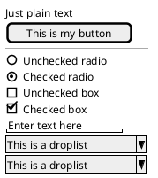
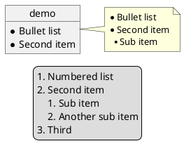
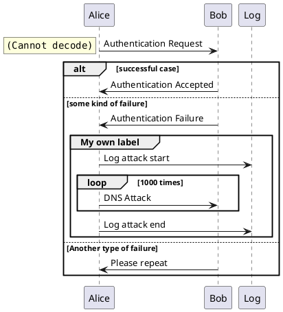
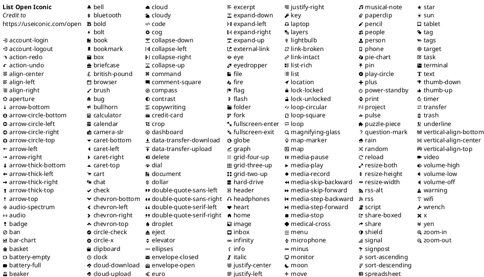
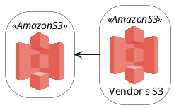
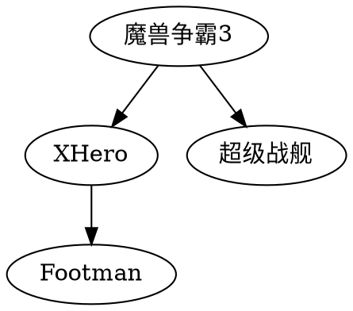

```plantuml
@startsalt
{#<font color="red" ><b>"my table"</b></font>|"my table"
Login | "MyName "
Password | "**** "
[Cancel] | [ OK ]
}
@endsalt
```

```plantuml
@startuml
salt
{
Just plain text
[This is my button]
==
() Unchecked radio
(X) Checked radio
[] Unchecked box
[X] Checked box
"Enter text here "
^This is a droplist^
^This is a droplist^
}
@enduml
```

```plantuml
@startuml
object demo {
* Bullet list
* Second item
}
note right
* Bullet list
* Second item
** Sub item
end note
legend
# Numbered list
# Second item
## Sub item
## Another sub item
# Third
end legend
@enduml
```

```plantuml
@startuml

Alice -> Bob: Authentication Request
alt successful case
rnote left
<img:2019-11-17-20-11.png>
end note
Bob -> Alice: Authentication Accepted
else some kind of failure
Bob -> Alice: Authentication Failure
group My own label
Alice -> Log : Log attack start
loop 1000 times
Alice -> Bob: DNS Attack
end
Alice -> Log : Log attack end
end
else Another type of failure
Bob -> Alice: Please repeat
end
@enduml

```

```plantuml


scale 100 height
scale 100 width
scale 5
skinparam class {
BackgroundColor PaleGreen
ArrowColor SeaGreen
BorderColor SpringGreen
}
skinparam stereotypeCBackgroundColor Yellow
class Student{
    Name
    --
    Age
    ==
    Height
    ..
    weight
}

@startuml
listopeniconic
@enduml

```

```plantuml
@startuml
!include <aws/common>
!include <aws/Storage/AmazonS3/AmazonS3>
!include <aws/Storage/AmazonS3/bucket/bucket>
AMAZONS3(s3_internal)
AMAZONS3(s3_partner,"Vendor's S3")
s3_internal <- s3_partner
@enduml
```

```dot
digraph 游戏 {
    魔兽争霸3 -> XHero;
    魔兽争霸3 -> 超级战舰;
    XHero -> Footman;
    #Footman -> 刀塔;

}
```