统计建模与R软件-带完整书签.pdf
# 数据分析方法论
第十二章
[Markdown 数学公式语法 - 简书](https://www.jianshu.com/p/4460692eece4)
[Latex各种命令、符号、公式、数学符号、排版等 ](https://blog.csdn.net/qfire/article/details/81382048)


[常用数学符号的 LaTeX 表示方法](https://www.mohu.org/info/symbols/symbols.htm)

## 概率论基础

[R和RStudio的下载及安装及RStudio打开后空白的解决](https://blog.csdn.net/qq_35164554/article/details/78942076?utm_source=app)

# 数组的集中趋势

## 常⽤的集中趋势指标-我们如何定义⼀个数组的中⼼
我们常⽤以下⼏个指标来描述⼀个数组的集中趋势：
==均值==-算数平均数，描述平均⽔平，例如：客单价、件单价⼈均访问时⻓、平均配送时⻓；
==中位数==-将数据按升序或降序排列后位于正中间的数，描述中等⽔平；
==众数==-数据中出现最多的数，描述⼀般⽔平；
假设A、B两组数：
```R{class= ' line-numbers'}
A：5，6，6，6，6，8，10
B：3，5，5，6，6，9，12
```
A组：
均值：6.74，中位数：6，众数：6；
B组：
均值：6.57，中位数：6，众数：5，6；
对A组做⼀些变化：
```RStudio{class= ' line-numbers'}
A：5，6，6，6，7，8，10，20
B：3，5，5，6，6，9，12
```
均值：8.375，中位数：6，众数：6
均值⼤幅度提升，但中位数和众数没有变化

|        | 优点                         | 缺点                                       |
| ------ | ---------------------------- | ------------------------------------------ |
| 均值   | 充分利⽤所有数据，适⽤性强     | 容易受到极端值影响                         |
| 中位数 | 能够避免被极端值过分影响     | 不敏感                                     |
| 众数   | 能够很好的反映数据的集中趋势 | 当数据没有明显的集中趋势时，基本没有信息量 |

均值在什么场景下需要注意：样本中有极⼤值或极⼩值，且极值在使⽤场景中不会复现，或难以复现的时候。
## EXCEL和R语⾔中的实现
> EXCEL：
均值：average(数组);
中位数：median(数组),quartile(数组，[quart]),0-最⼩值，1-下四分位数，2-中位数，3-上四分
位数，4-最⼤值；
众数：mode（数组）

> R：
均值：mean(数组)
中位数：median(数组)
众数：⽆内置函数

## 本节⼩结：
数组的集中趋势是数组最关键特征，简⽽⾔之，数组在哪个点集中，是数组最重要的属性；
均值是最常⽤的集中指标，但为了更客观的描述⼀个数组，需要辅助中位数和众数，才能更⽴体的
理解⼀个数组；
均值，中位数，众数都是⽇常数据处理中最常⽤的技能，⽆论什么⼯具，都需要熟练掌握；

## 课堂练习

- 课堂练习.xlxs 中，sheet-集中趋势⼀：样本数据为⼀家⾃助餐厅447位客户选择的⾃助餐价格，现在餐厅计划升级菜单，综合提升⽤户的⽤餐体验，餐厅应该优先优化哪⼀个价位；
> 题⽬主要强化均值、中位数、众数在EXCEL中的实现，并强化众数可以较快筛选出⼤⼦集的功能；

- 课堂练习.xlxs 中，sheet-集中趋势⼆：样本数据为某零售分销商旗下300款商品的⽉度销售额，现计划设定⼀个阈值，让阈值以下商品的分销商全部升级商品，应该选择什么阈值？
> 强化中位数突出数组排序，不受极⼤、极⼩值⼲扰的特性；

# 数组的离散程度

数组集中在哪⾥，说明了数组最主要的特征是什么；另⼀⽅⾯，数组的离散程度，则体现了这个特征的稳定程度；例如A地区冬季平均⽓温 0度，最低⽓温-10度，B地区平均⽓温-2度，最低⽓温-4度；说明虽然A地区整个冬季看上去⽐B地区更暖和，但受多种原因影响，⽓温的波动程度更⼤，当地居⺠可能更需要提防不稳定的⽓候。
⼀般我们⽤极差、⽅差、标准差三个概念来描述数组的离散程度：

## 极差-⼤减⼩
极差：最⼤值-最⼩值
```R{class= ' line-numbers'}
A:1，2，5，9，10
B:1，4，5，6，10
```
A组极差10-1=9，B组极差10-1=9，但很显然，A组的离散程度⼤于B组。

## ⽅差-每⼀个减均值

在统计描述中，⽅差⽤来计算每⼀个变量（观察值）与总体均数之间的差异。为避免出现离均差总和为零，离均差平⽅和受样本含量的影响，统计学采⽤平均离均差平⽅和来描述变量的离散程度。

总体⽅差的计算公式：

$$ \sigma^2=\frac{\sum_{i=1}^n(X_i-\mu)^2}{N}$$
$\sigma^2$为整体⽅差，$X_i$为变量， $\mu$为总体均值， N为总体列数。但在实际⼯作中，我们很难得到总体的均数，因此⼀般都⽤样本统计计量代替总体参数。
经过矫正，样本⽅差公式为：
$$S^2 = \frac{\sum_{i=1}^n (X_i-\overline{X})^2}{n-1}$$
$S^2$为样本⽅差， $X_i$为样本变量， $\overline{X}$为样本均值， n为样本量，可以看出和总体⽅差最⼤的区别是，样本⽅差除以n-1⽽⾮n，其中的原理是针对总体⽅差的⽆偏估计。

## 标准差-开个⽅
标准差的计算公式为：
$$S =\sqrt{ \frac{\sum_{i=1}^n (X_i-\overline{X})^2}{n-1}}$$
数列1，2，5，8，9，⽅差为10，已经超过了数列最⼤值的范畴，只看绝对值会造成该组数列⽅差很⼤的假象。其中本质的原因，是因为⽅差是样本个体与样本均值差的平⽅，平⽅的不只是数字的绝对值，还有单位。如果数列的单位是⽶，那么⽅差的单位就是平⽅⽶，如果数列的单位是单量，那么⽅差的单位就是单量平⽅。这样⽅差与原数组就失去了对⽐的意义，因此，引⼊标准差的概念，将⽅差的单位还原⾄与原数组⼀致，也使得数据组可对⽐。

⽅差或者标准差的业务价值：
1. 对⽐数组时考虑稳定性；
2. 识别数组需要做⼆次分类；

## EXCEL和R语⾔中的实现
EXCEL：
```R{class= ' line-numbers'}
极差：Max(数组)-Min(数组)
⽅差：Var(数组)
标准差：Stdev（数组）
```
```R{class= ' line-numbers'}
极差：Max(数组)-Min(数组)
⽅差：Var(数组)
标准差：Sd(数组)
```
## 本章⼩结
- 离散程度标志着数组的稳定性⾼低，两个数组对⽐的时候，综合⽐较均值和标准差/⽅差，能够更好的理解数据及背后的现象。
- 最常⽤的离散程度指标是标准差，在未来的数据⼯作、模型理解中都⾮常重要，定义，计算⽅法，实现⽅式都应熟练掌握。

# 频数分析

频数分析是指⽤⼀定的分类⽅式将数组分类，然后统计各分组下的样本数量，以图表辅助，⽤更直观的⽅式描述出数组的分布趋势的⼀种⽅法。
业务意义：
- ⼤问题变⼩问题，聚焦在需要关注的群体上；
- 找到合理的分类机制，⻓期分析数据；
⼀个班40个学⽣，考试成绩如下：
```R{class= ' line-numbers'}
73,87,88,65,73,76,80,95,83,69,55,67,70,94,86,81,87,95,84,92,92,76,69,97,72,90,
72,85,80,83,97,95,62,92,67,73,91,95,86,77
```
请试着描述⼀下这个班的成绩分布怎么样。
均值：81.3，中位数：83，众数：95
最⾼分：97，最低分：55，极差：42，⽅差：121.2，标准差：11
- 最⾼分为97分，且学⽣分数在⾼分段集中；
- 最低分距离均值相差81.3-55=26.3分，偏差较⼤，该同学需要重点关注
除了以上信息外，只依靠基础的数据指标，很难对⼀个数据集做出全⾯的解读，且拿到有限的信息都需
要较⼤的成本；

## 数据频度表-更直观的分布表
数据频度表是指按照某些维度，将数组分段后统计各组个数，的表格⼯具，能够更直观的反映出数组特
征，以下是将分数按照5分⼀档划分的数据频度表，可以很直观的发现，各分数段的学⽣⼈数都较为平
均，说明此次考试并没有让成绩好的学⽣拉开差距，试题较为简单；然⽽部分分数段的同学成绩较低，
需要额外关注；

| 分数学⽣ | ⼈数 |
| ------- | --- |
| 55-59   | 1   |
| 60-64   | 1   |
| 65-69   | 5   |
| 70-74   | 6   |
| 75-79   | 3   |
| 80-84   | 6   |
| 85-89   | 6   |
| 90-94   | 6   |
| 95-100  | 6   |

## 茎叶图-数据频度表的变种

R语⾔公式：
`stem(数组)`
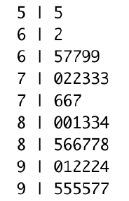

## 频度直⽅图-表达分布的柱形图

R语⾔公式：
`hist(数组)`
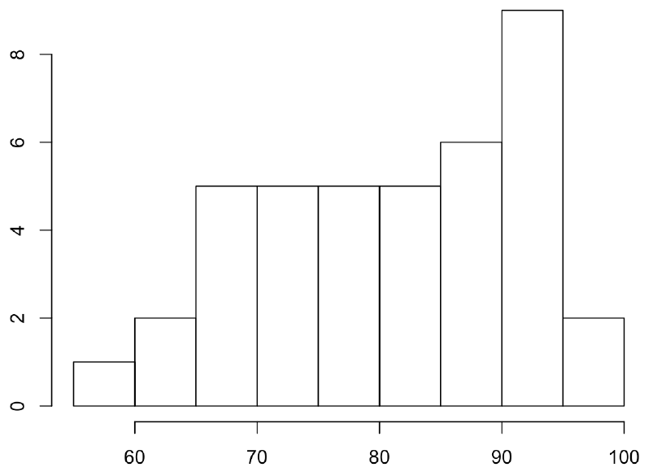

## 箱线图
R语⾔实现
`boxplot(数组)`
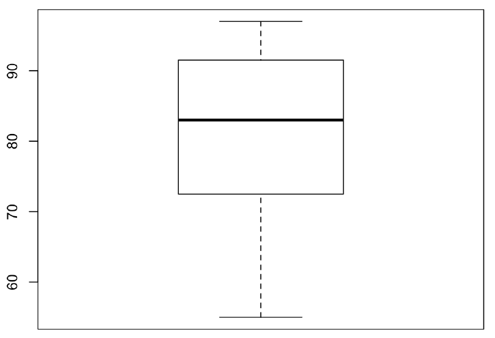

## 本章⼩结

- 在建⽴了对数据的集中趋势，离散程度的认知后，本章更⽴体的介绍了如何全⾯的评估⼀个数组；
- 频数分析⽅法的⽬的是能够帮助⼤家找出数组中最有价值的信息，如何对数据分组需要不断的积累经验，不断提升对数据、业务的敏感度，不断找到更有效的分类维度。

## 课堂练习

- 课堂练习.xlxs 中，sheet-频度分析⼀：样本数据为某APP的⾸⻚迭代策略ab_test上线后，⽤户未来7⽇的活跃天数，为企业真实数据，请分析A、B组策略，哪组策略更优；
- 课堂练习.xlxs 中，sheet-频度分析⼆：样本数据为某APP的⾸⻚迭代策略ab_test上线后，⽤户未来30⽇的使⽤时⻓，为企业真实数据，请分析A、B组策略，哪组策略更优；
- 课堂练习.xlxs 中，sheet-频度分析三：样本数据为某零售电商业务，500位客户样本的⽉购买⾦额（⽉ARPU），请分析7、8两⽉⽤户购买⾏为的变化；

# 数据分布

## 变量的随机与连续性 -⼩数点后能数⼏位

**离散型随机变量**：数据可以⼀⼀列出，例如部⻔的员⼯数，⼀个⽉的天数；
**连续型随机变量**：数据不可以⼀⼀列出，例如⽤户使⽤APP的时⻓，⼈体的体温。
注意，当离散型变量的数据⾮常庞⼤时，就可以近似看做⼀个连续型随机变量。

## 伯努利分布（0-1分布）-抛⼀枚硬币
指⼀个有固定概率的，只有是或否两种情况的分布，例如当前降⾬概率为20%，问明天是否下⾬；某批
产品的残次品率为2%，随机抽取⼀个产品是否是残次品。
我们⼀般将事件成功（下⾬，收到残次品）记为1，不成功（不下⾬，抽到的商品不是残次品）记为0，
故这种分布也被称为0-1分布，分布律为：
$$
\left\{ 
\begin{array}{l}
P(X=1)=p \\ 
P(X=0)=1-p
\end{array}
\right.
$$
即$P(X=k)=p^k(1-p)^{(1-k)}, k=0, 1$

## ⼆项分布 -抛更多的硬币

我们将以上这样，有固定概率的，只会有两种可能性的实验称为伯努利实验，例如预测⼀下明天是否下
⾬，随机抽取⼀个产品检查是否残次。如果将⼀个伯努利实验重复n次，就构成了⼀个n重伯努利实验，
我们将实验结果构成的分布称为⼆项分布，记为：$P(X=k)=C_{n}^{k}p^k(1-p)^{(n-k)}, k=0, 1, 2.. n$,称X服从参数为n, p 的⼆项分布，也可记为 X~B(n,p) 。

很容易观察到，当n为1时，⼆项分布即为伯努利分布。
我们来看⼀个例⼦，⼀个⼯⼚有⼀批产品，次品率1%，分别从中抽取30个，300个，3,000个，30,000个，抽出样本中的次品个数分布是什么样的？
`rbinom(n, size, prob)`
我们模拟分别重复这个⽆放回的抽取实验10万次，得到如下的概率分布
- 30个：
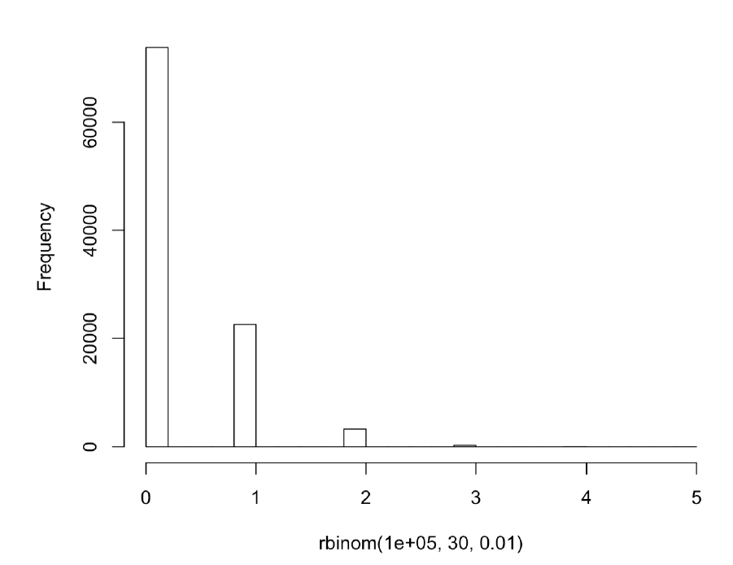
- 300
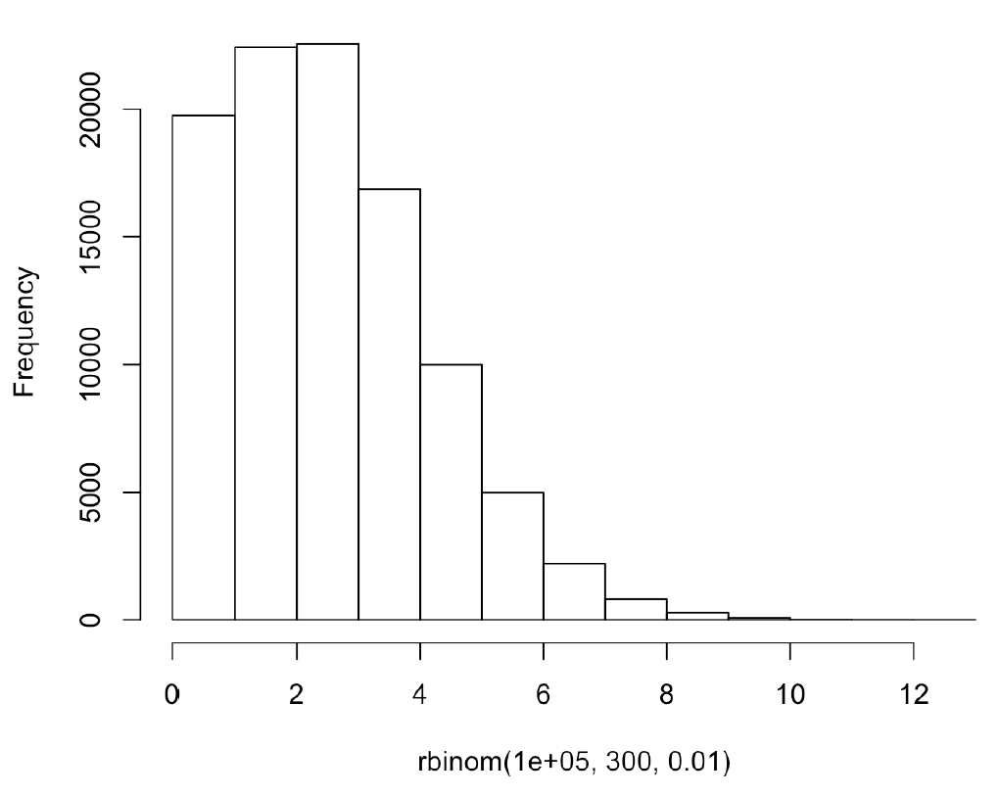
- 3000
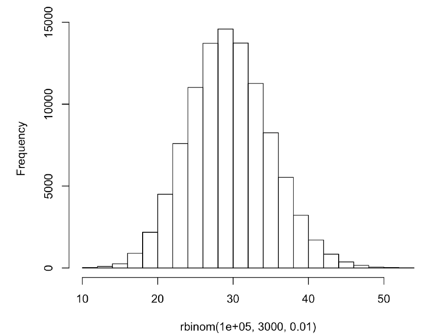
- 30000
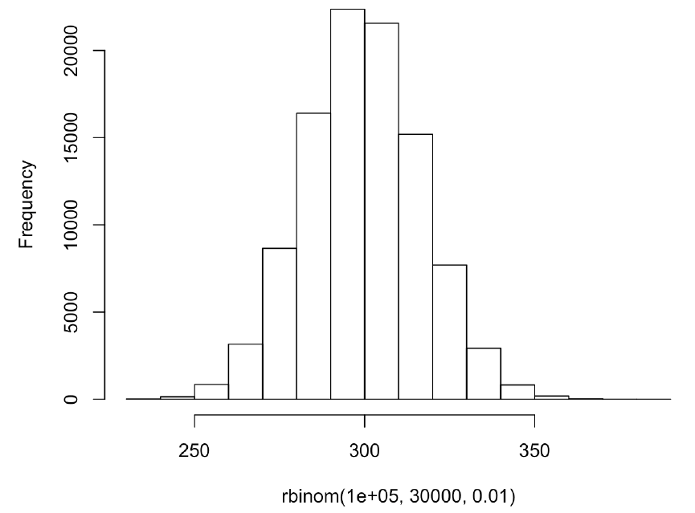

## 泊松分布 -你抛这么多我算不过来了
在计算机不发达的年代，⼆项分布的计算量庞⼤，负担较重，因此数学家推导出了⼆项分布的近似分
布，泊松分布；
我们先来看泊松分布的公式：

$$P(X=k)= \frac{\lambda^ke^{-\lambda}}{k!}$$

泊松公式的推导是由泊松定理⽽来：

$$\lim_{n\rightarrow\infty}(_k^n)p^k(1-p)^{(1-k)}=\frac{\lambda^ke^{-\lambda}}{k!}$$

泊松分布是⼀个⼆项式分布的近似，其中$\lambda$是⼀个常数，当p相当⼩，⼀般为0.1以下时，$\lambda=np$
`rpois(n, lambda)`
我们同样抽取10万个样本，次品率1%，套⼊到泊松分布的函数中区观察变化：
$\lambda=0.3$
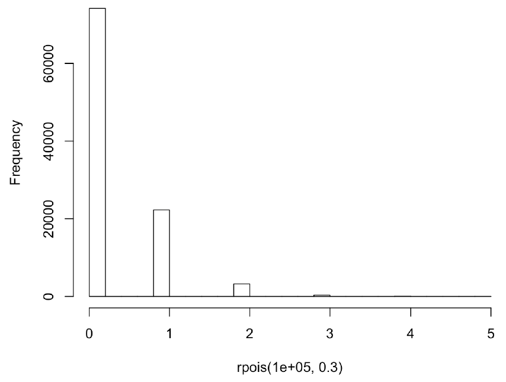
$\lambda=3$
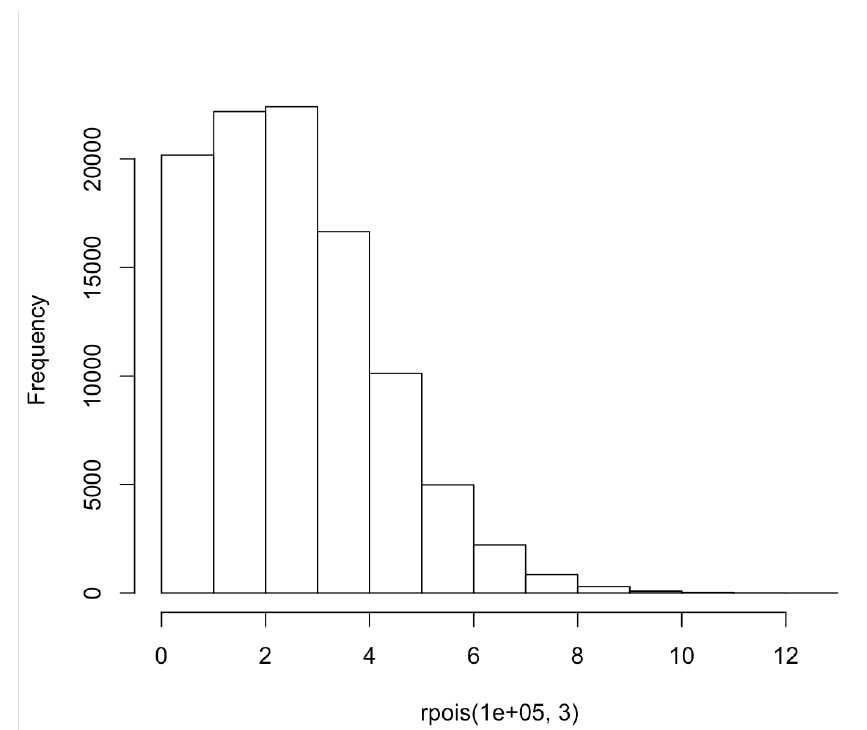
$\lambda=30$
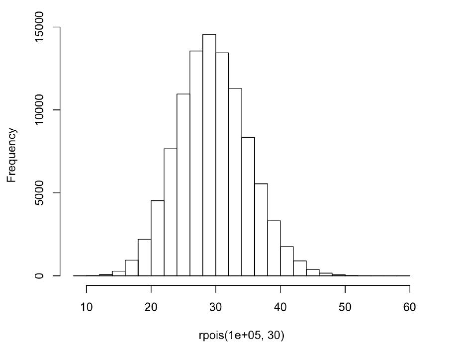
$\lambda=300$
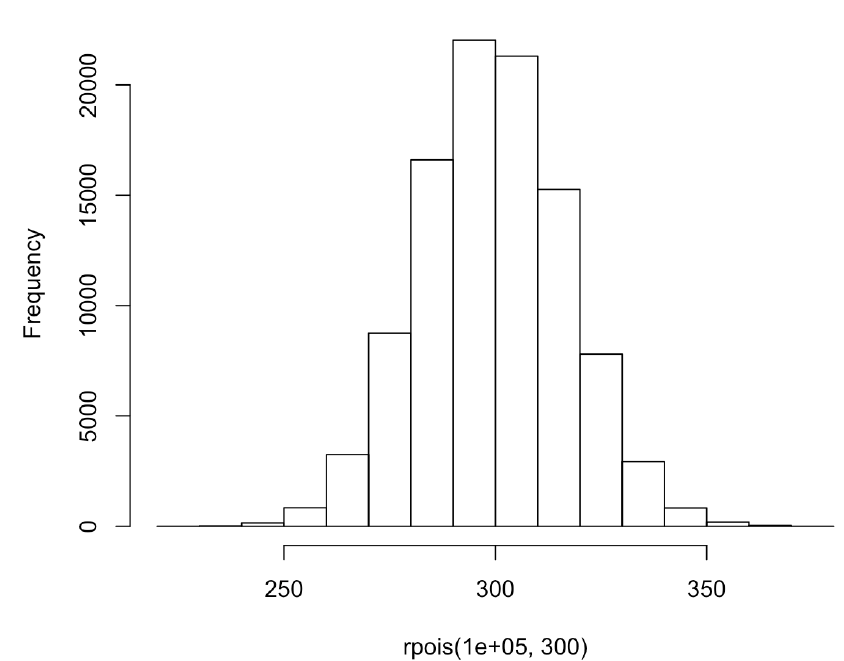
对照⼆项式分布的图形，发现$\lambda=np$被这些分布图形证明了

## 分布函数 -⽤函数描述⼀个分布律
对于连续型随机变量，我们不可能像离散型随机变量⼀样，去列出每个值的分布律，因此当我们需要描
述⼀个连续型随机变量的分布情况时，就需要引⼊新的⽅式：分布函数（累计分布函数）；
设X是⼀个随机变量实数，$F(x)=P\{X \leq x\}$称为的分布函数，也可以记为X~F(x);
对于任意$x_1, X_2(x_1 \leq X_2)$有：
$$P\{x < X \leq x_2\} = P\{X \leq x_2\}-P\{X \leq x_1\} = F(x_2)-F(x_1)$$
$$P\{X>x_1\}=1-P\{X \leq x_1\}=1-F(x_1), (x_1<x_2)$$

因此，若已知 X 的分布函数，就可以知道 X 落在任意区间的概率统计规律，如果将 X 看成是数轴上的随机坐标，那么，分布函数 F(x)在 x 处的函数值就表示 x 落在区间$(-\infty,x)$中的概率。
分布函数有哪些性质呢：
- F(x)是一个不减函数
- $$0 \leq F(x) \leq 1, 且F(-\infty)= \lim_{x \rightarrow -\infty}F(x) =0$$
- $$F(\infty)=\lim_{x \rightarrow \infty}F(x)=1$$
- F(x)是右连续的

## 概率密度函数-来求个导
概率密度函数就是连续型随机变量的「分布律⽅程」；
对于任意随机变量X的分布F(x)存在⾮负可积函数f(x)，使对于任意x有：
$$F(x)=\int_{-\infty}^{x}f(t)dt$$
则称X为连续型随机变量，f(x)称为X的概率密度函数。
- $f(x)\geq 0$
- $$\int_{-\infty}^{\infty}f(x)dx=F(\infty)=1$$
- 对于任意实数x_1, x_2, $(x_1 \leq x_2)$,有$$P{x_1<X \leq x_2} = F(x_2)-F(x_1)= \int_{x_1}^{x_2}f(x)dx$$
- 若f(x)在点x处连续，则有$F'(x)=f(x)$

## 均匀分布-⽤最简单的打个样
若连续函数的概率密度函数为：
$$
\left\{ 
\begin{array}{l}
\frac{1}{x_2-x_1} , x_1 < x \leq x_2\\ 
0, 其他
\end{array}
\right.
$$
则称为均匀分布。
均匀分布的概率密度函数及累计分布函数如下：
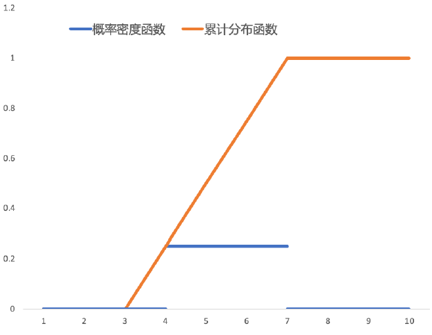
我们很容易发现，概率密度函数指的是数组分布再各点的概率，⽽分布函数（累积分布函数）则是数组
概率逐渐累积⾄1的过程，概率密度函数是分布函数的导数。

## 正太分布-⽆限切分的⼆项式分布
正太分布的定义：
若连续型随机变量X的概率密度为$$f(x)=\frac{1}{\sqrt{2\pi}\sigma}e^{-\frac{(x-\mu)^2}{2\sigma^2}}, -\infty < x < \infty$$
，则称X服从参数为$\mu, \sigma^2$的正太分布，记作$X~N(\mu, \sigma^2)$。

正太分布具有如下特征：
- 曲线关于$x=\mu$对称；
- 当$x=\mu$ 时概率密度函数可以取得最⼤值$f(x)=\frac{1}{\sqrt{2\pi}\sigma}$
- 在具有同样⻓度的区间中，当区间离$\mu$越远，X落在这个区间的概率越⼩；
对⽐⼀下不同的$\mu,\sigma$下的正太分布的概率密度的函数：

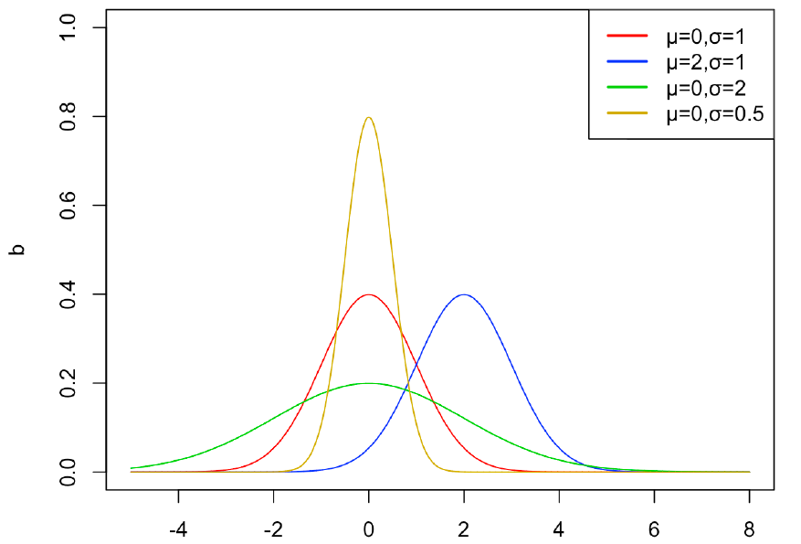
当$\mu=0,\sigma^2=1$时，即为⼀种最特殊，也⾮常重要的正态分布——标准正太分布，概率密度函数和分布函数分别⽤$\varphi(x), \phi(x)$ 表示，$$\varphi(x)=\frac{1}{\sqrt{2\pi}}e^{\frac{-x^2}{2}}$$
- 在标准正太分布中，随机变量X落在（-1,1），即⼀倍标准差的概率是68.3%，（-2,2），即两倍标准差是95.5%，（-3,3）三倍标准差的概率是99.7%；
- $\varphi(-x) = 1-\phi(x)$
- 对于所有⼀般的正太分布，可以通过重构为$Z=\frac{X-\mu}{\sigma}$转化为标准正太分布，重构过的Z满⾜N(0,1)
标准正太分布会在以后的模型学习中扮演⾮常重要的⻆⾊，请同学们⼀定要强化记忆。

## 本章⼩结
- 学习数组分布的⽬的是帮助⼤家构建起概率思维的基本框架，我们⽇常⻅到的订单量，⽤户使⽤时⻓等等，都是基于⼀定概率分布假设下，诸多可能性当中的⼀种。这种思维也是⽇后进⾏数据分析、预测的重要思维基础。
- ⽆论是离散型变量还是连续型变量，底层逻辑原理都是⽆数次伯努利实验堆积的结果，这使得我们⽇常的很多现象，都可以归⼊到已有的分布模型中，去探索数组背后的本质。
- 正太分布作为最为重要的⼀个分布模型，需要熟练掌握其性质及参数。

## 总结

- 今天的内容较为抽象，但是学好以后课程的基础，请同学们多结合⽇常的⼯作实际思考，多把⽇常
的⼯作问题抽象称为统计问题，强化⾃⼰的思维训练；
- 描述⼀个数组往往会从集中趋势⼊⼿，我们⽇常最常⽤的指标即为均值，同时中位数、众数也是不
可忽视的辅助指标；
- 是否能够解读出数据的离散程度中包含的信息，往往直接决定了我们能够成功理解数组背后的信
息，常⽤的指标有⽅差与标准差，其中标准差最为常⽤；
- 数组的频度分析⽬的是更全⾯、直观的反映数组信息，常⽤的⽅法有直⽅图，箱线图，实现⽅法需
要掌握；
- 数组的分布模型是从底层理解数组构成思维框架，重要的是熟悉、并掌握从伯努利实验推倒致正态
分布的逻辑过程，这将直接影响在未来的模型学习中，能否理解到位的关键。

# 相关与回归分析

# 课堂主题

本堂课以线性回归和逻辑回归为线索，让同学们能够系统了解、掌握建模及应⽤的⽅法，并结合实例，理解回归检验、哑变量等较复杂的概念，学会以上概念在实际⼯作中的应⽤。

# 课堂⽬标

理解线性回归、逻辑回归的统计学原理；
掌握模型诊断的⽅法；
掌握建模的⽅法；
结合业务实例，掌握在具体⼯作中的应⽤思路。

# 相关系数

## 基本概念
数组间常⻅的两种关系：
- 函数关系：确定关系，$y = ax + b$
- 相关关系：⾮确定性关系

我们⼀般使⽤相关系数去描述两个数组间的线性相关程度
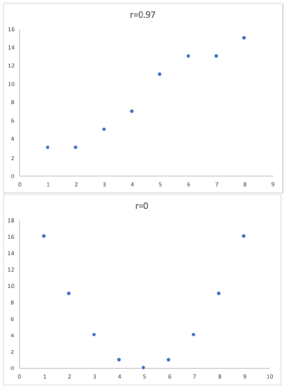
两图中X与Y都有很明显的相关关系，左图为线性关系，r=0.97，右图则是⼆次关系，r=0；其中为相关系数；
$r = \frac{\sum(X-\overline{X})(Y-\overline{Y})}{\sqrt{\sum(X-\overline{X})^2\sum(Y-\overline{Y})^2}}$ = $\frac{n\sum(XY)-(\sum X)(\sum Y)}{\sqrt{n(\sum X^2)-(\sum X)^2}\sqrt{n(\sum Y^2)-(\sum Y)^2}}$

$r = \frac{Cov(X,Y)} { \sqrt{D(X)} \sqrt{D(Y)}}$

其中：
- 成对的数据(x,y)为⼀对随机变量；
- r只能⽤来度量线性关系；
- $-1 \leq r \leq 1$;
- 离群值会影响 r 需要剔除；
- 相关关系不是因果关系-关注相关关系是否稳定；

## 功能实现
EXCEL：
`=correl(数组1，数组2)`
EXCEL的公式只能计算两个数组的相关系数，数据分析⼯具可验证多个数组的相关系数。
R：
`cor(多数组)`
cor中可以包含多个数组，实现两两之间的相关系数计算，现场演示；

## 业务意义及价值
- 要A做B；
- 警惕将相关关系错误的判断为因果关系；
- 我们要找强相关关系，⽽⾮弱相关关系；
- 相关系数的本质，是Y的变化能有多少被X解释，与X和Y之间斜率的⼤⼩⽆关；

## 课堂练习
分别求出以下四个数组的相关系数
```R {class= ' line-numbers'}
A组：x与y之间的斜率为0.1；
B组：x与y之间的斜率为2；
C组：x与y之间的斜率为0.1，加⼀个常数项3；
D组：x与y之间的斜率为0.1，加⼀个常数项3，加⼀个随机数；
```

# 线性回归

## ⼀元线性基本概念-最初级的预测⽅法

如果只有⼀个⾃变量X，⽽且因变量Y和⾃变量X之间的数量变化关系呈近似线性关系，就可以建⽴**⼀元线性回归⽅程**，由⾃变量X的值来预测因变量Y的值，这就是⼀元线性回归预测。
回归⽅程表示为：
$Y=\alpha + \beta X + \epsilon, \epsilon ~ N(0,\sigma ^2)$
其中$\epsilon$表示由随机性引起的误差，且具有以下要求：
- 数组对(x,y)来⾃⼀个随机样本；
- 只能针对线性关系作出考察；
- 需要排除离群值；
因此，⼀元⼀次线性回归可以简单总结为，⾯对已知的X和Y，通过确定参数$(\alpha , \beta)$ ，还原回归⽅程，并实现预测。

## 最⼩⼆乘法-试出⼀条线

那么，该如何确定$\alpha$和$\beta$ ，是的其确定的⼀元⼀次⽅程最接近样本真实的线性关系呢？
我们把「最接近样本真实的线性关系」抽象为数学概念：
- 设真实值为y ，预测值为$\widehat{y}$ ；
- 有⽅程$SSR=\sum_{i=1}^{n}(y-\widehat{y})^2$；
- 则该问题转化为，寻找合适的参数，使SSR最⼩；

有了以上概念后，求出$\alpha , \beta$，使SSR最⼩，既得到了线性回归⽅程$Y=\alpha + \beta X$。该⽅法被称为「最⼩⼆乘法」，具体的求解过程我们略过，直接进⼊实现过程；
## R语⾔实现示例-来做⼀次回归
### 模型构建过程
假设⼀组身⾼与体重的数据：
```R
x=c(172,172,160,156,151,160,155,170,169,162,155,162,167,168,164)；
y=c(56,63,44,40,33,46,42,55,59,45,45,44,50,58,57)
```
x为身⾼，y是体重
先通过三点图验证⼀下数据集的趋势
`plot(x,y)`
得到如下结果：
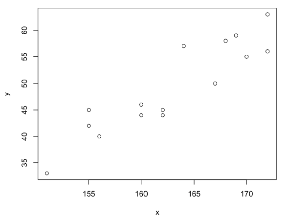
从图形中判断，X与Y存在较清晰的线性关系；
接下来⾸先计算相关系数
`cor(x,y)`
得到计算结果，相关系数 0.9109845 该组数据呈现⾼度的线性相关；
进⾏相关性检验（相关性检验是个啥）
`cor.test(x,y)`
检验结果： p-value = 2.35e-06，在 95% 的置信区间中拒绝了原假设，即相关系数<>0；
进⼊重头戏，建⽴线性回归模型
`a=lm(y~x)`
好了，简单⼀步，我们的线性回归模型就做完了，其中包含了刚才被我们略过的最⼩⼆乘法，但重点在接下来的，对模型的解读上；
⾸先提取模型的系数
`coef(a)`
程序展示如下：
(Intercept) x -135.427083 1.130208
表示$\alpha = 1.130208, \beta = -135,427083$，则我们的回归⽅程为：
$y=1.130208 \times x - 135.427038$接下来通过强⼤的summary函数，对模型的拟合程度进⾏检验：
`summary(a)`
结果如下：
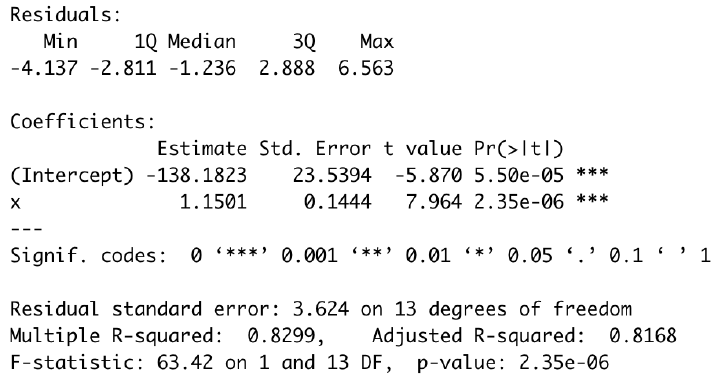
我们逐⼀对以上信息作出解释：
### 模型检验解读
Residuals：指模型的残差分布。残差是什么:$y-\widehat y$
Coefficients：模型系数及系数检验，Pr(>|t|)指模型t检验的结果，三颗星指系数通过t检验，具有统计学意义
>参数的T检验原假设是该参数为0，如果通过检验，即为拒绝原假设，通过计算得到的参数与0属于
不同的整体数组，斜率存在，x与y存在线性关系

Multiple R-squared：即$R^2$，相关系数平⽅，数组意义为：y的变化有多少可以被x的变化，与模型解释，更具体⼀些，即指$\widehat y$与 y的差距。介于1和0之间，越接近1，说明⽅程拟合效果越好；
F-statistic：F检验，或⽅差检验，主要逻辑类似于相关系数，有
$\sum_{i=1}^{n}(y_i-\overline y)^2 = \sum_{i=1}^{n}(y_i-\widehat {y}_i)^2+\sum_{i=1}^{n}(\widehat{y}_i - \overline{y})^2$，利⽤卡⽅分布检验$\sum_{i=1}^{n}(\widehat{y}_i - \overline{y})^2$与$\sum_{i=1}^{n}(y_i-\widehat {y}_i)^2$的⽐值是否⾜够⼤，以说明$y_i$对⽐$\overline y$的偏离是主要由 带来的，⽽⾮x以外的因素。该例⼦中，F检验的p-value⼩于0.5，说明拟合效果不错。
https://www.cnblogs.com/datamining-bio/p/9502033.html

绘图代码：
```R {class= ' line-numbers'}
plot(x,y)
abline(a,col = "red",lwd=2)
title('lm~test')
```
绘制回归曲线图:
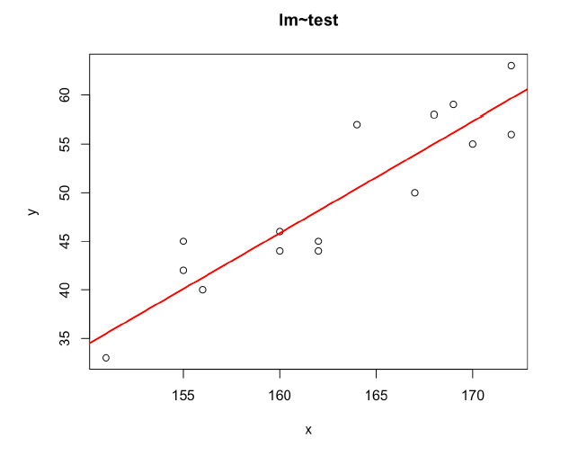
⼀组回归效果检验图：
`plot(回归模型)`
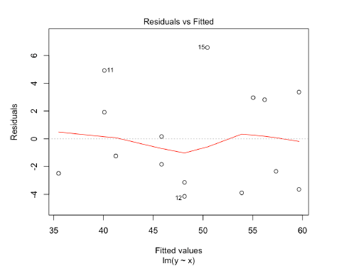
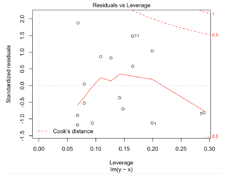
**左上-残差图与拟合图**，表示残差值与拟合值的关系，理想的拟合结果，残差应该均匀分布在0轴上下，且图中红线越平滑越好；
**右上-Q-Q图**，检验残差是否正态分布，点全部分布在直线上是最理性的结果；（Q-Q图解析：https://www.bilibili.com/video/av48039818?from=search&seid=10379301170814489931）
**左下-位置尺度图**，残差点分布在⽔平线周围，意味着理想的拟合效果；
**右下-残差与杠杆图**，主要⽤来鉴别出离群点，⾼杠杆值点和影响点，即元数据y中的异常值；
以上图形检验⽅式⼤家作为了解即可；

## ⼀元⼆次回归-第⼆个回归的例⼦
下⾯我们来看⼀个更有趣的例⼦。
R中的women数据集，是15位⼥性的身⾼、体重数据，我们先从系统中读取这批数据，并做回归：
```R {class= ' line-numbers'}
b<-women
b
plot(b$height,b$weight)
cor(b$height,b$weight)
b_lm=lm(weight~height,data=b) 或 b_lm=lm(b$weight~b$height)
summary(b_lm)
plot(b)
plot(b$height,b$weight)
abline(b_lm,col = "red",lwd=2)
```
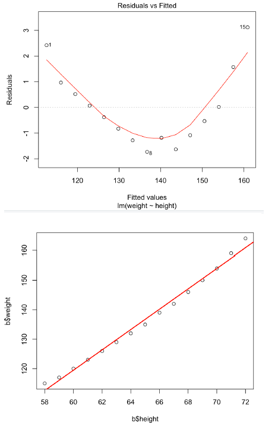
拟合R⽅0.99，拟合效果⾮常好。
但是，残差图与拟合图中，应变量与残差之间呈现出了⾮常强的⼆次关系。将散点图和拟合的直线⽅程做图，也呈现出了微弱的⼆次关系；
因此，虽然现有数据集具有⾮常好的线性拟合效果，但如果加⼊⼀个身⾼的⼆次项，将有较⼤可能性继续提升拟合效果；
接下来，我们来重构回归⽅程；
`b_lm2=lm(weight~height+I(height^2),data=women)`
其中I(height^2)即为 身⾼平⽅，之所以需要⽤公式I()，是因为在R中，^有特殊含义，I()的功能则是让系统认为^是⼀个数学表达式，达到平⽅的效果。
最终的拟合效果R平⽅已达到了0.999。
同时这个例⼦，我们增加了⼀个⾃变量的⼆次项，在定义上也属于**多项式回归**。

## 哑变量-产品模块点击率与⽤户留存
业务问题：APP中有⼀个产品功能模块（类似搜索，导航），需要定下⼀个季度⽬标；APP的核⼼KPI是⽤户留存率，⽽对于该模块⽽⾔，最敏捷的指标即为点击率，那么，如果我们下个季度主⼒来追点击率，能够为APP的留存率做出过⼤的贡献？
我们先取出半年的点击率和留存率数据，附件hit_rate.xlsx，我们直接进⼊代码块：
```R {class= ' line-numbers'}
------数据读取----------
library(readxl)
hit_rate<-read_excel("~/⼯作/培训/相关与回归分析/样本题⽬/hit_rate.xlsx")
------查看数据集-------------
head(hit_rate)
plot(hit_rate$hit_rate_pv,hit_rate$`7d_active_rate`)
-------清洗数据-----------
hit_rate[which(hit_rate$`7d_active_rate`==0),]
hit_rate=hit_rate[-which(hit_rate$`7d_active_rate`==0),]
plot(hit_rate$hit_rate_pv,hit_rate$`7d_active_rate`)
------建⽴回归----------
hist(hit_rate$`7d_active_rate`)
hist(hit_rate$hit_rate_pv)-------验证正态分布
cor(hit_rate$`7d_active_rate`,hit_rate$hit_rate_pv)-------相关系数
hit_rate_lm=lm(hit_rate$`7d_active_rate`~hit_rate$hit_rate_pv)-------建⽴回归模
型
summary(hit_rate_lm)
plot(hit_rate$hit_rate_pv,hit_rate$`7d_active_rate`)
abline(hit_rate_lm,col='red')
```
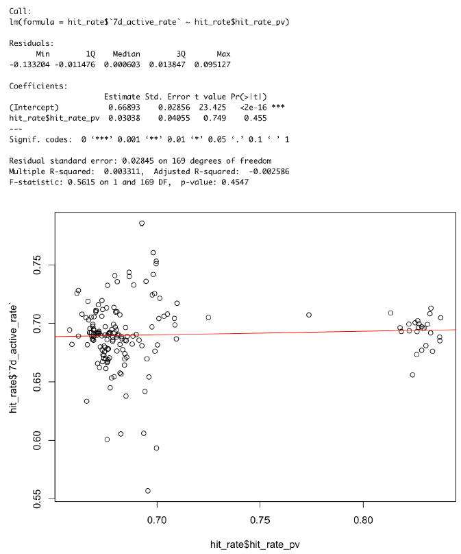
散点图及及回归结果都指向同⼀个信息，留存率的分布和点击率之间没有线性关系；
让我们回归到业务逻辑，⾼点击率意味着曝光的内容更被⽤户接受，好的⽤户体验势必导向更⾼的留存率，但为什么数据中没有体现呢；
因为在⻓达半年的时间中，业务经历了不⽌⼀个淡旺季的周期转化，同时还包括期间穿插的活动等等，过多的⼲扰因素已经扰乱了点击率和留存率间的线性关系。
因此要想研究这两个指标间的关系，需要从数据中排除时间的⼲扰因素，⽅法之⼀在固定的时间段内，将⽤户分类，通过不同组间的命中率及留存率建⽴回归数据。
继续在业务逻辑⾥思考，⼀个功能类的产品模块，⼀个⽤户单⽇的使⽤次数在短时间内是不会增加的（在这个例⼦之外，也证明了⽤户⽆论使⽤体验⾼低，都不会继续使⽤，⽤户的使⽤次数，也就是曝光次数与体验⽆关，难以改变），那么提升命中率，就会变相成为提⾼点击次数，因此，这个功能的曝光次数做分类，将问题转化为不同曝光次数下，点击次数和留存率的关系；
重新构建数据集，hit_rate2.csv
代码块：
```R {class= ' line-numbers'}
hit_rate2<-read_excel("~/⼯作/培训/相关与回归分析/样本题⽬/hit_rate2.xlsx")
cor(hit_rate2[,c(1,2,8)])
hit_rate2_lm=lm(hit_rate2$`7d_active_rate`~hit_rate2$show_pv+hit_rate2$clcik_p
v)
summary(hit_rate2_lm)
plot(hit_rate2_lm)
```
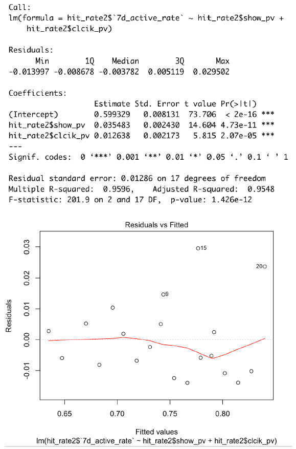
可以看出模型的拟合效果⾮常好，残差图检验中，在⾼留存率区间出现了⼏个异常值，主要原因是我们的数据集中，5次曝光其实包含了曝光次数>=5次的⽤户，因此其数据表现略有异常；
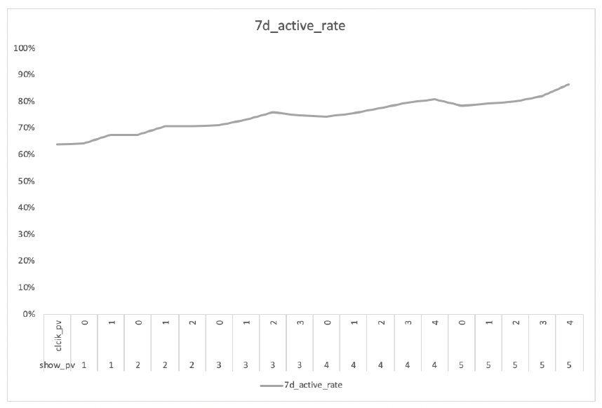

我们引⼊曝光次数和点击次数为轴，对应留存率的折线图，不难发现在曝光次数提升，即点击转为0时，留存率和点击的线性关系会出现变化，或者说，当曝光次数不变时，点击和留存率的线性关系更稳定；
从业务的⻆度出发，不同曝光次数下，提升⽤户的点击带来的收益不可能完全⼀样（曝光次数的不同意味着不同的产品认知程度，提升点击带来的收益不可能完全⼀样），⽽⽤⽬前的预测模型，相当于将提⾼点击的带来的提升全部统⼀了，在业务逻辑中不⽅便使⽤。
要解决这个问题，我们可以针对5种曝光次数分别做⼀次关于留存率和点击次数的线性回归，但这么做不仅⼯作量⼤，使⽤模型也较为复杂，还有⼀种更好⽤的⽅法，就是引⼊「哑变量」。
所谓哑变量，就是将我们计划⽤来分类的变量（例如这个case汇总的曝光次数），拆分成多个（0，1）变量，以这个例⼦为例，即做出如下变化：

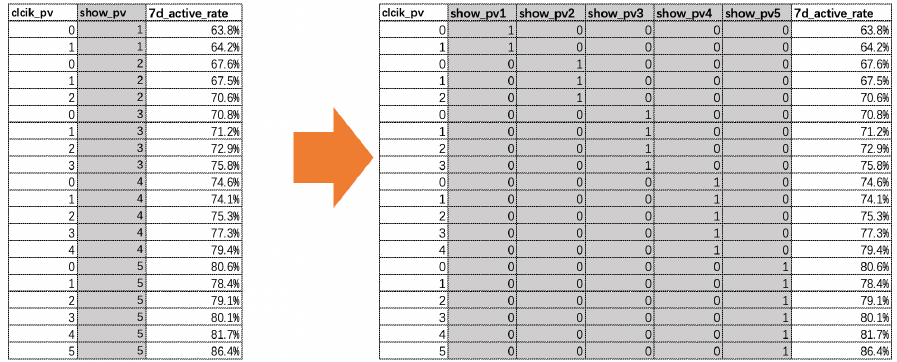
当展示次数取值为1时，起回归⽅程中的系数作为常数，提⾼斜率；为0时，系数乘以0，不参与⽅程计算；⽤这种⽅式，曝光次数对⽅程的影响转化为了改变截距。
在R中的实现如下：
```R {class= ' line-numbers'}
hit_rate2$show_pv=as.factor(hit_rate2$show_pv)
hit_rate2_lm2=lm(hit_rate2$`7d_active_rate`~hit_rate2$show_pv+hit_rate2$clcik_pv)
summary(hit_rate2_lm2)
```
R的实现⽅式⾮常简单，即将曝光次数从数组转化为因⼦，重复⼀遍我们已经⾮常熟悉的回归建模，模
型检验效果如下：

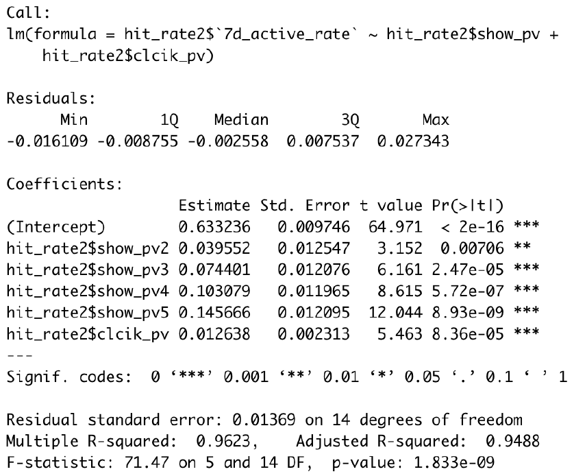
模型的拟合程度并未下降，且很好的解决的回归的业务意义问题。
## 多重共线性-我是多余的？
我们来看这么⼀组例⼦，数据详⻅ live_rate.xlsx
数据中字段如下：
```R {class= ' line-numbers'}
pages:⽤户⼀次启动app后的内容阅读篇数；
duration:本次启动时⻓；
live_rate:⽤户未来7⽇留存率；
```
⽬标是拟合阅读篇数和本次启动时⻓，和live_rate的关系。
`plot(live_rate)`
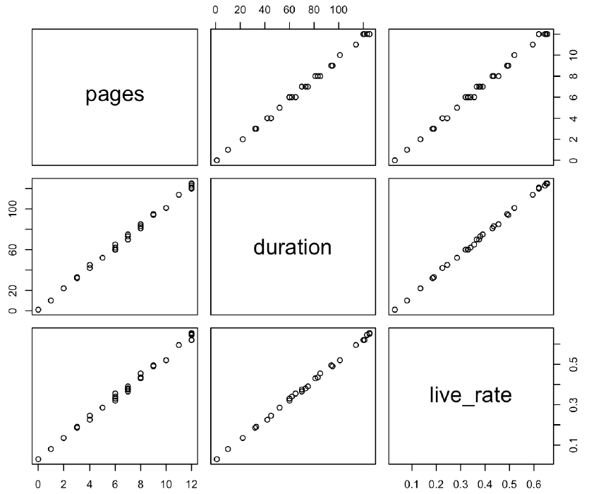
线性相关的令⼈发指，以⾄于我们都不想看协⽅差了。
```R {class= ' line-numbers'}
live_rate_lm=lm(live_rate~.,data=live_rate)
summary(live_rate_lm)
```
结果我们看到了⼀个出乎意料的结果：

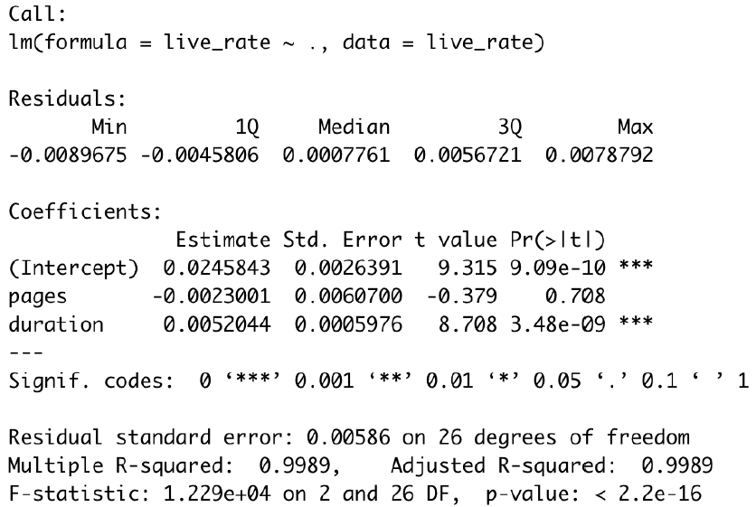
阅读篇数和留存率的系数P值⾼达0.708，系数本身是个负值不说，还不具有统计学意义，显然这⼀点是不成⽴的。
但既然散点图中⼆者相关性这么⾼，为什么多项式回归的结果如此糟糕呢？
```R {class= ' line-numbers'}
live_rate_lm2=lm(live_rate~pages,data=live_rate)
summary(live_rate_lm2)
live_rate_lm3=lm(live_rate~duration,data=live_rate)
summary(live_rate_lm3)
```
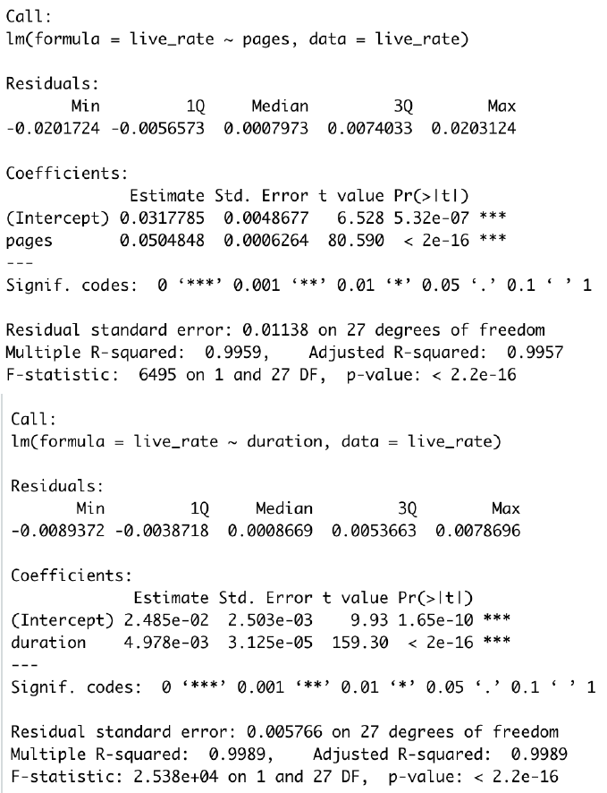
单独对这两个变量做回归，都能得到不错的结果，⽽组合在⼀起的多项式回归，虽然⽅程本身效果很好，但阅读篇数的参数检验并没有通过，核⼼原因是因为：**阅读时⻓本身就和篇数相关，这个回归⽅程中，篇数和时⻓间具有「多重共线性」**。
多重共线性是指：线性回归模型中的解释变量之间由于存在精确或⾼度相关关系⽽使模型估计失真或难以估计准确。
## 消除多重共线性-AIC（⾚池信息准则）
我们选择《统计建模与R软件》中的⼀个例⼦来说明这个问题
建⽴数据集及第⼀次线性回归：
```R {class= ' line-numbers'}
cement=data.frame(
X1=c(7,1,11,11,7,11,3,1,2,21,1,11,10),
X2=c(26,29,56,31,52,55,71,31,54,47,40,66,68),
X3=c(6,15,8,8,6,9,17,22,18,4,23,9,8),
X4=c(60,52,20,47,33,22,6,44,22,26,34,12,12),
Y=c(78.5,74.3,104.3,87.6,95.9,109.2,102.7,72.5,93.1,115.9,83.8,113.3,109.4)
)
lm.sol=lm(Y~.,data=cement)
summary(lm.sol)
```
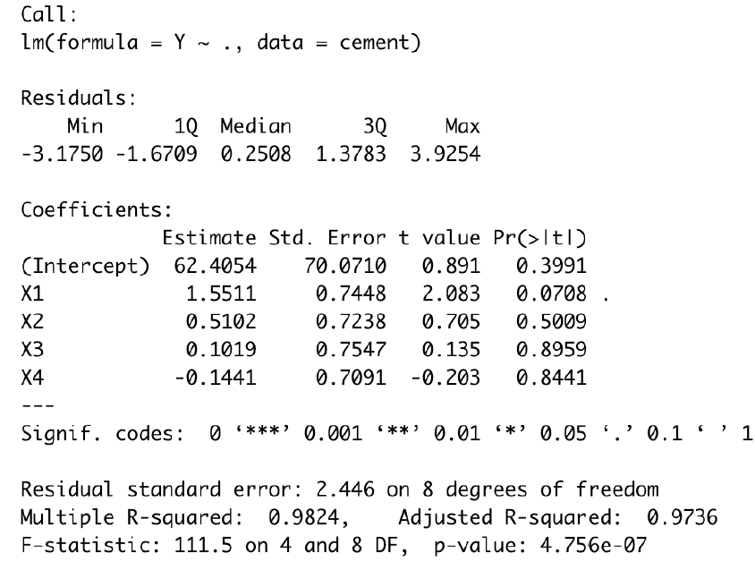
显然，模型的效果并不太好；
使⽤R语⾔⾃带的drop1函数来检验哪些变量可以剔除回归：
`drop1(lm.sol)`

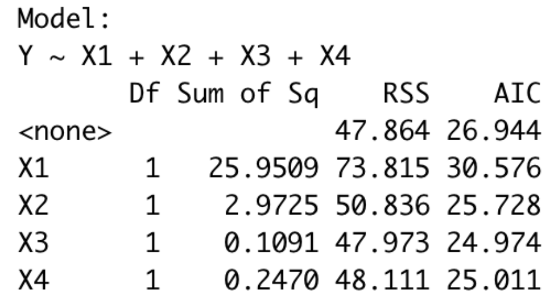
其中AIC即为⾚池信息准则，我们使⽤这个变量，去遵循找删除后，对模型影响最⼩的指标;
$$AIC = 2k + nln(\frac{SSR}{n})$$
依照计算结果，重新建⽴模型
```R {class= ' line-numbers'}
lm.sol=lm(Y~X1+X2,data=cement)
summary(lm.sol)
```
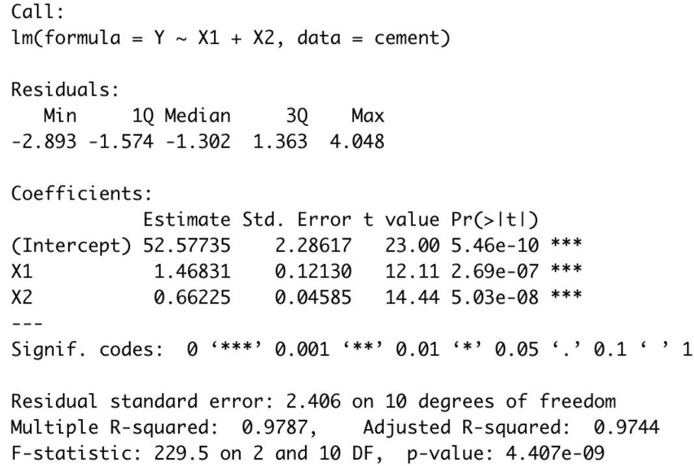
拟合效果有明显好转。
重新对数据做图，回顾⼀下AIC的含义：
`plot(cement)`
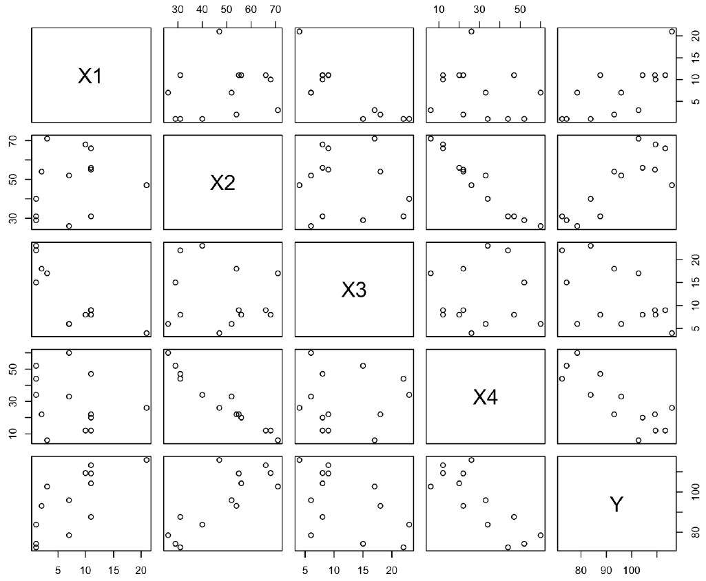

# 逻辑回归
## 逻辑回归的定义-把线性回归掰弯
线性回归的预测结果：
- 下个⽉的⽤户留存是多少；
- 下周的销量是多少；
- 这个⽉的绩效奖⾦是多少；

逻辑回归的预测结果：
- 对⾯这个男孩是不是摩羯座；
- 这个⽤户下个⽉会不会访问；
- 明天会不会下⾬；
逻辑回归图形：
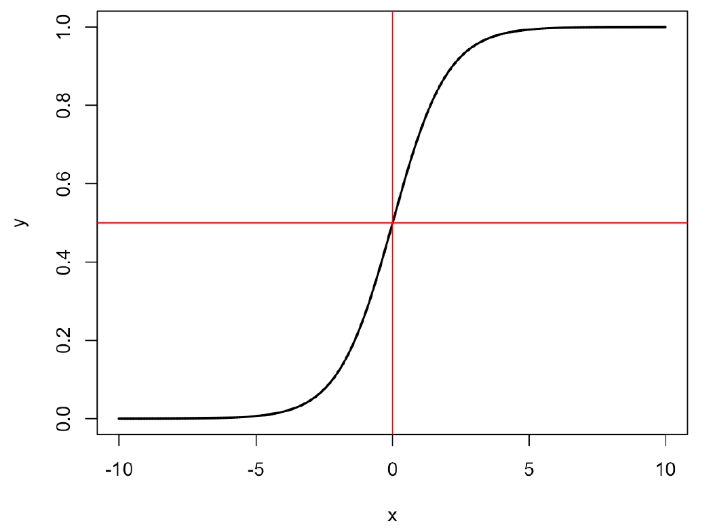
绘图代码：
```R {class= ' line-numbers'}
x=seq(-10,10,0.001)
y=1/(1+exp(1)^(-x))
plot(x,y,type='l',lwd=2)
abline(v=0,col="red")
abline(h=0.5,col="red")
```
逻辑回归公式：
$$g(t)=\frac{1}{1+e^{-t}}$$
其中：
$t = \beta_0 + \beta_1 x$
可⻅，逻辑回归即是将⼀个线性回归⽅程转移成⼀个概率结果输出，本质上，逻辑回归解决的并不是回归问题，⽽是分类问题，具体的参数估计，则是通过极⼤似然法来实现的
## 第⼀组逻辑回归练习-⼜是留存率
数据集：live_rate2.xlsx
代码块：
```R {class= ' line-numbers'}
library(readxl)
live_rate2 <- read_excel("⼯作/培训/相关与回归分析/样本题
⽬/live_rate2.xlsx",col_types = c("numeric", "numeric", "numeric"))
live_rate2_lm=glm(live_rate~duration,data=live_rate2)
summary(live_rate2_lm)
library(car)
Anova(live_rate2_lm)
predict(live_rate2_lm, type='response')
pre=ifelse(predict(live_rate2_lm, type='response')>0.5,1,0)
live_rate2_glm=cbind(live_rate2,pre)
write_csv(cbind(test,pre),'log_pre.csv')
```
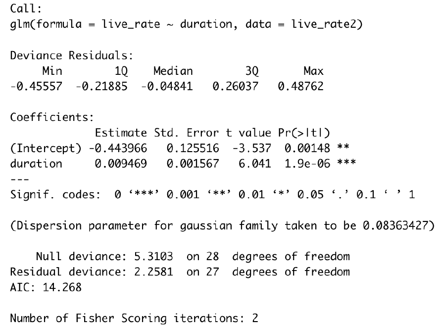

## 第⼆组逻辑回归练习- My heart will go on

⼀个关于泰坦尼克号⽣存率的竞赛练习，来源Kaggle
数据集：titanic/train.csv
字段示意如下：
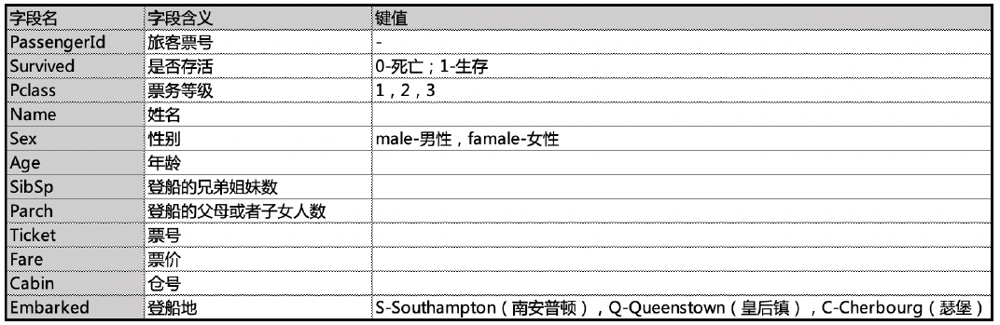
代码块：
```R {class= ' line-numbers'}
titanic_train_lm=glm(Survived~Pclass+Sex+Age+SibSp+Parch+Fare+Embarked,family=
binomial(link='logit'),data=titanic_train2)
titanic_train2_lm=glm(Survived~Pclass+Sex+Age+SibSp,family=binomial(link='logi
t'),data=titanic_train2)
summary(titanic_train2_lm)
library(car)
Anova(titanic_train2_lm)
predict(titanic_train2_lm, newdata = test,type='response')
pre=ifelse(predict(titanic_train2_lm, newdata = test,type='response')>0.5,1,0)
cbind(test,pre)
write.csv(cbind(test,pre),'titian_pre.csv')
```
⽅差检验结果：
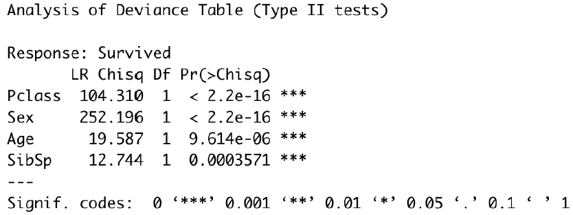
⽅差检验通过，即可通过拟合结果对测试集数据做出预测，且通测试集对预测结果做出校验，效果不错。
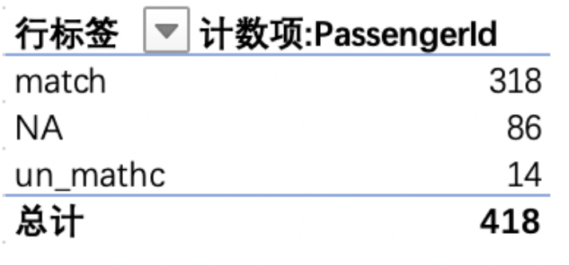
# 拓展点、未来计划、⾏业趋势

# 总结

- 相关系数是评估数组间「线性关系」强弱的统计指标，注意，是「线性关系」。
- 线性回归本质上是为了寻找数据间的线性关系，并实现尽可能精准的预测，⼤家在注意时需优先确认数组间是否存在线性关系。
- 线性回归中离散型的⾃变量，可以处理成哑变量参与运算；
- 回归的⾃变量筛选要注意其业务意义，避免出现多重共线性；
- 逻辑回归的本质是分类，⽽⾮回归；
- 线性回归和逻辑回归的实现需要掌握。


