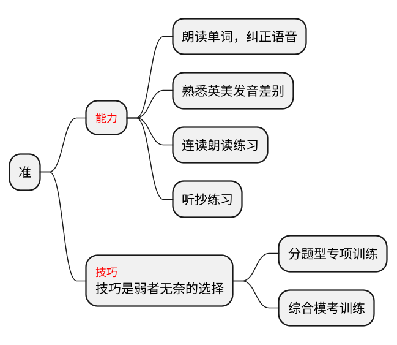
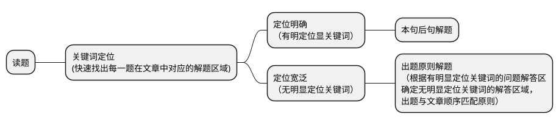
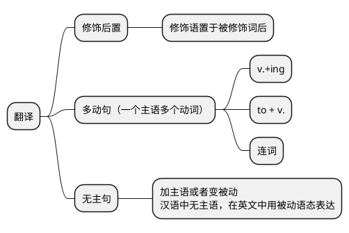

大学英语的特点：
<table><tr><td bgcolor=yellow>题文同序，平均分布</td></tr></table>

[TOC]

# 听力
听准keywords
## 英美发音的区别
[发音区别17讲：英美音无缝切换不是梦！_沪江英语学习网](https://www.hjenglish.com/new/p747328/)
[英语音标|英美发音有哪些主要区别？该如何练习？-奇速英语](http://www.qisuabc.com/news/detail/2421)

## 英语连读规则
[英语发音连读规则_在线英语听力室](http://www.tingroom.com/listen/yyky2/277438.html)
[英语发音|这绝对是你看过的最全的英语发音规则——连读 - 哔哩哔哩](https://www.bilibili.com/read/cv263809/)
[英语连读规则（完整版）+常见的连读短语及句子 - 知乎](https://zhuanlan.zhihu.com/p/32385787)
[史上最全的英语连读规则一网打尽 | CS巴别塔(1)](https://csbabel.wordpress.com/2009/09/02/english-liaison-rules/)
[英语发音连读规则（打印版）](http://www.tingroom.com/print_277438.html)

## 如何进行模仿练习
[快速攻克英语口语考试的技巧_在线英语听力室](http://www.tingroom.com/listen/yyky2/277437.html)
- 模仿的原则：考生必须主动、有意识、有目的地去模仿。模仿时要放开嗓子，口形到位，清清楚楚、一板一眼，并及时纠正说不好的单词、短语等。纯正、优美的语音、语调不是短期模仿就能达到的，需要考生长期坚持锻炼，一般来说，至少需要半年时间。
- 模仿的标准：模仿到什么程度才算好呢？简单地说就是要“像”，考生的语音、语调等都很接近模仿对象。如能更进一步，在语音、语调等方面都达到逼真的效果，则更为成功。
- 模仿的方法：
    - 第一步，语音模仿。刚开始模仿时，速度不要过快，并注意口形正确，以便把音发到位。打好基础后再加快速度，用正常语速反复多练几遍，直到自如表达意思。对于读不准或较陌生的单词，要反复多听几遍，逐一进行单独模仿。
    - 第二步，词组模仿。有了第一步的基础，这一步就容易多了。考生的重点要放在熟练程度和流利程度上，特别要多练习连读、同化等语音技巧。
    - 第三步，段落及篇章模仿。听英语文章录音或英语新闻，并跟着模仿，重点在于提高口腔肌肉的反应速度，使肌肉和大脑更加协调，从而提高语言的流利程度。

模仿练习时要注意克服害羞心理。害羞心理一方面源于性格，内向的人讲话时易小声小气，这对学习英语语音语调很不利。另一方面是源于自卑心理，总以为自己英语水平太差，不敢开口，尤其是与水平较高者对话时。克服这种心理障碍，是学好口语的前提。

## 如何进行复述练习
- 复述的原则：复述练习一定要循序渐进，从一两句开始，听完后用英语表述说出来。刚开始时，因语言表达能力、技巧等方面原因，往往复述接近于背诵。但基础逐渐好起来后，就会慢慢放开，此时要注意用活语言，如改变句子结构，精减内容，甚至仅复述大意或内容概要。考生在选择复述内容时，尽量选一些内容生动的小短文或小故事，有明确的情节，生词量不要太大。有了基础后，再适当扩大题材范围。
- 复述的方法：学英语离不开记忆，复述练习就是一种记忆单词、句子的形式。但这种记忆不能靠死记硬背，而需掌握一定的记忆方法。复述有两种常见的练习方法：一种是阅读后复述，另一种是听磁带后复述。后一种方法更为有效，在锻炼听力、口语表达能力的同时，还可帮助考生提高注意力，进行有效记忆，克服听完就忘的毛病。

# 阅读
## 仔细阅读之解题流程
### 第一步：关键词、问答顺序匹配

### 第二步：回文定位
### 第三步：解题（基于文章）

## 仔细阅读之解题策略
### 区域解题内涵
- 跳读文章找区域
根据问题题干中的关键词（最好多个精确定位）快速在文章中找到对应区域（标注）
- 细节题：依次而下是原则（宏观题：主旨为独立题型）
- 区域之间无交集
- 前本后句是核心（关键词所在句为本句，本>后>前）
> 读题
>- 关键词定位
>- 区域明确（本句后句解题法）
>- 区域宽泛（出题原则解题法）

> 出题原则解题法
>- 原则一：特殊标点
：-- “”
>- 原则二：转折（强对比）
but、however、still、yet、instead、unfortunately、on the contrary、by contrast、in contrast to
>- 原则三：列举
>   - on the one hand ... on the other hand...
for one thing ... for anther thing ...
>   - first ... second ... third...
>   - 从句排比

## 仔细阅读题型
### 微观题型
- 细节推理题
细节：
考察该文章中有关事件发生的具体细节的题目，如：
时间、地点、人物、事件、方式等
what/when/who/where/why/how
推理：
which statement is true according to the passage?
infer conclude
- 词汇指代题（句子理解题）
could best be replaced
means
is nearest/closest to
词本无意，意由境生
- 词汇指代题-解题方法
    - 1. 冒号：解释说明
    - 2. 分号：并列
    - 3. 括号：
    a. 解释说明
    b. 补充说明
    - 4. 引号：
    a. 引用
    b. 反讽
    - 5. 破折号：补充说明
词根词缀
big-large-huge-giant-titan
pluto-plus-plenty-plutocrat
### 宏观题型
- 主旨大意题

- 观点态度题

# 翻译
- 出题形式
《关于大学英语四、六级考试题型调整的说明》
原单句汉译英调整为段落汉译英。翻译内容涉及中国的历史、文化、经济、社会发展等。四级长度为140-160个汉字；六级长度为180-200个汉字。——全国大学英语四、六级考试委员会
- 四六级翻译评分标准

分数档|标准特征|符合定义
-|-|-
12-14| 译文准确表达了原文的意思。用词贴切，行文流畅，基本上无语言错误，仅有个别小错。|雅
9-11 |译文基本上表达了原文的意思。文字通顺、连贯，无重大语言错误。|达
6-8 |译文勉强表达了原文的意思。用词欠准确，语言错误相当多，其中有些是严重语言错误。|信
……| ……| - |

## 四级翻译整体课程框架

>- 修饰后置
>   - n. + v. + 后缀
n. + v. + er
Motherfucker
Kingslayer弑君者
Birdwatcher观鸟者
>   - n. + v. + ing
papercutting剪纸
liondancing舞狮
>剪纸是中国民间艺术的一种独特形式。
papercutting is a kind of special form of Chinese
folk art.

>- 多动句
他们熟练配合，模仿狮子的各种动作。
They cooperate perfectly to imitate all kinds of actions of lions.
They do together perfectly, copying various moves of lions.

>- 无主句
如今，世界上许多其他地方也能看到红灯笼。
Nowadays, red lanterns can be seen in many other parts of the world.

# 词汇

- 背重要的-有针对性地反复识记（根据艾宾浩斯曲线）
- 方法
    - 联想
    - 词根词缀词源
    - 读句子，读真题

# 翻译
- 了解句句子的构成
    - 词汇是语言的素材，语法是语言的规律
    - 句子=单词+语法
- 语法：
    - 如何描述一件事？
    - 如何描述多件事？

# 写作
## 基础能力
- 话题词汇
- 写作句法
- 经典句型
## 能力提升
- 论说文
- 应用文
## 高分攻略
- 背诵：十大必背范文
[四级十大必备范文](四级十大必备范文.pdf)
    - 滚瓜烂熟！ 脱口而出多益善滚瓜烂熟！ 脱口而出多益善
    - 四大背诵方法
        - 搞清逻辑脉络
        - 背熟中文译文
        - 多听英文录音
        - 进行中英互译
- 默写：仔细对比原文，改正写作错误
- 仿写
