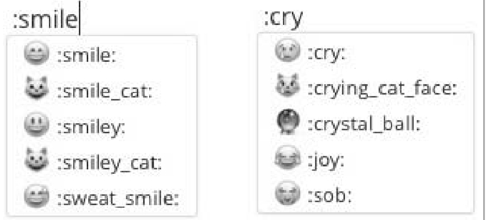

[TOC]

# 读《了不起的Markdown》
[bxiaopeng/thegreatmarkdown: 《了不起的 Markdown》](https://github.com/bxiaopeng/thegreatmarkdown)

# 内容简介
Markdown是一种轻量级标记语言，它允许人们使用易读、易写的纯文本格式编写文档。

本书从Markdown的起源、演进开始讲起，到基础语法、扩展语法和使用规范，内容循序渐进。
本书还介绍了Markdown两大编辑器——Typora和VS Code，并针对写博客文章（知乎、简书、CSDN）、写微信公众号文章、写项目文档、写书、记笔记（印象笔记、有道云笔记、熊掌记）、写邮件、写幻灯片、写在线协作文档（腾讯文档、石墨文档）、写交互式文档、搭建个人博客等众多写作场景，为读者提供了漂亮、实用的写作方案。
# 创作背景
《失控》《必然》等畅销书的作者Kevin Kelly在一次演讲中提到：

“<font color=red size=6>关于技术，在最开始时，没有人知道新的发明最适合用于做什么，</font>例如爱迪生的留
声机，他原本不知道这能用来干什么。留生机慢慢被应用于两个场景：一是录下临终遗言；二是录下教堂里的讲话，包括唱歌。后来留声机主要用于录制音乐等。”
所以说“<font color=red  size=6>技术的用途，是用出来的</font>”，Markdown也是如此。

<font color=red  size=6>当我决定是否写一篇文章时，首先要看类似的内容是否已有人写过；如果有，再看我是否有新的观点，或者能否写得更好；能否写得更系统、更全面、更通俗易懂。</font>
# 本书内容
本书可分为3大部分：Markdown的语法规范、编辑器及应用场景。
## 语法规范
从Markdown的起源、演进开始讲起，到基础语法、扩展语法和使用规范。内容循序渐进，让读者先了解Markdown的来龙去脉，再学会如何规范地使用各种语法。
## 编辑器
正所谓“工欲善其事，必先利其器”，好用的编辑器可以让写作过程事半功倍。本书精心挑选了两款流行且免费的编辑器进行详细介绍，学会它们就可以满足你大部分的写作需求了。
## 应用场景
为了说明每个人都能用到Markdown，本书列举了众多写作场景，以及与之相匹配的写作工具，相信总有一款是你需要的。

# Markdown简介
## Markdown是什么
据 GitHub Flavored Markdown（GFM）官方文档介绍，Markdown是由约翰·格鲁伯（John Gruber）在亚伦·斯沃茨茨（Aaron Swartz）的帮助下开发，并在2004年发布的标记语言。
其设计灵感主要来源于纯文本电子邮件的格式，<font color=red  size=6>目标</font>是让人们能够使用易读、易写的纯文本格式编写文档，而且这些文档可以转换为HTML（Hyper Text Markup Language，超文本标记语言）文档。
简单点说，Markdown就是由一些简单的符号（如*/-> [] （）#）组成的用于排版的标记语言，其最重要的<font color=red  size=6>特点</font>就是可读性强。
Markdown的基本语法，如下图所示。

可以说，Markdown相当于简化了的HTML，它只提供用户最常用的语法格式，更易读和易写，用户可以不必关心复杂的HTML标签，只专注于写作就行了。
使用Markdown和HTML实现相同效果的文档时，源码对比如下图所示。

当一些特殊需求（如设置图片的大小）无法通过现有的Markdown标记实现时，，也可以使用HTML来实现。
由于Markdown本身功能有限，一些特定的需求和场景无法被满足，因此产生了许多扩展语法，这些语法在基础语法之上新增了如表格、任务列表、围栏代码块等功能。
GitHub Flavored Markdown（GFM）遵循的CommonMark（http://commonmark.org/）,它为Markdown提出了一个标准的、明确的语法规范，以及一套全面的测试。

## 为什么要使用Markdown

> 为什么要使用Markdown呢?
因为它简单，可以在短时间内学会；它可以使用很多编辑器快速打开，兼容性好，可以做到一处编写，随处使用；它可以应用于几乎任何写作场景；它是专注写作的最佳方案。

### 什么时候可以使用Markdown

当你对文章的排版没什么特殊需求，且不想花太多时间在排版上时，就可以使用Markdown。因为编辑器或平台会通过Markdown标记对文章进行渲染，最终的排版效果会非常简洁、漂亮。
下面是一些针对“特殊”写作场景提供Markdown支持的工具和平台。


###  什么时候不建议使用Markdown
Markdown并不是万能的，它只适用于对排版要求不高的场景，如果你对字号、段落、图片、表格等方面的排版要求较高，还是需要使用Word这类专业的编辑软件的。
小提示：Markdown文件可以很方便地转换为Word文件，如果有一些需要特殊处理的格式，可以两者结合使用。
专注写作：罗振宇在 2016 年“时间的朋友”跨年演讲中提到过一个观点，他说：“<font color=red  size=6>当我需要一个服务时，不要给我太多选择，请直接告诉我什么是最好的，我要你的最佳方案。</font>”
Markdown就是写作文档的最佳方案，如果对排版没什么特殊要求，那就交给Markdown处理吧，你专注写作内容就行了。

## 如何学习使用Markdown

### Markdown的工作流程

Markdown的工作流程很简单，首先要挑一款好用的编辑器进行写作，内容使用Markdown进行标记，然后通过编辑器的功能将文章进行渲染、发布或导出。
所以如果想让Markdown发挥最大的作用，语法和编辑器都是要好好学习的。
Markdown工作流程如下图所示。


### 如何学习Markdown语法
1. 学习基础语法
Markdown的基础语法是指John Gruber最初发布的Markdown版本，大多数扩展语法都是基于此版本开发的，因此基础语法是需要学会的。
2. 学习扩展语法
在众多扩展语法中，GFM无疑是目前最流行的。它扩展了包括表格、任务列表、删除线、围栏代码、Emoji等在内的语法，功能非常全面，是笔者重点推荐学习的扩展语法。
3. 学习写作规范
人们在使用Markdown的过程中逐渐总结出了一些最佳实践方案，并且制定了写作规范，学习这些规范可以让我们养成良好的写作习惯，避免重复“踩坑”。
<font color=red  size=6>遵循这些规范也可以让源码（没有渲染过的文本）有更强的可读性、可移植性（一处编写，随处使用）和可维护性（有统一的认知）。</font>
正所谓“好马配好鞍”，好的编辑工具可以让写作事半功倍。


# Markdown 语法
<font color=red size=6>其实Markdown最难的地方并不是语法，而是开始使用。就像跑步最难的并不是跑步本身，而是跨出家门的那一刻。只要勇敢地跨出第一步，并且坚持下去，一切都会变得简单，水到渠成。</font>
##  基础语法
### 字体
      1. 标题
在Markdown语法中，标题支持使用两种标记：底线（-/=）和#。
- 使用底线的语法
> 语法说明如下。
1）底线是=表示一级标题。
2）底线是-表示二级标题。
3）底线符号的数量至少2个。
4）这种语法只支持这两级标题。
一级标题
===
二级标题
---

- 使用＃的语法如下
> 语法说明如下
1）在行首插入#可标记出标题。
2）#的个数表示了标题的等级。
3）建议在#后加一个空格。
4）Markdown中最多只支持前六级标题。


> 使用规范。
建议使用#标记标题，而不是`===`或`---`，因为后者会难以阅读和维护。
建议标题的前后都要空1行（除非标题在文档开头）；**#与标题文本之间也要有1个空格**，否则会导致阅读困难。
建议标题要写在一行的开头，**结尾也不要有空格**。
建议标题的**结尾不要有标点符号**，如句号、逗号、冒号、分号等。
建议标题要尽量**简短**，这样方便引用，特别是当生成目录时。如果原拟的标题是一个长句，可以从长句中提取标题，而将长句作为标题下的内容。

> 文档写作说明如下
1）文档标题：文档的第一个标题应该是一级标题，写在第一行，建议与文件名相同，标题要尽量简短。
2）作者：可选，用于声明文档的作者，如果是开源项目的文档，建议把作者名写在修订历史中。
3）摘要：用1~3句话描述文档的核心内容。
4）目录：用于快速了解文档的结构，便于导航。
5）正文：正文中的标题从二级目录开始，逐级增加，不可跳级，不可相同。

        2. 粗体和斜体(推荐*)
在Markdown中，粗体由两个*或两个_包裹，斜体由1个*或1个_包裹。
> 粗体格式的语法如下
`**粗体**`或者`__粗体__`
斜体格式的语法如下
`*斜体*`或者`_斜体_`
> 使用规范
>- 建议粗体使用2个*包裹，斜体使用1个*包裹，因为*比较常见，而且比_可读性更强。
>- 在粗体和斜体语法标记的内部，建议不要有空格。

### 段落与换行

Markdown中的段落由一行或多行文本组成，不同的段落之间使用空行来标记。
> 语法说明如下
1）如果行与行之间没有空行，则会被视为同一段落。
2）如果行与行之间有空行，则会被视为不同的段落。
3）空行是指行内什么都没有，或者只有空格和制表符。
4）如果想在段内换行，则需要在上一行的结尾插入两个以上的空格然后按回车键。


> 使用规范
为了便于阅读，应该限制每行字符的数量，通常每行不超过80个字符，可以在编辑器中进行设置。
关于换行，建议如下。
1）当超过80个字符后进行换行。
2）在一句话结束（。或!或?）之后换行。
3）当URL较长时换行。
通常URL较长会导致行字符数量超过限制，为了提高可读性，可以在URL之前加一个换行符。
例如：
大家好，Markdown参考链接是：
[了不起的 Markdown](https://github.com/bxiaopeng/thegreatmarkdown)
或者通过引用链接来进行优化：
大家好，Markdown参考链接是：[了不起的 Markdown]
[了不起的 Markdown]: https://github.com/bxiaopeng/thegreatmarkdown

        1. 列表
在Markdown中支持使用有序列表和无序列表，
- 有序列表用`数字序号+英文句号+空格+列表内容`来标记，
- 无序列表由`*/+/-+空格+列表内容`来标记。
- 嵌套列表
    1）列表中可以嵌套列表。
    2）有序列表和无序列表也可以互相嵌套。


> 使用规范。
建议使用-来标记无序列表，因为*容易跟粗体和斜体混淆，而+不流行
如果一个列表中所有的列表项都没有换行，建议使用1个空格
如果列表项有换行，则建议给无序列表使用3个空格，给有序列表使用2个空格
如果一个列表中的每个列表项都只有1行，建议列表项之间不要有空行
如果列表项中有换行，建议在列表项之间空1行，这样会比较容易区分多行列表项的开始和结束
建议在列表前/后都空1行
数字、字符、符号列表使用英文半角句号，句号后加空格
    示例 1.数字列表
    1. 有序列表
    2. 有序列表
    示例2.字符列表
    a. 有序列表
    b. 有序列表

        2. 分隔线
在Markdown中，分隔线由3个以上的*/-/_来标记
使用分割线的语法如下
`***`或者`---`或者`___`
> 语法说明如下
1）分隔线须使用至少3个以上的*/-/_来标记。
2）行内不能有其他的字符。
3）可以在标记符中间加上空格。


### 图片

插入图片的语法``
> 语法说明如下
1）图片替代文字在图片无法正常显示时会比较有用，正常情况下可以为空。
2）图片地址可以是本地图片的路径也可以是网络图片的地址。
3）本地图片支持相对路径和绝对路径两种方式。


### 链接

    1. 文字链接
文字链接就是把链接地址直接写在文本中。语法是用方括号包裹链接文字，后面紧跟着括号包裹的链接地址`[链接文字](链接地址)`
这样的写法是没有任何问题的，但由于链接跟文字都写在了一起，如果链接过多会导致可读性差一些。
如上所示，把链接地址在某个地方统一定义好，然后在正文中通过“变量”来引用，可读性一下子就变强了，这种方法叫作<font color=red size=6>引用链接</font>。


    2. 引用链接
引用链接是把链接地址作为“变量”先在Markdown文件的页尾定义好，然后在正文中进行引用

> 语法说明如下
1）链接标记可以有字母、数字、空格和标点符号。
2）链接标记不区分大小写。
3）定义的链接内容可以放在当前文件的任意位置，建议放在页尾。
4）当链接地址为网络地址时要以 http/https开头，否则会被识别为本地地址。

[了不起的 Markdown]
[了不起的 Markdown][了不起的 Markdown]

[了不起的 Markdown]:https://github.com/bxiaopeng/thegreatmarkdown

    3. 网址链接
在Markdown中，将网络地址或邮箱地址使用<>包裹起来会被自动转换为超链接`<URL 或邮箱地址>`

    4. 使用规范
在Markdown中，**链接标**题的信息应该更丰富，从标题中应该可以知道链接的内容，要使用有意义的链接标题。
建议使用<>包裹**自动链接**，这种方式更通用。
**自动链接**要以http/https开头。

### 行内代码与代码块

    1. 行内代码
在Markdown中，行内代码引用使用`包裹

    2. 代码块
在Markdown中，代码块以Tab键或4个空格开头

小提示：因为代码块使用Tab键或4个空格开头的效果不够直观，很多扩展语法（如GFM）提供了围栏代码块```，并且支持语法高亮。
    3. 使用规范
- 除行内代码可以使用`包裹以外，如果我们想转义或强调某些字符，也可以使用`包裹。

- 很多Shell命令都要粘贴到终端中去执行，因此最好避免在Shell命令中使用任何换行操作；可以在行尾使用一个\，这样既能避免命令换行，又能提高源码的可读性。

- 建议不要在没有输出内容的Shell命令前加$。在命令没有输出内容的情况下，$是没有必要的，因为内容全是命令，我们不会把命令和输出的内容混淆。
- 建议在有输出内容的Shell命令前加上$，这样会比较容易区分命令和输出的内容。


### 引用
    1. 语法
在Markdown中，引用由`>+空格+引用内容`来标记
> 语法说明如下
1）多行引用也可以在每一行的开头都插入>。
2）在引用中可以嵌套引用。
3）在引用中可以使用其他的Markdown语法。
4）段落与换行的格式在引用中也是适用的。


    2. 使用规范
建议在引用的标记符号＞之后添加一个空格
建议每一行引用都使用符号＞
不要在引用中添加空行


### 转义

当我们想在Markdown文件中插入一些标记符号，但又不想让这些符号被渲染时，可以使用\进行转义`\特殊符号`
可被转义的特殊符号


##  扩展语法GFM

在众多Markdown扩展语法中，GitHub Flavored Markdown（简称GFM）无疑是目前最流行的，它提供了包括表格、任务列表、删除线、围栏代码、Emoji等在内的标记语法，本书介绍的工具基本上都支持GFM。

### 删除线

删除线语法`~~删除线~~`


### 表情符号

使用：包裹表情代码`：表情代码：`
更多的表情符号请参考<http://www.webpagefx.com/tools/emoji-cheat-sheet/>。


### 自动链接(GFM扩展语法)

在标准语法中，由<>包裹的URL地址被自动识别并解析为超链接，使用GFM扩展语法则可以不使用<>包裹。

注意：
自动链接只识别以www或http://开头的URL地址。
如果不想使用自动链接，也可以使用\`包裹URL地址`www.baidu.com`

### 表格

表格的语法

> 语法说明
1）单元格使用|来分隔，为了阅读更清晰，建议最前和最后都使用|。
2）单元格和|之间的空格会被移除。
3）表头与其他行使用-来分隔。
4）表格对齐格式如下。
    ○ 左对齐（默认）：:
    ○ 右对齐：-:
    ○ 居中对齐：:-:
5）块级元素（代码区块、引用区块）不能插入表格中。


> 创建表格的建议
1）在表格的前、后各空1行。
2）在每一行最前和最后都使用|，每一行中的|要尽量都对齐。
3）不要使用庞大复杂的表格，那样会难以维护和阅读。

### 任务列表

- 任务列表的语法

> 语法说明
1）任务列表以`-+空格开头，由 [+空格/x+] `组成。
2）x可以小写，也可以大写，有些编辑器可能不支持大写，所以为避免解析错误，推荐使用小写的x。
3）当方括号中的字符为空格时，复选框是未选中状态，为x时是选中状态。


### 围栏代码块

在基础语法中，代码块使用Tab键或4个空格开头；在扩展语法中，围栏代码块使用连续3个`或3个~包裹，还支持语法高亮，可读性和可维护性更强一些。
- 围栏代码块语法

> 语法说明
围栏代码块使用连续3个`或3个~包裹，支持语法高亮并可以加上编程语言的名字。
建议围栏代码块被空行包裹，推荐：

围栏代码块实例演示


###  锚点

锚点，也称为书签，用来标记文档的特定位置，使用锚点可以跳转到当前文档或其他文档中指定的标记位置。
Markdown会被渲染成HTML页面，在HTML页面中可以通过锚点实现跳转；GitHub、GitBook项目文档中的目录也是通过锚点实现跳转的。

- 锚点的语法`[锚点描述](#锚点名)`
[内容简介](#内容简介)

> 语法说明
1）锚点名建议使用字母和数字，当然中文也是被支持的，但不排除有些网站支持得不够好。
2）锚点名是区分英文大小写的。
3）在锚点名中不能含有空格，也不能含有特殊字符。


## 排版技巧

有句话叫“<font color=red size=6>听过很多道理，却依然过不好这一生</font>”，同样，看过很多文章，却还是不知道怎么排版才好看。其实好的排版就是好的设计，而<font color=red size=6>设计总会遵循一定的规则，当没有人明确告诉我们什么是好的设计时，参考最通用、最流行的做法总是没错的，毕竟能被大众所接受，就是最好的证明</font>。
接下来我们<font color=orange >参考苹果官网的文字排版样式</font>，一起来探究文字排版的套路。注意：下文所说的正确和错误可以理解为推荐和不推荐。

### 推荐的排版样式

下面有两个比较好的排版示例，注意观察它们是如何使用段落、数字、英文和标点符号的。
如下图所示，左图是受关注比较多的技术公众号“谷歌开发者”的版面，右图是付费学习平台“得到”的版面。


### 排版样式对比

没有比较可能感受不是很明显，那我们就来比较一下“没有套路”和“有套路”的排版。


### 关于空格

建议中文和英文之间加空格，中文/英文和数字之间也要加空格，不过有些编辑器和输入法（如百度输入法）会自动添加空隙，我们就没必要手动添加了，在使用时请多注意。

    1. 一些需要加空格的情况
- 英文标点符号（如，.；：？）与后面的字符之间需要加空格，与前面的字符之间不需要加空格。
正确：More ways to shop: Visit an Apple Store, call 1-800-MY-APPLE, or find a reseller
错误：More ways to shop:Visit an Apple Store,call 1-800-MY-APPLE,or find a reseller
- 当在中文、英文中使用＞（半角）标识路径时，两边都需要加空格。
正确：Erase data and settings in Settings > General > Reset > Erase all Content and Settings
错误：Erase data and settings in Settings> General>Reset >Erase all Content and Settings
正确：抹掉所有内容和设置的操作步骤：设置 > 通用 > 还原 > 抹掉所有内容和设置
错误：抹掉所有内容和设置的操作步骤：设置>通用>还原>抹掉所有内容和设置

      2. 不加空格的情况
- 中文标点符号和数字、中文、英文之间不需要添加空格。
正确：MacBook Pro（15英寸，2016年年末）
错误：MacBook Pro （15英寸，2016 年年末）
- 数字和百分号之间不需要添加空格。
正确：集成图形处理器速度可比前代机型最高提升103%之多
错误：集成图形处理器速度可比前代机型最高提升103 %之多
- 数字和单位符号之间不需要添加空格。
正确：顺序读取速度最高可达3.1GB/s，15英寸机型首次提供2TB容量的固态硬硬盘配置
错误：顺序读取速度最高可达3.1 GB/s，15英寸机型首次提供2 TB容量的固态硬
正确：配备4MB共享三级缓存
错误：配备4 MB共享三级缓存
- 英文和数字组合成的名字之间不需要添加空格。
正确：双核Intel Core i7处理器
错误：双核Intel Core i 7处理器
正确：iPhone 6s Plus现有深空灰、银、金和玫瑰金四种颜色，配备A9芯片、3D Touch
错误：iPhone 6 s Plus现有深空灰、银、金和玫瑰金四种颜色，配备A 9芯片、3 D Touch
- 当/（半角）表示“或”、“路径”时，与前后的字符之间均不加空格。
正确：小明精通“Python/Java/Go/Swift”的Hello Word打印语法
正确：/Volumes/warehouse/README.md
- 货币符号后不加空格。
正确：Apple will repair your device for a service price of $149
错误：Apple will repair your device for a service price of $ 149
- 负号后不加空格。
正确：3-5=-2
错误：3-5=- 2

### 全角和半角

对于很多人来说，全角符号和半角符号可能是最熟悉的陌生人，虽然它们随处可见，但大部分人都没用对。
全角：中文标点符号是全角，占两个字节。
半角：英文标点符号和数字是半角，占1个字节。
全角：，。；：!#
半角：,.;:!#
- 在中文排版中，要使用全角标点符号。
正确：怒发冲冠，凭栏处，潇潇雨歇。
错误：怒发冲冠,凭栏处,潇潇雨歇.
- 在英文排版中，要使用半角标点符号。
正确：Get support by phone, chat, or email, set up a repair, or make a Genius Bar appointment.
错误：Get support by phone，chat,or email，set up a repair，or make a Genius Bar appointment。

### 正确的英文大小写

很多人在文章、邮件甚至简历中，会把专有名词写错，虽然这并不会影响人们对内容的理解，但有时的确会让人觉得你不太“专业”。
例如：
正确的写法：iPhone 7、macOS
错误的写法：IPhone7、MacOS
专有名词要使用正确的大小写，请参考它们的官方文档。
正确：macOS、iPhone、iPad Pro、Macbook Pro、iOS、GitHub
> 要记住这么多语法规范确实不太容易，还好很多编辑器（如Typora）已经帮我们规避了那些容易出错的地方，VS Code也有插件能够进行语法检查

# Typora

Typora是一款功能全面、简洁高效，而且又非常优雅的Markdown编辑器。它把源码编辑和效果预览合二为一，在输入标记之后随即生成预览效果，提供了“所见即所得”的Markdown写作体验。
> Typora主要特性
1）实时预览：传统的Markdown编辑器都有两个窗口，左边是源码，右边是渲染后的效果。Typora独辟蹊径，把源码编辑和效果预览合二为一，实现了真正的所见即所得。
2）扩展语法：Typora不光支持GFM，还扩展了数学公式、流程图等功能。
3）快捷操作：Typora对几乎所有的Markdown标记都提供了快捷操作方式，使用起来非常高效。
4）界面漂亮：默认支持6种主题，可自定义，好看又好用。
5）文件转换：支持多种文件格式通过导入/导出功能跟.md格式相互转换。
6）支持中文：支持中文，可以帮助大家更好地理解各项功能。
7）视图模式：支持大纲和文档列表视图，方便在不同段落和不同文件之间进行切换。
8）跨平台：支持macOS、Windows和Linux系统。
9）目前免费：这么好用的编辑器竟然是免费的。

## 下载安装和语言设置

    1.下载安装
下载地址：https://typora.io/#download。

    2.设置语言
在默认情况下，Typora会使用操作系统的语言，如果想要自定义语言，可以在Typora编辑器上执行如下操作：【偏好设置】→【通用】→【语言】，选择语言后，重启Typora即可生效。

    3.界面概览
先来认识一下Typora编辑器的界面，如下图所示。


    4.大纲面板
把鼠标放到状态栏上，在右上角会显示【大纲】图标，单击该图标会显示大纲悬浮面板，这个面板可以被固定在侧边栏。


    5.字数统计
把鼠标放到状态栏上，在右下角会显示文件的字数，单击字数会显示较详细的字数信息。如果你选择了一段文本，则会在信息面板中显示被选中的文字信息。
默认鼠标放到状态栏上才会显示字数信息，如果我们想让字数一直显示，则需要在【偏好设置】中设置，操作步骤：文件→【偏好设置】→【字数统计→勾选【总是显示字数统计】

    6.主题
Typora提供了6款漂亮的主题供大家选择，每一个都很漂亮。可通过菜单栏上的【主题】进行切换，主题效果示例如下。


    7.实时预览
Typora编辑器最具特色的功能是实时预览，当输入Markdown标记后，按回车键或把光标定位到别的段落就能够看到预览效果。

##  安装Pandoc

Pandoc是一个标记语言转换工具，可实现不同标记语言间的格式转换。
Typora的文件导入/导出功能是使用Pandoc把Markdown文件转换成不同格式的文件，所以如果想使用文件导入/导出功能，必须要先安装Pandoc。
如果不安装Pandoc，Typora只支持导出HTML和PDF格式的文件。
- 如果安装了Pandoc，Typora支持的文件格式如下。
  - 导入文件格式。
如.docx、.latex、.tex、.ltx，.rst、.rest、.org、.wiki、.dokuwiki、.textile、.opml、.epub等。
  - 导出文件格式。
如HTML、PDF、Word、OpenOffice、RTF、ePub、LATEX、MediaWiki、PNG等。

- Pandoc的安装步骤如下。
打开https://github.com/jgm/pandoc/releases/latest，下载最新的安装包（注意要对应本机的操作系统），双击后按照提示一步一步安装即可。
macOS用户还可以使用home-brew进行安装。`sudo brew install pandoc`

## 高效地使用Markdown

Typora支持GFM，还扩展了很多其他的功能（如支持数学公式、上标、下标、高亮、各种图表等），它几乎为每一种标记都提供了快捷的操作方式，并且通过最佳实践规避了一些令人困惑的操作，这使我们的写作变得更加轻松。

### 基础语法和GFM语法

    1.编辑样式
在Typora中通过执行：菜单栏→【格式】→【加粗/斜体/代码（行内代码）/图像/超链接】可以添加或移除关于文字样式的标记符号。如果没有选中文字，则只会添加标记符号；如果选中了文字，则会为选中的文字添加或移除标记符号。
相关样式的快捷键如下。

小提示：在输入Emoji标记语法时，Typora会自动给出补全信息，如下图所示。


    2.编辑段落
在Typora中通过执行：菜单栏→【段落】→【段落/引用/表格/代码块/分隔线/有序列表/无序列表/任务列表】，可以添加或移除关于段落的标记符号。

a）段落与换行
在Markdown中，换行符是比较让人困惑的，对此，Typora的官方建议如下。
1）使用Typora的默认设置。
2）在Typora混合界面（预览界面）写作。
3）使用Enter键插入新段落，避免多插入空行。
4）如果要插入强制换行符，请使用HTML标签`<br/>`。
- 最通用的插入强制换行符的方法有两种。
    1）在行尾加两个空格然后按回车键。
    2）使用HTML标签`<br/>`实现换行，在默认情况下，`<br/>`不显示，若想显示可以执行：菜单栏→【编辑】→【空格与换行】→勾选【显示`<br/>`】。
在Typora中，还提供了一种快速换行的方法，确认勾选保留单换行符：菜单栏→【编辑】→【空格与换行】→勾选【保留单换行符】，然后使用快捷键Shift+Enter换行。
上述换行符可能在导出/打印时被忽略，请到【偏好设置】→【空格与换行】→【导出/打印】去设置是否忽略。
> 关于Typora中的段落需要知道下面几点内容。
1）如果想要开始新的段落只需按一次回车键即可，所见即所得，查看源码你会发现Typora自动帮我们插入了一个空行。
2）在默认情况下，段落的首行没有缩进，但如果你习惯了首行缩进，可以这样设置：菜单栏→【编辑】→【空格与换行】→勾选【首行缩进】。
3）在表格或图表的前后插入段落不太方便，如果有此需求，可以在表格内单击鼠标右键→【插入】→选择【段落（上方）/段落（下方）】。

b）标题
对标题进行设置的快捷键如下。

小提示：当标题的级别过多时，除了查看源码，肉眼很难区分它们，有没有什么办法可以更好地区分标题的级别呢?有，把光标放在标题行的任意位置，在标题行的左上角会显示标题的级别（h3/h4/h5），一级和二级标题不显示。

c）列表
Typora支持有序列表、无序列表和任务列表，它们之间可以通过快捷键实现快速切换，还可以使用列表缩进功能快速调整缩进，使用起来非常方便。与列表操作相关的快捷键如下表所示。


> 小提示
1）当光标放在任务列表上时，任务状态被激活，这时才可以“切换任务状态”。
2）列表和代码块都可以使用“增加缩进”和“减少缩进”。


d）引用和水平分隔线
与引用和水平分割线相关的快捷键如下。


e）表格
- 创建表格。
    - 如果想创建一个表格，可以执行：菜单栏→【段落】→【表格】→输入列数和行数→单击【确定】按钮。创建表格的快捷键如下。

    - 还有一种可以快速创建表格的比较酷的方式：输入表头的标记语法，在最后一个|之后按回车键，如下图所示。

- 增加行/删除行、复制表格、格式化表格。
对于表格的增加、删除、复制和格式化操作，可以在表格中单击鼠标右键，选择【表格】，通过其列出的操作选项对表格进行操作，如下图所示。

- 快速调整表格。
如果想快速调整表格的行数、列数、对齐方式，可以将光标放在表格中，表格左上方和右上方都会显示操作菜单，直接进行操作即可，如下所示。

如果想调整表格中行或列的顺序，可将光标放在行的最左边或列的最上边，待光光标变成双向箭头后拖动即可调整顺序，如下图所示。


f）代码
- 插入围栏代码块。
如果想添加或删除围栏代码块的标记，可以执行：菜单栏→【段落】→【代码块】。如果想把某段内容使用围栏代码块包裹，需要先选中该内容，然后执行上述操作。
如果想声明语言，将光标放在代码块中，在代码块右下角的【选择语言】中输入编程语言就可以了。

- 显示代码行数。
代码块默认是不显示代码行数的，如果想显示，则需要执行：文件→【偏好设置】→【代码块】→勾选【显示行号】。
· 自动换行。
在代码块中，如果代码过长，默认是会自动换行的，如果我们不希望代码自动换行，可以执行：文件→【偏好设置】→【代码块】→不勾选【代码块自动换行】。
自动换行与不自动换行的效果对比如下图所示。


### Typora扩展语法

Typora扩展了下画线、数学公式、目录、脚注、上标和下标、图表操作等功能，并且支持很多HTML标签，使排版格式变得更加齐全。

    1.编辑样式

a）下画线
在Typora中，下画线是通过HTML的`<u>`标签实现的，`<u>这段文字下面有下划线</u>`快捷键Ctrl+U。

b）内联数学公式
如果想使用内联数学公式，需要先激活：【偏好设置】→【Markdown扩展语法】→勾选【内联公式】→重启Typora，内联数学公式的语法是使用`$`把数学公式包裹起来 `$行内数学公式$`


c）下标和上标
- 如果想使用上标和下标，需要先激活：【偏好设置】→【Markdown扩展语法】→勾选【下标】、【上标】→重启Typora，其语法如下。`~下标内容~``^上标内容^`
- 还可以执行：菜单栏→【格式】→【上标/下标】，插入上标/下标的语法标记。
> 语法说明如下。
1）使用~把下标内容包裹起来。
2）使用^把上标内容包裹起来。


d）高亮
- 如果想使用高亮功能，需要先激活：【偏好设置】→【Markdown扩展语法】→勾选【高亮】→重启Typora，其语法如下。
- 还可以执行：菜单栏→【格式】→【高亮】，插入高亮的语法标记。
> 语法说明如下
1）使用两个等号（=）把想要高亮的内容包裹起来。
2）设置为高亮的内容显示为黄色。

e）注释
如果想添加注释，可以执行：菜单栏→【格式】→【注释】。在编辑和预览时，
注释的内容会被显示；在导出PDF或Word时，则会被隐藏。
设置注释的语法`<!-- 我是注释 -->`

f）清除样式
如果想快速清除样式，可以执行：菜单栏→【格式】→【清除样式】。
清除样式的快捷`Ctrl+\`

    2.编辑段落
a）数学公式块
专业的写作离不开数学公式，Typora对此做了很好的支持，其语法是使用两个$包裹数学公式，如下所示。
$$
数学公式
$$
为某段内容添加或删除公式块，需要先选中该内容，然后执行：菜单栏→【段落】→【公式块】。如果不选中任何内容，直接执行：菜单栏→【段落】→【公式块】，则会插入公式块标记。
公式块快捷键如`Ctrl+Shift+M`

b）目录
在Typora中，可以自动获取文章的标题来生成目录，当标题修改时，目录会随之自动更新，使用起来非常方便，其语法`[TOC]`
> 语法说明如下。
1）TOC是Table of Contents的缩写。
2）在想插入目录的位置输入[TOC]，按回车键后就可以自动生成文章的目录了。
直接输入[TOC]标记已经很简便了，可如果我们忘记了语法，也可以执行：菜单栏→【段落】→【内容目录】。

c）脚注
添加脚注的语法如下。


当鼠标放在引用的脚注之上时，会显示脚注的描述信息；若脚注没有定义，则会提示我们定义脚注的语法。
可以执行：菜单栏→【段落】→【脚注】来快速插入标记。

d）图表（序列图、流程图和Mermaid）
如果想使用图表功能，需要先激活：文件→【偏好设置】→【Markdown扩展语法】→勾选【图表】→重启Typora。
需要注意如下几点。
1）图表是Typora的扩展语法，标准的Markdown语法、CommonMark和GFM都不支持这一语法。
2）如果想要把图表使用到更多的地方，推荐直接插入图片，不推荐在Typora中进行绘制。
3）在Typora中，图表在导出HTML/PDF/ePub/docx等格式的文件时会被正常显示，但是其他的Markdown编辑器不一定支持此语法。

- 序列图
序列图（Sequence Diagram）也被称为循序图，是一种UML（Unified Modeling Language，统一建模语言）行为图，它通过描述对象之间发送消息的时间顺序显示多个对象之间的动态协作。
Typora提供的序列图语法标记功能是基于开源项目（js-sequence-diagrams）开发的，其语法如下。

> 语法说明如下。
1）使用3个`+sequence包裹js-sequence-diagrams语法。
2）js-sequence-diagrams语法参考<https://bramp.github.io/js-sequence-diagrams/>。


- 流程图
流程图是以图像的方式表示过程、算法和流程的，Typora提供的流程图语法标记是基于开源项目（flowchart.js）开发的，其语法如下。

> 语法说明如下。
1）使用3个`+flow包裹flowchart.js语法。
2）flowchart.js语法参考<http://flowchart.js.org/>。


- Mermaid
Typora集成了Mermaid，Mermaid支持使用文本的方式生成图表，包括序列图、流程图和甘特图。
1）Mermaid序列图的语法如下（可参考<https://knsv.github.io/mermaid/#loops32>）。
2）Mermaid流程图的语法如下（可参考https://knsv.github.io/mermaid/#graph18）。
3）Mermaid甘特图。
甘特图（Gantt chart）是将活动与时间联系起来的一种图表形式，能够显示每个活动的历时长短。甘特图很清晰地标识出每一项任务的起始与结束时间，通常在项目管理中使用，方便人们从时间上整体把握项目进度。
Mermaid甘特图的语法如下（可参考http://knsv.github.io/mermaid/index.html#mermaid-cli）。


    3.使用HTML标签
Typora还支持很多常用的HTML标签，使用这些标签可以让样式更加丰富，但这也导致纯粹的写作变得更加复杂，提高了用户使用的门槛，因此我们在此只列举几个简单的例子作为参考。

a）文字颜色和大小
推荐使用样式给文字添加颜色
<span style="color:green"> 绿色 </span><span style="color:#fa0; font-size:20px"> 黄色</span><span style="color:red; font-size:30px"> 红色</span>

b）嵌入网页
注意：内嵌的网页在导出文件时是无法显示的。
`<iframe height='265' scrolling='yes' title=' 百 度 首 页 ' src='http://www.baidu.com' frameborder='no' allowtransparency='true' allowfullscreen='true' style='width:100%;'></iframe>`

c）插入视频
`<video src="视频.mp4">`
注意：内嵌的视频在导出文件时是无法显示的。
这些标签的使用专业要求相对较高，不适合普通读者，感兴趣的读者可以到https://support.typora.io/HTML/了解更多。

## 一些实用的功能

### 文件操作

    1.快速打开文件
如果想快速打开最近打开过的文件，可以执行：菜单栏→【文件】→【快速打开】，此时会打开一个弹窗，弹窗会列出最近打开过的文件列表，并且可以通过文件名进行查找，这样就能不离开窗口而快速打开文件了。
不过最快的操作方式还是使用快捷键，打开文件的快捷键如下所示。


    2.复原历史版本
在macOS系统下，Typora提供了文件复原功能，相当于对文件进行了版本管理，此功能可以把文件复原到某个指定的时间点。其操作步骤如下。
菜单栏→【文件】→【回退到】→【上次存储的版本/上次打开的版本/浏览所有版本...】→单击【浏览所有版本...】，在这个界面选择想复原到哪个时间点的版本，如下图所示。

虽然Windows下的Typora不支持版本控制功能，但是可以恢复自动保存到草稿中的内容。恢复的步骤：【文件】→【偏好设置】→【保存&恢复】→单击【恢复未保存的草稿】→找到以日期和文件名（或文件的第一个标题/句子）命名的草稿进行恢

    3.自动保存
自动保存是一个编辑器的基本功能，Typora 的设置也比较简单。
在Windows系统下，通过【文件】→【偏好设置】→【保存&恢复】→勾选【自动保存】。
在macOS系统下，文档的自动保存功能是由操作系统控制的，默认始终被开启，但是可以设置在关闭文稿时是否弹出保存提醒。这需要通过系统设置：macOS→系统偏好设置→【通用】→确认是否勾选【关闭文稿时要求保存更改】。

    4.导入/导出
如果想把其他格式的文件转成Markdown文件，可以使用Typora的导入功能，如果想把Markdown格式的文件转换成其他格式的文件，则可以使用导出功能。具体步骤是，首先安装Pandoc，然后执行：菜单栏→【文件】→【导入】/【导出】。

>小提示：
1）导入后缀为.docx、.latex、.opml、.epub等格式的文件，导入后的文件格式会自动转换为Markdown格式的文件。
2）Markdown格式的文件可以直接导出为HTML、PDF、Word、OpenOffice、ePub、LATEX、reStructuredText、PNG等格式的文件。

### 编辑技巧

1.复制和粘贴
在默认情况下，在Typora中复制文本时，复制的是渲染后的格式。
- 如果想复制Markdown源码，
  - 可以执行：菜单栏→【编辑】→【复制为Markdown】，或者选择要复制内容，单击鼠标右键，在弹出的菜单中选择【复制为Markdown】。
  - 执行复制操作的快捷键Ctrl+Shift+C
    如果我们想把“复制Markdown源码”设置为默认的复制行为，可以执行：文件→【偏好设置】→【默认复制行为】→勾选【当复制纯文件时复制Markdown源码】。
- 如果想直接复制HTML源码，
    - 可以执行：菜单栏→【编辑】→【复制为HTML代码】；如果想在粘贴时去掉所有格式，可以执行：菜单栏→【编辑】→【粘贴为纯文本】。
    - 执行粘贴操作的快捷键Ctrl+Shift+V


    2.选择
【编辑】菜单中的选择功能有选中当前词、选中当前行/句、选中当前格式文本和全选。
“选中当前词”也可以通过双击鼠标来执行，三击鼠标可以“选中当前行/句”。


    3.删除
由于选择操作（选中当前词、选中当前行/句、选中当前格式文本和全选）都有快捷键，因此在Typora中，删除内容最便捷的方法就是先选择再删除，仅需两步。
在所有删除操作中，只有删除当前词可以一键完成，其快捷键Ctrl+Shift+D。

    4.查找和替换
通过快捷键Command+F（Windows：Ctrl+F）调出查找面板，在查找面板上可以设置是否“区分大小写”和是否“查找整个单词”，默认都是否，如下图所示。

可以在查找面板上切换上一个和下一个查找结果，也可以按回车键切换下一个，或者通过快捷键切换，其快捷键如下。

单击查找面板上【查找】右边的向下三角，或者通过快捷键Option+Command+F（Windows：Ctrl+H）可以显示查找和替换面板，如下图所示。

如果把光标放在替换内容输入框中，按回车键会替换下一个，也可以通过快捷键（macOS系统:Command+Option+E）来替换下一个。

    5.跳转
在Typora中，除通过侧边栏的大纲列表进行跳转外，还可以通过快捷键快速跳转到页首、页尾和选中的文本区域，相关快捷键如下。


    6.图片操作
在Typora中，可以快速插入本地图片、复制插入的图片到指定文件夹、上传图片到图床（仅支持macOS系统）、图片居中、调整图片大小等功能。关于图片居中：当一个段落中只包含一张图片时，图片会居中对齐，否则会左对齐。

a）插入本地图片
方法1：如下图所示，在插入图片标记后，单击右边的文件夹图标，可以快速插入本地图片。插入图片标记的效果如下图所示。

方法2：菜单栏→【编辑】→【图片工具】→【插入本地图片】。
方法3：直接拖动本地图片到编辑器中。
方法4：直接从剪切板中复制并粘贴到编辑器。
小提示：插入的图片名称会被自动提取为Markdown文件中的图片替代文字，图片链接为绝对地址。
 
b）管理本地图片
- 复制图片到指定的文件夹
在默认情况下，插入的本地图片链接是原地址，图片可能分散在电脑的各处，不便于管理。为了便于管理，我们可以将插入的本地图片自动复制到指定的文件夹中。其操作步骤如下。
菜单栏→【编辑】→【图片工具】→【当插入本地图片时】→【复制到文件夹...】，然后选择或新建一个文件夹用于存放插入的本地图片。
设置完成后，当我们再次插入本地图片时，图片就会被自动复制到之前选择的文件夹中了。
- 使用iPic上传到网络
此功能只适用于macOS系统，需先安装iPic（在App Store 中搜索iPic即可安装）。
iPic是一个图床工具，可自动将本地图片上传到指定图床（支持微博、七牛云、又拍云、阿里云、腾讯云等图床），然后自动保存为Markdown格式的链接，非常方便。
免费版的iPic支持将图片匿名上传至微博图床，但这不利于隐私保护，不建议使用。若想使用其他图床，需要将iPic升级到高级版本，年费68元。
假设你已经安装了iPic，若想把本地图片自动上传到图床，需要先在Typora中进行设置：【偏好设置】→【图片插入】→勾选【允许根据YAML设置自动上传图片】。然后在插入的本地图片上，单击鼠标右键，选择【上传图片】就可以通过iPic上传到指定的图床了。

c）全局设置
在默认情况下，插入图片时并没有什么特殊操作，但是我们可以在全局状态下，设置一些特殊的操作功能。具体是在【偏好设置】→【图片插入】中进行设置的，此处可选的操作如下。
1）无特殊操作。
2）复制图片到当前文件夹（./）。
3）复制图片到./assets 文件夹。
4）复制图片到./$（filename).assets 文件夹。
5）复制到自定义路径。
6）通过iPic上传图片。小提示：可以对本地图片和网络图片应用所选中的规则，只需勾选【对本地位置的图片应用上述规则】和【对网络位置的图片应用上述规则】即可。

d）设置图片大小
在Typora中，支持使用``标签插入图片，也支持其对图片大小进行设置（理论上也支持其他属性的设置，但Typora在预览和编辑时可能会忽略图片大小之外的属性，这可能会影响导出效果）。
使用``标签的格式如下。
<!-- 通过属性设置图片的宽和高 -->

<!-- 通过样式设置图片的宽和高 -->

<!-- 通过样式设置图片的缩放比例 -->


### 显示模式

    1. 3种视图模式
Typora支持3种视图模式：大纲视图、文件树视图和文档列表视图，这让我们能够方便地在不同段落和文件之间进行切换。
1）大纲视图：方便查看全文的结构。
2）文件树视图：方便切换当前目录及子目录中的文档。
3）文档列表视图：方便切换当前目录中的文档。


    2.沉浸式写作体验
如果想拥有沉浸式写作体验，可以执行：菜单栏→【视图】，并依次勾选下面的选项。
1）打字机模式：光标始终位于屏幕的中间。
2）专注模式：只高亮显示光标所在行，其余内容全部变灰。
3）全屏：最大化文件窗口，排除其他软件的干扰。

Typora基本上能够满足我们的日常写作需求，但它无法在手机端使用，也不支持云同步。如果你觉得这些非常重要，可以使用Bear。Bear支持在Mac、iPhone和iPad上使用Markdown，也支持多端同步。
开源软件MarkText有着跟Typora类似的用户体验，但功能相对简单一些
# VS Code
- Visual Studio Code（简称VS Code）是微软推出的一款开源的代码编辑器。
    -它跨平台，同时支持Windows、macOS和Linux操作系统；
  - 它功能丰富，内置了Git版本控制系统，支持智能感知、自定义代码片段、格式化、命令面板等功能；
  - 最重要的是它有一个非常活跃的插件市场，上面有很多强大的插件供我们扩展VS Code的各项功能。

VS Code的下载地址是https://code.visualstudio.com/，按照提示进行安装即可。
打开VS Code，其操作界面如下图所示。


## 基础配置

在介绍Markdown相关的内容之前，我们要先对VSCode进行一些基础的配置，其实主要是安装几个必备的插件——中文插件、主题插件、快捷键插件，这会使接下来的写作体验更好。

### 中文插件

    1.安装中文插件
STEP 1，使用快捷键Command+Shift+X（macOS）或 Ctrl+Shift+X（Windows）进入插件市场。
STEP 2，在搜索框中输入[Chinese]。
STEP 3，在搜索结果中单击【Chinese（Simplified）Language Pack for Visual Studio Code】查看详情。
STEP 4，在详情页单击【Install】安装插件。
STEP 5，重启生效。

    2.切换语言
STEP 1，打开命令面板：菜单栏 →【查看】→【命令面板...】或使用快捷键：Shift+Command+A (macOS)/Ctrl+Shift+A (Windows)。
STEP 2，在命令面板输入框中输入[Configure Display Language]，然后按回车键。
STEP 3,在列出的已安装语言列表中进行切换，重启后生效。

### 主题插件

    1.选择主题插件
推荐安装One Dark Pro主题插件，这是一款非常经典而且安装人数最多的主题，它不光配色漂亮，据说还护眼。
如果想查看有哪些流行的主题，可以在插件市场上搜索“theme”，然后通过排排序依据（安装计数/评分/名称）进行查看。

    2.切换主题
单击左下角活动栏上的【管理】图标→【颜色主题】→在显示的已安装的主题列表中切换主题即可
小提示：推荐大家安装文件图标主题插件，这会让图标看起来更清晰漂亮。
这里推荐Material Icon Theme或vscode-icons这两款**图标主题插件**，文件图标主题切换单击左下角活动栏上的【管理】图标→【文件图标主题】→在显示的已安装的主题列表中切换主题即可。

### 快捷键插件

如果你之前使用别的编辑器，如Atom、Sublime，而且已经非常熟悉它们的快捷键，安装相关的插件就可以了。
常用的快键键插件如下。
- IntelliJ IDEA Key Bindings for Visual Studio Code
- Sublime Text Keymap and Settings Importer
- Visual Studio Keymap
- Atom Keymap
- Vi m
- Notepad++keymap
- Eclipse Keymap
小提示：笔者使用的是【IntelliJ IDEA Key Bindings for Visual Studio Code】，IntelliJ IDEA是JetBrains系列产品中的一员，它的快捷键也同样适用于 WebStorm、PyCharm等IDE（Integrated Development Environment，集成开发环境）。

### 禁用/启用插件

如何管理插件
进入插件管理界面会看到：搜索框、【已启用】、【推荐】、【已禁用】。
默认已安装的插件处于启用状态。如果想卸载或禁用某个插件，可以在【已启用】列表中查找，然后在详情页中选择禁用或卸载插件。禁用的插件会在重启后停用，可在【已禁用】列表中查看和重新启用这些插件。

## 写作体验

首先要新建文件，新建文件步骤如下。
1）新建一个空文件夹“vscode-md”，用VS Code打开，此时资源管理器中会显示：打开的编辑器、VSCODE-MD 和大纲。现在它们都是空的。
2）单击 VSCODE-MD 右边的新建文件图标，新建一个“README.md”文件，由于我们之前安装了图标主题插件，在该文件之前会显示一个文件图标。
3）在README.md中输入一些内容来查看整个界面的显示情况。

在【大纲】视图中可以很方便地对Markdown文件大纲进行查看、筛选、查找和切换。
然后，设置大纲列表，勾选以下选项。
1）跟随光标：在编辑Markdown文件时，大纲列表会跟随光标所在位置进行切换。
2）在输入时筛选：在大纲视图中直接输入内容时对大纲进行筛选，如果不勾选就只有查找功能（高亮显示查找结果，不会进行筛选）。


### 搭建及使用PicGo-Github图床

1. 搭建及使用PicGo-Github图床
2. vscode批量修改Markdown中图片引用方式
[workspace/AliyunNotebook.md at master · ld269440877/workspace](https://github.com/ld269440877/workspace/blob/master/%E9%98%BF%E9%87%8C%E4%BA%91%E6%9C%8D%E5%8A%A1%E5%99%A8/AliyunNotebook.md)
3. PicGo自定义链接格式
`<figure><center><figcaption><font color=green></font></figcaption></center></figure>`

### 预览

若要预览Markdown文件，在资源管理器中的文件名上单击鼠标右键→选择【打开预览】→即可显示Markdown文件的预览界面，其快捷键如下。

也可以在源码编辑界面单击右上角的【打开侧边预览】图标进入经典的Markdown编辑模式。小提示：两边的滚动是同步的，双击预览界面可切换到源码界面。

###  超级Markdown插件MPE （导出文件prince）

Markdown Preview Enhanced（以下简称MPE）是一款超级强大的Markdown插件，官方文档这样形容它——让你拥有飘逸的Markdown写作体验。
Typora支持的所有Markdown语法，包括GFM、数学公式、图表、目录等，MPE基本都支持。如果你已经很熟悉Typora的使用，那么使用MPE也会很轻松。
MPE还支持引用文件和制作幻灯片，这两个功能绝对会让你眼前一亮。
小提示：如果想显示文件的目录，可以在预览界面按Esc键。


    1.插入目录
- 插入目录有两种方法。
  - 方法1：直接在文件中输入[TOC]然后按回车键，这种方式比较通用，在Typora中也可以正常渲染。
  - 方法2：调出命令行面板，输入[TOC]，在联想出来的命令列表中单击[Markdown Preview Enhanced:Create TOC]，保存后可正常渲染目录。小提示：在目录生成后，如果文中内容有更改，保存后，目录也会自动更新。
    2.引用文件
MPE可以非常方便地引用外部文件，它支持引用.md、.csv、.jpg、.png、.gif、.html、.pdf 等格式的文件。其引用格式
-  `@import "文件名"`
- `<!-- - @import "文件名" -->`

a）引用Markdown文件
例如，引用一个本地的Markdown文件。`@import "README.md"`

从上图中可以看出，README.md 文件的内容被直接引用了，这对我们拼接组合不同 Markdown文件中的内容会非常有用。
也可以引用一个在线文件，示例如下。
 `@import "https://github.com/kennethreitz/responder/blob/master/README.md"`

b）引用图片
MPE可引用的图片格式包括：.jpg、.gif、.png、.apng、.svg、.bmp。
可以直接引用图片同时还可以设置图片的大小。
`@import "文件名.jpg"`
`@import "文件名.jpg"{width=“200px“ height="150" title="文件名" alt="这是我的文件"}`

c）引用csv文件


    3.幻灯片
MPE使用reveal.js来渲染幻灯片，这比直接使用reveal.js来创建幻灯片更加简单便捷。

a）创建幻灯片
幻灯片通过 `<!-- slide -->` 来分页。例如，创建两页幻灯片。

幻灯片会随着光标进行切换，如果你感觉在编辑器中查看不方便，也可以通过浏浏览器查看。具体方法是在预览界面单击鼠标右键，选择【Open in Browser】，就可以了。
小提示：不管是在编辑器中，还是在浏览器中，如果想要切换到幻灯片的预览界面，直接按Esc键就可以了。

b）切换幻灯片主题
幻灯片默认使用白色主题，如果想切换主题可以这样设置。

把上面的代码放到Markdown文件的头部，效果会如下图所示。

更多可选的主题如下。
· beige.css
· black.css
· blood.css
· league.css
· moon.css
· night.css
· serif.css
· simple.css
· sky.css
· solarized.css
· white.css
· none.css
· white.css（默认）
小提示：reveal.js提供的配置选项都可以在MPE中非常方便地进行配置，想了解更多配置选项可参考官方文档。

    4.导出文件

a）导出HTML文件
在MPE中，把Markdown格式的文件导出为HTML文件非常简单，只需在预览界面上，单击鼠标右键，选择【HTML】→【HTML(offline)】即可，HTML文件会被导出到与当前Markdown文件同级的目录中。
可是在默认情况下，当Markdown文件有改动时，HTML文件并不会同步更新，如果想做到这一点，需要在Markdown文件头部加上如下代码。

此后，如果这个Markdown文件有改动，只要进行保存，就会自动导出最新的HTML文件。

b）导出PDF文件——（Puppeteer）
通过工具（Puppeteer）导出PDF文件，需要先安装Puppeteer，在命令行执行如下命令`npm install -g puppeteer`
安装完成后，只需在预览界面上单击鼠标右键，选择【Chrome (Puppeteer)】→【PDF】即可，PDF文件会被导出到当前目录中，而且会被自动打开。小提示：导出PNG和JPEG格式的图片也是使用Puppeteer，步骤同上。

c）导出PDF文件——（Prince）
<font color=red size=6>使用Prince导出的PDF文件会自动生成目录，也支持自动导出功能</font>。
如果你使用的是macOS系统，则安装命令如下 `brew install Caskroom/cask/prince`
其他操作系统的安装方法请参考<https://www.princexml.com/doc-install/>

1. 下载完成并安装
2. 选择右键我的电脑->属性->高级系统设置->环境变量->系统变量->Path->编辑,默认安装位置应该是`C:\Program Files (x86)\Prince`这一路径添加到新建Path环境变量即可
3. 重启你的VSCode

安装完成后，只需在预览界面上，单击鼠标右键，选择【PDF(prince)】即可，PDF文件会被导出到当前目录中，而且会被自动打开。
如果我们想在修改Markdown文件之后，自动导出最新的PDF文件，只需在Markdown文件头部加上如下代码。

此后，在每次修改完Markdown文件之后，只要进行保存，就会自动导出最新的PDF文件。

## 高效编辑

### 命令面板

VS Code有一个命令面板，提供了几乎所有功能的快速访问路径，在命令面板中我们可以进行快速打开文件、运行命令、管理和安装扩展、运行任务、打开视图、行跳转、符号跳转等操作。
使用快捷键Command+P（macOS）或Ctrl+P（Windows）打开命令面板
在命令面板的输入框中输入 [?]可以查看命令面板的操作帮助
小提示：在上图中的输入框中输入不同的符号，能够切换到不同的操作面板，达到快速操作的目的。

    1. 实例演示——运行命令
在输入框中输入[>]，会切换到运行命令界面，输入命令关键字会列出所有可运行的命令，单击即可运行。
如下图所示，输入[>Markdown]会列出所有与Markdown相关的操作命令。
运行命令应该是我们最常用的操作了，因此VS Code提供了快捷键以快速进入命令操作界面，Ctrl+Shift+A

    2.行跳转
在命令面板的输入框中输入[:+行号]，并按回车键会行跳转到指定的行，被指定的行会高亮显示。

### 折叠内容
通常，编辑器都有一个非常好用的功能，那就是可以折叠内容结构，这使内容结构更清晰，也更容易阅读。令人惊喜的是，VS Code竟然支持Markdown源码的折叠，当遇到代码块、嵌套列表（有序列表/无序列表/任务列表）时，在编辑器中就会显示折叠图标，单击该图标即可把内容折叠。最棒的是VS Code还支持标题的折叠。具体如下图所示。


###  自动保存

VS Code提供了自动保存的功能，它有3种保存策略可供选择。
1）afterDelay：当文件修改超过一定的时间（默认是1000ms）时自动保存。
2）onFocusChange：当编辑器失去焦点时自动保存更新后的文件。
3）onWindowChange：当窗口失去焦点时自动保存更新后的文件。
VS Code默认使用的是第1种策略，执行：菜单栏→【文件】→【自动保存】，开启自动保存，此后，当文件修改超过1000ms时就会自动保存。
如果想修改延迟时间，可以单击活动栏下面的【管理】图标→【设置】→在搜索设置输入框中输入[自动保存]
在【Files:Auto Save】中可以修改自动保存策略，在【Files：Auto Save DelayDelay】中可以修改延迟保存时间。

### 智能感知
我们在前面提到过VS Code的智能感知功能，这绝对又是一个神技。通过智能感知可以进行自动补全，可以快速插入Markdown语法和自定义的代码片段。触发智能感知的快捷键Ctrl+空格键

注意：在Windows系统下快捷键“Ctrl+空格键”可能会跟输入法的快捷键相冲突，可通过修改快捷键解决。
操作步骤：【管理】→【键盘快捷方式】→在搜索框输入[Trigger Suggest]（触发建议）→修改快捷键。

### Markdown All in One

Markdown All in One（以下简称MAO）提供了常用的Markdown快捷键和自动补全功能。


    1.格式化表格
表格的标记语法是有规范要求的，手动调整可能有点麻烦，而使用MAO则可以一键格式化表格
注意：快捷键可能会因你绑定的键盘而有所不同，默认是Alt+Shift+F（Windows系统），我使用的是IntelliJ IDEA的快捷键Option+Command+L（macOS系统）。

    2.图片路径自动联想
当输入图片的 Markdown标记时，MAO会自动联想指定路径（默认是文件所在的路径）下的图片，而且在联想出来的图片列表中可以直接预览图片``


### 自定义代码片段

在VS Code中，可以自定义常用的代码片段，通过触发智能感知，实现一键插入。方法是打开自定义Markdown代码片段的文件，执行：【管理】→【用户代码片段】→在弹出的面板中选择【markdown.json】，如下图所示。

然后，就可以在markdown.json中定义自己的代码片段了，示例如下。

相关格式说明如下图所示。

保存后，在Markdown编辑界面通过使用Trigger Suggest默认“Ctrl+空格键”组合键调出智能提示，我定义的是“Ctrl+Alt+T”，效果如下图所示。


工作计划模板，定义成代码片段后，每次使用都可以一键插入，非常高效。

> 工作计划模板代码片段格式说明如下
1）前缀支持中文，本例的前缀是“工作计划”。
2）每一行内容都使用逗号分隔。
3）这里用到了占位符，代码片段插入编辑器后，可通过Tab键在不同的占位符之间快速切换，以实现内容的替换。

在编辑器中插入上述代码片段，效果如下图所示。


### 语法检查

安装markdownlint以后，它会自动对Markdown文件进行检查，并在VS Code底部面板中列出检查出来的问题。问题标签上会显示检查出来的问题数量，列表中的问题会根据编辑器中已打开的文件名进行分类，单击具体问题会跳转到编辑器中对应的位置，在位置的上面会显示一个小灯泡图标，单击小灯泡会显示解决问题的提示，如下图所示。


### 从剪切板直接粘贴图片

在Markdown文件中插入图片一直不太方便，通常需要经历“截图”→“保存”→“导入”这几个步骤，使用Paste Image这个插件能够直接从剪切板粘贴图片到Markdown文件中，也就是说，插入图片只需两步就可以了，即“截图”→“粘贴”。

> 截图后，如何Paste Image粘贴呢?
默认粘贴的图片会被保存到当前编辑的文件所在的文件夹中，格式为PNG，并以当前时间命名。
方法1，`Ctrl+Shift+P`调出命令行面板，输入[Paste Image]，按回车键后，截图就被插入到文件中了
方法2，使用快捷键：Ctrl+Alt+V（Windows系统）/Command+Option+V（macOS系统）
<font color=orange>方法3：在markdown编辑器中将图片先命名，然后选中图片名的文本，快捷键即可直接将图片以指定的名字引用自动加后缀.jpg，并保存到本文件夹中</font>

小提示：如果快捷键有冲突，我们可以自定义快捷键。操作步骤：【管理】→【键盘快捷方式】→输入[Past Image]→双击快捷键→输入新的快捷键组合→按回车键保存。

### 打字时的炫酷爆炸效果
使用Power Mode插件能在打字时显示炫酷的爆炸效果，这也是一款非常流行的插件。
需要注意的是，Power Mode在安装后并不会直接开启，需要设置一下。开启Power Mode的方法：【管理】→【设置】→输入[Powermode]→勾选【Enable to active POWER MODE!!!】

### 拼写检查
Code Spell Checker插件能够帮助我们检查常见的拼写错误，也是必备的插件之一。

### 禅模式

什么是禅模式?
禅是一种基于“静”的行为，是一种让我们专注于写作的模式。
如何进入禅模式呢?

切换模式：
打开VS Code→【菜单栏】→【查看】→【外观】→【切换禅模式】。
或者通过命令面板切换，如下图所示。


### 版本管理

> VS Code内置了Git版本管理系统，但功能比较简单，在此推荐3个功能增强插件。
1）GitLens：增强了VS Code内置的Git功能。
2）Git History：增强了Git提交历史的功能。
3）gitignore：可以帮助我们使用.gitignore文件。

由于Git相关的知识点较多，且比较专业，如果想深入了解，还是建议读者系统学习一下，了解Git相关的知识以后，关于这几个插件的使用也就不成问题了。

# Vscode常见问题解答

1. Vs Code Source Ctrol Pane is Blank
After some trial and error I found this setting was the culprit: "scm.alwaysShowProviders": true
When I remove that setting, or set it to false, my Source Control pane works correctly.
> 问题解决：设置"scm.alwaysShowProviders": true，重启VS Code然后"scm.alwaysShowProviders": false


#  轻快、省力地写幻灯片——reveal.js

本书在多处都介绍了把Markdown格式的文件导出为幻灯片的工具，例如，在第4章讲到的MPE插件，将在第6章讲的Jupyter Notebook和R Markdown。
除此之外，还有很多工具支持直接使用Markdown写幻灯片，例如，比较简单的Marp、在命令行中写作的mdp，以及漂亮的Deckset（收费）。也有一些强大的写幻灯片的开源工具，如nodeppt、shower、remark、impress.js和reveal.js，其中比较流行的是reveal.js。

reveal.js是一个使用HTML和Markdown快速创建和演示幻灯片的工具，它提供了很多实用的功能，也提供了很多第三方插件来增强效果。
> reveal.js的主要功能如下。
1）可创建水平和垂直幻灯片，支持幻灯片链接，可在幻灯片之间跳转。
2）可使用Markdown和HTML编写内容，也支持引用独立的Markdown文件。
3）可使用颜色、图片、视频、网页做为背景。
4）可添加演讲者注释，支持一键打开。
5）可配置幻灯片的主题和过渡动画，有多种方案可供选择。
6）可在手机或平板电脑上打开和演示幻灯片。
7）可打印和导出PDF格式的文档。
8）可以安装很多实用的插件来增强幻灯片的功能和演示效果。
9）自由度大，可灵活定制（如果你熟悉前端开发知识的话）。
10）支持很多快捷键的使用，操作非常方便。

考虑到普适性，本章会尽量使用Markdown来进行演示，不过由于Markdown本身语法的局限性，有时想实现更多的效果就不得不用HTML

> 快速开始reveal.js
STEP 1，搭建reveal.js使用环境。
使用reveal.js必须先安装Node.js和Git，请参考附录。
STEP 2，下载reveal.js。
方法1：使用浏览器下载。
打开https://github.com/hakimel/reveal.js→【Clone or download】→【Download ZIP】→解压。
方法2：使用Git命令下载。`git clone https://github.com/hakimel/reveal.js.git`
STEP 3，查看示例。
打开reveal.js文件夹，在根目录中找到index.html，然后使用VS Code打开。

从这段代码可以看出，在HTML中，幻灯片标记的层次结构是.reveal >.slides > section。关于section，我们可以理解为分页标签，每一张幻灯片都是使用<section>标签包裹的。
双击index.html在浏览器中打开幻灯片的效果如下图所示。
STEP 4，创建我们的第一个幻灯片。
复制index.html并重命名为first.html，使用VS Code打开，修改核心代码，具体如下。

保存后双击first.html在浏览器中打开幻灯片，效果如下图所示。

至此，第一个简单的幻灯片就创建好了。
当然，这个幻灯片是比较简单的，因为我们还没有学习在reveal.js中创建幻灯片的语法和规则，待熟悉reveal.js的语法规则后，就可以随心所欲地创作幻灯片了。

## 使用指南

前面搭建的是最基本的环境配置，进行一些基础操作是没有问题的，但有些功能需要从本地Web服务器运行，如演讲者备注、引用外部Markdown文件、修改后自动刷新等，如果还是使用前面的环境就行不通了。为了能够进行完整的演示，还要对项目环境进行完整的配置。

### 搭建完整的项目环境

[hakimel/reveal.js: The HTML Presentation Framework](https://github.com/hakimel/reveal.js?1577170751821)
STEP 1，在终端处切换到项目根目录下。
使用VS Code打开reveal.js项目，在左边项目列表的空白处，单击鼠标右键，在弹出的菜单中选择【在终端中打开】，终端会切换到项目根目录下。`cd reveal.js`
STEP 2，安装reveal.js项目中依赖的模块，在终端处运行如下命令。`npm install`
如果安装模块失败，请使用cnpm install来安装。
STEP 3，运行如下命令，启动Web服务。`npm start`
如果启动正常，则终端处会输出如下内容。

然后浏览器会自动打开http://localhost:8000，默认打开的是index.html页面。如果想打开first.html，则需要手动输入http://localhost:8000/first.html。注意：如果启动Web服务时报错，请确认是否已成功安装了项目所依赖的模块。如果端口被占用，可以在运行时指定端口，命令如下。`npm start -- --port=8001`
Web服务启动成功之后又运行了一个watch任务，这个watch任务会监控项目中的文件；
如果有文件被修改，在保存之后服务会自动重启，页面也会自动刷新，这样我们就能看到页面最新修改后的效果了。
至此，完整的reveal.js创作环境就搭建好了

### 快速了解reveal.js

    1.创建并编写幻灯片
在reveal.js项目中创建HTML文件，然后在HTML文件中编写幻灯片。HTML文件的基本结构如下所示。

> 如上述代码中的注释所描述的那样，各部分的用途如下。
1）在<head>中设置幻灯片的主题。
2）在<section>中编写幻灯片的内容。
3）在Reveal.initialize（{});中添加reveal.js的依赖和配置。

    2.演示幻灯片
简单的幻灯片可以通过使用鼠标双击HTML文件在浏览器中打开进行演示。
但如果涉及演讲者备注或引用外部的Markdown文件，则需要使用Web服务器运行。
本地运行命令为npm start，如果想要部署到服务器上则需要使用Nginx。

    3.幻灯片的类型
reveal.js中的幻灯片分为两种类型：水平幻灯片和垂直幻灯片。
顾名思义，水平幻灯片是左右翻页的幻灯片，垂直幻灯片则是上下翻页的幻灯片；垂直幻灯片通常嵌套在水平幻灯片中使用。


    4.使用Markdown编写幻灯片
> reveal.js使用Markdown编写幻灯片有两种方式。
1）在HTML文件中直接使用Markdown编写。
2）在HTML文件中引用外部的Markdown文件。

如果在HTML文件中直接使用Markdown编写，则需要给<section>标签添加data-markdown属性，并且内容要使用<textareadata-template>包裹，示例代码如下。

如果在HTML文件中引用外部的Markdown文件，则需要指定分页的匹配规则，示例代码如下。


    5.添加reveal.js的依赖和配置
在Reveal.initialize({});中进行对reveal.js的配置，如开启历史记录、显示页面、设置全局转场效果等，示例代码如下。

reveal.js不依赖任何第三方脚本，但有一些可选的库供用户自由选择，这些库按依赖顺序进行加载，如上述代码所示。
关于配置依赖的库的语法解读如下。
1）src：指定要加载的脚本的路径。
2）async：[可选]，如果脚本要在reveal.js启动后加载，则设为true，默认为false。
3）callback：[可选]，指定脚本加载后要执行的函数。

    6.示例：编写幻灯片的封面
为了能够更直观地展示reveal.js幻灯片的编写规则，我们分别使用HTML和Markdown实现效果相同的幻灯片。
- 为幻灯片写封面（HTML版）。
1）复制index.html，并重命名为revealjs.html，用VS Code打开。
2）先不管代码的其他部分（后面都会讲到），先找到＜div class=＂slides＂＞，在＜section＞＜/section＞中添加幻灯片的内容，具体如下。

注意代码的层级结构，使用<section>标签包裹的是一张幻灯片的内容。保存后，在浏览器中渲染的效果如下图所示。

小提示：为了让大家更容易理解后面的内容，在这里先明确几个HTML中的概念。
1）元素：元素指的是从开始标签到结束标签中间的所有代码。
2）标签：标签是由<>包裹的关键词，通常是成对出现的，如<section>和</section>。
3）属性：标签中的属性提供了HTML元素的更多信息，通常在元素的开始标签中以键/值对的形式出现，如＜section data-state=＂customevent＂＞，通过图片来看会更清晰。


- 为幻灯片写个封面（Markdown版）

注意：使用Markdown时需要在`<section>`标签中添加data-markdown属性，Markdown的内容要包裹在`<textarea data-template>`之中。小提示：reveal.js通过marked.js解析Markdown，在使用Markdown之前请确保添加了下面的依赖。

上面分别使用HTML和Markdown编写了效果相同的幻灯片，能够明显感受到Markdown更为简洁。需要注意的是，在使用Markdown时，要给`<section>`标签添加data-markdown属性，并且Markdown内容要使用`<textarea data-template>`进行包裹。另外，我们还了解了HTML中元素、标签和属性的概念，这对后面的学习会有很大帮助。

### 常用格式

reveal.js使用marked.js来解析Markdown，并支持CommonMark和GitHub Flavored Markdown。不过，有些效果还是需要使用HTML或引入其他资源来实现的，如任务列表、视频、字体颜色、下画线和Emoji等。下面我们就介绍一些常用格式在reveal.js中的使用方法和渲染效果。

    1.标题
标题、普通文本和更小的文本的示例代码如下。

> 小提示
1）本示例只演示了一到四级标题，因为四、五、六级标题区别不大，这里就不演示五、六级标题了。
2）由于Markdown不支持小号字体的标记，因此小号字体（更小的文本）使用<small>标签来实现。
3）我们经常会在Markdown中使用HTML标签以实现更丰富的显示效果，如改变字体颜色、设置图片显示大小和位置等。

    2.引用
行内引用和区块引用的示例代码如下。
由于Markdown不支持行内引用标记，因此行内引用使用<q>标签实现。


    3.表格
插入表格的示例代码如下。


    4.列表
注意：由于reveal.js中的Markdown不支持任务列表，因此任务列表需要使用HTML来实现，在本例中设置了复选框的大小。

    5.代码
请注意，插入的代码中如果有特殊符号 < 和 >，需要使用&lt;和&gt;来代替，如下图所示，否则它们会被浏览器误认为标签。

    6.文本格式
Markdown中的下画线需要通过<u>标签来实现，改变文字的颜色需要使用<font>标签和color属性来实现。

    7.Emoji
在reveal.js中无法直接使用Emoji，如果想使用，则需要在head中引用一个CSS文件Emoji的选择很简单，打开https://afeld.github.io/emoji-css/，复制所中意的图片的代码，然后粘贴一下就可以了

    8.图片
在Markdown中，没有设置图片大小的标记，如果想设置图片的大小，需要使用HTML标签来实现

    9.视频和音频
插入视频通过<video>标签来实现，使用width和height属性可设置视频的大小。插入音频通过<audio>标签来实现，使用controls属性可以显示播放控件。

### 幻灯片的嵌套、链接和注释
略

### 幻灯片显示
略

### 演示效果
略

### 引用外部的Markdown文件
略

### 高级进阶

    1.打印/导出PDF文件

    2.插件
a）自动生成导航菜单插件
b）工具栏插件

# Markdown工具一箩筐

## 记笔记

笔记软件主要是用来帮助用户记录重要信息、事件及想法的。
