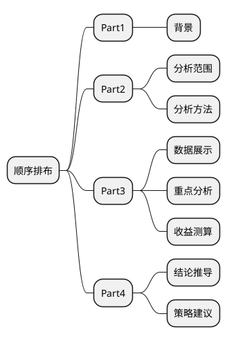

# 交易分析

课堂目标
1、掌握常⻅指标的含义和缩写
2、掌握分析报告的基本要求
3、了解分析报告常⽤方法论
4、学会做常规的交易分析

## Part1：预备知识
1、各种常⻅见APP类型
[App Store 全球榜单一览 - 苹果应用商店|榜单排名|下载量|排行榜|热门应用 - 七麦数据](https://www.qimai.cn/rank/globalrank/date/2019-12-28/genre/6005/device/iphone/area/0/brand/free)

- 购物类

- 社交类

- 旅游类

- 财务类

- 地图类

- 新闻类

- 娱乐类

- 教育类

- 工具类

- 图书类

- 效率类

2. 各种常⻅见核⼼心指标

| 主题  | 指标                                     |
| ----- | ---------------------------------------- |
| 交易  | 易交易易额、订单量量                        |
| 流量  | 量DAU                                     |
| ⽤用户 | 交易易⽤用户数、新客数                     |
| 供给  | 在线商户/商品数、动销商户/商品数、动销率 |
| 成本  | 补贴额、补贴率                           |
| 收⼊   | 入⽑毛收⼊入、⽑毛利利率                     |

3. 常⻅见缩写说明

| 缩写 | 说明                                                                                                                                        |
| ---- | ------------------------------------------------------------------------------------------------------------------------------------------- |
| GMV  | Gross Merchandise Volum，交易易额。                                                                                                          |
| DAU  | Daily Active User，⽇日活⽤用户（拓拓展：MAU——⽉月活⽤用户）。                                                                                   |
| APRU | Average Revenue Per User，⼈人均收⼊入（⼈人均交易易额）。                                                                                      |
| CPC  | Cost Per Click，每次点击付费⼴广告。                                                                                                         |
| CPM  | Cost Per Mille，每千⼈人成本，⼴广告投放过程中，听到或者看到某⼴广告的每⼀一⼈人平均分担到多少⼴广告成本。                                        |
| CPR  | Cost Per Response，每回应成本，以浏览者的每⼀一个回应计费。                                                                                  |
| CPP  | Cost Per Purchase，每购买成本，⼴广告主为规避⼴广告费⽤用⻛风险，只有在⽹网络⽤用户点击⼴广告并进⾏行行在线交易易后，才按销售笔数付给⼴广告站点费⽤用。 |
| YOY  | Year-on-Year percentage，年年同⽐比增⻓长率，今年年当期/去年年同期-1。                                                                           |
| WOW  | Week-on-Week percentage，周环⽐比增⻓长率，当周/上周-1。                                                                                      |
| MOM  | Month-on-Month percentage，⽉月环⽐比增⻓长率，当⽉月/上⽉月-1。                                                                                 |
| MTD  | Month To Date，当⽉月迄今                                                                                                                    |
| YTD  | Year To Date，当年年迄今                                                                                                                     |
| LTV  | Life Time Value，⽣生命周期总价值，客户终⽣生价值，是公司从⽤用户所有的互动中所得到的全部经济收益的总和。                                      |
| CAC  | Customer Acquisition Cost，⽤用户获取成本，即你花多少钱获取了了⼀一个新⽤用户。                                                                 |

## Part2：分析报告编写的总体要求

1. Take away in 5 minutes
确保报告的阅读者，可以通过3-5分钟的阅读，获得⼀一些对其⼯工作有价值的观点和建议！
2. Never make your boss think
⽤用最精简、没有歧义的⽅方式来阐释你的观点，不不要让你⽼老老板来费⼼心理理解、推测你要表达的内容！
3. Think complex,speak simple
不不管你准备了了多少working paper，只把最相关、最有价值的部分写到你的报告中！
4. One piont in one page/section
每⼀页PPT或每⼀一段⽂文字都只表达⼀一个观点，太多的内容只会将有⽤用的信息淹没！
编写商业分析报告要有“同理理⼼心”，要站在听众的⻆角度来思考问题！！

## Part3：不不同分析师的⽇日常对⽐比

1、⽇日常对话篇
【场景1】
业务同学A：帮我取下这⼏几个数好吗？ 
⼩小菜：好的。哪⼏几个数呢？ 
业务同学A：X，xx，XXX，xxxx，
XXXX，…… (维度+指标) 过了了2个⼩小时 
⼩小菜：数取完了了，excel发你。 过了了1个⼩小时 
业务同学A：你再帮我取个XXXXXXX数吧 
⼩小菜：好的 。
【场景2】
业务同学A：帮我取下这⼏几个数好吗？ 
⼩小⻅见：好的。哪⼏几个数呢？ 
业务同学A：X，xx，XXX，xxxx，
XXXX，…… 
⼩小⻅见：为什什么要取这些数呢？ 
业务同学A：为了了判断刚过去的⼗十⼀一，业绩表现怎么样？ 
⼩小⻅见：要看业绩，什什么业绩呢？时间是不不是应该这样选？ 这个维度是不不是应该更更细⼀一点，这个维度好像不不够 power，这个指标⽤用XX是不不是更更能体现真实情况呢？ 
业务同学A：好像是啊，balabala。 
⼩小⻅见：好的，那我们明天这个时间再碰⼀一下，我们定个会 议室。

2、看到数据后的反应
10⽉月10⽇日，⼩小六和⼩小七同时拿到⼀一份数据，数据是⼀一份产品7-9⽉月每⽇日⽇日报，包含众多结果和过程指标
【⼩小六】
内⼼心OS： 哇，有这么多数据，我要好好看看，把图都画出来，争取发现些什什么。 ⼩小六的结论： 1.GMV是XXX变化的 2.访购率是XXX变化的 3.⽤用户是XXX变化的
【⼩小七】
内⼼心OS： 有这么多数据，借机好好了了解下业务！ ⾸首先搞清楚业务变化趋势，然后再搞清楚为什什么会发⽣生这样的变化。
 ⼩小七的结论： 1.业务核⼼心指标，GMV是XXX的趋势，其中在7⽉月20号怎样，8⽉月18号怎么样，9⽉月1号怎样 2.7⽉月20⽇日，供给池做了了X优化，提升了了访购率和客单价；8⽉月18⽇日，排序策略略做了了Y优化，提升了了访购率；9⽉月1⽇日，列列表⻚页做了了Z优化，提升某区域的点击率，提升了了访购率 3.因此，影响GMV的因素主要是XYZ，但⽬目前T还存在XX问题，我们应该怎样

分析的误区：
1. 不不过问需求、不不讨论沟通，沦为提数⼯工具
2. 不不深⼊入了了解业务，为了了分析⽽而分析

## Part4：Bad case剖析

【案例例】
从⽤用户画像上看，主⼒力力⽤用户虽仍以未婚⽆无孩⼈人群和⾮非学⽣生群体为主，但未婚⽆无孩订单占⽐比从 55.5%下降为47.8%。其主要原因是由于学⽣生群体的流失。⽽而已婚有娃和已婚⽆无娃⼈人群⽤用户的增速相对偏⾼高，导致其订单占⽐比也从16.7%和27.2% 上升为19.8%和31.7%。可考虑暑期对增速相对更更快、占⽐比相对较⼤大的已婚有娃⼈人群进⾏行行重点关注。⽤用户占⽐比上，暑期学⽣生学⽣生订单占⽐比从16.7%下滑⾄至12.8%；未婚⽆无娃⽤用户仍为暑期消费主⼒力力，但相⽐比⾮非暑期，占⽐比下滑7.7%，已婚有娃⽤用户占⽐比上升⾄至31.7%，其中成都的未婚⽆无娃⽤用户明显偏⾼高，占⽐比57.1%，已婚有娃⽤用户明显偏低。从订单环⽐比增速上看，⼥女女性⽤用户⾼高于男性；在职业类别中，学⽣生⽤用户订单环⽐比增速最低，其中以⼴广州、上海海最为明显；已婚有娃类⽤用户保持较高增速，其中以苏州、杭州增⻓长优势较为明显，但重庆的未婚⽆无娃⽤用户增速⾼高于已婚有娃⽤户。

问题1：从⽤用户画像上看，主⼒力力⽤用户虽仍以未婚⽆无孩⼈人群和⾮非学⽣生群体为主，但未婚⽆无孩订单占⽐比从
55.5%下降为47.8%。
- 未婚⽆无孩⼈人群和⾮非学⽣生群体是有交叉重叠的，是两个⼝口径统计出来的数据，切记MECE原则。（Mutually Exclusive Collectively Exhaustive，中⽂文意思是“相互独⽴立，完全穷尽”）

问题2：未婚⽆无孩订单占⽐比从 55.5%下降为47.8%。其主要原因是由于学⽣生群体的流失。
- 未婚⽆无孩订单的下降与学⽣生群体的流失有没有直接关系？占⽐比下降有两种原因：第⼀一，⾃自⼰己做的不不
好；第⼆二，⾃自⼰己做得好，但是别⼈人涨得更更⾼高。所以要看有没有其他影响因素。

问题3：⽽而已婚有娃和已婚⽆无娃⼈人群⽤用户的增速相对偏⾼高，导致其订单占⽐比也从16.7%和27.2% 上升
为19.8%和31.7%。
- 什什么是偏⾼高？多少是偏⾼高？多少是偏低？如何判断？

问题4：未婚⽆无娃⽤用户仍为暑期消费主⼒力力，但相⽐比⾮非暑期，占⽐比下滑7.7%，已婚有娃⽤用户占⽐比上升⾄至31.7%。
- 前后逻辑混乱，看报告的⼈人必须前后呼应才能找到相应的数据。

问题5：从订单环⽐比增速上看，⼥性⽤用户⾼高于男性；在职业类别中，学⽣生⽤用户订单环⽐比增速最低，其中以⼴广州、上海海最为明显；已婚有娃类⽤用户保持较⾼高增速，其中以苏州、杭州增⻓长优势较为明显，但重庆的未婚⽆无娃⽤用户增速⾼高于已婚有娃⽤用户。
- 最后⼀一段话，要表达的意思是什什么，对看报告的⼈人的⼯工作有什什么样的指导意义？这个⼀一定要说清楚。

切记【五不不要】：
【不不要说⻤鬼话】：分析越详细越好，结论越简单越好，不不要炫技
【不不要忘了了起⽌止】：指标起于哪⾥里里，⽌止于哪⾥里里，别跑偏
【不不要⾯面⾯面俱到】：时间是最⼤大的成本，抓⼤大放⼩小
【不不要忘了了结论】：⼀一定要有结论，哪怕是正常的，或者不不做的
【不不要尽信数据】：数据很好，但是有时候也会说谎，敢于决策

## Part5：如何搭建分析报告的框架

- 撰写分析报告就像写好⼀一个故事⼀一样。

- 那我们撰写分析报告的时候常⽤用哪些分析⽅方法呢？

- 矩阵分析法

- 万能模板

## Part6：如何做好交易易分析

1. 利利⽤用⾃自动化报表做好交易易⽇日报监控

2. 交易分析案例解析

3. 推荐书籍

- 基础⼊入⻔门篇：涉及到理理论基础和分析⽅方法论，简单易易懂有趣。 《谁说菜⻦鸟不不会数据分析》《深⼊入浅出数据分析》《数据分析——企业的贤内助》 《⾚赤裸裸的统计学》
- 基础进阶篇：稍微深⼊入到业务场景，第⼀一本⼤大赞。 《数据化管理理》《精益数据分析》
- 逻辑思维：信息很多，不不会组织整理理，不不会据理理⼒力力争和吵架，相当于0。 《结构性思维》《⾦金金字塔原理理》《学会提问——批判性思维》《策略略思维》
- 进阶篇——数据分析与挖掘⽅方向：不不想深⼊入搞的话知道就好。 《商务与经济统计》《R语⾔言实战》《数据挖掘导论》
- 进阶篇——业务分析⽅方向（绝对的需要⼴广泛涉猎） 《商业的本质》《商业模式全史》《运营之光》

## 总结

1. 撰写分析的报告的时候铭记【五不不要】
2. 分析框架很关键，现有⻣骨骼，再填充⾎血⾁肉
3. 交易易分析的核⼼心是原因的拆解
4. 辅助⾃自动化⼯工具，提升分析效率

## 作业

根据⾃自⼰己所在的⾏行行业，搭建⼀一个交易易分析的报告框架。

# 行业分析

课堂⽬标
1、掌握⾏业研究的任务和目的
2、掌握⾏业分析报告的撰写步骤
3、通过案例剖析，学会如何写出优质的⾏业报告

## Part1：⾏行行业研究的任务和⽬目的

⾏行行业研究的主要任务：
1. 解释⾏行行业本身所处的发展阶段及其在国⺠民经济中的地位
2. 分析影响⾏行行业的各种因素以及判断对⾏行行业影响的⼒力力度
3. 预测⾏行行业的未来发展趋势
4. 判断⾏行行业经营和投资价值
5. 揭示⾏行行业经营和投资⻛风险

⾏行行业研究的⽬目的：
1. 为经营和投资者提供决策依据
2. 作为制定战略略规划的依据

⾏行行业研究对公司的价值：
1. 战略略定位
2. 战略略选择
3. 资源配置
4. 系统协调

## Part2：编写⾏行行业分析报告的步骤

编写⾏行行业分析报告的步骤：
第⼀一步：界定市场
第⼆二步：市场测算
第三步：产业链及业务模式分析
第四步：关键竞对分析
第五步：消费⽤用户分析
第六步：市场进⼊入策略略分析

编写⾏行行业分析报告的关键要点：
- 【数据的权威性】：政府报告=上市公司财报、发债公告>当事公司发布信息>⾏行行业研报
- 【市场规模测算】：测算模型的选择和与其他信息源的交叉验证
- 【产业链及竞争对⼿手分析】：财报，公关稿，供应商调研，内部⼈人员访谈
- 【市场进⼊入策略略分析】：设定科学的市场进⼊入策略略评估模型，结合场景分析法制定相应策略略

## Part3：旅游⾏行行业分析报告案例例分析

报告框架：
本篇报告——《中国在线旅游度假市场研究报告》分五部分：
1. 交易分析
   1. Part1：预备知识
   2. Part2：分析报告编写的总体要求
   3. Part3：不不同分析师的⽇日常对⽐比
   4. Part4：Bad case剖析
   5. Part5：如何搭建分析报告的框架
   6. Part6：如何做好交易易分析
   7. 总结
   8. 作业
2. 行业分析
   1. Part1：⾏行行业研究的任务和⽬目的
   2. Part2：编写⾏行行业分析报告的步骤
   3. Part3：旅游⾏行行业分析报告案例例分析
   4. 报告详解：
      1. 第⼀一部分：中国在线旅游市场发展态势总论（总论，当前形势）
      2. 第⼆二部分：中国在线旅游度假市场分析（分论，详细拆解）
      3. 第三部分：中国在线旅游度假市场运营指标分析（补充分析）
      4. 第四部分：中国在线旅游度假市场热点及趋势分析（未来形势分析）
      5. 第五部分：案例研究（案例例分析）
   5. 总结
   6. 作业
3. 运营分析
   1. Part1：运营的基础知识
   2. Part2：数据分析师如何辅助运营团队
   3. Part3：如何进⾏行行运营数据监控
   4. Part4：如何进⾏行行ABtest试验效果分析
   5. Part5：如何进⾏行行活动效果分析
4. 产品分析
   1. Part1：产品的基础知识
   2. Part2：数据分析师如何辅助产品团队
   3. Part3：通过数据埋点获取⾏行行为数据
   4. Part4：竞品产品功能对⽐比案例例
5. ⽤户分析
   1. Part1：⽤户画像
   2. Part2：⽤用户⽣生命周期
   3. Part3：⽤用户分层
6. 流量分析
   1. Part1：流量量分析基础知识
   2. Part2：流量分析案例
7. 就业指导
   1. 十万个为什么之面试篇 十万个为什么之面试篇
      1. 如何撰写、投递简历
      2. 面试后该做什么
      3. 如何度过试用期
   2. 十万个为什么之职场篇
      1. 求职礼仪、职场礼仪
      2. 劳动法及相关事宜
      3. 职业规划
      4. 职业素养

## 报告详解：

### 第⼀一部分：中国在线旅游市场发展态势总论（总论，当前形势）

**容易易犯错的点：**
- 误以为同⽐比增⻓长率下降是不不好的趋势

**可优化的点：**
- 如果想更更好的表现趋势在上涨，可以采⽤用折线图中添加趋势线
- 需要同⽐比数据

**错误的地⽅方：**
- 环⽐比增⻓长率有问题

**错误的地⽅方：**
- 【先增⻓长后下降】结论不不够有说服⼒力力，怀疑数据本身
- 环⽐比增⻓长率有问题

**可优化的点：**
- ⽤用UV来替换PV
**错误的地⽅方：**
- 移动端增⻓长的原因缺乏合理理性

**可优化的点：**
- 标题与内容偏差较⼤大
- 什什么是⾮非标准住宿，概念没有交代清楚

### 第⼆二部分：中国在线旅游度假市场分析（分论，详细拆解）

**可优化的点：**
- 传统旅⾏行行社持续增⻓长的原因分析不不够有说服⼒力力
**错误的地⽅方：**
- 环⽐比说成同⽐比

**突出的地⽅方：**
- ⽤用多个实例例证实结论
- 排版优质，没有感觉⽂文字多到不不舒服

**突出的地⽅方：**
- ⽤用流程图说明每个环节

**突出的地⽅方：**
- 使⽤用了了规模占⽐比的趋势图，更更好佐证未来
**错误的地⽅方：**
- 把环⽐比说成同⽐比

**可优化的点：**
- 右侧图形的使⽤用与结论的映射不不够明显

**可优化的点：**
- 调整本⻚页内容在整个报告中的位置
- 分类⽅方式与后⽂文不不匹配

**可优化的点：**
- 多次出游⽤用户数量量的增加与⾃自助游⽐比例例提升是否有必然联系？

**可优化的点：**
- 跟团游形式出游对⾸首次出游⽤用户依然是重要⽅方式的结论是怎么判断出来的？

**突出的地⽅方：**
- 不不仅说明了了排序，还解释了了其业务形态

**可优化的点：**
- 出境游市场份额略略有提升，为什什么还要说出境游决策受到⼀一定影响
持

**可优化的点：**
- 其他占⽐比那么多，却只字未提

**可优化的点：**
- 同质内容过多的时候会引起看报告的⼈人⽆无法获得更更多信息

**可优化的点：**
- 不不同OTA的核⼼心竞争⼒力力是什什么？

### 第三部分：中国在线旅游度假市场运营指标分析（补充分析）

**可优化的点：**
- ⽉月度覆盖⼈人数的含义是什什么？
- 较去年年⼤大幅增⻓长，那去年年是多少，今年年涨了了多少？
- 结论重点不不够突出

**错误的地⽅方：**
- 次数写成⼈人数
- 可优化的点：
- 同质信息过量量，可换个⻆角度分析，⼈人均访问次数有没有差异？

### 第四部分：中国在线旅游度假市场热点及趋势分析（未来形势分析）

**突出的地⽅方：**
- 有信息，有点评

**突出的地⽅方：**
- 优质排版，学会利利⽤用图形说明

### 第五部分：案例研究（案例例分析）

** 可优化的点：**
- 没有三个案例例企业的差异对⽐比
- 分析的维度没有做归⼀一处理理

## 总结

1、学会收集⾏行行业的数据
2、避免发⽣生报告中的细节错误
3、学会PPT的排版设计
4、报告的框架要符合逻辑

## 作业

1. 改写案例中的分析报告。
2. 撰写⼀篇⾃自⼰己所在⾏业的⾏行业分析报告。

# 运营分析

## Part1：运营的基础知识

1. 什什么是运营
运营就是洞洞察产品所处的不不同阶段和⽤用户需求，通过整合资源找到有效的⽬目标⽤用户实现阶段性业务⽬目标，从⽽而实现最终的商业价值。

2. 运营的种类
- ⽤用户运营
- 商户运营
- 活动运营
- 内容运营

3. 运营的⼯工作内容
- 管理理并运营公司产品社会化媒体平台，如微信、社群等
- 负责⽇日常发布内容的素材搜集、内容策划、⽂文案撰写
- 对线上活动有创新，能提⾼高⽤用户的活跃度和粘度
- 快速响应社会、娱乐等⽹网络热点话题，擅⻓长借势造势，完成热点营销事件的策划和执⾏
- 建⽴立有效的新媒体运营体系提升⽤用户的活跃度，增加品牌的知名度和美誉度

## Part2：数据分析师如何辅助运营团队

1. 提供数据⽀支持
- ⽇日常活动的数据监控
- 主要运营位的数据监控
- 运营活动转化的数据监控
- 核⼼心指标的监控（新客数、交易易⽤用户数、⼈人均购买频次、ARPU、转化率、补贴额、ROI=GMV/补贴额）

2. 进⾏行行策略略试验
- 补贴⼒力力度试验
- 内容营销试验
- 运营位试验
- 推送时段试验

3. 活动效果分析
- 节假⽇日⼤大促效果分析
- 重点⽇日期⼤大促复盘
- 重点事件⼤大促效果分析

4. 寻找⽬目标⽤用户
- 新客特征分析
- ⽼老老客唤醒分析
- 优惠敏敏感度分析
- ⽤用户画像分析

## Part3：如何进⾏行行运营数据监控

1. KPI与完成情况

| 指标   | 2019-08-11 | MTD     | KPI     | 完成率 |
| ------ | ---------- | ------- | ------- | ------ |
| 新客数 | 123,123    | 234,234 | 888,888 | 26.4%  |
| ⽼客数  | 333,333    | 666,666 | 999,999 | 66.7%  |

2. 运营位数据监控

| 模块    | GMV     | 订单量量 | 下单⼈人数 | 客单价  | 笔单价  |
| ------- | ------- | ------- | --------- | ------- | ------- |
| 轮播位B | 1866063 | 719     | 707       | 2639.41 | 2595.36 |
| 拼购    | 1803302 | 718     | 710       | 2539.86 | 2511.56 |
| 搜索    | 1755159 | 682     | 677       | 2592.55 | 2573.55 |
| 活动B   | 1751090 | 693     | 685       | 2556.34 | 2526.83 |
| 轮播位A | 1747563 | 714     | 707       | 2471.8  | 2447.57 |
| 活动A   | 1673053 | 692     | 688       | 2431.76 | 2417.71 |

3. 流量来源监控

运营的⽬目标还是将⽤用户引向商品详情⻚页。所以如何判断哪种运营位对于引流更更有效，需要监控商品详情页的流量量来源。

4. 转化情况监控
漏漏⽃斗分析：通过转化率的情况，来判断每个环节的跳出率是否合理理，以及不不同运营活动的效率。

5. 重点活动监控

拼团活动详情：

砍价活动详情：

## Part4：如何进⾏行行ABtest试验效果分析

1. 运营常⻅见的ABtest
- 补贴⽅方式：200-20和300-30到底哪个更更好
- 触达⽅方式：PUSH和短信哪个点击率更更⾼高
- ⽂文案⽅方式：哪种⽂文案更更吸引⽤用户打开内容
- 推送时间：什什么时机给⽤用户推送转化率最⾼高
- 运营位：不不同运营位卖什什么品类的东⻄西效果最好

2. ABtest的注意事项
- 空⽩白组和对照组要符合样本相似性
- 每次对照仅有⼀一个变量量
- ⽆无偏性
- 随机性

3. 如何进⾏行行ABtest的结果分析

- 向 [0.2-0.4)的实验组 及 [0.5-1.0)的实验组A发放50减15抵⽤用券
- 向 [0.5-1.0)的实验组B发放50减10抵⽤用券
- 所有对照组均没有发放抵⽤用券

**【结论】：**
- 发放抵⽤用券对于[0.3-0.4)的⽤用户转化率提升最多
- 在补贴⾦金金额对⽐比的试验结果中可以看出，[0.5-1.0)的实验组A（50减15）和实验组B（50减10）下单率没有明显差异，但是实验组B的GMV要⾼高很多，建议以后在进⾏行行运营活动可对旅游偏好⾼高概率的⽤用户⽤用低⾯面额的抵⽤用券。

## Part5：如何进⾏行行活动效果分析

1. 活动效果分析的⽬目标
要解答三个核⼼心问题：
- 第⼀一：这次活动做得好不不好
- 第⼆二：预期⽬目标是否达成
- 第三：下⼀一次如何做得更更好

2. 活动效果分析的四⼤大步骤
- 第⼀一步，整体表现评估；
- 第⼆二步，预设⽬目标的达成情况；
- 第三步，运营活动的详细分析；
- 第四步，未来活动启示。

3. 活动效果分析报告的关键要点
- 分析框架的合理理性：围绕预期⽬目标设定分析框架，避免订书机式结构
- 从事实到观点：重要的不不是结果数字，⽽而是是否达成⽬目标、达成/未达成的根本原因挖掘，以及未来如何可以更更好达成
- 不不同业务团队的贯通分析：以⼀一条主线串串联起不不同⼯工作，并评估其彼此关联
- ⼯工作的闭环管理理：逐⼀一分析开展⼯工作的实际效果，进⾏行行总结和反思，并提出下⼀一次的⼯工作建议

4. 案例例解析

**总结**
1. 搭建运营指标体系的重要性
2. 设计好ABtest试验并会在数据中发现关键点
3. 注意活动分析报告的关键要点

**作业**
如果你是京东的分析师，你会怎么样搭建618的⼤大促复盘效果分析框架。

# 产品分析

**课堂⽬标**
1. 了了解产品的基础知识
2. 了了解分析师如何辅助产品团队
3. 掌握通过数据埋点获取⾏行行为数据
4. 掌握产品功能分析

## Part1：产品的基础知识

1. 什么是产品
规划、设计产品，对产品研发过程的控制，最终把产品“卖“出去的⼀一个过程。
- 产品定义
- 需求调研
- 业务建模
- 产品验收
- 线上运营

2. 产品的种类
- B端产品
- C端产品

3. 产品的⼯工作内容
- 定义产品业务的边界：即这个产品要解决什什么问题？这个产品不不解决什什么问题？
- 明确使⽤用价值：这个产品使⽤用的价值在哪？别⼈人为什什么要⽤用你的产品？
- 探索商业模式：这个产品究竟应该怎么挣钱？
- ⽤用户需求调研
- 竞品分析
- 设计产品原型图
- 产品测试验收与线上运营

## Part2：数据分析师如何辅助产品团队

1. 提供⽇日常数据⽀支持
- 产品功能的数据监控
- 功能异常的数据监控
- 核⼼心路路径的漏漏⽃斗监控

2. 进⾏行行ABtest试验
- 产品版本迭代试验
- 产品功能优化试验
- 产品⻚页⾯面样式调整试验

3. 竞品分析
- 竞对功能差异对⽐比分析

4. 产品发版&功能迭代效果分析
- 发版评估报告
- 功能迭代效果分析

## Part3：通过数据埋点获取⾏行行为数据

1. 什么是埋点
所谓“**埋点**”，是数据采集领域（尤其是⽤用户⾏行行为数据采集领域）的术语，指的是针对特定⽤用户⾏行行为或事件进⾏行行捕获、处理理和发送的相关技术及其实施过程。⽐比如⽤用户某个icon击次数、观看某个视频的时⻓长等等。

特别注意需要明确事件发⽣生时间点、判别条件，这⾥里里如果遇到不不清楚的，需要和开发沟通清楚，避免采集数据与理理想存在差异。例例如：期望采集某个app的某个⼴广告的有效曝光数，有效曝光的判别条件是停留留时⻓长超过1秒且有效加载出⼴广告内容。

2. 埋点的类型
**【客户端埋点】**
优点：
- 能够搜集⻚页⾯面展示、点击⾏行行为。
- 可以收集不不需要请求服务器器的数据，如⾳音乐的本地播放、⻚页⾯面停留留时⻓长等。
缺点：
- 由于数据上报需要⽹网络，当⽤用户产⽣生⾏行行为⽽而没有⽹网络时，则会延迟上报数据，影响数据的实时性。这点在⼯工具型产品上表现尤其强烈烈。
- 如果⽤用户删除⾃自⼰己的APP操作记录，或者⽆无⽹网连接时数据存储达到上限，则会造成数据丢失，影响数据的完整性。
- 当需要改变埋点时，需要更更新版本才⾏行行，但是会存在有些⽤用户不不更更新版本情况，影响数据质量量。

**【服务端埋点】**
优点：
- 实时性好：实时收集，数据很准确，不不存在延时上报。
- 变更更成本⼩小：当要改变埋点时，只要改变，上报数据就会改变。
- 能够收集不不在APP内发⽣生的⾏行行为，只要请求服务器器就⾏行行，⽽而客户端只能收集在客户端中的操作⾏行行为，如统计从其他APP引流的安装量量。
缺点：
- 不不能收集不不需要请求服务器器的数据。
- ⽤用户没联⽹网的时候不不能够采集数据。

3. 埋点案例例
以⼤大众点评APP增加【拍视频】功能为例例：
**第⼀一步：明确产品形态，梳理理数据需求**
a. 该功能的使⽤用情况（UV，PV，使⽤用过程漏漏⽃斗）。
b. ⽣生产的视频情况（视频数，视频的互动情况），是否能实现促进内容⽣生产带动社区氛围的⽬目标。
**第⼆二步：数据需求转化为指标&埋点，并与开发进⾏行行讨论**
a. 功能使⽤用UV、PV。
b. 对其他拍摄功能的影响。
c. 拍摄流程的转化漏漏⽃斗。
d. 视频的播放、点赞、评论、收藏的情况；
f. 视频归属的商户类型，明确⽤用户是否偏向于某个类型的拍摄；
**第三步：新版本上线**
按照预期进⾏行行数据分析，产品迭代复盘。数据分析过程，注意查看是否与预期相符，是否有优化点。

## Part4：竞品产品功能对⽐比案例例

1. 搜索结果列表⻚
【左】：
- 优惠标识显著
- 实时数据
- 距离标的数据更更符合场景
【右】：
- 榜单标签

2. 商品详情⻚（上部）
【左】：
- 距离数据的⽤用户体验更更加友好
- 查看房型按钮略略显多余
【右】：
- 有领券⼊入⼝口
- 榜单营销
- 可以⼀一键打⻋车抵达

3. 商品详情⻚（下部）
【左】：
- 有更更丰富的供给
- 设施服务图⽚片化，更更清晰
【右】：
- 酒店周边信息辅助

附录：
[【左】：](https://h5.m.taobao.com/trip/hotel/detail/detail.html?checkIn=2019-10-04&checkOut=2019-10-06&cityCode=110100&hid=0&shareId=copy_password&shid=10003775&ttid=201300%40travel_h5_3.1.0&_projVer=1.3.4#/)
[【右】：](https://i.meituan.com/awp/h5/hotel/poi/deal.html?poiId=295765&utm_term=AiphoneBgroupC10.1.401DcopyEpoiG0000000000000DC46ACD535DD4E75836D7035B204E355A15421612927173638720190818193704590&utm_source=appshare&utm_medium=iOSweb&utm_fromapp=copy&utm_sharesource=poi)

**总结**
1. 制定埋点规则来获得功能数据⾮非常关键
2. 功能对⽐比分析是产品分析的核⼼心

**作业**
对美团外卖APP和饿了了么APP进⾏行行产品功能对⽐比分析。

# ⽤户分析

**课堂⽬标**
1. 熟练掌握如何利利⽤用⽤用户画像做分析
2. 了了解⽤用户⽣生命周期
3. 了了解⽤用户分层

## Part1：⽤户画像

1. 什什么是⽤用户画像
根据⽤用户⼈人⼝口学特征、⽹网络浏览内容、⽹网络社交活动和消费⾏行行为等信息⽽而抽象出的⼀一个标签化的⽤用户模型。它的核⼼心⼯工作主要是利利⽤用存储在服务器器上的海海量量⽇日志和数据库⾥里里的⼤大量量数据进⾏行行分析和挖掘，给⽤用户贴“标签”，⽽而“标签”是能表示⽤用户某⼀一维度特征的标识，主要⽤用于业务的运营和数据分析。
2. ⽤户画像的作用

| 作用     | 说明                                                                                                                                                                                              |
| -------- | ------------------------------------------------------------------------------------------------------------------------------------------------------------------------------------------------- |
| 精准营销 | 在从粗放式到精细化运营过程中，将⽤用户群体切割成更更细的粒度，辅以短信、推送、邮件、活动等⼿手段，驱以关怀、挽回、激励等策略略。                                                                      |
| 了解用户 | 产品早期，产品经理理们通过⽤用户调研和访谈的形式了了解⽤用户。在产品⽤用户量量扩⼤大后，调研的效⽤用降低，这时候就可以辅以⽤用户画像配合研究。⽅方向包括新增的⽤用户有什什么特征，核心⽤户的属性是否变化等等。 |
| 数据应用 | 用户画像是很多数据产品的基础，诸如⽿耳熟能详的推荐系统、⼴广告系统，广告基于⼀一系列列⼈口统计相关的标签，性别、年年龄、学历、兴趣偏好、⼿手机等等来进⾏行行投放的。                                       |
| 数据分析 | 用户画像可以与业务层⾯面的数据结合，各类标签是多维分析的天然要素，辅助业务决策。                                                                                                                   |

3. ⽤用户画像的内容

| 分类     | 内容                                                                    |
| -------- | ----------------------------------------------------------------------- |
| ⼈口特征  | 性别、年年龄、出⽣生⽇日期、星座、地域、教育⽔水平、职业等                  |
| 社会特征 | 婚姻状况、家庭情况、收⼊入状况等                                         |
| 兴趣特征 | 兴趣爱好、使⽤用APP/⽹网站、浏览/收藏内容、互动内容、品牌偏好、产品偏好等 |
| 消费特征 | 购买频次、购买⾦金金额、购买品类、购买⼒水平、购买渠道、价格敏敏感度等  |

4. ⽤户画像的案例（⼀）

5. ⽤户画像的案例（二）

## Part2：⽤用户⽣生命周期

1. 什么是⽤用户⽣生命周期
⽤户的⽣生命周期，简单来说就是：⽤用户从开始接触产品到离开产品的整个过程。

**问题1：是否所有⽤用户都会经历完整的⽤用户⽣生命周期？**
答：不是。站在整个产品的⻆角度，因为⽤用户分布在不不同阶段，所以，可能会⾛走完⼀一个完整的⽣生命周期，也就是所说的引⼊入期、成⻓长期、成熟期、休眠期、流失期，⽐比如：注册-登录-活跃-付费-分享-流失。但是，作为个体⽤用户，⽤用户可能在引⼊入期之后就流失了了，⽐比如：⽤用户注册登录之后，因为新⼿手引导做的不不到位，⽤用户直接放弃使⽤用，直接进⼊入了了流失期。

**问题2：是否所有产品都需要管理理⽤用户⽣生命周期？**
答：不不是。从产品⽣生命周期来看，处于初创期的产品，由于资源不不⾜足，⽤用户量量级不不够，⼀一般可以不不做⽤用户⽣生命周期管理理。从产品的需求强烈烈程度和市场供应情况来看，需求越强烈烈，供应越稀缺的产品，越不用过多考虑做⽤用户⽣生命周期管理理。

2. 用户⽣命周期的作用

## Part3：⽤用户分层

1. 什么是⽤用户分层
所谓⽤用户分层，是⼀一种对⽤用户进⾏行行群组划分的⽅方法，通过分析⽤用户在产品内留留下的各种数据（⽐比如评论数据，转发数据，点赞数据等），根据不不同的分层定义将⽤用户划分成不同的层级。

2. RFM模型
RFM模型：按照R(Recency-近度）、F(Frequency-频度）和M（Monetary-额度）三个维度进⾏行行细分客
户群体。
- **近度R**：R代表客户最近的活跃时间距离数据采集点的时间距离，R越⼤大，表示客户越久未发⽣生交易，R越⼩小，表示客户越近有交易易发⽣生。R越⼤大则客户越可能会“沉睡”，流失的可能性越⼤大。在这部分客户中，可能有些优质客户，值得公司通过⼀一定的营销⼿手段进⾏行行激活。
- **频度F**：F代表客户过去某段时间内的活跃频率。F越⼤大，则表示客户同本公司的交易易越频繁，不不仅仅给公司带来⼈人⽓气，也带来稳定的现⾦金金流，是⾮非常忠诚的客户；F越⼩小，则表示客户不不够活跃，且可能是竞争对⼿手的常客。针对F较⼩小、且消费额较⼤大的客户，需要推出⼀一定的竞争策略略，将这批客户从竞争对⼿手中争取过来。
- **额度M**：表示客户每次消费⾦金金额的多少，可以⽤用最近⼀一次消费⾦金金额，也可以⽤用过去的平均消费⾦金金
额，根据分析的⽬目的不不同，可以有不不同的标识⽅方法。⼀一般来讲，单次交易易⾦金金额较⼤大的客户，⽀支付能⼒强，价格敏敏感度低，是较为优质的客户，⽽而每次交易易⾦金金额很⼩小的客户，可能在⽀支付能⼒力力和⽀支付意愿上较低。当然，也不不是绝对的。

通过RFM分析将客户群体划分成⼀一般保持客户、⼀一般发展客户、⼀一般价值客户、⼀一般挽留留客户、重要保
持客户、重要发展客户、重要价值客户、要挽留留客户等⼋八个级别。

**总结**
1. 可视化是做⽤用户画像分析的关键
2. 利利⽤用⽤用户⽣生命周期的特点进⾏行行策略略输出
3. 巧⽤用⽤用户分层发现业务问题

**作业**
结合之前学过的可视化，⾃自⼰己将各类图表都进⾏行行⽣生动处理理。

# 流量分析

**课堂⽬标**
1. 掌握流量量分析的重点内容
2. 了了解引流路路径、引流率、访购率
3. 了了解流量量与⽤用户结合分析

## Part1：流量量分析基础知识

1. DAU是第⼀一核⼼心
DAU常⻅见⼝口径是根据设备ID计算的，⽽而⾮非user_id。通常⼀一个电商、社交等APP，重点关注的C端流量量。
2. 流量量分析的重点内容

- ⾸页ICON⼊口：

- 搜索⼊口

- 猜你喜欢

- 运营位

- 核⼼流程

## Part2：流量分析案例

<说明：以淘宝APP中的⻜猪业务为例>
1. 业务流量⼊口分析
我们的业务流量量从哪来？
- 搜索⼊口
- 【⻜猪旅行】icon
- 猜你喜欢
- 旅游相关banner运营位

2. 业务流量引流漏斗
我们的业务流量要去哪？

3. 流量带来了了什么样的用户

4. 引流策略略

5. 流量时间差异

6. 流量分层

**总结**
1. 引流率分析是关键
2. 结合⽤用户特点做流量量分析
3. 巧⽤用分层提升流量量转化

**作业**
针对携程和⻜猪进⾏流量路径对⽐分析。

[结业数据分析报告--0802李冬强.pdf](https://github.com/ld269440877/images/blob/master/TransactionAnalysisNotebook/%E7%BB%93%E4%B8%9A%E6%95%B0%E6%8D%AE%E5%88%86%E6%9E%90%E6%8A%A5%E5%91%8A--0802%E6%9D%8E%E5%86%AC%E5%BC%BA.pdf?1578486444208)

[报告框架-8期1班-郝珺.pdf](https://github.com/ld269440877/images/blob/master/TransactionAnalysisNotebook/%E6%8A%A5%E5%91%8A%E6%A1%86%E6%9E%B6-8%E6%9C%9F1%E7%8F%AD-%E9%83%9D%E7%8F%BA.pdf)

# 就业指导

[就业指导-面试篇](https://github.com/ld269440877/images/blob/master/TransactionAnalysisNotebook/%E5%B0%B1%E4%B8%9A%E6%8C%87%E5%AF%BC-%E8%81%8C%E5%9C%BA%E7%AF%87.pdf?1578488940352)

[就业指导-职场篇](https://github.com/ld269440877/images/blob/master/TransactionAnalysisNotebook/%E5%B0%B1%E4%B8%9A%E6%8C%87%E5%AF%BC-%E8%81%8C%E5%9C%BA%E7%AF%87.pdf?1578488940352)

## 十万个为什么之面试篇 十万个为什么之面试篇

### 如何撰写、投递简历

1. 撰写、投递简历
2. 简历
3. 简历给谁看
4. 简历的作用
5. 简历的基本架构
6. 简历的基本模块有哪些呢 简历的基本模块有哪些呢 简历的基本模块有哪些呢 ？
7. 简历投递
8. 简历制作时三大禁忌 简
9. 简历怎么发？

-  面试技巧、入职准备

1. 了解目标公司
2. 面试礼仪
3. 自我介绍

- 各类面试应对策略

1. 电话面试
2. 单独面试
3. 集体面试
4. 无领导小组讨论
5. 常规面试流程
6. 技术&人力侧重点攻略
7. 5大面试危险信号：这样的公司千万不要去！
8. 人力资源问的一些问题
9. 面试常规问题解析和技巧
10. 电话面试中需要注意哪些问题

### 面试后该做什么

1. 面试后做记录-总结提升
2. 面试十忌
3. 面试被拒的原因
4. 入职前要搞明白的问题
5. 求职过程中遇到的问题
6. 入职须知

### 如何度过试用期

1. 试用期考核的点
2. 度过试用期的十大法则

## 十万个为什么之职场篇

### 求职礼仪、职场礼仪

### 劳动法及相关事宜

### 职业规划

### 职业素养