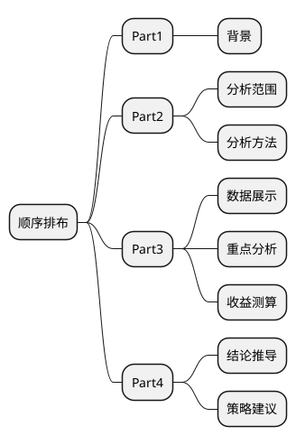

# 交易分析

课堂目标
1、掌握常⻅指标的含义和缩写
2、掌握分析报告的基本要求
3、了解分析报告常⽤方法论
4、学会做常规的交易分析

## Part1：预备知识
1、各种常⻅见APP类型
[App Store 全球榜单一览 - 苹果应用商店|榜单排名|下载量|排行榜|热门应用 - 七麦数据](https://www.qimai.cn/rank/globalrank/date/2019-12-28/genre/6005/device/iphone/area/0/brand/free)

- 购物类

- 社交类

- 旅游类

- 财务类

- 地图类

- 新闻类

- 娱乐类

- 教育类

- 工具类

- 图书类

- 效率类

2. 各种常⻅见核⼼心指标

主题|指标
-|-
交易|易交易易额、订单量量
流量|量DAU
⽤用户|交易易⽤用户数、新客数
供给|在线商户/商品数、动销商户/商品数、动销率
成本|补贴额、补贴率
收⼊|入⽑毛收⼊入、⽑毛利利率

3. 常⻅见缩写说明

缩写|说明
-|-
GMV| Gross Merchandise Volum，交易易额。
DAU |Daily Active User，⽇日活⽤用户（拓拓展：MAU——⽉月活⽤用户）。
APRU |Average Revenue Per User，⼈人均收⼊入（⼈人均交易易额）。
CPC| Cost Per Click，每次点击付费⼴广告。
CPM|Cost Per Mille，每千⼈人成本，⼴广告投放过程中，听到或者看到某⼴广告的每⼀一⼈人平均分担到多少⼴广告成本。
CPR |Cost Per Response，每回应成本，以浏览者的每⼀一个回应计费。
CPP|Cost Per Purchase，每购买成本，⼴广告主为规避⼴广告费⽤用⻛风险，只有在⽹网络⽤用户点击⼴广告并进⾏行行在线交易易后，才按销售笔数付给⼴广告站点费⽤用。
YOY| Year-on-Year percentage，年年同⽐比增⻓长率，今年年当期/去年年同期-1。
WOW| Week-on-Week percentage，周环⽐比增⻓长率，当周/上周-1。
MOM| Month-on-Month percentage，⽉月环⽐比增⻓长率，当⽉月/上⽉月-1。
MTD |Month To Date，当⽉月迄今
YTD |Year To Date，当年年迄今
LTV|Life Time Value，⽣生命周期总价值，客户终⽣生价值，是公司从⽤用户所有的互动中所得到的全部经济收益的总和。
CAC| Customer Acquisition Cost，⽤用户获取成本，即你花多少钱获取了了⼀一个新⽤用户。

## Part2：分析报告编写的总体要求

1. Take away in 5 minutes
确保报告的阅读者，可以通过3-5分钟的阅读，获得⼀一些对其⼯工作有价值的观点和建议！
2. Never make your boss think
⽤用最精简、没有歧义的⽅方式来阐释你的观点，不不要让你⽼老老板来费⼼心理理解、推测你要表达的内容！
3. Think complex,speak simple
不不管你准备了了多少working paper，只把最相关、最有价值的部分写到你的报告中！
4. One piont in one page/section
每⼀页PPT或每⼀一段⽂文字都只表达⼀一个观点，太多的内容只会将有⽤用的信息淹没！
编写商业分析报告要有“同理理⼼心”，要站在听众的⻆角度来思考问题！！

## Part3：不不同分析师的⽇日常对⽐比

1、⽇日常对话篇
【场景1】
业务同学A：帮我取下这⼏几个数好吗？ 
⼩小菜：好的。哪⼏几个数呢？ 
业务同学A：X，xx，XXX，xxxx，
XXXX，…… (维度+指标) 过了了2个⼩小时 
⼩小菜：数取完了了，excel发你。 过了了1个⼩小时 
业务同学A：你再帮我取个XXXXXXX数吧 
⼩小菜：好的 。
【场景2】
业务同学A：帮我取下这⼏几个数好吗？ 
⼩小⻅见：好的。哪⼏几个数呢？ 
业务同学A：X，xx，XXX，xxxx，
XXXX，…… 
⼩小⻅见：为什什么要取这些数呢？ 
业务同学A：为了了判断刚过去的⼗十⼀一，业绩表现怎么样？ 
⼩小⻅见：要看业绩，什什么业绩呢？时间是不不是应该这样选？ 这个维度是不不是应该更更细⼀一点，这个维度好像不不够 power，这个指标⽤用XX是不不是更更能体现真实情况呢？ 
业务同学A：好像是啊，balabala。 
⼩小⻅见：好的，那我们明天这个时间再碰⼀一下，我们定个会 议室。

2、看到数据后的反应
10⽉月10⽇日，⼩小六和⼩小七同时拿到⼀一份数据，数据是⼀一份产品7-9⽉月每⽇日⽇日报，包含众多结果和过程指标
【⼩小六】
内⼼心OS： 哇，有这么多数据，我要好好看看，把图都画出来，争取发现些什什么。 ⼩小六的结论： 1.GMV是XXX变化的 2.访购率是XXX变化的 3.⽤用户是XXX变化的
【⼩小七】
内⼼心OS： 有这么多数据，借机好好了了解下业务！ ⾸首先搞清楚业务变化趋势，然后再搞清楚为什什么会发⽣生这样的变化。
 ⼩小七的结论： 1.业务核⼼心指标，GMV是XXX的趋势，其中在7⽉月20号怎样，8⽉月18号怎么样，9⽉月1号怎样 2.7⽉月20⽇日，供给池做了了X优化，提升了了访购率和客单价；8⽉月18⽇日，排序策略略做了了Y优化，提升了了访购率；9⽉月1⽇日，列列表⻚页做了了Z优化，提升某区域的点击率，提升了了访购率 3.因此，影响GMV的因素主要是XYZ，但⽬目前T还存在XX问题，我们应该怎样

分析的误区：
1. 不不过问需求、不不讨论沟通，沦为提数⼯工具
2. 不不深⼊入了了解业务，为了了分析⽽而分析

## Part4：Bad case剖析

【案例例】
从⽤用户画像上看，主⼒力力⽤用户虽仍以未婚⽆无孩⼈人群和⾮非学⽣生群体为主，但未婚⽆无孩订单占⽐比从 55.5%下降为47.8%。其主要原因是由于学⽣生群体的流失。⽽而已婚有娃和已婚⽆无娃⼈人群⽤用户的增速相对偏⾼高，导致其订单占⽐比也从16.7%和27.2% 上升为19.8%和31.7%。可考虑暑期对增速相对更更快、占⽐比相对较⼤大的已婚有娃⼈人群进⾏行行重点关注。⽤用户占⽐比上，暑期学⽣生学⽣生订单占⽐比从16.7%下滑⾄至12.8%；未婚⽆无娃⽤用户仍为暑期消费主⼒力力，但相⽐比⾮非暑期，占⽐比下滑7.7%，已婚有娃⽤用户占⽐比上升⾄至31.7%，其中成都的未婚⽆无娃⽤用户明显偏⾼高，占⽐比57.1%，已婚有娃⽤用户明显偏低。从订单环⽐比增速上看，⼥女女性⽤用户⾼高于男性；在职业类别中，学⽣生⽤用户订单环⽐比增速最低，其中以⼴广州、上海海最为明显；已婚有娃类⽤用户保持较高增速，其中以苏州、杭州增⻓长优势较为明显，但重庆的未婚⽆无娃⽤用户增速⾼高于已婚有娃⽤户。

问题1：从⽤用户画像上看，主⼒力力⽤用户虽仍以未婚⽆无孩⼈人群和⾮非学⽣生群体为主，但未婚⽆无孩订单占⽐比从
55.5%下降为47.8%。
- 未婚⽆无孩⼈人群和⾮非学⽣生群体是有交叉重叠的，是两个⼝口径统计出来的数据，切记MECE原则。（Mutually Exclusive Collectively Exhaustive，中⽂文意思是“相互独⽴立，完全穷尽”）

问题2：未婚⽆无孩订单占⽐比从 55.5%下降为47.8%。其主要原因是由于学⽣生群体的流失。
- 未婚⽆无孩订单的下降与学⽣生群体的流失有没有直接关系？占⽐比下降有两种原因：第⼀一，⾃自⼰己做的不不
好；第⼆二，⾃自⼰己做得好，但是别⼈人涨得更更⾼高。所以要看有没有其他影响因素。

问题3：⽽而已婚有娃和已婚⽆无娃⼈人群⽤用户的增速相对偏⾼高，导致其订单占⽐比也从16.7%和27.2% 上升
为19.8%和31.7%。
- 什什么是偏⾼高？多少是偏⾼高？多少是偏低？如何判断？

问题4：未婚⽆无娃⽤用户仍为暑期消费主⼒力力，但相⽐比⾮非暑期，占⽐比下滑7.7%，已婚有娃⽤用户占⽐比上升⾄至31.7%。
- 前后逻辑混乱，看报告的⼈人必须前后呼应才能找到相应的数据。

问题5：从订单环⽐比增速上看，⼥性⽤用户⾼高于男性；在职业类别中，学⽣生⽤用户订单环⽐比增速最低，其中以⼴广州、上海海最为明显；已婚有娃类⽤用户保持较⾼高增速，其中以苏州、杭州增⻓长优势较为明显，但重庆的未婚⽆无娃⽤用户增速⾼高于已婚有娃⽤用户。
- 最后⼀一段话，要表达的意思是什什么，对看报告的⼈人的⼯工作有什什么样的指导意义？这个⼀一定要说清楚。

切记【五不不要】：
【不不要说⻤鬼话】：分析越详细越好，结论越简单越好，不不要炫技
【不不要忘了了起⽌止】：指标起于哪⾥里里，⽌止于哪⾥里里，别跑偏
【不不要⾯面⾯面俱到】：时间是最⼤大的成本，抓⼤大放⼩小
【不不要忘了了结论】：⼀一定要有结论，哪怕是正常的，或者不不做的
【不不要尽信数据】：数据很好，但是有时候也会说谎，敢于决策

## Part5：如何搭建分析报告的框架

- 撰写分析报告就像写好⼀一个故事⼀一样。

- 那我们撰写分析报告的时候常⽤用哪些分析⽅方法呢？

- 矩阵分析法

- 万能模板

## Part6：如何做好交易易分析

1. 利利⽤用⾃自动化报表做好交易易⽇日报监控

2. 交易分析案例解析

3. 推荐书籍

- 基础⼊入⻔门篇：涉及到理理论基础和分析⽅方法论，简单易易懂有趣。 《谁说菜⻦鸟不不会数据分析》《深⼊入浅出数据分析》《数据分析——企业的贤内助》 《⾚赤裸裸的统计学》
- 基础进阶篇：稍微深⼊入到业务场景，第⼀一本⼤大赞。 《数据化管理理》《精益数据分析》
- 逻辑思维：信息很多，不不会组织整理理，不不会据理理⼒力力争和吵架，相当于0。 《结构性思维》《⾦金金字塔原理理》《学会提问——批判性思维》《策略略思维》
- 进阶篇——数据分析与挖掘⽅方向：不不想深⼊入搞的话知道就好。 《商务与经济统计》《R语⾔言实战》《数据挖掘导论》
- 进阶篇——业务分析⽅方向（绝对的需要⼴广泛涉猎） 《商业的本质》《商业模式全史》《运营之光》

## 总结

1. 撰写分析的报告的时候铭记【五不不要】
2. 分析框架很关键，现有⻣骨骼，再填充⾎血⾁肉
3. 交易易分析的核⼼心是原因的拆解
4. 辅助⾃自动化⼯工具，提升分析效率

## 作业

根据⾃自⼰己所在的⾏行行业，搭建⼀一个交易易分析的报告框架。

# 行业分析

课堂⽬标
1、掌握⾏业研究的任务和目的
2、掌握⾏业分析报告的撰写步骤
3、通过案例剖析，学会如何写出优质的⾏业报告

## Part1：⾏行行业研究的任务和⽬目的

⾏行行业研究的主要任务：
1. 解释⾏行行业本身所处的发展阶段及其在国⺠民经济中的地位
2. 分析影响⾏行行业的各种因素以及判断对⾏行行业影响的⼒力力度
3. 预测⾏行行业的未来发展趋势
4. 判断⾏行行业经营和投资价值
5. 揭示⾏行行业经营和投资⻛风险

⾏行行业研究的⽬目的：
1. 为经营和投资者提供决策依据
2. 作为制定战略略规划的依据

⾏行行业研究对公司的价值：
1. 战略略定位
2. 战略略选择
3. 资源配置
4. 系统协调

## Part2：编写⾏行行业分析报告的步骤

编写⾏行行业分析报告的步骤：
第⼀一步：界定市场
第⼆二步：市场测算
第三步：产业链及业务模式分析
第四步：关键竞对分析
第五步：消费⽤用户分析
第六步：市场进⼊入策略略分析

编写⾏行行业分析报告的关键要点：
- 【数据的权威性】：政府报告=上市公司财报、发债公告>当事公司发布信息>⾏行行业研报
- 【市场规模测算】：测算模型的选择和与其他信息源的交叉验证
- 【产业链及竞争对⼿手分析】：财报，公关稿，供应商调研，内部⼈人员访谈
- 【市场进⼊入策略略分析】：设定科学的市场进⼊入策略略评估模型，结合场景分析法制定相应策略略

## Part3：旅游⾏行行业分析报告案例例分析

报告框架：
本篇报告——《中国在线旅游度假市场研究报告》分五部分：
1. 交易分析
   1. Part1：预备知识
   2. Part2：分析报告编写的总体要求
   3. Part3：不不同分析师的⽇日常对⽐比
   4. Part4：Bad case剖析
   5. Part5：如何搭建分析报告的框架
   6. Part6：如何做好交易易分析
   7. 总结
   8. 作业
2. 行业分析
   1. Part1：⾏行行业研究的任务和⽬目的
   2. Part2：编写⾏行行业分析报告的步骤
   3. Part3：旅游⾏行行业分析报告案例例分析
   4. 报告详解：
      1. 第⼀一部分：中国在线旅游市场发展态势总论（总论，当前形势）
      2. 第⼆二部分：中国在线旅游度假市场分析（分论，详细拆解）
      3. 第三部分：中国在线旅游度假市场运营指标分析（补充分析）
      4. 第四部分：中国在线旅游度假市场热点及趋势分析（未来形势分析&lt;/font）
      5. 第五部分：案例例研究（案例例分析）
   5. 总结
   6. 作业
3. 运营分析

## 报告详解：

### 第⼀一部分：中国在线旅游市场发展态势总论（总论，当前形势）

**容易易犯错的点：**
- 误以为同⽐比增⻓长率下降是不不好的趋势

**可优化的点：**
- 如果想更更好的表现趋势在上涨，可以采⽤用折线图中添加趋势线
- 需要同⽐比数据

**错误的地⽅方：**
- 环⽐比增⻓长率有问题

**错误的地⽅方：**
- 【先增⻓长后下降】结论不不够有说服⼒力力，怀疑数据本身
- 环⽐比增⻓长率有问题

**可优化的点：**
- ⽤用UV来替换PV
**错误的地⽅方：**
- 移动端增⻓长的原因缺乏合理理性

**可优化的点：**
- 标题与内容偏差较⼤大
- 什什么是⾮非标准住宿，概念没有交代清楚

### 第⼆二部分：中国在线旅游度假市场分析（分论，详细拆解）

**可优化的点：**
- 传统旅⾏行行社持续增⻓长的原因分析不不够有说服⼒力力
**错误的地⽅方：**
- 环⽐比说成同⽐比

**突出的地⽅方：**
- ⽤用多个实例例证实结论
- 排版优质，没有感觉⽂文字多到不不舒服

**突出的地⽅方：**
- ⽤用流程图说明每个环节

**突出的地⽅方：**
- 使⽤用了了规模占⽐比的趋势图，更更好佐证未来
**错误的地⽅方：**
- 把环⽐比说成同⽐比

**可优化的点：**
- 右侧图形的使⽤用与结论的映射不不够明显

**可优化的点：**
- 调整本⻚页内容在整个报告中的位置
- 分类⽅方式与后⽂文不不匹配

**可优化的点：**
- 多次出游⽤用户数量量的增加与⾃自助游⽐比例例提升是否有必然联系？

**可优化的点：**
- 跟团游形式出游对⾸首次出游⽤用户依然是重要⽅方式的结论是怎么判断出来的？

**突出的地⽅方：**
- 不不仅说明了了排序，还解释了了其业务形态

**可优化的点：**
- 出境游市场份额略略有提升，为什什么还要说出境游决策受到⼀一定影响
持

**可优化的点：**
- 其他占⽐比那么多，却只字未提

**可优化的点：**
- 同质内容过多的时候会引起看报告的⼈人⽆无法获得更更多信息

**可优化的点：**
- 不不同OTA的核⼼心竞争⼒力力是什什么？

### 第三部分：中国在线旅游度假市场运营指标分析（补充分析）

**可优化的点：**
- ⽉月度覆盖⼈人数的含义是什什么？
- 较去年年⼤大幅增⻓长，那去年年是多少，今年年涨了了多少？
- 结论重点不不够突出

**错误的地⽅方：**
- 次数写成⼈人数
- 可优化的点：
- 同质信息过量量，可换个⻆角度分析，⼈人均访问次数有没有差异？

### 第四部分：中国在线旅游度假市场热点及趋势分析（未来形势分析</font）

**突出的地⽅方：**
- 有信息，有点评

**突出的地⽅方：**
- 优质排版，学会利利⽤用图形说明

### 第五部分：案例例研究（案例例分析）

** 可优化的点：**
- 没有三个案例例企业的差异对⽐比
- 分析的维度没有做归⼀一处理理

## 总结

1、学会收集⾏行行业的数据
2、避免发⽣生报告中的细节错误
3、学会PPT的排版设计
4、报告的框架要符合逻辑

## 作业

1. 改写案例例中的分析报告。
2. 撰写⼀一篇⾃自⼰己所在⾏行行业的⾏行行业分析报告。

# 运营分析

