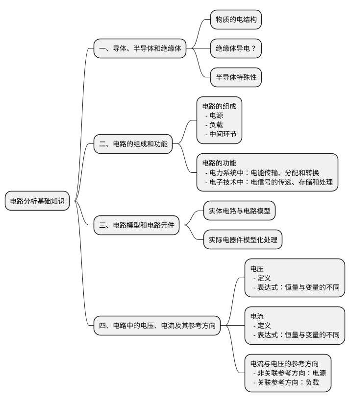
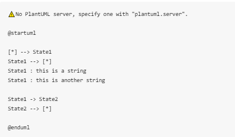
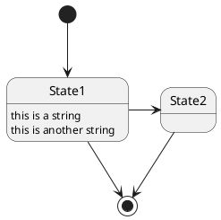
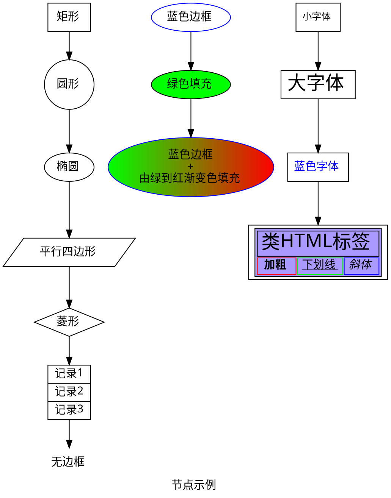

[toc]

```plantuml
@startmindmap
* 电路分析基础知识

** 一、导体、半导体和绝缘体
*** 物质的电结构
*** 绝缘体导电？
*** 半导体特殊性

** 二、电路的组成和功能
*** 电路的组成\n  - 电源\n  - 负载\n  - 中间环节
*** 电路的功能\n  - 电力系统中：电能传输、分配和转换\n  - 电子技术中：电信号的传递、存储和处理

** 三、电路模型和电路元件
*** 实体电路与电路模型
*** 实际电器件模型化处理

** 四、电路中的电压、电流及其参考方向
*** 电压\n  - 定义\n  - 表达式：恒量与变量的不同
*** 电流\n  - 定义\n  - 表达式：恒量与变量的不同
*** 电流与电压的参考方向\n  - 非关联参考方向：电源\n  - 关联参考方向：负载

@endmindmap
```

# nin

## hao

```plantuml
@startuml

[*] --> State1
State1 --> [*]
State1 : this is a string
State1 : this is another string

State1 -> State2
State2 --> [*]

@enduml
```
---

```dot
digraph node_intro {
	graph [label="节点示例 ", fontname="Microsoft Yahei"];
	node [fontname="Microsoft Yahei"];
	
	shape1 [shape=box, label="矩形 "];
	shape2 [shape=circle, label="圆形 "];
	shape3 [shape=ellipse, label="椭圆 "];
	shape4 [shape=polygon, sides=4, skew=0.4, label="平行四边形 "];
	shape5 [shape=diamond, label="菱形 "];
	shape6 [shape=record, label="{记录1|记录2|记录3}"];
	shape7 [shape=none, label="无边框 "];
	shape1:s -> shape2 -> shape3 -> shape4 -> shape5 -> shape6 -> shape7;

	color1 [color=blue, label="蓝色边框 "];
	color2 [style=filled, fillcolor=green, label="绿色填充 "];
	color3 [color="#0000ff", style=filled, fillcolor="green:red", label="蓝色边框\n+\n由绿到红渐变色填充 "];
	color1 -> color2 -> color3;

	text1 [shape=box, fontsize=12, label="小字体 "];
	text2 [shape=box, fontsize=24, label="大字体 "];
	text3 [shape=box, fontcolor=blue, label="蓝色字体 "];
	text4 [shape=box, label=<
		<table bgcolor="#aa99ff" align="center">
			<tr>
				<td colspan="3" width="20"><font point-size="24">类HTML标签 </font></td>
			</tr>
			<tr>
				<td color="red"><b>加粗 </b></td>
				<td color="green"><u>下划线 </u></td>
				<td color="blue"><i>斜体 </i></td>
			</tr>
		</table>
	>];
	text1 -> text2 -> text3 -> text4;
}
```

