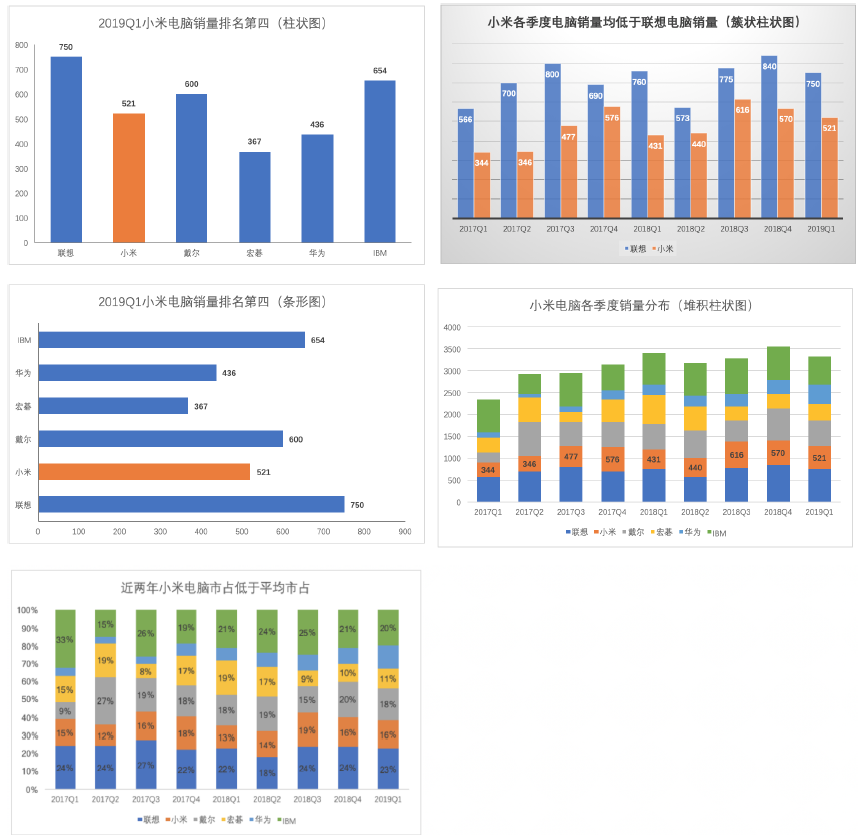
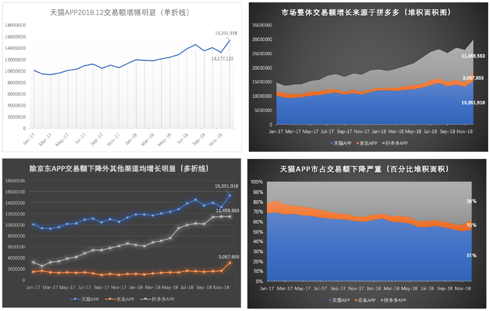
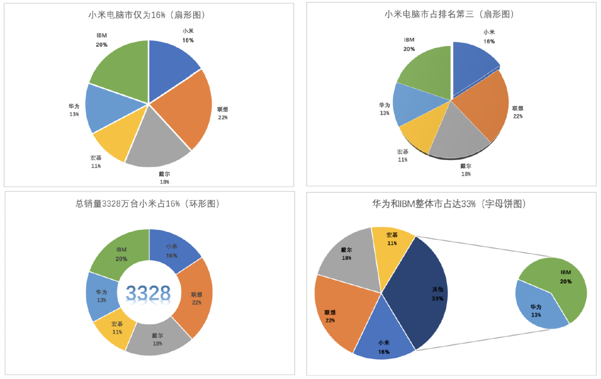
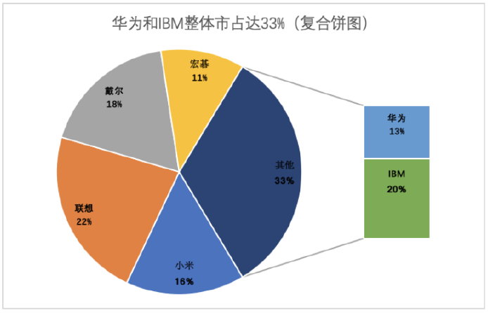
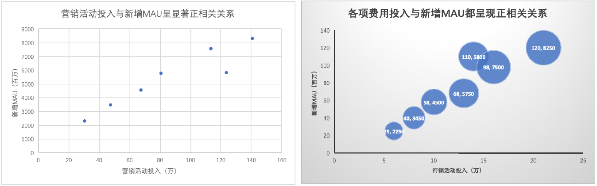
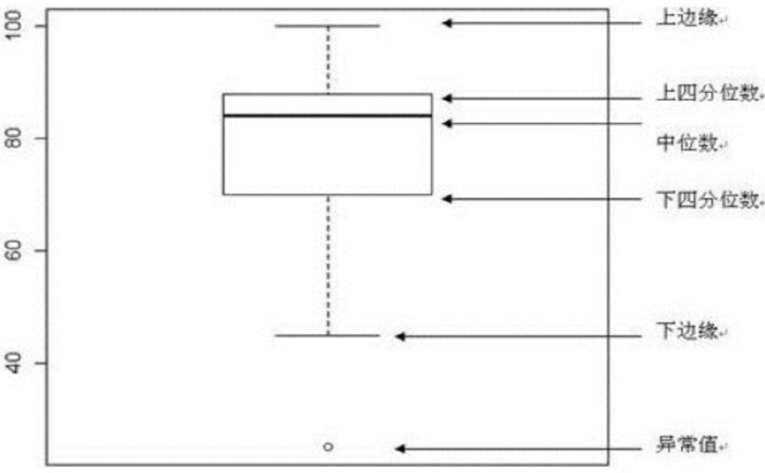
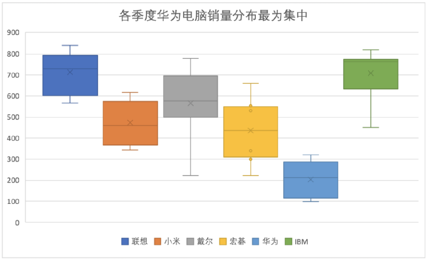

# excel 介绍与基本图形可视化
## 课前准备
- 安装office 2019版本。
- 了解excel中各作图功能区域，了解各功能模块的功能和操作方式。
    - <b>图表</b>选项功能区
        - 填充与线条
        - 效果
        - 大小与属性
        - 坐标轴选项
    - <b>文本</b>选项功能区
        - 文本填充与轮廓
        - 文字效果
        - 文本框
- 回忆生活和工作中遇到的图形主要有哪几类，分别可以用哪些图形来分析和展示这些数据问题。
## 课堂主题
本节主要通过excel常见图形可视化的讲解，带大家总结学习各可视化图形特征、适用场景及作图方法；譬如条形图、柱状图、折线图、散点图、饼图、环形图、箱线图等。
## 课堂目标
- 掌握各类可视化图形的特征和信息展示方式。
- 掌握excel作图功能区和相应操作实现。
- 掌握图形制作的基本流程和方法。
    - <b>图表的选择</b>：确定要表达的信息→确定相对关系→选择图表形式。
        - 从多个维度观察数据，明确要表达或分析的主题。
        - 明确要表达的数据之间的关系（突出重点）。
        - 梳理数据关系，并根据数据特征、数据关系选择合适的可视化图表。
    - <b>可视化实现</b>：选择数据，完成基本图形→调整大小比例→润色（颜色、网格线、背景色）→
增加图例坐标轴和标题。
- 了解工作中应用案例和可视化展示方案。

## 柱状图与条形图
### 图形简介：
- 柱状图是使用垂直的柱子显示类别之间的数值比较，其中一个轴（横轴）表示需要对比的分类维度，另一个轴（纵轴）表示相应维度下的数值。
- 条形图是柱状图的转置，工作中柱状图应用居多。
### 基础用法：
- 柱状图或条形图描述的是分类数据，回答的是每一类中“有多少？”的问题。
- 此外柱状图也可以用于展示时间序列数据； 
- 需要注意的是，当柱状图显示的分类很多时会导致分类名称重叠等情况，可以考虑用条形图代替。
> 柱状图主要展示对比差异，此外如果是时间序列可以看柱状图的趋势。
- 柱状图常用的几类图形：
  1. 单一柱状图：反映单一类别数据对比，或时序数据趋势
  2. 并列柱状图：展示两类及以上数据的对比，也可展示随时间的变化趋势。
  3. 堆叠柱状图(不建议分类超过5类，超过时可以选择最重要的分类，不重要归为"其他"处理)。
      1. 普通堆积柱状图：展示数据的内部结构分布。
      2. 百分比堆积柱状图：展示整体内部的相对分布。
### 常用图形：

## 折线图和面积图
### 图形简介
折线图用于显示数据在一个连续的时间间隔或时间跨度上的变化，它的特点是反映变量随时间或有序类别的变化趋势。
2.2 基础用法：
- 折线图中，数据是递增还是递减、增减的速率、增减的规律（周期性、螺旋性、随机性等）、峰值、凹值等特征都可以被清晰地反映。
- 折线图常用来分析数据随有序变量（时间）的变化趋势，也可用来分析多组数据随时间变化的相互作用和相互影响。例如可用来分析某类商品或是某几类相关商品随时间变化的销售情况，进而预测未来的销售业绩、分析GDP随年份的变化趋势等。
- 在折线图中，一般水平轴（横轴）用来表示时间或有序维度的推移，并且间隔相同；而垂直轴（纵轴）代表不同时刻和维度的数据的大小。
>特点：可以反映变量的周期性、趋势性、季节性、随机性等，通过折线可以对变量的趋势有全面的认知和预判。
- 折线图常用几类图形：
  1. 折线图
  2. 点线图
  3. 曲线图
  4. 变体面积图
     1. 普通堆积面积图：反映整体和整体中各部分随时间的变化趋势。
     2. 百分比堆积面积图：分析整体中各部分随着时间的占比变化趋势（类比堆积百分比柱状图）。

### 常用图形

## 饼图与环形图
### 简介
- 饼图或环形图用于显示分类数据中各类占整体的比例，用饼图或环形图的面积或弧长展示各类别占整体的多少，更多的用于展示静态分类数据(与时间序列数据区别)分布。
> 注意只能用各分类加总等于整体的数据类型，对于去重的数据不适用。
### 基础用法：
有饼图、环形图、二维饼图等多种类型，用饼图的面积或圆心角度大小代表相应的分类数据的数值大小。

>  饼图和环形图的主要缺点
>- 饼图不适用于多分类的数据，原则上一张饼图不可多于 6个分类，因为随着分类的增多，每个切片就会变小，最后导致大小区分不明显，每个切片看上去都差不多大小，这样会失去使用饼图的意义。所以饼图不适合分类很多的情况。
>- 相比于具备同样功能的其他图表（比如百分比柱状图、环图），饼图需要占据更大的画布空间。
>- 很难进行多个饼图之间的数值比较。

> 饼图和环形图小技巧
>- 超过6种的分类将不重要的归为“其他”一类。
>- 最重要的类别放在12点钟方向。
>- 同等重要就按照从大到小排列。
>- 环形图中间是空的，可以放置标签，整体数据、平均数值或其他内容等，其信息表达方式与饼图类似。
### 常用图形

## 散点图与气泡图
### 简介
散点图用来展示或探索变量之间的变化关系，也经常用来展示数据点在直角坐标系平面上的分布，散点图也可表示因变量随自变量的变化情况，通常在做拟合、回归时会先做散点图分析确定相应的拟合函数。
气泡图可用于展示三个变量之间的关系也可用于展示两个变量之间的关系。它与散点图类似，绘制时将 一个变量放在横轴，另一个变量放在纵轴，而第三个变量则用气泡的大小来展示（气泡的大小是用气泡的面积进行映射的，非半径）；**两变量时**，分类变量放在横轴，数值变量放在纵轴，气泡的大小和高度代表数值变量大小；气泡图也可用于分析数据之间的相关性。
### 基础用法：
散点图一般用于研究两变量的关系，对应的数据形式为(x, y)，
气泡图除了具备散点图的功能外，可以用气泡的面积映射到第三个维度数据，对应的数据形式为(x, y,z)，散点图多用于研究数据的分布规律和相关性，并不侧重描述具体每个数据点的取值。
### 常用图形

### 应用场景：
1. 关系数据探索（譬如年龄与平均手机使用时长散点图）。
2. 多变量映射，用于分析数据的相关性(譬如上面营销费用与DAU的关系)。
3. 和地图的结合使用，用于在地图上展示不同地区某些变量的度量大小等情况（较多）。
## 箱线图
### 简介
基础箱线图，又称盒须图、盒式图或箱型图，是一种用作显示一组数据分布情况的统计图。
### 基础用法

- 如果一个数据集中包含了一个或多个分类变量，同时分类变量对应的多个连续变量，那么可以用箱线图展示连续变量会如何随着分类变量的变化而变化，也可以展示不同分类变量下的数据分布结构。

- 箱线图用5个数字对分布进行概括，即一组数据的最大值、最小值、中位数、下四分位数和上四分位数。对于数据集中的异常值，通常会以单独的点绘制（异常值一般为较大或较小的个别值，一般为上下四分位点的1.5QR Inter-Quartile Range内距,）。

- 箱形图多用于数值统计，虽然相比于直方图和密度曲线较原始简单，但它不需要占据过多的画布空间，空间利用率高，非常适用于多组数据分布情况的比较。

### 应用场景
1. 对比各组数据的分布情况。
2. 检测数据中的异常点或者离群值。
## 总结
1. 上市互联网公司通用指标：
1. 交易额&订单量(加总)
2. DAU (Daily Active User) &MAU (Monthly Active User)去重
3. MTU(Monthly transaction user) &ATU(Annual transaction user) 去重，
### 数据类型总结：
1. 趋势型：变量的变化趋势，常见于时间序列数据。
2. 比例型：总体上各内部分布的比例。
3. 对比型：多组数据之间的对比，多用于分类数据或时间序列数据的对比。
4. 分布型：数据之间的分布情况，譬如单变量的分布（离散程度、集中趋势、偏峰度等）和多变量的关系分布。
5. 关联型：数据之间的互相关系，譬如分层关系、联结关系、包含关系等。
6. 地理型数据：多和地图和图表结合使用。
### 可视化过程中要注意的：
1. 可视化重要的不是可视化本身，而是如何通过恰当可视化展示传递出来数据信息。
2. 选择何种图形依赖于数据形式和分析者要传达出来的观点。
3. 可视化过程中遵循少量原则，一个图形中所表达的信息不要多于三部分。
## 作业
1. 将课件所讲到的几类excel图形动手重现，通过练习提升对图形的操作熟练程度；切忌眼高手低，一定要上手操作才会有真正的进步。
2. 对照今天所讲五类图形的特点和信息展现方式，思考三个平时自己遇到的数据问题，哪些是可以用今天掌握的图形来分析和展示，尝试做出来。

