# tableau介绍与基本图形可视化
## 课前准备
1. 下载及安装Tableau：
   1. 下载：https://www.tableau.com/zh-cn/products
   2. 安装：按照默认安装程序流程即可。
2. Tableau入门和介绍：
>1. What is Tableau?
>>1. tableau简介：
Tableau是一款定位于数据可视化敏捷开发和实现的商务智能展现工具，可以实现交互的、可视化的分析和仪表板应用，从而帮助企业快速地认识、理解和分析业务，以应对快速变化的市场环境带来的挑战。
>>2. 主要特性：
>>>1. 高效性：Tableau通过内存数据引擎，可以直接查询外部数据，还可以动态地从数据仓库抽取数据，实时更新连接数据，大大提高数据访问和查询和分析的效率。
>>>2. 简单易用：不需要技术背景和专业统计知识，容易上手；交互可视化界面友好，操作简单。
>>>3. 可连接多种数据源：包括带分隔符的文本文件、Excel文件、SQL数据库、Oracle
数据库和多维数据库等。允许用户把多个不同数据源结合起来使用，轻松实现数据
融合。
>>3. 产品体系：
>>>1. 制作报表、视图和仪表板的桌面端设计和分析工具Tableau Desktop。
>>>2. 适用于企业部署的Tableau Server产品。
>>>3. 适用于网页上创建和分享数据可视化内容的完全免费服务产品Tableau Public。
>2. How to use Tableau？
>>1. Tableau工作区是制作工作表、设计仪表板、生成故事、发布和共享工作簿的工作环境。
>>>1. 工作表（work sheet）：又称视图，是可视化分析的基本单元。
>>>2. 仪表板（dashboard）：是多个工作表和一些对象（eg：图像、文本、网页和空白等）的组合，按照一定方式对其进行组织和布局，以揭示数据关系和内涵。
>>>3. 故事（story）：是按顺序排列的工作表或仪表板的集合，故事中各单独的工作表或仪表板称为“故事点“，以故事方式揭示各种事实之间的上下文或者事件发展关系。
>>2. 关于Tableau的数据
>>>1. Tableau连接数据后，会将数据显示在工作区的左侧，称为数据窗口，见下图框出部分。
>>>2. 数据窗口的顶部是数据源窗口，其中显示的是连接到Tableau的数据源；
>>>3. 数据源窗口下方是维度窗口和度量窗口，分别用来显示导入的维度字段和度量字段（Tableau将数据表中的一列变量称为字段）。

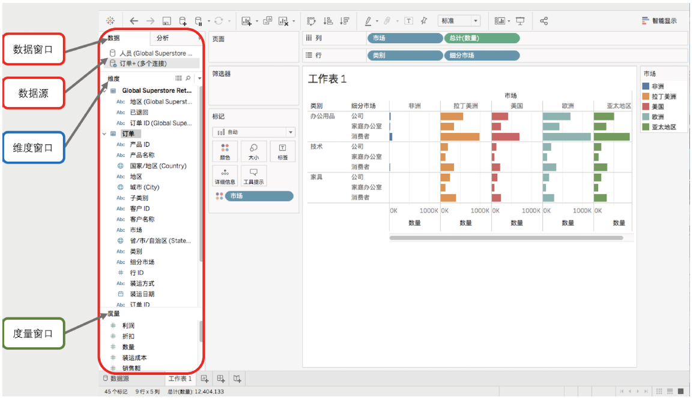
- <b>维度窗口</b>显示的数据角色是维度，表示分类、事件方面的定性分类字段，以蓝色显示。将其拖放到功能区，Tableau不会对其进行计算，而是对视图进行划分或分割或者颜色标记等
- <b>度量窗口</b>显示的数据角色是度量值，表示数值字段。以绿色显示。将其拖放到功能区，Tableau默认会进行聚合运算，同时，视图区产生相应的轴。离散和连续是另一种角色分类，在Tableau中，蓝色是离散字段，绿色表示连续字段。两者可以相互转换。
>>3. 创建工作表（视图）
>>>- 下图展示了Tableau创建视图的功能区和视图区。
>>>     - 红色范围是创建视图的主要功能区，其中左边是卡功能区，从上至下依次是页面卡、筛选器卡、标记卡，标记卡包含了许多小的按钮如颜色、大小、标签、详细信息等；上方红色框部分为行列功能区，将数据窗口中的字段拖放至此处就会在视图区显示相应的轴或标题。
>>>     - 黑色框部分是视图区，当我们使用卡和行列功能区进行操作时，图形的变化就会显示在视图区。
>>>     - 另外如果想新创建一个工作表、dashboard或者story，可以点击黄色框相应区域。

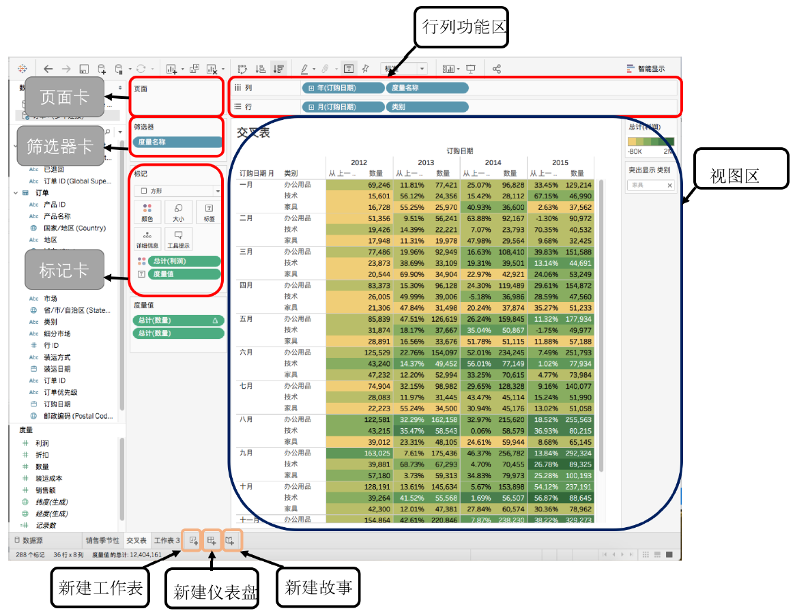
>>4. 创建仪表板
>>>- 完成所有工作表的视图后，我们便可以将其组织在dashboard中了。
操作方法：将创建好的工作表拖放到右侧排版区，按照一定的逻辑和布局排版好即可。

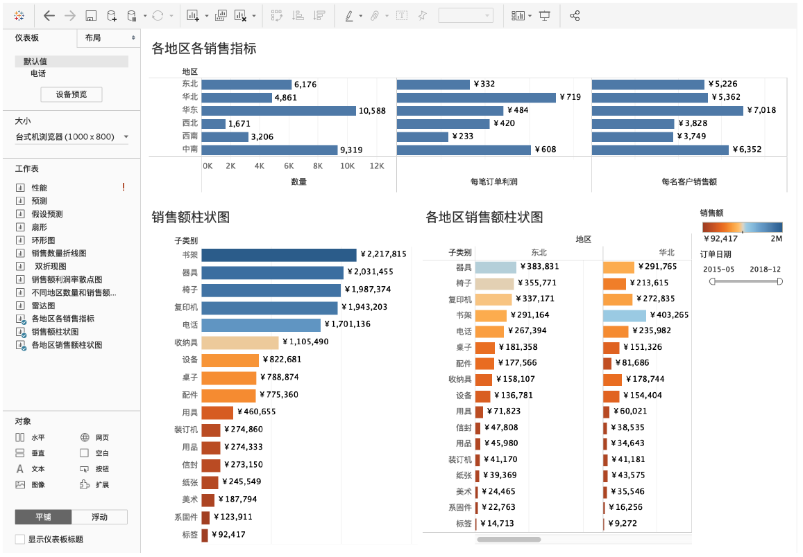
## 课堂主题
在excel课程的基础上带领大家复习各类常用图形的信息展现方式和对应的应用场景，并掌握工作中常用图形条形图、柱状图、折线图、散点图、饼图、环形图、箱线图的tableau制作做法。
## 课堂目标
1. 掌握各类可视化图形的特征和信息展示方式。
2. 掌握tableau各作图功能区和对应的操作实现。
3. 掌握图形制作的基本流程和方法。
4. 深化理解各类型图表的展示特征和信息的表达形式。
5. 了解工作中的应用案例。
## 柱状图与条形图
柱状图是可视化中最常使用的图形，它可以有效地对比信息，凸显出高低、大小差异、与时序数据结合可以凸显趋势等。
###  何时使用
1. 比较不同类别的数量关系或反映时序数据的趋势。
2. 查看总体数据内部结构或结构的变化趋势。
###  使用技巧
1. 在dashboard上同时展示多个条形图。帮助浏览者略去翻页的步骤，迅速对比信息。
2. 在条形图上增加颜色，区分凸显对比效果。
3. 可以堆叠条形图去展示相关数据，便于更加深入分析。
### 常用图形
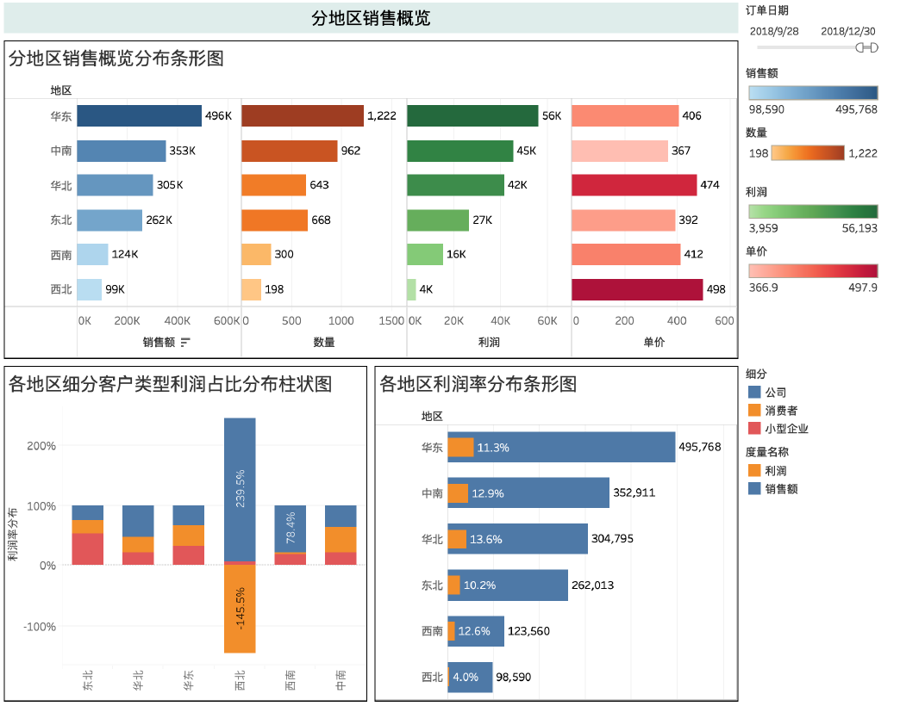

## 折线图与面积图
折线图连接单个数据点，主要能展示数据随时序的变化规律。
### 何时使用
1. 希望看到数据随时序的变化，找出高点、低谷、周期性、趋势性、异常点等。
例如：过去5年股票价格的变化；过去一个月网页点击量变化；过去三年内各月份的交易额变化规律；时序数据的规律性探索。
### 使用技巧
1. 与条形图结合，折线图体现随时间的变化，条形图给出每个时间格的具体数值。
2. 将折线图下方区域加阴影，当视图中有多个折线图时，阴影可以给出更多有效信息。
### 常用图形
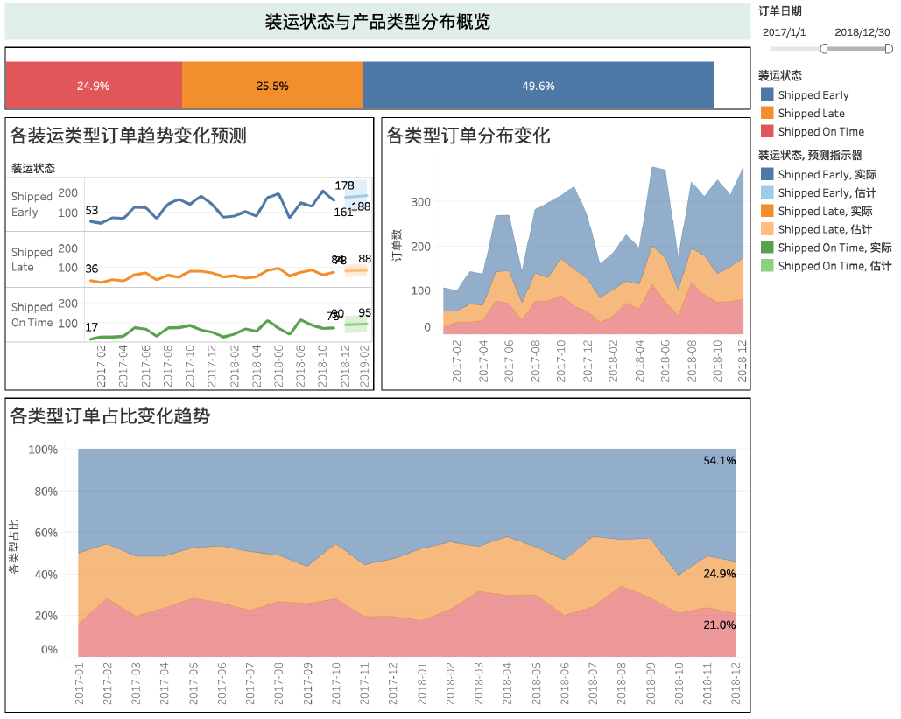
## 饼图和环形图
饼图和环形图用来展示整体中各类型数据的占比分布。
### 何时使用：
1. 凸显占比，反映整体数据的内部结构。
### 使用技巧：
1. 饼图和环形图的主要缺点：
   1. 饼图不适用于多分类的数据，原则上一张饼图**不可多于 6个分类**，因为随着分类的增多，每个切片就会变小，最后导致大小区分不明显，每个切片看上去都差不多大小，这样会失去使用饼图的意义。所以饼图不适合分类很多的情况。
   2. 相比于具备同样功能的其他图表（比如百分比柱状图、环图），饼图需要占据更大的画布空间。
   3. 很难进行多个饼图之间的数值比较。
2. 饼图和环形图小技巧：
   1. 超过6种的分类将不重要的归为“其他”一类。
   2. 最重要的类别放在12点钟方向。
   3. 同等重要就按照从大到小排列。
   4. 环形图中间是空的，可以放置标签，整体数据、平均数值或其他内容等，其信息表达方式与饼图类似。
### 常用图形
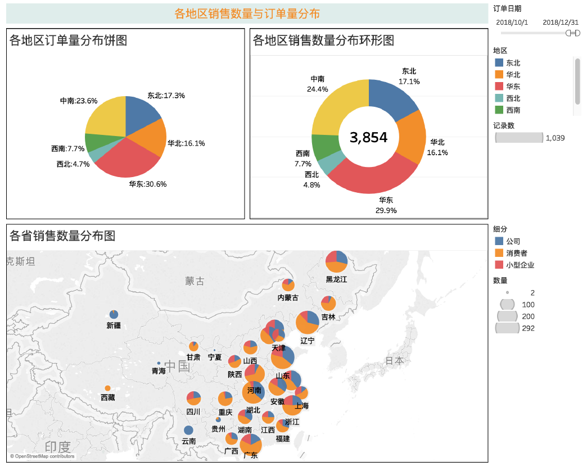

## 散点图与气泡图
### 何时使用：
1. 气泡图展示各分类数据的大小，散点图探索各不同变量之间的关系。
### 使用技巧：
1. 可以在散点图增加趋势线，以便更直观的发现规律。
2. 添加过滤器，从不同数据视角探索数据之间的关系。
3. 使用带有信息的标志类型。
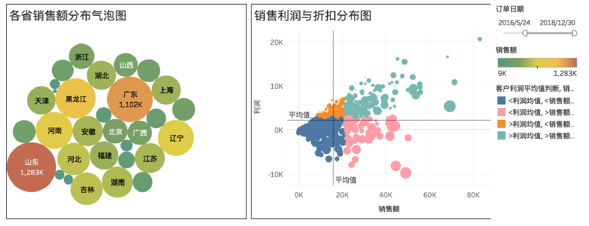

## 箱线图
### 何时使用
1. 探索各不同分类数据下数值型数据分布情况。
### 使用技巧
1. 可以将箱线图重合的散点打乱使得数据分布展示更直观。
2. 使用带有信息的标志类型使得分类数据更直观。
### 常用图形
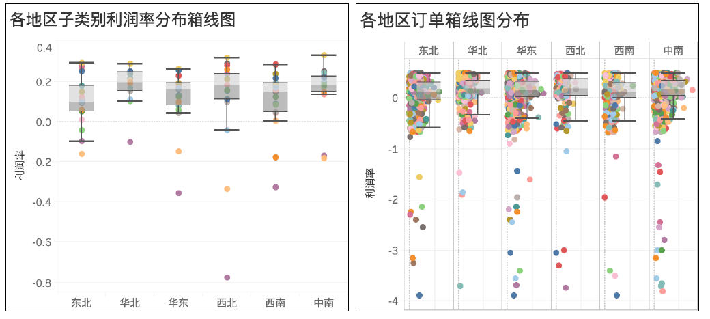
## Tableau图表总结
### 相比excel，tableau有哪些优点？
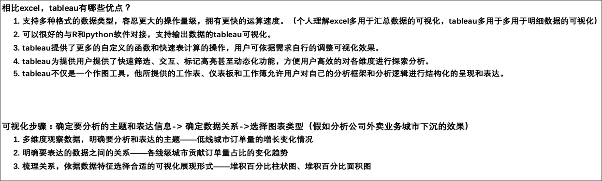
### 数据类型与图形选择
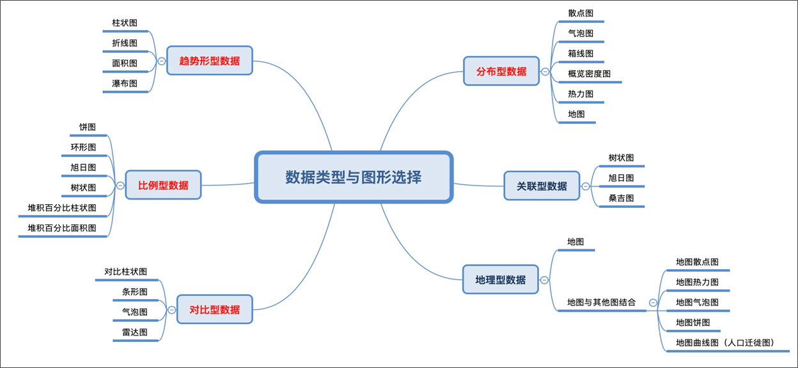
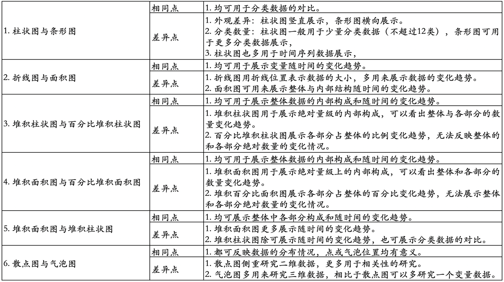

## 总结
1. 课程内容总结：
   1. 条形图柱状图多用于展示数据的对比和内部结构随时间变化，不同的探索目标对数据的要求也不一样。
   2. 折线图和体面积图多展示趋势变化，面积图多展示整体中各部分的分布和各部分占比变化趋势。
   3. 环形图是饼图类似，但环形图中间的圆环可以展示更多信息，相比饼图更美观也能展示丰富的信息，缺点是操作比饼图复杂，此外饼图也可与地图结合使用。
   4. 散点图主要研究变量之间的关系特征，与气泡图的主要区别为变量的数量和表现形式。
   5. 箱线图多用于对比多组数内部分布或用于找出各组数据的离群点和异常值。
2. 对比excel，tableau的可视化更加简单、灵活、高效；主要体现在几个方面：
   1. 对数据的操作量级更大、运算更快。
   2. tableau中提供了更多自定义的功能和插件，可以依据需求自行调整可视化效果。
   3. tableau的交互性能更便捷，可以添加任何筛选框、标记高亮等方式来进行友好交互。
   4. tableau的工作表、仪表板、故事的结构化呈现，更好的支持了结构化表达，为分析的故事性提供了更好的展现形式。
## 作业
1. 复习tableau各部分作用并尝试拖拽各功能键提升对各作图功能区的熟练和认知程度。
2. 针对课件中涉及到的5大类14个可视化图形重现，并做成相应的dashboard，尝试讲述完整的故事。
3. 找出超市数据中退货的订单在城市和地域上的分布，这些退货的订单在品类上是否有分布特征，是否退货的这些订单主要集中在个别客户上，尝试分析并选择相应的可视化图形展示，针对结论尝试提出降低退货率的建议。

